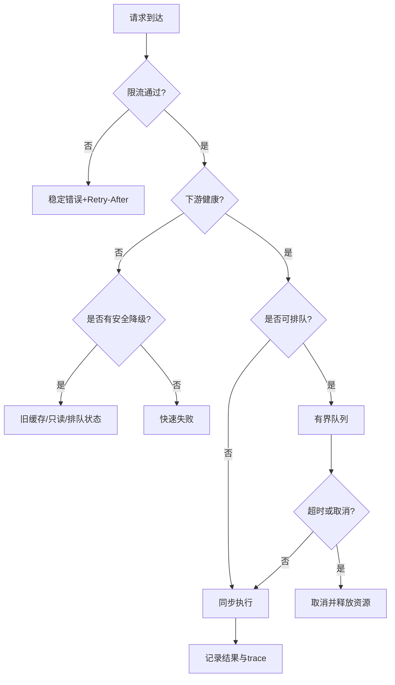

# 02 限流熔断背压与过载保护

> 知识成熟度：L2
> 适用范围：平台可靠性-限流熔断背压与过载保护
> 本文由《01-鉴权限流幂等灾备与可观测性》"三、API 网关、限流、降级与重试控制"拆分而来，正文逐字迁移。

## 元数据
- 最后更新：2026-08-13。
- 知识成熟度：L2。
- 适用范围：平台可靠性-限流熔断背压与过载保护。
- 知识基线：平台可靠性工程方案（非 UE 内置能力）；事实边界以原《01-鉴权限流幂等灾备与可观测性》对应章节为准。
- 拆分来源：原《01-鉴权限流幂等灾备与可观测性》"三、API 网关、限流、降级与重试控制"。

## 概述
网关是流量治理的第一道边界：按连接、请求、用户、业务资源四个维度限流，用令牌桶、漏桶、滑动窗口与并发信号量控制流量，并定义排队、降级、熔断与重试的失败行为。
本文给出示意限流配置、令牌桶伪代码和网关失败路径。
重试必须绑定总 deadline、退避、抖动和幂等条件，避免重试风暴。

### 1.1 四个限流维度

只按 IP 限流会误伤共享网络，也无法约束单个用户的业务洪峰。
建议至少评估连接、请求、用户、业务资源四个维度，再根据攻击面增加设备、租户、来源和服务账号维度。

| 维度 | 典型键 | 适用目标 | 主要盲点 |
| --- | --- | --- | --- |
| 连接 | listener、IP、device_id、connection_id | 防连接耗尽、握手洪峰 | 多用户共享 NAT 时误伤 |
| 请求 | route、method、来源、服务 | 防 API QPS 洪峰 | 不理解用户资产价值 |
| 用户 | account_id、session_id | 防单用户刷接口 | 未认证请求没有 account_id |
| 业务 | account_id+action、抽卡池、匹配队列、订单 | 防昂贵和敏感操作 | 需要业务定义成本 |
| 租户/区服 | tenant_id、shard_id | 保护大客户或区服隔离 | 配置复杂、易不均衡 |

限流键必须使用经过认证和规范化的值，不能让客户端自由提交一个任意 header 就绕过真实身份。
所有限流规则要有版本、来源、单位、窗口、超限动作和生效范围。

### 1.2 令牌桶、漏桶和滑动窗口

令牌桶（Token Bucket）以速率 r 产生令牌，桶容量 b 允许短时突发；请求消耗 cost 个令牌。
可接受的长期平均速率不超过 r，瞬时突发上限近似为 b/cost。
漏桶（Leaky Bucket）以固定服务速率出队，更适合把下游处理变得平滑，但会增加等待延迟。
滑动窗口（Sliding Window）按时间片统计最近窗口请求数，精度较好但需要更多计数存储。
固定窗口实现简单，但窗口边界可能产生两倍突发，不应直接用于高风险动作的唯一保护。

| 算法 | 优点 | 代价 | 推荐场景 |
| --- | --- | --- | --- |
| 令牌桶 | 支持可控突发、参数直观 | 需要可靠时间和原子更新 | 普通 API、登录、网关 |
| 漏桶 | 输出平滑、便于保护下游 | 排队会引入延迟 | 匹配、批处理、写入队列 |
| 滑动窗口 | 统计更贴近最近行为 | 存储和并发原子性更复杂 | 抽卡、支付、风控 |
| 并发信号量 | 直接限制同时执行数 | 不表达时间速率 | 数据库、外部依赖、房间服务 |
| 配额 | 适合日/月累计预算 | 需要周期结算 | 邮件、奖励、管理操作 |

### 1.3 令牌桶伪代码

```text
function take(bucket, now_ms, cost):
    state = atomic_read(bucket)
    elapsed = max(0, now_ms - state.last_ms)
    refill = elapsed * state.rate_per_ms
    tokens = min(state.capacity, state.tokens + refill)
    if tokens < cost:
        retry_after_ms = ceil((cost - tokens) / state.rate_per_ms)
        return Reject(retry_after_ms)
    next = {tokens: tokens - cost, last_ms: now_ms}
    if not compare_and_swap(bucket, state, next):
        return take(bucket, now_ms, cost)
    return Accept()
```

分布式限流的计数更新必须是原子的，时间基准应说明是单调时钟还是共享服务时间。
Redis、网关插件或自研限流器都只是实现选项；如果使用 Redis，应验证原子脚本、过期时间、主从切换和热点键行为。
可参考 [Redis Documentation](https://redis.io/docs/latest/) 的数据结构和原子操作文档，但不能把示例直接当成当前项目的部署事实。

### 1.4 示意限流配置

```yaml
rate_limits:
  login:
    dimensions:
      - key: source_ip
        algorithm: token_bucket
        rate_per_second: 5
        burst: 10
      - key: device_id
        algorithm: sliding_window
        limit: 30
        window_seconds: 60
    on_exceed: challenge_or_429
  inventory.write:
    dimensions:
      - key: account_id
        algorithm: token_bucket
        rate_per_second: 8
        burst: 12
      - key: route
        algorithm: concurrency
        limit: 200
    on_exceed: reject_with_retry_after
  matchmaking.enqueue:
    dimensions:
      - key: account_id
        algorithm: token_bucket
        rate_per_second: 1
        burst: 2
    on_exceed: return_existing_ticket
```

配置中的数字只是压测起点，不是通用标准。
上线前应通过正常峰值、异常峰值、单用户刷接口和多区服热点四组数据校准。

### 1.5 排队与降级

排队适用于可等待且可取消的任务，不能把所有请求无限放入队列。
队列必须有最大长度、单用户配额、过期时间、取消语义、优先级和拒绝策略。
登录、心跳、踢下线和风控阻断通常不应被低优先级批处理任务饿死。
抽卡、支付确认和货币扣减不能通过“先返回成功、以后慢慢写”来模拟成功。
只读排行榜、推荐和装饰性消息可以在依赖异常时返回带时间戳的旧缓存。
匹配可进入排队状态，但要返回 ticket_id 和状态查询协议。
降级响应必须区分“暂不可用”“排队中”“已接受但未完成”和“已完成”。



### 1.6 重试风暴与熔断

重试放大因子（Retry Amplification）可以近似为各层重试次数的乘积。
客户端、网关、RPC 客户端和消息消费者若分别重试 3 次，最坏可能造成 3×3×3 的下游尝试。
重试只适用于明确的瞬时错误、幂等请求或具备幂等键的请求。
每次重试必须继承总 deadline，不能为每层重新开启一个完整超时。
退避应包含抖动（jitter），否则所有客户端会同时再次冲击下游。
熔断器（Circuit Breaker）通常有 closed、open、half-open 三个状态。
open 状态快速失败并设置冷却时间；half-open 只允许有限探测请求。
熔断统计要按下游、方法、错误分类和版本切分，不能把用户 4xx 误算成依赖 5xx。

```text
function call_with_budget(request, deadline, idempotency_key):
    attempts = 0
    while attempts < MAX_ATTEMPTS:
        remaining = deadline - monotonic_now()
        if remaining <= 0:
            return Timeout()
        if circuit.is_open(request.dependency):
            return DependencyUnavailable()
        result = rpc.call(request, timeout=remaining, idempotency_key=idempotency_key)
        if result.success or result.permanent_error:
            circuit.record(result)
            return result
        attempts += 1
        sleep(min(backoff(attempts), remaining / 2) + jitter())
    return RetryExhausted()
```

RPC deadline、取消和重试的细节可参考 [gRPC Documentation](https://grpc.io/docs/)，但实际服务仍需定义自己的错误分类和业务幂等规则。

### 1.7 网关失败路径

| 失败路径 | 快速判断 | 默认动作 | 禁止动作 |
| --- | --- | --- | --- |
| 限流状态存储超时 | 原子计数无结果 | 高风险写 fail closed；低风险读按短本地预算 | 无限等待存储 |
| 路由发现为空 | 无可用实例 | 返回依赖不可用并告警 | 随机转发到未知版本 |
| 下游持续 5xx | 熔断指标越阈值 | open、采样日志、保护恢复 | 全量同步重试 |
| 队列已满 | 长度达到上限 | 拒绝或按优先级丢弃 | 无界增长 |
| 客户端重试旧请求 | 幂等键已完成 | 返回原结果 | 再执行一次写操作 |
| 代理连接断开 | 响应未知 | 由幂等查询确认状态 | 根据超时直接判定失败并补发 |

## 失败路径

网关失败路径与默认动作的完整表见本文"1.7 网关失败路径"，重试与降级的关键约束如下。

| 失败路径 | 快速判断 | 默认动作 | 禁止动作 |
| --- | --- | --- | --- |
| 限流状态存储超时 | 原子计数无结果 | 高风险写 fail closed；低风险读按短本地预算 | 无限等待存储 |
| 下游持续 5xx | 熔断指标越阈值 | open、采样日志、保护恢复 | 全量同步重试 |
| 队列已满 | 长度达到上限 | 拒绝或按优先级丢弃 | 无界增长 |
| 客户端重试旧请求 | 幂等键已完成 | 返回原结果 | 再执行一次写操作 |

## FAQ

### Q3：限流存储挂了，是否应该全部放行？

不应一刀切。高风险写入和认证入口通常应 fail closed 或进入挑战/排队，低风险只读可使用很短的本地预算和明确降级。
关键是把"限流不确定"作为可观测状态，而不是静默放行。

## 验收清单

- 限流至少评估连接、请求、用户、业务资源四个维度，再按攻击面增加设备、租户、来源和服务账号维度。
- 限流键使用经过认证和规范化的值，客户端自由提交的 header 不能绕过真实身份。
- 令牌桶支持可控突发，滑动窗口统计最近行为，并发信号量直接限制同时执行数。
- 分布式限流计数更新原子，时间基准说明是单调时钟还是共享服务时间。
- 限流配置经正常峰值、异常峰值、单用户刷接口和多区服热点四组数据校准。
- 队列有最大长度、单用户配额、过期时间、取消语义、优先级和拒绝策略。
- 重试继承总 deadline，退避包含抖动（jitter）。
- 熔断统计按下游、方法、错误分类和版本切分，用户 4xx 不误算成依赖 5xx。

## 术语速查

本文治理术语较多，下表提供一句话定义与常见误解，完整行为见正文各节，本表不替代正文。

| 术语 | 一句话定义 | 常见误解 |
| --- | --- | --- |
| 令牌桶（Token Bucket） | 按固定速率补充令牌，桶容量允许短时突发，请求按 cost 消耗 | "桶容量等于每秒限额"，容量实际决定突发上限 |
| 漏桶（Leaky Bucket） | 按固定服务速率出队，把下游处理变得平滑 | "漏桶只是限速"，它还会引入可预测的排队延迟 |
| 滑动窗口（Sliding Window） | 统计最近时间窗内的请求量，贴近真实行为 | "窗口越长越准"，计数存储与原子更新成本随之上升 |
| 固定窗口（Fixed Window） | 按整段时间片计数，实现简单 | "窗口边界没有影响"，边界处可能产生两倍突发 |
| 并发信号量（Concurrency Semaphore） | 限制同时执行的任务数 | "能表达速率"，它只约束并发度，不表达时间速率 |
| 熔断三态 | closed 放行并统计、open 快速失败、half-open 有限探测 | "open 到期直接全量放行"，恢复应先经探测验证 |
| 冷却时间（Cooldown） | open 后等待多久进入 half-open | "冷却越长越安全"，过长会延迟恢复可用性 |
| 背压（Backpressure） | 上游感知下游处理能力，压力有界地反向传导 | "背压等于拒绝一切"，关键是可观测且有界 |
| 舱壁隔离（Bulkhead） | 按依赖或业务划分独立资源池，单个池耗尽不影响其他池 | "隔离就是多部署一套服务"，指资源池与配额上的隔离 |
| 过载保护（Overload Protection） | 负载超过容量时优先保护关键请求与系统稳定性 | "过载时才需要配置"，平时就应定义拒绝与降级策略 |
| Retry-After | 响应中告知客户端何时可重试的字段 | "客户端可以忽略"，忽略后重试风暴随之而来 |
| 幂等键（Idempotency Key） | 唯一标识一次业务意图，重试携带同一键避免重复执行 | "有幂等键就能无限重试"，仍需总 deadline 约束 |
| 抖动退避（Jittered Backoff） | 指数退避叠加随机抖动，避免重试同步化 | "退避只加固定间隔就行"，无抖动仍会同步冲击下游 |
| fail closed / fail open | 治理状态不确定时的默认拒绝或默认放行 | "放行就是安全"，低风险读可放行但必须可观测 |

## 落地检查清单

本节是限流、熔断、背压治理上线前逐项确认的执行检查，与"验收清单"一节的原理基线互补；未通过项按右列动作处理后再发布。

| 检查项 | 通过标准 | 未通过时的动作 |
| --- | --- | --- |
| 规则登记 | 每条限流规则有唯一标识、版本、来源与负责人，可追溯 | 未登记的规则不得上线 |
| 变更审批 | 限流与熔断参数变更记录原因、影响面与回滚值 | 拒绝无审批变更 |
| 灰度窗口 | 新规则先在灰度环境观察误伤率与拒绝占比 | 指标异常即回滚规则 |
| 误伤监控 | "正常业务被拒占比"有面板与阈值告警 | 超阈值触发回滚与人工复核 |
| 告警分级 | 熔断 open、队列打满、背压告警有明确接收人与升级路径 | 未定义升级路径视为未完成 |
| 恢复确认 | 熔断恢复包含 half-open 探测与人工确认环节 | 不允许 open 到期直接全量放行 |
| 压测留档 | 压测记录负载参数、结果与结论，数字标注为示意值需项目压测验证 | 无留档不得调参或扩容 |
| 客户端契约 | 客户端解析 429/503 的 Retry-After 并有自动化测试 | 无测试覆盖视为未通过 |
| 幂等覆盖 | 可重试写操作具备幂等键或天然幂等 | 补幂等设计后再开放重试 |
| 资源隔离 | 舱壁隔离的池有独立上限、监控与耗尽告警 | 无独立监控视为未隔离 |
| 降级只读 | 降级路径不执行写操作，旧缓存带时间戳与失效说明 | 发现降级写路径立即阻断 |
| 队列边界 | 队列长度、单用户配额、过期时间有配置且经过演练 | 无界队列视为缺陷 |
| 演练覆盖 | 限流存储故障、依赖持续 5xx、队列打满三类场景有演练报告 | 未演练场景列入值班行动清单 |
| 值班手册 | 手册含常见告警处置步骤、联系人、升级路径与回滚命令 | 手册缺失视为上线阻塞项 |

注：检查结果应留档并随值班手册一起维护，参数调整后同步更新演练记录。

## 常见反模式

| 反模式 | 典型现象 | 后果 | 替代做法 |
| --- | --- | --- | --- |
| 只按 IP 限流 | 共享出口下所有用户一起被拒 | 误伤正常用户，攻击者换出口继续 | 以认证身份维度为主，IP 仅作辅助 |
| 固定窗口保护高价值动作 | 窗口边界出现两倍突发 | 抽卡、支付等峰值穿透 | 滑动窗口或令牌桶 |
| 熔断统计不切分 | 一个慢方法触发整个依赖熔断 | 大面积误熔断 | 按下游、方法、错误分类与版本切分 |
| 每层重试重置 deadline | 各层重试各开完整超时 | 重试风暴放大到下游 | 继承总 deadline，退避加抖动 |
| 无界队列 | 队列无上限、无过期 | 内存耗尽、迟到请求失去意义 | 有界队列加拒绝与优先级策略 |
| 恢复后全量放行 | open 到期直接转 closed | 恢复震荡、下游二次打垮 | half-open 探测加逐步放量 |
| 降级路径写数据 | 降级时先回成功后异步写 | 背包、货币不一致 | 降级只读或返回明确排队状态 |
| 治理状态静默 | 限流存储故障时不告警 | 高风险入口被刷无感知 | fail closed 或短本地预算并告警 |

## 典型故障案例

以下两个案例是同类事故的常见形态，用于复盘与演练设计，不代表本项目已发生的具体事件。

### 案例一：限流误伤

- 背景：登录接口按来源 IP 限流（示意值：5 次/秒），公司、学校 NAT 或运营商共享地址下多名玩家共用同一出口 IP。
- 现象：高峰时段网关连续拒绝正常登录，玩家集中投诉"登不上"；真实攻击流量占比很低，限流主要命中正常用户。
- 影响：正常用户登录成功率下降，客服工单与误伤告警同时升高，攻击者并未被有效阻断。
- 排查：拒绝日志按 IP 聚合显示大量不同账号共用同一 IP；按账号统计被拒请求，正常活跃账号占绝大多数；攻击特征（频率、来源分布）不显著。
- 根因：限流维度只有 IP，无法区分同一出口下的不同用户；单一 IP 配额被正常用户耗尽。
- 处置：登录限流改为账号与设备维度为主、IP 为辅助聚合维度；共享出口 IP 提高聚合上限并配合验证码挑战；拒绝响应返回稳定错误码与 Retry-After。
- 预防：上线前用共享出口 IP 场景压测；按用户维度监控"正常用户被拒占比"；新规则先在灰度环境观察误伤率，异常即回滚。
- 复盘要点：限流维度的选择必须回到"谁在发起请求"；任何以网络地址为键的规则都要评估共享出口与代理场景。

### 案例二：熔断恢复震荡

- 背景：下游数据库故障触发熔断 open，故障持续一段时间后恢复；熔断配置为冷却到期即转 closed。
- 现象：恢复瞬间全部流量涌入，数据库负载再次打满并重新 open，进入"open-恢复-再 open"的反复震荡，可用性指标持续跳变。
- 影响：故障时间被拉长，告警反复触发导致值班疲劳，客户端重试放大进一步加剧冲击。
- 排查：熔断状态日志显示 open 后很快转 closed 且持续很短；数据库负载曲线在每次恢复瞬间出现尖峰；错误率在恢复初期骤升。
- 根因：缺少 half-open 探测阶段或探测放行比例过高；恢复判断只看错误率回落，未结合下游负载、排队深度与恢复时长。
- 处置：熔断器增加 half-open，仅放行少量探测请求；探测通过后按比例逐步放量（如 5%→20%→50%→100%，示意值需项目压测验证）；放量速度结合下游延迟与队列深度。
- 预防：把"恢复后放量"纳入故障注入场景演练；多次震荡时联动人工确认；熔断参数变更走审批与灰度流程。
- 复盘要点：熔断保护的不仅是"故障中"，也包括"刚恢复时"；恢复路径与故障路径要同样经过演练。

## 关联阅读

- [00-平台可靠性总览与迁移说明.md](00-平台可靠性总览与迁移说明.md)：本目录总览与迁移说明，含责任边界、最佳实践清单与 FAQ。
- [04-平台与可靠性/README.md](README.md)：本目录导航与学习路径。
- [02-数据与业务/03-分布式与高可用.md](../02-数据与业务/03-分布式与高可用.md)：熔断、降级与高可用专题细节。
- [02-数据与业务/05-部署运维与监控.md](../02-数据与业务/05-部署运维与监控.md)：流量治理与运维监控专题细节。
- [Redis Documentation](https://redis.io/docs/latest/)：缓存、原子操作和限流实现参考。
- [gRPC Documentation](https://grpc.io/docs/)：RPC deadline、取消、健康检查和重试参考。

## 更新日志

- 2026-08-13：从《01-鉴权限流幂等灾备与可观测性》"三、API 网关、限流、降级与重试控制"（3.1-3.7）拆出独立成篇；正文逐字迁移，标题按本文重编号。
- 2026-08-13：扩写术语速查、落地检查清单、常见反模式与典型故障案例，正文补充至 300+ 行。
