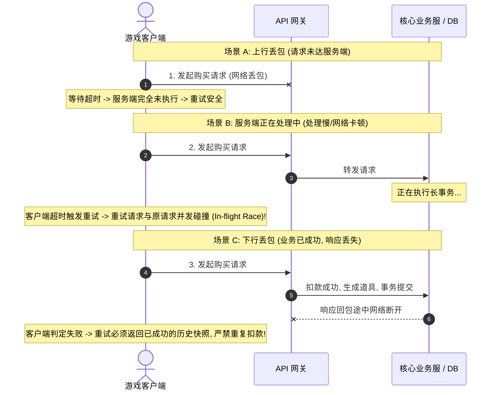
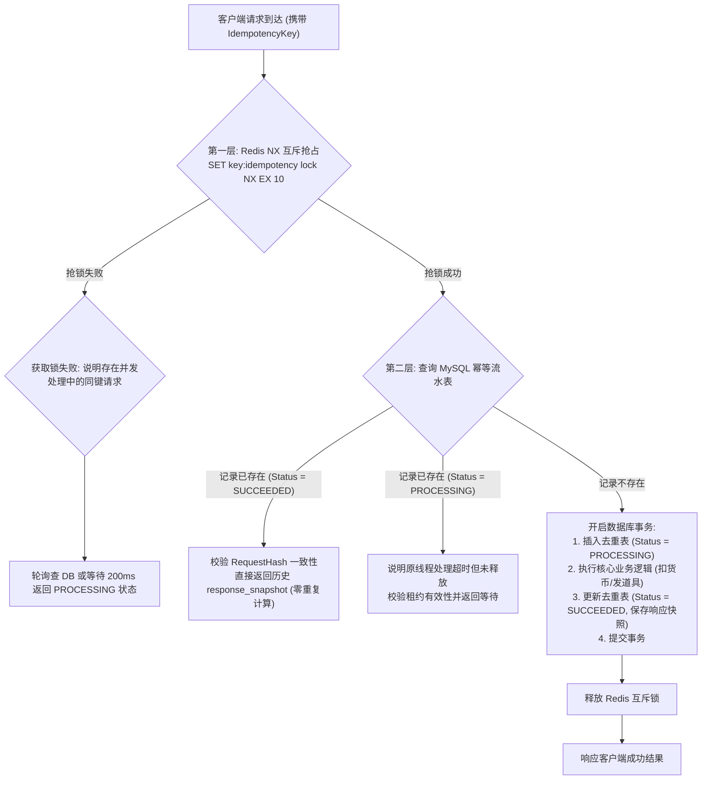

# 03 幂等重试与消息语义

> 知识成熟度：L2（工程体系化增强：补齐网络超时三态困境、双层幂等架构实现、全抖动指数退避算法、验证测试矩阵与生产级游戏业务对账闭环）。
> 适用范围：平台可靠性-幂等重试与消息语义。
> 知识基线：平台可靠性工程方案（非 UE 内置能力）；深入解决弱网环境下的客户端重复点击、网络超时重发、中间件重复投递及跨系统扣款发货一致性难题。
> 官方参考：[RFC 7231 - HTTP Method Idempotency Semantics](https://www.rfc-editor.org/rfc/rfc7231.html)。
> 最后更新：2026-09-03（深度重构：补强网络超时时序图、Redis+MySQL 双层幂等核心代码、Full Jitter 退避算法、验证建议与测试矩阵）。

---

## 1. 概述与核心边界

在分布式网络环境下，物理链路只能提供“可能送达、可能丢包、可能延迟、可能乱序”的客观事实。**Exactly-once 绝非网络传输层天然具备的属性，而是在明确业务资源域内，通过全局唯一键、数据库唯一约束、强状态机与消费去重表共同构建的业务抽象——即“同一业务意图无论重试多少次，只产生一次有效副作用（Effectively-Once）”。**

### 1.1 网络超时的“三态困境”（The Trilemma of Network Timeout）

当客户端向游戏服务器发起涉资操作（如商城购买、抽卡十连、装备强化）遭遇 3 秒超时未响应时，系统客观上面临三种截然不同的物理可能：



---

## 2. 核心概念与语义模型

| 语义名称 | 保证范围 | 无法保证的边界 | 生产落地典型模式 |
| :--- | :--- | :--- | :--- |
| **At-most-once** | 最多处理一次（绝不重复执行） | 遇到网络丢包直接失败，可能丢失 | UDP 移动同步包、非关键统计埋点、发后即忘广播 |
| **At-least-once** | 至少处理成功一次 | 遇到网络重发或 ACK 丢失会产生重复执行 | 消息队列重投（Kafka/RabbitMQ）、客户端超时自动重发 |
| **Effectively-once** | 业务副作用全局唯一 | 物理网络数据包仍会多次传输 | 幂等键（Idempotency Key）+ 数据库唯一索引去重 |
| **Transactional Outbox** | 业务变更与事件记录同库提交 | 外部消息代理与消费者仍需处理重投 | 本地事件表 + Debezium CDC / 后台轮询投递 |
| **Exactly-once Effect** | 跨分布式系统全局最终一致 | 外部第三方支付（微信/苹果支付）不支持分布式事务 | 两阶段状态机、幂等流水表、定时反向对账与人工补偿 |

---

## 3. 工业级双层幂等架构（Dual-Tier Idempotency Engine）

针对高并发游戏服务（如万人同服开服秒杀、商城特惠），单靠数据库唯一索引容易在并发冲撞时将数据库行锁拖垮。工业级方案采用 **Redis 分布式锁/令牌（内存层）+ MySQL 持久化去重表（持久层）** 的双层防线。



### 3.1 生产级数据库表结构（MySQL / PostgreSQL 规范）

```sql
CREATE TABLE `t_idempotency_record` (
    `tenant_id`       BIGINT UNSIGNED NOT NULL DEFAULT 0 COMMENT '租户/大区ID',
    `account_id`      BIGINT UNSIGNED NOT NULL COMMENT '玩家账号ID',
    `operation`       VARCHAR(64) NOT NULL COMMENT '业务操作类型: MallBuy/Gacha/ItemUse',
    `idempotency_key` VARCHAR(128) NOT NULL COMMENT '客户端生成的全局唯一幂等键(UUID+时间戳)',
    `request_hash`    CHAR(64) NOT NULL COMMENT '请求体SHA-256摘要(防止同Key更换攻击参数)',
    `status`          VARCHAR(20) NOT NULL COMMENT '状态: PROCESSING/SUCCEEDED/FAILED',
    `response_code`   INT DEFAULT 0 COMMENT '返回业务错误码',
    `response_body`   TEXT NULL COMMENT '已执行成功的JSON响应快照(重试直接原样返回)',
    `created_at`      DATETIME(3) NOT NULL DEFAULT CURRENT_TIMESTAMP(3),
    `updated_at`      DATETIME(3) NOT NULL DEFAULT CURRENT_TIMESTAMP(3) ON UPDATE CURRENT_TIMESTAMP(3),
    `expire_at`       DATETIME(3) NOT NULL COMMENT '生命周期过期时间(通常保留7~30天)',
    PRIMARY KEY (`tenant_id`, `account_id`, `operation`, `idempotency_key`),
    KEY `idx_expire_at` (`expire_at`)
) ENGINE=InnoDB DEFAULT CHARSET=utf8mb4 COMMENT='全局业务幂等去重流水表';
```

### 3.2 Redis 内存层原子抢占与释放 Lua 脚本

在第一道防线中，客户端通过分布式锁抢占处理权。为防止网络闪断导致的死锁，抢占与释放必须具备原子性与持有者防误删保护：

```lua
-- 抢占锁 Lua 脚本: 获取锁并设置超时时间 (KEYS[1]: lock_key, ARGV[1]: request_id, ARGV[2]: expire_ms)
if redis.call("SET", KEYS[1], ARGV[1], "NX", "PX", ARGV[2]) then
    return 1 -- 抢锁成功，获得执行权
else
    local current_val = redis.call("GET", KEYS[1])
    if current_val == ARGV[1] then
        return 2 -- 同一请求重入 (可安全续期)
    else
        return 0 -- 锁被其他并发线程持有，返回冲突
    end
end
```

```lua
-- 安全释放锁 Lua 脚本: 仅当当前值等于本线程持有者标记时才允许删除
if redis.call("GET", KEYS[1]) == ARGV[1] then
    return redis.call("DEL", KEYS[1])
else
    return 0 -- 锁已过期或已被他人接管，严禁误删他人的锁
end
```

### 3.3 网关层幂等拦截器（Middleware 流程实现）

```go
// 伪代码: gRPC / HTTP 统一幂等拦截器
func IdempotencyInterceptor(ctx context.Context, req interface{}, handler Handler) (interface{}, error) {
    key := ExtractIdempotencyKey(ctx)
    if key == "" {
        return handler(ctx, req) // 只读或非涉资操作不强求幂等
    }

    reqHash := CalculateSha256(req)
    lockKey := fmt.Sprintf("lock:idempotency:%s", key)
    requestId := uuid.New().String()

    // 1. Redis 快速抢锁 (第一道防线)
    acquired := RedisAcquireLock(ctx, lockKey, requestId, 5000) // 5s 租约
    if !acquired {
        return nil, ErrRequestInProgress // 正在并发处理中，拒绝并让客户端退避重试
    }
    defer RedisReleaseLock(ctx, lockKey, requestId)

    // 2. MySQL 持久化流水查重 (第二道防线)
    record, err := QueryIdempotencyRecord(ctx, key)
    if err == nil && record != nil {
        if record.RequestHash != reqHash {
            return nil, ErrIdempotencyKeyConflict // 参数被篡改，返回 409
        }
        if record.Status == "SUCCEEDED" {
            // 命中已成功快照，直接反序列化历史响应返回，零重复计算
            return DeserializeResponse(record.ResponseBody), nil
        }
    }

    // 3. 正常执行核心业务逻辑
    resp, bizErr := handler(ctx, req)
    if bizErr == nil {
        SaveIdempotencyRecord(ctx, key, reqHash, "SUCCEEDED", resp)
    }
    return resp, bizErr
}
```

---

## 4. 全抖动指数退避算法（Exponential Backoff with Full Jitter）

在网络抖动或服务短时过载时，如果所有客户端都按照固定的间隔（如每隔 1 秒）重试，会导致成千上万的客户端请求在同一毫秒内同步撞击网关，形成致命的**重试风暴（Retry Storm / Thundering Herd）**。

AWS 与业界标准采用 **Full Jitter（全抖动指数退避）**：

$$SleepTime = \text{UniformRandom}(0, \min(MaxBackoff, BaseInterval \times 2^{AttemptCount}))$$

```go
package retry

import (
	"math"
	"math/rand"
	"time"
)

type BackoffPolicy struct {
	BaseInterval time.Duration // 基础重试间隔 (如 100ms)
	MaxBackoff   time.Duration // 最大退避上限 (如 3000ms)
	MaxAttempts  int           // 最大重试次数 (如 3~5 次)
}

func (b *BackoffPolicy) CalculateBackoff(attempt int) time.Duration {
	if attempt <= 0 {
		return 0
	}
	multiplier := math.Pow(2.0, float64(attempt-1))
	temp := float64(b.BaseInterval) * multiplier
	maxDuration := float64(b.MaxBackoff)
	if temp > maxDuration {
		temp = maxDuration
	}
	sleepDuration := rand.Float64() * temp
	return time.Duration(sleepDuration)
}
```

---

## 5. 常见高频业务场景落地实战

### 5.1 苹果 / 微信第三方充值回调发货
- **外力风险**：苹果 App Store Server Notification 或微信支付会就同一笔成功订单重复推送回调通知（如隔 5s、15s、30s 连续推送）。
- **落地契约**：
  1. 使用第三方订单号 `transaction_id` 作为唯一键；
  2. 开启本地数据库事务，执行 `INSERT INTO t_recharge_receipt (order_id, status) VALUES (?, 'PROCESSING')`；
  3. 若主键冲突（Duplicate Key Error），直接中断执行，向第三方返回 HTTP 200 SUCCESS 声明已知晓；
  4. 只有首次成功抢占的线程执行发货增加钻石逻辑，发货完成后将状态置为 `FINISHED`。

### 5.2 商城限购礼包扣款发货
- **外力风险**：玩家连点“购买”按键，或网络卡顿产生多条并发 HTTP 请求同时到达网关。
- **落地契约**：
  1. 前端在点击购买弹窗打开时生成并锁定唯一的 `client_token`；
  2. 网关校验 `client_token` 幂等表，拦截在途（In-flight）重复请求；
  3. 扣减库存与扣除钻石在单条 SQL 中执行原子性判定：`UPDATE t_user_asset SET diamond = diamond - 100 WHERE uid = ? AND diamond >= 100`；
  4. 成功后将返回的道具列表持久化写入去重表的 `response_body` 字段中；
  5. 后续任何携带相同 `client_token` 的重试请求，直接查表返回保存的快照，绝不再走扣款流程。

### 5.3 抽卡十连防刷与结果固定
- **外力风险**：抽卡接口响应超时，玩家重复点击；若重新随机可能导致期望概率偏差或扣除两次抽卡券。
- **落地契约**：同一抽卡幂等键首次执行时，将抽取的卡牌结果 ID 列表同货币扣减一起原子写入数据库；重试到达时直接读取该记录已抽出的卡牌列表展示，严禁二次调用随机数引擎重新抽取。

---

## 6. 常见反模式清单（Anti-Patterns）

| 反模式 | 典型表现 | 潜在严重后果 | 正确工程解法 |
| :--- | :--- | :--- | :--- |
| **先发消息后提交事务** | 业务代码中先向 MQ 发送“发货通知”，然后再提交本地 DB 事务 | DB 事务若因死锁或断电回滚，MQ 消息已发出，导致凭空多发道具 | 必须使用 Transactional Outbox 模式，在同一事务内落库 |
| **重试复用新幂等键** | 客户端底层 HTTP 库发生超时重试时，每次新生成一个 UUID 作为 Header | 服务端无法识别这是同一次重试，重复扣款/重复发奖 | 幂等键生命周期绑定用户业务意图，跨层重发必须透传原始键 |
| **仅在内存中做去重** | 使用单个服务进程内的内存 Map 或 Java ConcurrentHashMap 做幂等 | 服务重启、发布更新或集群多实例水平扩展时防线彻底失效 | 必须使用分布式共享存储（Redis 集中锁 + MySQL 唯一键） |
| **死信队列只入不治** | 消息重试多次失败后丢入 DLQ 死信队列，但无监控、无告警、无人处理 | 线上数据静默不一致，玩家资产受损扩大 | 配置死信报警指标，设立人工核查工具与自动重放脚本 |

---

## 7. 典型故障复盘案例

### 案例一：弱网下商城重复扣款事故
- **场景**：大促开服期间，网关 CPU 负载达到 90%，网络响应延迟增至 4 秒。大量玩家点击“购买”后未见反应，连续点击 3 次，客户端自动重试。
- **根因**：服务端扣款逻辑未配置请求幂等表，且客户端每次重试生成了新的 ClientTimestamp 作为凭据。
- **处置**：全量补丁拦截：网关强制校验 `Idempotency-Key` 请求头；建立双层去重防线；通过对账脚本比对扣减日志与发货日志，全量补发差额道具。

### 案例二：下游超时引发雪崩式重试风暴
- **场景**：数据库主库发生 10 秒慢查询锁表，导致上游 5,000 QPS 的请求全部超时；所有客户端以 500ms 固定间隔同步重试，瞬间将请求量放大到 25,000 QPS。
- **根因**：客户端缺乏退避算法，缺乏全局重试预算（Retry Budget），无熔断保护。
- **处置**：全线引入 Full Jitter 指数退避，单客户端最多允许重试 3 次；网关接入自适应熔断器，当错误率超过 40% 时直接开启熔断快速失败。

---

## 8. 生产最佳实践

1. **幂等键生成规范**：
   幂等键必须由客户端在用户产生明确业务意图的第一时刻生成（如点击按键），推荐格式：`{DeviceID}_{AccountID}_{Timestamp}_{UUID}`。严禁客户端在每次底层重试发送时生成新的幂等键。
2. **请求摘要一致性校验（Request Hash Validation）**：
   服务端接收到重试请求时，必须重新计算当前参数的 SHA-256 并与去重表中的 `request_hash` 进行比对。若键相同但参数被篡改（如商品 ID 变了），立即判定为非法请求返回 `409 Conflict`。
3. **过期流水归档与分区清理**：
   去重记录表随着时间推移会迅速膨胀至亿级数据。建议按月份进行数据库范围分区（Range Partitioning），通过定时任务每日剔除超过 30 天的冷数据，保持在线表轻量高效。
4. **重试预算全局收敛（Retry Budget）**：
   在微服务网关层对下游服务配置重试预算池（如最大仅允许将失败请求的 10% 进行重试）。当下游服务出现大面积故障、重试比例触及 10% 警戒线时，强制停止一切重试，直接抛错降级。

---

## 9. 验证建议与测试矩阵

为保证幂等与重试逻辑在弱网环境下的绝对稳定性，系统必须通过以下自动化混沌测试矩阵：

| 测试用例 ID | 注入故障场景 | 预期系统表现与断言 | 验证手段 |
| :--- | :--- | :--- | :--- |
| **TEST-IDEM-01** | 客户端并发多线程使用相同 Key 瞬时发起 50 次扣款请求 | 数据库仅产生 1 笔真实扣减流水，其余 49 次返回成功快照或排队拒绝 | 并发压测脚本 (JMeter / Locust) |
| **TEST-IDEM-02** | 模拟服务端业务已落库但网关故意丢弃 HTTP 响应回包 | 客户端超时重发相同请求，服务端直接返回历史快照，零重复执行 | 混沌工程代理 (Toxiproxy) |
| **TEST-IDEM-03** | 故意篡改同 Key 重试包中的商品 ID 参数 | 服务端校验 `request_hash` 失败，精确返回 HTTP 409 Conflict | 单元测试与接口集成用例 |
| **TEST-IDEM-04** | 模拟数据库注入 5 秒长事务导致大量请求超时重试 | 客户端重试请求呈现指数分散，无集中毛刺雷暴（Full Jitter 验证） | Prometheus 流量抓包分析 |

---

## 10. 常见问题 FAQ

1. **Q：重试时服务正在处理中（PROCESSING 状态），下游应该返回什么？**
   A：返回特定的状态码（如 HTTP 202 Accepted 或游戏自定义错误码 `ERR_REQUEST_IN_PROGRESS`），客户端捕获该错误码后提示“处理中，请稍候”，并按照退避时间轮询订单结果，决不能将状态误判为失败。
2. **Q：服务器宕机导致某条幂等记录永久卡在 PROCESSING 怎么办？**
   A：引入租约机制（Lease Time）。PROCESSING 状态必须携带租约到期时间 `expire_at`（如 30 秒）。若超过租约仍未完成且没有心跳续期，允许新的重试请求竞争接管该记录，重新执行业务逻辑。
3. **Q：读请求（GET）需要幂等键吗？**
   A：按照规范，纯只读查询天然具备幂等性（Idempotent），无服务端状态副作用，不需要幂等键；但对于耗时极高的大数据聚合查询或排行榜拉取，可利用幂等机制做请求合并（SingleFlight 缓存复用）。

---

## 11. 关联阅读

- [04-分布式事务与最终一致性.md](04-分布式事务与最终一致性.md) —— 本地消息表、Transactional Outbox 与跨服 Saga
- [02-限流熔断背压与过载保护.md](02-限流熔断背压与过载保护.md) —— 防止重试风暴瘫痪系统的网关保护屏障
- [03-业务系统设计/01-背包与道具系统.md](../03-业务系统设计/01-背包与道具系统.md) —— 道具事务与幂等性实战
- [03-业务系统设计/03-商城与经济系统.md](../03-业务系统设计/03-商城与经济系统.md) —— 涉资充值与商城交易的安全底座
- [02-数据与业务/01-数据库选型与存储设计.md](../02-数据与业务/01-数据库选型与存储设计.md) —— 数据库唯一索引与悲观锁设计
