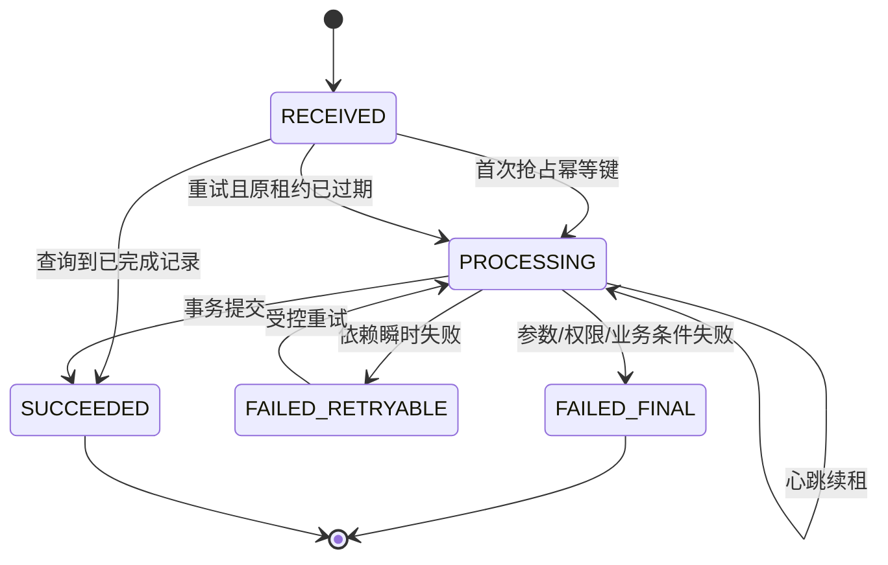

# 03 幂等重试与消息语义

> 知识成熟度：L2
> 适用范围：平台可靠性-幂等重试与消息语义
> 本文由《01-鉴权限流幂等灾备与可观测性》"四、幂等、去重、状态机、事务与消息语义（4.1-4.4）"拆分而来，正文逐字迁移。

## 元数据
- 最后更新：2026-08-13。
- 知识成熟度：L2。
- 适用范围：平台可靠性-幂等重试与消息语义。
- 知识基线：平台可靠性工程方案（非 UE 内置能力）；事实边界以原《01-鉴权限流幂等灾备与可观测性》对应章节为准。
- 拆分来源：原《01-鉴权限流幂等灾备与可观测性》"四、幂等、去重、状态机、事务与消息语义（4.1-4.4）"。
- 官方参考：RFC 7231（HTTP 方法幂等语义）https://www.rfc-editor.org/rfc/rfc7231.html

## 概述
exactly-once 不是传输层天然提供的属性，而是在明确资源域内通过唯一键、事务约束、状态机和消费去重实现的业务目标。
本文定义 exactly-once 的真实边界与五种语义，给出幂等键契约、去重表 SQL 示意和业务状态机。
幂等记录必须覆盖客户端最大重试窗口、消息延迟和人工补偿窗口。

### 1.1 exactly-once 的真实边界

网络只能提供“可能送达、可能重复、可能乱序、可能超时”的事实。
业务可以在一个明确的资源域内，通过唯一键、事务约束、状态机和消费去重实现“同一业务意图只产生一次有效副作用”。
这不等于客户端只发了一次，也不等于消息代理只投递了一次。
exactly-once 必须回答五个问题：唯一身份是什么、权威提交点在哪里、重复如何识别、失败后如何查询、跨系统副作用如何补偿。

| 语义名称 | 能保证什么 | 不能保证什么 | 典型实现 |
| --- | --- | --- | --- |
| at-most-once | 最多处理一次 | 可能丢失 | 发送后不重试 |
| at-least-once | 最终可能处理成功 | 可能重复 | ACK 后重投 |
| effectively-once | 业务有效副作用只计一次 | 传输仍可能重复 | 幂等键+唯一约束 |
| transactional outbox | 状态与待发事件同库提交 | 外部消费仍可能重复 | 事务表+发布器 |
| exactly-once effect | 定义资源域内一次有效结果 | 跨数据库/外部支付非天然一次 | 事务、去重、对账、补偿 |

### 1.2 幂等键契约

幂等键（Idempotency Key）应由客户端或服务端在业务意图开始时生成，具有足够随机性和明确作用域。
建议键由 tenant、account、operation_type、client_request_id 组成逻辑唯一范围。
服务端应保存请求摘要，防止同一 key 被复用来提交不同参数。
重复请求如果参数摘要相同，应返回第一次的最终结果或当前处理中状态。
重复请求如果摘要不同，应返回幂等键冲突，不覆盖原始记录。
幂等记录的保留时间必须覆盖客户端最大重试窗口、消息延迟和人工补偿窗口。
只读查询可以不需要幂等键；扣货币、发道具、创建订单、加入匹配和提交结算应默认需要。

### 1.3 去重表 SQL 示意

```sql
CREATE TABLE idempotency_record (
    tenant_id       BIGINT NOT NULL,
    account_id      BIGINT NOT NULL,
    operation       VARCHAR(64) NOT NULL,
    idempotency_key VARCHAR(128) NOT NULL,
    request_hash    CHAR(64) NOT NULL,
    status          VARCHAR(16) NOT NULL,
    response_code   INT NULL,
    response_body   JSONB NULL,
    resource_type   VARCHAR(64) NULL,
    resource_id     VARCHAR(128) NULL,
    created_at      TIMESTAMPTZ NOT NULL,
    updated_at      TIMESTAMPTZ NOT NULL,
    expires_at      TIMESTAMPTZ NOT NULL,
    PRIMARY KEY (tenant_id, account_id, operation, idempotency_key),
    CHECK (status IN ('PROCESSING', 'SUCCEEDED', 'FAILED_RETRYABLE', 'FAILED_FINAL'))
);
```

表结构是示意，JSONB 是否可用要以目标数据库为准。
唯一主键解决并发插入，request_hash 解决同键不同请求，status 解决处理中的重入。
PROCESSING 记录超时后不能简单删除；必须有 lease、超时恢复或人工核查规则。

### 1.4 业务状态机



状态迁移必须有合法前置状态和并发控制。
客户端看到 PROCESSING 时应查询状态，而不是盲目重新创建一笔业务。
FAILED_RETRYABLE 是否自动重试，应由错误类型和副作用状态决定。
如果无法确认数据库事务是否提交，优先查询幂等记录和资源状态，再决定补偿。

## 失败路径

幂等键与状态机的典型故障及处置如下；完整失败路径表见 04 篇"1.8 幂等失败路径"。

| 故障 | 可能状态 | 处理原则 | 验证手段 |
| --- | --- | --- | --- |
| 客户端超时但事务已提交 | 客户端未知 | 通过幂等键查询原结果 | 注入响应丢失 |
| 两个请求同时抢同一键 | 一个处理、一个等待 | 唯一约束或行锁仲裁 | 并发压测 |
| PROCESSING 租约过期 | 旧执行可能仍在跑 | 用版本/租约防双执行，必要时人工对账 | 杀进程恢复 |

## FAQ

### Q4：用了消息队列的 exactly-once 模式，还需要消费去重吗？

仍然需要。端到端副作用可能跨数据库、缓存、第三方服务和人工补偿，业务必须用 event_id、业务键或版本控制重复。
传输层语义不能替代资源域内的幂等设计。

### Q5：请求超时了，重新发一个新的幂等键可以吗？

如果原请求的业务状态未知，使用新键可能产生第二个副作用。应先用原幂等键查询；只有确认原操作未创建或由业务规则允许时，才能创建新意图。

## 验收清单

- 同一幂等键不产生第二次业务副作用。
- 幂等键由 tenant、account、operation_type、client_request_id 组成逻辑唯一范围。
- 服务端保存请求摘要：同键同参返回原结果，同键异参返回幂等键冲突。
- 幂等记录保留时间覆盖客户端最大重试窗口、消息延迟和人工补偿窗口。
- 去重表以唯一主键解决并发插入，request_hash 解决同键不同请求，status 解决处理中的重入。
- PROCESSING 记录超时后不能简单删除，必须有 lease、超时恢复或人工核查规则。
- 状态迁移有合法前置状态和并发控制，客户端看到 PROCESSING 时查询状态而非盲目重建业务。
- 无法确认数据库事务是否提交时，优先查询幂等记录和资源状态再决定补偿。

## 关联阅读

- [00-平台可靠性总览与迁移说明.md](00-平台可靠性总览与迁移说明.md)：本目录总览与迁移说明，含责任边界、最佳实践清单与 FAQ。
- [04-平台与可靠性/README.md](README.md)：本目录导航与学习路径。
- [04-分布式事务与最终一致性.md](04-分布式事务与最终一致性.md)：事务与 Outbox、业务操作、消息重复投递与幂等失败路径的续篇。
- [02-数据与业务/01-数据库选型与存储设计.md](../02-数据与业务/01-数据库选型与存储设计.md)：唯一约束、事务与存储设计细节。
- [02-数据与业务/03-分布式与高可用.md](../02-数据与业务/03-分布式与高可用.md)：一致性语义与高可用专题细节。

## 更新日志

- 2026-08-13：从《01-鉴权限流幂等灾备与可观测性》"四、幂等、去重、状态机、事务与消息语义"中的 4.1-4.4 拆出独立成篇；正文逐字迁移，标题按本文重编号。
