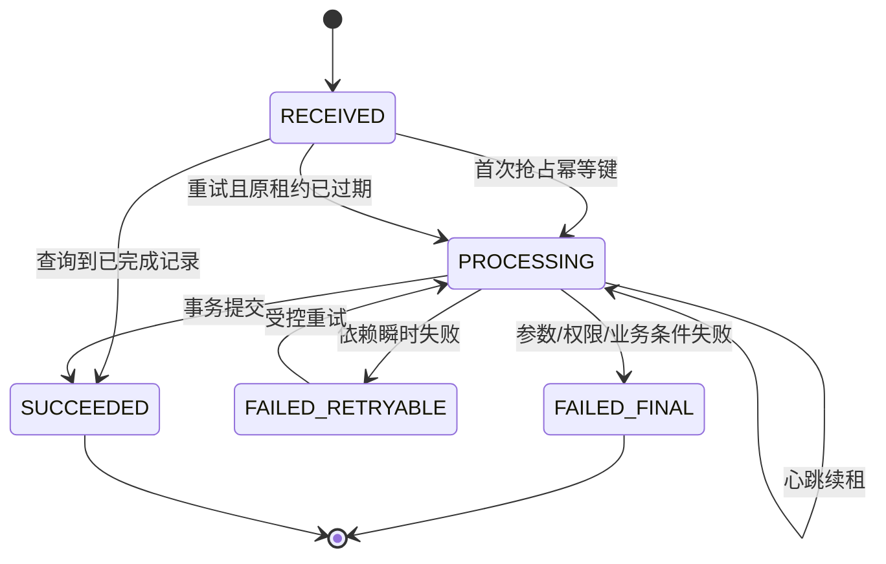

# 03 幂等重试与消息语义

> 知识成熟度：L2
> 适用范围：平台可靠性-幂等重试与消息语义
> 本文由《01-鉴权限流幂等灾备与可观测性》"四、幂等、去重、状态机、事务与消息语义（4.1-4.4）"拆分而来，正文逐字迁移。

## 元数据
- 最后更新：2026-08-13。
- 知识成熟度：L2。
- 适用范围：平台可靠性-幂等重试与消息语义。
- 知识基线：平台可靠性工程方案（非 UE 内置能力）；事实边界以原《01-鉴权限流幂等灾备与可观测性》对应章节为准。
- 拆分来源：原《01-鉴权限流幂等灾备与可观测性》"四、幂等、去重、状态机、事务与消息语义（4.1-4.4）"。
- 官方参考：RFC 7231（HTTP 方法幂等语义）https://www.rfc-editor.org/rfc/rfc7231.html

## 概述
exactly-once 不是传输层天然提供的属性，而是在明确资源域内通过唯一键、事务约束、状态机和消费去重实现的业务目标。
本文定义 exactly-once 的真实边界与五种语义，给出幂等键契约、去重表 SQL 示意和业务状态机。
幂等记录必须覆盖客户端最大重试窗口、消息延迟和人工补偿窗口。

### 1.1 exactly-once 的真实边界

网络只能提供“可能送达、可能重复、可能乱序、可能超时”的事实。
业务可以在一个明确的资源域内，通过唯一键、事务约束、状态机和消费去重实现“同一业务意图只产生一次有效副作用”。
这不等于客户端只发了一次，也不等于消息代理只投递了一次。
exactly-once 必须回答五个问题：唯一身份是什么、权威提交点在哪里、重复如何识别、失败后如何查询、跨系统副作用如何补偿。

| 语义名称 | 能保证什么 | 不能保证什么 | 典型实现 |
| --- | --- | --- | --- |
| at-most-once | 最多处理一次 | 可能丢失 | 发送后不重试 |
| at-least-once | 最终可能处理成功 | 可能重复 | ACK 后重投 |
| effectively-once | 业务有效副作用只计一次 | 传输仍可能重复 | 幂等键+唯一约束 |
| transactional outbox | 状态与待发事件同库提交 | 外部消费仍可能重复 | 事务表+发布器 |
| exactly-once effect | 定义资源域内一次有效结果 | 跨数据库/外部支付非天然一次 | 事务、去重、对账、补偿 |

### 1.2 幂等键契约

幂等键（Idempotency Key）应由客户端或服务端在业务意图开始时生成，具有足够随机性和明确作用域。
建议键由 tenant、account、operation_type、client_request_id 组成逻辑唯一范围。
服务端应保存请求摘要，防止同一 key 被复用来提交不同参数。
重复请求如果参数摘要相同，应返回第一次的最终结果或当前处理中状态。
重复请求如果摘要不同，应返回幂等键冲突，不覆盖原始记录。
幂等记录的保留时间必须覆盖客户端最大重试窗口、消息延迟和人工补偿窗口。
只读查询可以不需要幂等键；扣货币、发道具、创建订单、加入匹配和提交结算应默认需要。

### 1.3 去重表 SQL 示意

```sql
CREATE TABLE idempotency_record (
    tenant_id       BIGINT NOT NULL,
    account_id      BIGINT NOT NULL,
    operation       VARCHAR(64) NOT NULL,
    idempotency_key VARCHAR(128) NOT NULL,
    request_hash    CHAR(64) NOT NULL,
    status          VARCHAR(16) NOT NULL,
    response_code   INT NULL,
    response_body   JSONB NULL,
    resource_type   VARCHAR(64) NULL,
    resource_id     VARCHAR(128) NULL,
    created_at      TIMESTAMPTZ NOT NULL,
    updated_at      TIMESTAMPTZ NOT NULL,
    expires_at      TIMESTAMPTZ NOT NULL,
    PRIMARY KEY (tenant_id, account_id, operation, idempotency_key),
    CHECK (status IN ('PROCESSING', 'SUCCEEDED', 'FAILED_RETRYABLE', 'FAILED_FINAL'))
);
```

表结构是示意，JSONB 是否可用要以目标数据库为准。
唯一主键解决并发插入，request_hash 解决同键不同请求，status 解决处理中的重入。
PROCESSING 记录超时后不能简单删除；必须有 lease、超时恢复或人工核查规则。

### 1.4 业务状态机



状态迁移必须有合法前置状态和并发控制。
客户端看到 PROCESSING 时应查询状态，而不是盲目重新创建一笔业务。
FAILED_RETRYABLE 是否自动重试，应由错误类型和副作用状态决定。
如果无法确认数据库事务是否提交，优先查询幂等记录和资源状态，再决定补偿。

## 失败路径

幂等键与状态机的典型故障及处置如下；完整失败路径表见 04 篇"1.8 幂等失败路径"。

| 故障 | 可能状态 | 处理原则 | 验证手段 |
| --- | --- | --- | --- |
| 客户端超时但事务已提交 | 客户端未知 | 通过幂等键查询原结果 | 注入响应丢失 |
| 两个请求同时抢同一键 | 一个处理、一个等待 | 唯一约束或行锁仲裁 | 并发压测 |
| PROCESSING 租约过期 | 旧执行可能仍在跑 | 用版本/租约防双执行，必要时人工对账 | 杀进程恢复 |

## FAQ

### Q4：用了消息队列的 exactly-once 模式，还需要消费去重吗？

仍然需要。端到端副作用可能跨数据库、缓存、第三方服务和人工补偿，业务必须用 event_id、业务键或版本控制重复。
传输层语义不能替代资源域内的幂等设计。

### Q5：请求超时了，重新发一个新的幂等键可以吗？

如果原请求的业务状态未知，使用新键可能产生第二个副作用。应先用原幂等键查询；只有确认原操作未创建或由业务规则允许时，才能创建新意图。

## 验收清单

- 同一幂等键不产生第二次业务副作用。
- 幂等键由 tenant、account、operation_type、client_request_id 组成逻辑唯一范围。
- 服务端保存请求摘要：同键同参返回原结果，同键异参返回幂等键冲突。
- 幂等记录保留时间覆盖客户端最大重试窗口、消息延迟和人工补偿窗口。
- 去重表以唯一主键解决并发插入，request_hash 解决同键不同请求，status 解决处理中的重入。
- PROCESSING 记录超时后不能简单删除，必须有 lease、超时恢复或人工核查规则。
- 状态迁移有合法前置状态和并发控制，客户端看到 PROCESSING 时查询状态而非盲目重建业务。
- 无法确认数据库事务是否提交时，优先查询幂等记录和资源状态再决定补偿。

## 术语速查

下表汇总幂等、重试与消息语义相关术语，便于阅读正文与故障复盘时快速对齐口径；完整定义以正文各节与官方参考为准。

| 术语 | 英文 | 一句话含义 |
| --- | --- | --- |
| 幂等性 | Idempotency | 同一业务意图执行多次与执行一次产生相同业务结果的属性。 |
| 幂等键 | Idempotency Key | 标识一次业务意图的唯一键，所有重试必须复用同一键。 |
| 请求摘要 | Request Hash | 幂等记录中保存的请求参数指纹，用于识别同键不同参数。 |
| 去重表 | Deduplication Table | 以唯一约束保存幂等记录、拦截重复副作用的数据表。 |
| effectively-once | Effectively-Once | 传输可能重复，但业务有效副作用只发生一次的语义。 |
| at-least-once | At-Least-Once | 消息最终可能送达但可能重复，需要消费去重配合的语义。 |
| at-most-once | At-Most-Once | 最多处理一次、可能丢失的语义，适合可丢弃的观测类消息。 |
| 租约 | Lease | 处理中记录的超时所有权，防止旧执行未结束就被新执行抢占。 |
| 重试风暴 | Retry Storm | 大量重试在同一时间窗口集中到达，放大下游压力的现象。 |
| 指数退避 | Exponential Backoff | 每次重试的等待间隔按指数增长的策略。 |
| 抖动 | Jitter | 在退避间隔上叠加随机量，避免全局重试同步化。 |
| 消息重投 | Redelivery | 消息代理在未确认或超时后再次投递同一消息的行为。 |

术语口径与 RFC 7231 及正文 1.1 的语义表保持一致；exactly-once 仅指业务语义目标，不改变传输层事实。

## 幂等与重试落地检查清单

清单把幂等契约、状态机、重试与消息消费拆成可逐项勾选的落地动作，覆盖正文 1.1-1.4 与失败路径表的可验证点。
勾选不代表永久达标：接口新增、消息拓扑变更、客户端版本升级后都应重跑相关项。
检查动作与通过标准均为通用口径，具体错误码与字段名以项目契约为准。

- [ ] 1. 幂等键作用域明确。
    检查动作：评审写接口的键生成规则，确认 tenant、account、operation_type、client_request_id 的组成与作用域。
    通过标准：同一作用域内键唯一，跨作用域互不干扰，契约文档有明确定义。
    失败处置：接口评审不通过时暂停上线，补充键规则后再审。
- [ ] 2. 键随机性足够。
    检查动作：检查客户端与服务端生成键的随机源与长度。
    通过标准：键冲突概率在业务重试规模下可忽略（容量数字为示意值，需项目压测验证）。
    失败处置：升级随机源或键长度，并补充冲突测试用例。
- [ ] 3. 请求摘要参与校验。
    检查动作：检查去重逻辑是否保存并比对 request_hash。
    通过标准：同键异参返回幂等键冲突，不覆盖原始记录。
    失败处置：修复去重逻辑并补同键异参测试用例。
- [ ] 4. 并发抢占有约束。
    检查动作：检查首次插入的并发控制方式（唯一约束或行锁）。
    通过标准：并发压测中同一键只有一个执行者成功，其余等待或返回处理中。
    失败处置：改用唯一约束或显式行锁，补充并发压测记录。
- [ ] 5. 状态迁移合法。
    检查动作：核对状态机的合法前置状态表与并发控制实现。
    通过标准：非法迁移被拒绝，PROCESSING 重复进入有租约或版本校验。
    失败处置：补齐前置状态校验并增加非法迁移测试。
- [ ] 6. 租约与超时恢复。
    检查动作：检查 PROCESSING 记录的超时、续租与恢复流程。
    通过标准：租约过期后不会双执行，恢复路径有版本控制或人工核查。
    失败处置：实现租约续期与超时恢复流程，补充杀进程演练。
- [ ] 7. 保留期覆盖窗口。
    检查动作：核对幂等记录保留时间与客户端最大重试窗口、消息延迟、人工补偿窗口的关系。
    通过标准：最晚到达的重试或补偿请求仍能命中原记录。
    失败处置：延长保留期或增加归档查询，确保补偿窗口被覆盖。
- [ ] 8. 重试参数受控。
    检查动作：检查自动重试的 deadline、最大次数、退避与抖动配置。
    通过标准：重试超限后停止并告警，不存在无限重发路径。
    失败处置：收敛重试参数并补超限停止的自动化测试。
- [ ] 9. 分层重试预算。
    检查动作：盘点客户端、网关、服务、消息消费各层的重试策略。
    通过标准：各层职责明确，总请求放大倍数受控并有上限。
    失败处置：明确各层职责，由网关层设置总重试预算。
- [ ] 10. 超时后先查询。
    检查动作：检查客户端超时后的引导逻辑与查询接口支持。
    通过标准：客户端能按原幂等键查询结果，不会盲目新建业务意图。
    失败处置：为客户端提供原键查询接口并写入重试引导文档。
- [ ] 11. 消费去重落地。
    检查动作：检查消费者是否以 event_id 或业务键做持久化去重。
    通过标准：重复投递测试中业务副作用只出现一次。
    失败处置：在消费者侧补持久化去重表与重复投递测试。
- [ ] 12. ACK 时机正确。
    检查动作：检查消费者的确认时机与失败分类处理。
    通过标准：业务副作用提交成功后才确认，瞬时失败进入重投而非静默丢弃。
    失败处置：调整确认时机并补"提交后崩溃"演练用例。
- [ ] 13. 错误分类清晰。
    检查动作：检查错误类型到 FAILED_RETRYABLE、FAILED_FINAL 的映射规则。
    通过标准：可重试与不可重试错误分流正确，业务失败不会被盲目重试。
    失败处置：完善错误分类映射并补错误分流测试。
- [ ] 14. 补偿衔接幂等。
    检查动作：检查人工补偿流程能否查询并复用原幂等键。
    通过标准：补偿操作可追溯原键，不会产生重复副作用。
    失败处置：补偿流程强制先查原键，并增加操作审计。
- [ ] 15. 对账可发现差异。
    检查动作：检查订单、货币、背包的定期对账任务与差异处理流程。
    通过标准：对账能发现幂等记录与业务表不一致，并有升级路径。
    失败处置：建立对账差异工单与升级流程。
- [ ] 16. 指标与告警齐备。
    检查动作：检查幂等冲突率、PROCESSING 积压、重试次数的指标与告警。
    通过标准：指标异常可定位到接口、版本与消息队列，告警有处置 runbook。
    失败处置：补充指标埋点与告警规则，并附处置 runbook。

清单建议在接口评审、发布前检查和季度故障复盘三个时机复用。
若某项长期无法通过，优先检查是不是缺少可观测性证据，而不是放宽标准。

## 常见反模式

反模式清单用于评审与复盘对照，识别"看似增强可靠性、实际放大风险"的默认行为。
表中的正确做法与正文 1.1-1.4、失败路径表互补，不重复列举实现细节。

| 反模式 | 现象 | 后果 | 正确做法 |
| --- | --- | --- | --- |
| 换键重试 | 每次重试都生成新幂等键 | 同一意图产生多个业务副作用 | 重试复用原键，未知状态先按原键查询。 |
| 无限重试 | 无次数上限、退避与抖动 | 重试风暴放大流量，拖垮下游 | 设置最大次数、指数退避与抖动，超限停止。 |
| 自动与人工并发 | 自动重试与人工补偿同时执行 | 双执行造成账目错误 | 以幂等记录与租约仲裁，补偿前先查状态。 |
| 只去重不校验摘要 | 同键任意参数都返回原结果 | 键被误用或复用产生错误结果 | 比对请求摘要，摘要不同返回冲突。 |
| 超时即删记录 | PROCESSING 超时后直接删除或重置 | 旧执行与新执行并存，双写副作用 | 用租约与版本控制恢复，必要时人工核查。 |
| 把消息代理当万能 | 认为 exactly-once 模式免去消费去重 | 跨库、跨外部服务副作用重复 | 以 event_id 或业务键做持久化消费去重。 |
| ACK 先于提交 | 副作用落库前就确认消息 | 未提交即丢失或重复处理 | 业务副作用提交成功后确认，失败按类型重投。 |
| 重试不看错误类型 | 业务失败也自动重试 | 无效重试放大流量 | 按错误类型分流可重试与最终失败。 |
| 无对账只靠日志 | 只留日志不核对账目 | 重复与遗漏长期潜伏 | 定期对账并核对幂等记录与业务表一致性。 |

反模式多数源于"重试逻辑与业务副作用分离"的默认习惯；出现其一应顺带检查相邻边界。

## 典型故障案例与补充示例

三个案例分别覆盖客户端重试、系统级重试与消息重投三类典型故障；案例均为通用场景，不指向任何具体项目事故。
每个案例按场景、表象、根因、修复与预防四步展开，可直接用于演练剧本与复盘对照。

### 案例一：重复扣款

- 场景：玩家提交扣款请求后网络超时，客户端判定失败并重发；网关与业务层各自还做了一层重试。
- 表象：同一订单出现两笔扣款流水；玩家投诉余额异常；对账任务发现订单号重复。
- 根因：重试使用了新幂等键；或扣款先于幂等记录提交，去重表无法拦截；或幂等记录仅存内存，重启后丢失。
- 修复与预防：扣款与幂等记录在同一事务提交，先占键再改余额；重试必须复用原键；客户端超时后先查订单状态；对账任务按订单号与幂等键双重核对。

### 案例二：重试风暴

- 场景：数据库连接池短暂打满，网关大量请求失败；客户端、网关与业务服务的自动重试在同一时间窗口集中触发。
- 表象：失败率上升的同时请求量放大数倍（示意倍数，需项目压测验证）；连接池持续打满，恢复时间明显变长；告警数量在短时间内集中爆发。
- 根因：各层重试无总预算，退避缺失或退避时间过短；失败请求在同一时刻同步重发；熔断阈值与恢复试探策略未覆盖连接池耗尽场景。
- 修复与预防：设置最大重试次数、指数退避与抖动，网关统一收敛重试预算；下游持续失败时熔断快速失败；用故障注入与压测验证风暴场景，容量数字以压测结果为准。

### 案例三：ACK 丢失

- 场景：消费者处理完业务副作用后准备确认消息时进程崩溃或网络断开，消息被重新投递。
- 表象：同一事件被处理两次，出现重复发奖或重复入账；日志显示同一 event_id 存在多条处理记录；下游对账发现重复。
- 根因：消费者只依赖消息代理的投递次数，未做业务级去重；副作用提交与确认之间没有原子边界。
- 修复与预防：以 event_id 或业务键做持久化消费去重，重投时查询幂等记录返回原结果；副作用提交成功后再确认；将确认失败与重投纳入演练用例。

### 补充示例：重试退避与去重表扩展

以下 SQL 是重试策略表与去重表租约字段的示意结构，字段与类型以目标数据库为准；退避公式为通用形式，参数需项目压测验证。

```sql
CREATE TABLE retry_policy (
    operation          VARCHAR(64) NOT NULL,
    max_attempts       INT NOT NULL,
    base_interval_ms   INT NOT NULL,
    max_interval_ms    INT NOT NULL,
    jitter_ratio       NUMERIC(4,3) NOT NULL,
    PRIMARY KEY (operation)
);

-- 去重表扩展：在正文 1.3 去重表基础上补充租约字段
ALTER TABLE idempotency_record
    ADD COLUMN lease_owner        VARCHAR(128),
    ADD COLUMN lease_expires_at   TIMESTAMPTZ;
```

退避间隔通用公式：next_delay = min(max_interval_ms, base_interval_ms * 2^(attempt-1))，再按 jitter_ratio 叠加随机抖动，attempt 从 1 开始计数。
retry_policy 与 idempotency_record 分开存储：前者描述"如何重试"，后者记录"已经发生过的意图"。
租约字段用于 PROCESSING 超时恢复：只有租约过期且旧执行确认退出的执行者才能续抢，避免双执行。
所有间隔与次数参数均为示意值，需项目压测验证后写入配置。

案例与示例可组合成演练剧本：先注入 ACK 丢失，再注入连接池故障，验证去重、退避与熔断三层防线按预期工作。

## 关联阅读

- [00-平台可靠性总览与迁移说明.md](00-平台可靠性总览与迁移说明.md)：本目录总览与迁移说明，含责任边界、最佳实践清单与 FAQ。
- [04-平台与可靠性/README.md](README.md)：本目录导航与学习路径。
- [04-分布式事务与最终一致性.md](04-分布式事务与最终一致性.md)：事务与 Outbox、业务操作、消息重复投递与幂等失败路径的续篇。
- [02-数据与业务/01-数据库选型与存储设计.md](../02-数据与业务/01-数据库选型与存储设计.md)：唯一约束、事务与存储设计细节。
- [02-数据与业务/03-分布式与高可用.md](../02-数据与业务/03-分布式与高可用.md)：一致性语义与高可用专题细节。

## 更新日志

- 2026-08-13：从《01-鉴权限流幂等灾备与可观测性》"四、幂等、去重、状态机、事务与消息语义"中的 4.1-4.4 拆出独立成篇；正文逐字迁移，标题按本文重编号。
- 2026-08-13：扩写术语速查、幂等与重试落地检查清单、常见反模式、典型故障案例与补充示例，正文补充至 300+ 行。
