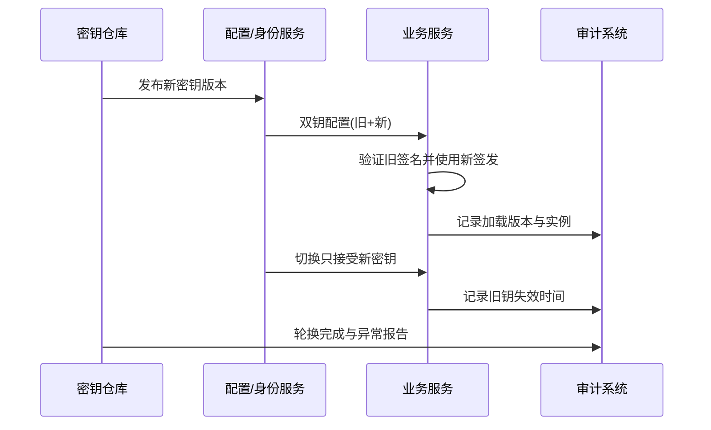

# 05 服务发现配置中心与治理

> 知识成熟度：L2
> 适用范围：平台可靠性-服务发现配置中心与治理
> 本文由《01-鉴权限流幂等灾备与可观测性》"六、服务发现、配置、密钥、证书、连接池与缓存"拆分而来，正文逐字迁移。

## 元数据
- 最后更新：2026-08-13。
- 知识成熟度：L2。
- 适用范围：平台可靠性-服务发现配置中心与治理。
- 知识基线：平台可靠性工程方案（非 UE 内置能力）；事实边界以原《01-鉴权限流幂等灾备与可观测性》对应章节为准。
- 拆分来源：原《01-鉴权限流幂等灾备与可观测性》"六、服务发现、配置、密钥、证书、连接池与缓存"。

## 概述
服务发现、配置、密钥证书、连接池与缓存构成平台治理的日常底座，每个组件都要有明确的失败行为。
本文给出服务发现契约、配置分层与热更新、双钥轮换、连接池上限、缓存一致性和故障注入的边界。
未知平台实现只记录这些契约，不推断当前项目已经使用哪种注册中心。

### 1.1 服务发现

服务发现（Service Discovery）负责把逻辑服务名映射到健康实例，不等于业务授权。
注册信息应包含实例 ID、地址、端口、协议、版本、区域、权重、过期时间和健康状态。
健康检查分为存活（liveness）和就绪（readiness）；进程活着但数据库不可用时，不应继续接收需要数据库的流量。
摘流要有宽限期，让长连接和进行中的请求完成或明确取消。
客户端缓存发现结果时要有 TTL、负缓存上限和版本感知，避免把已下线实例永久缓存。
发现中心不可用时，已有安全缓存可以短时工作，但新实例和故障实例的变化必须可观测。
未知平台实现只记录这些契约，不推断当前项目已经使用哪种注册中心。

### 1.2 配置管理

配置按静态构建参数、环境配置、动态开关、秘密材料和实验参数分层。
每次变更要有版本、操作者、原因、审批、发布时间和回滚/前向修复方案。
默认值必须安全，缺少关键配置时启动失败比使用空密码或无限超时更可控。
配置热更新要定义哪些字段可热更、何时生效、是否影响已有连接以及失败时如何保留旧值。
读取配置失败时不能把半份新配置和半份旧配置拼成未知状态。
动态限流和灰度配置要带 schema_version，服务端拒绝无法识别的字段或版本。

### 1.3 密钥与证书轮换

密钥（Secret）用于认证、签名、数据库连接或加密；证书（Certificate）用于身份和传输信任，两者都应有有效期和轮换责任人。
密钥不能进入 Git、镜像层、日志、异常堆栈或客户端包。
轮换应支持双钥窗口：先发布能验证旧钥并签发新钥的版本，再切换签发，最后撤销旧钥。
证书轮换要提前监测剩余有效期，验证完整链、主机名、信任根和所有区域的时钟。
私钥泄露时要有吊销、替换、缓存失效、审计和影响范围评估，而不是只重新部署一次。
服务账号应按用途拆分，读取密钥的权限与使用密钥访问业务资源的权限分离。



### 1.4 数据库连接池

连接池上限应由数据库可承受连接数、实例数、读写比例和慢请求时间共同计算。
连接池不是越大越好；每个实例都把池开满会让数据库在高峰时排队和上下文切换。
必须设置连接获取超时、空闲超时、最大生命周期、健康检查和事务回滚清理。
请求 deadline 到期时，应取消或释放数据库操作，不能让已超时请求继续占满连接。
长事务会阻塞锁、膨胀日志和连接池，应监测事务年龄和等待事件。
读写池可以分开，但故障切换时要避免读池继续指向已失效主库。
连接池指标至少包括 in_use、idle、waiters、acquire_latency、query_latency 和 timeout_count。

### 1.5 缓存一致性

缓存是派生状态还是临时协调状态，必须在设计上写清楚。
旁路缓存（Cache-Aside）适合读多写少的派生数据：先读缓存，未命中读数据库，再按版本写缓存。
写路径可以先写数据库再删缓存，也可以通过事件失效；每种方式都要处理删缓存失败和并发旧值回填。
缓存击穿需要单飞、短租约或请求合并；缓存雪崩需要过期抖动和分层降级；缓存穿透需要参数校验、空值短缓存或布隆过滤器。
货币、订单和背包的最终权威不能只存在缓存里。
缓存键要包含租户、区服、资源类型和 schema 版本，避免跨环境污染。
缓存失效消息重复是正常情况，失效操作应幂等。

```text
function read_player_inventory(account_id):
    key = "inventory:v3:" + account_id
    cached = cache.get(key)
    if cached != null and cached.version >= required_version:
        return cached.value
    value = database.read_inventory(account_id)
    cache.set(key, {version: value.version, value: value}, ttl=jittered_ttl())
    return value

function write_player_inventory(command):
    begin transaction
    value = database.apply_with_version(command)
    outbox.append(InventoryChanged(value.account_id, value.version))
    commit
    return value
```

缓存读到旧版本时，应优先以权威数据库或快照修复，不能为了命中率接受资产回退。

### 1.6 故障注入

故障注入（Fault Injection）是受控地引入延迟、错误、断连、丢包、磁盘压力、时钟偏差或实例终止。
注入前要定义范围、持续时间、停止条件、负责人、观测指标和回滚动作。
先在隔离环境验证，再在小流量灰度，最后才考虑生产演练。
注入对象要覆盖依赖超时、服务发现过期、配置不可用、密钥轮换、数据库主备切换和消息重复。
注入不应读取或暴露真实用户敏感数据，演练账号与生产玩家要隔离。
实验结束必须核对数据不变量、队列积压、连接泄漏、告警恢复和残留配置。

| 注入场景 | 预期行为 | 关键指标 | 停止条件 |
| --- | --- | --- | --- |
| 身份服务延迟 | 新登录进入排队或挑战 | auth latency、登录失败 | P1 影响扩大 |
| 数据库只读 | 写操作受控失败 | write error、pool wait | 数据损失迹象 |
| Redis 断连 | 限流保护和缓存降级 | fallback、命中率 | 未授权放行 |
| 消息重复 | 消费无二次副作用 | duplicate_count、账本差异 | 账本不平 |
| 证书临期 | 告警且不接受坏证书 | cert_expiry、TLS error | 连接大面积失败 |
| 区域摘流 | 流量迁移且不双主 | traffic、replication lag | 双写分叉 |

## 失败路径

| 失败路径 | 快速判断 | 默认动作 |
| --- | --- | --- |
| 发现中心不可用 | 缓存过期或为空 | 已有安全缓存短时工作，新实例和故障实例的变化可观测 |
| 配置读取失败 | 半份新配置 | 启动失败或保留旧值，不把半份新配置和半份旧配置拼成未知状态 |
| 密钥或证书泄露 | 私钥泄露报告 | 吊销、替换、缓存失效、审计和影响范围评估 |
| 连接池耗尽 | 获取超时、waiters 高 | 取消已超时请求的数据库操作，不让其继续占满连接 |
| 缓存写失效失败 | 缓存与库不一致 | 数据库仍权威，可修复缓存 |

## FAQ

### Q7：缓存命中率很高，为什么还要数据库对账？

缓存可能丢失、过期、乱序回填或被错误写入。订单、货币和背包的权威状态需要独立对账，缓存只能降低读取成本。

## 验收清单

- 服务发现把逻辑服务名映射到健康实例，liveness 与 readiness 分离，摘流有宽限期。
- 发现缓存带 TTL、负缓存上限和版本感知，不把已下线实例永久缓存。
- 配置变更记录版本、操作者、原因、审批、发布时间和回滚/前向修复方案。
- 缺少关键配置时启动失败，优于使用空密码或无限超时。
- 密钥不进 Git、镜像层、日志、异常堆栈或客户端包；轮换采用双钥窗口。
- 连接池设置获取超时、空闲超时、最大生命周期、健康检查和事务回滚清理。
- 缓存键包含租户、区服、资源类型和 schema 版本，缓存失效消息重复时失效操作幂等。
- 故障注入有范围、持续时间、停止条件、负责人、观测指标和回滚动作。

## 术语速查

服务发现与配置治理涉及较多平台术语，下表提供一句话定义与常见误解；完整行为见正文 1.1-1.6 各节及项目实际选型文档，本表不替代正文。

| 术语 | 一句话定义 | 常见误解 |
| --- | --- | --- |
| 注册中心（Registry） | 保存服务名到实例信息的映射，支持注册、心跳续约、摘除与查询 | "注册中心等于服务可用性"，健康状态由探针与心跳共同决定 |
| 心跳（Heartbeat） | 实例周期性上报存活信号，注册中心据此续约租约 | "心跳越频繁越安全"，过密心跳在网络抖动时反而放大误摘 |
| 租约/过期时间（Lease/TTL） | 实例注册的有效期，过期未续约视为失联 | "TTL 越长越稳"，过长会延迟故障摘除 |
| 存活检查（Liveness） | 判断进程是否活着，失败时停止接收流量并考虑重启 | "进程活着就能接流量"，依赖不可用时仍需就绪检查把关 |
| 就绪检查（Readiness） | 判断实例是否具备接收流量的能力，失败时摘流量但保留进程 | "就绪检查只是多一次请求"，它决定流量入口的开关 |
| 优雅下线（Graceful Shutdown） | 停止接收新请求，等待进行中请求完成或明确取消后再退出 | "直接 kill 也算下线"，缺少宽限期会中断进行中请求 |
| 摘流宽限期（Drain Window） | 下线前流量逐步迁移的时段，覆盖长连接与进行中请求 | "宽限期越长越好"，需按连接时长与发布节奏定值 |
| 配置中心（Config Center） | 集中管理配置版本、发布、热更新与回滚，按环境与区服隔离 | "配置中心等于文件服务器"，还需审批、schema 校验与回滚 |
| 配置漂移（Config Drift） | 期望配置与实际生效配置不一致的状态 | "漂移只在手工修改时发生"，热更失败与部分生效同样产生漂移 |
| 配置灰度（Config Canary） | 先让小范围实例加载新配置并验证，再逐步扩大生效范围 | "灰度只用于功能开关"，配置参数同样需要灰度 |
| 密钥仓库（Secret Vault） | 集中保存密钥并提供访问审计的存储，业务服务按需读取 | "密钥放环境变量就行"，仍要解决轮换、审计与权限分离 |
| 双钥轮换（Dual-Key Rotation） | 过渡期新旧密钥并存，验证通过后切换签发，最后撤销旧钥 | "发布新钥就完成轮换"，还需验证、切换、撤销三步 |
| 密钥轮换（Secret Rotation） | 周期性替换认证或加密密钥，配合灰度加载与失效窗口 | "轮换越快越好"，需保证新旧版本共存窗口可观测 |
| 负缓存（Negative Cache） | 短期缓存"查询无结果"的结论，防止空结果反复冲击注册中心 | "负缓存是错误缓存"，有 TTL 的负缓存是正常保护手段 |
| 服务名解析 | 把逻辑服务名解析为健康实例列表的过程 | "解析到实例就是授权"，服务发现不等于业务授权 |

## 落地检查清单

本节是服务发现、配置、密钥证书治理上线前逐项确认的执行检查，与"验收清单"一节的原理基线互补；未通过项按右列动作处理后再发布。

| 检查项 | 通过标准 | 未通过时的动作 |
| --- | --- | --- |
| 注册字段完整 | 注册信息含实例 ID、地址、端口、协议、版本、区域、权重与过期时间 | 缺字段注册被拒绝或告警 |
| 心跳参数校准 | 心跳间隔、判失联次数与摘除时间有数值依据并经过网络抖动演练（示意值需项目压测验证） | 未演练不得上线 |
| 探针分离 | liveness 与 readiness 使用不同检查逻辑 | 依赖不可用时 readiness 必须失败 |
| 摘流宽限期 | 下线流程的流量迁移窗口覆盖长连接与进行中请求 | 出现硬断连接视为未通过 |
| 发现缓存 | 客户端缓存带 TTL、负缓存上限与版本感知 | 无过期策略视为未通过 |
| 空结果保护 | 路由为空时有告警且不清空短期安全缓存 | 空结果直接生效视为缺陷 |
| 配置审批链 | 配置变更记录版本、操作者、原因、审批与发布时间 | 无记录视为未通过 |
| 变更影响面 | 高风险配置变更列出受影响服务与回滚顺序 | 无影响面说明不得发布 |
| 热更失败处理 | 热更失败保留旧值并告警，不出现半份配置 | 半份生效视为事故 |
| schema 校验 | 配置携带 schema_version，未知字段或版本被拒绝 | 忽略未知字段视为未通过 |
| 密钥轮换演练 | 双钥窗口的发布、验证、切换、撤销四步有演练记录 | 未演练不得执行生产轮换 |
| 泄露响应流程 | 私钥泄露的吊销、替换、缓存失效与审计步骤有书面流程 | 流程缺失视为未通过 |
| 证书监测 | 证书剩余有效期、信任链与各区域时钟纳入监测 | 临期无告警视为未通过 |
| 隔离验证 | 环境、租户、区服的配置隔离经过验证，跨环境引用会报错 | 未验证隔离视为未通过 |
| 对账机制 | 期望配置版本与实际生效版本定期对账，漂移可发现 | 无对账视为未通过 |
| 观测面板 | 注册数、心跳失败、配置版本分布、密钥加载版本与证书有效期有面板 | 指标缺失视为未完成 |
| 回滚演练 | 配置错误发布、密钥切换失败、注册中心切换三类回滚有演练报告 | 未演练场景列入行动清单 |

注：心跳与缓存类参数一经调整，需同步更新对账口径与演练记录，避免面板口径与配置不一致。

## 常见反模式

| 反模式 | 典型现象 | 后果 | 替代做法 |
| --- | --- | --- | --- |
| 只注册不探活 | 实例注册后无健康检查 | 依赖故障时流量仍进入 | 探针分离并按结果摘流 |
| 心跳过密过急 | 心跳间隔短、判失联阈值小 | 网络抖动引发批量误摘 | 参数经演练校准（示意值需项目压测验证） |
| 下线直接强杀 | 发布时立即终止进程 | 进行中请求中断、状态不一致 | 优雅下线加宽限期 |
| 发现结果永久缓存 | 客户端缓存无 TTL | 已下线实例持续收流量 | TTL 加负缓存与版本感知 |
| 绕过配置中心 | 手工修改本地配置或数据库 | 配置漂移、无法追溯 | 统一配置通道加对账 |
| 热更半份生效 | 配置部分加载失败仍继续运行 | 新旧混合的未知状态 | 失败保留旧值或启动失败 |
| 密钥一次性切换 | 无双钥窗口直接替换 | 新旧实例互不识别 | 双钥窗口分步切换 |
| 忽略 schema 版本 | 客户端不校验未知字段 | 新旧语义不一致 | schema_version 加拒绝未知字段 |
| 轮换不做演练 | 生产直接执行轮换步骤 | 失败后无回滚路径 | 演练加可重复检查单 |

## 典型故障案例

以下三个案例是同类事故的常见形态，用于复盘与演练设计，不代表本项目已发生的具体事件；案例中的参数均为示意值，需项目压测验证。

### 案例一：注册雪崩

- 背景：注册中心在网络抖动或自身短暂故障期间，大量实例心跳同时超时；客户端发现缓存 TTL 设置过短。
- 现象：注册中心批量摘除实例，客户端刷新后路由为空或实例数骤减，依赖这些实例的调用大量失败。
- 影响：故障从注册中心扩散到全部调用方，多个服务同时不可用，告警风暴掩盖真实根因。
- 排查：注册中心负载与心跳失败率同时飙升；发现缓存命中率骤降；"路由为空"告警集中出现且时间与注册中心抖动吻合。
- 根因：判失联阈值过短，网络抖动被当成实例故障；客户端对空结果直接生效，没有保留短期安全缓存；恢复后所有实例同时重注册，冲击注册中心。
- 处置：拉长判失联阈值并加入抖动；客户端对空结果保留短时旧缓存并告警；重注册做错峰与退避，避免瞬时打满注册中心。
- 预防：注册中心故障注入演练覆盖"批量心跳超时"场景；判失联参数用网络抖动场景校准（示意值需项目压测验证）；空结果保护纳入验收。
- 复盘要点：心跳与缓存参数的每一处数字都要回答"抖动时会发生什么"；雪崩的起点往往不是故障本身，而是对故障的瞬时反应。

### 案例二：配置漂移

- 背景：某区服活动配置通过配置中心发布，但部分实例此前被人手工改过本地文件，或热更失败后静默保留旧值。
- 现象：同一接口在不同实例上行为不一致，玩家随机遇到新旧两套规则；活动数据统计与预期不符。
- 影响：运营活动口径分裂，玩家体验不一致，后续数据对账与客服解释成本大幅上升。
- 排查：配置版本分布面板显示多版本并存；对比配置中心期望版本与各实例实际版本，定位漂移实例与首次变更时间。
- 根因：配置存在多个生效通道（本地文件、数据库、配置中心）；热更失败只保留旧值未告警；缺少期望版本与实际版本的定期对账。
- 处置：将漂移实例恢复为配置中心版本并验证行为一致；对热更失败实例补告警并自动回滚；建立定期对账任务。
- 预防：配置变更一律走配置中心单一通道；对账纳入巡检；热更失败必须可见，不允许静默保留旧值。
- 复盘要点：配置治理的目标是"任何实例的实际生效版本都可回答"；对账是发现漂移的最低成本手段。

### 案例三：密钥轮换失败

- 背景：例行密钥轮换按计划发布新密钥，但发布与切换几乎同时执行，且部分实例只在启动时加载密钥。
- 现象：轮换发布后部分实例无法通过下游认证，数据库连接与服务间调用批量认证失败，连接池重建引发延迟尖峰。
- 影响：依赖认证的服务可用性下降，轮换窗口被拉长，运维被迫紧急回滚并承担额外沟通成本。
- 排查：按实例统计密钥版本加载情况，发现新旧版本混载且切换窗口不重叠；认证失败时间与轮换发布时间吻合；审计日志显示部分实例从未加载新版本。
- 根因：双钥窗口未真正双开；实例加载密钥时机不一致（启动加载与热加载并存）；缺少"旧钥仍可接受"的验证环节。
- 处置：先回滚到旧钥并确认全量恢复；修复为"发布双钥共存版本→验证→切换签发→撤销旧钥"的顺序；对未加载新版本的实例触发重载并验证。
- 预防：轮换演练覆盖"部分实例未加载"场景；密钥加载版本纳入观测面板；轮换步骤做成可重复执行的检查单。
- 复盘要点：密钥轮换的风险不在密钥本身，而在加载时机与双钥窗口；轮换节奏必须能被观测和回滚。

### 案例共性

- 三个案例的扩散点都在"参数与缓存策略"：判失联阈值、缓存 TTL、双钥窗口长度直接影响故障半径。
- 恢复路径与故障路径同样关键：注册重放、热更回滚、密钥回滚都要有演练过的顺序。
- 故障注入应覆盖"部分实例生效"场景：部分摘除、部分热更、部分加载新密钥比全量故障更常见。

### 自检问题

- 注册中心整体不可用时，新实例能否注册、旧实例能否按缓存继续服务？
- 配置中心不可用时，实例使用最后一次成功配置还是拒绝启动？两种策略分别覆盖哪些场景？
- 密钥轮换失败后的回滚是否需要跨团队协调？该路径演练过吗？
- 某实例长期心跳正常但响应超时，现有监控能否区分"进程活着"与"可服务"？

## 补充示例

服务注册与健康检查的契约示例（字段与数值均为示意值，需项目压测验证，并按实际注册中心调整）：

```yaml
service_registration:
  service_name: matchmaking
  instance_id: mm-cn-sh1-001
  address: 10.20.30.40
  port: 8080
  protocol: grpc
  version: 1.4.2
  zone: cn-sh1
  weight: 100
  lease_ttl_seconds: 30
  heartbeat_interval_seconds: 10
  readiness:
    path: /healthz/ready
    timeout_seconds: 2
    healthy_when: ready
  graceful_shutdown:
    drain_seconds: 60
    force_exit_after_seconds: 90
    unregister_before_exit: true
```

说明：

- 注册字段与探针参数需按实际注册中心调整，字段名仅为契约示意，不代表当前项目已采用该实现。
- 心跳续约、摘流宽限期与正文"1.1 服务发现"的契约一致，数值需项目压测验证。
- 下线顺序为先注销实例，再等待宽限期结束或强制退出，避免"先杀进程再注销"。
- 本示例只表达契约结构，不推断当前项目使用哪种注册中心。

## 关联阅读

- [00-平台可靠性总览与迁移说明.md](00-平台可靠性总览与迁移说明.md)：本目录总览与迁移说明，含责任边界、最佳实践清单与 FAQ。
- [04-平台与可靠性/README.md](README.md)：本目录导航与学习路径。
- [02-数据与业务/02-缓存与排行榜系统.md](../02-数据与业务/02-缓存与排行榜系统.md)：缓存一致性、排行榜与缓存失效专题细节。
- [02-数据与业务/05-部署运维与监控.md](../../知识/08-工程实践与质量/部署运维与可观测性/05-部署运维与监控.md)：部署、配置与运维监控专题细节。
- [Kubernetes Documentation](https://kubernetes.io/docs/)：服务编排、探针、发布和资源治理的官方文档入口。
- [Redis Documentation](https://redis.io/docs/latest/)：缓存、原子操作和限流实现参考。

## 更新日志

- 2026-08-13：从《01-鉴权限流幂等灾备与可观测性》"六、服务发现、配置、密钥、证书、连接池与缓存"（6.1-6.6）拆出独立成篇；正文逐字迁移，标题按本文重编号。
- 2026-08-13：扩写术语速查、落地检查清单、常见反模式、典型故障案例与补充示例，正文补充至 300+ 行。
