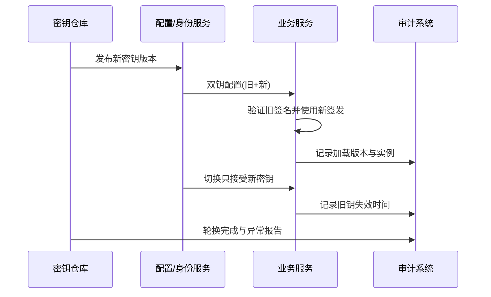

# 05 服务发现配置中心与治理

> 知识成熟度：L2
> 适用范围：平台可靠性-服务发现配置中心与治理
> 本文由《01-鉴权限流幂等灾备与可观测性》"六、服务发现、配置、密钥、证书、连接池与缓存"拆分而来，正文逐字迁移。

## 元数据
- 最后更新：2026-08-13。
- 知识成熟度：L2。
- 适用范围：平台可靠性-服务发现配置中心与治理。
- 知识基线：平台可靠性工程方案（非 UE 内置能力）；事实边界以原《01-鉴权限流幂等灾备与可观测性》对应章节为准。
- 拆分来源：原《01-鉴权限流幂等灾备与可观测性》"六、服务发现、配置、密钥、证书、连接池与缓存"。

## 概述
服务发现、配置、密钥证书、连接池与缓存构成平台治理的日常底座，每个组件都要有明确的失败行为。
本文给出服务发现契约、配置分层与热更新、双钥轮换、连接池上限、缓存一致性和故障注入的边界。
未知平台实现只记录这些契约，不推断当前项目已经使用哪种注册中心。

### 1.1 服务发现

服务发现（Service Discovery）负责把逻辑服务名映射到健康实例，不等于业务授权。
注册信息应包含实例 ID、地址、端口、协议、版本、区域、权重、过期时间和健康状态。
健康检查分为存活（liveness）和就绪（readiness）；进程活着但数据库不可用时，不应继续接收需要数据库的流量。
摘流要有宽限期，让长连接和进行中的请求完成或明确取消。
客户端缓存发现结果时要有 TTL、负缓存上限和版本感知，避免把已下线实例永久缓存。
发现中心不可用时，已有安全缓存可以短时工作，但新实例和故障实例的变化必须可观测。
未知平台实现只记录这些契约，不推断当前项目已经使用哪种注册中心。

### 1.2 配置管理

配置按静态构建参数、环境配置、动态开关、秘密材料和实验参数分层。
每次变更要有版本、操作者、原因、审批、发布时间和回滚/前向修复方案。
默认值必须安全，缺少关键配置时启动失败比使用空密码或无限超时更可控。
配置热更新要定义哪些字段可热更、何时生效、是否影响已有连接以及失败时如何保留旧值。
读取配置失败时不能把半份新配置和半份旧配置拼成未知状态。
动态限流和灰度配置要带 schema_version，服务端拒绝无法识别的字段或版本。

### 1.3 密钥与证书轮换

密钥（Secret）用于认证、签名、数据库连接或加密；证书（Certificate）用于身份和传输信任，两者都应有有效期和轮换责任人。
密钥不能进入 Git、镜像层、日志、异常堆栈或客户端包。
轮换应支持双钥窗口：先发布能验证旧钥并签发新钥的版本，再切换签发，最后撤销旧钥。
证书轮换要提前监测剩余有效期，验证完整链、主机名、信任根和所有区域的时钟。
私钥泄露时要有吊销、替换、缓存失效、审计和影响范围评估，而不是只重新部署一次。
服务账号应按用途拆分，读取密钥的权限与使用密钥访问业务资源的权限分离。



### 1.4 数据库连接池

连接池上限应由数据库可承受连接数、实例数、读写比例和慢请求时间共同计算。
连接池不是越大越好；每个实例都把池开满会让数据库在高峰时排队和上下文切换。
必须设置连接获取超时、空闲超时、最大生命周期、健康检查和事务回滚清理。
请求 deadline 到期时，应取消或释放数据库操作，不能让已超时请求继续占满连接。
长事务会阻塞锁、膨胀日志和连接池，应监测事务年龄和等待事件。
读写池可以分开，但故障切换时要避免读池继续指向已失效主库。
连接池指标至少包括 in_use、idle、waiters、acquire_latency、query_latency 和 timeout_count。

### 1.5 缓存一致性

缓存是派生状态还是临时协调状态，必须在设计上写清楚。
旁路缓存（Cache-Aside）适合读多写少的派生数据：先读缓存，未命中读数据库，再按版本写缓存。
写路径可以先写数据库再删缓存，也可以通过事件失效；每种方式都要处理删缓存失败和并发旧值回填。
缓存击穿需要单飞、短租约或请求合并；缓存雪崩需要过期抖动和分层降级；缓存穿透需要参数校验、空值短缓存或布隆过滤器。
货币、订单和背包的最终权威不能只存在缓存里。
缓存键要包含租户、区服、资源类型和 schema 版本，避免跨环境污染。
缓存失效消息重复是正常情况，失效操作应幂等。

```text
function read_player_inventory(account_id):
    key = "inventory:v3:" + account_id
    cached = cache.get(key)
    if cached != null and cached.version >= required_version:
        return cached.value
    value = database.read_inventory(account_id)
    cache.set(key, {version: value.version, value: value}, ttl=jittered_ttl())
    return value

function write_player_inventory(command):
    begin transaction
    value = database.apply_with_version(command)
    outbox.append(InventoryChanged(value.account_id, value.version))
    commit
    return value
```

缓存读到旧版本时，应优先以权威数据库或快照修复，不能为了命中率接受资产回退。

### 1.6 故障注入

故障注入（Fault Injection）是受控地引入延迟、错误、断连、丢包、磁盘压力、时钟偏差或实例终止。
注入前要定义范围、持续时间、停止条件、负责人、观测指标和回滚动作。
先在隔离环境验证，再在小流量灰度，最后才考虑生产演练。
注入对象要覆盖依赖超时、服务发现过期、配置不可用、密钥轮换、数据库主备切换和消息重复。
注入不应读取或暴露真实用户敏感数据，演练账号与生产玩家要隔离。
实验结束必须核对数据不变量、队列积压、连接泄漏、告警恢复和残留配置。

| 注入场景 | 预期行为 | 关键指标 | 停止条件 |
| --- | --- | --- | --- |
| 身份服务延迟 | 新登录进入排队或挑战 | auth latency、登录失败 | P1 影响扩大 |
| 数据库只读 | 写操作受控失败 | write error、pool wait | 数据损失迹象 |
| Redis 断连 | 限流保护和缓存降级 | fallback、命中率 | 未授权放行 |
| 消息重复 | 消费无二次副作用 | duplicate_count、账本差异 | 账本不平 |
| 证书临期 | 告警且不接受坏证书 | cert_expiry、TLS error | 连接大面积失败 |
| 区域摘流 | 流量迁移且不双主 | traffic、replication lag | 双写分叉 |

## 失败路径

| 失败路径 | 快速判断 | 默认动作 |
| --- | --- | --- |
| 发现中心不可用 | 缓存过期或为空 | 已有安全缓存短时工作，新实例和故障实例的变化可观测 |
| 配置读取失败 | 半份新配置 | 启动失败或保留旧值，不把半份新配置和半份旧配置拼成未知状态 |
| 密钥或证书泄露 | 私钥泄露报告 | 吊销、替换、缓存失效、审计和影响范围评估 |
| 连接池耗尽 | 获取超时、waiters 高 | 取消已超时请求的数据库操作，不让其继续占满连接 |
| 缓存写失效失败 | 缓存与库不一致 | 数据库仍权威，可修复缓存 |

## FAQ

### Q7：缓存命中率很高，为什么还要数据库对账？

缓存可能丢失、过期、乱序回填或被错误写入。订单、货币和背包的权威状态需要独立对账，缓存只能降低读取成本。

## 验收清单

- 服务发现把逻辑服务名映射到健康实例，liveness 与 readiness 分离，摘流有宽限期。
- 发现缓存带 TTL、负缓存上限和版本感知，不把已下线实例永久缓存。
- 配置变更记录版本、操作者、原因、审批、发布时间和回滚/前向修复方案。
- 缺少关键配置时启动失败，优于使用空密码或无限超时。
- 密钥不进 Git、镜像层、日志、异常堆栈或客户端包；轮换采用双钥窗口。
- 连接池设置获取超时、空闲超时、最大生命周期、健康检查和事务回滚清理。
- 缓存键包含租户、区服、资源类型和 schema 版本，缓存失效消息重复时失效操作幂等。
- 故障注入有范围、持续时间、停止条件、负责人、观测指标和回滚动作。

## 关联阅读

- [00-平台可靠性总览与迁移说明.md](00-平台可靠性总览与迁移说明.md)：本目录总览与迁移说明，含责任边界、最佳实践清单与 FAQ。
- [04-平台与可靠性/README.md](README.md)：本目录导航与学习路径。
- [02-数据与业务/02-缓存与排行榜系统.md](../02-数据与业务/02-缓存与排行榜系统.md)：缓存一致性、排行榜与缓存失效专题细节。
- [02-数据与业务/05-部署运维与监控.md](../02-数据与业务/05-部署运维与监控.md)：部署、配置与运维监控专题细节。
- [Kubernetes Documentation](https://kubernetes.io/docs/)：服务编排、探针、发布和资源治理的官方文档入口。
- [Redis Documentation](https://redis.io/docs/latest/)：缓存、原子操作和限流实现参考。

## 更新日志

- 2026-08-13：从《01-鉴权限流幂等灾备与可观测性》"六、服务发现、配置、密钥、证书、连接池与缓存"（6.1-6.6）拆出独立成篇；正文逐字迁移，标题按本文重编号。
