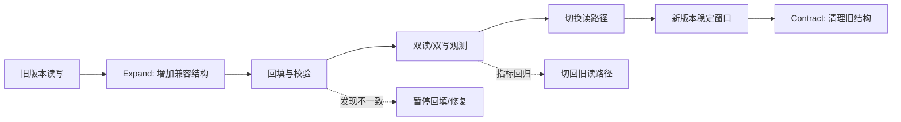

# 07 故障恢复容灾与多活

> 知识成熟度：L2
> 适用范围：平台可靠性-故障恢复容灾与多活
> 本文由《01-鉴权限流幂等灾备与可观测性》"五、数据迁移、备份、RPO/RTO 与跨区灾备"拆分而来，正文逐字迁移。

## 元数据
- 最后更新：2026-08-13。
- 知识成熟度：L2。
- 适用范围：平台可靠性-故障恢复容灾与多活。
- 知识基线：平台可靠性工程方案（非 UE 内置能力）；事实边界以原《01-鉴权限流幂等灾备与可观测性》对应章节为准。
- 拆分来源：原《01-鉴权限流幂等灾备与可观测性》"五、数据迁移、备份、RPO/RTO 与跨区灾备"。

## 概述
数据迁移与灾备的目标是把故障时的数据损失和恢复时间限制在可接受范围。
本文覆盖 Expand/Contract、版本兼容矩阵、不可逆回滚、快照与增量备份、RPO/RTO、跨区灾备、演练与审计。
恢复后要核对订单、货币、背包、匹配和登录的业务不变量，而不是只看进程为绿色。

### 1.1 Expand/Contract

Expand/Contract 是在线迁移的基本节奏：先扩展兼容结构，再切换读写，最后收缩旧结构。
Expand 阶段只增加可选列、兼容表、双写或新索引，旧版本必须仍能工作。
迁移脚本应可观测、可暂停、可分批、可限速，并记录批次游标。
回填任务要按主键范围或稳定游标推进，避免 OFFSET 在数据变化时跳过或重复。
切换阶段先确保新字段已回填、双读一致、读写开关可回退。
Contract 阶段只能在所有旧客户端、旧服务和回放工具退出兼容窗口后执行。
删除列、重命名、改变枚举语义和压缩历史数据可能不可逆，必须单独审批和备份。



### 1.2 版本兼容矩阵

| 生产者 | 消费者 | 兼容要求 | 门禁 |
| --- | --- | --- | --- |
| 旧客户端 | 新服务端 | 服务端接受旧字段和旧枚举 | 协议回放 |
| 新客户端 | 旧服务端 | 仅在声明的向后兼容窗口允许 | 版本矩阵 |
| 旧服务 | 新数据库 | 新列可选，旧 SQL 不报错 | 集成测试 |
| 新服务 | 旧数据库 | 不读不存在的列，不发送新枚举 | 迁移前测试 |
| 新生产者 | 旧消费者 | 事件新增字段可忽略 | schema 检查 |
| 旧生产者 | 新消费者 | 默认值和旧事件版本处理 | 回放旧事件 |

协议兼容不只是字段“能解析”，还包括语义、错误码、默认值、时间单位、枚举未知值和状态转换。
兼容窗口应写入服务端版本矩阵，并在发布门禁中自动验证。

### 1.3 回滚不可逆性

代码回滚不等于数据回滚。
新增可选列通常可与旧代码共存；删除列、改写数据、消耗随机序列、发放货币和外部支付通常不可安全反向恢复。
对不可逆操作，应采用前向修复、补偿事务、快照恢复到新表或人工对账，而不是要求数据库“回到昨天”。
每个迁移计划都应列出可逆、部分可逆、不可逆三类动作。
回滚按钮若只能回滚服务二进制，界面应明确禁止把它描述为完整回滚。
生产迁移前必须在同版本快照和代表性数据集上演练恢复与前向修复。

### 1.4 快照与增量备份

快照备份（Full/Snapshot）便于恢复某个时间点，但可能成本高、恢复窗口大。
增量或连续归档（Incremental/WAL Archive）降低备份窗口，并支持更细的恢复点，但依赖完整链条和校验。
备份必须与主数据隔离，至少使用不同故障域和不同访问凭证。
备份成功不等于可恢复，必须定期做自动校验、抽样恢复和完整灾备演练。
加密备份的密钥轮换不能让历史备份失去解密能力，密钥托管和恢复权限要有双人或分权策略。
备份保留期应根据合规、运营回溯、赛季周期和成本确定。
PostgreSQL 的事务、备份与恢复能力可参考 [PostgreSQL Documentation](https://www.postgresql.org/docs/)，目标数据库不同则要替换为对应官方文档和演练证据。

### 1.5 RPO/RTO

恢复点目标（RPO，Recovery Point Objective）表示故障时最多允许丢失多长时间的数据。
恢复时间目标（RTO，Recovery Time Objective）表示从故障确认到服务恢复到目标状态允许经过多长时间。
RPO 是数据损失预算，不是备份频率的同义词；RTO 是业务恢复预算，不是容器启动时间的同义词。
每个业务域应单独写 RPO/RTO，因为登录、货币、聊天和排行榜的容忍度不同。

| 业务域 | 示例目标（需压测确认） | 可接受降级 | 关键证据 |
| --- | --- | --- | --- |
| 登录与会话 | RPO 分钟级，RTO 分钟级 | 已有会话有限续期、禁止新高风险登录 | 会话存储恢复演练 |
| 货币与订单 | RPO 接近零，RTO 分钟级 | 写入暂停、查询和对账优先 | 账本/订单对账 |
| 背包 | RPO 秒到分钟级 | 只读背包、延迟发奖 | 快照与流水恢复 |
| 匹配队列 | RPO 可丢弃，RTO 分钟级 | 清空并重建队列 | ticket 重建脚本 |
| 排行榜 | RPO 小时级可讨论 | 返回旧快照 | 重算任务 |
| 聊天 | RPO 分钟级 | 降级为区域或频道只读 | 消息重放 |

### 1.6 跨区灾备

跨区复制可采用主备、温备、双写或按域拆分，具体模式依赖一致性、成本和运维能力。
主备切换必须有唯一主权或租约，避免双主同时发放货币。
异步复制意味着 RPO 不为零，切换时应记录复制位点并处理未复制事务。
双写不是自动高可用；任何一侧失败都需要重试、对账、冲突策略和降级。
跨区流量切换应验证 DNS、证书、服务发现、密钥、配置、队列和第三方回调地址。
只切网关不切数据权威会制造更难修复的双写分叉。
灾备区要有最小可运行的观测、审计和管理权限，不能等主区故障时临时安装工具。

### 1.7 演练与审计

演练分为桌面推演、组件恢复、单区故障、数据恢复、全链路切换和回切演练。
每次演练都记录开始时间、故障注入、检测时间、决策时间、恢复时间、数据差异和未完成项。
演练脚本必须包含停止条件，避免为了追求恢复而扩大数据破坏范围。
审计日志需要与业务日志分离保存，至少记录谁在何时以什么版本执行了什么恢复或切换动作。
恢复后要核对订单、货币、背包、匹配和登录的业务不变量，而不是只看进程为绿色。
演练结果要转成可追踪的行动项、负责人、截止日期和复验记录。

### 1.8 灾备示意 YAML

```yaml
disaster_recovery:
  primary_region: region-a
  standby_region: region-b
  objectives:
    account_session:
      rpo: 5m
      rto: 10m
    economy:
      rpo: 0m
      rto: 15m
  failover:
    require_fencing: true
    require_operator_confirmation: true
    health_checks:
      - replication_lag
      - ledger_consistency
      - certificate_validity
      - dependency_reachability
  restore:
    require_point_in_time_selection: true
    verify_checksums: true
    run_reconciliation: true
  audit:
    retention_days: 365
```

## 失败路径

| 失败路径 | 快速判断 | 默认动作 |
| --- | --- | --- |
| 回填不一致 | 双读校验失败 | 暂停回填/修复，指标回归后切回旧读路径 |
| 迁移不可逆动作已执行 | 删除列/改写数据 | 前向修复、补偿事务、快照恢复或人工对账，不要求数据库回退 |
| 备份不可恢复 | 抽样恢复失败 | 自动校验、抽样恢复和完整灾备演练 |
| 双主写入 | 主权/租约丢失 | 唯一主权或租约，避免双主同时发放货币 |
| 复制位点丢失 | 异步复制 RPO 不为零 | 切换时记录复制位点并处理未复制事务 |
| 演练无停止条件 | 恢复动作扩大破坏 | 停止条件写入演练脚本 |

## FAQ

### Q6：数据库迁移失败后直接回滚代码是否安全？

不一定。代码可以回滚，数据结构和已写入数据可能不可逆。应先检查迁移阶段、兼容矩阵、备份和前向修复方案，再决定回滚或暂停。

### Q10：灾备切换成功，为什么还不能宣布恢复？

进程和路由健康不代表业务正确。还要核对复制位点、订单/货币/背包不变量、消息积压、证书密钥、审计链和回切计划。

## 验收清单

- Expand/Contract 分阶段执行，切换前新字段已回填、双读一致、读写开关可回退。
- 版本兼容矩阵覆盖客户端/服务端/数据库/事件生产消费者的兼容要求，兼容窗口进发布门禁。
- 每个迁移计划列出可逆、部分可逆、不可逆三类动作。
- 备份与主数据隔离，使用不同故障域和不同访问凭证。
- 备份定期自动校验、抽样恢复和完整灾备演练，加密密钥轮换不使历史备份失去解密能力。
- RPO/RTO 按业务域单独写，登录、货币、背包、匹配、排行榜和聊天的容忍度不同。
- 跨区切换验证 DNS、证书、服务发现、密钥、配置、队列和第三方回调地址。
- 恢复后核对订单、货币、背包、匹配和登录的业务不变量，演练结果转成可追踪行动项。

## 关联阅读

- [00-平台可靠性总览与迁移说明.md](00-平台可靠性总览与迁移说明.md)：本目录总览与迁移说明，含责任边界、最佳实践清单与 FAQ。
- [04-平台与可靠性/README.md](README.md)：本目录导航与学习路径。
- [02-数据与业务/03-分布式与高可用.md](../02-数据与业务/03-分布式与高可用.md)：高可用、复制与故障切换专题细节。
- [02-数据与业务/01-数据库选型与存储设计.md](../02-数据与业务/01-数据库选型与存储设计.md)：备份、恢复与存储设计细节。
- [游戏AI/03-评测与安全/01-AI评测回放与LLM安全.md](../../游戏AI/03-评测与安全/01-AI评测回放与LLM安全.md)：回放、评测、安全边界和审计思路可迁移到恢复演练与审计。
- [PostgreSQL Documentation](https://www.postgresql.org/docs/)：事务、索引、备份与恢复的官方文档入口。

## 更新日志

- 2026-08-13：从《01-鉴权限流幂等灾备与可观测性》"五、数据迁移、备份、RPO/RTO 与跨区灾备"（5.1-5.8）拆出独立成篇；正文逐字迁移，标题按本文重编号。
