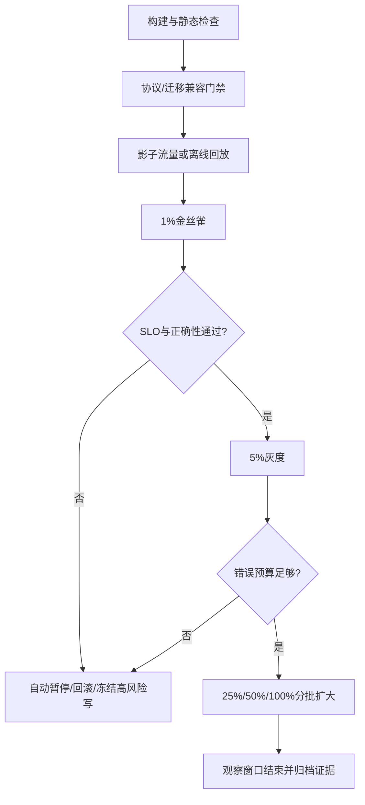

# 08 灰度发布回滚与事故复盘

> 知识成熟度：L2
> 适用范围：平台可靠性-灰度发布回滚与事故复盘
> 本文由《01-鉴权限流幂等灾备与可观测性》"八、灰度、金丝雀、协议兼容与自动回滚"与"九、端到端运行闭环与事故复盘"拆分而来，正文逐字迁移。

## 元数据
- 最后更新：2026-08-13。
- 知识成熟度：L2。
- 适用范围：平台可靠性-灰度发布回滚与事故复盘。
- 知识基线：平台可靠性工程方案（非 UE 内置能力）；事实边界以原《01-鉴权限流幂等灾备与可观测性》对应章节为准。
- 拆分来源：原《01-鉴权限流幂等灾备与可观测性》"八、灰度、金丝雀、协议兼容与自动回滚"与"九、端到端运行闭环与事故复盘"。

## 概述
发布闭环用灰度、金丝雀、协议兼容和自动回滚控制变更的 blast radius，用测试矩阵和事故复盘把每一次故障变成可复验的能力。
本文覆盖灰度策略、客户端与服务端版本矩阵、自动回滚条件、一次订单请求的检查顺序与事故复盘模板。
自动回滚只覆盖代码和可逆配置，不可逆数据库变更应触发暂停、前向修复或人工决策。

### 1.1 灰度策略

灰度（Canary）是把新版本限制在可控比例、区域、设备、账号或流量标签中，观察真实指标后再扩大范围。
金丝雀批次必须有固定的目标集合、最小观察窗口、通过阈值和自动暂停条件。
灰度键应稳定，否则同一玩家在新旧版本之间抖动会制造不可复现问题。
高风险经济操作可以先灰度只读、影子计算或审计模式，再开放写入。
灰度期间要保留旧版本处理新旧协议的能力，直到兼容窗口结束。
不能只看平均错误率；要看核心用户、区服、客户端版本、资源类型和尾延迟。



### 1.2 客户端与服务端版本矩阵

| 客户端 | 服务端 | 处理策略 | 备注 |
| --- | --- | --- | --- |
| N-1 | N | 正常兼容 | 默认发布路径 |
| N | N | 正常兼容 | 新功能可用 |
| N+1 | N | 仅当协议声明兼容 | 未知字段可忽略 |
| 过旧 | N | 强制升级或只读 | 需公告和迁移数据 |
| N | N-canary | 按稳定灰度键路由 | 记录版本标签 |
| N | N-rollback | 旧协议仍能解析 | 不回滚不可逆数据 |

协议应通过 schema diff、旧客户端回放、新客户端回放、未知字段和未知枚举测试。
错误码是协议的一部分，不能把所有服务端异常都改成同一个“网络错误”。
时间戳单位、数值范围、ID 是否可能超过 32 位和空值语义都要进入矩阵。
长连接升级时要说明旧连接如何排空、心跳如何继续、重连如何选择版本。

### 1.3 自动回滚条件

自动回滚适合代码和可逆配置；不可逆数据库变更应触发暂停、前向修复或人工决策。
回滚条件应包含错误率、p99、成功状态迁移率、重复副作用、账本差异、队列积压和资源饱和。
阈值需要最小样本数和连续窗口，避免一个请求就触发回滚。
回滚动作要记录触发指标快照、版本、批次、操作者和命令结果。
回滚后应继续观察旧版本，防止旧版本承载被放大的流量而再次故障。
如果新旧版本共享数据库，回滚前必须检查 schema 和事件版本的兼容性。

### 1.4 一次订单请求的检查顺序

```text
1. 接入层校验 TLS、协议版本、请求大小和超时。
2. 网关提取 trace_id，执行连接/来源/路由限流。
3. 身份服务校验 access token 的签名、aud、scope、过期时间和会话撤销状态。
4. 授权中间件以 account_id、订单资源和动作执行默认拒绝的策略检查。
5. 业务服务校验幂等键、请求摘要、价格快照和当前状态。
6. 数据库事务锁定订单/资产版本，写入业务状态与 Outbox。
7. 提交后发布器投递事件，消费者按 event_id 去重并执行履约。
8. API 返回已完成、处理中或明确失败，不根据网络超时猜测状态。
9. traces/metrics/logs 记录相同 trace_id、订单号哈希、版本和错误分类。
10. 对账任务检查支付、订单、货币和背包不变量。
```

### 1.5 测试矩阵

| 层级 | 场景 | 断言 | 证据 |
| --- | --- | --- | --- |
| 单元 | token 过期、scope 缺失 | 默认拒绝且错误分类稳定 | 测试报告 |
| 单元 | 令牌桶并发抢令牌 | 不超过预算，Retry-After 合法 | 并发测试 |
| 单元 | 幂等键同参/异参 | 同参复用结果，异参冲突 | 去重表记录 |
| 单元 | 状态机非法迁移 | 无副作用并留原因 | 状态覆盖率 |
| 集成 | DB 提交后响应丢失 | 重试查询原结果 | 注入日志 |
| 集成 | Outbox 发布重复 | 消费端只生效一次 | event_id 对账 |
| 集成 | 消息乱序 | 旧版本不覆盖新状态 | 版本断言 |
| 集成 | 缓存失效失败 | 数据库仍权威，可修复缓存 | 一致性检查 |
| 集成 | 密钥双钥轮换 | 旧验签、新签发均可用 | 轮换报告 |
| 集成 | 证书替换 | 所有区域连接成功 | TLS 探针 |
| 系统 | 数据库只读 | 高风险写阻断，读路径有说明 | SLO/告警 |
| 系统 | 服务发现不可用 | 安全缓存短时工作并告警 | 故障注入 |
| 系统 | Redis 全断 | 限流与缓存降级不越权 | 流量记录 |
| 系统 | 区域摘流 | 无双主，业务进入目标模式 | 切换时间线 |
| 系统 | 客户端旧版本灰度 | 协议兼容，错误码稳定 | 回放报告 |
| 压测 | 开服尖峰 | SLO、限流、队列边界满足 | 压测曲线 |
| 压测 | 重试风暴 | 放大受控，熔断生效 | 依赖 QPS |
| 灾备 | 时间点恢复 | RPO/RTO 与账本校验满足 | 恢复报告 |
| 灾备 | 回切 | 复制位点和主权明确 | 回切记录 |
| 发布 | 1% 金丝雀 | 阈值通过才扩大 | 发布审计 |
| 发布 | 自动回滚 | 触发、暂停、回滚均可追踪 | 事件记录 |

### 1.6 事故复盘模板

事故编号：

发生时间与时区：

影响区域、区服、客户端版本和用户比例：

受影响的 SLO/业务不变量：

检测来源与检测延迟：

第一条可验证证据：

时间线：

止损动作及其副作用：

身份/权限是否涉及越权：

限流、重试、熔断是否按预期工作：

幂等、Outbox、消息重复是否造成业务副作用：

数据迁移、备份、RPO/RTO 是否涉及：

灰度批次、版本和配置变更：

恢复判定和业务对账结果：

根因、促成因素和未触发的防线：

短期修复、长期行动项、负责人和截止日期：

复验方式与关闭条件：

复盘应关注系统和流程如何允许错误发生，避免把责任归结为“某人忘了重试”。
所有行动项要有可测量的完成定义，例如新增一条断链测试、缩短凭证有效期或完成一次恢复演练。

### 1.7 术语速查

发布与复盘相关术语的团队统一口径如下；口径调整需同步更新发布门禁、回滚条件与复盘模板。

| 术语 | 含义 | 使用要点 |
| --- | --- | --- |
| 灰度（Canary） | 把新版本限制在可控比例或范围内观察 | 每档有观察窗口与通过阈值 |
| 金丝雀批次 | 固定目标集合的最小发布单元 | 目标集合、窗口、阈值、暂停条件齐备 |
| 蓝绿发布 | 新旧两套完整环境整体切换 | 切换后旧环境保留待回切 |
| 滚动发布 | 按实例分批替换 | 每批观察指标后再继续 |
| 回滚 | 恢复到上一可验证版本 | 只用于代码与可逆配置 |
| 前向修复 | 在当前版本上修复并继续发布 | 用于不可逆数据库变更等场景 |
| Expand-Contract | 先扩展兼容再收缩旧路径 | 常见于 schema 与事件迁移 |
| 灰度键 | 决定流量归属新旧版本的稳定标识 | 账号、设备等长期稳定字段优先 |
| 影子流量 | 复制流量到新版本但不影响真实结果 | 适合高风险经济操作先验证 |
| 爆炸半径 | 单次变更可影响的范围 | 用比例、区域、功能面控制 |
| 5 Whys | 逐层追问根因的提问方法 | 结合证据使用，避免停留在表面 |
| 复盘（Postmortem） | 面向系统与流程的故障后分析 | 输出可测量行动项并跟踪关闭 |

易混术语对照：

| 易混对 | 区别 |
| --- | --- |
| 灰度与蓝绿 | 灰度为比例渐进，蓝绿为整体切换，可组合使用 |
| 回滚与前向修复 | 回滚恢复旧版本，前向修复在现版本上继续 |
| Expand-Contract 与回滚 | 前者先兼容再收缩，回滚是回到已知良好版本 |
| 5 Whys 与个人归因 | 5 Whys 追问流程与系统，归因到个人会阻断改进 |

术语口径应与发布流程、告警与复盘模板保持一致，避免同一概念在不同文档中含义漂移；新成员培训也应使用同一套口径。

术语表应在文档评审时同步维护，新增术语先在此登记，再进入正文。

口径不一致是发布争议最常见的来源，术语表应在评审中先于技术细节确认。

### 1.8 落地检查清单

发布流程季度评审或每次大型版本前核对；通过标准全部满足才视为闭环。

| 检查项 | 通过标准 |
| --- | --- |
| 灰度键稳定 | 同一账号或设备在观察期内不抖动 |
| 金丝雀批次定义 | 目标集合、最小观察窗口、通过阈值、自动暂停条件齐备 |
| 放量节奏 | 每档有等待窗口，前档未通过不放大 |
| 经济操作灰度 | 只读、影子或审计模式先行，写入后置 |
| 协议兼容 | N-1/N/N+1 矩阵用例全部通过 |
| 版本标签 | 请求与日志携带服务端与客户端版本 |
| 回滚条件 | 含错误率、p99、成功状态迁移率、账本差异等 |
| 回滚阈值稳健 | 最小样本数与连续窗口，不因单请求触发 |
| 回滚可追踪 | 记录触发快照、版本、批次、操作者与结果 |
| 数据库兼容 | 回滚前 schema 与事件版本已验证 |
| 回滚后观察 | 旧版本承接放大流量后仍满足 SLO |
| 不可逆变更处置 | 有暂停、前向修复或人工决策流程 |
| 复盘质量 | 有时间线、证据、根因与促成因素 |
| 行动项可测量 | 有负责人、截止日期与完成定义 |
| 复验闭环 | 修复后有回归验证或演练记录 |

执行节奏建议：

- 版本前：核对协议矩阵、回滚条件与数据库兼容项。
- 灰度中：按档记录指标快照，未达标立即暂停。
- 事故后：复盘结论映射到清单，缺失项转行动项。
- 季度评审：清单与失败路径、FAQ 同步更新，沉淀新反模式。

版本前核对时常见遗漏：只核对协议矩阵而漏掉回滚条件、只检查代码兼容而漏掉配置与脚本兼容、只验证新客户端而漏掉旧客户端回放。

这些遗漏应作为清单的注记项，随评审记录持续补充。

清单与"事故复盘模板"配合使用：模板回答一次事故要记录什么，清单回答一套发布与复盘能力是否完整；两者都要在评审中逐项确认，未通过项进入排期。

### 1.9 常见反模式

以下反模式来自发布与复盘常见的执行偏差，适合在流程评审中逐条对照。

| 反模式 | 典型表现 | 修正方向 |
| --- | --- | --- |
| 灰度即全量 | 跳过金丝雀直接 100% | 强制分档与观察窗口 |
| 灰度键不稳定 | 用 IP、随机数或易变字段路由 | 使用长期稳定的账号、设备标识 |
| 只看平均错误率 | 分层与尾延迟恶化被掩盖 | 按区服、客户端版本、资源类型分层 |
| 回滚凭感觉 | 无阈值、无最小样本数 | 定义自动回滚条件并演练 |
| 回滚只管代码 | 忽略 schema 与事件版本 | 回滚前做兼容性检查 |
| 蓝绿当成发布完成 | 切换即结束，无观察窗口 | 切换后保留旧环境观察 |
| 复盘写作文 | 时间线缺失、根因归咎个人 | 用证据链与 5 Whys 追问系统 |
| 行动项无主 | 无负责人与截止日期 | 行动项进入排期并跟踪关闭 |

自我检查：金丝雀失败时能否自动暂停？回滚命令执行后能否证明所有实例都回到目标版本？复盘会的产出是否每一条都有负责人和完成定义？任一为否，说明闭环未完成。

反模式与"失败路径"表对照使用：失败路径回答出了问题怎么办，反模式回答哪些执行习惯会招来问题；两者都应在季度评审中更新。

评审中可把反模式作为发布审批的检查项：灰度计划必须写清每档窗口与阈值，回滚脚本必须经过演练，复盘记录必须有关闭状态。

培训中结合示意案例做演练，比直接宣讲规范更容易让团队形成共同判断。

### 1.10 典型故障案例

三个案例为示意场景，用于复盘演练与流程评审，不代表本项目真实事故；所有数字均为示意值。

**案例一：灰度放量过快（示意场景）**

某周末活动前，团队将 1% 金丝雀观察 10 分钟后直接放量到 50%，新版本对旧客户端的协议错误被平均错误率掩盖；峰值期登录失败上升，按区服与客户端版本分层后才定位到旧客户端占比较高的区服。
时间线要点：约 30 分钟完成定位，期间连接池开始饱和，回滚命令执行后约半小时流量才完全回到旧版本，影响窗口合计约 1 小时（示意值）。
影响描述：登录与充值入口在峰值期降级，充值成功确认延迟，受影响用户比例约为 5%（示意值）。
复盘结论：每档放量必须有最小观察窗口与分层通过阈值；活动前排期不得跳档放量；版本标签不完整会显著延长定位时间。
改进项：分档放量门禁、分层指标看板、版本标签完整性检查。
复盘检查：对应清单中的"放量节奏"与"版本标签"两项。

**案例二：回滚失败（示意场景）**

一次配置变更触发自动回滚，但回滚目标版本依赖新数据库 schema，旧版本读取新字段失败，回滚后错误率反而更高；又因回滚批次未记录，无法确认哪些实例已回退，只能扩大回滚范围，期间出现重复副作用。
时间线要点：首次回滚后约 10 分钟发现错误率未回落（示意值），随后扩大回滚并补做数据对账，恢复耗时约为预期两倍。
影响描述：错误率峰值约为正常值的 3 倍（示意值），重复副作用主要出现在订单确认与发奖路径。
复盘结论：回滚前必须检查 schema 与事件版本兼容性；回滚动作要记录批次、版本与操作者；回滚后继续观察旧版本承载能力，并安排业务对账。
改进项：回滚前置兼容检查脚本、回滚批次审计日志、回滚后对账任务。
复盘检查：对应清单中的"数据库兼容""回滚可追踪"与"回滚后观察"三项。

**案例三：复盘流于形式（示意场景）**

某次事故复盘会 30 分钟结束，时间线只有三条记录，行动项写成"加强监控""注意发布纪律"，无负责人与截止日期；三个月后同类事故以相似路径重演，第二次事故的影响面更大。
时间线要点：第二次事故的检测与定位路径几乎一致，说明第一次复盘的防线缺口从未被补上。
影响描述：两次事故均表现为连接池饱和导致的登录失败，第二次影响范围约为第一次的两倍（示意值）。
第二次复盘按模板补齐证据链与时间线，用 5 Whys 追到"数据库连接池饱和没有告警"这一层，行动项改为"新增连接池饱和告警（P2，含最小样本数与连续窗口）并在下一次故障演练中验证"。
复盘结论：行动项必须可测量、有负责人并进入排期；复验方式与关闭条件要在复盘当场确认；复盘记录应纳入季度评审回查。
复盘检查：对应清单中的"复盘质量""行动项可测量"与"复验闭环"三项。

三个案例的共同要点：检测、定位与恢复三个阶段都要有可验证的证据；复盘的价值体现在下一次事故不再以相同路径发生，行动项必须能在演练或评审中被复验。

演练建议：团队可按三个案例分别设计一次故障演练，验证自动暂停、回滚可追踪与复盘行动项关闭三个环节；演练结论应回写清单与失败路径表，形成持续改进闭环。

## 失败路径

| 失败路径 | 快速判断 | 默认动作 |
| --- | --- | --- |
| 灰度键不稳定 | 同一玩家在版本间抖动 | 灰度键稳定，避免制造不可复现问题 |
| 平均错误率正常但尾延迟恶化 | 分层指标恶化 | 看核心用户、区服、客户端版本、资源类型和尾延迟 |
| 回滚阈值过早触发 | 单请求触发回滚 | 阈值需要最小样本数和连续窗口 |
| 新旧版本共享数据库 | schema/事件版本未知 | 回滚前检查 schema 和事件版本的兼容性 |
| 复盘无行动项 | 无负责人/截止日期 | 行动项有可测量的完成定义 |

## FAQ

### Q9：灰度只看 5xx 是否足够？

不够。业务错误可能返回 2xx，必须观测状态迁移成功率、重复发奖、账本差异、匹配时延、旧客户端兼容和用户分层的 p99。

## 验收清单

- 金丝雀批次有固定目标集合、最小观察窗口、通过阈值和自动暂停条件。
- 灰度键稳定，高风险经济操作先灰度只读、影子计算或审计模式，再开放写入。
- 灰度期间旧版本保留处理新旧协议的能力，直到兼容窗口结束。
- 协议兼容包括语义、错误码、默认值、时间单位、枚举未知值和状态转换。
- 自动回滚条件包含错误率、p99、成功状态迁移率、重复副作用、账本差异、队列积压和资源饱和。
- 回滚阈值需要最小样本数和连续窗口，回滚动作记录触发指标快照、版本、批次、操作者和命令结果。
- 回滚前检查 schema 和事件版本的兼容性，回滚后继续观察旧版本。
- 复盘行动项有可测量的完成定义，例如新增断链测试、缩短凭证有效期或完成一次恢复演练。

## 关联阅读

- [00-平台可靠性总览与迁移说明.md](00-平台可靠性总览与迁移说明.md)：本目录总览与迁移说明，含责任边界、最佳实践清单与 FAQ。
- [04-平台与可靠性/README.md](README.md)：本目录导航与学习路径。
- [02-数据与业务/05-部署运维与监控.md](../02-数据与业务/05-部署运维与监控.md)：发布、监控与回滚专题细节。
- [游戏知识/08-工具链与打包发布/08-全栈质量门禁与灰度回滚.md](../../游戏知识/08-工具链与打包发布/08-全栈质量门禁与灰度回滚.md)：将版本门禁、灰度和自动回滚连接到客户端与全栈发布。
- [RFC 6749 OAuth 2.0](https://www.rfc-editor.org/rfc/rfc6749.html)：OAuth 2.0 授权协议参考。

## 更新日志

- 2026-08-13：从《01-鉴权限流幂等灾备与可观测性》"八、灰度、金丝雀、协议兼容与自动回滚"（8.1-8.3）与"九、端到端运行闭环与事故复盘"（9.1-9.3）拆出合并成篇；正文逐字迁移，标题按本文重编号。
- 2026-08-13：扩写术语速查、落地检查清单、常见反模式与典型故障案例（1.7-1.10），正文补充至 300+ 行。
