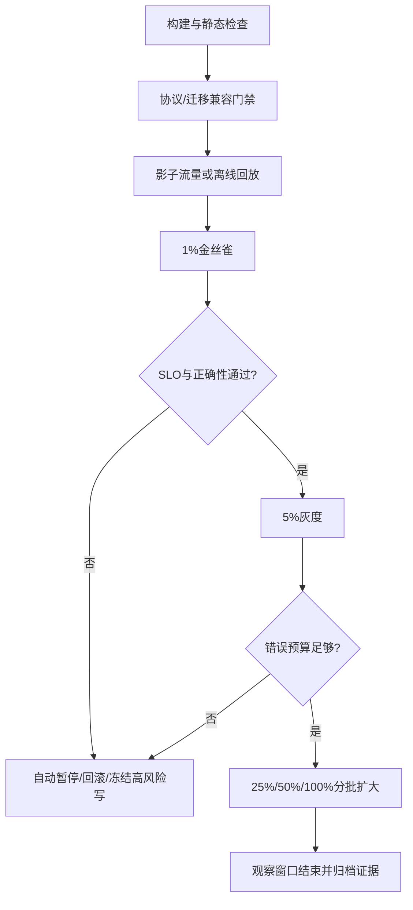

# 08 灰度发布回滚与事故复盘

> 知识成熟度：L2
> 适用范围：平台可靠性-灰度发布回滚与事故复盘
> 本文由《01-鉴权限流幂等灾备与可观测性》"八、灰度、金丝雀、协议兼容与自动回滚"与"九、端到端运行闭环与事故复盘"拆分而来，正文逐字迁移。

## 元数据
- 最后更新：2026-08-13。
- 知识成熟度：L2。
- 适用范围：平台可靠性-灰度发布回滚与事故复盘。
- 知识基线：平台可靠性工程方案（非 UE 内置能力）；事实边界以原《01-鉴权限流幂等灾备与可观测性》对应章节为准。
- 拆分来源：原《01-鉴权限流幂等灾备与可观测性》"八、灰度、金丝雀、协议兼容与自动回滚"与"九、端到端运行闭环与事故复盘"。

## 概述
发布闭环用灰度、金丝雀、协议兼容和自动回滚控制变更的 blast radius，用测试矩阵和事故复盘把每一次故障变成可复验的能力。
本文覆盖灰度策略、客户端与服务端版本矩阵、自动回滚条件、一次订单请求的检查顺序与事故复盘模板。
自动回滚只覆盖代码和可逆配置，不可逆数据库变更应触发暂停、前向修复或人工决策。

### 1.1 灰度策略

灰度（Canary）是把新版本限制在可控比例、区域、设备、账号或流量标签中，观察真实指标后再扩大范围。
金丝雀批次必须有固定的目标集合、最小观察窗口、通过阈值和自动暂停条件。
灰度键应稳定，否则同一玩家在新旧版本之间抖动会制造不可复现问题。
高风险经济操作可以先灰度只读、影子计算或审计模式，再开放写入。
灰度期间要保留旧版本处理新旧协议的能力，直到兼容窗口结束。
不能只看平均错误率；要看核心用户、区服、客户端版本、资源类型和尾延迟。



### 1.2 客户端与服务端版本矩阵

| 客户端 | 服务端 | 处理策略 | 备注 |
| --- | --- | --- | --- |
| N-1 | N | 正常兼容 | 默认发布路径 |
| N | N | 正常兼容 | 新功能可用 |
| N+1 | N | 仅当协议声明兼容 | 未知字段可忽略 |
| 过旧 | N | 强制升级或只读 | 需公告和迁移数据 |
| N | N-canary | 按稳定灰度键路由 | 记录版本标签 |
| N | N-rollback | 旧协议仍能解析 | 不回滚不可逆数据 |

协议应通过 schema diff、旧客户端回放、新客户端回放、未知字段和未知枚举测试。
错误码是协议的一部分，不能把所有服务端异常都改成同一个“网络错误”。
时间戳单位、数值范围、ID 是否可能超过 32 位和空值语义都要进入矩阵。
长连接升级时要说明旧连接如何排空、心跳如何继续、重连如何选择版本。

### 1.3 自动回滚条件

自动回滚适合代码和可逆配置；不可逆数据库变更应触发暂停、前向修复或人工决策。
回滚条件应包含错误率、p99、成功状态迁移率、重复副作用、账本差异、队列积压和资源饱和。
阈值需要最小样本数和连续窗口，避免一个请求就触发回滚。
回滚动作要记录触发指标快照、版本、批次、操作者和命令结果。
回滚后应继续观察旧版本，防止旧版本承载被放大的流量而再次故障。
如果新旧版本共享数据库，回滚前必须检查 schema 和事件版本的兼容性。

### 1.4 一次订单请求的检查顺序

```text
1. 接入层校验 TLS、协议版本、请求大小和超时。
2. 网关提取 trace_id，执行连接/来源/路由限流。
3. 身份服务校验 access token 的签名、aud、scope、过期时间和会话撤销状态。
4. 授权中间件以 account_id、订单资源和动作执行默认拒绝的策略检查。
5. 业务服务校验幂等键、请求摘要、价格快照和当前状态。
6. 数据库事务锁定订单/资产版本，写入业务状态与 Outbox。
7. 提交后发布器投递事件，消费者按 event_id 去重并执行履约。
8. API 返回已完成、处理中或明确失败，不根据网络超时猜测状态。
9. traces/metrics/logs 记录相同 trace_id、订单号哈希、版本和错误分类。
10. 对账任务检查支付、订单、货币和背包不变量。
```

### 1.5 测试矩阵

| 层级 | 场景 | 断言 | 证据 |
| --- | --- | --- | --- |
| 单元 | token 过期、scope 缺失 | 默认拒绝且错误分类稳定 | 测试报告 |
| 单元 | 令牌桶并发抢令牌 | 不超过预算，Retry-After 合法 | 并发测试 |
| 单元 | 幂等键同参/异参 | 同参复用结果，异参冲突 | 去重表记录 |
| 单元 | 状态机非法迁移 | 无副作用并留原因 | 状态覆盖率 |
| 集成 | DB 提交后响应丢失 | 重试查询原结果 | 注入日志 |
| 集成 | Outbox 发布重复 | 消费端只生效一次 | event_id 对账 |
| 集成 | 消息乱序 | 旧版本不覆盖新状态 | 版本断言 |
| 集成 | 缓存失效失败 | 数据库仍权威，可修复缓存 | 一致性检查 |
| 集成 | 密钥双钥轮换 | 旧验签、新签发均可用 | 轮换报告 |
| 集成 | 证书替换 | 所有区域连接成功 | TLS 探针 |
| 系统 | 数据库只读 | 高风险写阻断，读路径有说明 | SLO/告警 |
| 系统 | 服务发现不可用 | 安全缓存短时工作并告警 | 故障注入 |
| 系统 | Redis 全断 | 限流与缓存降级不越权 | 流量记录 |
| 系统 | 区域摘流 | 无双主，业务进入目标模式 | 切换时间线 |
| 系统 | 客户端旧版本灰度 | 协议兼容，错误码稳定 | 回放报告 |
| 压测 | 开服尖峰 | SLO、限流、队列边界满足 | 压测曲线 |
| 压测 | 重试风暴 | 放大受控，熔断生效 | 依赖 QPS |
| 灾备 | 时间点恢复 | RPO/RTO 与账本校验满足 | 恢复报告 |
| 灾备 | 回切 | 复制位点和主权明确 | 回切记录 |
| 发布 | 1% 金丝雀 | 阈值通过才扩大 | 发布审计 |
| 发布 | 自动回滚 | 触发、暂停、回滚均可追踪 | 事件记录 |

### 1.6 事故复盘模板

事故编号：

发生时间与时区：

影响区域、区服、客户端版本和用户比例：

受影响的 SLO/业务不变量：

检测来源与检测延迟：

第一条可验证证据：

时间线：

止损动作及其副作用：

身份/权限是否涉及越权：

限流、重试、熔断是否按预期工作：

幂等、Outbox、消息重复是否造成业务副作用：

数据迁移、备份、RPO/RTO 是否涉及：

灰度批次、版本和配置变更：

恢复判定和业务对账结果：

根因、促成因素和未触发的防线：

短期修复、长期行动项、负责人和截止日期：

复验方式与关闭条件：

复盘应关注系统和流程如何允许错误发生，避免把责任归结为“某人忘了重试”。
所有行动项要有可测量的完成定义，例如新增一条断链测试、缩短凭证有效期或完成一次恢复演练。

## 失败路径

| 失败路径 | 快速判断 | 默认动作 |
| --- | --- | --- |
| 灰度键不稳定 | 同一玩家在版本间抖动 | 灰度键稳定，避免制造不可复现问题 |
| 平均错误率正常但尾延迟恶化 | 分层指标恶化 | 看核心用户、区服、客户端版本、资源类型和尾延迟 |
| 回滚阈值过早触发 | 单请求触发回滚 | 阈值需要最小样本数和连续窗口 |
| 新旧版本共享数据库 | schema/事件版本未知 | 回滚前检查 schema 和事件版本的兼容性 |
| 复盘无行动项 | 无负责人/截止日期 | 行动项有可测量的完成定义 |

## FAQ

### Q9：灰度只看 5xx 是否足够？

不够。业务错误可能返回 2xx，必须观测状态迁移成功率、重复发奖、账本差异、匹配时延、旧客户端兼容和用户分层的 p99。

## 验收清单

- 金丝雀批次有固定目标集合、最小观察窗口、通过阈值和自动暂停条件。
- 灰度键稳定，高风险经济操作先灰度只读、影子计算或审计模式，再开放写入。
- 灰度期间旧版本保留处理新旧协议的能力，直到兼容窗口结束。
- 协议兼容包括语义、错误码、默认值、时间单位、枚举未知值和状态转换。
- 自动回滚条件包含错误率、p99、成功状态迁移率、重复副作用、账本差异、队列积压和资源饱和。
- 回滚阈值需要最小样本数和连续窗口，回滚动作记录触发指标快照、版本、批次、操作者和命令结果。
- 回滚前检查 schema 和事件版本的兼容性，回滚后继续观察旧版本。
- 复盘行动项有可测量的完成定义，例如新增断链测试、缩短凭证有效期或完成一次恢复演练。

## 关联阅读

- [00-平台可靠性总览与迁移说明.md](00-平台可靠性总览与迁移说明.md)：本目录总览与迁移说明，含责任边界、最佳实践清单与 FAQ。
- [04-平台与可靠性/README.md](README.md)：本目录导航与学习路径。
- [02-数据与业务/05-部署运维与监控.md](../02-数据与业务/05-部署运维与监控.md)：发布、监控与回滚专题细节。
- [游戏知识/08-工具链与打包发布/08-全栈质量门禁与灰度回滚.md](../../游戏知识/08-工具链与打包发布/08-全栈质量门禁与灰度回滚.md)：将版本门禁、灰度和自动回滚连接到客户端与全栈发布。
- [RFC 6749 OAuth 2.0](https://www.rfc-editor.org/rfc/rfc6749.html)：OAuth 2.0 授权协议参考。

## 更新日志

- 2026-08-13：从《01-鉴权限流幂等灾备与可观测性》"八、灰度、金丝雀、协议兼容与自动回滚"（8.1-8.3）与"九、端到端运行闭环与事故复盘"（9.1-9.3）拆出合并成篇；正文逐字迁移，标题按本文重编号。
