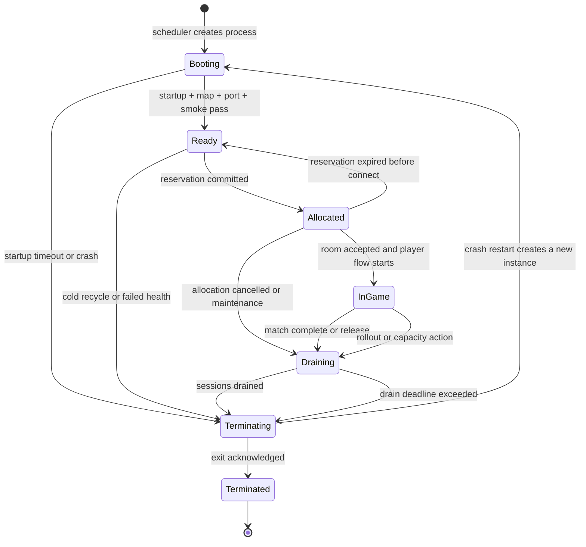
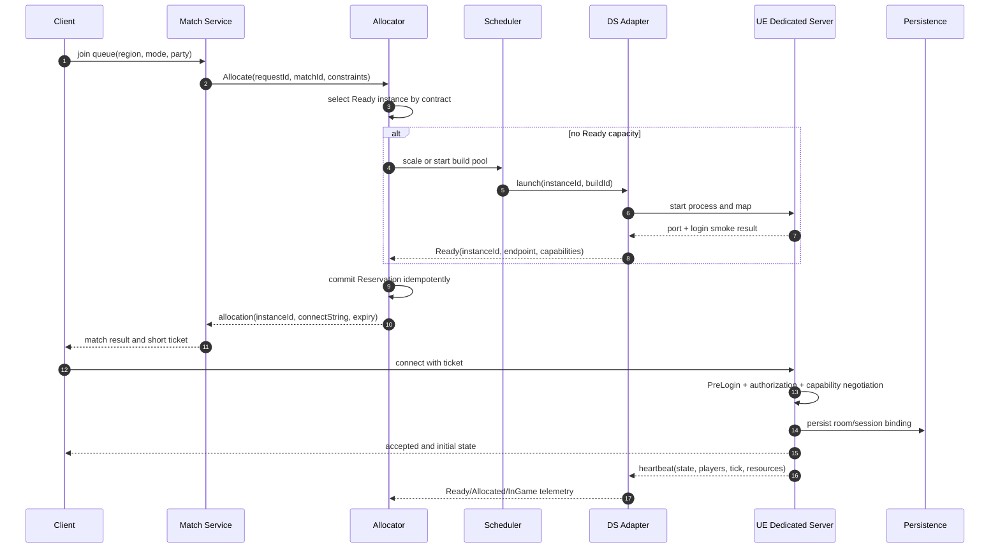
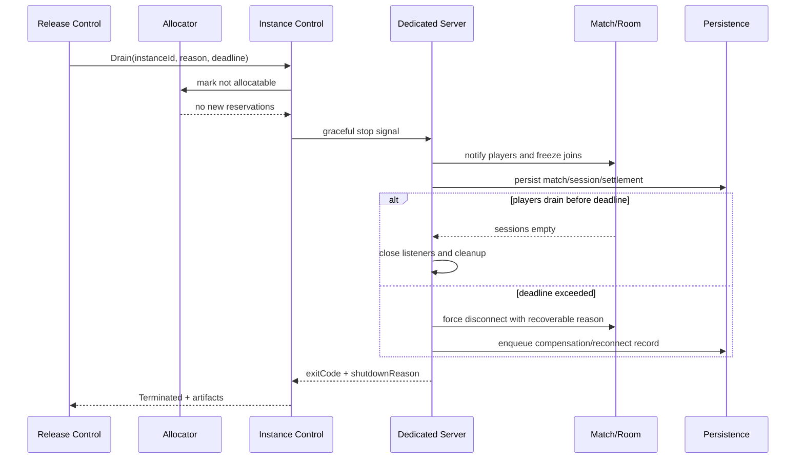

# UE Dedicated Server 实例生命周期与平台化

> 把 UE Dedicated Server 进程放进匹配、分配、调度、部署、观测与发布系统，形成可验证、可回收、可回滚的实例闭环。

## 元数据

- 版本基线：UE5.8.0 / CL55116800 / ++UE5+Release-5.8
- 最后更新：2026-08-06
- 适用范围：联网游戏的 Dedicated Server 进程、实例、房间、匹配、分配器、调度器、部署平台、健康检查、安全、观测和发布。
- 适用范围：适合裸机/VM、Docker、Kubernetes/Agones、Amazon GameLift Servers 等承载方式的契约设计与适配评审。
- 事实边界：UE5.8 事实以已有 UE 源码专题、UE5.8 工具链专题和 Epic 官方文档为边界；本篇不重新声称未核对的引擎源码细节。
- 事实边界：平台 API、云资源、集群控制器、端口分配、调度算法和容量数字均属于项目或供应商适配方案，不是 UE 内置事实。
- 事实边界：所有 `<...>` 名称、地址、端口、Target、地图、镜像、Region 和容量都是占位符。
- 权威来源：Epic Games Unreal Engine 官方文档：https://dev.epicgames.com/documentation/en-us/unreal-engine
- 权威来源：Kubernetes probes 官方文档：https://kubernetes.io/docs/concepts/workloads/pods/probes/
- 权威来源：Agones GameServerAllocation 官方文档：https://agones.dev/site/docs/reference/gameserverallocation/
- 权威来源：Amazon GameLift Servers 官方文档：https://docs.aws.amazon.com/gameliftservers/
- 权威来源：OpenTelemetry 官方文档：https://opentelemetry.io/docs/
- 交付原则：供应商文档只证明供应商平台能力；不能把供应商 API 名称写成 UE5.8 引擎类、函数或内置 health endpoint。

## 概述

Dedicated Server（专用服务器，简称 DS）是承载一场或多场游戏会话的服务端进程。
进程（process）是操作系统层的执行单元，实例（instance）是平台对一个可调度 DS 运行单元的管理对象。
房间（room）是玩法层的会话容器，匹配（matchmaking）是把玩家意图组合成房间的业务过程。
分配器（allocator）负责把已存在或即将启动的实例绑定给房间或匹配结果。
调度器（scheduler）负责容量、区域、资源、版本和实例启动/回收策略。
这几个概念必须分开，否则“进程活着”“实例可分配”“房间已开始”会被错误地当成同一个状态。
UE 进程可以已经启动，但尚未加载 ServerDefaultMap。
UE 进程可以已经监听端口，但尚未通过登录和玩法冒烟。
实例可以被分配，但玩家还没有成功连接。
房间可以有玩家，但实例已经进入 Draining，不能再接收新分配。
平台化的核心是把这些阶段转换成中立、可审计、可重试的契约。

本文使用以下状态序列作为平台状态基线：

`Booting → Ready → Allocated → InGame → Draining → Terminating → Terminated`

状态机不取代 UE 内部生命周期，而是包裹 UE 进程并为外部系统提供稳定观察面。
外部系统不应通过猜测日志文本来判断实例状态。
状态变化应由 DS 适配器、控制器或平台 Agent 产生带版本的事件。

## 1. 进程、实例、房间、匹配与调度器

### 1.1 概念表

| 概念 | 英文 | 所在层 | 负责什么 | 不负责什么 |
| --- | --- | --- | --- | --- |
| 进程 | Process | 操作系统/容器 | 启动、退出、信号、退出码、stdout/stderr | 不决定玩家是否匹配 |
| 实例 | Instance | 平台控制面 | 状态、版本、端口、能力、心跳、回收 | 不代替房间规则 |
| 房间 | Room | 游戏业务 | 玩家集合、地图、规则、结算和重连窗口 | 不决定底层节点如何扩容 |
| 匹配 | Matchmaking | 业务/平台服务 | 组合玩家、模式、区域和规则 | 不直接拥有 OS 进程 |
| 分配器 | Allocator | 平台控制面 | 选择 Ready/可扩容实例并返回连接信息 | 不裁决战斗规则 |
| 调度器 | Scheduler | 资源控制面 | 节点、区域、池、版本和容量调度 | 不替代登录授权 |
| DS 适配器 | DS Adapter | 集成边界 | 将 UE 日志/端口/信号映射为平台契约 | 不编造 UE 引擎 API |
| 发布控制面 | Release Control Plane | 运维/发布 | 灰度、摘流量、回滚、兼容矩阵 | 不直接修改 UE 安装目录 |

### 1.2 职责边界

进程只回答“我是否运行、如何结束、输出了什么”。
实例回答“这个进程是否可以被平台使用、属于哪个版本和区域”。
房间回答“哪些玩家在一起、当前玩法是否开始、结算是否完成”。
匹配回答“哪些玩家应该组成一个房间”。
分配器回答“哪个实例承载这个房间，以及连接凭证是什么”。
调度器回答“哪里启动实例、启动多少、什么时候冷回收”。
发布控制面回答“哪个版本获得流量、何时冻结、如何回滚”。
任何层都不应偷偷越权修改另一层的权威数据。

### 1.3 责任矩阵

| 事件 | 进程 | DS 适配器 | 实例控制面 | 房间服务 | 匹配服务 | 调度器 |
| --- | --- | --- | --- | --- | --- | --- |
| 启动 | 执行入口 | 采集启动日志 | 创建 Booting | 尚未创建 | 尚未匹配 | 提供资源 |
| 端口监听 | 绑定端口 | 探测端口 | 记录 endpoint | 尚未开始 | 尚未匹配 | 维护节点 |
| 地图就绪 | 加载世界 | 识别日志/探针 | 标记 Ready | 可申请实例 | 等待分配 | 补充容量 |
| 房间分配 | 接受连接 | 上报 Allocated | 锁定实例 | 绑定 roomId | 返回匹配结果 | 防止重复分配 |
| 游戏开始 | 运行规则 | 上报 InGame | 维护状态 | 推进玩法 | 不再改组 | 观察容量 |
| 摘流量 | 继续运行 | 拒绝新分配 | 标记 Draining | 通知并迁移 | 不再返回 | 触发回收 |
| 结束 | 退出 | 上报退出码 | 标记 Terminated | 持久化结算 | 释放匹配 | 回收资源 |

## 2. 实例状态机

### 2.1 状态定义

| 状态 | 进入条件 | 允许动作 | 禁止动作 | 退出条件 |
| --- | --- | --- | --- | --- |
| Booting | 进程已创建或平台记录启动 | 采集日志、等待启动 | 分配玩家 | startup 超时或 Ready |
| Ready | 地图、端口、登录冒烟和依赖检查通过 | 接受 Reservation | 直接进入不完整房间 | 分配成功或失败 |
| Allocated | Reservation 被幂等确认 | 建立连接、绑定房间 | 再分配给另一房间 | 游戏开始或释放 |
| InGame | 房间和玩家进入玩法 | 推进 Tick、同步、结算 | 接收新房间分配 | 正常结束或异常 |
| Draining | 发布/维护/容量策略触发 | 通知玩家、保存、重连 | 新分配、新匹配 | 会话归零或超时 |
| Terminating | 开始退出流程 | 清理、上报、等待进程结束 | 接受新连接 | 进程退出 |
| Terminated | 进程已结束并记录结果 | 保留审计、清理资源 | 重用旧 instanceId | 新建实例 |

状态序列必须严格保留：

`Booting → Ready → Allocated → InGame → Draining → Terminating → Terminated`

某些异常路径可以从 Booting 直接进入 Terminating，但不能把异常捷径伪装成正常 InGame。
某些空闲实例可以从 Ready 回到冷回收流程，但应定义是重新 Booting 还是直接 Terminating。
状态事件需要带 `instanceId`、旧状态、新状态、原因、时间、版本和请求 ID。
重复状态事件不应导致重复分配或重复结算。

### 2.2 Mermaid 状态机



图中的 restart 不是把旧实例状态倒退，而是创建新的实例记录或新的生命周期代数。
旧 `instanceId` 的终态必须保留，避免旧连接、旧 ticket 和新实例混淆。

### 2.3 状态不变量

Ready 必须拥有唯一有效的 `instanceId` 和 `buildId`。
Ready 必须有可以验证的端口和 `publicEndpoint` 或内网连接地址。
Ready 不得自动意味着任意客户端都能登录。
Allocated 必须绑定一个有效的 Reservation 或等价幂等记录。
InGame 必须有 `roomId` 或 `matchId` 的业务关联。
Draining 必须阻断新分配，并向匹配服务传播不可分配事实。
Terminating 必须停止接受新连接或完成等价的入口阻断。
Terminated 必须记录退出原因、退出码、崩溃标记和最终观测时间。

## 3. 中立分配契约

中立契约（neutral allocation contract）让匹配服务、分配器和 DS 适配器不依赖某个供应商 API。
它应能映射到裸机、VM、Docker、Kubernetes/Agones 或 Amazon GameLift Servers。
映射层可以增加供应商字段，但不能删除核心一致性字段。

### 3.1 必备字段

| 字段 | 类型示意 | 语义 | 产生者 | 校验 |
| --- | --- | --- | --- | --- |
| `instanceId` | string | 实例生命周期唯一 ID | 调度器/实例控制面 | 不复用旧代 |
| `buildId` | string | 二进制、内容和符号版本 | 发布系统 | 必须在兼容矩阵中 |
| `engineBaseline` | string | 引擎基线 | 构建系统 | 本文为 UE5.8 基线 |
| `region` | string | 区域/可用区标签 | 调度器 | 与玩家策略匹配 |
| `mode` | string | 玩法模式 | 匹配服务 | 在服务端允许列表中 |
| `map` | string | 服务器地图 | 房间/构建配置 | 必须已 Cook |
| `port` | integer | 监听端口 | DS/适配器 | 范围和占用校验 |
| `publicEndpoint` | string | 客户端可达地址 | 网络层 | 不泄露内部地址 |
| `protocolVersion` | string | 网络/业务协议版本 | 发布系统 | 兼容矩阵校验 |
| `sessionTicket` | string | 短期会话凭证 | 鉴权服务 | TTL、受众、一次性 |
| `maxPlayers` | integer | 允许的玩家上限 | 房间/实例 | 不超过资源预算 |
| `expiry` | timestamp | Reservation/连接凭证过期时间 | 分配器 | 过期即拒绝 |

### 3.2 JSON 契约示意

```json
{
  "instanceId": "<instance-id>",
  "buildId": "<build-id>",
  "engineBaseline": "UE5.8.0/CL55116800/++UE5+Release-5.8",
  "region": "<region>",
  "mode": "<mode>",
  "map": "<server-map>",
  "port": 7777,
  "publicEndpoint": "<endpoint>",
  "protocolVersion": "<protocol-version>",
  "sessionTicket": "<short-lived-ticket>",
  "maxPlayers": 16,
  "expiry": "<RFC3339-time>"
}
```

这是中立契约示意，不是 UE 结构体、Agones CRD 或 GameLift SDK 请求体。
真实协议应定义字段大小、字符集、时间精度和未知字段策略。
客户端不能自行生成 `sessionTicket`、`buildId` 或 `publicEndpoint`。

### 3.3 Reservation

Reservation（预留）是分配器为一次房间连接流程创建的短期承诺。
Reservation 应包含 `reservationId`、请求 ID、候选实例、版本、区域、模式、玩家数和过期时间。
分配器返回 Reservation 后，房间服务可以把它写入自己的事务或事件。
Reservation 过期后，实例必须能重新回到 Ready 或被平台判断为异常。
Reservation 被重复提交时，应返回同一结果或明确的已完成状态。
Reservation 被另一个房间抢占时，应返回冲突而不是静默覆盖。
Reservation 不等于玩家已经登录，也不等于连接已建立。
只有成功连接、PreLogin 和授权通过后，房间才应进入正式 InGame。

### 3.4 ConnectString

ConnectString（连接串）是客户端连接 DS 所需的最小地址和参数表达。
它可以由 `publicEndpoint`、端口、协议版本、房间票据和校验信息组合而成。
连接串不应包含长期密钥、数据库地址、内部节点名称或调试凭据。
平台适配器负责把中立字段转换为客户端实际连接格式。
不同平台的连接串可以不同，但都应能追溯到同一个 `instanceId` 和 `sessionId`。

```text
ConnectString = <publicEndpoint>:<port>?ticket=<short-ticket>&protocol=<version>
```

上式是方案格式，不是 UE 内置 URL 语法的完整声明。
真正的 UE 连接参数和项目地图 URL 应以项目网络协议实现为准。

## 4. 匹配到实例的流程

匹配服务先根据玩家区域、模式、队伍和版本形成 Match。
匹配完成后，它向分配器提交带幂等键的 AllocationRequest。
分配器优先选择 Ready 且满足能力、地图、协议和容量的实例。
如果没有可用 Ready 实例，分配器可以请求调度器扩容，但不能伪造一个已就绪的实例。
调度器启动进程后，DS 适配器等待真正的 Ready 条件。
Ready 条件不满足时，分配器只能返回等待、容量不足或明确失败。
成功预留后，分配器返回实例契约和短期 Reservation。
房间服务把 Reservation 绑定到 Match，并等待玩家连接。
客户端连接后，DS 通过 PreLogin/授权验证 ticket 和协议。
所有玩家进入或超时后，房间服务决定 InGame、取消、补偿或重匹配。

### 4.1 Mermaid 时序图



图中 `D` 是项目适配层，不代表 UE 内置了 DS Adapter。
图中 `A`、`S`、`M` 也是平台服务职责，不是 UE 引擎类。

### 4.2 分配失败分类

| 失败分类 | 示例 | 是否重试 | 处理 |
| --- | --- | --- | --- |
| 参数失败 | mode/map/region 缺失 | 否 | 修请求并返回客户端可理解错误 |
| 版本失败 | build/protocol 不兼容 | 仅换兼容池 | 不盲目重试同一实例 |
| 容量失败 | 无 Ready 或 maxPlayers 不足 | 是，带退避 | 扩容或等待 |
| Reservation 冲突 | 幂等键绑定不同 Match | 否 | 记录冲突并人工/业务处置 |
| 网络失败 | endpoint 不可达 | 有限重试 | 换实例或区域 |
| DS 健康失败 | 端口/地图/登录冒烟失败 | 换实例 | 标记实例异常并回收 |
| 依赖失败 | 持久化/鉴权不可用 | 按依赖策略 | 熔断或降级 |
| 过期 | Reservation/session ticket 到期 | 否 | 重新匹配或刷新凭证 |

## 5. 幂等、重试与版本共存

分配请求必须带稳定 `requestId` 或 `idempotencyKey`。
重试时不能生成新的业务意图 ID，否则一次匹配可能分配出多个房间。
分配器应保存请求状态：Pending、Committed、Rejected、Expired 或 Unknown。
Unknown 表示调用方超时但结果未确定，不等于失败。
调用方遇到 Unknown 应查询幂等结果，而不是直接重新创建 Reservation。
实例分配和房间绑定最好采用一条可恢复的事务/事件链。
跨服务没有真正事务时，要设计补偿事件和对账任务。

### 5.1 退避示意

```text
delay(n) = min(maxDelay, baseDelay * 2^n + jitter)
```

公式是通用重试方案示意，不是 UE API。
只对网络暂时失败、容量等待和可重试依赖失败使用退避。
参数错误、权限拒绝、版本不兼容和 Reservation 冲突不应自动重试。
重试必须受总时限、最大次数和请求上下文约束。

### 5.2 版本共存

发布期间可能同时存在旧 build、新 build、旧 protocol 和新 protocol。
客户端兼容矩阵要以 `clientVersion`、`buildId`、`protocolVersion`、`region` 和 `mode` 为维度。
分配器不能只按最新版本选实例，还要按客户端允许范围选兼容实例。
服务端配置版本要独立于二进制版本，并定义向前兼容字段。
旧客户端不应被灰度流量意外分到只支持新协议的实例。
新服务端读取旧数据时必须接受新增字段缺省值。
不可逆数据迁移前，先保留旧服务端读取路径或补偿方案。

## 6. UE 就绪与健康检查

UE 进程 Ready 不等于端口监听。
端口监听也不等于 ServerDefaultMap 已完成加载。
地图加载完成也不等于 GameMode/PreLogin 登录冒烟通过。
登录冒烟通过也不等于持久化、匹配和观测依赖正常。
所以 DS 适配器必须分层检查，而不是把 PID 存在作为 Ready。

### 6.1 就绪门禁

建议的游戏就绪门禁顺序是：

1. 进程启动并输出构建/版本标识。
2. 读取并确认启动参数、区域、模式和实例 ID。
3. 加载预期 ServerDefaultMap。
4. 绑定预期端口并确认 endpoint。
5. 完成最小协议握手或本地登录冒烟。
6. GameMode/PreLogin 通过最小合法请求。
7. 持久化、鉴权和观测依赖达到策略要求。
8. 适配器发布 Ready 事件。

第 5、6 步是“游戏就绪”与“网络端口可用”的关键区别。
如果项目没有可自动化的登录冒烟，应明确把缺失项标为风险，而不是自动标 Ready。

### 6.2 健康层级

| 层级 | 英文 | 问题 | 失败动作 |
| --- | --- | --- | --- |
| 启动 | Startup | 初始化是否在时限内完成 | 终止并重启/标记失败 |
| 存活 | Liveness | 进程是否还能推进心跳和 Tick | 重启卡死实例 |
| 就绪 | Readiness | 是否可以接新分配/连接 | 摘流量但不一定重启 |
| 进程 | Process | PID、退出码、崩溃信号是什么 | 记录并重启 |
| 网络 | Network | 端口、endpoint、握手是否可达 | 换端口/节点/实例 |
| 玩法 | Gameplay | 地图、GameMode、PreLogin、复制冒烟是否通过 | 不分配，回收 |
| 依赖 | Dependency | 鉴权、持久化、配置、观测是否满足 | 熔断/降级/阻断 |

### 6.3 Kubernetes 探针边界

Kubernetes 官方文档定义 startup、liveness 和 readiness probe 的平台语义。
这些 probe 是 Kubernetes 对容器的健康判断机制，不是 UE 内置 health endpoint。
UE 项目需要通过适配器提供 HTTP、TCP 或 exec 检查，具体方式由项目实现。
Startup 适合覆盖地图加载和首次初始化窗口。
Liveness 适合识别进程卡死或心跳停止。
Readiness 适合表达 Draining、依赖不可用或尚未完成登录冒烟。
Readiness 失败通常应停止新流量，不应默认杀掉仍可排空的实例。

官方参考：[Kubernetes Liveness, Readiness, and Startup Probes](https://kubernetes.io/docs/concepts/workloads/pods/probes/)。

## 7. 心跳、摘流量与关服

心跳（heartbeat）是实例向平台报告自身状态、版本、连接、Tick 和资源的周期性信号。
心跳不是只发送“我还活着”，还应包含状态代数、最后状态变更、玩家数和 drain 标记。
心跳丢失时要区分网络抖动、进程卡死、平台控制器延迟和节点故障。
连续丢失达到阈值后，实例进入 Unknown 或 Terminating，而不是直接复用其端口。
实例被标记 Draining 后，匹配服务和分配器必须停止返回它。
已分配的房间可以继续运行，直到正常结束或达到 drain deadline。

### 7.1 摘流量顺序

1. 发布控制面发起 Drain 请求。
2. 实例控制面把 readiness 改为 false。
3. 分配器停止新 Reservation。
4. 匹配服务停止把新 Match 指向实例。
5. DS 通知玩家维护、迁移或重连信息。
6. 房间服务冻结新加入并保存关键状态。
7. 等待玩家自然离开或执行重连窗口。
8. 到达 deadline 后进入 Terminating。
9. DS 上报退出码、原因、存量玩家和未完成持久化。
10. 控制面确认 Terminated 并回收资源。

### 7.2 Mermaid 关服时序图



图中 graceful stop signal 在 Linux 可以由 SIGTERM 等项目入口承接，在 Windows 可以由服务控制器或项目约定的停止机制承接。
UE 不自动提供统一的跨平台 drain API；适配器需要把平台停止事件转换为项目可执行的关服流程。

### 7.3 信号、退出码与重启

Linux 适配通常把 SIGTERM 视为优雅关闭请求，把 SIGKILL 视为无法收尾的强制终止。
Windows 适配通常由服务控制器、进程管理器或项目停止命令触发优雅关闭。
上述是平台方案，不是 UE5.8 内置 API 事实。
退出码必须区分正常关服、配置错误、端口冲突、依赖失败、崩溃和被强制终止。
崩溃重启不能复用旧 `instanceId` 和旧 Reservation。
重启流程要生成新生命周期代数，关联同一个 buildId 和故障前 roomId。
CrashLoop 保护要限制短时间重启次数，并把节点或版本标记为异常。
成功重启不等于原房间自动恢复，是否重连由房间和数据策略决定。

## 8. 重连、持久化与回收

重连窗口是从断线到允许同一玩家恢复房间上下文的有限时间。
重连票据应短期有效，并绑定 `sessionId`、`roomId`、`instanceId` 代数和玩家身份。
实例 Draining 时可以允许旧玩家重连，但不得接受新房间分配。
持久化至少区分已确认结算、处理中事务、待补偿事件和不可恢复错误。
关服前优先提交关键业务状态，再写非关键诊断信息。
无法在 deadline 内完成的写入进入补偿队列或人工审核，不应静默丢失。

热回收（warm recycle）保留已准备好的进程/容器，以降低分配延迟。
冷回收（cold recycle）释放进程和资源，以降低成本或清理污染。
热池必须有最大空闲时长、内存水位、版本一致性和安全清理策略。
冷启动必须有 startup timeout 和失败重试上限。
热回收实例在 Ready 前仍需重新执行健康门禁，不能因上次 Ready 就永久可信。

## 9. 四类部署适配

部署平台提供资源和生命周期能力，但不自动理解 UE 房间语义。
每类部署都必须实现同一中立实例契约。

### 9.1 裸机/VM

裸机或 VM 方案把 DS 作为操作系统进程或服务运行。
调度器负责节点容量、端口池、进程启动、日志收集、重启和版本目录。
端口可用性由节点网络和进程共同决定，不能只看节点是否健康。
文件系统可以保存 Core Dump、符号映射和 Manifest，但必须限制磁盘增长。
节点故障时，实例需要快速标记 Unknown，避免分配器继续返回旧 endpoint。
适配层应记录 OS、内核、CPU、内存、网卡、节点 ID 和安装制品版本。
Windows 与 Linux 的停止、权限、日志和 Core Dump 行为可能不同。
不要把 VM 名称当作客户端 endpoint；endpoint 是连接契约字段。

### 9.2 Docker

Docker 方案把 DS 和其运行依赖放入镜像/容器边界。
镜像应包含可运行二进制、Cooked Data、必要配置模板和启动入口。
镜像不应包含长期 Secret、平台管理凭据、生产数据库密码或个人访问令牌。
容器应明确 stdout/stderr 输出，避免只写到容器内不可持久化文件。
非 root（non-root）运行是安全目标，实际 UID/GID 和文件权限需要项目验证。
端口映射要与 `publicEndpoint` 生成逻辑一致。
CPU、内存、临时磁盘和打开文件数需要设置上限和告警。
容器文件系统尽量只读，必要写入使用明确的临时目录或卷。
Core Dump、符号和 Manifest 不应默认留在容器临时层；应由采集器导出。
镜像 Digest、buildId、配置版本和协议版本要进入实例契约。

```dockerfile
# 适配示意，不是可直接生产的 UE 镜像，也不代表真实项目 Target。
FROM <approved-runtime-base>
USER <non-root-uid>
WORKDIR /app
COPY <staged-server> /app/server
ENV SERVER_BUILD_ID=<build-id-placeholder>
ENTRYPOINT ["/app/server/<ProjectServer>Server"]
```

这是 Docker 适配伪配置，不是 UE API。
实际镜像应由项目安全基线、平台镜像仓库和运行时权限策略审核。

### 9.3 Kubernetes/Agones

Kubernetes 负责 Pod、节点和探针等容器编排边界。
Agones 是面向游戏服务器的 Kubernetes 生态项目，提供 GameServer、Fleet 和分配相关对象。
Agones 的 `GameServerAllocation` 官方文档描述了从候选 GameServer 集合中原子分配的概念。
这些对象和 API 是 Agones 平台事实，不是 UE5.8 引擎事实。
项目需要把 UE DS 的 Ready/Allocated/Draining 映射到平台 GameServer 状态。
映射要处理平台控制器延迟、对象最终一致性、namespace、节点失败和版本标签。
Agones/ Kubernetes 的 labels、annotations、selectors 和 player capacity 不能直接当成房间业务数据库。
适配器应把中立契约字段映射到 labels/annotations 或外部配置，并限制标签基数。

官方参考：[Agones GameServerAllocation Specification](https://agones.dev/site/docs/reference/gameserverallocation/)。

### 9.4 Amazon GameLift Servers

Amazon GameLift Servers 是 AWS 的托管游戏服务器服务，具体部署、会话和 SDK 能力以 AWS 官方文档为准。
它不是 UE5.8 的内置模块，也不是本文中立契约的唯一实现。
适配层可以把 `instanceId`、buildId、region、session ticket 和 connect string 映射到 GameLift 的会话/服务器概念。
AWS 的区域、舰队、队列、会话和服务 SDK 对应关系需要按项目账号、版本和产品能力核对。
不要把 AWS SDK 函数名写进 UE GameMode 或假设客户端一定直接调用 AWS API。
推荐由平台服务调用供应商 API，DS 只接收短期、最小化的运行上下文。

官方参考：[Amazon GameLift Servers Documentation](https://docs.aws.amazon.com/gameliftservers/)。
流程对照：[How hosting with Amazon GameLift Servers works](https://docs.aws.amazon.com/gameliftservers/latest/developerguide/gamelift-howitworks.html)。

## 10. Kubernetes/Agones 适配示例

下面 YAML 是平台适配示例，不是 UE 内置配置，也不是完整 Agones 生产清单。

```yaml
# 适配伪配置：健康端点由项目 DS adapter 提供，UE 本身不自动提供 /health/readiness。
apiVersion: apps/v1
kind: Deployment
metadata:
  name: <server-adapter>
spec:
  template:
    spec:
      securityContext:
        runAsNonRoot: true
      containers:
      - name: <server>
        image: <registry>/<server>@<digest>
        ports:
        - name: game
          containerPort: 7777
          protocol: UDP
        resources:
          requests:
            cpu: "<cpu-request>"
            memory: "<memory-request>"
          limits:
            cpu: "<cpu-limit>"
            memory: "<memory-limit>"
        startupProbe:
          httpGet:
            path: /health/startup
            port: <adapter-port>
        readinessProbe:
          httpGet:
            path: /health/readiness
            port: <adapter-port>
        livenessProbe:
          httpGet:
            path: /health/liveness
            port: <adapter-port>
```

`/health/*` 是项目适配器的示意接口，不能声称 UE5.8 自带这些路径。
Kubernetes probe 的执行与重启语义由 Kubernetes 官方文档定义。
Agones 的 GameServer/Allocation 资源还需要按照其版本和安装方式配置，不能只复制这段 Deployment。
UDP 对外暴露、Service、节点端口和 endpoint 生成方式需要项目网络团队验证。

## 11. 平台适配伪代码

### 11.1 中立分配器

```go
// 适配伪代码：不是 UE API、Agones SDK 或 GameLift SDK。
func Allocate(ctx context.Context, req AllocationRequest) (Allocation, error) {
    key := req.RequestID
    if old, ok := idempotency.Lookup(key); ok {
        return old.Result, old.Error
    }
    candidate := pool.SelectReady(req.Region, req.Mode, req.BuildID, req.ProtocolVersion)
    if candidate == nil {
        return Allocation{}, ErrCapacityUnavailable
    }
    reservation := Reservation{
        ID: NewID(),
        InstanceID: candidate.InstanceID,
        MatchID: req.MatchID,
        Expiry: clock.Now().Add(reservationTTL),
    }
    if err := store.Commit(key, reservation); err != nil {
        return Allocation{}, err
    }
    return BuildNeutralAllocation(candidate, reservation), nil
}
```

这个例子表达幂等和候选选择的边界，不表示项目必须使用 Go。
`pool.SelectReady` 必须同时检查版本、模式、地图、能力和容量。

### 11.2 DS Ready 适配器

```text
# 适配伪代码：流程概念，不是 UE 内置命令。
start process with instanceId/buildId/region/mode/map/port
wait process-startup-log within startupTimeout
wait ServerDefaultMap-ready signal
check port binding and endpoint reachability
run minimal login/PreLogin smoke with short ticket
check persistence/auth/telemetry dependencies
publish Ready(instanceId, buildId, port, protocolVersion, expiry)
```

适配器不能只等待进程输出“started”。
Ready 事件应包含检查版本和最后一次健康时间。

### 11.3 Agones 适配伪代码

```text
# 适配伪代码：展示映射，不是 Agones API 的完整调用。
GameServer.state == Ready
    -> neutralState.Ready
GameServerAllocation result
    -> Reservation(instanceId, expiry, connectString)
SDK.Shutdown or platform drain
    -> neutralState.Draining
```

实际 Agones SDK、CRD 字段和状态转换必须以对应官方版本文档核对。

### 11.4 GameLift 适配伪代码

```text
# 适配伪代码：供应商边界示意，不是 AWS SDK 调用代码。
matchService -> providerAdapter.requestSession(region, mode, buildId)
providerAdapter -> GameLift provider API
providerAdapter <- provider session + connection information
providerAdapter -> neutral Allocation(instanceId, endpoint, ticket, expiry)
client -> game endpoint with project session ticket
```

DS 进程不应持有能够创建任意云资源的长期凭据。

## 12. 安全设计

短期 ticket（short-lived ticket）应绑定玩家、房间、实例代数、协议、过期时间和受众。
ticket 不能被客户端自行签发，也不能包含长期密钥。
UE 侧登录冒烟和 `PreLogin` 是玩法接入门，但平台授权服务仍需在请求路径中验证身份和权限。
授权应区分“能连接实例”“能进入房间”“能执行玩法操作”和“能查看运营数据”。
端口暴露遵循最小范围，尽量只暴露客户端需要的游戏端口。
管理端口、指标端口、调试端口和内部控制端口不能默认暴露公网。
DDoS 防护、连接限流、ticket 验证和异常包速率限制要在网络边界和 DS 两侧协同。
单实例连接数、单 IP 建连速率、单账号 ticket 失败率和全局分配速率都应有限制。
敏感配置不进镜像、不进 Git、不进普通日志、不通过客户端返回。
Secret 注入采用平台 Secret 管理，启动时只读取必要字段，并限制进程权限。
stdout/stderr 可能包含地址、玩家 ID 或错误上下文，日志采集前要脱敏。
Core Dump、符号和崩溃上下文应限制下载权限和保留期限。
非 root 运行要配合文件权限、端口范围、Core Dump 策略和临时目录权限验证。

### 12.1 安全检查表

| 风险 | 控制 | 证据 |
| --- | --- | --- |
| ticket 重放 | TTL、一次性/绑定 instance 代数 | 验证日志和拒绝计数 |
| 越权连接 | PreLogin、房间绑定、授权校验 | requestId/sessionId |
| 端口扫描 | 最小暴露、网络 ACL、速率限制 | 网络策略和告警 |
| DDoS | 边缘防护、连接限流、黑名单 | 流量和封禁指标 |
| Secret 泄露 | Secret 管理、脱敏、非镜像化 | 镜像扫描、日志抽查 |
| 调试暴露 | 禁用生产调试入口、最小权限 | 配置审计 |
| Core Dump 泄露 | 受控存储、生命周期和访问审计 | 下载记录 |

## 13. 观测与指标

观测（observability）要让一次匹配请求关联到一个实例、一个房间和一组玩家。
建议所有日志、Trace、指标和事件共享以下关联字段：

`buildId / instanceId / sessionId / matchId / region / requestId`

`buildId` 关联二进制、配置、Manifest 和符号。
`instanceId` 关联状态机、端口、节点、容器和退出码。
`sessionId` 关联玩家连接、ticket 和重连。
`matchId` 关联匹配、房间、分配和结算。
`region` 关联流量、容量、延迟和发布灰度。
`requestId` 关联幂等分配、重试、错误和补偿。

### 13.1 指标表

| 类别 | 指标 | 维度 | 用途 |
| --- | --- | --- | --- |
| 业务 | CCU | region/mode/buildId | 容量与业务趋势 |
| 实例 | Ready 实例数 | region/buildId | 可分配容量 |
| 实例 | Allocated/InGame 数 | mode/buildId | 房间承载 |
| 连接 | 活跃连接数 | instanceId/region | 资源和异常连接 |
| Tick | Tick 时间/P95/P99 | instanceId/buildId | 卡顿和超时 |
| 网络 | 收发包、丢包、RTT | region/instanceId | 连接质量 |
| 状态 | Ready/Drain 时长 | buildId/region | 发布与维护 |
| 分配 | 分配耗时/P95 | mode/region | 匹配体验 |
| 分配 | 失败率/失败原因 | requestId/region | 容量和依赖问题 |
| 进程 | 崩溃率/重启率 | buildId/node | 稳定性 |
| 资源 | CPU/内存/磁盘水位 | node/instanceId | 扩容与回收 |
| 发布 | 灰度版本占比 | buildId/region | 变更控制 |
| SLO | Ready 到分配耗时 | region/mode | 用户体验目标 |

### 13.2 日志事件

| 事件 | 必要字段 | 触发点 |
| --- | --- | --- |
| instance_boot | instanceId/buildId/node/requestId | 进程启动 |
| map_ready | instanceId/map/elapsed | 地图就绪 |
| port_bound | instanceId/port/endpoint | 端口绑定 |
| login_smoke | instanceId/protocol/result | 登录冒烟 |
| instance_ready | instanceId/capabilities/expiry | Ready 发布 |
| reservation_committed | requestId/reservationId/matchId | 分配幂等提交 |
| session_connect | sessionId/instanceId/matchId | 玩家连接 |
| instance_drain | reason/deadline/players | 摘流量 |
| persistence_flush | matchId/result/elapsed | 结算持久化 |
| process_exit | exitCode/reason/crash | 进程退出 |

不要把完整 ticket、密码、Secret 或原始敏感 payload 写入这些字段。
高基数标签要限制，玩家 ID 可用不可逆哈希或受控关联表。

### 13.3 OpenTelemetry 边界

OpenTelemetry 是供应商中立的观测框架/工具链，官方文档覆盖 traces、metrics、logs 等信号。
在本方案中可以用它承载跨匹配、分配器、实例适配器和 DS 的 Trace/Metric/Log 关联。
它不是 UE5.8 引擎内置观测后端，也不是必须选用的唯一实现。
适配层可以把 `requestId`、`matchId` 和 `instanceId` 作为 span attributes，但要控制高基数。
后端、Collector、采样率和保留时间属于项目观测平台决策。

官方参考：[OpenTelemetry Documentation](https://opentelemetry.io/docs/)。

## 14. SLO 与健康门禁

SLO（Service Level Objective）应绑定玩家路径，而不是只绑定 Pod 或 VM 存活。
可定义实例启动到 Ready 的 P95、分配请求到 Reservation 的 P95、连接到登录成功的 P95。
还要定义 Ready 实例可用率、Drain 完成率、崩溃重启率和数据补偿率。
一个实例 liveness 正常但 readiness 失败，应从流量池摘除而不是立刻重启。
一个实例 startup 失败，应阻止进入 Ready 并记录启动失败原因。
依赖健康失败时，可以把 readiness 置 false，同时保留可排空房间。

### 14.1 SLO 示例

```text
StartupToReady_P95       <= <startup-slo>
AllocationLatency_P95    <= <allocation-slo>
LoginSmokeSuccess        >= <login-slo>
ReadyFalsePositive       <= <false-positive-slo>
DrainCompletionRate      >= <drain-slo>
CrashRestartRate         <= <crash-slo>
PersistenceCompensation  <= <compensation-slo>
```

这些值是项目占位符，不是 UE 或供应商默认 SLO。

## 15. 发布、灰度与回滚

发布对象至少包括客户端、服务端二进制、Cooked 内容、运行配置和协议版本。
兼容矩阵至少回答客户端版本能否连接哪个 `buildId`、哪个 `protocolVersion` 和哪个 `map`。
灰度先选择小区域、测试账号、少量实例或明确流量比例。
灰度期间要观测 Ready、分配、连接、Tick、崩溃、重启、资源和持久化指标。
指标异常时先停止扩大流量，再把新版本实例标记 Draining。
摘流量顺序必须先阻止新分配，再等待现有房间排空或迁移。
回滚要同时回滚二进制、Cooked 内容、配置、协议路由和兼容策略。
不可逆数据变更不能依赖二进制回滚解决，必须提前提供向前兼容读路径或补偿。
旧版本实例排空前不能删除它需要的配置、Manifest、符号或数据读取能力。
回滚结束后要验证实际流量已经回到旧版本，并保留新版本异常样本。

### 15.1 兼容矩阵示意

| 客户端 | 服务端 buildId | protocolVersion | 配置版本 | 允许状态 |
| --- | --- | --- | --- | --- |
| `<client-old>` | `<server-old>` | `<protocol-old>` | `<config-compatible>` | 允许 |
| `<client-old>` | `<server-new>` | `<protocol-new>` | `<config-compatible>` | 需兼容测试 |
| `<client-new>` | `<server-old>` | `<protocol-old>` | `<config-compatible>` | 需回滚验证 |
| `<client-new>` | `<server-new>` | `<protocol-new>` | `<config-new>` | 允许 |
| 任意 | 不兼容 build | 不兼容协议 | 任意 | 拒绝并提示升级 |

## 16. 配置与 Secret

配置分为镜像内默认值、部署时配置、实例运行参数和房间临时参数。
镜像内只放不敏感的默认值和版本元数据。
部署时配置提供区域、端口范围、资源预算、日志级别和依赖地址。
实例运行参数提供 instanceId、buildId、mode、map、port、region 和 ticket 受众。
房间临时参数提供 matchId、玩家上限、重连窗口和模式规则。
Secret 只在需要的边界注入，不把 Secret 复制到 connect string、普通日志或客户端。
配置版本需要和二进制版本独立记录，并有向前兼容策略。
配置热更新必须定义是否影响当前房间；高风险配置不应静默改变 InGame 规则。

```yaml
# 适配伪配置：字段名称是项目方案，不是 UE 内置配置键全集。
buildId: <build-id>
engineBaseline: UE5.8.0/CL55116800/++UE5+Release-5.8
region: <region>
mode: <mode>
map: <server-map>
portRange: [<min-port>, <max-port>]
protocolVersion: <protocol-version>
secretRef: <platform-secret-reference>
```

## 17. 验证建议与可执行命令

以下命令是项目/平台验证模板，所有占位符都必须替换。

### 17.1 文件与版本元数据

```powershell
Test-Path -LiteralPath '<Workspace>\<Project>.uproject'
Test-Path -LiteralPath '<StageDir>\<ProjectServer>Server.exe'
rg -n --fixed-strings 'buildId' '<Workspace>'
rg -n --fixed-strings 'ServerDefaultMap' '<Workspace>\Config'
```

这是只读验证，不会修改引擎安装目录。

### 17.2 进程与端口

```powershell
Get-Process -Name '<ProjectServer>' -ErrorAction SilentlyContinue
Get-NetTCPConnection -State Listen -LocalPort <port>
Test-NetConnection -ComputerName <host> -Port <port>
```

TCP 命令只是基础检查；如果项目协议使用 UDP，应使用项目协议探测器或平台网络检查。

### 17.3 健康层

```powershell
# 这些 endpoint 是项目 adapter 的示意，不是 UE 内置 endpoint。
Invoke-WebRequest -UseBasicParsing 'http://<adapter-host>:<adapter-port>/health/startup'
Invoke-WebRequest -UseBasicParsing 'http://<adapter-host>:<adapter-port>/health/liveness'
Invoke-WebRequest -UseBasicParsing 'http://<adapter-host>:<adapter-port>/health/readiness'
```

### 17.4 Kubernetes/Agones 适配检查

```bash
# 适配示意：kubectl/agones 工具和资源名称必须以集群实际配置为准。
kubectl get pods -n <namespace> -l buildId=<build-id>
kubectl describe pod <pod-name> -n <namespace>
kubectl get events -n <namespace> --sort-by=.lastTimestamp
kubectl get gameserverallocation <allocation-name> -n <namespace> -o yaml
```

这些命令是平台检查，不是 UE API。

### 17.5 Docker 适配检查

```bash
# 适配示意：不代表镜像、容器或端口真实存在。
docker inspect <container>
docker logs <container>
docker stats <container>
docker exec <container> sh -c 'id && ls -la /app'
```

### 17.6 AWS GameLift 适配检查

```bash
# 适配伪命令：具体 AWS CLI 参数、权限和资源名以官方文档及项目账号为准。
aws gamelift describe-fleet-attributes --fleet-ids <fleet-id>
aws gamelift describe-game-sessions --fleet-id <fleet-id>
```

这里的 CLI 是供应商适配示意，不是 UE5.8 命令。

### 17.7 关闭与退出码

```bash
# 适配示意：优先由项目控制器执行优雅 drain，再按 deadline 强制终止。
kill -TERM <pid>
echo $?
```

```powershell
# 适配示意：Windows 停止方式由项目服务管理器决定。
Stop-Process -Id <pid> -PassThru
$LASTEXITCODE
```

不要把 `Stop-Process` 或 `kill -TERM` 当成跨平台 UE API。

## 18. 最佳实践

### 实践 1：实例状态与进程状态分离

进程存活只说明 OS 层仍有执行单元。
平台 Ready 必须有地图、端口、登录冒烟和依赖证据。

### 实践 2：使用中立契约

匹配服务不直接依赖 Kubernetes、Agones 或 GameLift 的私有字段。
由适配器映射 provider 字段到 instanceId、buildId、endpoint 和 ticket。

### 实践 3：状态转移幂等

重复 Ready、重复 Allocation、重复 Drain 和迟到 Terminated 事件不能破坏状态机。
每个转移带事件 ID、代数和幂等键。

### 实践 4：端口不是游戏就绪

端口绑定后仍执行 ServerDefaultMap、协议、GameMode/PreLogin 和最小玩法冒烟。
把网络 readiness 和游戏 readiness 分成两个观测指标。

### 实践 5：禁止 Draining 实例再分配

先改 readiness，再通知 allocator 和 matchmaking，最后通知玩家。
避免房间刚分配就收到关服事件。

### 实践 6：短期 ticket

ticket 绑定实例代数、房间和玩家，设置过期与一次性语义。
失效 ticket 快速拒绝并只记录必要诊断字段。

### 实践 7：平台适配隔离

Agones、GameLift 和 Kubernetes 代码放在 adapter 层。
UE GameMode 保持业务规则，不直接承担云资源编排。

### 实践 8：制品不可混用

buildId、Manifest、符号、配置、镜像 Digest 和协议版本一起归档。
Stage、Archive、热池和冷池使用独立目录与生命周期。

### 实践 9：观测字段统一

所有分配、连接、房间、DS 和发布日志共享 instanceId、matchId、sessionId、region 和 requestId。
遇到跨服务故障时可以沿一条链检索。

### 实践 10：灰度先摘流量再回滚

先停止新分配，允许现有房间排空或迁移，再回滚二进制/配置/路由。
避免在 InGame 中途强切版本造成数据和协议不一致。

## 19. FAQ

### Q1：UE 进程启动后可以立刻标 Ready 吗？

不可以直接这样推断。
至少还要检查 ServerDefaultMap、端口、登录冒烟、GameMode/PreLogin 和必要依赖。

### Q2：Ready 和 Allocated 的区别是什么？

Ready 表示实例可被预留，Allocated 表示某个 Reservation 已经绑定它。
Allocated 不等于玩家已登录，也不等于游戏已经进入 InGame。

### Q3：房间和实例为什么要分开？

实例是资源/进程承载，房间是玩法/玩家会话。
实例可以在房间结束后回到 Ready 或被回收，房间不能直接代表一个永远存在的进程。

### Q4：Reservation 过期后客户端仍连接怎么办？

DS 重新校验 ticket、expiry、instanceId 代数和房间绑定。
过期连接拒绝或进入明确的重匹配流程，不能静默加入新房间。

### Q5：平台没有 UE 内置健康接口怎么办？

由项目适配器通过日志、端口、进程探针、登录冒烟和自定义健康接口形成健康层。
不要把 Kubernetes/Agones 的 probe 语义声称为 UE 原生 endpoint。

### Q6：Docker 中为什么推荐非 root？

非 root 降低容器被突破后的权限范围，但仍需检查端口、文件、Core Dump、符号和临时目录权限。
它不是单独完成容器安全的万能开关。

### Q7：Agones 与 GameLift 能否同时作为同一实例的控制面？

可以设计双适配，但不应让两个控制面同时拥有不可协调的状态写权限。
通常由一个实例控制面负责权威状态，另一个只做明确的 provider adapter。

### Q8：崩溃重启能否复用 instanceId？

不建议复用。新进程应有新的生命周期代数，旧实例保留 Terminated 和崩溃证据。
否则旧 ticket、旧 endpoint 和新进程容易串联。

### Q9：Draining 时玩家一定要立刻踢出吗？

不一定。可以通知、冻结新加入、保留重连窗口并等待房间正常结束。
但必须有 deadline 和强制关闭后的持久化/补偿策略。

### Q10：版本回滚只切换服务端镜像够吗？

通常不够。
还要检查客户端兼容、配置、协议路由、Cooked 内容、Manifest、数据读取和分配器版本池。

## 20. 关联阅读

- [UE Dedicated Server启动与监听源码](<../../游戏知识/12-引擎源码分析/32-UE Dedicated Server启动与监听源码.md>)
- [UE Dedicated Server构建烘焙与运行](<../../游戏知识/08-工具链与打包发布/09-UE Dedicated Server构建烘焙与运行.md>)
- [多人游戏框架与玩家状态](../../游戏知识/06-网络同步/04-多人游戏框架与玩家状态.md)
- [游戏服务端 01-架构与网络](../01-架构与网络/README.md)
- [游戏服务端 03-业务系统设计](../03-业务系统设计/README.md)
- [游戏服务端 04-平台与可靠性](../04-平台与可靠性/README.md)
- [Kubernetes probes 官方文档](https://kubernetes.io/docs/concepts/workloads/pods/probes/)
- [Agones GameServerAllocation 官方文档](https://agones.dev/site/docs/reference/gameserverallocation/)
- [Amazon GameLift Servers 官方文档](https://docs.aws.amazon.com/gameliftservers/)
- [OpenTelemetry 官方文档](https://opentelemetry.io/docs/)

## 21. 更新日志

| 日期 | 版本 | 更新内容 |
| --- | --- | --- |
| 2026-08-06 | v1.0 | 新建 UE Dedicated Server 实例生命周期、分配契约、健康检查、部署适配、安全、观测、灰度和回滚专题。 |

本篇首次创建，所有项目 Target、平台资源和第三方 API 示例均明确标记为占位符或适配方案。
后续 UE5.8 基线、供应商文档或项目契约变化时，应重新核对来源和兼容矩阵。

## 22. 交付检查清单

- [ ] 进程、实例、房间、匹配、分配器和调度器职责没有混淆。
- [ ] 状态包含 Booting、Ready、Allocated、InGame、Draining、Terminating、Terminated。
- [ ] 契约包含 instanceId、buildId、engineBaseline、region、mode、map、port、publicEndpoint、protocolVersion、sessionTicket、maxPlayers、expiry。
- [ ] Reservation、ConnectString、能力协商、版本共存、幂等、重试和失败分类已定义。
- [ ] Ready 门禁包含启动、地图、端口、登录冒烟、GameMode/PreLogin 和依赖。
- [ ] startup/liveness/readiness 与进程/网络/玩法/依赖层已区分。
- [ ] 心跳、摘流量、通知、持久化、重连窗口和 deadline 已定义。
- [ ] Linux 信号与 Windows stop 仅作为平台适配，不冒充 UE API。
- [ ] 裸机/VM、Docker、Kubernetes/Agones、GameLift 边界已分层。
- [ ] stdout/stderr、非 root、端口、资源、文件系统、Core Dump、符号、Manifest 和 Secret 已覆盖。
- [ ] 安全、DDoS/限流、短期 ticket、PreLogin/授权和最小权限已覆盖。
- [ ] 观测字段和 CCU、连接、Tick、网络、Ready/Drain、分配、Crash、重启、资源和 SLO 已覆盖。
- [ ] 客户端/服务端/配置/协议兼容矩阵、灰度、摘流量、回滚和数据向前兼容已覆盖。
- [ ] 本地验证命令能确认文件、进程、端口、健康、平台对象和退出码。

## 23. 收束

平台化不是把 UE 进程塞进一个容器就结束，而是建立从启动到回收的可证明状态。
当 Ready 的含义包含地图、端口、登录和依赖证据，分配器才可以安全返回实例。
当 Draining 先阻断新分配并保存房间状态，发布和故障处理才不会放大影响。
当每个请求、实例、房间、版本和事件都有稳定 ID，观测才可以跨服务闭环。
当平台 API 被隔离在 adapter 层，UE 玩法逻辑才能保持清晰、可测试和可迁移。
当灰度、回滚、符号、Manifest 和向前兼容数据都被纳入发布流程，Dedicated Server 才真正成为可运营的平台能力。
