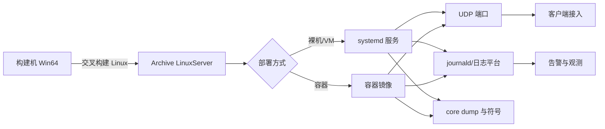

# Linux Dedicated Server 部署与容器实战

> 把 UE5.8 Dedicated Server 以无头进程、systemd 服务或容器镜像的形式部署到 Linux，覆盖构建、运行、信号、资源限制、日志、崩溃与验证。

## 元数据

- 版本基线：UE5.8.0 / CL55116800 / ++UE5+Release-5.8
- 适用范围：Win64 开发机上交叉构建 Linux Dedicated Server，并在裸机/VM 或 Docker 容器中无头运行；systemd 与常见编排平台。
- 事实边界：UE 相关参数与编译定义以本机 UE5.8 源码与既有专题为边界；systemd、Docker、内核参数、权限与网络属于平台事实，按部署环境核对。
- 事实边界：所有 `<...>` 名称、路径、端口、镜像、Region 和容量都是占位符；Linux SDK、容器运行时与宿主内核不是本文可假设的既有环境。
- 官方参考：https://dev.epicgames.com/documentation/en-us/unreal-engine
- 最后更新：2026-08-07

## 概述

Linux Dedicated Server 部署不是"把 Windows 服务器进程搬过去"，而是从构建、运行形态、
进程管理、资源限制、信号处理、日志与崩溃处理都按 Linux 语义重新设计的过程。

构建侧，Linux Server 需要目标平台工具链与项目模块支持，产物是 Linux 可执行文件与 Linux Cook 数据。
运行侧，Linux Server 是无头进程：没有画面输出，依赖参数与日志表达状态。
管理侧，systemd 或容器编排负责启动、重启、信号与资源限制；容器与裸机的信号与退出语义不同。
稳定性侧，SIGTERM 应触发优雅关服（drain），崩溃要有 core dump 与符号化路径，日志要有滚动与脱敏。

本文把"UE 侧已核对事实"与"平台侧通用实践"分开，避免把 systemd 单元或 Dockerfile 写成 UE API。

## 1. 事实边界与前置依赖

### 1.1 UE 侧已核对锚点

| 内容 | 锚点 | 说明 |
| --- | --- | --- |
| Server Target 与编译定义 | `TargetRules.cs`、`UEBuildTarget.cs` | `TargetType.Server`、`UE_SERVER=1`、`USE_NULL_RHI=1`（既有专题已核对） |
| 构建命令 | `Build.bat`、`RunUAT.bat` | `BuildCookRun -server -noclient -serverplatform=Linux` 语义（既有专题已核对） |
| 启动参数 | 既有运行专题 | `-log`、`-unattended`、`-NoSound`、地图与端口参数 |
| 监听与关服 | `UWorld::Listen`、`FEngineLoop::Exit` | 优雅关服的进程内边界（既有专题已核对） |

### 1.2 平台侧需要现场核对

| 内容 | 为什么必须核对 |
| --- | --- |
| Linux 交叉编译 SDK | 本机是否安装、版本、工具链路径 |
| 宿主内核与 libc | 二进制运行所需的最低版本 |
| 容器运行时 | Docker/Podman 版本、安全策略、网络插件 |
| systemd 版本与权限 | 服务单元语法、日志转储（journald）配置 |
| 网络拓扑 | 端口暴露、UDP 可达、防火墙与负载均衡 |

本文不声称任何部署环境已经存在，只给出方案与验证方法。

## 2. 构建 Linux Dedicated Server

### 2.1 交叉构建

Windows 主机可以用 UBT/UAT 构建 Linux 目标，但需要 Linux 目标平台工具链。
构建命令与既有构建专题一致，平台参数改为 Linux：

```bat
REM 方案示意：<ProjectServer>、<Workspace> 为占位符。
"C:\Program Files\Epic Games\UE_5.8\Engine\Build\BatchFiles\Build.bat" <ProjectServer> Linux Development -Project="<Workspace>\<Project>.uproject"
```

```bat
REM 方案示意：Linux Server-only Cook/Stage/Archive。
"C:\Program Files\Epic Games\UE_5.8\Engine\Build\BatchFiles\RunUAT.bat" BuildCookRun -project="<Workspace>\<Project>.uproject" -noP4 -server -noclient -serverconfig=Development -servertargetplatform=Linux -stage -pak -archive -archivedirectory="<ArchiveDir>"
```

注意：
- Win64 的 Server 二进制、Cook 数据、Pak 与 IoStore 不能当作 Linux 制品。
- Linux 的 Cook 平台、Stage 目录、二进制目录与运行节点要独立记录。
- 构建日志要记录工具链版本、Target、平台、配置与提交号。

### 2.2 产物清单

```text
<ArchiveDir>/
  LinuxServer/
    <ProjectServer>Server     # Linux 可执行文件（无 .exe 后缀）
    <ProjectServer>/Content/  # Linux Cook 数据
    *.pak / *.utoc / *.ucas   # 容器文件（按项目打包路线）
    <ProjectServer>.sh        # 引擎生成的启动脚本（若存在）
    Engine/                   # 引擎运行依赖
```

产物清单以实际 Stage/Archive 为准，本文只给出结构示意。
Linux 可执行文件的动态库依赖（`.so`）必须在目标 Linux 环境用 `ldd` 验证。

## 3. 无头运行形态

### 3.1 启动命令

Linux 上同样使用 `-server` 语义与地图 URL，常见无头参数组合：

```bash
# 方案示意：<ProjectServer>Server、<Map>、<port> 为占位符。
./<ProjectServer>Server <Map>?listen?Port=<port> -log -unattended -NoSound
```

- `-log`：输出日志（控制台与文件），是 Linux 无头运行的主要观测通道。
- `-unattended`：避免等待交互输入，适合无人值守。
- `-NoSound`：禁用音频输出，是常见服务器降级示意（需在目标构建核对）。

不要假设所有项目目标都支持这些参数；启动前在构建帮助与项目脚本中确认。

### 3.2 输出重定向

systemd 与容器环境通常把 stdout/stderr 作为主日志通道：

```bash
# 方案示意：直接前台运行，由 systemd/journald 或容器运行时采集输出。
exec ./<ProjectServer>Server <Map>?listen?Port=<port> -log -unattended -NoSound
```

`exec` 让 shell 进程被服务器进程替换，信号与退出码直接作用于服务器进程。
这对容器与 systemd 的 PID 1 语义很重要。

### 3.3 工作目录与只读依赖

服务器通常需要可写目录保存日志、Saved 数据与崩溃文件。
生产建议把运行目录与只读制品分开：

```text
/app/bin        # 只读制品（二进制、Pak、Cook 数据）
/var/lib/ds     # 可写运行数据（日志、Saved、Crash）
```

权限、挂载与容量按部署环境设计，并纳入监控。

## 4. systemd 服务

### 4.1 服务单元示意

```ini
# 方案示意：/etc/systemd/system/<ds-name>.service，字段以目标 systemd 版本为准。
[Unit]
Description=<ds-name> dedicated server
After=network-online.target
Wants=network-online.target

[Service]
Type=simple
User=<run-user>
WorkingDirectory=/app/bin
ExecStart=/app/bin/<ProjectServer>Server <Map>?listen?Port=<port> -log -unattended -NoSound
Restart=on-failure
RestartSec=5
LimitNOFILE=<open-file-limit>
TimeoutStopSec=<graceful-drain-timeout>
KillSignal=SIGTERM

[Install]
WantedBy=multi-user.target
```

### 4.2 信号与优雅关服

systemd 停止服务时默认发送 SIGTERM，等待 `TimeoutStopSec` 后再强制 SIGKILL。
UE 服务器进程应把 SIGTERM 映射为优雅关服（drain）：

1. 停止接收新连接与新分配。
2. 通知存量玩家并保留重连窗口。
3. 排空关键写入与结算。
4. 清理连接、网络驱动与世界。
5. 正常退出并返回退出码。

优雅关服的具体实现属于项目层，UE 进程内的退出路径见源码专题；
平台层用 `TimeoutStopSec` 限制 drain 总时长，避免无限等待。

```bash
# 运维验证示意：先优雅停止，观察退出码与日志。
systemctl stop <ds-name>
journalctl -u <ds-name> --since "5 minutes ago"
```

## 5. 容器镜像

### 5.1 Dockerfile 示意

```dockerfile
# 方案示意：<ds-name>、路径与基础镜像按项目环境替换。
FROM <linux-base-image>

WORKDIR /app
COPY --chown=<run-user>:<run-user> ./LinuxServer/ /app/bin/

RUN mkdir -p /var/lib/ds && chown -R <run-user>:<run-user> /var/lib/ds

USER <run-user>
ENV HOME=/var/lib/ds
EXPOSE <port>/udp

ENTRYPOINT ["/app/bin/<ProjectServer>Server"]
CMD ["<Map>?listen?Port=<port>", "-log", "-unattended", "-NoSound"]
```

### 5.2 容器要点

| 要点 | 说明 | 验证 |
| --- | --- | --- |
| 非 root 运行 | 降低突破后的权限范围 | `id`、文件权限、端口权限 |
| 端口范围 | 非 root 绑定低端口需额外配置 | 端口绑定测试 |
| 信号传递 | PID 1 语义与 `exec`/ENTRYPOINT 直接执行 | `docker stop` 后观察 drain 日志 |
| 时区与 locale | 日志时间戳与编码稳定 | `date`、`locale` |
| 资源限制 | CPU/内存/文件描述符上限 | `docker stats`、`ulimit -n` |
| Core Dump | 容器内崩溃文件的可达性 | 崩溃演练 |
| 日志 | stdout/stderr 采集与滚动 | 日志平台验证 |
| Secret | 不写进镜像与环境变量明文 | 镜像扫描与审计 |

### 5.3 优雅停止验证

```bash
# 方案示意：验证 SIGTERM 触发的 drain 路径。
docker stop -t <graceful-drain-seconds> <container>
docker logs <container> --since 2m
```

如果 `docker stop` 后日志没有 drain 收尾、退出码异常或数据未持久化，
先检查 ENTRYPOINT 是否直接执行服务器进程、信号是否被 shell 吞掉。

## 6. 资源限制与内核参数

### 6.1 文件描述符

高连接数的服务器需要足够的文件描述符上限：

```bash
# 查看与设置示意（具体以 systemd/容器配置为准）。
ulimit -n
```

systemd 用 `LimitNOFILE`，容器用运行时参数，裸机用 shell/limits.conf。
连接数、端口数与打开文件数要一起规划，不能只调一个。

### 6.2 内存与交换

服务器内存水位要监控，`ulimit -v` 或容器内存限制可防止失控实例拖垮节点。
但要区分"限制内存"与"预留内存"，限制过小会导致 OOM 被杀，过大失去保护意义。

### 6.3 UDP 与网络

UDP 服务要验证：

```bash
# 基础连通性示意（UDP 需协议层探测补充）。
ss -ulpn | grep <port>
```

防火墙、安全组与负载均衡的 UDP 策略必须单独验证，TCP 规则不能替代。

## 7. 日志与崩溃

### 7.1 日志通道

Linux 服务器日志至少三个通道：

| 通道 | 内容 | 处理 |
| --- | --- | --- |
| stdout/stderr | 进程输出与错误 | systemd journald / 容器采集 |
| UE 日志文件 | `Saved/Logs/*.log` | 按实例隔离、滚动与归档 |
| 结构化事件 | Ready/drain/退出码等 | 观测平台结构化采集 |

日志文件名要带实例 ID、构建 ID 与时间，避免多实例互相覆盖。
敏感信息（ticket、地址、密钥）在采集前脱敏。

### 7.2 崩溃与符号

Linux 崩溃处理至少覆盖：

1. core dump 开关与路径（`ulimit -c`、内核 `core_pattern`、容器挂载）。
2. 崩溃文件与二进制 BuildId 的关联。
3. 符号文件按 BuildId、平台、配置归档。
4. 崩溃演练：主动触发崩溃，验证 core、日志与告警闭环。

```bash
# 方案示意：查看内核 core_pattern 与当前限制。
cat /proc/sys/kernel/core_pattern
ulimit -c
```

生产环境 core dump 可能包含敏感内存，存储要限权、限时、限访问。

## 8. 部署拓扑示意



这是部署拓扑示意，节点是职责语义，具体实现按团队平台选型。

## 9. 验证清单

### 9.1 构建与产物

- [ ] Linux Server Target 构建成功，日志记录工具链版本与提交号。
- [ ] Stage/Archive 为独立 Linux 目录，无 Win64 制品混入。
- [ ] Linux 可执行文件与 `.so` 依赖在目标环境 `ldd` 验证。

### 9.2 运行与信号

- [ ] 无头启动成功，地图、端口与日志通道符合预期。
- [ ] systemd/容器停止时 SIGTERM 触发 drain，退出码与日志有收尾。
- [ ] 超时强制终止路径有记录，不会无限挂起。

### 9.3 资源与网络

- [ ] 文件描述符、内存、CPU 限制与容量规划一致。
- [ ] UDP 端口、防火墙与负载均衡策略验证通过。
- [ ] 多实例端口池原子分配，无冲突。

### 9.4 日志与崩溃

- [ ] 日志滚动、脱敏与归档正常。
- [ ] core dump 可达且按 BuildId 可符号化。
- [ ] 崩溃演练产出证据包（core、日志、告警）。

## 10. 失败路径

| 症状 | 优先检查 | 处置方向 |
| --- | --- | --- |
| Linux 构建失败 | 工具链、模块平台支持 | 核对 SDK 与 Target 平台 |
| 启动即退出 | 参数、依赖、权限、locale | 用 stdout 日志与退出码定位 |
| 端口不可达 | 防火墙、容器映射、UDP 策略 | 分层验证监听与连通 |
| 停止后数据缺失 | 信号处理、drain 超时 | 验证 SIGTERM 路径与持久化 |
| 崩溃无证据 | core_pattern、权限、挂载 | 演练并固化采集路径 |
| OOM 被杀 | 内存限制与预留 | 调资源限制与实例容量 |

## 11. 最佳实践

### 实践 1：制品与运行目录分离

只读制品放独立目录，可写数据放独立目录，权限、容量与监控分别设计。

### 实践 2：exec 直跑

systemd/容器入口用 `exec` 直接执行服务器进程，信号与退出码直达进程。

### 实践 3：SIGTERM 即 drain

把 SIGTERM 映射为优雅关服，用平台超时兜底，避免强杀放大数据丢失。

### 实践 4：非 root 运行

非 root 降低突破权限，同时验证端口、文件、core 与临时目录权限。

### 实践 5：Linux 制品独立验证

Win64 与 Linux 的二进制、Cook 数据、容器与符号不能混用，分别验收。

### 实践 6：崩溃可复现

core dump、符号与日志形成证据包，崩溃演练纳入发布流程。

### 实践 7：日志平台化

stdout、UE 日志与结构化事件统一采集，按实例与构建 ID 关联。

## 12. 常见问题 FAQ

### Q1：Windows 上能直接运行 Linux 构建产物吗？

不能。Linux 可执行文件与依赖需要在 Linux 环境运行，构建只是产出物。

### Q2：`-log -unattended -NoSound` 是所有 Linux Server 的固定参数吗？

不是。参数支持取决于目标构建与项目配置，启动前必须核对。

### Q3：为什么容器里 `docker stop` 后服务器没走优雅关服？

常见原因是 ENTRYPOINT 经过 shell 包装、信号被吞掉或超时过短。
用 `exec` 直接执行并验证 SIGTERM 处理路径。

### Q4：非 root 能绑定 7777 吗？

低端口绑定有系统限制，非 root 通常绑定高端口或配置 `net.ipv4.ip_unprivileged_port_start` 等内核参数。
以目标系统实际配置为准。

### Q5：core dump 要不要在生产开启？

要，但存储要限权、限时、限访问，且必须与符号、BuildId 关联。
完全关闭 core dump 会失去崩溃定位能力。

### Q6：journald 能替代 UE 日志文件吗？

不能完全替代。journald 采集 stdout 通道，UE 日志文件包含游戏内结构化信息，
两者结合并在观测平台关联。

### Q7：容器内存限制设多少？

先测基线：空房间、满房间与尖峰的内存曲线，再按 P95 加余量设置。
限制过小导致 OOM，过大失去保护意义。

## 13. 关联阅读

- [UE Dedicated Server构建烘焙与运行](<../../游戏知识/08-工具链与打包发布/09-UE Dedicated Server构建烘焙与运行.md>)
- [UE Dedicated Server实例生命周期与平台化](<01-UE Dedicated Server实例生命周期与平台化.md>)
- [UE Dedicated Server启动与监听源码](<../../游戏知识/12-引擎源码分析/32-UE Dedicated Server启动与监听源码.md>)
- [部署运维与监控](../02-数据与业务/05-部署运维与监控.md)
- [UE Dedicated Server联机验收与Gauntlet](<../../游戏测试与质量/06-UE Dedicated Server联机验收与Gauntlet.md>)

## 14. 更新日志

| 日期 | 版本 | 更新内容 |
| --- | --- | --- |
| 2026-08-07 | v1.0 | 新增 Linux Dedicated Server 交叉构建、systemd、容器、信号、资源限制、日志与崩溃实战专题。 |

本篇首次创建，systemd 单元、Dockerfile、内核参数与命令均为方案示意，部署前按目标环境核对。
