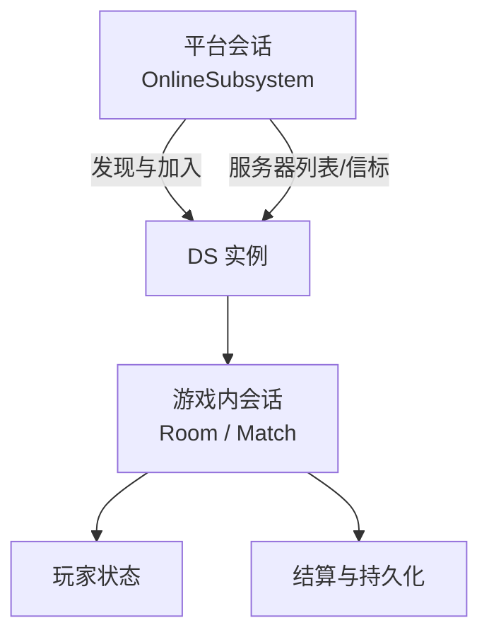
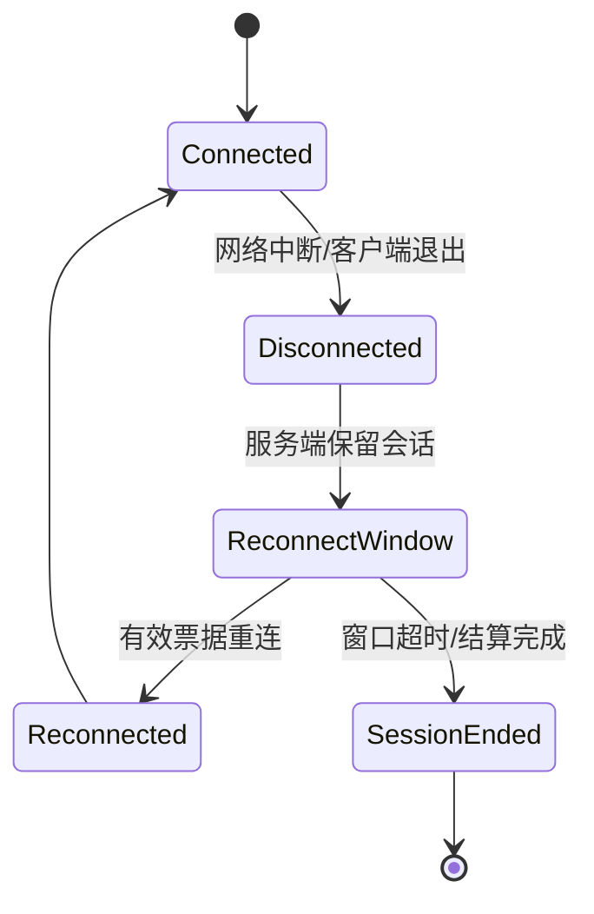
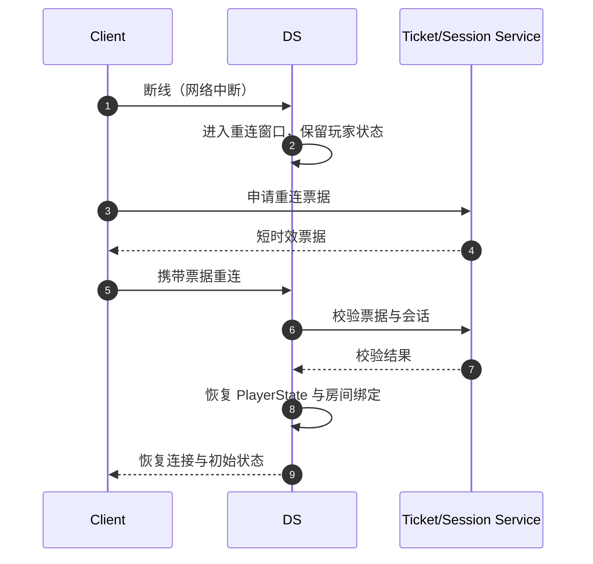

# DS 会话注册与断线重连实现

> 把 UE Dedicated Server 的会话生命周期、服务器注册、连接超时与断线重连串成一条可实现的业务链路，衔接匹配分配与玩家体验。

## 元数据

- 版本基线：UE5.8.0 / CL55116800 / ++UE5+Release-5.8
- 适用范围：DS 的会话创建与注册、服务器列表、会话心跳、连接超时、断线重连窗口、重连票据与 JIP（Join In Progress）实现设计。
- 事实边界：UE 网络驱动超时与旅行相关属性以本机 NetDriver.h/NetConnection.h 核对符号为准；OnlineSubsystem（OSS）会话 API 与平台能力以官方文档与既有在线子系统专题为概念边界。
- 事实边界：项目 Session 服务、匹配服务、票据服务、账号系统和具体 API 均为项目现场事实；所有 `<...>` 名称、端口、字段和 URL 都是占位符。
- 官方参考：https://dev.epicgames.com/documentation/en-us/unreal-engine
- 最后更新：2026-08-07

## 概述

DS 的会话（Session）有两个层面：平台会话（OnlineSubsystem 会话，用于发现与加入）与游戏内会话（房间，用于玩法状态）。
二者不是一回事，但必须正确衔接：平台会话回答"玩家如何找到这台服务器"，游戏内会话回答"玩家在这台服务器里处于什么状态"。

断线重连是多人游戏体验的关键路径：玩家网络抖动、切网、客户端崩溃后，应该能在重连窗口内回到原房间，而不是被当作新玩家或丢失进度。
重连实现由三部分组成：会话侧保留（房间、玩家状态、重连窗口）、连接侧超时（`ConnectionTimeout`/`InitialConnectTimeout`）与重连票据（短时效、绑定会话与实例）。

本文按"注册 → 保活 → 连接 → 断线 → 重连 → JIP"的顺序组织，
并把 UE 侧已核对事实与项目方案示意分开。

## 1. 事实边界与源码证据

| 编号 | 本机源码路径 | 核对重点 |
| --- | --- | --- |
| 1 | `C:\Program Files\Epic Games\UE_5.8\Engine\Source\Runtime\Engine\Classes\Engine\NetDriver.h` | `InitialConnectTimeout`、`ConnectionTimeout`、`ServerTravelPause`、`GracefulCloseConnectionTimeout` 属性 |
| 2 | `C:\Program Files\Epic Games\UE_5.8\Engine\Source\Runtime\Engine\Classes\Engine\NetConnection.h` | `HandleConnectionTimeout` 虚函数 |
| 3 | `C:\Program Files\Epic Games\UE_5.8\Engine\Source\Runtime\Engine\Private\World.cpp` | `UWorld::ServerTravel`、`GameMode->ProcessServerTravel` |
| 4 | 既有源码专题 | `PreLogin/Login/PostLogin`、`ReceivedRawPacket`、连接生命周期 |
| 5 | 既有平台化专题 | Reservation、ConnectString、实例状态机 |

OSS 会话 API（`CreateSession`/`UpdateSession`/`FindSession`/`JoinSession` 等）以
`06-网络同步/06-在线子系统与会话匹配` 的概念层与 Epic 官方文档为边界，不在本文虚构本机锚点。

## 2. 核心概念表

| 概念 | 英文 | 职责 | 常见误区 |
| --- | --- | --- | --- |
| 平台会话 | Platform Session | 让玩家发现并加入服务器 | 把平台会话当成房间状态 |
| 游戏内会话 | Game Session / Room | 承载玩法状态与玩家集合 | 把房间绑定到进程永远存活 |
| 服务器注册 | Server Registration | 把 DS 实例信息发布到发现服务 | 以为注册成功等于可连接 |
| 会话心跳 | Session Heartbeat | 保活注册信息并上报状态 | 只发"我还活着"，不带状态代数 |
| 连接超时 | ConnectionTimeout | 已建立连接多久无响应判超时 | 与登录超时混为一谈 |
| 初始连接超时 | InitialConnectTimeout | 连接建立阶段（握手/登录）超时 | 用同一超时覆盖所有阶段 |
| 重连窗口 | Reconnect Window | 断线后保留会话的时间窗口 | 窗口越长越好，忽略成本 |
| 重连票据 | Reconnect Ticket | 短时效、绑定会话的重连凭证 | 用长期令牌当重连票据 |
| JIP | Join In Progress | 中途加入拿到正确快照 | 只验证"能连上" |

## 3. 平台会话与游戏内会话

### 3.1 两层会话的关系



平台会话负责"找到"，游戏内会话负责"承载"。
匹配服务把匹配结果映射到 DS 实例后，平台会话（或等价的自研发现服务）提供加入入口，
游戏内会话在玩家进入后创建并维护。

### 3.2 服务器注册信息

服务器注册至少包含：

| 字段 | 语义 | 产生者 |
| --- | --- | --- |
| `instanceId` | 实例唯一 ID | 平台化状态机 |
| `buildId` | 二进制与内容版本 | 发布系统 |
| `region` / `mode` / `map` | 区域、模式、地图 | 分配/房间服务 |
| `port` / `publicEndpoint` | 客户端可达地址 | 网络层 |
| `protocolVersion` | 协议版本 | 发布系统 |
| `capacity` | 剩余容量 | 房间服务 |
| `state` | Ready/Allocated/InGame/Draining | 平台化状态机 |

注册信息变化时（状态、容量、地图）要主动更新，而不是等玩家搜索时才刷新。

## 4. 连接生命周期与超时

### 4.1 本机核对属性

本机 `NetDriver.h` 中：

| 属性 | 本机核对位置 | 语义边界 |
| --- | --- | --- |
| `InitialConnectTimeout` | `NetDriver.h` | 连接建立/握手阶段的超时窗口 |
| `ConnectionTimeout` | `NetDriver.h` | 已建立连接的无响应超时 |
| `GracefulCloseConnectionTimeout = 2.0f` | `NetDriver.h` | 优雅关闭连接的兜底超时 |
| `ServerTravelPause` | `NetDriver.h`、`World.cpp` | 换图前的暂停窗口 |

本机 `NetConnection.h` 提供 `HandleConnectionTimeout` 虚函数作为超时处理入口。
具体默认值、配置键名与触发条件以本机目标与源码上下文为准，本文只确认符号存在。

### 4.2 超时分层

| 阶段 | 超时 | 失败动作 |
| --- | --- | --- |
| 连接建立 | `InitialConnectTimeout` | 关闭连接并记录原因 |
| 登录/校验 | 项目登录超时 | 拒绝并返回稳定错误码 |
| 活跃中 | `ConnectionTimeout` | 判定断线，进入重连窗口 |
| 关闭中 | `GracefulCloseConnectionTimeout` | 强制清理 |

不要把"连接超时"与"登录超时""重连窗口"混为一个参数。
每个阶段都要有独立的超时、日志与指标。

## 5. 断线检测与重连窗口

### 5.1 断线状态流



断线不等于立即删除玩家状态。
服务端应把玩家移入"重连窗口"状态：保留 PlayerState、控制器关联与房间绑定，按窗口时间释放。

### 5.2 重连窗口设计

| 设计点 | 方案示意 | 理由 |
| --- | --- | --- |
| 窗口时长 | 30-120 秒（按玩法） | 覆盖常见网络抖动与切网 |
| 窗口内保留 | PlayerState、房间绑定、ticket 关联 | 重连后快速恢复 |
| 窗口内占位 | 保留席位，禁止他人顶替 | 防止会话被抢占 |
| 窗口过期 | 释放席位并触发结算/补偿 | 避免僵尸会话堆积 |
| 多端冲突 | 新连接顶替旧连接需票据校验 | 防止盗号与误踢 |

窗口不是越长越好：过长占用容量与内存，过短体验差。
以玩法的重连价值与资源成本取平衡，并纳入监控。

### 5.3 重连票据

重连票据（Reconnect Ticket）是短时效凭证：

```json
{
  "ticketId": "<ticket-id>",
  "sessionId": "<session-id>",
  "instanceId": "<instance-id>",
  "playerId": "<player-id>",
  "issuedAt": "<RFC3339-time>",
  "expiresAt": "<RFC3339-time>"
}
```

票据必须绑定会话与实例代数，过期或实例换代后立即失效。
客户端不能自行签发票据，服务端重连校验要验证票据、会话与玩家三方一致。

## 6. 重连与 JIP 实现

### 6.1 重连流程



重连路径与首次登录路径必须区分：
首次登录走完整 PreLogin/Login/PostLogin，重连走"票据校验 + 状态恢复"的轻量路径。

### 6.2 JIP 快照

JIP 不是只验证"能连上"，而是验证"中途加入者拿到正确世界状态"：

1. 当前地图与 GameState。
2. 已存在玩家的列表与关键状态。
3. 玩家自身的历史状态（进度、属性、位置）。
4. 进行中的事件（比赛、任务、结算）快照。
5. 权限与可见性校验（不能看到不应看到的数据）。

```text
JIP 验收断言示意：
  - 加入者看到与在场玩家一致的 GameState
  - 加入者关键属性与服务器权威一致
  - 加入者不能绕过权限拿到历史敏感数据
  - 重复加入不产生重复玩家对象
```

### 6.3 重连与 JIP 的复制要求

重连/JIP 玩家需要完整初始快照，而不是增量更新。
复制设计要保证：

- 初始快照包含所有必需状态，顺序稳定。
- 快照完成前不执行依赖快照的业务逻辑。
- 重连玩家与 JIP 玩家走同一快照路径，避免双实现。

## 7. 与匹配/分配器的衔接

重连与分配器的关系：

1. 玩家断线后，房间服务向匹配/分配器标记"该玩家处于重连窗口"。
2. 重连窗口内，匹配服务不应把玩家重新分配（或按策略允许选择原实例）。
3. 窗口过期后，玩家可重新进入匹配队列。
4. 实例进入 Draining/Terminating 时，重连票据立即失效。

```text
断线 -> 窗口内：保留原房间，拒绝重复分配
窗口过期 -> 释放席位，允许重新匹配
实例换代 -> 票据失效，走全新分配
```

## 8. 会话心跳与保活

DS 实例通过心跳向发现/房间服务保活注册信息：

| 心跳字段 | 语义 |
| --- | --- |
| `instanceId` / `state` | 实例与状态代数 |
| `players` / `capacity` | 容量变化 |
| `map` / `mode` | 地图与模式 |
| `tick` / `resources` | 健康信息 |
| `version` | 注册信息版本 |

心跳丢失不等于实例死亡，先查网络与编排层，再决定回收。
注册信息与实例状态机保持一致，避免"注册说 Ready，实例已 Draining"。

## 9. 方案示例：重连门卫

```cpp
// 方案示意：伪代码，不是引擎既有类型；表达重连校验边界。
enum class EReconnectResult { Accepted, TicketExpired, SessionEnded, InstanceChanged, Duplicate };

EReconnectResult FReconnectGate::Validate(const FReconnectRequest& Req)
{
    if (!TicketService->IsValid(Req.Ticket, Req.SessionId, Req.InstanceId))
        return EReconnectResult::TicketExpired;
    if (Session->State == ESessionState::Ended)
        return EReconnectResult::SessionEnded;
    if (Req.InstanceId != Instance->GetGenerationId())
        return EReconnectResult::InstanceChanged;
    if (Session->HasPlayer(Req.PlayerId))
        return EReconnectResult::Duplicate;
    return EReconnectResult::Accepted;
}
```

这段伪代码表达职责边界：票据、会话、实例代数、重复性四道检查。
迟到回调、重复请求与连接关闭后的校验结果都要幂等处理。

## 10. 失败路径

| 症状 | 优先检查 | 处置方向 |
| --- | --- | --- |
| 玩家找不到服务器 | 注册、心跳、发现服务 | 核对注册信息与状态 |
| 重连失败 | 票据、窗口、会话状态 | 检查校验链路与日志 |
| 重连后状态丢失 | 快照路径、恢复逻辑 | 走完整初始快照 |
| 重复玩家 | 幂等键、席位占用 | 重连门卫去重 |
| 窗口不释放 | 窗口计时、清理任务 | 超时强制释放 |
| 换图后重连异常 | ServerTravel、会话保留 | 核对旅行与重连衔接 |

## 11. 最佳实践

### 实践 1：平台会话与游戏内会话分离

发现与承载是两个层，分别设计状态与生命周期，不互相冒充。

### 实践 2：超时按阶段分层

`InitialConnectTimeout`、`ConnectionTimeout`、登录超时与重连窗口分别定义。

### 实践 3：断线先进重连窗口

不要断线即删状态，先保留窗口，窗口过期再释放。

### 实践 4：重连票据短时效

票据绑定会话、实例代数与玩家，过期即失效，客户端不可自签。

### 实践 5：重连与 JIP 共用快照路径

初始快照单一实现，重连与中途加入共用，避免双实现漂移。

### 实践 6：实例换代即失效

实例 Terminated/换代后，旧票据、旧 endpoint 与新进程严格隔离。

### 实践 7：注册信息与状态机一致

心跳与注册信息携带状态代数，防止发现服务与实例状态脱节。

## 12. 常见问题 FAQ

### Q1：`ConnectionTimeout` 调大就能减少掉线吗？

不一定。调大只延长判定窗口，可能掩盖网络问题并占用连接资源。
先分类断线原因（网络、超时、主动踢出），再调参数。

### Q2：平台会话和游戏内会话可以合并吗？

小规模游戏可以简化，但发现、承载、结算的职责边界仍要清楚。
合并会放大"找到但进不去""房间状态与列表不一致"的问题。

### Q3：重连窗口内玩家席位被占怎么办？

窗口内应保留席位并禁止顶替；顶替需求（如多端登录）要走明确策略与票据校验。

### Q4：JIP 玩家需要完整初始快照吗？

需要。中途加入者没有历史增量，必须从完整快照开始。

### Q5：重连票据可以复用登录令牌吗？

不建议。登录令牌生命周期长、权限大，重连票据应短时效、窄权限。

### Q6：实例 Draining 时重连怎么办？

票据按实例代数失效，玩家进入重新匹配或迁移流程，不静默加入新房间。

### Q7：心跳丢失就回收实例吗？

先区分网络分区、编排层故障与实例死亡，再决定回收，避免误杀。

## 13. 关联阅读

- [UE Dedicated Server实例生命周期与平台化](<01-UE Dedicated Server实例生命周期与平台化.md>)
- [UE Dedicated Server联机验收与Gauntlet](<../../游戏测试与质量/06-UE Dedicated Server联机验收与Gauntlet.md>)
- [在线子系统与会话匹配](../../游戏知识/06-网络同步/06-在线子系统与会话匹配.md)
- [多人游戏框架与玩家状态](../../游戏知识/06-网络同步/04-多人游戏框架与玩家状态.md)
- [UE Dedicated Server启动与监听源码](<../../游戏知识/12-引擎源码分析/32-UE Dedicated Server启动与监听源码.md>)

## 14. 更新日志

| 日期 | 版本 | 更新内容 |
| --- | --- | --- |
| 2026-08-07 | v1.0 | 新增 DS 会话注册、连接超时、断线重连窗口、重连票据与 JIP 实现专题。 |

本篇首次创建，OSS API 与项目服务均为概念边界或方案示意，落地时按官方文档与项目契约核对。
