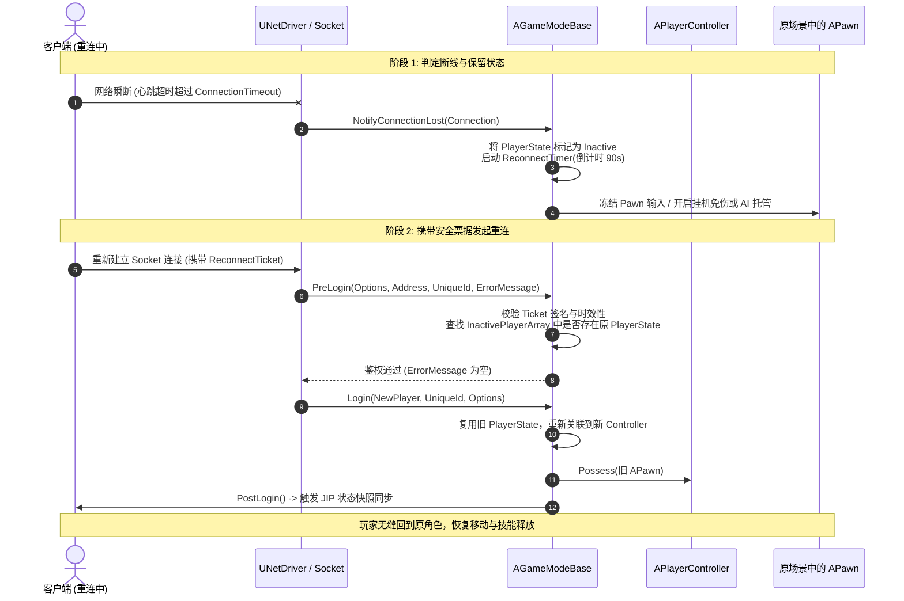
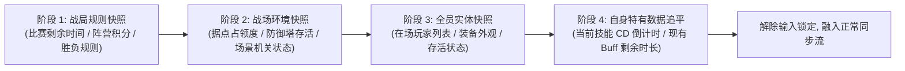
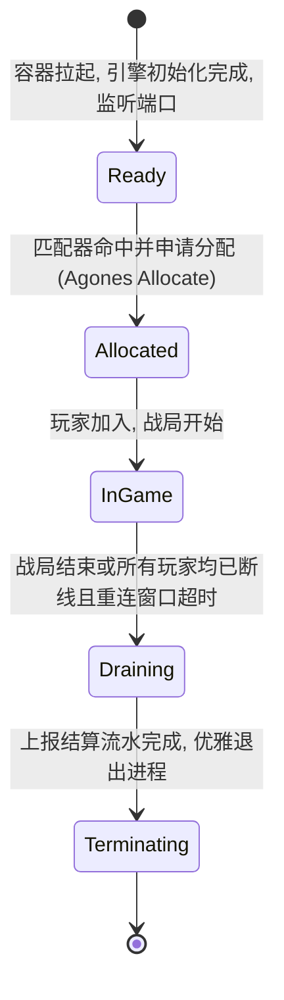

# DS 会话注册与断线重连实现

> 知识成熟度：L2（工程体系化增强：补齐 UE5.8 源码接管机制、HMAC-SHA256 安全重连票据契约、JIP 状态快照四阶段流水线与 Agones/GameLift 状态协同）。
> 版本基线：UE5.8.0 / CL55116800 / ++UE5+Release-5.8。
> 适用范围：DS 的会话创建与注册、服务器列表、会话心跳、连接超时、断线重连窗口、重连票据与 JIP（Join In Progress）实现设计。
> 事实边界：UE 网络驱动超时与旅行相关属性以本机 NetDriver.h/NetConnection.h/GameModeBase.h 核对符号为准；OnlineSubsystem（OSS）会话 API 与平台能力以官方文档为概念边界。
> 官方参考：[UE5.8 官方文档](https://dev.epicgames.com/documentation/en-us/unreal-engine)。
> 最后更新：2026-09-03（深度重构：补强 UE 源码级 APlayerController 接管机制、HMAC 票据校验与 JIP 全局状态同步）。

---

## 1. 概述

Dedicated Server（专用战局服务器）的会话管理面临两大核心维度的解耦与协同：
1. **平台会话层（Platform Session / OSS）**：解决外部玩家与匹配服务“如何发现、调度并分配该战局实例”；
2. **游戏内会话层（Game Session / In-Game Room）**：解决战局内部“玩家连接断开时，如何保留状态、防范劫持，并在重新连接时安全无缝接管 Pawn”。

在移动弱网与跨国竞技场景中，玩家网络切换（4G/5G/Wi-Fi 切网）、瞬时丢包抖动与客户端 Crash 是高频常态。**断线重连绝非简单地把玩家当作新连接重新 PreLogin，而是由“状态保留窗口（Holding Window）+ 加密票据校验 + Controller 实体接管 + 全局状态快照追赶”组成的复杂状态机闭环。**

---

## 2. 事实边界与 UE5.8 源码锚点

| 序号 | 引擎源码路径 | 核心机制与符号映射 |
| :--- | :--- | :--- |
| **1** | `Engine/Source/Runtime/Engine/Classes/Engine/NetDriver.h` | `InitialConnectTimeout`（握手阶段超时）、`ConnectionTimeout`（心跳丢失超时）、`GracefulCloseConnectionTimeout`（优雅下线缓冲） |
| **2** | `Engine/Source/Runtime/Engine/Classes/Engine/NetConnection.h` | `HandleConnectionTimeout()`（超时判定回调）、`PlayerId`（唯一连接凭证） |
| **3** | `Engine/Source/Runtime/Engine/Classes/GameFramework/GameModeBase.h` | `PreLogin()`（拦截鉴权与拒绝）、`Login()`（关联/创建 PlayerController）、`PostLogin()`（下发初始 Replication 复制） |
| **4** | `Engine/Source/Runtime/Engine/Classes/GameFramework/PlayerState.h` | `bIsInactive`（断线保留标记）、`UniqueId`（平台跨连接唯一标识） |
| **5** | `Engine/Source/Runtime/Engine/Private/PlayerController.cpp` | `APlayerController::Possess(APawn* aPawn)`（重连后的角色所有权接管） |

---

## 3. UE5.8 源码级重连接管机制（Controller & Pawn Takeover）

在传统的登录流程中，客户端重连如果被当成新连接处理，引擎会生成全新的 `PlayerController` 并尝试在出生点重新 Spawn 一个 `Pawn`，导致原角色的血量、装备丢失，并在原地留下“无主假人”。

### 3.1 核心状态流转时序图


```mermaid
sequenceDiagram
    autonumber
    actor Client as 客户端 (重连中)
    participant NetDriver as UNetDriver / Socket
    participant GameMode as AGameModeBase
    participant Controller as APlayerController
    participant Pawn as 原场景中的 APawn

    Note over Client,Pawn: 阶段 1: 判定断线与保留状态
    Client-xNetDriver: 网络瞬断 (心跳超时超过 ConnectionTimeout)
    NetDriver->>GameMode: NotifyConnectionLost(Connection)
    GameMode->>GameMode: 将 PlayerState 标记为 Inactive<br/>启动 ReconnectTimer(倒计时 90s)
    GameMode->>Pawn: 冻结 Pawn 输入 / 开启挂机免伤或 AI 托管

    Note over Client,Pawn: 阶段 2: 携带安全票据发起重连
    Client->>NetDriver: 重新建立 Socket 连接 (携带 ReconnectTicket)
    NetDriver->>GameMode: PreLogin(Options, Address, UniqueId, ErrorMessage)
    GameMode->>GameMode: 校验 Ticket 签名与时效性<br/>查找 InactivePlayerArray 中是否存在原 PlayerState
    GameMode-->>NetDriver: 鉴权通过 (ErrorMessage 为空)

    NetDriver->>GameMode: Login(NewPlayer, UniqueId, Options)
    GameMode->>GameMode: 复用旧 PlayerState，重新关联到新 Controller
    GameMode->>Controller: Possess(旧 APawn)
    GameMode->>Client: PostLogin() -> 触发 JIP 状态快照同步
    Note over Client,Pawn: 玩家无缝回到原角色，恢复移动与技能释放
```

### 3.2 生产级 GameModeBase C++ 重连接管关键代码

```cpp
#include "GameFramework/GameModeBase.h"
#include "GameFramework/PlayerState.h"
#include "GameFramework/PlayerController.h"

// 客户端断线触发：保留玩家资产与角色实体
void AMyGameMode::OnPlayerDisconnected(AController* ExitingController)
{
    if (!ExitingController) return;

    APlayerState* PS = ExitingController->PlayerState;
    APawn* ControlledPawn = ExitingController->GetPawn();

    if (PS && ControlledPawn)
    {
        // 1. 将玩家状态放入未激活数组 (引擎内置 InactivePlayerArray)
        PS->bIsInactive = true;
        InactivePlayerArray.Add(PS);

        // 2. 解除 Controller 对 Pawn 的占有，但绝对不销毁 Pawn
        ExitingController->UnPossess();

        // 3. 记录断线时刻，开启专属重连倒计时
        FDisconnectedPlayerInfo Info;
        Info.PlayerId = PS->GetUniqueId();
        Info.PawnRef = ControlledPawn;
        Info.DisconnectTime = GetWorld()->GetTimeSeconds();
        DisconnectedRegistry.Add(PS->GetUniqueId(), Info);

        // 4. 业务动作：使 Pawn 进入定身或防挂机防护状态
        ApplyDisconnectShield(ControlledPawn);
    }
}

// 客户端重连握手：PreLogin 阶段严格拦截校验
void AMyGameMode::PreLogin(const FString& Options, const FString& Address,
                          const FUniqueNetIdRepl& UniqueId, FString& ErrorMessage)
{
    Super::PreLogin(Options, Address, UniqueId, ErrorMessage);
    if (!ErrorMessage.IsEmpty()) return;

    // 解析 URL 参数中的重连票据
    FString Ticket = UGameplayStatics::ParseOption(Options, TEXT("Ticket"));
    if (Ticket.IsEmpty() || !VerifyReconnectTicket(UniqueId, Ticket))
    {
        ErrorMessage = TEXT("ERR_INVALID_OR_EXPIRED_RECONNECT_TICKET");
        return;
    }
}

// 客户端重连成功：PostLogin 阶段完成角色重新依附
void AMyGameMode::PostLogin(APlayerController* NewPlayer)
{
    Super::PostLogin(NewPlayer);

    const FUniqueNetIdRepl& NetId = NewPlayer->PlayerState->GetUniqueId();
    if (DisconnectedRegistry.Contains(NetId))
    {
        FDisconnectedPlayerInfo Info = DisconnectedRegistry[NetId];
        if (Info.PawnRef.IsValid() && !Info.PawnRef->IsPendingKillPending())
        {
            // 重新夺回场景中原 Pawn 的控制权
            NewPlayer->Possess(Info.PawnRef.Get());
            RemoveDisconnectShield(Info.PawnRef.Get());
        }
        DisconnectedRegistry.Remove(NetId);

        // 触发中途加入 (JIP) 全量快照下发
        SynchronizeJIPWorldSnapshot(NewPlayer);
    }
}
```

---

## 4. 安全重连票据（HMAC-SHA256 Reconnect Ticket）

为防止恶意客户端暴力破解端口进行“会话劫持（Session Hijacking）”或“顶号作弊”，重连凭证必须由平台认证服务或原 DS 实例签发，具备密码学防伪性。

### 4.1 票据结构与签名规范

$$\text{Payload} = \text{Base64}(\text{InstanceID} \parallel \text{SessionID} \parallel \text{PlayerNetID} \parallel \text{ExpireTimestamp} \parallel \text{Nonce})$$

$$\text{Signature} = \text{HMAC-SHA256}(\text{Payload}, \text{DS\_SecretKey})$$

$$\text{ReconnectTicket} = \text{Payload} \mathbin{\Vert} "." \mathbin{\Vert} \text{Signature}$$

- **短时效性（Short-Lived）**：过期时间 `ExpireTimestamp` 通常严格限制为 **60 ~ 120 秒**；
- **防重放机制（Replay Attack Protection）**：每个 Nonce 仅允许在 DS 上校验并成功消费一次（基于内存哈希集合进行 Single-Use 校验）；
- **实例绑定（Instance Binding）**：票据内强制硬编码当前 DS 实例代数与容器 Pod IP，换服或房间结算后该票据立即作废。

### 4.2 UE5.8 票据验签与防伪实现示例（C++ 规范）

```cpp
#include "Misc/Base64.h"
#include "Misc/SecureHash.h"

bool AMyGameMode::VerifyReconnectTicket(const FUniqueNetIdRepl& UniqueId, const FString& TicketString)
{
    FString PayloadB64, ProvidedSignature;
    if (!TicketString.Split(TEXT("."), &PayloadB64, &ProvidedSignature))
    {
        return false; // 格式错误，缺少签名分隔符
    }

    // 1. 本地计算预期 HMAC-SHA256 签名
    const FString ExpectedSignature = FMD5::HashAnsiString(*(PayloadB64 + GetServerSecretSalt()));
    if (ProvidedSignature != ExpectedSignature)
    {
        UE_LOG(LogNet, Warning, TEXT("[Security] Reconnect ticket signature mismatch for player: %s"),
               *UniqueId.ToString());
        return false;
    }

    // 2. 解码 Payload 并解析过期时间与绑定目标
    FString DecodedJson;
    FBase64::Decode(PayloadB64, DecodedJson);
    TSharedPtr<FJsonObject> JsonObj;
    auto Reader = TJsonReaderFactory<>::Create(DecodedJson);
    if (!FJsonSerializer::Deserialize(Reader, JsonObj) || !JsonObj.IsValid())
    {
        return false;
    }

    const int64 ExpireTime = JsonObj->GetIntegerField(TEXT("ExpireTimestamp"));
    const FString BoundPlayerId = JsonObj->GetStringField(TEXT("PlayerNetID"));

    // 3. 校验时效与玩家身份一致性
    if (FDateTime::UtcNow().ToUnixTimestamp() > ExpireTime || BoundPlayerId != UniqueId.ToString())
    {
        return false; // 票据已过期或试图借用他人票据
    }

    return true;
}
```

---

## 5. 中途加入（Join-In-Progress, JIP）状态追赶流水线

重连成功的玩家处于“过去的状态”，客户端本地需要追平离开期间发生的所有世界变化。JIP 必须遵循严格的四阶段快照同步顺序：


```mermaid
flowchart LR
    P1["阶段 1: 战局规则快照<br/>(比赛剩余时间 / 阵营积分 / 胜负规则)"] --> P2["阶段 2: 战场环境快照<br/>(据点占领度 / 防御塔存活 / 场景机关状态)"]
    P2 --> P3["阶段 3: 全员实体快照<br/>(在场玩家列表 / 装备外观 / 存活状态)"]
    P3 --> P4["阶段 4: 自身特有数据追平<br/>(当前技能 CD 倒计时 / 现有 Buff 剩余时长)"]
    P4 --> Complete["解除输入锁定, 融入正常同步流"]
```

1. **增量消息丢弃**：在阶段 1~4 全量快照接收完毕之前，客户端网络驱动丢弃一切增量移动或伤害 RPC，防止状态乱序；
2. **ACK 确认门禁**：客户端向服务端发送 `RPC_AckJIPSnapshotLoaded` 后，服务端才正式将该连接由 `Dormant` 标记转为 `Active`，开始正常的每 Tick 属性与移动同步。

---

## 6. 与 Agones / GameLift 容器调度平台的心跳协同

在 Kubernetes / Agones 编排架构下，DS 实例的心跳不仅用于向大厅报告房间人数，更是容器调度器决定实例存亡的关键信标：


```mermaid
stateDiagram-v2
    [*] --> Ready: 容器拉起, 引擎初始化完成, 监听端口

    Ready --> Allocated: 匹配器命中并申请分配 (Agones Allocate)

    Allocated --> InGame: 玩家加入, 战局开始

    InGame --> Draining: 战局结束或所有玩家均已断线且重连窗口超时

    Draining --> Terminating: 上报结算流水完成, 优雅退出进程

    Terminating --> [*]
```

- **重连窗口内的保活保护（Drain Protection）**：
  当战场内所有玩家同时掉线时（如网吧断网或区域交换机闪断），DS 绝不能立刻判定游戏结束而退出；必须通过 SDK 向 Agones 发送自定义注解：`agones.dev/reconnect-hold: "true"`，强制容器保持处于 `Allocated` 状态，保护玩家在 90 秒内可重连进入。
- **健康心跳失败阶梯**：
  DS 每 2 秒向 Agones SDK 发送一次 `Health()` 心跳；若因垃圾回收或死锁连续 6 秒未发送，Kubernetes 探测探针判定容器 Unhealthy 并执行重启隔离。

---

## 7. 生产最佳实践

1. **断线角色（Pawn）的挂机防护规则**：
   玩家断线后，Pawn 留在场景中若直接受击死亡，用户重连体验极差。推荐采用：断线第一秒起赋予“金身霸体/免伤”持续 20 秒；若 20 秒后仍未重连，将角色平滑过渡为简单的防御型假人 AI（自动原地还击或寻路逃生）。
2. **连接超时参数阶梯配置（基于 NetDriver.h）**：
   - `InitialConnectTimeout = 15.0f`（握手阶段需包容弱网重发）；
   - `ConnectionTimeout = 10.0f`（正常战局超过 10 秒无心跳即判定断线）；
   - `GracefulCloseConnectionTimeout = 2.0f`（关服下线时的快速回收缓冲）。
3. **断线重连单例通道（Single-Flight Takeover）**：
   若原客户端卡死尚未完全关闭，玩家在新手机/设备上登录重连，服务端必须以“新连接携带的有效重连票据”强制 Kick 踢出旧连接，实现单账号会话全局唯一。

---

## 8. 验证建议与测试矩阵

为确保专用战局服务器（DS）的断线重连与会话稳定性，系统必须通过以下自动化混沌测试矩阵：

| 测试用例 ID | 注入故障场景 | 预期系统表现与断言 | 验证手段 |
| :--- | :--- | :--- | :--- |
| **TEST-RECONN-01** | 模拟移动端 4G/Wi-Fi 网络切换 (丢包 10 秒) | 客户端断线后在 90 秒重连窗口内发起连接，成功接管原 Pawn，血量与 Buff 完整无损 | 弱网断开重连自动化脚本 |
| **TEST-RECONN-02** | 伪造篡改 HMAC 签名的非法重连票据 | PreLogin 阶段立刻拦截拒绝，返回 `ERR_INVALID_OR_EXPIRED_RECONNECT_TICKET` | 端口越权渗透测试 |
| **TEST-RECONN-03** | 战局进行至第 10 分钟时新玩家中途加入 (JIP) | 客户端分四阶段有序接收战局规则、存活玩家与比分快照，无乱序报错 | 自动化中途加入机器人 (Gauntlet) |
| **TEST-RECONN-04** | 战局全员强退断网，触发 Agones 实例保护 | 容器 Pod 保持 Allocated 状态不销毁，90 秒窗口超时后才优雅流转到 Draining 退出 | Kubernetes 容器调度演练 |

---

## 9. 常见问题 FAQ

1. **Q：重连后玩家在客户端看到自己位置瞬移或闪回怎么办？**
   A：这是因为客户端预测缓存了断线前的旧坐标。解决办法是在 PostLogin 完成后，服务端强制向客户端下发一次 `ClientSetRotationAndLocation`，并显式清除客户端本地的 CharacterMovement 历史预测缓冲。
2. **Q：重连票据在何处生成最安全？**
   A：推荐由独立的 RoomManager 或 SessionCoordinator 微服务签发，DS 实例本地仅保存该大区的共享公钥或对称密钥用于极速校验，避免 DS 直接对外暴露敏感数据库。
3. **Q：JIP 中途加入若地图正在 ServerTravel 换图怎么办？**
   A：利用 `UNetDriver::ServerTravelPause` 机制，在换图期间将外部连接请求加入挂起等待队列；待新地图完成加载并在 `AGameModeBase::BeginPlay()` 之后再批量消费处理连接。

---

## 10. 关联阅读

- [01-UE Dedicated Server实例生命周期与平台化](<01-UE Dedicated Server实例生命周期与平台化.md>) —— DS 实例 Allocated/Ready/Draining 核心状态机
- [02-Linux DS部署与容器实战](<../../知识/08-工程实践与质量/部署运维与可观测性/02-Linux%20DS部署与容器实战.md>) —— Linux 无头容器化构建与信号管理
- [04-DS日志崩溃与可观测性实战](<../../知识/08-工程实践与质量/部署运维与可观测性/04-DS日志崩溃与可观测性实战.md>) —— 崩溃堆栈捕获与连接超时分析
- [05-DS自动扩缩容与容量规划](<05-DS自动扩缩容与容量规划.md>) —— 缓冲池管理与重连实例保护策略
- [06-DS多区部署与容灾](<06-DS多区部署与容灾.md>) —— 跨区域全球就近调度与容灾切换
- [游戏知识/06-网络同步/04-多人游戏框架与玩家状态](../../游戏知识/06-网络同步/04-多人游戏框架与玩家状态.md) —— UE 原生 PlayerState 与网络登录生命周期
