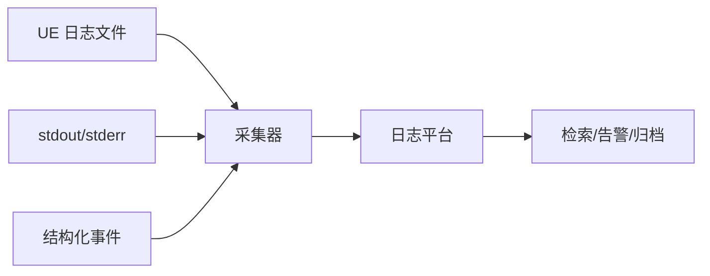
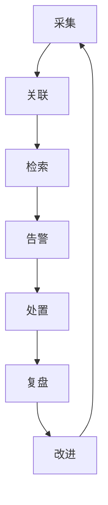

# DS 日志、崩溃与可观测性实战

> 把 UE Dedicated Server 的日志规范、崩溃捕获、符号化、Trace/Insights 与告警闭环落到可执行的运维实践。

## 元数据

- 版本基线：UE5.8.0 / CL55116800 / ++UE5+Release-5.8
- 适用范围：DS 的日志通道与级别、脱敏与归档、崩溃捕获与符号化、服务器侧 Trace/Insights 分析、指标告警与 SLO 落地。
- 事实边界：UE 日志与 Trace 能力以官方文档和既有源码专题为边界；日志平台、告警系统、符号服务与观测后端属于项目平台选型。
- 事实边界：所有 `<...>` 名称、路径、指标阈值与告警规则都是占位符。
- 官方参考：https://dev.epicgames.com/documentation/en-us/unreal-engine
- 最后更新：2026-08-07

## 概述

DS 的可观测性目标是：任何一次故障都能从日志、指标、Trace 与崩溃证据中还原现场。

日志回答"发生了什么"，指标回答"什么时候开始恶化"，Trace 回答"调用链路在哪里慢"，
崩溃证据回答"进程为什么死"。四者用实例 ID、构建 ID、会话 ID 与请求 ID 关联成一条链。

本文聚焦落地：日志怎么写、脱敏怎么做、崩溃怎么收、符号怎么对、告警怎么设。
指标口径与字段规范见《01-UE Dedicated Server实例生命周期与平台化》的观测章节，本文不重复其表格，只讲实施。

## 1. 事实边界

| 内容 | 边界 |
| --- | --- |
| UE 日志系统 | 官方文档与既有专题（日志通道、级别、控制台命令） |
| UE Trace/Insights | 官方文档与 `28-UnrealInsights与Trace源码` 专题 |
| CrashReportClient 等崩溃组件 | 官方文档概念边界，是否启用以目标构建为准 |
| 符号化 | 按 BuildId 关联二进制与符号，工具链由项目平台决定 |
| 日志平台/告警后端 | 项目选型，本文只给字段与规则方法 |

## 2. 日志规范

### 2.1 日志通道与级别

服务器日志按模块分通道、按严重度分级：

```text
通道：Net / GameMode / Match / Replication / AI / Physics / Persistence / Admin
级别：Verbose / Log / Warning / Error / Fatal
```

生产建议：

- Error 级必须有结构化上下文（阶段、符号、结果码、实例 ID）。
- Warning 级用于可恢复异常，要可聚合、可告警。
- Verbose 只按需开启（诊断窗口），默认关闭。

### 2.2 结构化字段

每条关键日志至少带：

```json
{
  "ts": "<RFC3339>",
  "level": "error",
  "instanceId": "<instance-id>",
  "buildId": "<build-id>",
  "sessionId": "<session-id>",
  "requestId": "<request-id>",
  "stage": "login",
  "code": "LOGIN_TIMEOUT",
  "message": "<脱敏后的描述>"
}
```

稳定错误码（code）是告警与排障的基础，不要用自由文本代替。

### 2.3 脱敏

日志不得包含：完整 ticket、密码、长期密钥、玩家原始地址、敏感业务字段。

```text
脱敏规则示意：
  ticket/secret -> 哈希或截断
  玩家 ID -> 不可逆哈希或受控关联
  IP/地址 -> 脱敏或授权访问
  Core Dump -> 限权、限时、限访问
```

脱敏要在采集前完成，而不是在展示层补救。

## 3. 日志采集与归档

### 3.1 通道汇总



UE 日志文件、stdout 与结构化事件三通道统一采集，按实例隔离。
日志文件名带 `instanceId`/`buildId`/时间，避免多实例覆盖。

### 3.2 滚动与保留

| 项 | 建议（示意） |
| --- | --- |
| 单文件上限 | `<size>` |
| 滚动策略 | 按大小与时间 |
| 本地保留 | 按磁盘预算 |
| 归档 | 与证据包、构建 ID 关联 |
| 敏感日志 | 加密存储与访问审计 |

## 4. 崩溃捕获与符号化

### 4.1 崩溃证据链

```text
崩溃发生
  -> core dump / 崩溃报告
  -> 二进制 BuildId
  -> 符号文件（BuildId、平台、配置）
  -> 符号化调用栈
  -> 关联日志与指标
```

崩溃文件必须与二进制严格匹配，用 BuildId 关联，不能用"最新符号"覆盖历史构建。

### 4.2 崩溃演练

发布前演练崩溃路径：

1. 主动触发已知崩溃（受控环境）。
2. 验证 core/崩溃报告可达且完整。
3. 验证符号化产出可读调用栈。
4. 验证告警与证据包闭环。
5. 验证实例重启与玩家补偿路径。

```text
崩溃演练验收：
  - 调用栈可符号化
  - 告警在 <n> 分钟内触发
  - 重启与恢复路径符合设计
  - 证据包可复查
```

### 4.3 CrashReportClient 边界

CrashReportClient 是 UE 提供的崩溃上报组件，是否启用、如何配置以目标构建与官方文档为准。
其作用是收集与上报崩溃上下文，不能替代符号服务与告警闭环。

## 5. 服务器侧 Trace/Insights

### 5.1 Trace 采集

服务器侧 Trace 用于 Tick、网络、加载与长帧分析：

```text
采集示意：
  - 按需开启（诊断窗口），不全量常开
  - 采集 CPU/Tick/网络通道
  - 与连接数、收发包、复制字节关联
  - 输出 .utrace 并归档到证据包
```

具体命令与通道名以目标构建与 `28-UnrealInsights与Trace源码` 专题核对。

### 5.2 分析流程


Trace 分析要结合指标：先看指标确认时间窗，再用 Trace 下钻到调用链。

## 6. 指标与告警

### 6.1 关键告警规则（示意）

| 告警 | 规则（示意） | 动作 |
| --- | --- | --- |
| 实例不 Ready | Ready 超时 | 标记失败并回收 |
| Tick 长尾 | P99 连续超阈值 | 摘流量并分析 |
| 内存增长 | 单调增长超窗口 | 定位泄漏 |
| 登录失败率 | 超过阈值 | 检查登录依赖 |
| 崩溃率 | 超过阈值 | 冻结发布并定位 |
| Drain 超时 | 超过窗口 | 检查关闭路径 |
| 日志 Error 风暴 | 速率超过阈值 | 防日志膨胀告警 |

告警要可执行：每条告警带排查入口（证据包、日志查询、相关指标）。

### 6.2 SLO 落地

SLO 绑定玩家路径：

```text
StartupToReady_P95       <= <startup-slo>
AllocationLatency_P95    <= <allocation-slo>
LoginSmokeSuccess        >= <login-slo>
DrainCompletionRate      >= <drain-slo>
```

SLO 不达标要能追溯到实例、构建与版本，形成改进闭环。

## 7. 可观测性闭环



闭环的关键是关联字段一致：`buildId/instanceId/sessionId/matchId/region/requestId`。
缺少关联字段的日志与指标在故障时无法串成一条链。

## 8. 验证清单

- [ ] 日志带结构化字段与稳定错误码。
- [ ] 脱敏在采集前完成，抽查无敏感字段。
- [ ] 三通道（文件/stdout/事件）统一采集与归档。
- [ ] 崩溃证据链（core、BuildId、符号、调用栈）演练通过。
- [ ] Trace 采集与归档按需可用。
- [ ] 告警规则带排查入口，SLO 可度量。
- [ ] 关联字段在日志、指标、Trace 与告警中一致。

## 9. 失败路径

| 症状 | 优先检查 | 处置方向 |
| --- | --- | --- |
| 日志查不到 | 采集、归档、实例隔离 | 核对通道与路径 |
| 脱敏失效 | 采集前处理逻辑 | 修复并复查 |
| 崩溃无法符号化 | BuildId 与符号匹配 | 追补符号并冻结 |
| 告警轰炸 | 规则阈值与去重 | 校准规则 |
| 告警沉默 | 规则覆盖与关联 | 演练补齐 |
| 关联断裂 | 字段不一致 | 统一字段规范 |

## 10. 最佳实践

### 实践 1：关联字段先行

日志、指标、Trace、告警统一关联字段，故障时才能串链。

### 实践 2：错误码稳定

用稳定错误码代替自由文本，告警与排障才有依据。

### 实践 3：脱敏在采集前

采集前脱敏，不依赖展示层补救。

### 实践 4：崩溃必演练

崩溃路径（core、符号、告警、重启）发布前演练。

### 实践 5：Trace 按需开启

诊断窗口开启 Trace，全量常开会掩盖问题并增加开销。

### 实践 6：告警可执行

每条告警带证据包与排查入口，不产生"看了也不知道怎么办"的告警。

### 实践 7：SLO 绑定玩家路径

SLO 度量玩家可感知路径，不达标可回溯到实例与构建。

## 11. 常见问题 FAQ

### Q1：日志越多越好吗？

不是。全量日志增加成本并掩盖问题；关键路径结构化日志 + 按需 Verbose 更有效。

### Q2：Core Dump 什么时候开？

生产应开启但限权限时；完全关闭会失去崩溃定位能力。

### Q3：符号文件怎么管理？

按 BuildId、平台、配置与模块版本归档，与二进制严格匹配。

### Q4：Trace 会拖慢服务器吗？

采集有开销，按诊断窗口开启并限制通道，避免常开全量。

### Q5：告警太多怎么办？

校准阈值、去重、分级；先消灭"沉默"（该告未告）再压缩"轰炸"。

### Q6：CrashReportClient 能替代符号服务吗？

不能。它负责收集上报，符号化仍需要符号服务与 BuildId 关联。

## 12. 关联阅读

- [UE Dedicated Server实例生命周期与平台化](<01-UE Dedicated Server实例生命周期与平台化.md>)
- [Linux DS部署与容器实战](<02-Linux DS部署与容器实战.md>)
- [UnrealInsights与Trace源码](../../游戏知识/12-引擎源码分析/28-UnrealInsights与Trace源码.md)
- [部署运维与监控](../02-数据与业务/05-部署运维与监控.md)
- [UE Dedicated Server联机验收与Gauntlet](<../../游戏测试与质量/06-UE Dedicated Server联机验收与Gauntlet.md>)

## 13. 更新日志

| 日期 | 版本 | 更新内容 |
| --- | --- | --- |
| 2026-08-07 | v1.0 | 新增 DS 日志规范、崩溃捕获与符号化、Trace/Insights 与告警闭环实战专题。 |

本篇首次创建，日志平台、告警规则与阈值均为方案示意，落地时按项目平台核对。
