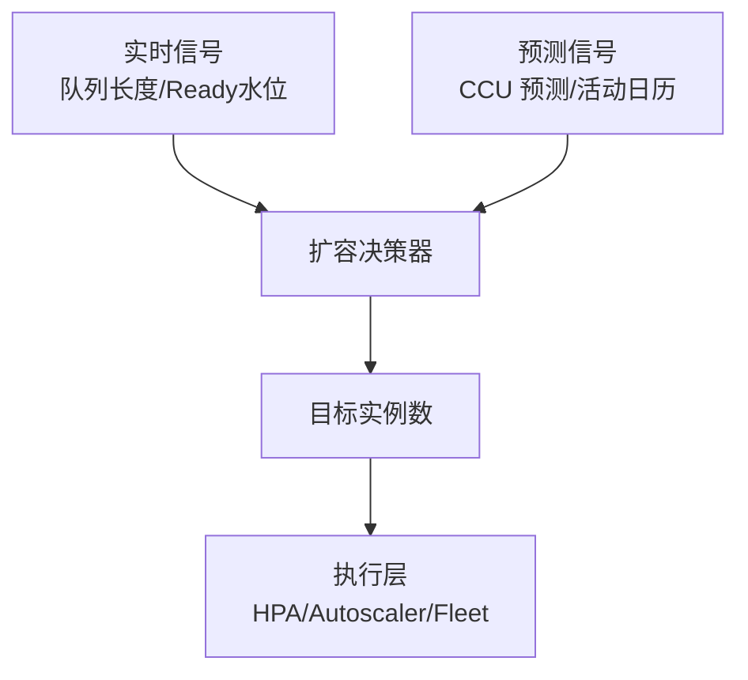
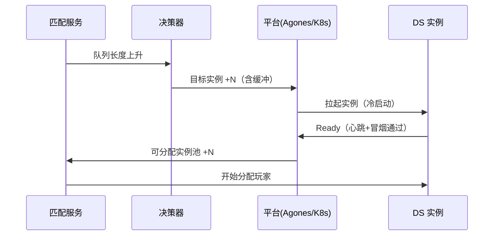

# DS 自动扩缩容与容量规划

> 知识基线：平台方案层（非 UE 内置能力）。本文覆盖 Dedicated Server 集群的自动扩缩容信号、策略（K8s HPA / Agones Fleet Autoscaler / GameLift 伸缩）、扩容预热与延迟、缩容保护与容量规划方法；与[01-UE Dedicated Server实例生命周期与平台化.md](<01-UE Dedicated Server实例生命周期与平台化.md>)（实例状态机与分配契约）配套。
> 版本基线：UE5.8.0 / CL55116800 / ++UE5+Release-5.8；平台 API 以供应商官方文档为准。
> 适用范围：运营期 DS 集群的容量管理团队、平台架构师；需要把"匹配队列长度/Ready 水位/CCU"转成扩缩容动作的团队。
> 事实边界：HPA/Agones/GameLift 的 API 名称与行为以其官方文档为准，本文为方案设计；容量数字（单实例 CCU、启动时长）必须由项目实测，本文不虚构。
> 最后更新：2026-08-07。
> 权威来源：[Kubernetes HPA 文档](https://kubernetes.io/docs/tasks/run-application/horizontal-pod-autoscale/)、[Agones Fleet Autoscaler 文档](https://agones.dev/site/docs/guides/fleet-autoscaler/)、[Amazon GameLift 伸缩策略文档](https://docs.aws.amazon.com/gamelift/latest/developerguide/autoscaling.html)。

> DS 的成本与体验平衡，本质是**容量管理**：实例太少 → 玩家排队流失；实例太多 → 空转烧钱。本文把扩缩容拆成"信号 → 决策 → 执行 → 保护"四个环节，给出与实例生命周期状态机（01 篇）衔接的完整方案。

---

## 1. 为什么扩缩容难

| 挑战 | 说明 |
| --- | --- |
| 启动延迟 | DS 冷启动（拉起进程+加载地图）通常 30s~数分钟，无法瞬时扩容 |
| 突发流量 | 开服/活动/新版本发布瞬间匹配请求暴涨 |
| 缩容误伤 | 缩容过快会踢掉在服玩家（房间未结束） |
| 成本波动 | 空转实例按小时计费，容量=直接成本 |
| 区域差异 | 不同区域时区/活动节奏不同，需分区管理 |

---

## 2. 扩缩容信号

### 2.1 信号体系

| 信号 | 来源 | 含义 | 典型阈值（示意） |
| --- | --- | --- | --- |
| Ready 水位 | 实例心跳聚合 | 可分配实例占比 | < 20% 触发扩容 |
| 匹配队列长度 | 匹配服务 | 等待玩家数 | 队列 > 100 触发扩容 |
| 排队时长 P50/P95 | 匹配服务 | 玩家等待体验 | P95 > 15s 触发扩容 |
| CCU 预测 | 时间序列预测 | 未来在线人数 | 预测峰值前 10min 扩容 |
| 失败分配率 | 分配器 | 无实例可分配的比例 | > 2% 触发扩容 |
| 资源水位 | 节点指标 | CPU/内存/网络 | > 70% 告警 |

### 2.2 信号分层



*图释：扩缩容决策器融合实时与预测信号，输出目标实例数，交给平台执行层落地。*

---

## 3. 扩容策略

### 3.1 三种平台执行方式

| 平台 | 机制 | 适用 |
| --- | --- | --- |
| Kubernetes HPA | 按自定义指标（Ready 水位/队列）扩 Deployment | 自建 K8s |
| Agones Fleet Autoscaler | 按 GameServerAllocation 缓冲（Buffer Size）扩 Fleet | Agones 托管 |
| GameLift 伸缩策略 | 按"可用游戏会话"目标数/队列伸缩 | GameLift |

### 3.2 缓冲策略（Buffer）是核心

Agones/HPA 的常用模式是**保持 N 个 Ready 实例缓冲**：

```text
// 伪代码：缓冲式扩容目标（节选/示意）
target = 当前在服实例 + 排队实例 + 缓冲数
缓冲数 = max(最小缓冲, 峰值分配速率 × 启动时长)
```

缓冲数经验公式：`缓冲 = 每分钟分配数 × 启动分钟数 × 1.5（安全系数）`——保证"边启动边消耗"不枯竭。

### 3.3 预测式扩容（Proactive）

- **时间序列预测**：按历史 CCU 曲线（周/日模式）预测未来 15~30min 在线人数；
- **事件日历**：开服/活动/更新发布时间表驱动提前扩容；
- **阶梯扩容**：预测触发"预热扩容"（提前拉一半），实时信号再补足；
- 好处：绕开启动延迟窗口；代价：需要历史数据与运营日历。

### 3.4 扩容执行时序



*图释：扩容时序——决策器扩容后，实例进入 Ready 才可分配，避免"拉起即分配"导致失败。*

---

## 4. 缩容保护

### 4.1 缩容前提

- **只缩非在服实例**：正在 InGame 的实例必须等房间结束/Draining 完成；
- **Draining 先行**：先停止新分配（摘流量），再等存量玩家自然退出（见 01 篇状态机）；
- **最小存活**：保底实例数（如 2 个）应对突发；
- **冷却**：缩容后冷却期（如 10min）防抖动。

### 4.2 缩容策略对比

| 策略 | 做法 | 优点 | 风险 |
| --- | --- | --- | --- |
| 快速缩容 | 空闲实例立即回收 | 省钱 | 突发时重新冷启动 |
| 延迟缩容 | 空闲 N 分钟后再回收 | 缓冲突发 | 空转成本 |
| 两档缩容 | 先降缓冲，再回收空闲 | 平衡 | 实现复杂 |

### 4.3 长对局游戏的缩容

- 对局制（MOBA/FPS）：实例生命周期 = 房间生命周期，缩容 = 房间结束后回收（自然缩容）；
- 持久世界（MMO）：实例常驻，缩容只发生在"合并分线"场景（跨实例合流，需专门方案）；
- **推荐**：对局制用"自然缩容 + 空闲超时兜底"，避免主动踢人。

### 4.4 扩缩容指标与告警

| 指标 | 阈值（示意） | 告警级别 |
| --- | --- | --- |
| Ready 水位 | < 15% 持续 5min | 扩容告警 |
| 分配失败率 | > 2% | 严重（影响玩家） |
| 排队时长 P95 | > 15s | 严重 |
| 空闲实例占比 | > 40% 持续 30min | 成本告警 |
| 扩容延迟 | 从触发到 Ready > 5min | 预警（启动变慢） |
| 缩容误伤 | 在服实例被回收次数 > 0 | 严重（流程 bug） |

告警联动：扩容告警 → 自动扩容动作；严重告警 → 值班介入；成本告警 → 运营评审。

---

## 5. 容量规划方法

### 5.1 容量模型

```text
单实例 CCU = 单实例最大玩家数（实测：如 100）
同时在线（CCU） = 匹配队列需求 + 在服人数
所需实例数 = ceil(CCU / 单实例CCU) + 缓冲 + 冗余
```

### 5.2 关键参数来源（必须实测）

| 参数 | 获取方式 |
| --- | --- |
| 单实例 CCU 上限 | 压测（见[游戏测试与质量/07-UE DS机器人压测与容量评估.md](<../../游戏测试与质量/07-UE DS机器人压测与容量评估.md>)） |
| 启动时长（冷/温） | 部署环境实测（镜像预热/地图加载优化） |
| 分配速率峰值 | 匹配服务指标（开服瞬间） |
| 单实例成本 | 云账单/内部成本核算 |

### 5.3 容量预算与成本

- 区分**稳态容量**（按 CCU 预测）与**峰值容量**（按活动日历）；
- 温池（Warm Pool）：预加载地图的待命实例，启动秒级，成本高于冷池；
- 冷/温混合：日常冷池 + 峰值前温池预热，成本与体验平衡（成本模型建议按项目单独立项评估，参考 01 篇成本相关章节）。

### 5.4 容量规划实施步骤


*图释：容量规划六步——压测数据驱动建模，阈值配置后演练验证，上线后持续校准。*

每步交付物：

| 步骤 | 交付物 |
| --- | --- |
| ① 压测 | 单实例 CCU 拐点报告、启动时长分布（P50/P95） |
| ② 建模 | 容量公式文档（含缓冲系数推导） |
| ③ 配置 | 区域/队列阈值配置表（含责任人） |
| ④ 演练 | 扩缩容演练脚本与结果记录 |
| ⑤ 监控 | 容量看板（实例数/水位/成本/分配失败率） |
| ⑥ 校准 | 月度容量评审报告 |

---

## 6. 验证与基准

| 验证项 | 验证方法 |
| --- | --- |
| 扩容正确性 | 注入模拟匹配压力，断言实例数按预期增长、Ready 后才分配 |
| 缩容安全性 | 随机结束房间，断言在服实例不被回收、空闲实例超时回收 |
| 缓冲充足性 | 模拟峰值分配速率，断言分配失败率 < 阈值 |
| 指标监控 | 队列长度/Ready 水位/实例数/分配失败率/成本接入监控告警 |
| 扩缩容演练 | 定期"开服模拟"演练（配合灰度与回滚，见 01 篇发布流程） |

---

## 7. 最佳实践

1. **先实测再定阈值**：单实例 CCU、启动时长、分配速率是全部计算的地基，别拍脑袋。
2. **缓冲公式带安全系数**：1.5~2× 起步，运行稳定后再收敛。
3. **预测 + 实时双通道**：预测提前预热，实时信号补足误差。
4. **缩容永远先 Draining**：任何回收前必须摘流量，状态机不变量（01 篇）强制。
5. **保底实例与冷却**：防抖动、防突发空窗。
6. **分区域独立管理**：各区域独立容量模型与阈值。
7. **成本与体验双指标**：容量决策同时挂"分配失败率"与"单位 CCU 成本"两个 KPI。
8. **压测数据回流**：压测（质量 07 篇）得到的拐点数据直接进容量模型。
9. **自动化演练**：扩缩容是高风险路径，用演练脚本定期验证。
10. **版本联动**：新版本发布前按版本容量模型预扩（版本兼容见 01 篇）。

---

## 8. 常见问题 FAQ

1. **Q：扩容要多快才够？** A：目标是在"排队体验恶化"前完成；用缓冲公式反推：启动时长 3min、分配速率 10/min → 缓冲 30×1.5=45 实例。
2. **Q：冷启动太长怎么办？** A：镜像优化（减少加载）、温池预热、地图预加载；必要时常驻最小温池。
3. **Q：HPA 和 Agones Autoscaler 选哪个？** A：用 Agones 就选 Fleet Autoscaler（原生了解 GameServer 状态）；纯 K8s 自建用 HPA + 自定义指标。
4. **Q：缩容会把玩家踢下线吗？** A：正确实现不会——只回收空闲/Draining 完成实例；长对局靠自然缩容。
5. **Q：CCU 预测准吗？** A：周/日周期模式较准；活动/版本事件靠日历驱动；预测误差用实时信号兜底。
6. **Q：缓冲数设多少？** A：从 1.5~2×（分配速率×启动时长）起步，按分配失败率与成本迭代收敛。
7. **Q：多区域怎么管理？** A：区域独立容量模型 + 独立阈值；跨区容灾见[06-DS多区部署与容灾.md](06-DS多区部署与容灾.md)。
8. **Q：GameLift 伸缩策略和本文一致吗？** A：一致——GameLift 的"目标可用游戏会话数"就是缓冲思想的实现；API 细节以其文档为准。
9. **Q：扩容后实例 Ready 才算可用？** A：是——必须等心跳/端口/地图/冒烟全过（01 篇就绪门禁），否则分配必失败。
10. **Q：成本怎么压？** A：稳态压缓冲、峰值用温池、空闲及时回收；成本模型按项目实测核算（单实例成本 × 缓冲数 × 运行时长）。

---

## 9. 关联阅读

- [01-UE Dedicated Server实例生命周期与平台化.md](<01-UE Dedicated Server实例生命周期与平台化.md>) —— 实例状态机、Ready/Draining 契约（扩缩容的状态基础）；
- [02-Linux DS部署与容器实战.md](<02-Linux DS部署与容器实战.md>) —— 镜像与启动优化（缩短冷启动）；
- [06-DS多区部署与容灾.md](06-DS多区部署与容灾.md) —— 多区容量与容灾（本篇的区域扩展）；
- 压测：[游戏测试与质量/07-UE DS机器人压测与容量评估.md](<../../游戏测试与质量/07-UE DS机器人压测与容量评估.md>) —— 单实例 CCU 拐点与容量模型数据；
- 验收：[游戏测试与质量/06-UE Dedicated Server联机验收与Gauntlet.md](<../../游戏测试与质量/06-UE Dedicated Server联机验收与Gauntlet.md>) —— 扩缩容演练与验收；
- 平台：[游戏服务端/04-平台与可靠性/01-鉴权限流幂等灾备与可观测性.md](../04-平台与可靠性/01-鉴权限流幂等灾备与可观测性.md) —— 限流/可观测性基础；
- 匹配：[游戏服务端/03-业务系统设计/04-匹配与房间系统.md](../03-业务系统设计/04-匹配与房间系统.md) —— 匹配队列与房间生命周期的容量需求。

---

## 更新日志

- 2026-08-07：初稿。补齐"DS 自动扩缩容与容量规划"空白（P1）；涵盖扩缩容信号体系、缓冲策略、预测式扩容、缩容保护、容量模型与验证；平台方案层，供应商 API 以官方文档为准。

## 落地检查清单

### 常见反模式

1. **只看进程存活不看 Ready**：实例活着但未就绪也被计为容量，分配失败率上升。
2. **扩容无预热**：高峰期新实例冷启动慢，玩家排队时间被拉长。
3. **缩容直接杀实例**：跳过 Draining，存量对局被切断，玩家体验事故。
4. **无最小存活保护**：深夜缩容到 0，突发流量无人可接。
5. **阈值拍脑袋**：扩缩容阈值不与压测容量拐点（联动质量 07）关联。
6. **扩缩容事件不可观测**：策略误判后无法回滚，容量问题难以定位。

### 补充：容量规划与扩缩容衔接

```text
压测容量拐点（质量 07）
  -> 单实例舒适容量/极限容量
  -> 目标区域峰值 CCU 与冗余系数
  -> 扩缩容阈值（Ready 水位、队列长度）
  -> 预热池大小与冷启动时间
  -> 区域配额与缓冲容量
```

该链路是方案示意，各数值按项目实测设定。

### 补充：扩缩容事件表

| 事件 | 必要字段 | 触发点 |
| --- | --- | --- |
| scale_up_requested | region/阈值/目标容量 | 扩容决策 |
| instance_warming | instanceId/冷启动耗时 | 预热启动 |
| instance_ready_added | instanceId/endpoint | Ready 入池 |
| scale_down_draining | instanceId/存量房间 | 缩容保护 |
| quota_reached | region/配额/请求容量 | 配额硬约束 |

事件字段是方案示意，与 01 篇观测章节的事件规范保持一致。

- [ ] 扩缩容信号已定义：Ready 水位、匹配队列长度、CCU 预测、资源水位、分配失败率。
- [ ] 扩容策略明确平台映射：K8s HPA / Agones FleetAutoscaler / GameLift 伸缩（适配示意）。
- [ ] 扩容预热有预算：预热池容量 ≈ 扩容速率 × 冷启动时间，含镜像预热。
- [ ] 缩容保护已实现：Draining 先行、最小存活实例、平滑缩容、与故障回收区分。
- [ ] 突发缓冲与预留容量有策略与成本权衡（Spot 混部风险已评估）。
- [ ] 区域配额为硬约束，扩容不越配额；配额不足有告警与人工通道。
- [ ] 与容量评估联动：压测容量拐点（指路 游戏测试与质量/07）映射为扩缩容阈值。
- [ ] 扩缩容事件可观测：事件日志、指标告警、策略回滚。
- [ ] 扩容失败有降级：不伪造 Ready，分配器可等待/拒绝（联动 01 篇状态机）。
- [ ] 演练覆盖：模拟峰值、区域故障、缩容风暴与策略误判。

### 术语速查

| 术语 | 英文 | 一句话解释 |
| --- | --- | --- |
| 水平扩缩容 | Horizontal Scaling | 增减实例数量而非单实例规格 |
| Ready 水位 | Ready Pool Level | 可分配实例数/期望值的比例 |
| 预热池 | Warm Pool | 提前启动的待分配实例 |
| 冷启动 | Cold Start | 新实例从启动到 Ready 的耗时 |
| 缩容保护 | Scale-down Protection | 缩容前排空与最小存活约束 |
| 预测式扩容 | Predictive Scaling | 按时间/事件预测扩容需求 |
| 区域配额 | Regional Quota | 区域可分配实例的硬上限 |
| 缓冲容量 | Buffer Capacity | 应对突发流量的冗余实例 |
