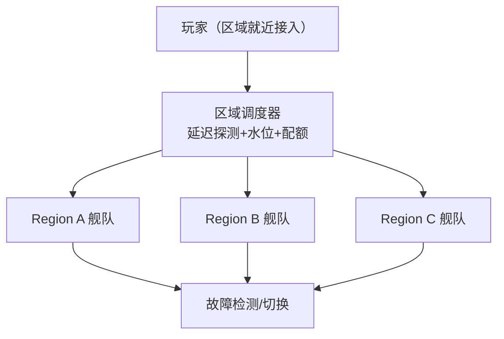
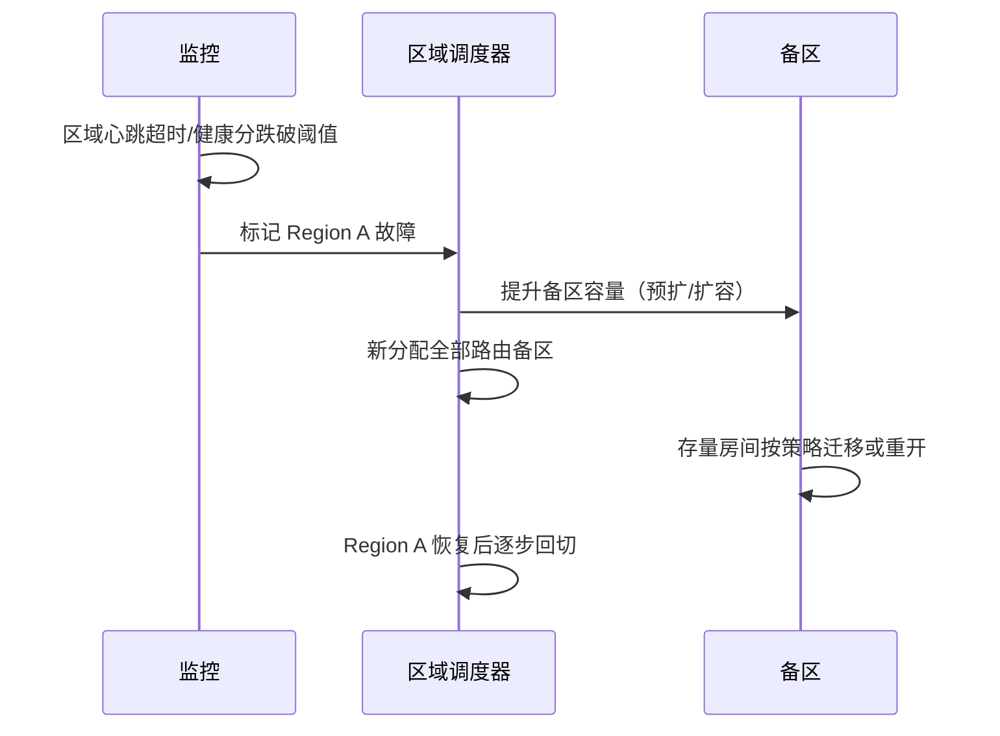

# DS 多区部署与容灾

> 知识基线：平台方案层（非 UE 内置能力）。本文覆盖 DS 集群的多区域部署（区域调度/亲和就近/区域水位）、跨区容灾（区域故障切换、GameLift 多舰队队列、Agones 多集群）与区域预留配额；与[05-DS自动扩缩容与容量规划.md](05-DS自动扩缩容与容量规划.md)（单区容量）和[游戏服务端/04-平台与可靠性/01-鉴权限流幂等灾备与可观测性.md](../04-平台与可靠性/01-鉴权限流幂等灾备与可观测性.md)（通用灾备）分层。
> 版本基线：UE5.8.0 / CL55116800 / ++UE5+Release-5.8；平台 API 以供应商官方文档为准。
> 适用范围：全球化/多区域运营的游戏平台团队；需要处理区域调度、故障切换、区域配额与合规的团队。
> 事实边界：GameLift/Agones 的区域与容灾 API 以其官方文档为准，本文为方案设计；区域列表、配额数字与延迟数据必须由项目实测。
> 最后更新：2026-08-07。
> 权威来源：[Amazon GameLift 多区域部署](https://docs.aws.amazon.com/gamelift/latest/developerguide/gamelift-intro.html)、[Agones 多集群](https://agones.dev/site/docs/installation/)、[AWS 全球基础设施](https://aws.amazon.com/about-aws/global-infrastructure/)。

> 单区扩容解决"人多不够用"，多区部署解决"玩家在哪、区挂了怎么办"。本文讲三件事：**把玩家分到最近的区（区域调度）、把区之间的容量协调起来（区域水位与配额）、以及区故障时怎么切换（容灾）**。

---

## 1. 多区架构

### 1.1 区域实体

| 实体 | 说明 |
| --- | --- |
| Region（区域） | 云厂商地理区域（如 ap-east-1、us-west-2） |
| Zone（可用区） | 区域内独立故障域（AZ） |
| Fleet/Cluster（舰队/集群） | 一个区域的 DS 资源池 |
| 区域调度器 | 决定玩家进哪个区/舰队的服务 |
| 全局控制面 | 跨区配置、版本、观测的集中面 |



*图释：多区架构——调度器按延迟/水位/配额把玩家分到最近区域，故障时跨区切换。*

### 1.2 与单区扩容的关系

- 单区扩容（05 篇）解决"区内容量不够"；
- 多区部署解决"玩家分布不均/区域故障"；
- 两者叠加：每个区域独立跑自己的扩缩容，全局调度器做区域间协调。

---

## 2. 区域调度

### 2.1 调度目标

1. **就近**：玩家连最近的区（延迟低，体验好）；
2. **均衡**：区域容量水位均衡，避免某区挤爆、他区闲置；
3. **合规**：数据驻留要求（某些地区数据不能出境）；
4. **成本**：区域价格差异（可选目标）。

### 2.2 调度算法

```text
// 伪代码：区域选择（节选/示意）
function select_region(player, latency_table, region_state):
    candidates = regions_meet_compliance(player)        // 合规过滤
    scored = []
    for r in candidates:
        latency = latency_table[r][player.region]
        water = region_state[r].ready / region_state[r].capacity
        score = w1 * latency_norm + w2 * water + w3 * cost_norm
        scored.append((score, r))
    return min(scored)                                  // 综合最优
```

- 权重可配：延迟优先（默认）、水位优先（高峰）、成本优先（非敏感区）；
- 兜底：首选区满 → 次近区（"溢出路由"）；
- 延迟表：玩家接入点探测结果定期更新（如每 5min）。

### 2.3 区域水位与配额

| 概念 | 说明 |
| --- | --- |
| 区域水位 | 该区 Ready 实例 / 容量上限 |
| 区域配额 | 每区允许的最大实例数（成本/资源预留） |
| 预留容量 | 为关键区域/活动预留的固定容量 |
| 溢出策略 | 本区满时路由到备选区列表 |

配额是"刹车"：防止调度器把流量全塞进一个区（成本失控/单点风险）。

### 2.4 数据面与对局面分离

跨区容灾的前提是**数据分层**：

| 数据 | 存储位置 | 故障处理 |
| --- | --- | --- |
| 账户/资产/好友 | 全局数据面（跨区） | 区域故障不影响 |
| 对局状态 | 区内存活（DS 内） | 重开/迁移 |
| 匹配/房间元数据 | 全局服务 | 多活部署 |
| 活动/配置 | 全局 + 区域覆盖 | 全局兜底 |

设计约束：

- 玩家重连时，票据校验走**全局**服务（不依赖故障区）；
- 对局结算数据异步同步到全局（防区域故障丢结算）；
- 数据驻留合规区（如欧盟）数据不得流出——该类区域走独立数据面。

---

## 3. 跨区容灾

### 3.1 故障场景

| 故障 | 影响 | 恢复手段 |
| --- | --- | --- |
| 单实例故障 | 一场对局 | 实例重启/房间重开（01 篇 CrashLoop 保护） |
| 节点/可用区故障 | 该 AZ 实例集体失联 | 同区其他 AZ 接管（多 AZ 部署） |
| 区域故障 | 全区不可用 | 跨区切换（玩家重连到备区） |
| 调度器故障 | 新分配停摆 | 调度器多活/降级轮询 |

### 3.2 容灾等级

| 等级 | 描述 | RTO/RPO（示意） | 适用 |
| --- | --- | --- | --- |
| 单区多 AZ | 区内跨可用区冗余 | 分钟级 | 一般游戏 |
| 双区热备 | 备区常驻最小容量 | 分钟~小时级 | 核心运营区 |
| 多区多活 | 多个区域同时服务 | 分钟级（自动切换） | 全球化游戏 |

### 3.3 区域故障切换流程



*图释：区域故障切换——监控标记故障、备区扩容、流量切换、恢复回切。*

### 3.4 GameLift / Agones 的容灾形态

| 平台 | 容灾机制 | 说明 |
| --- | --- | --- |
| GameLift | 多舰队队列（Fleet Queue） | 队列按优先级跨舰队/区域分配，故障自动顺延 |
| Agones | 多集群 + 外部调度 | 调度器感知多集群健康，故障切集群 |
| 自建 K8s | 多集群 Federation/自研 | 全局调度器 + 集群健康探针 |

### 3.5 区域健康分模型

故障检测不能只看"心跳有/无"，用**健康分**综合评估：

```text
健康分 = w1·心跳存活 + w2·分配成功率 + w3·实例 Ready 率
        + w4·平均连接延迟 + w5·错误率
```

| 健康分区间 | 动作 |
| --- | --- |
| ≥ 0.8 | 正常服务 |
| 0.5~0.8 | 降级：减少新分配比例，观察 |
| < 0.5 | 故障：切换流量到备区 |

要点：

- 健康分**平滑**（滑动窗口），防单次抖动误切；
- 连续 N 个周期低于阈值才切换（防抖）；
- 恢复判定需连续 N 个周期高于阈值（防回切震荡）。

---

## 4. 存量对局的处理

故障切换时**存量对局**是最大难点：

| 方案 | 做法 | 适用 |
| --- | --- | --- |
| 房间重开 | 失败房间自动重开新实例，玩家重连 | 对局制游戏（MOBA/FPS） |
| 实例迁移 | 状态迁移到备区实例（成本高） | 持久世界（罕见） |
| 等待恢复 | 短时故障等待实例自愈 | 网络抖动类故障 |

关键：**断线重连机制**（[03-DS会话注册与重连实现.md](<03-DS会话注册与重连实现.md>)）是容灾的玩家侧地基——玩家重连到新实例的票据/会话必须跨区可用（票据服务全局）。

---

## 5. 多区版本与配置

- **版本同步**：所有区域跑同一发布版本（或按区域灰度，见 01 篇发布流程）；
- **配置分发**：区域差异配置（配额/阈值）独立，公共配置全局；
- **数据一致性**：玩家数据按区域分片，跨区切换时读全局数据面（账户/资产）——区域故障只影响对局，不影响账户；
- **兼容矩阵**：DS 与客户端版本匹配策略全局一致（01 篇兼容矩阵）。

---

## 6. 验证与基准

| 验证项 | 验证方法 |
| --- | --- |
| 调度正确性 | 模拟多区玩家分布，断言按延迟/水位/配额路由 |
| 溢出路由 | 首选区打满，断言流量溢出到备选区 |
| 故障切换 | 演练"杀区"（停掉某区实例），断言新分配切备区、存量玩家重连成功 |
| 恢复回切 | 演练区域恢复后流量回切且无双重分配 |
| 跨区重连 | 模拟玩家在备区用原票据重连成功 |
| 观测指标 | 区域健康分/延迟表/水位/切换次数/重连成功率 |

---

## 7. 最佳实践

1. **多 AZ 先行**：先保证单区多 AZ 冗余，再谈跨区（跨区成本高、复杂度高）。
2. **延迟表驱动就近**：定期探测更新，别用静态配置。
3. **配额与水位双控**：配额防成本失控，水位防分配失败。
4. **溢出路由带优先级**：备选区列表有序，别随机。
5. **故障切换要演练**：定期"杀区演练"，验证全链路（调度/扩容/重连）。
6. **票据/会话全局化**：重连票据不绑死单区，否则切换后玩家无法重连。
7. **数据面与对局面分离**：账户/资产全局可用，对局随区。
8. **回切防抖**：区域恢复后逐步回切（先小流量验证），防"刚恢复又挂"。
9. **合规优先**：数据驻留要求先于成本/延迟决策。
10. **与扩缩容联动**：备区容量按"最大区域故障"场景预留（容灾容量 = 最大单区容量）。

---

## 8. 常见问题 FAQ

1. **Q：多区部署必须吗？** A：单区+多 AZ 满足大部分国内运营；全球化/跨洋玩家才需要多区。
2. **Q：区域故障时玩家会怎样？** A：新匹配路由备区；存量对局按策略重开/迁移，玩家凭全局票据重连。
3. **Q：GameLift Fleet Queue 够用吗？** A：对多数场景够（自动跨舰队分配）；复杂路由策略需自研调度器。
4. **Q：备区容量预留多少？** A：容灾容量 ≈ 最大单区峰值容量（或按业务容忍度降级），需成本权衡。
5. **Q：延迟表多久更新？** A：分钟级探测 + 小时级重算；大版本/网络事件后强制刷新。
6. **Q：数据驻留怎么办？** A：合规过滤先行——不满足驻留要求的区域从候选列表剔除。
7. **Q：跨区重连延迟高？** A：备区通常选相邻区域；玩家体验以"能继续玩"优先于延迟最优。
8. **Q：调度器本身挂了？** A：调度器多活（主备/多副本）+ 降级策略（轮询最近区）。
9. **Q：区域版本不一致？** A：公共版本全局一致；区域差异只允许在配置层（配额/阈值）。
10. **Q：怎么证明容灾有效？** A：定期演练 + 指标（切换 RTO、重连成功率、数据丢失率）+ 复盘报告。

---

## 9. 关联阅读

- [01-UE Dedicated Server实例生命周期与平台化.md](<01-UE Dedicated Server实例生命周期与平台化.md>) —— 实例状态机、版本兼容与发布回滚（多区发布的基础）；
- [03-DS会话注册与重连实现.md](<03-DS会话注册与重连实现.md>) —— 跨区重连的票据与会话设计；
- [05-DS自动扩缩容与容量规划.md](05-DS自动扩缩容与容量规划.md) —— 单区容量与扩缩容（多区的水位基础）；
- [02-Linux DS部署与容器实战.md](<02-Linux DS部署与容器实战.md>) —— 镜像与部署（多区镜像同步）；
- 平台：[游戏服务端/04-平台与可靠性/01-鉴权限流幂等灾备与可观测性.md](../04-平台与可靠性/01-鉴权限流幂等灾备与可观测性.md) —— 通用灾备/幂等/可观测性；
- 匹配：[游戏服务端/03-业务系统设计/04-匹配与房间系统.md](../03-业务系统设计/04-匹配与房间系统.md) —— 区域路由与匹配衔接。

---

## 更新日志

- 2026-08-07：初稿。补齐"DS 多区部署与容灾"空白（P1）；涵盖多区架构、区域调度（就近/水位/配额/合规）、跨区容灾等级与切换流程、存量对局处理与演练验证；平台方案层，供应商 API 以官方文档为准。

## 落地检查清单

### 常见反模式

1. **多区但无调度策略**：玩家随机落到远区，延迟体验差。
2. **容灾只做"切换"不做"排空"**：直接切流量，存量对局全部中断。
3. **跨区组队无边界**：队伍跨区后实例归属混乱，重连票据失效处理缺失。
4. **区域配额形同虚设**：扩容越过配额，成本失控或合规违规。
5. **灾备演练只在文档里**：从未执行 Game Day，切换流程不可用。
6. **与数据灾备混为一谈**：DS 舰队容灾与平台数据灾备（04-01）职责不清。

### 补充：区域切换流程示意

```text
区域故障检测（水位/延迟/健康探针）
  -> 新分配停止（Ready 摘除）
  -> 存量对局排空或迁移
  -> 相邻区域灰度回流量
  -> 观测 CCU 分布与延迟分布
  -> 复盘并更新预案
```

该流程是方案示意，切换触发条件与回流量按项目策略设定。

- [ ] 区域拓扑已定义：Region/AZ/节点/舰队/集群的概念与责任边界。
- [ ] 区域调度策略明确：就近优先、亲和绑定、区域水位、配额硬约束。
- [ ] 跨区组队与就近接入冲突有决策规则（延迟 vs 社交关系取舍）。
- [ ] 容灾等级与 RTO/RPO 目标已定义，故障切换流程有文档。
- [ ] 切换流程遵循"先摘流量→排空→灰度回流量"，不直接切断存量对局。
- [ ] 重连票据跨区语义明确：实例换代/区域迁移后票据失效（联动 03 篇）。
- [ ] GameLift 多舰队队列 / Agones 多集群为适配示意，供应商行为以官方文档为准。
- [ ] 区域发布分批灰度：区域水位、CCU 分布与延迟分布双观测。
- [ ] 容灾演练覆盖：区域故障、网络分区、数据层不可用三类场景，有判定标准。
- [ ] 与平台数据级灾备分层（04-01）边界清晰，不重复不冲突。

### 术语速查

| 术语 | 英文 | 一句话解释 |
| --- | --- | --- |
| 区域 | Region | 地理隔离的部署单元 |
| 可用区 | Availability Zone | 区域内独立故障域 |
| 就近调度 | Latency-based Routing | 按玩家延迟就近分配 |
| 亲和绑定 | Affinity | 队伍/会话绑定到同一实例或区域 |
| 容灾等级 | DR Tier | 按 RTO/RPO 划分的恢复级别 |
| 摘流量 | Drain Traffic | 停止新分配并排空存量 |
| 多集群 | Multi-cluster | 跨集群冗余与切换 |
| 演练 | Game Day / Drill | 故障模拟与恢复验证 |
