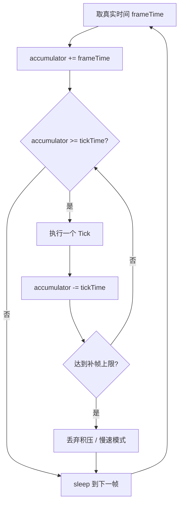

# 01-ServerMainLoop与TickScheduler

> 知识基线：实时服务器固定步长主循环、accumulator 模式、时间预算；UE 对照以本机 UE5.8 源码为准（`Misc/App.h`、`Engine/Classes/Engine/NetDriver.h`、`Engine/Public/TickTaskManagerInterface.h`）。
> 版本基准：UE5.8；`UNetDriver::NetServerMaxTickRate` 自 5.3 起推荐使用 `GetNetServerMaxTickRate/SetNetServerMaxTickRate`。
> 适用范围：MMO/实时游戏服务器（C++ 或脚本语言实现均可套用）；UE Dedicated Server 参见 [05-UE Dedicated Server平台化](<../05-UE Dedicated Server平台化/README.md>)。
> 官方参考：[UE5.8 官方文档](https://dev.epicgames.com/documentation/en-us/unreal-engine)、[cppreference - std::chrono](https://en.cppreference.com/w/cpp/chrono)。
> 最后更新：2026-08-12（首版，含本机模拟）。
> 知识成熟度：L4（模型实验 + 原始结果，见 [evidence/server/tick-scheduler](../../evidence/server/tick-scheduler/README.md)）。

## 1. 概述

游戏服务器与 Web 后端最本质的区别：**服务器在"跑一个世界"，世界按固定节奏推进（Tick），一切逻辑、网络、AI 都以 Tick 为时间单位**。主循环与 Tick 调度是 Runtime 层的地基——它决定：

- 世界时间是否稳定（帧率抖动 → 游戏时间漂移）；
- 过载时系统如何表现（补帧/丢帧/降级）；
- 逻辑是否可预测、可回放（确定性）。

本文回答：

1. 固定步长（fixed timestep）与可变步长（variable timestep）的区别与选择；
2. accumulator 模式怎么写，过载时 catch-up 与 drop 两种策略的取舍；
3. Tick 预算怎么分（逻辑/AI/寻路/网络/物理），P95/P99 为什么比平均重要；
4. UE5.8 里固定帧率、`NetServerMaxTickRate`、TickTaskManager 对应哪些源码入口。

## 2. 核心概念

| 术语 | 中文 | 一句话定义 |
| --- | --- | --- |
| Tick | 逻辑帧 | 世界推进的最小时间单位（MMO 常见 20~60Hz） |
| Fixed timestep | 固定步长 | 每次 Tick 推进固定时间（如 16.67ms），与真实帧率解耦 |
| Variable timestep | 可变步长 | 每帧按真实流逝时间推进（`dt` 变化） |
| Tick drift | 步长漂移 | 帧率波动导致世界时间与真实时间偏差累积 |
| Accumulator | 时间累加器 | 累积真实流逝时间，攒够一个 Tick 就执行一个 |
| Catch-up | 补帧 | 积压时连续执行多个 Tick 追上世界时间 |
| Drop | 丢帧 | 积压超过上限时丢弃剩余时间（世界时间变慢） |
| Time budget | 时间预算 | 每个系统每 Tick 允许消耗的 CPU 时间上限 |
| Determinism | 确定性 | 相同输入与 Tick 序列产生相同结果（回放/压测的前提） |

## 3. 原理详解

### 3.1 主循环结构

```text
while (running) {
    frameTime = 取真实流逝时间（monotonic clock）;
    accumulator += frameTime;

    while (accumulator >= tickTime && 未达到补帧上限) {
        执行一个 Tick：输入 → 逻辑 → AI → 寻路 → 网络发送;
        accumulator -= tickTime;
        tickCount++;
    }
    if (accumulator >= tickTime) {
        丢弃积压（或进入慢速模式）;      // 过载处理
    }
    // 空闲时 sleep 到下一帧
}
```



要点：

- **取时间必须用单调时钟**（`std::chrono::steady_clock`），不能用墙上时钟（会因校时回拨）。
- accumulator 让"帧率波动"不直接传导为"逻辑步长波动"：世界始终按固定 `tickTime` 推进，只是执行时机密集/稀疏。

### 3.2 固定步长 vs 可变步长

| 维度 | 固定步长（服务器推荐） | 可变步长 |
| --- | --- | --- |
| 世界时间 | 稳定：Tick 数 × tickTime | 随帧率漂移 |
| 确定性 | 好：回放/压测可复现 | 差：相同输入不同帧率不同结果 |
| 物理/网络 | 积分稳定、发包节奏可控 | 需要补偿、发包节奏抖动 |
| 过载表现 | 补帧/丢帧策略明确 | 世界直接变慢 |
| 适用 | MMO 服务器、权威模拟、回放 | 单机表现层、非权威客户端 |

服务器几乎总是固定步长；客户端表现层可以可变步长（配合插值）。UE DS 上对应 `bUseFixedFrameRate`/`FApp::SetFixedDeltaTime` 与 `NetServerMaxTickRate`。

### 3.3 过载策略：catch-up vs drop

| 策略 | 行为 | 优点 | 缺点 |
| --- | --- | --- | --- |
| Catch-up（限上限） | 积压时连跑多个 Tick，最多 N 个 | 世界时间不落后；Tick 总数稳定 | 单帧突发（多个 Tick 串行），网络批量变大 |
| Drop | 每帧最多 1 个 Tick，积压直接清 | 帧节奏稳定；延迟可控 | 世界时间变慢（Tick 减少），回放/结算偏差 |
| 慢速模式 | 检测持续过载后主动降 TickRate | 优雅降级 | 需要业务配合（同步、结算） |

工程实践：

- **默认 catch-up + 上限 3~5**：短尖峰自愈，长过载不雪崩；
- **监控 drops/catchUps 计数**：连续 drop 意味着容量不足，触发降级（关特效逻辑、降低 AI 频率、削减 AOI 半径）；
- **不要无限补帧**：积压无限时补帧会让单帧执行几十个 Tick，网络与 GC 全崩。

### 3.4 时间预算：P95/P99 与分配

单 Tick 预算示例（60Hz，16667us）：

| 系统 | 预算 | 说明 |
| --- | ---: | --- |
| 玩法逻辑 | 4000us | 实体行为、技能、状态机 |
| AI 决策 | 3000us | 决策频率低于 Tick 频率（分帧） |
| 寻路 | 2000us | 时间片制，超时返回部分路径 |
| 网络发送 | 4000us | 批量打包、AOI 更新、限流 |
| 物理/其他 | 2000us | 按需 |
| 预留 | 1667us | 尖峰余量（10%） |

**看 P95/P99 而非平均**：平均 8ms 的 Tick 可能 1% 时间冲到 20ms——一次 GC、一次分配尖峰就让玩家瞬移。预算表按 P99 签，超了就砍对应系统（AI 降频、AOI 限流）。

### 3.5 UE5.8 对照（本机源码）

- **固定帧率开关**：`FApp::UseFixedDeltaTime()/SetFixedDeltaTime()`（`Engine\Source\Runtime\Core\Public\Misc\App.h` 第 662/664 行附近）；`FApp::GetFixedDeltaTime()` 返回固定步长。
- **DS 网络 Tick 上限**：`UNetDriver::NetServerMaxTickRate`（`Engine\Source\Runtime\Engine\Classes\Engine\NetDriver.h` 第 877 行附近；5.3 起弃用直接访问，用 `GetNetServerMaxTickRate/SetNetServerMaxTickRate`）——限制服务器每帧最大网络 Tick 数，是"世界 Tick 与网络发送解耦"的 UE 实现。
- **Tick 任务调度**：`FTickTaskManager`（`Engine\Source\Runtime\Engine\Public\TickTaskManagerInterface.h`）——按优先级/依赖组织 Actor 与组件的 Tick，支持"先于/后于"依赖与合并 Tick（`bTickBeforePhysics` 等），避免手写顺序。
- **Timer**：UE 的 `FTimerManager` 基于 World Tick 推进；自定义服务器 Timer 轮见 `02-Timer时间轮与延迟任务`（规划）。

### 3.6 确定性：随机、时钟与遍历顺序注入

固定步长只是确定性的第一步；要做到"相同输入 + 相同 Tick 序列 → 相同结果"，还必须控制三个来源：

1. **随机数**：每个 Tick 用 `seed + tickIndex` 推导的确定性随机源（如 `TArray` 分片 + 混合法），禁止全局 `rand()`；
2. **时钟**：逻辑代码禁止直接读墙上/单调时钟，统一走"世界时间 = tickIndex × tickTime"（[12-世界时间确定性与GameClock](12-世界时间确定性与GameClock.md)）；只有表现层可以读真实时钟；
3. **遍历顺序**：容器遍历、哈希表枚举、多线程完成顺序都不能影响结果——需要排序或按实体 ID 汇总后再结算。

工程形态：

```cpp
struct TickContext {
    uint64 tickIndex;          // 世界时间 = tickIndex * tickTime
    uint64 worldSeed;          // 随机源种子（按 tickIndex 派生）
    double  tickTime;          // 固定步长
};
// 所有系统只消费 TickContext，不读系统时钟、不用全局随机
```

确定性带来的能力：回放（录 Tick 输入流）、压测复现（同一负载脚本同结果）、跨服一致性（分线/跨服迁移可对齐）。

### 3.7 与 Runtime 其他模块的接口

主循环是"发号施令者"，各系统以 Tick 为节拍对接：

| 模块 | 对接方式 | 关联文档 |
| --- | --- | --- |
| Timer | 注册回调，按 tickIndex 到期触发 | `02-Timer时间轮与延迟任务`（规划） |
| Entity 生命周期 | Spawn/Despawn 队列在 Tick 边界处理 | [03-Entity生命周期与组件模型](03-Entity生命周期与组件模型.md)（已落地） |
| Scene/Zone | 每 Tick 处理进出场景、加载卸载 | [04-Scene-Map-Zone与实例管理](04-Scene-Map-Zone与实例管理.md)（已落地） |
| AOI | 移动收集 → Tick 内计算 Interest → 批量发送 | [05-AOI与InterestManagement](05-AOI与InterestManagement.md)（已落地） |
| AI/寻路 | 分帧预算片，多 Tick 摊薄 | [11-AI与寻路时间预算](11-AI与寻路时间预算.md)（已落地） |
| 网络 | 每帧窗口批量发送，与 Tick 解耦 | [05-UE Dedicated Server平台化](<../05-UE Dedicated Server平台化/README.md>) |

原则：**任何系统都不允许自己创建时间循环**；统一由调度器按 Tick 分片执行，否则预算与确定性都会失控。

## 4. 示例：本机模拟

模拟器 `evidence/server/tick-scheduler/src/tick_scheduler.cpp`：固定 60Hz accumulator 主循环，实体成本 = 实体数 × 0.5us（±30% 抖动），6000 帧；比较 100/1000/10000 实体与过载 1.3/1.5 下 catch-up 与 drop。

### 4.1 参数敏感性

- 抖动 0→±30%：P99/P50 从 1.0 升到 1.29——预算表要按"带抖动的 P99"签；
- 补帧上限 3→10：过载 1.3 时 catch-up 帧更长（单帧最多执行 10 个 Tick），网络突发更严重——上限要配合网络批量窗口；
- 单位成本 0.5→1.0us/实体：10000 实体单 Tick 从 5ms 升到 10ms（占预算 60%），先触发降级阈值——容量设计要留 30% 以上余量。

## 5. 实验结果与结论

环境：Windows x64，MSVC 14.44.35207，`/O2 /std:c++17`，2026-08-12。完整输出见 [evidence/server/tick-scheduler/README.md](../../evidence/server/tick-scheduler/README.md)。

| 场景 | ticks | P50 | P95 | P99 | drops | catch |
| --- | ---: | ---: | ---: | ---: | ---: | ---: |
| 100 实体，负载 1.0 | 6000 | 50us | 64us | 65us | 0 | 0 |
| 1000 实体，负载 1.0 | 6000 | 501us | 636us | 647us | 0 | 0 |
| 10000 实体，负载 1.0 | 6000 | 5012us | 6355us | 6470us | 0 | 0 |
| 10000，负载 1.3，catch-up | 7800 | 5006us | 6362us | 6473us | 0 | 1800 |
| 10000，负载 1.3，drop | 6000 | 5012us | 6355us | 6470us | 1500 | 0 |
| 20000，负载 1.5，catch-up | 9000 | 10004us | 12718us | 12943us | 0 | 3000 |
| 20000，负载 1.5，drop | 6000 | 10025us | 12710us | 12941us | 3000 | 0 |

结论：

1. **Tick 成本随实体数线性放大**（50→501→5012us）；10000 实体单 Tick 已占 60Hz 预算 30%，P99 由抖动决定（±30% → P99≈1.29×P50）。
2. **catch-up 保持 Tick 总数**（过载 1.3 时仍执行 7800 个 Tick = 130% 世界时间），代价是 1800 帧出现补帧突发；drop 保持帧节奏（6000 Tick）但世界时间慢 30%，1500 次清积压。
3. **策略选择 = 一致性 vs 节奏**：需要权威结算/回放选 catch-up（限上限），需要延迟稳定选 drop；两者都要监控并联动降级。
4. **预算必须按 P99 签**：同样"平均 5ms"的负载，P99 6.5ms 与 P99 12.9ms 的系统容量完全不同。

### 5.1 结论的工程化

把模拟结论翻译成生产规则：

1. **容量红线 = 预算 × 70%**：P99 超过预算 70% 就进入"黄区"（AI 降频），超过 90% 进"红区"（AOI 限流 + 战斗降级）；
2. **drops 每 10 分钟 > 0 即告警**：drop 是"世界时间落后"的直接信号，比 CPU 使用率更贴近玩家体验；
3. **catch-up 上限与网络窗口联动**：补帧上限 × 每 Tick 变更量 = 单帧网络突发上限，超过就降上限。

## 6. 最佳实践

1. **服务器用固定步长 + 单调时钟**：Tick 数与 tickTime 是世界的唯一时间真相。
2. **accumulator + catch-up 上限（3~5）**：短尖峰自愈，长过载转降级；`drop` 计数是容量告警的先行指标。
3. **预算表按 P99 分配**（逻辑/AI/寻路/网络/物理 + 10% 预留），每个系统超预算有降级动作（AI 降频、AOI 限流、寻路时间片）。
4. **Tick 与网络解耦**：世界 60Hz 不等于网络 60Hz；发包按批量/合并窗口（UE `NetServerMaxTickRate`）。
5. **确定性优先**：随机数/时钟/遍历顺序全部注入；为回放与压测保留 Tick 序日志。
6. **监控三件套**：Tick 耗时分布（P50/P95/P99）、drops/catchUps 计数、队列积压长度——三者联动才能判断"是尖峰还是容量问题"。
7. **UE DS**：`FApp::SetFixedDeltaTime` + `NetServerMaxTickRate` + `FTickTaskManager` 优先级；不要在 Tick 里做阻塞 IO。
8. **确定性注入**：随机/时钟/遍历顺序全部可控（见 3.6），回放与压测才能复现；破坏确定性的代码（全局随机、读时钟）进 code review 红线。
9. **降级预案写进调度器**：连续 drop 或 Tick P99 超阈值时自动触发（AI 降频 → AOI 限流 → 战斗降级），而不是业务代码里手动关功能。
10. **Tick 内禁止阻塞**：IO、锁等待、日志落盘全部移出主循环；需要异步的结果用"请求-回调-下 Tick 消费"模式。

## 7. FAQ

**Q1：为什么不用墙上时钟（wall clock）驱动 Tick？**
系统校时（NTP/手动改时间）会让 `dt` 出现负值或跳变；必须用单调时钟（`steady_clock`）测流逝时间。

**Q2：catch-up 补帧会不会把网络发送也补爆？**
会。所以网络发送要独立预算与批量窗口（合并多个 Tick 的变更一次发送），或补帧时网络降频（隔 Tick 发）。

**Q3：drops 计数涨了说明什么？**
说明"攒够一个 Tick 的真实时间"不足——要么负载超容量，要么某 Tick 卡顿；连续 drop 是容量告警，触发降级而不是硬扛。

**Q4：可变步长在服务器上一无是处吗？**
权威模拟基本不用；但它对"挂机观察/非权威镜像"有意义。混合方案：世界固定步长 + 表现层可变步长插值。

**Q5：UE DS 上 `NetServerMaxTickRate` 和固定帧率什么关系？**
固定帧率控制世界 Tick（`FApp`），`NetServerMaxTickRate` 控制网络 Tick 上限（`UNetDriver`）；两者解耦：世界可以 60Hz，网络合并到 30Hz。

**Q6：模拟器结果能直接当容量结论吗？**
不能。模型假设成本线性（未含分配/GC/网络/物理），真实容量必须用机器人压测校准（见 [游戏测试与质量](../../游戏测试与质量/README.md) 的 03/07 篇）；模拟的价值是验证调度策略与预算结构的定性行为。

**Q7：时间预算表谁负责执行？**
运行时调度器（每个系统按预算片执行，超时记录）与构建期约束（禁止热路径分配/阻塞 IO）双管齐下；纯靠自觉的预算表会漂移。

**Q8：固定步长下客户端表现怎么跟服务器对齐？**
客户端用插值（interpolation）与预测（prediction）消费服务器状态，自身表现帧率可变；服务器只发权威状态与 Tick 序号，客户端按序号插值——这就是"世界固定步长 + 表现可变步长"的混合模型。

**Q9：为什么补帧突发会伤害网络？**
一个帧里连续执行多个 Tick 会产生多份状态变更，若逐 Tick 发送，带宽与包率瞬时翻倍；网络发送必须按"帧窗口合并 + 限流"处理（UE `NetServerMaxTickRate` 正是这个角色）。

**Q10：世界时间慢了会怎样影响玩法？**
drop 策略下世界时间落后真实时间：活动倒计时、跨服同步、战斗结算都依赖同一时间真相，任何系统单独用真实时钟都会错位——所以权威时间必须只有一份（GameClock），且过载时明确"世界减速"的语义。

**Q11：为什么"每帧一个 Tick"还不够，要 accumulator？**
帧间隔本身有抖动（OS 调度、GC、IO 唤醒），直接"每帧一个 Tick"会把抖动变成世界时间漂移；accumulator 把"流逝时间"累积到整数个 Tick 再执行，世界时间只取决于 Tick 数，与帧间隔抖动解耦。

**Q12：服务器 Tick 频率怎么定？**
下限由玩法粒度决定（技能判定、移动碰撞、结算精度），上限由预算决定。常见：MMO 20~30Hz，MOBA/FPS 权威服 30~60Hz；再高收益递减（网络也发不了那么快）。Tick 频率变更会改变一切确定性基线，上线后不要随意调。

**Q13：模拟器里 drop 的"1500 次"为什么是整数？**
因为过载是确定性的（负载系数 1.3 → 每 10 帧多 3 帧积压），6000 帧中恰有 1500 帧出现积压清空。真实服务器负载是随机的，drops 会是分布而非整数——模拟的确定性反而方便验证策略逻辑。

## 8. 验证与基准

- 本机模拟：`powershell -NoProfile -ExecutionPolicy Bypass -File evidence/server/tick-scheduler/scripts/build_run.ps1`，原始输出 `results/tick_scheduler_win_x64_msvc.txt`。
- 真实容量：接 [游戏测试与质量](../../游戏测试与质量/README.md) 的机器人压测方法论（阶梯加压、拐点、P99），对实体数/行为混合做校准。
- UE 验证入口：本机 `Engine\Source\Runtime\Core\Public\Misc\App.h`（`UseFixedDeltaTime`）、`Engine\Source\Runtime\Engine\Classes\Engine\NetDriver.h`（`NetServerMaxTickRate`）、`Engine\Source\Runtime\Engine\Public\TickTaskManagerInterface.h`。
- 升级 L5：把本模拟替换为真实项目 Tick 数据（工作日志记录 P50/P95/P99 与降级事件）。

验收清单（进入生产前）：

- [ ] Tick 耗时 P99 低于预算表，且 10 分钟长稳无连续 drop；
- [ ] drops/catchUps 计数有告警与自动降级动作；
- [ ] 随机/时钟/遍历顺序已注入，同一负载脚本两次压测结果一致；
- [ ] 网络发送与 Tick 解耦（批量窗口 + 限流）；
- [ ] 主循环内无阻塞 IO / 锁等待 / 热路径分配。

监控命令（示意，按实际平台实现）：

```text
tick_p99_us          # 每 10s 聚合一次，> 预算×0.9 告警
drop_count           # 累计丢帧，每 10 分钟 > 0 告警
catchup_frames       # 补帧帧数，观察突发窗口
queue_backlog        # 输入/网络队列积压，> 阈值告警
```

> 本文档 L4 证据为模型模拟；真实项目 Tick 数据与降级事件（工作日志）是升级 L5 的验收项。

### 8.1 调度策略快速决策

```text
单 Tick 成本 P99 超预算？
├─ 偶发尖峰（<1% 帧）→ catch-up 上限 3~5，观察自愈
├─ 持续超预算（drops 增长）→ 触发降级：AI 降频 → AOI 限流 → 战斗降级
├─ 玩法需要确定性/回放 → 优先 catch-up（限上限），禁止无限补帧
├─ 玩法需要延迟稳定 → 优先 drop + 世界减速语义（GameClock 同步）
└─ 扩容优先于降级：预算 P99 > 70% 时先加机器/分线，降级是兜底
```

## 9. 关联阅读

- [11-AI与寻路时间预算](11-AI与寻路时间预算.md)（已落地）：AI Tick 分帧与预算片。
- `02-Timer时间轮与延迟任务`（规划）：Timer 如何接入 Tick。
- [12-世界时间确定性与GameClock](12-世界时间确定性与GameClock.md)（已落地）：wall/monotonic/game time 的边界。
- [游戏服务端 README](../README.md)：领域导航。
- [游戏测试与质量](../../游戏测试与质量/README.md)：机器人压测与容量评估。
- [06-世界模拟与运行时 README](README.md)：本分类导航与规划。
- [03-Entity生命周期与组件模型](03-Entity生命周期与组件模型.md)（已落地）：Tick 内实体增删的边界。
