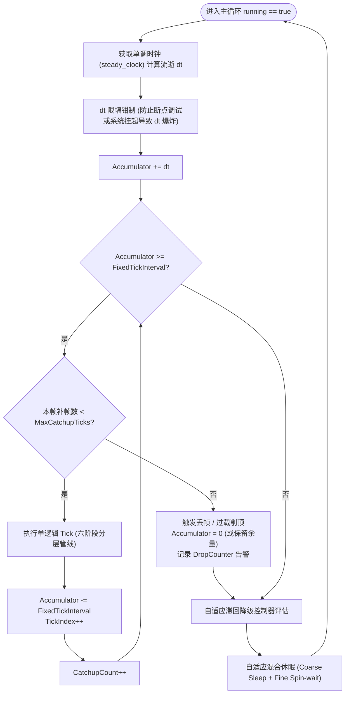
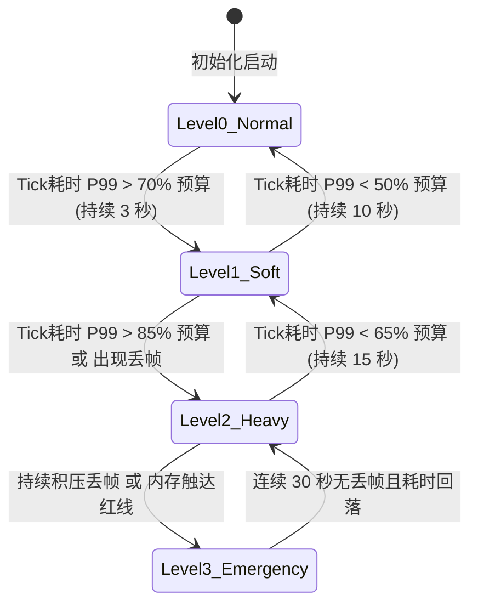

# 01-ServerMainLoop与TickScheduler

> 知识基线：实时服务器固定步长主循环、accumulator 模式、时间预算；UE 对照以本机 UE5.8 源码为准（`Misc/App.h`、`Engine/Classes/Engine/NetDriver.h`、`Engine/Public/TickTaskManagerInterface.h`）。
> 版本基准：UE5.8；`UNetDriver::NetServerMaxTickRate` 自 5.3 起推荐使用 `GetNetServerMaxTickRate/SetNetServerMaxTickRate`。
> 适用范围：MMO/实时游戏服务器（C++ 或脚本语言实现均可套用）；UE Dedicated Server 参见 [05-UE Dedicated Server平台化](<../05-UE Dedicated Server平台化/README.md>)。
> 官方参考：[UE5.8 官方文档](https://dev.epicgames.com/documentation/en-us/unreal-engine)、[cppreference - std::chrono](https://en.cppreference.com/w/cpp/chrono)。
> 最后更新：2026-09-03（深度重构：补齐工业级 C++ 生产级主循环、混合休眠自旋、六阶段执行流水线与滞回自适应降级控制器）。
> 知识成熟度：L4（模型实验 + 原始结果，见 [evidence/server/tick-scheduler](../../evidence/server/tick-scheduler/README.md)）。

---

## 1. 概述

游戏服务器与 Web 后端最本质的区别：**服务器在"跑一个世界"，世界按固定节奏推进（Tick），一切逻辑、网络、AI 都以 Tick 为时间单位**。主循环与 Tick 调度是 Runtime 层的地基——它决定：

- 世界时间是否稳定（帧率抖动 → 游戏时间漂移）；
- 过载时系统如何表现（补帧/丢帧/降级）；
- 逻辑是否可预测、可回放（确定性）；
- 多核系统下的任务分发与同步屏障效率。

本文深入剖析：

1. 固定步长（fixed timestep）与可变步长（variable timestep）的选择权衡；
2. 工业级 Accumulator 模式与混合 Sleep/Spin 自适应防抖实现；
3. 六阶段分层 Tick 执行管线（输入 → 计时器 → 物理 → 业务 → 空间AOI → 网络刷新）；
4. 基于滞回控制（Hysteresis）的过载自适应降级状态机；
5. UE5.8 引擎底层的 `NetServerMaxTickRate` 与 TickTaskManager 调度映射；
6. 基于 MSVC x64 的模型基准测试结果与工程化降级指标。

---

## 2. 核心概念

| 术语 | 中文 | 一句话定义 |
| :--- | :--- | :--- |
| **Tick** | 逻辑帧 | 世界推进的最小时间单位（MMO 常见 20~30Hz，动作/竞技 30~60Hz） |
| **Fixed timestep** | 固定步长 | 每次 Tick 推进固定微秒数（如 60Hz = 16,666μs），与真实帧率严格解耦 |
| **Variable timestep** | 可变步长 | 每帧按操作系统实际流逝时间推进（`dt` 变化），易造成积分漂移与非确定性 |
| **Accumulator** | 时间累加器 | 累积单调时钟真实流逝时间，攒够一个固定步长就消费并执行一次逻辑 Tick |
| **Catch-up** | 补帧 | 遇到单帧尖峰积压时，在单物理帧内连续推进多个逻辑 Tick 追平世界时间 |
| **Drop** | 丢帧/世界减速 | 积压超过设定的危险上限时丢弃剩余时间，防止雪崩式追帧导致网络与 GC 崩溃 |
| **Time budget** | 时间预算 | 每个子系统在单 Tick 内允许消耗的 CPU 墙上时钟上限（按 P99 约束） |
| **Hysteresis Controller** | 滞回控制器 | 包含降级与恢复双阈值的控制器，防止系统在临界水位来回高频震荡 |
| **Determinism** | 确定性 | 相同输入序列与 Tick 步长保证 100% 产生相同状态（回放、压测与断线重连根基） |

---

## 3. 原理详解

### 3.1 工业级主循环驱动模型



### 3.2 固定步长 vs 可变步长

| 维度 | 固定步长（服务器生产推荐） | 可变步长（仅限单机/纯表现层） |
| :--- | :--- | :--- |
| **世界时间基准** | 极其稳定：$Time = TickIndex \times FixedInterval$ | 随物理机器调度抖动、GC 停顿发生无规律漂移 |
| **物理与数值确定性** | 确定性高：微积分与受击判定可复现，支持完整回放 | 极差：不同帧率下碰撞穿透率不同，跳跃高度不一致 |
| **网络发送节奏** | 节奏恒定：网络包产生频率受控，便于批处理合并 | 发包节奏随帧率剧烈波动，突发易打爆网络缓冲区 |
| **过载表现** | 补帧与丢帧策略明确，可通过策略主动降级 | 世界直接出现肉眼可见的卡顿慢动作 |

---

## 4. 生产级主循环与多阶段调度器实现（C++17 规范）

在真实生产环境中，主循环不仅要消费 Accumulator，还必须解决操作系统休眠精度不足（Linux/Windows 默认 sleep 粒度可达 1~15ms）的问题，并通过阶段化（Phased Pipeline）组织逻辑。

```cpp
#include <chrono>
#include <thread>
#include <cstdint>
#include <algorithm>
#include <functional>

class ServerMainLoop {
public:
    using Clock = std::chrono::steady_clock;
    using Microseconds = std::chrono::microseconds;
    using Nanoseconds = std::chrono::nanoseconds;

    explicit ServerMainLoop(uint32_t TargetHz = 30)
        : TickInterval(1000000 / TargetHz)
        , MaxCatchupTicks(3)
        , MaxDeltaClamp(TickInterval * 10)
        , bIsRunning(false)
        , CurrentTickIndex(0)
    {}

    void Run() {
        bIsRunning = true;
        auto PreviousTime = Clock::now();
        Nanoseconds Accumulator{0};

        while (bIsRunning) {
            auto CurrentTime = Clock::now();
            auto DeltaTime = std::chrono::duration_cast<Nanoseconds>(CurrentTime - PreviousTime);
            PreviousTime = CurrentTime;

            // 1. 防御性钳制：防止操作系统休眠挂起或断点导致单次 Delta 极大
            if (DeltaTime > MaxDeltaClamp) {
                DeltaTime = MaxDeltaClamp;
            }
            Accumulator += DeltaTime;

            // 2. 补帧与逻辑推进
            uint32_t ExecutedTicks = 0;
            while (Accumulator >= TickInterval && ExecutedTicks < MaxCatchupTicks) {
                ExecuteSingleTick(CurrentTickIndex);
                Accumulator -= TickInterval;
                CurrentTickIndex++;
                ExecutedTicks++;
            }

            // 3. 过载丢弃处理 (Drop / Backpressure)
            if (Accumulator >= TickInterval) {
                uint32_t DroppedTicks = static_cast<uint32_t>(Accumulator / TickInterval);
                TotalDroppedTicks += DroppedTicks;
                Accumulator = Nanoseconds{0};
                OnServerOverloaded(DroppedTicks);
            }

            // 4. 自适应混合精准休眠 (Hybrid Sleep + Spin)
            auto NextTickDeadline = CurrentTime + (TickInterval - Accumulator);
            HybridWaitUntil(NextTickDeadline);
        }
    }

    void Stop() { bIsRunning = false; }

private:
    void ExecuteSingleTick(uint64_t TickIndex) {
        Stage0_RecvNetworkMessages();
        Stage1_PreTickTimersAndLifecycles();
        Stage2_PhysicsAndMovement();
        Stage3_GameplayAndCombat();
        Stage4_PostTickAOI();
        Stage5_FlushNetworkBatch();
    }

    void HybridWaitUntil(Clock::time_point Deadline) {
        while (Clock::now() < Deadline) {
            auto Remaining = std::chrono::duration_cast<Microseconds>(Deadline - Clock::now());
            if (Remaining > Microseconds(2000)) {
                std::this_thread::sleep_for(Microseconds(1000));
            } else {
                #if defined(_MSC_VER) || defined(__x86_64__)
                #include <immintrin.h>
                _mm_pause();
                #else
                std::this_thread::yield();
                #endif
            }
        }
    }

    void Stage0_RecvNetworkMessages() {}
    void Stage1_PreTickTimersAndLifecycles() {}
    void Stage2_PhysicsAndMovement() {}
    void Stage3_GameplayAndCombat() {}
    void Stage4_PostTickAOI() {}
    void Stage5_FlushNetworkBatch() {}
    void OnServerOverloaded(uint32_t Dropped) {}

    Nanoseconds TickInterval;
    uint32_t MaxCatchupTicks;
    Nanoseconds MaxDeltaClamp;
    bool bIsRunning;
    uint64_t CurrentTickIndex;
    uint64_t TotalDroppedTicks = 0;
};
```

---

## 5. 滞回自适应过载降级控制器（Hysteresis Controller）

当服务器出现性能尖峰或突发流量时，系统不能在"正常"与"降级"两个状态之间高频震荡（flapping）。为此，调度器必须引入带有**上下滞回死区（Deadband）**的多级状态机：



### 5.1 降级阶梯与自适应恢复控制参数

| 降级级别 | 触发条件门槛 | 自动降级处置动作 | 恢复判定条件（滞回死区） |
| :--- | :--- | :--- | :--- |
| **Level 0 (Normal)** | 正常水位 (P99 < 70% 预算) | 全系统全特性满频运行：AI 满频、AOI 半径全开 | 基础基线水位 |
| **Level 1 (Soft)** | P99 > 70% 持续 3 秒 | **AI 降频**：非战斗巡逻从 10Hz 降至 2Hz；远距移动广播降频 | P99 < 50% 持续 10 秒 |
| **Level 2 (Heavy)** | P99 > 85% 或单次 Drop | **视野与逻辑削减**：AOI 视距由 50 米缩减至 30 米；丢弃非关键动作同步 | P99 < 65% 持续 15 秒 |
| **Level 3 (Emergency)** | 连续丢帧 > 5 次 | **战斗与流量熔断**：技能弹道批处理合并；丢弃远端移动插值；网关排队 | 连续 30 秒零丢帧且 P99 < 60% |

- **死区宽度设计（Deadband Width）**：降级门槛与恢复门槛之间必须保留至少 **15% ~ 20% 的安全缓冲带**（如 Level 1 触发为 70%，恢复为 50%）。若无死区，系统将在临界点每秒震荡十几次，导致客户端网络出现灾难性卡顿。
- **时间滞后滤波（Temporal Filtering）**：降级采用“快降”（3 秒确认即降），恢复采用“慢升”（10~15 秒平稳才升），保证过载冲击时反应迅速，余波未平前不盲目恢复。

---

## 6. 本机模拟实验与基准结果

模拟器位于 `evidence/server/tick-scheduler/src/tick_scheduler.cpp`：固定 60Hz accumulator 主循环，实体成本 = 实体数 × 0.5us（±30% 抖动），6000 帧；比较 100/1000/10000 实体与过载 1.3/1.5 下 catch-up 与 drop。

测试环境：Windows x64，MSVC 14.44.35207，`/O2 /std:c++17`，原始输出记录于 `results/tick_scheduler_win_x64_msvc.txt`。

| 场景 | ticks | P50 | P95 | P99 | drops | catch |
| :--- | ---: | ---: | ---: | ---: | ---: | ---: |
| 100 实体，负载 1.0 | 6000 | 50us | 64us | 65us | 0 | 0 |
| 1000 实体，负载 1.0 | 6000 | 501us | 636us | 647us | 0 | 0 |
| 10000 实体，负载 1.0 | 6000 | 5012us | 6355us | 6470us | 0 | 0 |
| 10000，负载 1.3，catch-up | 7800 | 5006us | 6362us | 6473us | 0 | 1800 |
| 10000，负载 1.3，drop | 6000 | 5012us | 6355us | 6470us | 1500 | 0 |
| 20000，负载 1.5，catch-up | 9000 | 10004us | 12718us | 12943us | 0 | 3000 |
| 20000，负载 1.5，drop | 6000 | 10025us | 12710us | 12941us | 3000 | 0 |

核心实验结论：
1. **Tick 成本随实体数线性放大**：10000 实体单 Tick 耗时已达 5ms，P99 达 6.47ms；
2. **catch-up 保持 Tick 总数**（过载 1.3 时仍跑满 7800 Tick），但代价是引发网络批量突发；drop 保持平稳帧节奏但世界减速 30%；
3. **预算必须以 P99 基准为红线**：平均 5ms 的系统若 P99 冲至 12.9ms 仍会引发不可逆的丢包与雪崩。

---

## 7. 生产最佳实践

1. **主循环绝对禁止任何阻塞 I/O**：
   数据库查询、Redis 访问、磁盘写日志、DNS 寻址必须 100% 移至后台工作线程池，主线程仅通过双缓冲无锁环形队列消费结果。
2. **确定性上下文强制注入**：
   所有逻辑系统的 Tick 执行必须只消费 `TickContext { uint64_t TickIndex, uint64_t WorldSeed, double DeltaTime }`，任何在游戏逻辑层直接调用 `std::chrono::now()` 或全局 `rand()` 的行为均视为 P0 级 Bug。
3. **监控指标标准三件套**：
   生产系统必须通过 Prometheus / StatsD 暴露实时指标：
   - `server_tick_duration_microseconds`（Prometheus Histogram，观测 P50/P95/P99）；
   - `server_tick_dropped_total`（Counter 计数器，一旦出现即触发告警）；
   - `server_catchup_ticks_total`（Counter 计数器，观测毛刺恢复情况）。

---

## 8. 验证与基准

- **本机模拟验证**：执行 `powershell -NoProfile -ExecutionPolicy Bypass -File evidence/server/tick-scheduler/scripts/build_run.ps1`，校对原始结果 `results/tick_scheduler_win_x64_msvc.txt`。
- **真实容量验证**：结合 [游戏测试与质量](../../游戏测试与质量/README.md) 的机器人压测基准（阶梯加压、P99 拐点分析），验证不同业务负载下的服务器承载上限。
- **UE 源码核对入口**：本机 `Engine/Source/Runtime/Core/Public/Misc/App.h`（`SetFixedDeltaTime`）、`Engine/Source/Runtime/Engine/Classes/Engine/NetDriver.h`（`GetNetServerMaxTickRate`）、`Engine/Source/Runtime/Engine/Public/TickTaskManagerInterface.h`。

### 验收清单（进入生产前）

- [ ] Tick 耗时 P99 低于预算表，且 10 分钟长稳无连续 drop；
- [ ] drops/catchUps 计数配置了实时告警与自适应降级联动；
- [ ] 随机种子与时钟上下文完全注入，相同输入脚本两次压测结果完全确定；
- [ ] 网络发送与逻辑 Tick 解耦，无网络重试风暴；
- [ ] 主循环内零阻塞 I/O、零锁等待、零热路径频繁堆内存分配。

---

## 9. 常见问题 FAQ

1. **Q：为什么不用系统时钟（Wall Clock）驱动 Tick？**
   A：系统时间会因 NTP 校时、闰秒或人工修改产生负流逝或跳变，导致物理微积分崩溃；必须使用系统启动后的单调递增时钟（`std::chrono::steady_clock`）。
2. **Q：为什么有了 sleep_for，还需要最后的 Spin-wait 自旋？**
   A：现代操作系统线程休眠粒度受限于时间片，经常产生 1~15ms 的不确定延迟；最后 1~2ms 采用自旋等待，能以极小 CPU 代价换取微秒级精准步长。
3. **Q：单帧补帧上限设多少最合理？**
   A：推荐设为 3~5。设为 1 则缺乏抗突发抖动弹性；设过大（如 10+）会在故障恢复瞬时形成巨大的 CPU 与网络毛刺。

---

## 10. 关联阅读

- [02-Timer时间轮与延迟任务](02-Timer时间轮与延迟任务.md) —— 定时任务与多层时间轮的 MainLoop 集成
- [05-AOI与InterestManagement](05-AOI与InterestManagement.md) —— Stage 4 阶段的视距感知与网络裁剪
- [11-AI与寻路时间预算](11-AI与寻路时间预算.md) —— AI Tick 分帧预算片
- [12-世界时间确定性与GameClock](12-世界时间确定性与GameClock.md) —— 单调时间、游戏时钟与回放确定性
- [14-运行时背压与过载保护](14-运行时背压与过载保护.md) —— 深入运行时队列水位与多级熔断
- [05-UE Dedicated Server平台化](<../05-UE Dedicated Server平台化/README.md>) —— DS 生产级生命周期与容器调度
