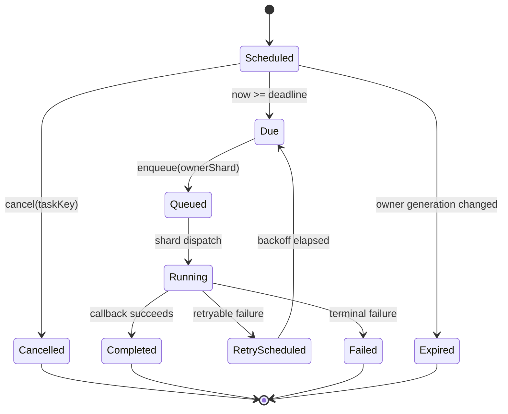
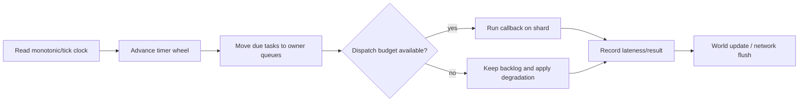

# 02 Timer 时间轮与延迟任务

> 知识基线：实时游戏服务端通用运行时；时间轮是调度结构，不等同于业务定时器或平台 Cron。
> 版本基线：示例使用 C++/Go 风格伪代码；具体线程库、容器和时钟实现以项目部署清单为准。
> 适用范围：权威世界 Tick、连接超时、技能持续时间、重连窗口、延迟消息和周期性业务任务。
> 最后更新：2026-08-18（补齐 Timer 与 ServerMainLoop、GameClock、过载保护的运行时闭环）。
> 外部依据：[Netty HashedWheelTimer API](https://netty.io/4.1/api/io/netty/util/HashedWheelTimer.html)、[Linux timerfd_create(2)](https://man7.org/linux/man-pages/man2/timerfd_create.2.html)、[Fix Your Timestep!](https://gafferongames.com/post/fix_your_timestep/)。
> 知识成熟度：L2（原理与可复现测试方案已成文；未宣称接入具体线上 Timer 实现）。

## 1. 概述

游戏服务器里的 Timer（定时器）负责把“未来某个时间要做的事”转成可排序、可取消、可观测的任务。它看起来只是一个 `sleep`，实际却同时受到世界 Tick、单调时钟、线程所有权、过载背压、对象生命周期和关服语义影响。

一个可靠的运行时定时器至少要回答：

1. 到期依据是游戏 Tick、单调时间，还是墙上时钟（wall clock）；
2. 任务到期时由哪个逻辑线程执行，是否允许跨线程回调；
3. 任务所属实体已经销毁、迁移或换代时怎么办；
4. 一帧积压了十万任务时，是否全部追赶、限量执行或丢弃可降级任务；
5. 取消、重复调度、重试和关服时如何保证最多一次或至少一次语义；
6. 重启或跨服迁移后，哪些计时器恢复，哪些只重新计算。

Timer 不应该成为隐藏的第二个主循环。实时世界的状态变更必须在受控的 Tick 边界提交；Timer 线程只负责唤醒或入队，不能绕过 Entity/Scene 的所有权直接修改世界状态。

## 2. 核心概念

| 术语 | 英文 | 责任 | 不负责什么 |
| --- | --- | --- | --- |
| 定时任务 | Timer Task | 保存 deadline、回调引用、取消状态和任务键 | 不保证回调一定准点 |
| 到期时间 | Deadline | 任务允许执行的最早时间或 Tick | 不等于执行完成时间 |
| Tick 定时器 | Tick Timer | 按逻辑 Tick/帧号触发，天然可回放 | 不适合现实世界闹钟 |
| 单调定时器 | Monotonic Timer | 按不回拨的 elapsed time 触发 | 不表达时区和日历 |
| 墙上时钟 | Wall Clock | 运营活动、日历时间和人工排期 | 不应用于战斗超时 |
| 时间轮 | Timing Wheel | 用槽位近似 O(1) 插入/到期扫描 | 需要接受粒度误差 |
| 最小堆 | Min-Heap | 按最早 deadline 精确取任务 | 大量插入是 O(log n) |
| 任务键 | Task Key | 让业务按实体/请求幂等取消或替换 | 不能替代任务版本号 |
| 逻辑所有权 | Logical Ownership | 决定回调在哪个 World/Shard 执行 | 不等于对象指针所有权 |
| 滞后 | Lateness | 实际开始时间减 deadline | 不是自动失败理由 |
| 任务预算 | Dispatch Budget | 每个 Tick 最多执行的任务数/耗时 | 不改变任务的业务优先级 |

## 3. 先划清五类时间

### 3.1 Tick time

Tick time 是世界模拟内部的离散时间，例如 `tickIndex=1200`、`dt=16.666ms`。技能前摇、投射物寿命、无敌帧、帧同步回放和确定性战斗应使用 Tick time。相同输入和相同 Tick 序列必须产生相同的到期结果。

### 3.2 Monotonic time

Monotonic time 只表示“经过了多久”，不因用户改时钟、NTP 校时或时区变化而倒退。连接超时、心跳、重连窗口、线程唤醒、GC 保护和进程级 deadline 应使用它。

### 3.3 Wall clock

Wall clock 表达“几点几分”和日期。签到、赛季结算、每日刷新、运营活动窗口需要它，但应先转换成带时区和版本的业务 deadline，再交给调度器。不要在每个 Tick 里直接读取本地日期判断是否结算。

### 3.4 Scheduled business time

业务时间是经过日历规则、时区、夏令时和配置版本解释后的结果。它通常由运营服务计算下一次触发点，运行时 Timer 只消费带 `schedule_version` 的任务。跨服时必须统一时区和版本，否则会出现重复结算或漏结算。

### 3.5 Timer 的选型矩阵

| 场景 | 推荐基准 | 允许误差 | 是否可丢 | 备注 |
| --- | --- | ---: | --- | --- |
| 角色 Buff 到期 | Tick | 0~1 Tick | 否 | 回放必须一致 |
| UDP 心跳超时 | monotonic | 50~500ms | 否 | 与连接状态机绑定 |
| 重连票据过期 | monotonic | 1 个调度粒度 | 否 | 过期后不可复用 |
| 非关键特效 | Tick/monotonic | 数百毫秒 | 是 | 可合并或跳过 |
| 每日活动 | wall/business | 秒级 | 否 | 需幂等结算 |
| 统计采样 | monotonic | 秒级 | 是 | 允许合并窗口 |

## 4. 时间轮、最小堆与分层时间轮

### 4.1 最小堆：精确优先队列

最小堆按 `deadline` 排序，每次取堆顶即可知道是否到期。插入和删除通常是 O(log n)，适合任务量中等、deadline 分布稀疏且精度比插入成本更重要的场景。

```text
heap = [(deadline=101, task=A), (deadline=108, task=B)]
now = 105
pop A; execute(A)
peek B; sleep_until(108)
```

删除任意节点需要保存句柄并做 lazy cancellation，或维护索引堆。直接在线性数组里扫描所有任务，会把 Timer 成本变成 O(N) 每 Tick，玩家数和技能数一上来就会拖垮主循环。

### 4.2 单层时间轮

时间轮将时间离散成 `slotWidth`，把任务放入 `slot = floor(deadline / slotWidth) mod slotCount`。每次推进一格只扫描当前槽位。平均插入和轮转接近 O(1)，代价是触发误差不小于一个 slot 粒度，并且超出轮覆盖范围的任务需要 rounds 或外部结构记录。

```text
slotWidth = 50ms
slotCount = 256
coverage = 12.8s
slot = floor(deadline_ms / 50) & 255
rounds = floor(delay_ms / coverage)
```

### 4.3 分层时间轮

分层时间轮用毫秒轮、秒轮、分钟轮等层级覆盖更长延迟。远期任务先放高层，随着时间推进降级到更细的轮。它适合连接超时、Buff、重连窗口等数量大且精度有限的任务，但必须定义降级时的边界：任务是否可能提前一格、迟到多少、进程暂停后如何补偿。

### 4.4 选择规则

| 条件 | 最小堆 | 单层轮 | 分层轮 |
| --- | --- | --- | --- |
| deadline 数量 | 小到中 | 大 | 很大 |
| 精度 | 高 | 约一个 slot | 细层高、远期低 |
| 插入成本 | O(log n) | 近似 O(1) | 近似 O(1) |
| 任意取消 | 句柄/lazy | 句柄/lazy | 句柄/lazy |
| 超长任务 | 直接支持 | 需要 rounds | 原生支持 |
| 实现复杂度 | 低 | 中 | 高 |

不要因为“时间轮是 O(1)”就强行替换最小堆。先用任务数、插入率、取消率、延迟分布和 P99 lateness 证明收益，再决定是否引入分层轮。

## 5. 任务生命周期

一个任务从创建到回收应有显式状态，避免“取消后仍然回调”和“对象销毁后回调访问悬空指针”。



图中的 `Queued` 很关键：Timer 只把任务投递到拥有该 Entity/Scene 的逻辑分片，不能在 Timer 线程里直接改状态。`owner_generation` 变化时，即使任务句柄还在，也必须判定为过期。

### 5.1 任务字段

建议最少包含：

```text
task_id           // 全局诊断 ID，不作为业务幂等键
task_key          // 业务取消/替换键，例如 player:42:heartbeat
deadline          // monotonic_ns 或 tick_index
period            // 0 表示一次性
owner_shard       // 逻辑执行分片
owner_entity      // 可选的 Entity ID
owner_generation  // 防止旧实体句柄复活
priority          // Critical / Gameplay / Cosmetic
retry_policy      // 最大次数、退避、抖动
state             // Scheduled/Queued/Running/...
created_trace_id  // 便于跨服务追踪
```

### 5.2 句柄与任务键

句柄适合内部快速取消；任务键适合业务幂等。两者要同时存在：例如玩家重连时按 `session:{id}:timeout` 取消旧超时，再创建新任务。只保存回调闭包而没有可定位键，会导致状态迁移和关服清理无法证明完整。

## 6. 与 ServerMainLoop 的接入

Timer 的推荐调用顺序是：读取时钟 → 推进轮 → 把到期任务入队 → 在预算内执行 → 记录迟到和积压 → 再执行网络 flush。这样 Timer 不会在世界状态半更新时插入异步回调。



伪代码（示意，不绑定线程库）：

```cpp
void WorldShard::Tick(TickIndex tick, MonotonicNs now) {
    timer.Advance(now, tick);              // 只生成 due list
    const auto budget = budget_for(TimerClass::Gameplay);
    size_t executed = 0;
    while (executed < budget.max_tasks && timer.has_due()) {
        TimerTask task = timer.pop_due();
        if (!is_owner_current(task)) {
            metrics.expired_owner.fetch_add(1);
            continue;
        }
        if (task.cancelled()) continue;
        run_in_shard_context(task);        // 不跨线程直接改 World
        ++executed;
    }
    metrics.timer_backlog.observe(timer.pending());
}
```

### 6.1 Catch-up 与 Drop

服务器卡顿后会出现多个 deadline 同时到期。对于战斗状态，通常要按 Tick 序列有限度 catch-up；对于心跳统计和装饰效果，可以合并或 drop。无论策略如何，都要设置 `max_catch_up_ticks`、`max_tasks_per_tick` 和熔断指标，禁止无限追赶把服务器锁死在过去。

### 6.2 任务排序

同一 Tick 的任务必须有稳定的 tie-breaker，例如 `(deadline, priority, sequence)`。不要依赖哈希表遍历顺序，否则回放、跨平台压测和故障重放会得到不同结果。

## 7. 取消、重复与重调度

### 7.1 取消竞态

取消可能与到期扫描、入队和执行并发发生。推荐使用状态 CAS：

```text
Scheduled --cancel CAS--> Cancelled
Due       --cancel CAS--> Cancelled
Queued    --cancel flag--> skip before callback
Running   --cancel       --> callback must observe cancellation token
```

取消成功不代表回调一定没有开始；业务接口应明确“取消保证”是 `not-started` 还是 `not-completed`。资产扣除等不可逆操作不能只依赖 Timer 取消，仍需业务幂等键。

### 7.2 周期任务

周期任务应记录“理想下一次 deadline”，而不是用“本次完成时间 + period”，否则回调耗时会不断漂移。若一次执行跨过多个周期，按任务类别选择：战斗状态补齐每个逻辑周期、指标采样合并成一次、运营任务只保留最后一次并通过结算游标补账。

### 7.3 重试

Timer 重试只负责再次投递，不能把所有异常都当 transient。重试任务需要 `attempt`、`first_deadline`、`max_elapsed` 和 `idempotency_key`。指数退避加入有界抖动，避免一批数据库恢复后所有任务同时重试。

## 8. 线程与所有权

### 8.1 单线程分片

单线程 World/Shard 最容易保证顺序：Timer 只在分片 Tick 中推进，任务回调直接访问本分片状态。跨分片操作变成消息，消息带目标 Entity 的生成号和 trace ID。

### 8.2 多线程 Timer

Timer 可以由独立线程推进，但回调必须入队到 owner shard。不要把 `std::function` 闭包捕获的裸 `this` 直接交给 Timer 线程；使用 Entity ID + generation 查表，查不到就丢弃并记录原因。

### 8.3 关闭顺序

关服时先停止接收新任务，再把 Timer 标记为 Draining，最后等待 owner queue 清空或按策略取消。关闭顺序建议为：

1. 进入 `Draining`，拒绝新业务 Timer；
2. 冻结周期任务，保存必要的下一次 deadline；
3. 处理 Critical/Gameplay 任务；
4. 取消 Cosmetic/统计任务；
5. 停止 Timer worker，释放句柄；
6. 写入退出原因、积压量和未执行任务摘要。

## 9. 分布式 Timer

跨服务的延迟任务不能依赖某一台进程内存。常见方案有：

| 方案 | 适用 | 主要风险 |
| --- | --- | --- |
| 进程内 Timer | 战斗/连接/Entity 生命周期 | 进程崩溃丢失 |
| DB due_at 扫描 | 订单、补偿、结算 | 扫描压力与租约竞争 |
| 延迟消息队列 | 大量异步任务 | 重复、乱序、延迟抖动 |
| 外部调度器 | 日历/运营任务 | 调度器与业务幂等边界 |

无论外部方案如何，消费端都必须以 `task_id + version` 或业务幂等键去重；“消息只投递一次”不能替代业务状态机。世界内 Timer 在迁移/恢复时应从 Snapshot 的逻辑 deadline 重建，而不是把线程睡眠剩余时间当成事实。

## 10. 过载、背压与降级

Timer backlog 是运行时过载的早期信号。建议同时观察 pending 数、最老任务年龄、P95/P99 lateness、回调耗时和取消率。

```text
正常：pending < low_watermark
预警：pending >= low_watermark，限制低优先级新任务
降级：pending >= high_watermark，合并周期任务、降低 AI/特效频率
保护：pending >= critical_watermark，只保留连接/战斗/持久化关键任务
恢复：连续 N 个 Tick 低于 low_watermark 才解除降级（滞回）
```

Timer 的降级必须与 [14-运行时背压与过载保护](14-运行时背压与过载保护.md) 共用优先级表，不能由每个业务模块私自定义一套阈值。对技能、Buff 和订单发放等不可丢任务，应转为持久化补偿，而不是静默 drop。

## 11. 示例：可取消的逻辑定时器

下面是示意接口，突出 owner/generation 和状态机；不是可直接粘贴到生产项目的线程安全库：

```go
type TimerTask struct {
    Key       string
    Deadline  Tick
    Owner     EntityID
    Generation uint32
    Priority  Priority
    Cancelled atomic.Bool
    Run       func(*Shard)
}

func (s *Shard) ScheduleBuff(e EntityID, gen uint32, expire Tick) Handle {
    key := fmt.Sprintf("buff:%d", e)
    return s.timers.Schedule(TimerTask{
        Key: key, Deadline: expire, Owner: e,
        Generation: gen, Priority: Gameplay,
        Run: func(shard *Shard) {
            current, ok := shard.Entities.Get(e)
            if !ok || current.Generation != gen { return }
            current.RemoveExpiredBuff(key)
        },
    })
}
```

验证这段逻辑时必须覆盖：实体销毁后任务到期、同键替换、回调执行中取消、Tick 跳跃、重复重放和关服 Drain。

## 12. 可复现验证方案

### 12.1 正确性用例

| 用例 | 输入 | 通过标准 |
| --- | --- | --- |
| 同 deadline 排序 | 1,000 个相同 deadline 任务 | sequence 顺序稳定 |
| 取消竞态 | 扫描/入队/执行同时 cancel | 不发生悬空访问；状态终态可解释 |
| Tick 跳跃 | 从 100 跳到 110 | 按策略补齐或明确合并，不重复 |
| owner 换代 | 旧 Entity 销毁后复用 ID | 旧任务全部 Expired |
| 周期漂移 | 运行 10,000 次 period | deadline 漂移在规定误差内 |
| 重启恢复 | Snapshot + due_at | 关键任务不重不漏 |

### 12.2 性能用例

用 100、1,000、10,000、100,000 个任务分别测插入、取消、推进和执行。记录 Timer 自身 CPU、主循环 P50/P95/P99、pending 峰值、最老任务年龄和内存占用。不要只报平均耗时；最重要的是过载时 P99 lateness 是否持续增长。

PowerShell 入口（示意，路径按实验实际位置调整）：

```powershell
rg -n "TimerTask|TimingWheel|pending|lateness" .\evidence .\游戏服务端
& .\evidence\server\tick-scheduler\run.ps1 -TaskCount 10000 -Ticks 600
```

如果项目没有对应实验脚本，应把命令标为“待实现”，不能把示意命令写成已经通过的结果。

## 13. 指标与诊断

最小指标集：

- `timer_pending{priority,shard}`：待处理数量；
- `timer_oldest_age_ms`：最老任务年龄；
- `timer_lateness_ms`：触发迟到分布；
- `timer_callback_ms`：回调耗时分布；
- `timer_cancel_total{reason}`：取消原因；
- `timer_expired_owner_total`：所有权换代导致的过期数；
- `timer_retry_total{class}`：重试次数；
- `timer_drop_total{priority}`：降级丢弃数；
- `timer_recovery_rebuilt_total`：重启/迁移重建数。

日志必须带 `task_key`、`owner_shard`、`owner_generation`、`deadline`、`now`、`lateness`、`trace_id` 和结果。日志内容应脱敏，玩家 ID 按项目规范哈希或分级展示。

## 14. 常见失败路径

1. 用 wall clock 做心跳超时：改时钟后连接提前过期或永不超时；改用 monotonic。
2. Timer 线程直接写 Entity：出现数据竞争或随机崩溃；改为 owner shard 消息。
3. 周期任务按完成时间重排：回调慢时累计漂移；使用理想 deadline。
4. 取消只删链表节点：已入队任务仍执行；使用状态位和回调前检查。
5. 过载无限 catch-up：服务器永远追不上实时；设置预算与降级阶梯。
6. 迁移只搬 Entity，不搬 Timer：旧服继续发 Buff/超时回调；迁移协议必须包含可恢复计时器。
7. 外部延迟消息没有幂等：重试导致重复发奖；状态机和幂等键是最终防线。
8. 关服直接杀进程：未执行任务没有摘要；先 Drain 并写恢复所需的 deadline。

## 15. 最佳实践清单

- [ ] 每类任务显式选择 Tick、monotonic 或 business time。
- [ ] Timer 只调度，不绕过逻辑分片改世界状态。
- [ ] 每个任务都有 task key、generation 和可观测 trace。
- [ ] 取消、替换、重试和周期任务都有明确语义。
- [ ] 同 deadline 的执行顺序稳定，可重放。
- [ ] 有 pending、lateness、callback P99 和 drop 指标。
- [ ] 过载时按优先级限量，不把关键任务静默丢弃。
- [ ] Snapshot/迁移协议保存可恢复的逻辑 deadline。
- [ ] 关服先拒绝新任务，再按优先级 Drain。
- [ ] 测试覆盖换代、跳 Tick、重启和重复投递。

## 16. FAQ

### Q1：时间轮是不是一定比最小堆快？

不是。任务量小、deadline 需要高精度或取消很多时，最小堆更简单且可测。时间轮的收益来自大量近似精度任务的低常数插入与扫描。

### Q2：Timer 回调能不能开协程异步执行？

可以，但异步任务必须回到 owner shard 提交结果，并带版本校验。不能让协程持有跨 Tick 的裸 Entity 指针。

### Q3：Tick 变慢时，技能 Buff 要按现实时间还是游戏时间？

由玩法公平性决定。权威战斗通常按逻辑 Tick；连接超时按 monotonic。若服务器降级导致世界减速，必须把语义写进 GameClock，而不是让各系统自行猜测。

### Q4：每日活动应该放在世界 Timer 里吗？

可以由调度器触发，但结算状态必须持久化、带活动版本和幂等键。进程重启后应扫描未结算窗口，而不是依赖内存中那一个回调。

### Q5：取消任务后还看到一次回调日志，是不是 bug？

先确认取消发生在 Scheduled、Queued 还是 Running。若已 Running，取消通常只能阻止后续副作用；接口需要明确可观察语义。

## 17. 关联阅读

- [01-ServerMainLoop与TickScheduler](01-ServerMainLoop与TickScheduler.md)：Timer 如何嵌入固定步长和 catch-up/drop。
- [03-Entity生命周期与组件模型](03-Entity生命周期与组件模型.md)：Entity generation 与悬空引用防护。
- [04-Scene-Map-Zone与实例管理](04-Scene-Map-Zone与实例管理.md)：Scene/Zone 所有权和迁移前置。
- [08-跨Zone与跨服迁移](08-跨Zone与跨服迁移.md)：迁移时保存与重建 Timer。
- [12-世界时间确定性与GameClock](12-世界时间确定性与GameClock.md)：时间源和暂停/减速语义。
- [14-运行时背压与过载保护](14-运行时背压与过载保护.md)：Timer backlog 的降级与恢复。
- [游戏服务端/01-架构与网络/04-消息系统与事件驱动](../01-架构与网络/04-消息系统与事件驱动.md)：跨进程消息、RPC 和已有时间轮概念。

## 18. 更新日志

- 2026-08-18：新建运行时 Timer 专题，补齐时间源、时间轮/堆选型、任务生命周期、所有权、过载、迁移恢复和验证矩阵；示例均标注为示意，不宣称线上执行结果。
