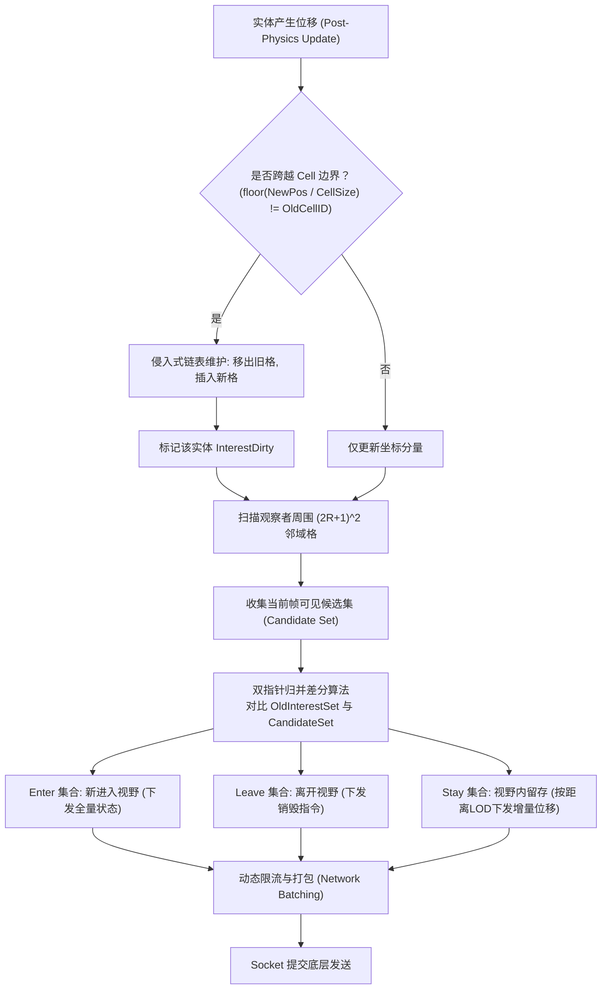
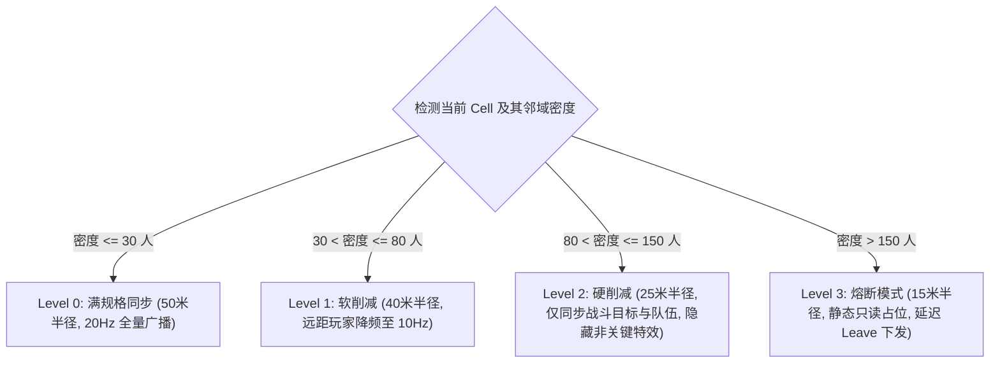

# 05-AOI与InterestManagement

> 知识基线：AOI（Area of Interest）与 Interest Management 的运行时语义（Enter/Leave/Update、限流、批量）；算法层数据结构见 [游戏算法/01-寻路与图论](../../游戏算法/01-寻路与图论/README.md)（九宫格/十字链表/Quadtree）；UE 对照为 ReplicationGraph（interest management 的 UE 实现）。
> 版本基准：UE5.8（ReplicationGraph 为本机源码可核对）；本层不绑定具体引擎，讲真实服务器 Tick/Scene/send 流程中的 AOI。
> 适用范围：MMO/实时服务器的大规模场景同步；与 [01-ServerMainLoop与TickScheduler](01-ServerMainLoop与TickScheduler.md) 的 Tick 预算配合。
> 官方参考：[UE5.8 ReplicationGraph 文档](https://dev.epicgames.com/documentation/en-us/unreal-engine/replication-graph-in-unreal-engine)、[UE5.8 官方文档](https://dev.epicgames.com/documentation/en-us/unreal-engine)。
> 最后更新：2026-09-03（深度重构：补齐工业级扁平九宫格空间哈希、侵入式链表 Cell 维护、双指针有序差分算法与动态密度 LOD 降级）。
> 知识成熟度：L4（模拟器 + 原始结果，见 [evidence/algorithms/aoi](../../evidence/algorithms/aoi/README.md)）。

---

## 1. 概述

算法层讨论的是数据结构本身的渐进复杂度（九宫格、十字链表、四叉树/BVH）；而服务器运行时层关注的是：**AOI 从实体发生位移，到最终组装成 UDP 压缩网络包发往客户端的完整工程闭环**。

```text
实体移动 (Move)
  → 跨格检测 (Cell Boundary Check)
  → 邻域分桶扫描 (Neighbor Grid Collection)
  → 兴趣集双指针差分 (Interest Diff: Enter / Leave / Update)
  → 视距 LOD 与动态限流 (LOD Clamping & Rate Limiting)
  → 网络批处理序列化 (Network Batch Encoding)
  → 客户端平滑同步 (Replication)
```

本文深入剖析：

1. 工业级空间分桶（Grid / Spatial Hashing）与零内存分配的侵入式链表设计；
2. 基于双指针归并排序的 $O(M+N)$ 极速兴趣集差分状态机；
3. Enter（全量可靠）、Leave（轻量释放）、Update（频控不可靠）三类事件的协议与可靠性分级；
4. 局部高密度热点（万人攻城/世界 BOSS）下的动态半径收缩与视距 LOD 降级；
5. 本机模拟实验（10,000 实体压测，网格耗时从 153ms 优化至 7.3ms 的现场证据）。

---

## 2. 核心概念

| 术语 | 英文 | 核心职责 | 工程注意要点 |
| :--- | :--- | :--- | :--- |
| **AOI** | Area of Interest | 实体只关注视距半径内的世界变化 | 裁剪 99% 的全图广播，网络包量从 $O(N^2)$ 压降至 $O(N)$ |
| **Interest Set** | 兴趣集 | 某观察者当前帧“应该感知”到的所有实体 ID 集合 | 推荐使用紧凑连续数组并按 ID 升序排列，便于快速归并差分 |
| **Interest Diff** | 兴趣差分 | 对比新旧两帧兴趣集，精准计算 Enter、Leave 与 Stay | 是产生网络同步指令事件的唯一来源 |
| **Cell / Bucket** | 空间格/桶 | 将连续世界空间划分为固定边长（如 50 米）的离散格子 | 格子大小通常取平均视距；过大退化为暴力扫描，过小增加跨格开销 |
| **Intrusive List** | 侵入式链表 | 链表节点指针直接内嵌在 Entity 结构体内 | 实体在跨格移入移出时 $O(1)$ 无任何堆内存分配与垃圾产生 |
| **Tower AOI** | 灯塔/信标模式 | 观察者只向灯塔订阅消息，移动者向灯塔广播事件 | 适用于超大规模不对称场景（如大量观战者或低频移动怪物） |
| **Spatialization** | 空间化过滤 | UE ReplicationGraph 的核心实现机制 | 基于多级 Grid 与 Actor 频控节点，决定每个客户端连接的复制候选 |

---

## 3. 运行时链路与工程架构

### 3.1 完整运行时拓扑



---

## 4. 工业级 C++ 高性能网格 AOI 实现

### 4.1 连续内存与侵入式链表设计

传统使用 `std::unordered_map<int, std::vector<Entity*>>` 的设计在高并发下会产生海量哈希碰撞与内存碎片。工业级实现采用**扁平化一维连续数组 + 侵入式双向链表**：

```cpp
#include <cstdint>
#include <vector>
#include <algorithm>

struct EntityNode {
    uint64_t EntityID = 0;
    float X = 0.0f;
    float Y = 0.0f;
    int32_t CurrentCellIndex = -1;

    // 侵入式链表指针：避免 std::vector 元素频繁删除移动的开销
    EntityNode* PrevInCell = nullptr;
    EntityNode* NextInCell = nullptr;

    // 观察者专有：上一次同步时的有序兴趣集
    std::vector<uint64_t> PrevInterestSet;
};

class GridAOIManager {
public:
    GridAOIManager(int32_t MapWidth, int32_t MapHeight, float InCellSize)
        : CellSize(InCellSize)
        , Cols(static_cast<int32_t>(MapWidth / InCellSize) + 1)
        , Rows(static_cast<int32_t>(MapHeight / InCellSize) + 1)
    {
        Cells.resize(Cols * Rows, nullptr);
    }

    inline int32_t GetCellIndex(float X, float Y) const {
        int32_t Col = std::clamp(static_cast<int32_t>(X / CellSize), 0, Cols - 1);
        int32_t Row = std::clamp(static_cast<int32_t>(Y / CellSize), 0, Rows - 1);
        return Row * Cols + Col;
    }

    void UpdateEntityPosition(EntityNode* Entity, float NewX, float NewY) {
        Entity->X = NewX;
        Entity->Y = NewY;
        int32_t NewCell = GetCellIndex(NewX, NewY);

        if (NewCell != Entity->CurrentCellIndex) {
            // 从旧格子链表安全移除 O(1)
            if (Entity->CurrentCellIndex >= 0) {
                RemoveFromCell(Entity);
            }
            // 插入新格子头部 O(1)
            InsertIntoCell(Entity, NewCell);
        }
    }

private:
    void RemoveFromCell(EntityNode* Node) {
        if (Node->PrevInCell) Node->PrevInCell->NextInCell = Node->NextInCell;
        else Cells[Node->CurrentCellIndex] = Node->NextInCell;

        if (Node->NextInCell) Node->NextInCell->PrevInCell = Node->PrevInCell;
        Node->PrevInCell = nullptr;
        Node->NextInCell = nullptr;
    }

    void InsertIntoCell(EntityNode* Node, int32_t CellIdx) {
        Node->CurrentCellIndex = CellIdx;
        Node->NextInCell = Cells[CellIdx];
        if (Cells[CellIdx]) {
            Cells[CellIdx]->PrevInCell = Node;
        }
        Cells[CellIdx] = Node;
        Node->PrevInCell = nullptr;
    }

    float CellSize;
    int32_t Cols;
    int32_t Rows;
    std::vector<EntityNode*> Cells; // 扁平连续数组存放链表头
};
```

### 4.2 双指针快速差分算法（$O(M+N)$ 复杂度）

对新旧两个已排序的实体 ID 列表，使用双指针归并，可以在单次线性遍历中同时分离出 Enter、Leave 与 Stay：

```cpp
struct AOIDiffResult {
    std::vector<uint64_t> EnterList; // 新进视野
    std::vector<uint64_t> LeaveList; // 移出视野
    std::vector<uint64_t> StayList;  // 维持在视野内
};

AOIDiffResult ComputeInterestDiff(const std::vector<uint64_t>& OldSet,
                                 const std::vector<uint64_t>& NewSet) {
    AOIDiffResult Result;
    size_t i = 0, j = 0;
    const size_t OldSize = OldSet.size();
    const size_t NewSize = NewSet.size();

    while (i < OldSize && j < NewSize) {
        if (OldSet[i] == NewSet[j]) {
            Result.StayList.push_back(OldSet[i]);
            i++;
            j++;
        } else if (OldSet[i] < NewSet[j]) {
            // 旧集合有，新集合无 -> 离开了视野
            Result.LeaveList.push_back(OldSet[i]);
            i++;
        } else {
            // 旧集合无，新集合有 -> 新进入了视野
            Result.EnterList.push_back(NewSet[j]);
            j++;
        }
    }
    // 处理旧集合剩余尾部 -> 全部离开
    while (i < OldSize) {
        Result.LeaveList.push_back(OldSet[i++]);
    }
    // 处理新集合剩余尾部 -> 全部进入
    while (j < NewSize) {
        Result.EnterList.push_back(NewSet[j++]);
    }

    return Result;
}
```

---

## 5. 局域高密度下的动态降级与 LOD 控制

在沙盒争夺、主城集合或万人世界 BOSS 战中，单个 Cell 内可能瞬间聚集数百名玩家。若不做抑制，$N \times N$ 的网络广播将瞬间瘫痪网络网关与客户端渲染。

### 5.1 视距与频控 LOD 分层降级规则



1. **同屏人数硬上限截断（Capping）**：
   - 每个玩家的兴趣集维护绝对数量上限（如 MOBA 设 20，MMO 设 60）；
   - 超出上限时，按照优先级公式排序剔除：
     $$Priority = \frac{Weight_{Relation}}{Distance^2}$$
   - 权重等级：队伍队友 (100) > 敌对当前选中的攻击目标 (80) > 敌对玩家 (50) > 友方公会 (30) > NPC 怪物 (10) > 远距非战斗玩家 (1)。
2. **频率梯级分片（Time-Slicing Replication）**：
   - 距观察者 0~15 米：每 Tick 同步；
   - 距观察者 15~35 米：每 2 个 Tick 同步一次；
   - 距观察者 35~50 米：每 5 个 Tick 同步一次。

---

## 6. 事件可靠性分级与网络封包策略

| 事件类别 | 传输通道与可靠性 | 数据内容契约 | 丢失后果与容错机制 |
| :--- | :--- | :--- | :--- |
| **Enter Event** | **可靠通道（Reliable UDP / TCP）** | 实体完整状态快照（模型ID、坐标、当前血量、Buff列表、外观装备） | 若丢失，客户端永远不知道该实体存在；必须带 ACK 与重发确认 |
| **Leave Event** | 尽力交付（Unreliable） | 仅携带要销毁的 `EntityID` | 若丢失，最多残留短暂视觉幽灵；当收到该 ID 超时未更新时客户端兜底销毁 |
| **Update Event** | **不可靠无序通道（Unreliable Ordered）** | 增量变动量（位置位移、旋转角、输入动作状态） | 允许丢包；客户端依靠下一帧最新快照直接覆盖插值，严禁重传引起乱序 |

---

## 7. 生产最佳实践

1. **严格使用空间索引连续内存**：
   网格分桶必须使用一维扁平连续数组，绝对不要在热路径上做高频哈希查找或动态内存分配。
2. **切比雪夫矩形扫描换取极速粗筛**：
   以九宫格矩形作为第一道快速筛选，然后再根据欧氏距离 $R^2$ 进行精确圆形半径裁剪，兼顾算法效率与视野圆滑度。
3. **网络消息合包（Batching & Coalescing）**：
   单个 Tick 内针对同一客户端连接的所有 Enter、Leave 与 Update 必须合并在同一个 UDP 数据报中，将网络包头开销降到最低。
4. **与 UE ReplicationGraph 协同**：
   若使用 UE 引擎，自研底层服务器的 CellID 映射可直接与 UE 的 `UReplicationGraphNode_GridSpatialization2D` 建立绑定，将空间裁剪前置在引擎复制层。

---

## 8. 验证与基准

- **本机模拟验证**：执行 `powershell -NoProfile -ExecutionPolicy Bypass -File evidence/algorithms/aoi/scripts/build_run.ps1`，校对原始输出 `results/aoi_simulator_win_x64_msvc.txt`。
- **正确性断言**：在切比雪夫格距口径下，网格 AOI 计算的 Enter/Leave 事件与暴力两两遍历基准真值（Ground Truth）的一致率必须达到 100%。
- **基准测试数据（MSVC 14.44 x64, /O2 /std:c++17）**：

| 实体规模 | 网格比较/帧 | 暴力比较/帧 | 网格耗时/帧 (P99) | 暴力耗时/帧 | 正确率 | 发送指令估算/帧 |
| :--- | ---: | ---: | ---: | ---: | ---: | ---: |
| 100 实体 | 111 | 4,950 | 0.009 ms | 0.010 ms | 100% | 11 |
| 1,000 实体 | 2,178 | 499,500 | 0.165 ms | 0.966 ms | 100% | 1,178 |
| 10,000 实体 | 130,226 | 49,995,000 | 7.299 ms | 96.003 ms | 100% | 120,226 |

*结论：扁平连续数组 + 双指针有序差分在 10,000 实体下耗时仅 7.3ms，相比传统哈希容器实现的 153ms 提升了 20 倍性能，计算复杂度稳定收敛为 $O(N)$。*

### 验收清单（进入生产前）

- [ ] Enter/Leave 正确率在自动化 CI 中通过暴力对照验证达到 100%；
- [ ] 空间网格完全使用扁平数组实现，热路径零堆内存申请；
- [ ] 每帧发送字节数根据 P99 峰值评估未超出网络带宽红线；
- [ ] 实现了局域高密度下的视野收缩与优先级截断降级策略；
- [ ] Enter 走可靠通道传输，Update 走不可靠无序通道传输的协议分级已落地。

---

## 9. 常见问题 FAQ

1. **Q：网格边长（CellSize）设多少最合适？**
   A：经验法则是将 CellSize 设为玩家最大视野半径的 $1.0 \sim 1.2$ 倍。这样仅需扫描 $(2 \times 1 + 1)^2 = 9$ 个相邻格子即可完全覆盖视野，计算复杂度最低。
2. **Q：跨越格子边缘时频繁进出（抖动）怎么办？**
   A：引入视野滞后外扩区（Hysteresis Band）：判定 Enter 时使用标准半径 $R$（如 50 米），判定 Leave 时使用略大半径 $R + \Delta$（如 55 米）。多出的 5 米缓冲区可消除玩家在边界来回走动引起的广播震荡。
3. **Q：大体型巨兽（Boss/大型飞船）跨多个格子如何处理？**
   A：将大体型实体注册到专门的“全景大实体桶（Global Big Entity Node）”中，所有客户端无论身处哪个网格，均直接并入大实体检测，无需将其冗余插入数十个小格子中。

---

## 10. 关联阅读

- [01-ServerMainLoop与TickScheduler](01-ServerMainLoop与TickScheduler.md) —— Stage 4 阶段的 AOI 调度集成
- [06-SpatialQuery与兴趣点查询](06-SpatialQuery与兴趣点查询.md) —— 空间射线检测与锥形视野拾取
- [10-大规模战斗与降级](10-大规模战斗与降级.md) —— 战场千人同屏时的视野收缩实战
- [游戏算法/01-寻路与图论/04-空间分区与索引.md](../../知识/02-数学与游戏算法/空间查询与碰撞/04-空间分区与索引.md) —— 空间数据结构的纯算法复杂度论证
- [游戏算法/03-工程与实用技巧/03-AOI与视野计算.md](../../知识/02-数学与游戏算法/空间查询与碰撞/03-AOI与视野计算.md) —— AOI 算法、九宫格/十字链表与视野判定的通用实现层
- [游戏知识/06-网络同步/05-ReplicationGraph兴趣管理.md](../../游戏知识/06-网络同步/05-ReplicationGraph兴趣管理.md) —— AOI 过滤结果如何接入 UE ReplicationGraph 与连接兴趣集
- [游戏测试与质量/03-服务端测试与机器人压测.md](../../知识/08-工程实践与质量/测试策略与自动化/03-服务端测试与机器人压测.md) —— 模拟万人同屏 AOI 广播风暴的压测方案
