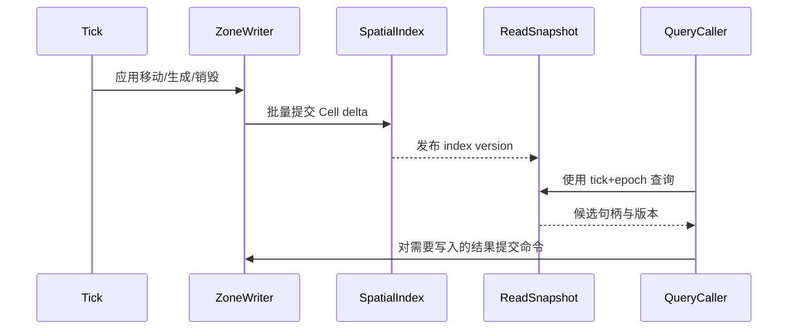

# 06-SpatialQuery与兴趣点查询

> 知识基线：Spatial Query 是运行时按空间条件检索实体/组件的能力；AOI/Interest Management 是面向连接的可见性与复制裁剪策略。本文只规划服务端运行时边界，不把查询结果直接等同于网络可见集。
> 版本基准：UE5.8 可用于对照引擎空间查询与 ReplicationGraph 思路；本文不声称项目已接入 UE API。
> 适用范围：MMO、实时对战、开放世界服务器中的近邻、范围、射线候选、区域标签和兴趣点（POI）查询。
> 知识成熟度：L2（方案与验证入口）；本文没有项目实测结论，所有容量数字均为待验证预算。
> 最后更新：2026-08-20。

## 1. 定位与事实边界

1. SpatialQuery 解决“给定空间谓词，哪些对象满足条件”。
2. AOI 解决“给定观察者，哪些对象允许进入其兴趣集”。
3. Interest Management 还包含优先级、复制频率、权限和网络限流。
4. 查询引擎可以为 AOI 提供候选，但不能替代权限过滤。
5. 查询结果默认是同一 Tick 的只读快照，不改变世界状态。
6. 写操作仍必须回到实体所属 Zone 的单写者队列。
7. 物理碰撞查询与逻辑空间索引可以并存，二者结果不可混用。
8. 本文不规定具体容器库；L2 方案先固定接口、预算和验证方法。
9. 本文不虚构已经测得的 QPS、p99 或内存数字。
10. 任何性能目标都必须通过本机压测入口确认。

## 2. 术语与查询类型

|术语|定义|典型调用|
|---|---|---|
|Point|二维或三维坐标|查询最近 POI|
|AABB|轴对齐包围盒|区域触发器|
|Sphere|球形范围|近邻、爆炸候选|
|Capsule|胶囊体|角色技能范围|
|Ray|射线候选|视线、命中前置|
|Frustum|视锥体|摄像机附近对象|
|Tag|逻辑标签|只查敌方、商店|
|POI|兴趣点|出生点、资源点、交互点|
|Candidate|粗筛候选|索引返回的对象|
|Exact hit|精确命中|几何与权限都通过|
|Snapshot|查询时点|Tick 序号与 Zone epoch|

## 3. 与 AOI 的差异

|维度|SpatialQuery|AOI/Interest Management|
|---|---|---|
|主体|任意系统或实体|观察者连接/复制通道|
|输出|实体、组件或 POI 集合|Enter/Leave/Update 集合|
|时间|一次性或批量查询|每 Tick 或降频维护|
|过滤|空间谓词、标签、类型|空间候选+权限+优先级+带宽|
|一致性|同一快照内可复现|允许延迟进入/退出策略|
|副作用|应为只读|会产生网络发送状态|
|降级|缩小范围、限制返回数|降低复制频率、丢弃低优先级|

1. AOI 需要稳定的观察者状态，而 SpatialQuery 可以是无状态请求。
2. AOI 的 Leave 不能仅因一次查询超时就立即产生。
3. POI 查询常要求排序、分页和距离，而 AOI 更关注集合差异。
4. 战斗技能应使用查询快照，再由 Authority 校验命中。
5. 客户端提供的坐标只能作为请求参数，不能作为权威结果。

## 4. L2 目标方案

### 4.1 统一接口

```cpp
struct QueryContext {
  TickId tick;
  ZoneId zone;
  uint64_t zoneEpoch;
  QueryBudget budget;
  AccessToken access;
};
struct SpatialFilter {
  Shape shape;
  EntityTypeMask types;
  TagMask required;
  TagMask excluded;
  uint32_t maxResults;
  SortMode sort;
};
QueryResult Query(const QueryContext&, const SpatialFilter&);
```

1. QueryContext 固定查询时点，防止跨 Tick 读到混合状态。
2. zoneEpoch 用于拒绝迁移前后混合的实体句柄。
3. maxResults 是硬上限，不允许调用方隐式无限扫描。
4. SortMode 只支持预定义稳定顺序。
5. AccessToken 在逻辑过滤阶段执行，不把未授权实体暴露给调用方。

### 4.2 数据结构分层

1. World Registry 保存 EntityId、generation、ZoneId 和组件索引。
2. Uniform Grid 适合对象分布较均匀的近邻查询。
3. Quadtree/Octree 适合稀疏世界，但更新成本需要实测。
4. BVH 适合静态碰撞体和批量射线候选。
5. POI 表按类型分桶，并保留坐标、版本、可用状态。
6. 每个 Cell 保存实体句柄，不保存可变业务对象副本。
7. 句柄包含 generation，查询返回前再次校验生命周期。
8. Cell 列表按 EntityId 排序或使用稳定序号，保证结果可重放。
9. 索引更新通过 Zone 写者提交，读者只见到发布后的版本。
10. 删除采用 tombstone 或延迟回收，避免并发读悬垂指针。

### 4.3 更新流程



1. 一个 Tick 内先应用移动，再发布索引版本，再执行查询消费者。
2. 查询消费者不得在索引发布前读取半更新 Cell。
3. 批量提交降低频繁跨线程同步成本。
4. 版本发布失败时保留上一版本并产生可观测信号。
5. 查询结果标记 stale 级别，调用方决定重试或降级。

## 5. 查询预算与调度

1. 每个 Zone 配置每 Tick 查询 CPU 预算。
2. 每个调用方配置候选数、结果数和最长扫描 Cell 数。
3. 预算按优先级分层：安全、战斗、交互、装饰。
4. 预算消耗记录候选检查、精确几何和权限过滤三段。
5. 超预算先截断低优先级队列，不阻塞 Main Loop。
6. 连续超预算触发调用方熔断和半径缩小。
7. 预算恢复采用滞回阈值，避免每 Tick 震荡。
8. 查询队列必须有 deadline，过期请求返回 Timeout 状态。
9. 批量查询合并相同 Cell 扫描，避免 N 个调用重复遍历。
10. 大范围查询拆成分片任务，允许在 Tick 间续跑。

## 6. AOI 衔接

1. AOI 先用 SpatialQuery 获得候选，再执行 relation、权限和订阅过滤。
2. 观察者状态保存 previousInterestSet 与 lastPublishedTick。
3. 候选集合应按稳定键去重，避免多索引重复 Enter。
4. Enter 事件需记录查询版本和原因，便于回放。
5. Leave 使用宽限 Tick，防止边界抖动造成网络风暴。
6. Update 仅发送字段权限允许且达到复制频率的实体。
7. 查询超时不等于 Leave；可暂时保持旧兴趣集并标记 stale。
8. 迁移期间 AOI 使用 source/destination epoch 做双重校验。
9. AOI 的网络批量由网络层负责，SpatialQuery 不感知连接 socket。
10. Interest set 不得泄露被权限策略排除的隐藏对象。

## 7. 跨 Zone 与一致性

1. Zone 边界查询默认只读本 Zone 索引。
2. 跨 Zone 查询必须经 QueryGateway，携带每个 Zone 的 epoch。
3. Gateway 设定 fan-out 上限，防止一个请求扇出全世界。
4. 返回结果合并时按 (ZoneId, EntityId, generation) 稳定排序。
5. 任一 Zone epoch 变化则结果标记 partial 或 retryable。
6. 不允许把不同 Tick 的结果伪装成单一原子快照。
7. 需要严格一致的战斗判定应路由到 Authority Zone 执行。
8. 近似排行榜或导航提示可以接受 bounded staleness。
9. 跨服查询只返回经过数据最小化的公开字段。
10. 迁移提交后，旧 Zone 索引必须在 epoch 变化时失效。

## 8. 确定性与安全

1. 浮点距离比较使用统一平方距离或定点量化规则。
2. 边界采用明确的闭区间/开区间约定，并写入测试。
3. 相同距离按 EntityId 作为 tie-breaker。
4. 随机采样必须使用 QueryContext 派生的可记录种子。
5. 客户端不能指定跳过权限过滤或扩大服务端硬上限。
6. 请求参数进行 NaN、Inf、负半径和超大坐标拒绝。
7. 标签表达式限制深度和项数，避免计算型拒绝服务。
8. 权限过滤失败采用 fail-closed，宁可少返回不可多返回。
9. 审计日志只记录哈希和计数，不记录不必要的隐私坐标。
10. 管理员调试查询必须有单独权限与速率限制。

## 9. 查询算法伪代码

```text
Query(ctx, filter):
  validate(ctx, filter)
  snap = index.snapshot(ctx.tick, ctx.zoneEpoch)
  cells = snap.cover(filter.shape)
  candidates = []
  for cell in stable_order(cells):
    if budget.exhausted(): return Partial(candidates)
    for h in stable_order(cell.handles):
      if !generation_alive(h, snap): continue
      if !type_match(h, filter.types): continue
      if !tag_match(h, filter.required, filter.excluded): continue
      candidates.push(h)
  exact = precise_test(candidates, filter.shape, budget)
  authorized = access_filter(exact, ctx.access)
  return sort_and_cap(authorized, filter.sort, filter.maxResults)
```

1. stable_order 是确定性要求，不代表必须使用排序容器。
2. budget.exhausted 返回 Partial，而非阻塞等待。
3. precise_test 可在同 Tick 的只读几何快照上运行。
4. access_filter 必须在返回调用方前执行。
5. sort_and_cap 先稳定排序再截断，保证分页一致。

## 10. Mermaid 数据流


## 11. POI 兴趣点查询

1. POI 与动态实体分开索引，避免静态资源被高频移动更新拖慢。
2. POI 记录 type、坐标、半径、版本、可用状态和 owner Zone。
3. 交互查询先按类型和距离筛选，再检查占用和权限。
4. 同一 POI 的竞争写入必须回到 Authority Zone 串行处理。
5. POI 下线采用版本递增，客户端缓存发现版本不匹配即刷新。
6. 分页游标包含索引版本与排序键，版本改变时返回 CursorStale。
7. 热门 POI 可使用只读缓存，但不可绕过占用校验。
8. 资源刷新由 Timer 系统触发，索引更新在 Zone Tick 提交。
9. POI 查询响应限制字段，隐藏刷新时间和内部 owner 信息。
10. 大地图导航点查询允许 bounded staleness，但需标注时间戳。

## 12. 失败信号与降级

|信号|含义|动作|
|---|---|---|
|IndexVersionGap|读者落后|重读最新快照|
|EpochMismatch|实体迁移中|返回 retryable|
|BudgetExceeded|预算耗尽|Partial+降级|
|FanoutLimit|跨 Zone 扇出过大|拒绝或缩小范围|
|CursorStale|分页版本过期|重新开始分页|
|PermissionError|权限计算失败|fail-closed|
|InvalidShape|参数非法|拒绝并审计|

1. 降级阶梯建议为：缩小半径、降低结果上限、降低查询频率、缓存旧结果、拒绝请求。
2. 安全和权威战斗查询不得降级为未授权结果。
3. AOI 在短暂 IndexVersionGap 时保持旧集并限时重试。
4. 连续失败达到阈值才熔断，恢复采用半开探测。
5. 所有降级原因带结构化码，便于回放和告警聚合。

## 13. 测试与压测计划

1. 单元测试覆盖点、边界、零半径、负半径和最大半径。
2. 交叉测试网格、树和暴力 ground truth 的集合一致性。
3. 生命周期测试覆盖 Spawn 后立即查询、Despawn 竞态和 generation 复用。
4. AOI 测试验证 Enter/Leave/Update 与查询超时的差异。
5. 跨 Zone 测试注入 epoch 变化并检查 retryable 语义。
6. 确定性测试重复相同 Tick 输入并比较排序后的哈希。
7. 安全测试发送 NaN、超大标签表达式、伪造 Zone 和越权 token。
8. 压测维度包含实体密度、查询半径、移动比例和跨 Zone 比例。
9. 记录吞吐、CPU 分位、候选/命中比、内存、锁等待和丢弃率。
10. 记录 p50/p95/p99 与 Main Loop Tick deadline miss，不虚构目标值。
11. 采用固定种子和版本化场景，结果写入 evidence 目录后再宣称 L3。
12. 验证入口建议参考既有 [AOI 模拟器](../../evidence/algorithms/aoi/README.md)；该目录目前仅提供 AOI 证据入口，仓库尚无 SpatialQuery 专用场景或结果，不能将其误读为本文已验证。
13. 待新增 SpatialQuery 专用场景、脚本和原始结果后，才能据此评估候选扫描、精确命中、预算截断与 p99，并考虑将本文成熟度从 L2 升级。

## 14. 可观测性

1. 指标按 Zone、调用方、查询类型和结果状态分组。
2. 关键指标：query_count、partial_count、candidate_count、hit_count。
3. 关键延迟：index_snapshot、coarse_scan、exact_test、auth_filter。
4. 记录当前索引版本、epoch、扫描 Cell 数和预算剩余。
5. 采样日志包含请求 ID、Tick、形状摘要和结果哈希。
6. 不在高频日志中输出完整实体列表。
7. Trace 跨 QueryGateway 传播 fan-out 和各 Zone 响应时间。
8. 报警阈值采用配置版本管理，先在压测环境校准。

## 15. 回滚与发布

1. 新索引实现通过 feature flag 逐 Zone 灰度。
2. 双写旧索引和新索引时，只比较结果哈希，不改变权威写入。
3. 结果差异超过阈值自动切回旧索引并保留样本。
4. 回滚开关必须可在不重启进程的情况下生效，若平台不支持则记录限制。
5. 版本升级期间保留旧快照读取能力一个兼容窗口。
6. 发现悬垂句柄、权限泄露或 Tick 超时立即停止扩量。
7. 回滚后清理新索引后台任务，避免双倍扫描。
8. 事故复盘至少包含输入场景、版本、epoch、预算和降级码。

## 16. 权威一手来源与核对入口

1. UE 官方 ReplicationGraph 文档：<https://dev.epicgames.com/documentation/en-us/unreal-engine/replication-graph-in-unreal-engine>。
2. UE 官方 World Partition 文档：<https://dev.epicgames.com/documentation/en-us/unreal-engine/world-partition-in-unreal-engine>。
3. Unreal Engine API 文档入口：<https://dev.epicgames.com/documentation/en-us/unreal-engine/API>。
4. C++ 标准库容器与算法参考：<https://en.cppreference.com/w/cpp>。
5. 以上来源用于核对公开语义，不代表本项目已采用对应实现。
6. 项目级验证应以本仓库 evidence、构建日志和可重复脚本为准。

## 17. 验证清单

- [ ] 明确查询调用方、Zone 归属和权限 token。
- [ ] 为每种 Shape 定义边界包含规则。
- [ ] 为返回集合定义稳定排序键。
- [ ] 为每个调用方设置结果上限与 deadline。
- [ ] 验证索引版本和 epoch 的失效行为。
- [ ] 验证 AOI 超时不误发 Leave。
- [ ] 验证跨 Zone fan-out 和 partial 结果。
- [ ] 验证 NaN、Inf、负半径与越权请求。
- [ ] 运行 ground truth 对照并保存原始结果。
- [ ] 记录 CPU、p99、内存和 Tick deadline miss。
- [ ] 以 feature flag 完成小流量灰度和回滚演练。
- [ ] 只有取得可复核证据后才将成熟度从 L2 提升。

## 18. 结论

SpatialQuery 是 Runtime 的通用空间读取层；AOI 是连接视角下的兴趣集状态机。L2 方案的关键不是先选网格还是树，而是先固定快照、epoch、预算、权限、确定性和失败语义。下一步应实现最小统一接口，复用 AOI 场景生成 ground truth，完成单 Zone 再到跨 Zone 的可重复压测；在没有实测证据前，不对吞吐和延迟做承诺。
