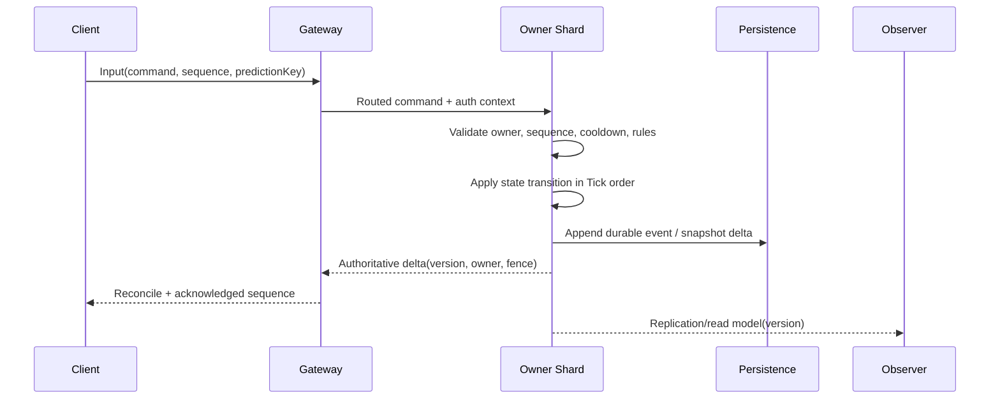
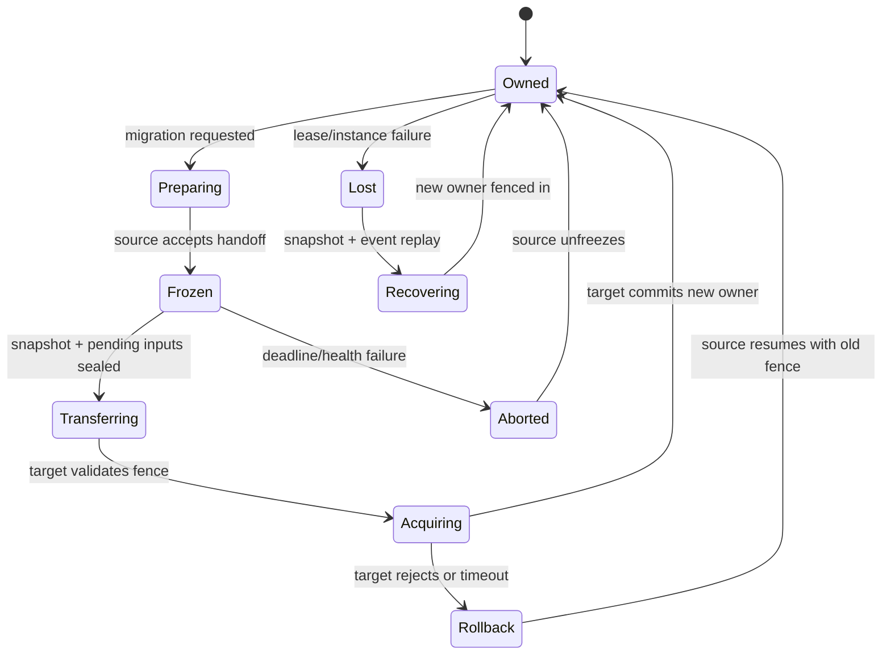

# 07 Entity Ownership 与 Authority

> 知识基线：实时游戏服务器的权威模拟与实体所有权模型；本文不把网络连接所有权、数据库主从和平台实例租约混为一谈。
> 版本基线：通用 C++/Go/伪代码示例；接入 UE、ECS 或自研 Actor Runtime 时，以实际线程和复制实现为准。
> 适用范围：World/Scene/Zone 分片、Entity 生命周期、客户端预测、跨服迁移、并发消息和故障接管。
> 最后更新：2026-08-18（补齐 Entity generation、权威租约、fencing token 与迁移边界）。
> 外部依据：[Kubernetes Lease](https://kubernetes.io/docs/concepts/architecture/leases/)、[Gaffer On Games: Networked Physics](https://gafferongames.com/post/networked_physics_2004/)、[Raft extended paper](https://raft.github.io/raft.pdf)。
> 知识成熟度：L2（模型、状态机、失败路径和验证矩阵已成文；未宣称具体项目已接管生产实体）。

## 1. 概述

Entity Ownership（实体所有权）回答一个实时服务器最容易被忽略的问题：**当前哪一个逻辑执行单元，有权提交这个实体的下一次状态变更？** Authority（权威）则回答：**哪一个状态版本可以被客户端、其他服务和恢复流程当成事实？**

如果没有明确的所有权，常见症状包括：

- 两个 Zone 同时处理同一个玩家，位置和血量互相覆盖；
- 旧服在迁移完成后仍发送 Buff 到期、AI 决策或网络更新；
- 客户端预测写入服务器权威字段，重连后出现“回滚”或重复扣除；
- Entity ID 被复用，旧异步任务命中新实体；
- 租约过期后旧进程继续写入，形成双主（split brain）；
- 只迁移实体快照，没有迁移定时器、输入序号、未决事件和连接上下文。

Ownership 不是一个 `owner_id` 字段就结束。它是一组可验证的不变量：

1. 一个可写实体在一个逻辑时刻只有一个提交者；
2. 每次提交都带 generation/version/fencing token，旧持有者无法覆盖新持有者；
3. 所有跨线程、跨 Zone、跨进程操作都通过消息或迁移协议；
4. 迁移期间实体有明确的冻结、转移、恢复和失败补偿状态；
5. 客户端只能提交输入或意图，不能直接提交权威状态；
6. 恢复和回放能够解释每个状态版本来自哪个 owner 和输入序号。

## 2. 概念边界

| 概念 | 英文 | 核心问题 | 常见误解 |
| --- | --- | --- | --- |
| 实体 | Entity | 被世界模拟的可寻址对象 | 等同于网络连接 |
| 逻辑所有者 | Logical Owner | 哪个 Shard/Scene 提交更新 | 等同于当前玩家客户端 |
| 权威状态 | Authoritative State | 可被接受为事实的版本 | 等同于客户端显示值 |
| 输入拥有者 | Input Owner | 谁能提交该实体的控制输入 | 不代表谁能写血量 |
| 复制观察者 | Replication Observer | 谁需要收到状态变化 | 观察者没有写权限 |
| 生成号 | Generation | ID 复用后的世代隔离 | 只用 Entity ID 就够 |
| 版本号 | Version | 状态提交的单调序列 | 业务时间戳可替代 |
| 栅栏令牌 | Fencing Token | 让旧 owner 的写入被拒绝 | lease 续期即永久拥有 |
| 租约 | Lease | 有时限的 owner 倾向 | 不是状态迁移本身 |
| 迁移 | Handoff/Migration | 所有权从 A 转给 B | 复制一个快照就结束 |
| 预测 | Prediction | 客户端提前展示输入结果 | 客户端成为权威 |
| Reconcile | 对账/校正 | 用权威状态修正预测状态 | 直接丢弃全部输入 |

## 3. Ownership 不变量

### 3.1 单写者不变量

对每个 `EntityID + Generation`，同一时刻只能有一个 `WritableOwner`。如果业务需要多个线程并行计算，计算结果必须回到 owner shard 按序提交，不能让多个线程直接写共享组件。

### 3.2 读者与写者分离

AOI、观战、统计和日志服务可以拥有只读副本，但副本必须标出 `source_owner` 与 `source_version`。读副本延迟不是数据损坏，隐式写入才是。

### 3.3 版本单调

同一实体的权威版本 `state_version` 必须单调递增。跨服务消息乱序到达时，低版本消息只能被丢弃、转存或进入补偿队列，不能覆盖高版本状态。

### 3.4 旧 owner 必须可被栅栏

Lease 失效、迁移完成或进程恢复后，旧 owner 即使仍运行，也必须在持久化层和目标分片前被拒绝。只依赖“旧进程应该已经退出”不构成安全保证。

## 4. Owner 的层级

实时服务器通常同时存在四个层次的 owner：

| 层次 | 示例 | 生命周期 | 写权限 |
| --- | --- | --- | --- |
| Entity owner | `Shard-7` | 秒到小时 | 提交战斗/移动/AI |
| Scene owner | `Scene-42` | 一局或一个实例 | 管理实体集合与 Tick |
| Zone owner | `Zone-A` | 分线/地图生命周期 | 管理区域边界和迁移 |
| Instance owner | `DS-abc` | 平台进程生命周期 | 承担进程状态和连接 |

上层 owner 变化时，下层实体必须通过协议迁移或重建；不能只更新平台标签。`instance_id` 变了而 Entity 仍认为旧 `shard_id` 有效，是最常见的“幽灵写入”来源。

## 5. Entity ID、Generation 与句柄

### 5.1 为什么 ID 必须带世代

假设实体 42 被销毁，稍后槽位复用给新实体。旧 Timer、网络包或异步查询若只带 `42`，就可能把旧操作应用到新实体。安全引用应为：

```text
EntityHandle = { id: 42, generation: 18 }
```

查询时同时匹配 `id` 和 `generation`；销毁时 generation 递增或分配新不可复用代号。整数溢出边界要有测试，不能让 generation 回绕后旧消息再次有效。

### 5.2 句柄失效策略

| 情况 | 处理 |
| --- | --- |
| 目标不存在 | 丢弃并记录 `entity_not_found` |
| generation 不匹配 | 丢弃并记录 `stale_handle` |
| owner 不匹配 | 转发到当前 owner 或返回 `NotOwner` |
| 版本落后 | 丢弃/拉取增量，禁止覆盖 |
| 迁移中 | 暂存输入，或返回可重试状态 |

### 5.3 组件所有权

实体中的组件也要有边界。位置、速度、战斗资源等权威组件通常由 World owner 写；渲染标签、客户端动画状态是派生或观察数据；跨系统请求用命令消息，不把组件指针泄露给外部线程。

## 6. 权威命令链路



关键点：Gateway 只做身份、路由和协议保护；Owner Shard 才做玩法校验和状态提交；Persistence 记录可恢复证据；Observer 只读。客户端的 `predictionKey` 用于把本地表现和权威结果对应起来，不是权限字段。

## 7. Authority 状态机



状态机必须区分 `Preparing`（还可撤销）和 `Frozen`（不再接受普通写入）。目标 owner 在 `Acquiring` 阶段拿到新的 fencing token 后，源 owner 即使网络恢复也不能继续提交。

## 8. Lease 与 Fencing Token

### 8.1 Lease 的作用

Lease 只表达“某个 owner 在一段时间内仍被认为活跃”。它需要续期、过期、时钟误差和网络分区处理。Lease 不能替代实体状态迁移；它只是接管资格的一部分。

### 8.2 Fencing 的作用

每次重新获取所有权都分配单调递增的 `fence`：

```text
old owner: fence=41
new owner: fence=42

write(fence=41) -> reject
write(fence=42) -> accept if version/owner match
```

持久化层、跨服代理和目标分片都应检查 fence。若只有内存中的 fence，进程重启后会丢失栅栏效果。

### 8.3 时钟不确定性

不要把本地 wall clock 到期时间直接当作 Lease 的唯一事实。使用带租期版本的存储或协调服务，并留出网络延迟与时钟误差；旧 owner 在失去续租响应后应主动停止写入，而不是继续“猜测自己还拥有”。

## 9. 客户端预测边界

客户端可以预测移动、镜头和部分表现，但服务器仍负责：

- 输入序列是否属于这个玩家和当前 Entity；
- 输入序号是否重复、跳跃或过期；
- 速度、加速度、碰撞、技能冷却和资源消耗；
- 预测结果与权威状态如何 reconcile；
- 服务器拒绝时客户端如何回滚并重放尚未确认输入。

建议把输入设计为不可变命令：

```text
InputCommand {
  entity_handle
  input_sequence
  client_tick
  buttons / analog_axes
  prediction_key
  auth_context_hash
}
```

服务器保存最近的已确认序号和有限输入窗口。窗口外的命令按业务返回 `TooOld`，不要无限接受历史输入，否则重放和作弊检测都失去边界。

## 10. 跨线程消息与并发规则

### 10.1 Owner mailbox

每个 owner shard 有一个有界 mailbox。外部线程提交命令时只复制必要数据，不传递指向 World/Entity 的裸指针。Mailbox 满时按优先级拒绝、合并或降级，不能无限增长。

### 10.2 读快照

观测和统计可读取不可变快照：owner 在 Tick 末尾发布 `PublishedVersion`，读者只读该版本。不要用“读写都不加锁”的共享结构冒充快照；需要明确发布/获取内存序或复制策略。

### 10.3 跨 shard 操作

跨 shard 技能、交易或传送要拆成请求、预留、提交/取消的协议。一个线程同时锁住两个 shard 会形成死锁和不可预测 Tick；优先使用消息和两阶段业务状态机。

## 11. 迁移前必须封存的状态

迁移快照至少列出：

| 类别 | 示例 | 处理 |
| --- | --- | --- |
| 权威组件 | transform、属性、战斗资源 | 全量或增量快照 |
| 输入游标 | last_accepted_sequence | 搬迁后继续校验 |
| Timer | Buff/重连/无敌帧 deadline | 保存逻辑 deadline，目标重建 |
| 未决命令 | 已接收未执行输入 | 按序转移或明确拒绝 |
| AOI 关系 | 观察者/被观察者 | 目标重新计算，不盲拷贝指针 |
| 连接上下文 | session、reconnect ticket | 与 DS/网关协议对接 |
| 版本信息 | schema、规则、配置版本 | 目标检查兼容矩阵 |
| 审计上下文 | trace、match、因果链 | 保留以便回放和追责 |

只拷贝位置和血量的“轻迁移”适合无状态 NPC，不适合玩家或战斗实体。迁移协议必须明确哪些状态重建、哪些状态丢弃、哪些状态需要补偿。

## 12. 典型实现骨架

以下为示意伪代码，展示 fence、generation 和版本检查：

```cpp
Result EntityStore::Apply(Command cmd) {
    auto entity = lookup(cmd.handle.id);
    if (!entity || entity->generation != cmd.handle.generation)
        return Result::StaleHandle;
    if (entity->owner_shard != shard_id())
        return Result::NotOwner;
    if (cmd.fence != entity->fence)
        return Result::Fenced;
    if (cmd.sequence <= entity->last_sequence)
        return Result::Duplicate;
    if (!rules_.Validate(cmd, *entity))
        return Result::Rejected;

    entity->Apply(cmd);
    entity->last_sequence = cmd.sequence;
    ++entity->state_version;
    publish_delta(*entity);
    return Result::Accepted;
}
```

实现中还要处理命令跨 Tick 排序、持久化失败、发布失败和重试。示例没有把所有失败都简化成“return false”，因为诊断需要区分 stale、fenced、duplicate 和 rejected。

## 13. 迁移握手示例

```text
Source -> Coordinator: Prepare(entity, sourceFence=41, sourceVersion=900)
Coordinator -> Target: Reserve(entity, targetFence=42)
Source -> Target: FrozenSnapshot(version=900, timers, inputCursor)
Target -> Target: Validate schema, rules, zone capacity, checksum
Target -> Coordinator: Acquire(entity, fence=42, version=900)
Coordinator -> Source: FenceOldOwner(41)
Target -> Persistence: CommitOwner(fence=42, version=900)
Target -> Source: HandoffAccepted
Target -> Client: Reconnect/route update + authoritative snapshot
```

任何一步超时都要有唯一结果：源继续拥有并解冻，或目标接管并让源失效。禁止两个方向都返回“成功”，也禁止依赖人工查看日志决定谁是 owner。

## 14. 失败路径与恢复

| 失败 | 可观察症状 | 安全处理 |
| --- | --- | --- |
| 源冻结后目标不可用 | 玩家卡在迁移中 | 过期回滚，源按旧 fence 恢复 |
| 目标已提交源未收到 ACK | 双方都认为失败 | 以持久化 fence 查询事实，重放确认 |
| 旧源网络分区 | 旧服继续发包 | 目标/存储拒绝旧 fence |
| ID 复用 | 旧命令命中新实体 | generation 不匹配即丢弃 |
| Timer 未迁移 | Buff/重连行为消失 | 从逻辑 deadline 重建并对账 |
| 输入乱序 | 位置跳回/重复扣费 | sequence 窗口 + 幂等命令 |
| 规则版本不兼容 | 目标无法解释快照 | 拒绝接管或执行显式迁移脚本 |
| 协调服务不可用 | 无法确认 owner | 停止新迁移，保守保持现状并告警 |

恢复流程应能回答“最后一个可接受版本是什么、谁提交、哪个 fence 生效、哪些输入未执行”。只看最后一条日志无法替代版本化状态。

## 15. 观测与审计

最小指标：

- `entity_owner_count{shard,zone}`：当前 owner 数量；
- `entity_fence_reject_total{reason}`：旧 fence/租约拒绝数；
- `entity_stale_handle_total`：generation 不匹配数；
- `entity_mailbox_depth{shard,priority}`：命令积压；
- `entity_handoff_duration_ms`：迁移耗时分布；
- `entity_handoff_rollback_total{reason}`：迁移回滚；
- `entity_reconcile_total{reason}`：客户端校正次数；
- `entity_version_gap_total`：观察者发现的版本跳跃；
- `entity_dual_owner_alarm_total`：协调面检测到的双 owner。

日志字段至少包含 `entity_id`、`generation`、`source_owner`、`target_owner`、`source_fence`、`target_fence`、`state_version`、`input_sequence`、`trace_id` 和结果。对玩家标识做脱敏，保留能关联回放的内部键。

## 16. 验证矩阵

### 16.1 单元测试

- ID 复用后旧句柄永远不能命中新实体；
- version/fence 乱序写入只接受最新合法提交；
- 同一命令重试只产生一个状态变化；
- owner mailbox 满时关键命令和低优先级命令分别符合策略；
- Timer 到期时 generation 不匹配会 Expired。

### 16.2 集成测试

| 场景 | 注入 | 通过标准 |
| --- | --- | --- |
| Zone 迁移 | 目标启动慢 1~5 秒 | 无双写，玩家最终只看到一个权威版本 |
| 网络分区 | 源与协调面短暂断开 | 旧 fence 写入被拒绝 |
| 进程崩溃 | 冻结/传输/接管各阶段杀源 | 可恢复或明确回滚，不出现半状态 |
| 重连 | 迁移后客户端重连 | 输入序号和快照对账正确 |
| 高峰 | 10K Entity 同时迁移请求 | mailbox、CPU、P99 有界，拒绝策略可解释 |

### 16.3 回放与压测

保存迁移前后的命令序列、规则版本、随机源和 fence，离线重放应得到相同的持久化摘要。压测同时看 owner 分布、迁移耗时、AOI 重算量、Timer backlog 和网络批量，不能只看迁移 API 的 QPS。

## 17. 最佳实践清单

- [ ] 权威写入点唯一且可查。
- [ ] 所有句柄包含 generation，所有接管包含 fencing token。
- [ ] Entity、Scene、Zone、Instance 的 owner 层级不混用。
- [ ] 客户端发送输入，不发送权威状态。
- [ ] 跨线程/跨 Zone 走消息或迁移协议，不共享裸指针。
- [ ] 迁移快照列出 Timer、输入游标、未决事件和版本。
- [ ] 旧 owner 被 fence 后不能继续写持久化层。
- [ ] 迁移失败只能回滚或接管，不能出现双成功。
- [ ] 观测数据带 owner、fence、version 和 trace。
- [ ] 通过故障注入、重连、回放和容量测试后才提高成熟度。

## 18. FAQ

### Q1：玩家客户端是不是输入 owner？

客户端是输入来源和预测执行者，不是权威状态 owner。服务器必须验证输入属于当前会话、Entity 和序列窗口。

### Q2：一个实体能不能多个服务共同写？

可以有多个服务计算建议或维护只读投影，但最终状态提交需要一个明确 owner。若确实跨服务写，采用命令/事务协议并定义冲突解决，不要共享内存式地同时写。

### Q3：Lease 续期成功就代表可以写数据库吗？

不一定。数据库或存储层仍需检查 fencing token 和版本。Lease 只是存活信号，不能防止旧进程在网络分区后继续写。

### Q4：迁移时要不要把所有 AOI 观察者一起搬走？

通常不搬指针。目标根据新位置、Zone 和观察规则重新计算 Interest Set；必要时用短期迁移事件避免重复 Enter/Leave。

### Q5：为什么不直接复制整个内存对象？

内存对象包含线程句柄、缓存指针、Timer 回调和不可序列化资源。迁移需要版本化快照和可重建状态，而不是地址空间复制。

## 19. 关联阅读

- [03-Entity生命周期与组件模型](03-Entity生命周期与组件模型.md)：ID、generation、组件和销毁队列。
- [04-Scene-Map-Zone与实例管理](04-Scene-Map-Zone与实例管理.md)：场景与区域边界。
- [05-AOI与InterestManagement](05-AOI与InterestManagement.md)：迁移后重新计算观察集合。
- [02-Timer时间轮与延迟任务](02-Timer时间轮与延迟任务.md)：Timer owner、任务取消和 deadline 重建。
- [08-跨Zone与跨服迁移](08-跨Zone与跨服迁移.md)：把所有权状态机落到跨区协议。
- [13-世界Snapshot与故障恢复](13-世界Snapshot与故障恢复.md)：崩溃后从快照和事件恢复权威状态。
- [游戏服务端/04-平台与可靠性/03-幂等重试与消息语义](../04-平台与可靠性/03-幂等重试与消息语义.md)：状态机、租约和消息语义。

## 20. 更新日志

- 2026-08-18：新建 Entity Ownership 与 Authority 专题，补齐单写者、generation、租约/fence、预测边界、迁移封存、故障注入和审计指标；示例均为示意实现。
