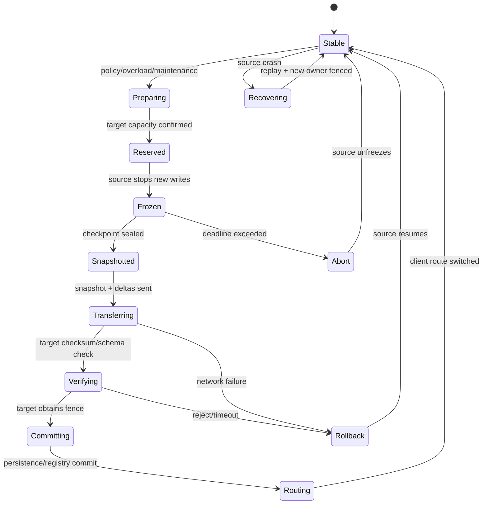
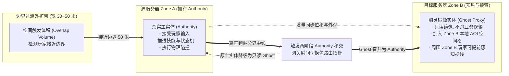

# 08 跨 Zone 与跨服迁移

> 知识基线：实时游戏服务器的 Zone/Shard/World handoff；本文关注运行时状态迁移，不替代数据库迁移与平台区域容灾。
> 版本基线：通用协议、状态机和伪代码示例；具体传输、序列化、协调服务和云平台以项目清单为准。
> 适用范围：无缝世界、分线、实例切换、玩家/队伍迁移、NPC 迁移、断线重连与故障接管。
> 最后更新：2026-08-18（补齐跨 Zone 迁移协议、冻结快照、路由切换、失败回滚和重连边界）。
> 外部依据：[Kubernetes Lease](https://kubernetes.io/docs/concepts/architecture/leases/)、[Kubernetes Deployment](https://kubernetes.io/docs/concepts/workloads/controllers/deployment/)、[Raft extended paper](https://raft.github.io/raft.pdf)。
> 知识成熟度：L2（迁移状态机、协议字段、失败路径和测试矩阵已成文；未宣称接入具体线上集群）。

## 1. 概述

跨 Zone/跨服迁移（Handoff / Migration）是把一个正在运行的实体或场景，从旧的逻辑所有者安全交给新的逻辑所有者。它不是“复制一份 JSON 再改路由”，而是一次带版本、租约、冻结、重建和确认的状态转移。

迁移要同时处理四条链：

1. **状态链**：权威组件、输入序号、Timer、未决事件和规则版本；
2. **所有权链**：源 owner、目标 owner、fencing token 和提交版本；
3. **连接链**：客户端路由、重连票据、JIP（Join In Progress）和旧连接摘流；
4. **观测链**：trace、迁移阶段、耗时、回滚原因和最终一致性校验。

没有明确的迁移协议，系统会落入两个危险极端：要么为了避免双写而长时间冻结玩家，要么为了体验允许旧服和新服同时写，最终在战斗、背包和聊天状态上产生不可解释的分叉。

## 2. 迁移类型与选择

| 类型 | 典型场景 | 状态范围 | 连接处理 | 风险 |
| --- | --- | --- | --- | --- |
| 同进程分片迁移 | Shard 负载均衡 | Entity + Timer + mailbox | 路由更新 | 线程边界错误 |
| 同集群跨 Zone | 无缝世界、分线 | Entity/Scene/AOI 关系 | 短暂转发或重连 | 双 owner |
| 跨 Dedicated Server | DS 换代、实例回收 | 玩家/队伍/对局状态 | 新端点/票据 | 版本不兼容 |
| 跨区域迁移 | 灾备或就近调度 | 可恢复业务状态 | DNS/网关切换 | 延迟、复制滞后 |
| 故障恢复接管 | 进程崩溃 | Snapshot + Event | 客户端重连 | 重放重复 |

选择原则：先判断“能否冻结”和“能否重建”。NPC、投射物等短生命周期对象可以丢弃并重生；玩家、资产、对局结果必须有可验证的状态迁移或补偿路径。

## 3. 迁移不变量

### 3.1 单一权威

任何 `EntityHandle(id, generation)` 在迁移完成前都只能有一个可写 owner。源与目标都准备好不等于两个都能写；目标必须先获取新 fence，源才真正失效。

### 3.2 版本连续或可解释

迁移前后的 `state_version` 可以连续，也可以在显式恢复点跳跃，但必须保留 `source_version`、`target_version` 和校验摘要。观察者收到的版本跳跃要能通过 snapshot 或 delta 解释。

### 3.3 路由切换原子可观察

客户端可能在切换窗口发送旧端点请求。网关需要根据 `route_epoch` 判断转发、拒绝或返回新端点；不能仅依赖 DNS TTL 或客户端“应该已经刷新”。

### 3.4 失败只有两种终态

迁移失败最终只能回到源 owner 并解冻，或由目标 owner 接管并 fence 源。不能留下“源以为成功、目标以为失败”的半状态。

## 4. 端到端状态机



每个阶段要有 deadline、幂等键和可查询状态。重试同一 `migration_id` 不应创建第二个目标实体或第二次发放奖励。

### 4.1 边界缓冲与幽灵代理（Boundary Buffering & Ghost Proxy）

在连续无缝大世界（Seamless Open World）中，为了杜绝跨越 Zone 边界时的“黑屏加载条”或“角色瞬移动态卡顿”，工业级游戏服务端采用**边界过渡带（Border Transition Zone）+ 幽灵镜像代理（Ghost/Proxy Entity）**机制：



1. **预热阶段（Pre-warming）**：
   - 玩家进入距边界 50 米缓冲区时，Zone A 通过内网向 Zone B 发起预留请求；
   - Zone B 在本地内存预分配实体插槽，生成只读 `Ghost Proxy`，并将其加入 Zone B 的 AOI 网格中；
   - Zone B 内的原住玩家此时已经能够在远端平滑看到该玩家走过来（消除“走到脸上突然刷出来”的视觉瑕疵）。
2. **移交瞬间（Authority Handoff）**：
   - 当玩家坐标跨越绝对中线时，触发两阶段握手协议；
   - 网关层收到协调者指令，原子递增 `route_epoch`，将客户端后续所有的 UDP 输入包直接转发给 Zone B；
   - Zone B 将 `Ghost Proxy` 瞬间原地提升为拥有绝对权威的 `Authority Entity`；
   - Zone A 降级为 Ghost，并在 3 秒宽限期后优雅销毁内存资源。客户端无任何感知，连招与移动完全不间断。

## 5. 迁移协议字段

### 5.1 请求与预留

```json
{
  "migration_id": "mig-20260818-00042",
  "entity_id": 42,
  "generation": 18,
  "source_zone": "zone-a",
  "target_zone": "zone-b",
  "source_owner": "shard-a7",
  "target_owner": "shard-b3",
  "source_fence": 41,
  "route_epoch": 9001,
  "source_version": 1208,
  "schema_version": 7,
  "reason": "zone_overload",
  "deadline_ms": 3000,
  "trace_id": "trace-..."
}
```

`migration_id` 是协议幂等键；`generation` 防止 ID 复用；`source_fence` 和 `source_version` 让目标知道从哪个事实点接收；`route_epoch` 让网关识别旧请求。

### 5.2 快照与增量

冻结时形成一个不可变 `snapshot_version`，之后产生的变化进入有限 delta buffer。目标先加载快照，再按序应用 delta；如果 delta 超过上限，迁移应回滚或重新开始，不能无限缓存导致内存爆炸。

```text
World Tick 4100: snapshot(v=1208)
Tick 4101..4104: delta[1209..1212]
Target load snapshot(v=1208)
Target replay delta in order
Target verify checksum(v=1212)
```

### 5.3 要迁移的内容

| 内容 | 传输 | 目标动作 |
| --- | --- | --- |
| 权威组件 | 全量/压缩快照 | 反序列化并校验 |
| 输入游标 | last accepted sequence | 丢弃旧输入 |
| Timer | 逻辑 deadline、task key、generation | 重新注册 |
| 未决命令 | 有序命令或明确拒绝列表 | 按策略重放 |
| 规则/配置版本 | 版本号与校验摘要 | 检查兼容矩阵 |
| 持久化租约 | fence/owner epoch | 目标先获取 |
| AOI 关系 | 通常不直接拷贝 | 目标重新计算 |
| 连接上下文 | session、ticket、route epoch | 网关切换 |
| 审计上下文 | trace、match、因果 ID | 追加迁移事件 |

## 6. 冻结与一致快照

### 6.1 冻结边界

冻结不是暂停整个进程，而是对目标实体或 Scene 设置写入门槛：

- 继续处理必要的网络确认和迁移控制消息；
- 拒绝普通玩法写入，或放入有界 pending 队列；
- 允许只读查询，但返回 `state=FREEZING`；
- Timer 只推进到迁移快照边界，之后由目标重建；
- 记录最后接受的输入序号和 Tick。

### 6.2 快照一致性

单线程分片可以在 Tick 边界直接复制；多线程或跨组件场景需要版本化快照、写时复制或短暂停顿。不要在多个组件分别序列化后拼出一个没有共同版本号的“快照”。

### 6.3 校验摘要

对规范化序列化结果计算 checksum，字段排序、浮点格式和压缩方式必须稳定。checksum 只用于发现传输/实现错误，不是安全认证；需要防篡改时再使用带密钥的签名或受保护通道。

## 7. 路由、连接与重连

### 7.1 网关路由

网关保存 `entity/session -> route_epoch -> endpoint`。切换时先把旧端点标记为 `Draining`，短时间内可以转发幂等查询，但拒绝新的状态写入。新端点确认 `Stable` 后，再发布新 epoch。

### 7.2 客户端握手

客户端收到 `MIGRATION_NOTICE` 时保存 `migration_id`、新端点和重连票据。重连请求必须带：

```text
session_id
entity_handle
migration_id
route_epoch
last_server_version
last_accepted_input_sequence
ticket_expiry (monotonic checked by server)
```

服务器根据目标 owner 的权威状态返回完整快照或增量。客户端不得用本地预测状态覆盖服务器快照，只能重放快照之后仍未确认的输入。

### 7.3 JIP 与观战

JIP 观察者不需要拥有实体。目标 owner 先发布一个稳定快照，再按正常 AOI/复制规则发送后续 delta。迁移事件不应让观察者看到同一实体同时 Spawn 两次；可用 `entity_handle + state_version` 去重。

## 8. Timer、AOI 与未决消息

### 8.1 Timer

Timer 回调不能随对象地址搬迁。只保存逻辑 deadline、任务键、owner shard 和 generation，目标在获得 fence 后重新注册。详见 [02-Timer时间轮与延迟任务](02-Timer时间轮与延迟任务.md)。

### 8.2 AOI

目标根据新 Zone、位置和观察规则重新计算 Interest Set。直接复制旧 AOI 指针会保留已离开 Zone 的观察者，产生幽灵 Enter/Leave。迁移窗口可以发一个带 epoch 的 `EntityHandoff` 事件，让观察者抑制重复表现。

### 8.3 未决命令

迁移开始后收到的命令有三种处理：

1. 排队到目标并在新 owner 按序执行；
2. 返回 `RetryAfterMigration`，让客户端带原 sequence 重试；
3. 对不可重试命令明确拒绝并触发补偿。

不能把消息简单复制两份给源和目标，否则即使业务有幂等键，也会让冷却、表现和审计出现双重副作用。

## 9. Fence、租约与提交顺序

推荐顺序如下：

```text
1. Coordinator reserve target
2. Source freeze and seal snapshot
3. Target validate snapshot/schema/capacity
4. Coordinator issue targetFence = sourceFence + 1
5. Target persist owner/fence/version
6. Gateway publish route_epoch + target endpoint
7. Source receives fence and stops writes
8. Target opens gameplay writes
9. Source releases resources after grace window
```

关键约束是第 5 步必须发生在第 8 步之前。只在内存注册表中切 owner 而不持久化或不让存储检查 fence，会让源进程在网络恢复后重新写回旧状态。

## 10. 迁移伪代码

以下为示意流程，不代表某个云平台 SDK：

```go
func Migrate(ctx context.Context, req Request) Result {
    if !idem.Start(req.MigrationID) { return idem.Result(req.MigrationID) }
    target, err := coordinator.Reserve(ctx, req)
    if err != nil { return rollback("reserve", err) }

    snap, err := source.FreezeAndSnapshot(req.Entity, req.SourceFence)
    if err != nil { return rollback("freeze", err) }

    if err = target.Validate(snap); err != nil {
        source.Unfreeze(req.Entity)
        return rollback("validate", err)
    }
    fence := coordinator.IssueFence(req.Entity)
    if err = target.PersistOwner(req.Entity, fence, snap.Version); err != nil {
        return recover_or_rollback("persist", err)
    }
    gateway.Publish(req.Session, target.Endpoint, req.RouteEpoch+1)
    target.OpenWrites(req.Entity, fence)
    source.FenceAndDrain(req.Entity, fence)
    return success(req.MigrationID, fence)
}
```

生产实现还要加超时、上下文取消、checksum、schema migration、重试和审计事件。示例故意把 `rollback` 和 `recover_or_rollback` 分开：持久化已提交后，盲目回滚源可能造成双主。

## 11. 版本与规则兼容

迁移目标可能运行不同服务端版本。协议需要兼容矩阵：

| 源 schema | 目标 schema | 处理 |
| --- | --- | --- |
| 同版本 | 同版本 | 直接恢复 |
| 旧版本 | 向后兼容新版本 | 显式升级脚本/默认值 |
| 新版本 | 旧版本 | 通常拒绝，或走降级导出 |
| 规则版本不同 | 不可证明等价 | 禁止热迁移，安排维护窗口 |
| 配置版本不同 | 可重算 | 保存配置版本并固定本次对局 |

不要在迁移代码里静默“猜”缺失字段。缺失字段有默认值时要记录迁移动作和规则版本，便于回放和审计。

## 12. 失败路径

| 阶段 | 故障 | 处理 |
| --- | --- | --- |
| Reserve | 目标无容量 | 源继续服务，记录拒绝原因 |
| Freeze | 源正在长事务 | 延长但受 deadline 限制，超时取消 |
| Transfer | 网络中断 | 重试同一 migration_id，超限回滚 |
| Validate | checksum/schema 不匹配 | 丢弃目标临时状态，源解冻 |
| Persist | 目标 owner 已写入 | 查询 fence 事实，走确认/接管，不盲回滚 |
| Routing | 网关发布失败 | 目标保持只读，修复路由或回到源 |
| Reconnect | 客户端带旧 ticket | 返回迁移状态/新 ticket，拒绝旧 epoch |
| Source drain | 旧进程未停 | fence 拒绝旧写，保留证据后强制回收 |

每个失败都要让客户端看到可行动结果（重试、等待、重新登录或补偿），不能只返回 generic 500。服务端内部应保存 `migration_stage`，恢复线程可以继续未完成流程。

## 13. 过载与动态分线

迁移是降载手段，不是无限扩容的替代品。触发迁移前必须检查：目标容量、迁移带宽、AOI 重算 CPU、数据库/消息队列压力和客户端体验。

当 Zone 过载时，可按以下顺序：

1. 先降低低优先级 AOI/AI 更新；
2. 停止把新玩家分配到过载 Zone；
3. 选择边界清晰、Timer/战斗状态少的实体迁移；
4. 为源保留回滚窗口，观测 P99 和 mailbox；
5. 迁移成功且稳定后再释放源容量。

动态分线的详细容量模型属于 [09-动态分线与负载均衡](09-动态分线与负载均衡.md)，本篇只定义迁移协议和安全边界，避免与平台扩缩容重复。

## 14. 观测与告警

建议指标：

- `migration_started_total{reason,source_zone,target_zone}`；
- `migration_stage_duration_ms{stage}`；
- `migration_inflight{zone}`；
- `migration_success_total`、`migration_rollback_total`；
- `migration_timeout_total{stage}`；
- `migration_snapshot_bytes`、`migration_delta_bytes`；
- `migration_checksum_mismatch_total`；
- `migration_route_epoch_reject_total`；
- `migration_reconnect_latency_ms`；
- `migration_dual_owner_alarm_total`。

日志事件采用同一 `migration_id` 串联 Prepare、Freeze、Snapshot、Acquire、Route、Stable/Rollback。告警要区分“目标容量不足”和“协议错误”，否则自动扩容会掩盖实现 bug。

## 15. 验证矩阵

### 15.1 正确性

- 同一个 `migration_id` 重试 10 次只生成一个目标实体；
- 源/目标消息乱序不会让低版本覆盖高版本；
- 旧 fence 写入持久化层和目标 owner 都被拒绝；
- Entity ID 复用时旧 Timer、旧输入和旧连接全部失效；
- 迁移前后关键资产、战斗资源和输入游标校验一致。

### 15.2 故障注入

| 注入点 | 观察 |
| --- | --- |
| Freeze 后 kill source | 目标能否从快照接管或安全回滚 |
| Acquire 前断网 | 是否保持单 owner |
| Persist 后阻断 ACK | 重试是否查询事实而非重建 |
| 路由切换期间重复输入 | sequence/epoch 是否去重 |
| 目标版本缺字段 | 是否拒绝或执行显式升级 |
| 10K Entity 批量迁移 | CPU、带宽、P99、内存和 mailbox 是否有界 |

### 15.3 回放

迁移日志应能重建：源快照、delta 顺序、输入游标、Timer deadline、fence、route epoch 和最终 checksum。回放工具若只能复现“迁移失败”，却无法说明哪个阶段的版本不一致，说明证据字段不够。

## 16. 最佳实践清单

- [ ] 迁移有唯一 migration_id、deadline 和状态机。
- [ ] 目标先预留、校验，再取得新 fence。
- [ ] 源冻结边界明确，普通写入不绕过 mailbox。
- [ ] 快照有共同版本和稳定 checksum。
- [ ] Timer、未决命令、输入游标和规则版本进入迁移清单。
- [ ] AOI 关系在目标重算，不复制裸指针。
- [ ] 路由使用 epoch 和短期旧端点 drain。
- [ ] 重连票据短时效且绑定 migration_id/entity generation。
- [ ] 持久化已提交后不盲目回滚源。
- [ ] 迁移耗时、回滚和 dual owner 有告警。
- [ ] 通过断网、杀进程、乱序和容量测试后才提高成熟度。

## 17. FAQ

### Q1：为什么不能先改网关路由，再复制状态？

客户端会把输入发给尚未准备好的目标，源又可能继续写，造成丢输入或双写。正确顺序是目标预留与快照验证后，再发布新 epoch。

### Q2：迁移一定要冻结玩家吗？

不一定。可以使用短窗口双缓冲或输入转发，但最终仍需要一个清晰的提交点和 fence。复杂度、延迟和回滚成本通常比短冻结更高。

### Q3：Zone 迁移和数据库迁移是一回事吗？

不是。Zone 迁移是运行时 owner handoff，强调 Tick、连接和临时状态；数据库迁移是 schema/数据结构演进，强调兼容、备份和前向修复。两者可以共享幂等和版本化原则，但不能共用一套状态机。

### Q4：目标校验通过后可以马上释放源吗？

要先完成持久化 owner、路由切换和客户端稳定确认，再经过短 drain/grace window。过早释放会让旧连接和未到达的迁移确认无法诊断。

### Q5：迁移失败时客户端要重登吗？

取决于失败阶段。冻结前/传输失败通常可透明重试；目标已接管后应发新 ticket 和快照；无法证明状态时宁可进入恢复/人工补偿，也不要让客户端继续使用旧状态。

## 18. 关联阅读

- [04-Scene-Map-Zone与实例管理](04-Scene-Map-Zone与实例管理.md)：Map/Scene/Zone 归属和实例分配。
- [05-AOI与InterestManagement](05-AOI与InterestManagement.md)：迁移后的 Interest Set 重新计算。
- [07-EntityOwnership与Authority](07-EntityOwnership与Authority.md)：单写者、generation、lease 和 fencing token。
- [02-Timer时间轮与延迟任务](02-Timer时间轮与延迟任务.md)：Timer deadline、取消和 owner queue。
- [03-Entity生命周期与组件模型](03-Entity生命周期与组件模型.md)：Spawn/Despawn 与实体池。
- [13-世界Snapshot与故障恢复](13-世界Snapshot与故障恢复.md)：崩溃恢复和事件重放。
- [14-运行时背压与过载保护](14-运行时背压与过载保护.md)：过载触发迁移前的降级阶梯。
- [游戏服务端/05-UE Dedicated Server平台化/03-DS会话注册与重连实现](<../05-UE Dedicated Server平台化/03-DS会话注册与重连实现.md>)：DS 会话、JIP 和重连票据边界。

## 19. 更新日志

- 2026-08-18：新建跨 Zone/跨服迁移专题，补齐状态机、冻结快照、fence、路由 epoch、重连、Timer/AOI/未决消息、故障注入和容量验收；动态分线容量模型现由 09 篇承接。
