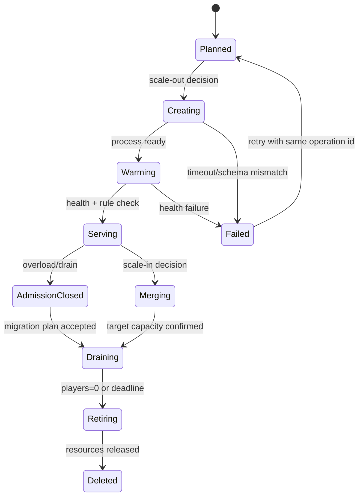
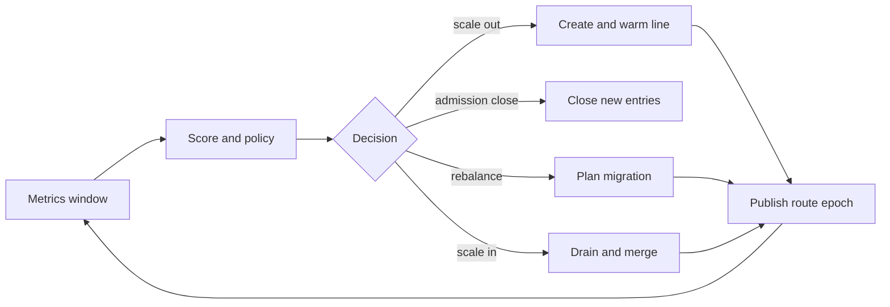

# 09 动态分线与负载均衡

> 知识基线：实时游戏服务器中的动态 Shard/Line（分线）生命周期、容量决策与运行时调度。
> 适用范围：同一逻辑世界内的场景分线、实例化区域、玩家迁入迁出、分线合并和安全回收；不替代跨 Zone 状态迁移协议。
> 版本边界：通用服务端设计；平台编排、数据库和云厂商实现需另行核对。
> 外部依据：[Kubernetes Horizontal Pod Autoscaling](https://kubernetes.io/docs/tasks/run-application/horizontal-pod-autoscale/)、[Kubernetes Lease](https://kubernetes.io/docs/concepts/architecture/leases/)、[OpenTelemetry metrics](https://opentelemetry.io/docs/specs/otel/metrics/)。
> 最后更新：2026-08-20（新增动态分线容量模型、粘性路由、状态机、故障回滚与验证矩阵）。
> 知识成熟度：L2（协议、状态机、指标和测试边界已核对；未宣称已在生产集群运行或完成 Benchmark）。

## 1. 目标与非目标

动态分线把一个逻辑世界映射为多个可独立调度的运行时分片。
每条分线拥有明确的 owner、容量预算、玩家集合和路由 epoch。
控制器根据负载信号创建、迁移、合并或回收分线。
目标是控制 Tick 延迟、连接数、AOI 广播和内存峰值。
目标不是把所有业务平均切成无状态 Web 副本。
目标也不是通过频繁迁移掩盖单实体热点或不合理的战斗算法。

本篇讨论控制平面与运行时协作。
冻结快照、fence、delta 和迁移失败处理以 `08-跨Zone与跨服迁移.md` 为权威。
队列高水位、降级阶梯和恢复滞回以 `14-运行时背压与过载保护.md` 为权威。
本篇只描述触发分线动作的策略、容量模型和调度边界。

## 2. 术语

| 术语 | 含义 | 关键不变量 |
| --- | --- | --- |
| Logical World | 玩家看到的逻辑世界 | 逻辑坐标和规则版本稳定 |
| Line/Shard | 逻辑世界的一条运行时副本 | 单一可写 owner |
| Zone | 空间或业务边界 | 实体有明确归属 |
| Line Set | 同一 Zone 的可选分线集合 | 路由 epoch 可比较 |
| Placement | 玩家/队伍到分线的映射 | 满足粘性与容量 |
| Headroom | 可吸收突发流量的余量 | 不低于安全下限 |
| Hotspot | 单实体或局部 AOI 造成的热点 | 不能仅靠平均值判断 |
| Drain | 禁止新进入并等待存量退出 | 有截止时间 |
| Cooldown | 扩缩容后的稳定观察窗口 | 防止抖动 |
| Control Plane | 选线、生命周期和策略控制器 | 决策可审计、幂等 |
| Data Plane | 分线 Tick、网络和玩法处理 | 按 owner 写入 |
| Route Epoch | 路由版本 | 旧 epoch 请求可拒绝或转发 |
| Sticky Key | 玩家/队伍/社交关系的稳定键 | 同键优先同线 |

## 3. 适用边界与分线粒度

分线粒度由空间连续性、社交关系和状态复制成本共同决定。
大地图适合以 Zone 或兴趣区域切分。
副本适合以 Match/Instance 作为天然分线。
城镇、拍卖行、跨线聊天等共享服务不应被错误复制为每线独占状态。

分线不是数据库分片的同义词。
业务事实（货币、背包、订单）仍由权威持久化服务负责。
运行时实体可在分线间迁移，但迁移必须携带版本和幂等键。

避免以玩家数量作为唯一容量指标。
100 个玩家的大规模战斗可能比 500 个分散玩家更重。
容量模型至少区分在线数、活跃实体、AOI 边数、输入速率、Tick CPU、网络出站和内存。

## 4. 容量信号

### 4.1 硬上限与软信号

硬上限是不可越过的保护线，包括最大连接数、最大实体数、最大内存和最大出站带宽。
软信号用于提前扩容，包括 Tick P95、mailbox 积压、AOI 更新耗时和输入速率。
硬上限触发时先拒绝新进入或转移存量，不等待平均值回落。

建议按 10 秒窗口计算 P50/P95/P99，并保留 1 分钟趋势。
短窗口捕捉尖峰，长窗口避免控制器被单次 GC 或网络抖动触发。

### 4.2 示例容量向量

```text
load = {
  players: active_sessions,
  entities: owned_entities,
  tick_p95_ms: tick_histogram.p95,
  tick_miss_ratio: missed_deadlines / ticks,
  aoi_edges: interest_edges,
  input_rate: accepted_commands_per_second,
  outbound_mbps: egress_bytes * 8 / second,
  mailbox_depth: pending_commands,
  memory_ratio: rss / memory_limit
}
```

权重应按场景配置，不要把不同单位直接相加。
可以先归一化到 [0,1]，再取最大值与加权平均的组合。
`max(normalized)` 用于保护最危险维度。
加权平均用于排序候选线和估计迁移收益。

## 5. 分线评分与触发

定义安全阈值 `T_safe`、扩容阈值 `T_scale_out` 和回收阈值 `T_scale_in`。
必须满足 `T_scale_in < T_scale_out`，形成滞回区间。
扩容需要连续多个采样窗口超过阈值。
回收需要更长稳定窗口、无排空失败和目标线有余量。

示意评分：

```text
score(line) = max(
  tick_p95_ms / tick_budget_ms,
  outbound_mbps / outbound_budget_mbps,
  mailbox_depth / mailbox_budget,
  memory_ratio / memory_soft_limit
) + hotspot_penalty
```

`hotspot_penalty` 由局部 AOI 密度、战斗实体权重和广播扇出得到。
评分不是事实写入，控制器必须记录输入快照和策略版本。

扩容条件示例：

```yaml
scale_out:
  min_windows: 3
  tick_p95_ratio: 0.80
  mailbox_ratio: 0.70
  headroom_after_create: 0.25
scale_in:
  min_stable_minutes: 10
  tick_p95_ratio: 0.35
  max_players: 20
  cooldown_minutes: 15
```

配置示例是伪配置，不代表某个编排平台的可直接部署文件。

## 6. 生命周期状态机



每个状态都应持久化 `line_id`、`generation`、`operation_id`、`route_epoch` 和 deadline。
状态迁移采用 compare-and-set，重复控制器不会创建第二个进程。
`Serving` 之前禁止客户端获得可写路由。
`AdmissionClosed` 仍可服务存量玩家，但拒绝新进入。
`Draining` 只允许可重试查询和迁移控制消息。

## 7. 创建分线

创建流程先在控制平面登记候选 line，再申请运行时资源。
运行时启动后报告规则版本、协议版本、容量预算和健康证明。
预热包括静态地图、脚本、导航、数据表和热点缓存。
预热未完成时不应接收玩家，即使端口已经监听。

最小流程：

1. 生成幂等 `operation_id`。
2. 选择目标 Zone 和资源池。
3. 预留 CPU、内存、网络和实例配额。
4. 启动进程并等待健康检查。
5. 校验规则/schema/config digest。
6. 注册 line generation 和 route epoch。
7. 进入 `Serving`，再开放 admission。

创建失败要释放预留资源，保留失败原因和启动日志摘要。
失败重试使用相同业务意图但新的 attempt 序号。

## 8. 合并与回收

合并不是删除空线，而是把存量玩家安全导向目标线。
控制器先计算目标线接收后的峰值和 headroom。
若目标线在迁移窗口会跨过软上限，合并必须延迟或拆分批次。

回收前执行三阶段：

| 阶段 | 允许操作 | 退出条件 |
| --- | --- | --- |
| AdmissionClosed | 存量服务、迁移预约 | 新进入为零 |
| Draining | 分批迁移、重连、只读查询 | 玩家和可写实体为零 |
| Retiring | flush、注销路由、释放资源 | lease 与连接已撤销 |

到达 drain deadline 仍有玩家时，不应强杀并假设客户端会恢复。
应延长一次有上限的宽限期，随后按优先级迁移或进入故障恢复流程。
强制回收必须产生事故级告警和可审计清单。

## 9. 玩家、队伍与社交粘性

玩家 placement 不能只按当前最小负载选择。
登录重试、断线重连、好友组队和公会活动需要稳定粘性。
粘性键按优先级可为：进行中的 match、队伍 ID、公会活动 ID、社交半径、玩家 ID。

队伍通常采用“整队同线”约束。
若整队无法容纳，应返回可行动的排队或拆队策略，不静默分散。
正在战斗、交易、过场和关键交互中的玩家设置迁移保护窗口。
保护窗口不是永久豁免，应有最大时长和运营解除入口。

好友和聊天可以跨线，通过共享社交服务或跨线消息总线实现。
不要为了好友列表复制全部玩家实体。
观战、排行榜和拍卖行使用只读投影，不取得世界实体 owner。

## 10. Admission 与 placement 算法

候选线过滤顺序：规则兼容、区域延迟、队伍粘性、保护状态、容量硬上限、软负载排序。
先过滤不可用，再对可用集合打分。
随机抖动可减少所有请求同时选择同一条线，但不能突破粘性约束。

```pseudo
function chooseLine(request):
    candidates = servingLines(request.zone)
    candidates = filter(candidates, compatibleRule(request))
    candidates = filter(candidates, withinLatencyBudget(request.region))
    sticky = filter(candidates, sameTeamOrMatch(request))
    if sticky not empty:
        candidates = sticky
    candidates = filter(candidates, capacityHardLimitNotExceeded)
    if candidates empty:
        return QueueOrReject(reason="NO_SAFE_CAPACITY")
    return argmin(candidates, placementScore + stableJitter(request.id))
```

placement 结果写入带 generation 的 registry。
客户端只拿到 route epoch 和 session ticket，不直接决定 owner。

## 11. 路由与会话

网关维护 `session -> line_id -> route_epoch -> endpoint`。
新路由发布采用单调 epoch；旧请求按策略转发、拒绝或返回 `RetryAfter`。
路由切换和 owner 提交必须遵守迁移协议的提交顺序。
不使用 DNS TTL 作为唯一一致性机制。

票据至少绑定 session、player/party key、line generation、route epoch、签发时间和过期时间。
票据重放要被拒绝，过期票据返回重新排队或重新登录。
断线重连优先查询控制平面事实，再访问目标线。

跨线聊天、好友邀请和组队邀请应带业务幂等键。
邀请发送成功不代表目标玩家已进入同线。
UI 必须能显示排队、迁移中、已拒绝和需要重试等状态。

## 12. 数据一致性

分线内实体采用单写者模型。
跨线共享事实使用版本化命令、事件或持久化事务。
禁止两个分线同时修改同一资产或战斗结算记录。

事件字段建议包括：`event_id`、`aggregate_id`、`aggregate_version`、`line_generation`、`operation_id` 和 `occurred_at`。
消费者按版本检查缺口，重复事件按 `event_id` 幂等。
结算类命令要有唯一业务键，迁移重试不得重复发奖。

迁移期间的未决输入按 sequence 排序。
旧 line 关闭写入后，目标 line 只能从已确认版本继续。
不可证明连续时，宁可进入恢复队列，也不要合并两个猜测状态。

## 13. 热点与局部拆分

平均负载正常不代表没有热点。
热点检测至少按 Zone、AOI cell、实体类型和广播扇出分组。
单一 Boss 或活动可能需要独立实例、事件批处理或规则降级。

局部拆分优先选择边界清楚、玩家关系弱、Timer 少的实体集合。
拆分前先评估跨线 AOI 边、碰撞、战斗目标选择和脚本引用。
若跨线交互成本超过节省的 Tick CPU，应保留同线并启用降级。

## 14. 背压、降级与扩缩容协作

过载时先执行低成本、可逆的降级：降低低优先级 AI、减少远端 AOI 更新、限制非关键广播。
然后关闭 admission，最后才迁移或创建分线。
扩容本身会消耗 CPU、网络和控制面配额，不能在资源已枯竭时无限重试。

分线控制器读取背压状态，但不复制背压状态机。
降级恢复必须先于 scale-in，避免回收后立即重新扩容。
所有阈值采用滞回和 cooldown，防止“创建—回收—创建”振荡。

## 15. 故障与回滚

控制器重启：从持久化 line registry 重建观察，不依据内存缓存重复创建。
运行时进程崩溃：标记 line 为 `Failed`，冻结新 admission，按快照/事件恢复或迁移。
路由服务不可用：保留旧 epoch 的有限 drain，禁止发布未经确认的新 owner。
目标线预热失败：删除临时资源，源线继续服务。
目标线已接管但 ACK 丢失：查询 fence 和 registry 事实，执行确认，不盲目回滚。

回滚条件必须可判定：

- 目标尚未获得 fence 且源仍可写；
- 目标校验失败且没有持久化提交；
- 路由未发布且迁移 deadline 未过期。

已持久化 owner 的流程只能走接管、重试确认或恢复，不能把源重新标为可写。

## 16. 可观测性与 SLO

核心指标：

- `line_serving_total{zone,rule}`；
- `line_player_count`、`line_entity_count`；
- `line_tick_p95_ms`、`line_tick_miss_ratio`；
- `line_aoi_edges`、`line_outbound_mbps`；
- `line_mailbox_depth`、`line_memory_ratio`；
- `line_scale_out_total`、`line_scale_in_total`；
- `line_operation_duration_ms{operation,state}`；
- `line_admission_reject_total{reason}`；
- `line_migration_inflight`、`line_migration_rollback_total`；
- `line_route_epoch_reject_total`；
- `line_dual_owner_alarm_total`。

每次决策记录 trace、策略版本、输入窗口、候选线、被选原因和结果。
SLO 示例：99% 的普通进入请求在 2 秒内获得可用路由；99.9% 的服务 Tick 不超过预算；排队拒绝必须可解释。
这些数值是待项目确认的示例目标，不是已测结果。

告警按用户影响分级：Tick 超时、无法进入、迁移卡死、双 owner 和资产结算错误优先级最高。
仪表盘同时展示单线分布与集群聚合，避免平均值掩盖长尾。

## 17. Mermaid 控制闭环



指标窗口到决策再回到指标窗口形成闭环。
任何动作都要经过容量预估和幂等操作记录。

## 18. 控制器伪代码

```pseudo
loop every policy_interval:
    snapshot = metrics.readWindow()
    registry = lines.readConsistent()
    decisions = policy.evaluate(snapshot, registry)
    for d in decisions:
        if cooldown.active(d.key): continue
        if not capacity.reserve(d.resources):
            audit.reject(d, "capacity-reservation-failed")
            continue
        op = operations.start(d.idempotencyKey)
        result = executor.run(op, d)
        audit.record(op, result, snapshot.policyVersion)
```

控制器不直接修改运行时实体。
执行器通过明确的 admission、迁移和路由接口操作数据面。
控制器重试必须先查询 operation 状态。

## 19. 测试矩阵

| 类别 | 场景 | 断言 | L2 边界 |
| --- | --- | --- | --- |
| 策略 | 连续超阈值 | 只创建一次 | 仿真输入，非生产数据 |
| 滞回 | 阈值上下抖动 | 不振荡 | 需长期压测确认 |
| 粘性 | 队伍满线 | 整队排队或明确拆队 | 未验证真实社交规模 |
| 路由 | 旧 epoch 请求 | 拒绝/转发可解释 | 未接入真实网关 |
| 迁移 | 重复 operation | 目标只生成一次 | 复用 08 的协议边界 |
| 故障 | 控制器重启 | registry 恢复且不重复创建 | 未宣称 HA 实测 |
| 故障 | 目标预热失败 | 释放预留、源继续服务 | 需环境注入 |
| 热点 | 单 Boss 广播 | 识别局部热点而非平均值 | 未有生产 trace |
| 容量 | 连接/内存硬上限 | admission 保护 | 需项目预算 |
| 回收 | drain deadline | 宽限或事故告警 | 未验证客户端版本 |
| 数据 | 重复结算事件 | 幂等不重复发奖 | 需业务存储测试 |
| 观测 | 指标缺失 | 决策降级或报警 | 需 OTel pipeline |

建议先做确定性策略单元测试，再做带故障注入的控制器集成测试，最后进行容量和长稳测试。
测试结果必须记录样本、版本、硬件、窗口和 P50/P95/P99；本篇没有声称这些测试已运行。

## 20. 验证与成熟度边界

当前文档提供可审查的协议、状态机、伪代码和测试设计，属于 L2。
L3 需要可运行的分线模拟器或测试环境。
L4 需要真实 P50/P95/P99、CPU、内存、网络和迁移耗时证据。
L5 需要线上事故、容量复盘或生产数据，并保留脱敏证据。

不得因为写出了指标名或“未做 Benchmark”就把成熟度升级到 L4。
控制器在真实项目中还需验证编排器限速、区域延迟、账务一致性、客户端版本和运营策略。

## 21. FAQ

### Q1：为什么不按玩家数平均分线？

战斗、AOI 和广播扇出使每个玩家权重不同；必须组合多个信号。

### Q2：分线越多越好吗？

不是。跨线社交、复制和控制面成本会上升，过多分线还会降低世界连续性。

### Q3：扩容后能立刻回收旧线吗？

不能。需要 cooldown、drain、路由确认和目标 headroom。

### Q4：队伍能否自动拆到不同分线？

只有业务明确允许时才可拆分，并须向玩家显示边界；默认优先整队同线。

### Q5：控制器重复执行会不会创建双线？

持久化 operation_id、CAS 状态和资源 reservation 是必要条件；仅靠内存锁不够。

## 22. 关联阅读

- [04-Scene-Map-Zone与实例管理](04-Scene-Map-Zone与实例管理.md)：空间归属与实例边界。
- [05-AOI与InterestManagement](05-AOI与InterestManagement.md)：AOI 成本与广播扇出。
- [07-EntityOwnership与Authority](07-EntityOwnership与Authority.md)：单写者、generation 和 fence。
- [08-跨Zone与跨服迁移](08-跨Zone与跨服迁移.md)：冻结快照、路由 epoch 和失败回滚。
- [14-运行时背压与过载保护](14-运行时背压与过载保护.md)：过载阈值、降级和滞回。
- [游戏测试与质量](../../游戏测试与质量/README.md)：容量、故障注入与回归门禁。

## 23. 变更记录

- 2026-08-20：新建动态分线与负载均衡专题；完成容量信号、生命周期、粘性路由、数据一致性、故障回滚、观测 SLO、伪代码和测试矩阵；L2 边界明确，未声明运行结果。
