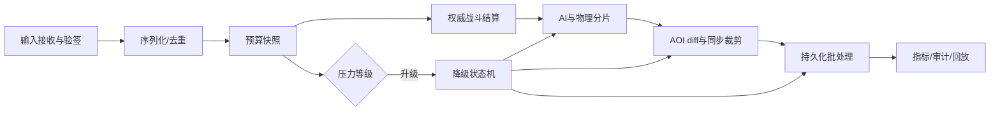
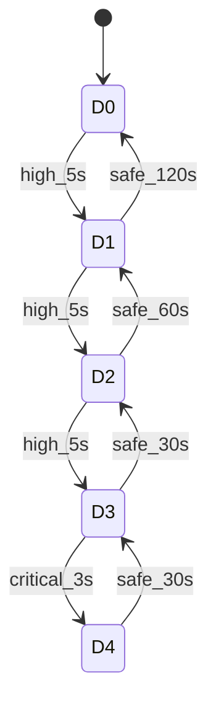

# 10-大规模战斗与降级

> 知识基线：大规模战斗运行时的负载建模、预算分层、确定性结算与渐进降级。
> 适用范围：MMO、多人竞技、PVE 事件及跨 Zone 战斗。
> 本文是规划正文，不声称已有生产实测；示例阈值须用目标硬件标定。
> 知识成熟度：L2（设计与验证计划，未完成目标规模实测）。
> 最后更新：2026-08-20

## 1. 问题边界

大规模战斗的风险不是单一 CPU 峰值，而是输入、模拟、同步、持久化相互放大。
同一 Tick 内必须区分不可丢失的权威结算与可延迟的表现更新。
服务端拥有最终状态，客户端只提交意图，不提交伤害结果。
降级的目标是保持规则公平、可恢复和可解释，而不是让所有模块同时变慢。

### 1.1 负载变量

| 符号 | 含义 | 采样粒度 |
| --- | --- | --- |
| Np | 活跃玩家数 | Zone/1s |
| Ne | 战斗实体数 | Zone/Tick |
| `aoi_send_bytes_per_sec` | AOI 发送字节数 | Zone/1s 窗口 |
| `events_per_tick` | 战斗事件数 | Zone/Tick |
| `physics_constraints_per_tick` | 物理约束数 | Zone/Tick |
| `input_queue_size` | 输入队列长度 | Zone/Tick |
| `tick_wall_time_p99_ms` | Tick wall time P99 | Zone/1s 窗口 |
| `world_lag_ms` | worldLag | Zone/Tick |

综合压力指数使用归一化后的最大值，而不是简单求和：

```text
pressure = max(tick_wall_time_p99_ms/authority_budget_ms,
               events_per_tick/event_budget_per_tick,
               physics_constraints_per_tick/physics_budget_per_tick,
               aoi_send_bytes_per_sec/send_budget_bytes_per_sec,
               input_queue_size/input_queue_max)
```

五项都在同一观测窗口内计算无量纲比率；窗口默认 1 秒：`tick_wall_time_p99_ms` 取窗口内 Tick wall-time 的 P99，`events_per_tick`、`physics_constraints_per_tick`、`input_queue_size` 取窗口内每 Tick 最大值，`aoi_send_bytes_per_sec` 取窗口总字节除以窗口秒数。
伪代码中的 `zone.*` 字段是观测层已按上述规则预聚合的统计量；每项预算直接比较单 Tick 或每秒速率，不再乘窗口内 Tick 数。
每个分母必须为正，分母为零时配置非法并拒绝启动；`clamp(x,0,+inf)` 保留超载幅度。
T 使用窗口内 Tick wall-time P99，E/P/Q 使用窗口内每 Tick 最大值，A 使用窗口总字节/秒。

必须同时压测均匀分布、热点团战、远程技能风暴、复活潮和跨 Zone 边界。
公平性维度包括输入采纳顺序、伤害结算顺序、冷却消耗、掉落归属和延迟补偿。
同一优先级的玩家不能因网络连接顺序或机器分片不同获得额外攻击机会。

## 2. 预算分层

每个 Zone 持有独立预算账本，调度器在 Tick 开始读取只读快照。
预算分为硬预算、软预算和恢复预算。

| 层级 | 内容 | 超限动作 |
| --- | --- | --- |
| L0 权威 | 命中、资源、死亡、交易、反作弊 | 延后处理，绝不静默丢弃 |
| L1 玩法 | 状态机、Buff、仇恨、关键 AI | 分帧，保留因果顺序 |
| L2 交互 | AOI Enter/Leave、近战碰撞 | 合并、限流、短暂延迟 |
| L3 表现 | 远端位置、粒子提示、非关键 AI | 降频、采样、丢弃旧帧 |
| L4 后台 | 统计、回放、非关键持久化 | 暂停或批处理 |

推荐把 Tick 预算拆成 50% 权威与玩法、20% 同步、15% 物理、10% AI、5% 余量。
比例只是起点，必须以目标硬件的 P99 而非平均值重标定。
任何模块不得从其他层借用硬预算而不记账。

### 2.1 公平性预算

输入按服务器接收的单调序列号排序，并以 `tick_id` 固定结算窗口。
同 Tick 同优先级事件按 `(arrival_seq, actor_id, event_id)` 稳定排序。
超出输入上限时拒绝重复或过期意图，保留最新移动意图和全部权威战斗意图。
技能施放、资源扣减、伤害结算进入可靠队列，队列满时施加连接级背压。

## 3. Tick 流程



每个阶段写入 `budget_used`、`work_done`、`work_deferred` 和 `drop_reason`。
阶段之间只传递不可变事件批次，避免并行写同一实体。
Zone 内采用单写者或明确 ownership，跨线程消息带 generation 和 tick_id。
结算批次提交前做资源不变量检查，失败则隔离批次并报警。

## 4. 降级阶梯

降级顺序遵循“先不影响权威，再影响远端表现”。

| 等级 | 触发示例 | Interest | 更新频率 | AI/物理 | 持久化 |
| --- | --- | --- | --- | --- | --- |
| D0 | pressure < 0.85 | 正常 | 正常 | 正常 | 正常 |
| D1 | P99 > 0.85 持续 5s | 合并 Update | NPC 2/3 频率 | AI 分帧 | 批量 100ms |
| D2 | > 0.95 持续 5s | 远端半径收缩 | 远端 5Hz | 低优先级暂停 | 500ms 批量 |
| D3 | > 1.05 持续 3s | 仅关键实体 | 远端 2Hz | 简化碰撞/AI | 事件优先 |
| D4 | > 1.20 或队列满 | 关键 AOI 白名单 | 关键 20Hz | 只保留权威 | 仅 L0，触发熔断 |

Interest 降级不能删除玩家自身、队友、目标、受击者和战斗日志所需实体。
Enter/Leave 仍需可靠；Update 可合并，旧位置不得覆盖新位置。
非关键 NPC 使用相位轮询，避免全体同帧唤醒形成周期尖峰。
物理降级先关闭远端布娃娃和装饰碰撞，不能关闭命中判定的权威几何。
持久化降级只延长批窗口，不改变交易、掉落、货币的幂等语义。

### 4.1 状态机与滞回



升级阈值与恢复阈值至少相差 10%，恢复时间比升级时间长。
状态转换使用连续窗口，单个尖峰不能触发全局降级。
Zone 级状态优先于全局状态；全局 D3 时仍保留独立 Zone 的 D0 预算。
降级状态写入快照和事件日志，故障接管后从保守等级恢复。
恢复按相反顺序逐级回升，每级至少观察一个窗口。

伪代码：

```text
observe(zone):
  tick_ratio = clamp(zone.tick_wall_time_p99_ms / config.combat.authority_budget_ms, 0, +inf)
  event_ratio = clamp(zone.events_per_tick / config.combat.event_budget_per_tick, 0, +inf)
  physics_ratio = clamp(zone.physics_constraints_per_tick / config.combat.physics_budget_per_tick, 0, +inf)
  aoi_ratio = clamp(zone.aoi_send_bytes_per_sec / config.interest.send_budget_bytes_per_sec, 0, +inf)
  queue_ratio = clamp(zone.input_queue_size / config.combat.input_queue_max, 0, +inf)
  p = max(tick_ratio, event_ratio, physics_ratio, aoi_ratio, queue_ratio)
  if p >= up[level] and window(p) >= up_duration[level]:
      level = min(level + 1, D4)
      emit(DegradeEntered(level, tick_id))
  if p <= down[level] and safe_window >= down_duration[level]:
      level = max(level - 1, D0)
      emit(DegradeExited(level, tick_id))
  apply(level, preserve=[authority, fairness, audit])
```

## 5. 服务端权威与反作弊

服务端重新计算技能合法性、距离、视线、冷却、资源和随机种子。
客户端时间戳只用于排序提示，不能决定伤害生效时间。
移动速度、攻击间隔、目标切换和输入频率均有滑动窗口限额。
随机数由 Zone seed 加事件序列生成，客户端不上传随机结果。
检测到异常时先标记风险并限流，不能因单次抖动回滚合法玩家状态。
审计记录包含 actor、target、ability、tick、输入摘要、规则版本和结果哈希。
回放系统只消费事件，不参与权威路径；回放缺失不得阻塞结算。

## 6. 跨 Zone 战斗

跨 Zone 技能采用源 Zone 提交、目标 Zone 确认的两阶段消息。
消息必须包含 `combat_id`、`source_epoch`、`target_epoch`、`tick_id` 和幂等键。
目标 Zone 仅接受当前 ownership epoch，旧 epoch 消息进入隔离队列。
迁移冻结窗口内，源 Zone 仍负责结算已接收输入，目标 Zone 从快照继续。
跨 Zone 延迟超出窗口时按规则拒绝或补偿，不重复施加伤害。
AOI 在目标 Zone 重算，不能复制源 Zone 的裸指针或缓存兴趣集。
网络断开时以权威事件日志恢复，客户端预测状态全部 Reconcile。

## 7. 配置示例

```yaml
combat:
  tick_hz: 20
  input_queue_max: 256
  authority_budget_ms: 8
  event_budget_per_tick: 8000
  physics_budget_per_tick: 4000
  fairness:
    ordering: arrival_seq_actor_id_event_id
    late_input_window_ms: 100
degrade:
  thresholds: [0.85, 0.95, 1.05, 1.20]
  enter_seconds: [5, 5, 5, 3]
  exit_seconds: [120, 60, 30, 30]
  protected_tags: [self, party, target, attacker, victim]
interest:
  remote_update_hz: [20, 10, 5, 2]
  max_radius_cells: [12, 10, 8, 5]
  send_budget_bytes_per_sec: 100000000
persistence:
  batch_ms: [100, 100, 500, 1000]
  critical_sync: true
```

## 8. 可观测性与 SLO

核心指标：战斗结算 P50/P95/P99、输入排队年龄、worldLag、AOI 发送字节、
降级等级占比、关键事件持久化延迟、跨 Zone 往返、拒绝率和反作弊误报率。
日志必须带 Zone、tick、combat_id、degrade_level 和配置版本。
建议 SLO：关键结算 P99 小于权威预算；关键事件丢失为 0；恢复窗口内不重复结算。
表现 SLO 单列：远端更新延迟、AOI Enter 完成时间和重连快照耗时。
告警分为页面级（D4/关键队列满）、高优先级（D3 持续）和趋势级（D1 占比上升）。
指标按全局、Zone、连接、实体四层聚合，支持从投诉追到具体 tick。

## 9. 故障注入与压测

压测矩阵至少覆盖 1x、1.2x、1.5x、2x 事件率和 1K、10K、50K 战斗实体。
分布包括均匀、单点团战、多个热点、跨 Zone 边界和重连风暴。
注入 CPU 限额、网络丢包/乱序、数据库延迟、消息重复、Zone 重启和时钟跳变。
验收检查：关键事件无丢失、幂等键无重复、结算顺序可重放、D4 可恢复。
记录原始数据到 evidence/server/，本文件不填充未经执行的数字。
L2 边界：尚无目标硬件、目标地图和生产流量下的容量结论。
升级到 L3 前，须完成基准脚本、固定配置、重复三次和置信区间报告。

### 9.1 参考伪代码测试

```text
for scenario in matrix:
  seed = fixed_seed(scenario)
  run_ticks(600, inject=scenario.faults)
  assert(no_duplicate_critical_events())
  assert(replay_hash() == authoritative_hash())
  assert(max_queue_age() < configured_rpo_window)
  export_metrics(raw=true)
```

故障注入不能把测试断言改成“服务未崩溃”这一单一指标。
必须验证公平性、恢复滞回和降级原因可解释。

## 10. 回滚与发布

降级配置采用版本化、签名和 Zone 灰度发布。
新规则先以观测模式计算，不改变实际决策，比较新旧等级差异。
发现关键结算差异时，按配置版本回滚，不回滚已提交的货币或掉落事件。
代码版本与规则版本分离，事件日志记录二者以支持重放。
回滚后保持当前保守等级，连续安全窗口后再恢复，避免立即反弹。
发布门禁包含压测报告、故障注入报告、审计字段检查和人工战斗复核。

## 11. 设计检查清单

- [ ] 权威结算与表现更新有独立预算。
- [ ] 同优先级事件具有确定、可重放的排序。
- [ ] D0-D4 的触发、恢复和保护实体已配置化。
- [ ] AOI、AI、物理、持久化分别有降级动作。
- [ ] 跨 Zone 消息带 epoch、tick 和幂等键。
- [ ] 关键事件队列满时有明确背压而非静默丢弃。
- [ ] 指标可定位到全局、Zone、连接和 combat_id。
- [ ] 压测覆盖热点、跨 Zone、重连和故障注入。
- [ ] 未实测内容明确标为 L2，不把示例阈值当容量承诺。

## 12. 权威一手来源

- [UE Replication Graph](https://dev.epicgames.com/documentation/en-us/unreal-engine/replication-graph-in-unreal-engine)：兴趣管理与复制图官方文档。
- [Unity Netcode for Entities 1.3 manual](https://docs.unity3d.com/Packages/com.unity.netcode@1.3/manual/index.html)：固定在 1.3 主次版本边界的服务器权威与网络实体文档；升级需重新评审。
- [Valve Source Multiplayer Networking](https://developer.valvesoftware.com/wiki/Source_Multiplayer_Networking)：Tick、延迟与客户端预测说明。
- [AWS Builders Library: Using load shedding to avoid overload](https://aws.amazon.com/builders-library/using-load-shedding-to-avoid-overload/)：负载隔离、过载保护与公平性工程实践。
- [OpenTelemetry Metrics](https://opentelemetry.io/docs/concepts/signals/metrics/)：指标语义与可观测性规范。

本文只定义可执行的运行时规划与验证边界；具体实现须在目标项目中完成代码评审、容量测试和安全评审后启用。

## 13. 失败路径与边界语义

输入校验失败时返回明确错误码，不进入战斗队列。
重复 `combat_id` 只返回第一次提交的结果摘要。
事件序列缺口触发重放请求，不能用客户端补发结果填洞。
目标实体已死亡时，后续伤害按照技能规则转为空操作或尸体交互。
技能跨 Tick 时，消耗与效果分别记录同一幂等键。
跨 Zone ownership 不一致时，源端冻结并等待 fence，而非两边竞写。
AOI 白名单过期时重新计算，不沿用旧的降级半径。
网络发送失败只影响表现包，关键事件走可靠通道和补偿队列。
持久化队列超时触发告警和只读保护，禁止继续发放不可追踪奖励。
进程重启后先恢复保守 D3，再根据指标逐级恢复。
配置解析失败拒绝启动该 Zone，并保留上一版本配置。
时钟回拨不改变 `tick_id`，由单调时钟驱动窗口判定。
监控系统不可用时，本地环形缓冲仍记录关键计数器。
反作弊服务不可用时执行本地硬规则，风险事件异步补发。
回放哈希不一致时标记版本差异，不自动修正生产状态。

## 14. 与相邻专题的契约

与 01 主循环约定固定 Tick、catch-up/drop 和剩余预算字段。
与 05 AOI 约定 Enter/Leave 可靠、Update 可合并以及白名单保护。
与 08 跨 Zone 约定冻结快照、路由 epoch、重连和重复消息处理。
与 11 AI 约定分帧调度、可中断寻路和 NPC 频率桶。
与 12 GameClock 约定 tick 时间是权威，worldLag 作为降级输入。
与 13 Snapshot 约定关键事件先入幂等日志，再异步批量落盘。
与 14 背压专题约定高水位、优先级和滞回窗口采用同一配置来源。
所有契约变更需同时更新事件版本、回放适配器和故障注入用例。

## 15. 交付阶段

阶段一完成压力指标、预算账本和可重放输入记录。
阶段二实现 D0-D2，使用观测模式比较不同半径与频率。
阶段三实现 D3-D4、可靠队列和跨 Zone fence。
阶段四运行目标硬件基准，提交 P99、带宽、内存和公平性报告。
阶段五小流量灰度，按 Zone 分批启用并设置一键回滚。
阶段六完成灾备演练、重连风暴演练和长期 soak test。
任何阶段未达到门禁时保持 L2 规划状态，不宣称容量已验证。

## 16. 最小验收记录模板

测试日期、提交版本、规则版本和硬件型号必须填写。
记录实体数、玩家数、事件率、AOI 半径和网络 MTU。
记录每个降级等级的进入 Tick、退出 Tick 和持续时间。
记录关键事件总数、重复数、缺口数和重放哈希。
记录 P50、P95、P99、最大队列年龄与 worldLag。
记录跨 Zone 消息延迟、epoch 拒绝数和重连成功率。
记录持久化批次大小、落库延迟和故障期间 RPO。
记录客户端表现指标，但不得用表现指标替代权威正确性。
记录所有注入故障的开始、结束、恢复动作和责任人。
记录结论的适用范围、未覆盖场景和下一步补测计划。
