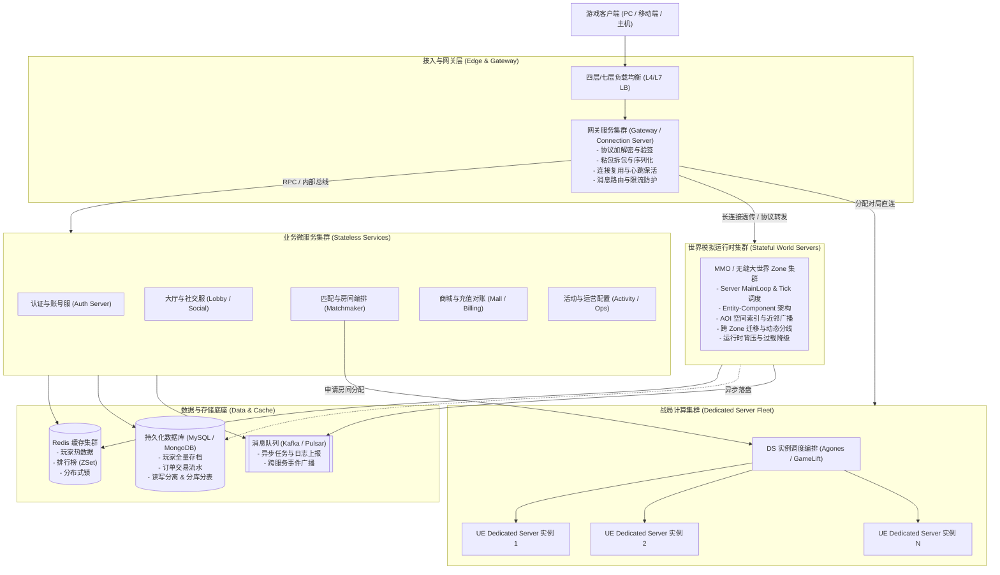
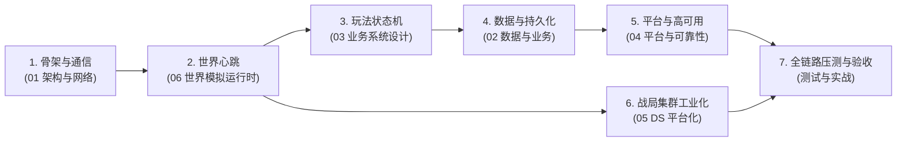

# 游戏服务端 · 知识库

> 游戏服务端工程知识体系：涵盖服务器架构、高吞吐网络通信、帧同步/状态同步、数据持久化与缓存、经典玩法业务系统、企业级高可用治理、UE Dedicated Server 战局平台化，以及 MMO/实时大世界运行时模拟。
>
> 本知识域与 [计算机与工程基础](../00-计算机与工程基础/README.md)、[游戏知识](../游戏知识/README.md)（UE 客户端）、[游戏算法](../游戏算法/README.md)、[游戏AI](../游戏AI/README.md)、[游戏测试与质量](../游戏测试与质量/README.md) 共同构成六大平行技术域；纵向端到端链路见 [系统实战](../系统实战/README.md)。

---

## 游戏服务端工业级架构全景

---

## 核心技术子域

| 子域目录 | 核心定位 | 重点篇目与内容 |
| :--- | :--- | :--- |
| [01-架构与网络](01-架构与网络/README.md) | **架构骨架与网络血管** | 单服/分区分服/微服务/无缝世界选型、TCP/UDP/KCP/QUIC 协议栈、状态同步与帧同步手感控制、Actor 模型与高性能并发模型。 |
| [02-数据与业务](02-数据与业务/README.md) | **数据持久化与安全基石** | MySQL/MongoDB 选型与玩家存档、Redis 缓存穿透/击穿/雪崩与排行榜、分布式锁与高可用、外挂攻防与反作弊合规、容器化运维监控。 |
| [03-业务系统设计](03-业务系统设计/README.md) | **业务状态机与核心玩法** | 背包道具事务与幂等、任务条件树与成就触发、商城订单状态机与防重对账、ELO/MMR 天梯匹配、聊天敏感词过滤、技能框架与战斗权威结算。 |
| [04-平台与可靠性](04-平台与可靠性/README.md) | **平台韧性与企业级治理** | OAuth/JWT 身份模型、令牌桶限流与熔断降级、Exactly-once 幂等表、Transactional Outbox 分布式事务、SLO 告警、跨区容灾多活与灰度发布。 |
| [05-UE Dedicated Server平台化](<05-UE Dedicated Server平台化/README.md>) | **战局工业化编排** | 3D 战局实例生命周期（Allocated/Ready/Draining）、Linux 交叉编译与容器实战、JIP 票据断线重连、崩溃符号化还原、Agones 弹性扩缩容。 |
| [06-世界模拟与运行时](06-世界模拟与运行时/README.md) | **世界模拟引擎心脏** | Main Loop 恒定帧率调度、Timer 多层时间轮、Entity 生命周期、连续大世界 Zone 划分、九宫格/十字链表 AOI 广播裁剪、跨服无缝迁移、过载背压。 |

---

## 工业级游戏服务端的五大核心工程支柱

1. **权威状态机与客户端不可信原则（Server Authority）**：
   - 客户端仅负责用户操作采样与视听呈现表现；
   - 技能释放判定、属性增减、伤害管线计算、掉落概率与货币扣减全部在服务端权威完成（参见 [03-08 技能与战斗框架](03-业务系统设计/08-技能与战斗框架.md) 与 [02-04 安全与反作弊](02-数据与业务/04-安全与反作弊.md)）。
2. **极低网络延迟与海量并发广播控制（Low-Latency Networking & AOI）**：
   - 毫秒级网络协议栈（UDP/KCP/QUIC）结合逻辑帧与快照压缩；
   - 视距裁剪（AOI）与动态降频，确保千人同屏场景下包量随人数按 $O(N)$ 甚至亚线性增长，防止网络带宽与 CPU 广播风暴（参见 [06-05 AOI与InterestManagement](06-世界模拟与运行时/05-AOI与InterestManagement.md)）。
3. **内存权威与异步安全落盘（In-Memory State & Async Persistence）**：
   - 在线玩家状态常驻服务器内存，高频状态变更直接更新内存状态；
   - 通过定周期快照、关键业务点同步、本地事务写 Outbox、以及关服优雅 Drain 机制保障数据绝对零丢失（参见 [02-01 数据库选型与存储设计](02-数据与业务/01-数据库选型与存储设计.md) 与 [06-13 世界Snapshot与故障恢复](06-世界模拟与运行时/13-世界Snapshot与故障恢复.md)）。
4. **强幂等性与最终一致性对账（Idempotency & Eventual Consistency）**：
   - 网络波动、客户端重发与超时重试常态化；
   - 所有涉资业务必须携带全局唯一幂等键（Idempotency Key），配合唯一键去重流水表实现 Exactly-once 业务语义（参见 [04-03 幂等重试与消息语义](04-平台与可靠性/03-幂等重试与消息语义.md) 与 [04-04 分布式事务与最终一致性](04-平台与可靠性/04-分布式事务与最终一致性.md)）。
5. **过载背压与柔性降级（Backpressure & Graceful Degradation）**：
   - 当服务器遭遇突发流量或局部热点导致 Tick 耗时超标时，自适应触发降级阶梯；
   - 优先丢弃低优先级广播（如远离视距的移动插值），降低 AI 巡逻 Tick 频率，保护核心战斗逻辑与心跳响应（参见 [06-14 运行时背压与过载保护](06-世界模拟与运行时/14-运行时背压与过载保护.md) 与 [04-02 限流熔断背压与过载保护](04-平台与可靠性/02-限流熔断背压与过载保护.md)）。

---

## 推荐学习与进阶路径

1. **第一阶段：骨架与通信（01 架构与网络）**
   - 重点掌握：[01-01 服务器架构模式](01-架构与网络/01-服务器架构模式.md) → [01-02 网络通信与协议设计](01-架构与网络/02-网络通信与协议设计.md) → [01-03 帧同步与状态同步](01-架构与网络/03-帧同步与状态同步.md)。
   - 目标：建立权威服务器世界观，搞定网络协议粘包拆包与同步机制选型。
2. **第二阶段：世界模拟与心跳（06 世界模拟与运行时）**
   - 重点掌握：[06-01 ServerMainLoop与TickScheduler](06-世界模拟与运行时/01-ServerMainLoop与TickScheduler.md) → [06-05 AOI与InterestManagement](06-世界模拟与运行时/05-AOI与InterestManagement.md) → [06-08 跨Zone与跨服迁移](06-世界模拟与运行时/08-跨Zone与跨服迁移.md) → [06-14 运行时背压与过载保护](06-世界模拟与运行时/14-运行时背压与过载保护.md)。
   - 目标：深入 MMO / 实时世界的时钟心跳、实体管理与广播裁剪。
3. **第三阶段：玩法状态机（03 业务系统设计）**
   - 重点掌握：[03-01 背包与道具系统](03-业务系统设计/01-背包与道具系统.md) → [03-03 商城与经济系统](03-业务系统设计/03-商城与经济系统.md) → [03-04 匹配与房间系统](03-业务系统设计/04-匹配与房间系统.md) → [03-08 技能与战斗框架](03-业务系统设计/08-技能与战斗框架.md)。
   - 目标：掌握强事务性资产操作与严谨的战斗状态机设计。
4. **第四阶段：数据与平台治理（02 数据与业务 & 04 平台可靠性）**
   - 重点掌握：[02-01 数据库选型与存储设计](02-数据与业务/01-数据库选型与存储设计.md) → [02-02 缓存与排行榜系统](02-数据与业务/02-缓存与排行榜系统.md) → [04-03 幂等重试与消息语义](04-平台与可靠性/03-幂等重试与消息语义.md) → [04-04 分布式事务与最终一致性](04-平台与可靠性/04-分布式事务与最终一致性.md)。
   - 目标：构建千万级高吞吐、零丢单、自动熔断降级的企业级后端。
5. **第五阶段：战局集群与全球化编排（05 UE Dedicated Server 平台化）**
   - 重点掌握：[05-01 UE Dedicated Server实例生命周期与平台化](<05-UE Dedicated Server平台化/01-UE Dedicated Server实例生命周期与平台化.md>) → [05-02 Linux DS部署与容器实战](<05-UE Dedicated Server平台化/02-Linux DS部署与容器实战.md>) → [05-05 DS自动扩缩容与容量规划](<05-UE Dedicated Server平台化/05-DS自动扩缩容与容量规划.md>)。
   - 目标：解决大型 3D 战局服的算力调度、成本优化与跨机房灾备。

---

## 跨域知识协同矩阵

| 关联技术域 | 关联重点篇目 | 协同协作契约 |
| :--- | :--- | :--- |
| **00-计算机与工程基础** | [Linux系统编程](../00-计算机与工程基础/07-Linux系统编程/README.md)、[C++并发模型](../00-计算机与工程基础/04-C++并发与内存模型/README.md) | 基础域提供底座原理（Epoll、原子变量、内存序、无锁环形队列）；服务端域负责组装为游戏业务引擎。 |
| **游戏知识 (UE客户端)** | [网络同步](../游戏知识/06-网络同步/README.md)、[UE DS构建烘焙](<../游戏知识/08-工具链与打包发布/09-UE Dedicated Server构建烘焙与运行.md>) | 客户端域主责引擎 API、Replication Graph 属性同步与客户端预测表现；服务端域主责业务权威与集群调度。 |
| **游戏算法** | [寻路与图论](../游戏算法/01-寻路与图论/README.md)、[确定性工程](../游戏算法/04-确定性与基准工程/README.md) | 算法域提供 A*、Recast/Detour、RVO 纯算法与数学实现；服务端域提供多线程 Tick 调度与时间预算切片。 |
| **游戏AI** | [决策与架构](../游戏AI/01-决策与架构/README.md)、[移动与服务端](../游戏AI/02-移动学习与服务端/README.md) | AI 域负责行为树、状态机与感知决策逻辑；服务端域负责集群承载、Tick 预算截断与并发数据读写保护。 |
| **游戏测试与质量** | [服务端测试与机器人压测](../游戏测试与质量/03-服务端测试与机器人压测.md)、[DS容量评估](<../游戏测试与质量/07-UE DS机器人压测与容量评估.md>) | 服务端域定义对外接口与 SLO 标准；测试域编写 Headless 模拟客户端发起高并发压力测试与混沌故障演练。 |
| **系统实战** | [技能释放完整链路](../系统实战/03-技能释放完整链路.md)、[Buff系统完整链路](../系统实战/04-Buff系统完整链路.md) | 实战域将服务端校验、客户端表现、网络协议串联为端到端可验证的完整工程代码与用例。 |

---

## 文档撰写与演化规范

1. **结构统一**：正文统一按照「核心概念与定义 → 架构与原理详解 → 代码与表结构设计 → 生产最佳实践 → 常见问题与避坑（FAQ）→ 关联阅读与引用」组织。
2. **图文对照**：涉及系统架构、业务交互、协议时序与状态迁移时，必须配以规范的 Mermaid 流程图或时序图。
3. **多语言中立**：示例代码以讲清架构思想、算法逻辑与并发控制为核心，支持 C++ / Go / Lua / C# / Python / SQL 表达，不强行绑定特定框架。
4. **单一事实源**：跨域概念（如 AOI 算法、UE 构建命令）使用相对链接指向主责 Canonical 篇目，杜绝跨域重复维护。
