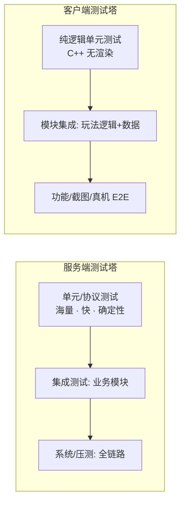
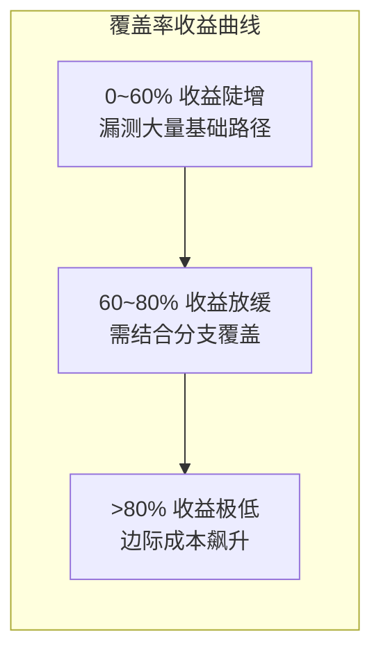

# 01 · 测试金字塔与测试策略

> 本文是「游戏测试与质量」知识库的**策略基石**：先回答"测什么、测多深、在哪个层级测"，再谈"怎么测"。全文围绕测试金字塔（Test Pyramid）展开，并落到游戏行业特有的**客户端 vs 服务端策略差异**与**覆盖率 / ROI 取舍**。

## 概述

游戏项目的测试投入普遍存在两个极端：一是"重手工、轻自动化"，上线前靠 QA 加班点测，回归一次动辄数天；二是"盲目堆自动化"，把大量脆弱的 UI 级端到端测试塞进流水线，维护成本爆炸、红灯不断。

**测试金字塔（Test Pyramid）**是解决上述问题的经典模型：它用"数量倒三角 + 成本正三角"的形式，给出一个可执行的资源配置原则——**底层（单元测试）多而快，上层（E2E 测试）少而慢**。本文的目标是让读者：

1. 掌握金字塔各层级（单元 / 集成 / 系统 / E2E）的定义、职责与成本特征；
2. 理解测试类型（功能 / 性能 / 兼容 / 回归）在游戏项目中的落地方式；
3. 区分白盒 / 黑盒 / 灰盒测试的适用场景；
4. 建立**客户端与服务端差异化**的测试策略视图；
5. 学会用覆盖率与 ROI 数据驱动测试投入的调整，而不是拍脑袋。

核心结论先行：**游戏项目的自动化测试资产应呈现"服务端逻辑 > 客户端逻辑（纯 C++/可脱离渲染）> 集成/系统 > UI 级 E2E"的分布**；凡是能下沉到低层级的测试，就不要放在上层做。

## 核心概念

| 术语 | 英文 | 一句话定义 |
| --- | --- | --- |
| 测试金字塔 | Test Pyramid | Mike Cohn 提出的测试分层模型：单元测试为底座、E2E 测试为塔尖，层级越低数量越多、速度越快、成本越低 |
| 单元测试 | Unit Test | 对最小可测单元（函数 / 类 / 蓝图节点逻辑）的隔离验证，不依赖外部资源 |
| 集成测试 | Integration Test | 验证多个单元/模块协作是否正确，如"战斗模块 + 背包模块"的交互 |
| 系统测试 | System Test | 在完整游戏环境中验证一个系统的端到端行为，可含真实渲染与网络 |
| 端到端测试 | E2E Test（End-to-End） | 模拟真实玩家从启动到核心玩法的完整链路，跨客户端与服务端 |
| 功能测试 | Functional Test | 验证"功能是否符合需求"，关注行为正确性（是/否） |
| 性能测试 | Performance Test | 验证"快不快、稳不稳"，关注帧率、延迟、吞吐、资源占用 |
| 兼容性测试 | Compatibility Test | 验证"在不同设备/系统/分辨率下能否正常运行" |
| 回归测试 | Regression Test | 验证"改动没有破坏既有功能"，是自动化测试的第一价值 |
| 白盒测试 | White-box Testing | 测试者了解内部实现，基于代码结构设计用例（语句/分支/路径覆盖） |
| 黑盒测试 | Black-box Testing | 测试者只看输入输出与需求规格，不关心内部实现 |
| 灰盒测试 | Gray-box Testing | 部分了解内部实现（如数据库表、协议结构），介于黑白之间 |
| 行覆盖率 | Line/Coverage Rate | 被执行的代码行占可执行总行数的比例 |
| 分支覆盖率 | Branch Coverage | 被执行的布尔分支（if/else 两个出口）占全部分支的比例 |
| 路径覆盖率 | Path Coverage | 被执行的独立路径占全部可能路径的比例（成本最高） |
| ROI | Return on Investment | 测试投入产出比：避免的缺陷成本 / 测试编写与维护成本 |
| 可测性 | Testability | 系统被设计得容易测试的程度（依赖注入、确定性、接口化） |

## 原理详解

### 1. 测试金字塔的分层模型

标准金字塔自下而上分为四层（游戏行业常见变体）：

```mermaid
flowchart TB
    subgraph 金字塔[测试金字塔 - 数量与成本示意]
        E2E[E2E 端到端<br/>数量: 极少(约5%) · 成本: 最高 · 速度: 最慢]
        SYS[系统测试<br/>数量: 少(约10%) · 成本: 高 · 速度: 慢]
        INT[集成测试<br/>数量: 中(约15%) · 成本: 中 · 速度: 中]
        UNIT[单元测试<br/>数量: 多(约70%) · 成本: 最低 · 速度: 最快]
    end
    E2E --> SYS --> INT --> UNIT
```

各层级职责与游戏项目中的典型形态：

| 层级 | 典型被测对象（游戏语境） | 运行环境 | 单例耗时 | 失败定位成本 |
| --- | --- | --- | --- | --- |
| 单元测试 | 数值计算函数（伤害公式）、背包数据结构、寻路算法、协议编解码 | 无渲染、无网络（Test 模块/命令行） | 毫秒级 | 极低，直接指向函数 |
| 集成测试 | 技能系统 + 状态效果系统、战斗结算 + 掉落逻辑、DB 层 + 缓存层 | 可无渲染，需要 mock 外部依赖 | 秒级 | 低，指向模块交互 |
| 系统测试 | 一局完整战斗（含 AI、同步）、一次完整登录流程（客户端+网关+DB） | 可无头（headless）或最小渲染 | 秒~分钟级 | 中，需要日志链路 |
| E2E 测试 | 启动游戏→创建角色→新手引导→进副本→结算→退出 | 完整客户端（真机/模拟器）+ 测试服 | 分钟级 | 高，需截图/录像回放 |

**为什么上层必须少？** 三条硬约束：

- **速度**：E2E 一次执行数分钟，若数量上万，CI 永远跑不完；
- **稳定性（Flakiness）**：层级越高，环境变量越多（渲染时序、网络抖动、时钟），假失败率指数上升；
- **维护成本**：UI 一动，UI 级测试跟着改；底层测试几乎不受 UI 变更影响。

### 2. 游戏项目的金字塔"变体"：双塔模型

游戏测试有一个独特问题：**客户端渲染层难以单元化**。因此实践中常用"双塔"：



客户端塔的"塔尖"（真机 E2E）仍然数量有限，但**它承载了服务端塔测不到的体验类风险**（手感、画面、崩溃）；服务端塔则承载了绝大部分**逻辑与容量风险**。理解双塔，是理解 [03-服务端测试与机器人压测](03-服务端测试与机器人压测.md) 与 [02-客户端自动化测试](02-客户端自动化测试.md) 分工的前提。

### 3. 测试类型地图

测试类型（Test Type）与测试层级（Test Level）是正交的两个维度：**层级回答"在哪测"，类型回答"验证什么属性"**。

| 类型 | 验证属性 | 典型手段 | 游戏项目中的例子 | 常驻阶段 |
| --- | --- | --- | --- | --- |
| 功能测试 | 行为正确性 | 用例脚本、自动化断言 | 技能伤害与文案一致；任务可完成可领奖 | 开发期 + 回归 |
| 性能测试 | 速度/资源 | 帧率采集、压测、Profiler | 团战帧率 ≥ 30FPS；登录接口 P99 < 200ms | 里程碑 + 上线前 |
| 兼容性测试 | 环境适配 | 设备矩阵、真机云测 | 骁龙 680 低端机可运行；iOS 14 不闪退 | 上线前 + 版本迭代 |
| 回归测试 | 无破坏 | 全量自动化 + 冒烟 | 改数值表后旧玩法全通过 | 每次合入/发版 |
| 安全测试 | 防作弊/防注入 | 抓包、模糊测试（Fuzz） | 客户端伪造道具购买请求被拒绝 | 持续 + 上线前 |
| 可用性/体验测试 | 易用与手感 | 用户调研、试玩观察 | 新手引导流失率分析 | 阶段评审 |

### 4. 白盒 / 黑盒 / 灰盒

| 维度 | 白盒 White-box | 黑盒 Black-box | 灰盒 Gray-box |
| --- | --- | --- | --- |
| 内部可见性 | 完全可见（源码、结构） | 完全不可见 | 部分可见（协议、DB、配置） |
| 用例来源 | 代码结构（语句/分支/路径） | 需求规格、等价类、边界值 | 规格 + 关键内部约束 |
| 执行者 | 开发自测为主 | QA 手工/自动化为主 | QA + 开发协作 |
| 优点 | 覆盖深、定位快、可自动化 | 贴近用户视角、与实现解耦 | 兼顾两者、能测黑盒测不到的分支 |
| 缺点 | 与实现耦合、改实现即改用例 | 覆盖盲区大、重复劳动 | 需要额外知识投入 |
| 游戏语境 | 伤害公式分支、状态机转换 | 商城购买流程、UI 操作 | 协议字段校验、存档结构验证 |

**选择原则**：白盒测"实现正确性"（开发自测 + 单元测试默认白盒）；黑盒测"需求符合性"（QA 用例默认黑盒）；灰盒用于**关键契约**（协议、存档、配置表），因为这类问题的失败往往跨端、跨团队。

### 5. 客户端 vs 服务端测试策略差异

这是游戏测试最核心的策略分叉，直接决定人力和工具投入：

| 维度 | 客户端（UE/Unity） | 服务端 |
| --- | --- | --- |
| 主要风险 | 体验（卡顿/手感）、崩溃、平台兼容、资源 | 正确性（结算/存档）、并发（超卖/状态竞争）、容量（峰值） |
| 单元测试难度 | 高（引擎耦合、渲染依赖），需抽离纯逻辑 | 低（进程内可跑、易 mock），天然适合 TDD |
| 自动化执行环境 | 需要 GPU/真机/模拟器，成本高 | 无头进程即可，成本低、可大规模并行 |
| 回归重点 | UI 流程、存档、热更新 | 协议兼容、幂等性、数据一致性 |
| 性能验证 | 帧率、内存、功耗（真机） | QPS、P99 延迟、成功率（压测） |
| 崩溃/稳定性 | 必测（闪退是 P0） | 通过混沌测试、长稳测试验证 |
| 测试资产占比（推荐） | 自动化以"纯逻辑单测 + 少量功能/截图"为主 | 自动化可做到高覆盖（单测 + 接口 + 压测） |

一个直接推论：**同一套业务规则（如伤害公式）若同时存在于客户端（表现层预测）与服务端（权威结算），必须以服务端实现为准做验证，客户端只验证"表现一致"**。这一定位与 [游戏服务端](../游戏服务端/README.md) 中"服务端权威（Server Authority）"的架构原则一致。

### 6. 测试覆盖率与 ROI

**覆盖率（Coverage）是手段不是目标。** 它衡量的是"代码被执行了多少"，而不是"行为被验证了多少"。覆盖率曲线呈 S 形：



- **行覆盖率（Line Coverage）**：最常用，但容易被"执行了但没断言"的测试虚高；
- **分支覆盖率（Branch Coverage）**：更有意义，要求 if/else 两个出口都被走到；
- **路径/变异覆盖（Mutation Testing）**：成本最高，用于关键模块（战斗结算、经济系统）。

**ROI 计算框架**：测试投入 = 编写成本 + 维护成本 + 运行成本；测试收益 = 避免线上缺陷成本 + 回归人工成本节省 + 发布提速收益。经验法则：

```
ROI ≈ (线上缺陷损失 × 逃逸率下降幅度) / (测试编写与维护成本)
```

当某个模块的测试"频繁因重构而修改、却从未抓住过 bug"时，该模块的 ROI 为负，应降低覆盖目标甚至删除；反之，核心经济/战斗模块即使覆盖率已达 80%，仍值得补变异测试——**资源应向"缺陷密度高 + 修复成本高"的模块倾斜**。

## 示例

### 示例 1：用覆盖率工具量化现状（Windows + 通用）

**方案 A：llvm-cov（配合 Clang 构建的服务端逻辑）**

```bash
# 编译时开启覆盖率插桩
clang++ -fprofile-instr-generate -fcoverage-mapping -o test_runner test.cpp
# 运行测试并采集
LLVM_PROFILE_FILE=run.profraw ./test_runner
# 合并并生成报告
llvm-profdata merge -sparse run.profraw -o run.profdata
llvm-cov report ./test_runner -instr-profile=run.profdata
llvm-cov show ./test_runner -instr-profile=run.profdata -format=html -output-dir=coverage_html
```

**方案 B：OpenCppCoverage（Windows 下对已有 exe 做动态插桩，无需改构建）**

```powershell
OpenCppCoverage.exe --sources C:\project\server\src --modules GameServer.exe `
  --cover_children --export_type=html:coverage_report -- .\GameServer.exe --run-tests
```

### 示例 2：测试策略矩阵（项目模板可直接改）

| 模块 | 层级（主要） | 类型（主要） | 覆盖率红线 | 负责人 |
| --- | --- | --- | --- | --- |
| 战斗结算（服务端权威） | 单元 + 集成 | 功能 + 白盒 | 行 ≥ 85%，分支 ≥ 75% | 服务端开发 |
| 背包/道具 | 单元 + 接口 | 功能 + 灰盒 | 行 ≥ 80% | 服务端开发 |
| 客户端伤害表现 | 单元（纯逻辑）+ 少量 E2E | 功能 | 行 ≥ 60% | 客户端开发 |
| 登录/支付链路 | 系统 + E2E | 功能 + 安全 | 关键路径用例全量 | QA + 开发 |
| 团战性能 | 系统（压测） | 性能 | P99 延迟红线 | 性能测试工程师 |

### 示例 3：ROI 决策示例

```
场景：某 MMO 的邮件系统
- 自动化测试 120 例，月度维护耗时 40 人时（约 4000 元）
- 过去 6 个月该模块测试共拦截 3 个线上级缺陷，估算避免损失 6 万元
- 同期该模块缺陷逃逸率 15% → 仍有缺陷漏到线上
结论：ROI 为正（6 万 >> 2.4 万），但逃逸率偏高；
行动：补灰盒协议用例（关键契约），而非继续堆 UI 用例。
```

### 7. 测试用例设计方法（与金字塔配套）

金字塔决定"在哪测、测多少"，用例设计方法决定"**单个用例怎么设计才有效**"。常用六种方法：

| 方法 | 英文 | 原理 | 游戏示例 |
| --- | --- | --- | --- |
| 等价类划分 | Equivalence Partitioning | 把输入域划分为若干"等价类"，同类中取一个代表即可 | 等级输入：1~100 为有效类，0 与 101 为无效类 |
| 边界值分析 | Boundary Value Analysis | 缺陷多集中在边界，取边界及相邻值测试 | 背包容量 99/100/101；冷却时间 0 秒/0.1 秒 |
| 判定表 | Decision Table | 用条件组合表覆盖"多条件→多动作"逻辑 | 战斗结算：是否暴击 × 是否格挡 × 是否克制 → 伤害结果 |
| 场景法 | Scenario Testing | 按用户真实操作路径设计用例 | "新手→首充→抽卡→组队→副本"一条链路 |
| 错误推测 | Error Guessing | 凭经验预判易错点直接设计用例 | 断网时点购买、重复点击按钮、快速切后台 |
| 探索性测试 | Exploratory Testing | 边探索边学习边设计，无预设脚本 | 新版本随便玩，重点观察异常状态与边界操作 |

**边界值在游戏中的典型应用**：数值策划表（等级上限、堆叠上限、百分比加成 0%/100%）、时间边界（活动开启前一秒/后一秒、每日刷新瞬间）、数量边界（0 个/1 个/上限个/上限+1 个）。实践中约 70% 的缺陷集中在边界附近，边界值分析是**性价比最高**的黑盒方法。

### 8. 测试环境与数据管理

测试环境（Test Environment）分级管理，是策略落地的物理前提：

| 环境 | 用途 | 数据 | 谁在用 |
| --- | --- | --- | --- |
| 本地环境 | 开发自测、单测 | 本地 mock | 开发 |
| CI 环境 | 门禁测试（单测/接口/静态分析） | 容器化、干净数据 | 流水线 |
| 测试服（Test） | 功能/集成/回归测试 | 接近正式的结构化数据 | QA |
| 灰度服（Staging） | 发布前演练、灰度预演 | 生产脱敏副本 | QA + 运维 |
| 压测服（Perf） | 压测/长稳/混沌 | 机器人账号池 | 性能团队 |

配套三个数据实践：

1. **数据工厂（Data Factory）**：用脚本按需生成测试账号与资产（等级、装备、货币），避免手工改库；
2. **账号资产池**：按测试场景维护"满级号、新号、异常号（负货币/脏数据）"等账号类型；
3. **时间与随机控制**：测试服提供"跳过活动时间、固定随机种子"的后台开关，支撑边界与确定性测试（详见 [03-服务端测试与机器人压测](03-服务端测试与机器人压测.md)）。

### 9. 常见的金字塔反模式

| 反模式 | 形态 | 后果 | 纠正 |
| --- | --- | --- | --- |
| 冰淇淋筒（Ice-cream Cone） | E2E 用例一大堆、单测几乎没有 | 慢、脆、维护爆炸 | 把 UI 用例下沉为逻辑层用例 |
| 奖杯测试（Cupcake） | 只有 UI 冒烟，无深层验证 | 大量逻辑缺陷逃逸 | 从服务端核心逻辑开始补单测 |
| 倒金字塔 | 测试资产集中在系统层 | 反馈慢、定位难 | 按 70/15/10/5 重新分配预算 |
| 100% 覆盖崇拜 | 为覆盖率数字堆废用例 | 维护成本飙升、ROI 为负 | 核心模块 80%+、外围务实 |
| 门禁摆设 | 门禁存在但频繁手动放行 | 测试失去威慑力 | 放行留痕 + 计入质量周报（见 [05-CI质量门禁与缺陷管理](05-CI质量门禁与缺陷管理.md)） |

判断团队是否踩坑的最快方法：**看 CI 全量测试的时长与失败率**。全量 > 1 小时且红灯率 > 5%，大概率存在上层用例过多或环境不稳的问题。

## 最佳实践

1. **先建"测试策略文档"，再写用例**：每个里程碑前明确"测什么层级、什么类型、覆盖率红线、谁负责"，避免测试资产野蛮生长；
2. **坚持金字塔比例**：新功能合入时按"70% 单测 / 15% 集成 / 10% 系统 / 5% E2E"分配自动化预算；
3. **核心逻辑下沉并隔离**：把伤害、掉落、经济规则抽成**不依赖引擎的服务端/共享库逻辑**，这是所有自动化的前提（对应 [游戏服务端](../游戏服务端/README.md) 的"逻辑与表现分离"原则）；
4. **为关键契约补灰盒测试**：协议字段、存档结构、配置表校验，用灰盒用例锁死跨端契约；
5. **覆盖率不设"一刀切"门槛**：核心模块 80%+，外围工具模块 40% 即可，用分支覆盖防止"假覆盖"；
6. **定期做测试资产体检**：每季度统计"测试最近 30 天是否失败过 / 是否拦截过缺陷"，删除无效用例（ROI 为负即删）；
7. **手工测试与自动化分工明确**：自动化覆盖"可回归的确定性验证"，手工覆盖"探索性测试（Exploratory Testing）与体验评审"；
8. **把测试左移（Shift-Left）**：需求评审阶段就给出"可测性检查项"，编码完成时单测已完成，而不是等提测后补。

## 常见问题 FAQ

**Q1：游戏 UI 变化频繁，UI 自动化测试总是坏，是不是不该做 UI 自动化？**
A：不是"不做"，而是"少做、分层做"。UI 级 E2E 只覆盖**高价值主路径**（登录、首充、核心玩法入口），其余用"逻辑层测试 + 少量截图对比（见 [02-客户端自动化测试](02-客户端自动化测试.md)）"替代。UI 自动化用例数建议控制在总自动化用例的 5% 以内。

**Q2：我们团队没写过单元测试，从哪开始？**
A：从**服务端业务逻辑**开始（收益最大、环境最干净），用 TDD 风格给结算、背包、任务三个系统各补 20~30 个用例；再抽客户端纯逻辑（如伤害公式）补单测。先跑通"一个模块、一条流水线、一个覆盖率报告"，再横向扩展。

**Q3：覆盖率 90% 了，为什么线上还有严重 bug？**
A：三种常见原因：① 覆盖率虚高（执行了但无断言）；② 覆盖的是"代码路径"而非"行为契约"（跨模块/跨端问题测不到）；③ 环境差异（真机渲染、弱网、数据异常）未覆盖。对策：看**分支覆盖 + 断言质量**，补灰盒与系统级用例。

**Q4：手工测试会被自动化完全取代吗？**
A：不会。游戏的"手感、画面、音效、付费心理"等体验维度难以断言化；探索性测试在版本迭代期仍是发现深层次问题的主力。合理的配比是：**自动化解决 70% 的回归负担，手工聚焦 30% 的探索与评审**。

**Q5：测试金字塔对"买量小游戏/休闲游戏"还适用吗？**
A：适用但需调整：小游戏生命周期短、迭代快，可砍掉大部分系统级与 E2E 用例，把预算集中到"服务端结算逻辑单测 + 关键路径冒烟 + 兼容性云测"三件事上。金字塔的原则是"成本与价值的平衡"，不是教条的数量比。

**Q6：怎么向管理层证明测试投入的价值？**
A：用三个数字讲故事：① **逃逸率**（漏到线上的缺陷占比）逐季度下降曲线；② **回归成本**（一次全量回归的人时数）因自动化而下降；③ **线上事故**（P0/P1 故障数）与测试投入的负相关。详见 [05-CI质量门禁与缺陷管理](05-CI质量门禁与缺陷管理.md) 的质量度量章节。

**Q7：冒烟测试（Smoke Test）、回归测试（Regression）、全量测试（Full Test）怎么编排？**
A：冒烟测试是"核心链路快速验证"（几十条用例、分钟级），每次合入必跑；回归测试是"改动影响面验证"（模块级，按变更范围选择用例集），合入与提测时跑；全量测试是"发版前完整验证"（含性能/兼容/长稳），版本级跑。三者是"快→中→全"的漏斗关系，时间预算大致为 10 分钟 / 1 小时 / 数小时~1 天。

**Q8：测试左移（Shift-Left）具体怎么落地？**
A：四个动作：① 需求评审阶段 QA 参与并输出"可测性检查项"；② 设计评审阶段开发给出"关键分支清单"，QA 据此预设计用例；③ 编码阶段用 TDD/单测先行，提测前开发自测完成 80% 用例；④ 静态分析与代码评审前置到 MR 阶段。左移的目标是让缺陷在"引入阶段"就被发现（对应 [05-CI质量门禁与缺陷管理](05-CI质量门禁与缺陷管理.md) 的 MTTD 指标）。

**Q9：测试策略文档（Test Strategy）应该包含哪些内容？**
A：建议一页纸起步，包含七块：① 范围（本版本测什么、不测什么）；② 分层预算（单测/集成/系统/E2E 的用例配比）；③ 类型清单（功能/性能/兼容/回归各自的范围与红线）；④ 环境与数据（测试服、账号池、时间控制开关）；⑤ 门禁与发布条件（覆盖率、通过率、性能红线）；⑥ 风险清单（高缺陷密度模块、第三方依赖、平台差异）；⑦ 人力与排期（谁在什么阶段做什么）。策略文档随版本迭代更新，是 [05-CI质量门禁与缺陷管理](05-CI质量门禁与缺陷管理.md) 门禁阈值的事实来源。

## 关联阅读

- [游戏测试与质量 README](README.md)：全库导航与测试体系全景图；
- [02-客户端自动化测试](02-客户端自动化测试.md)：金字塔"客户端塔"的落地工具（UE Automation / Functional / 截图）；
- [03-服务端测试与机器人压测](03-服务端测试与机器人压测.md)：金字塔"服务端塔"的落地工具（协议测试 / 确定性单测 / 压测）；
- [04-性能兼容与网络异常测试](04-性能兼容与网络异常测试.md)：性能/兼容/网络异常三类非功能测试的实操；
- [05-CI质量门禁与缺陷管理](05-CI质量门禁与缺陷管理.md)：覆盖率与通过率如何成为流水线门禁；
- [游戏知识](../游戏知识/README.md) `07-UI与性能优化`：客户端性能基线如何支撑性能测试指标；
- [游戏服务端](../游戏服务端/README.md) `01-架构与网络`：服务端权威架构如何决定"以服务端为准"的测试策略。
