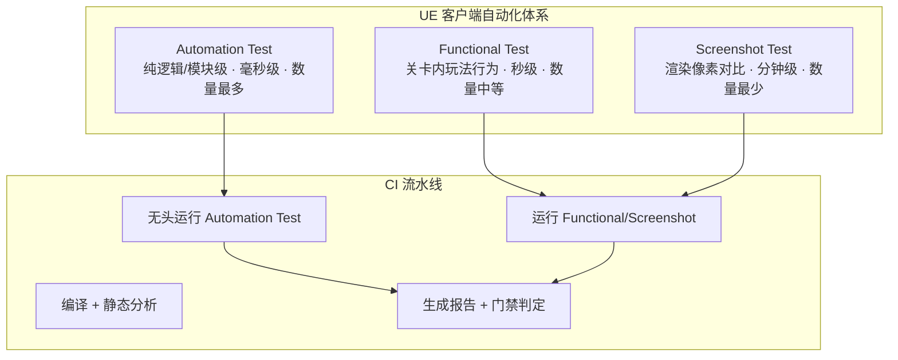
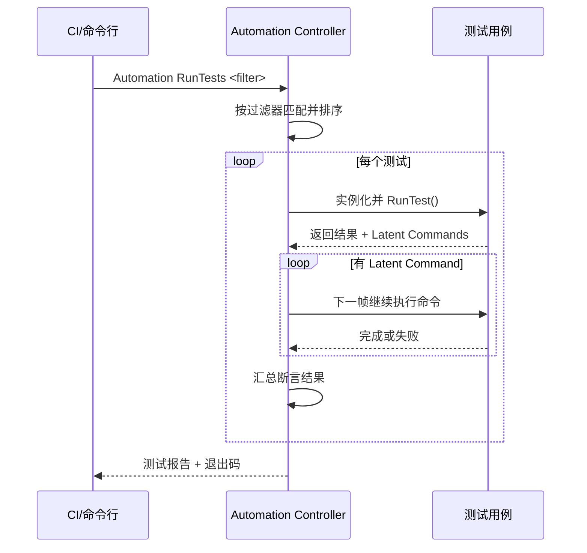

# 02 · 客户端自动化测试（UE 体系为主）

> 本文讲解 Unreal Engine 的自动化测试体系：Automation Test（C++/蓝图单元与集成测试）、Functional Test（关卡内功能测试）、Screenshot Test（截图对比测试），以及它们如何接入 CI；最后与 Unity Test Framework 做横向对比。前置知识见 [游戏知识](../游戏知识/README.md) 的 `08-工具链与打包发布`（UBT/UAT）与 `03-游戏玩法编程`（Gameplay 框架）。

## 概述

客户端自动化测试的难点从来不是"写断言"，而是**环境**：引擎启动慢、渲染依赖 GPU、异步逻辑多、UI 时序不定。UE 为此提供了**分层递进**的三套工具，按成本从低到高：

1. **Automation Test（自动化测试）**：无渲染或最小环境的 C++/蓝图测试，跑得最快，覆盖纯逻辑与模块集成；
2. **Functional Test（功能测试）**：在测试关卡里放置 AFunctionalTest 与断言节点，让 Actor 真正动起来验证玩法行为；
3. **Screenshot Test（截图对比测试）**：渲染输出与基线图逐像素对比，锁死画面回归。

三者不是替代关系，而是金字塔在客户端的具体落地（对应 [01-测试金字塔与测试策略](01-测试金字塔与测试策略.md) 的"客户端塔"）：



核心结论：**把"能脱离渲染的断言"全部下沉到 Automation Test；Functional Test 只测"必须动起来才可信"的玩法；截图对比用于高风险视觉资产（UI 布局、特效、光照），且必须严格控制数量**。

## 核心概念

| 术语 | 英文 | 一句话定义 |
| --- | --- | --- |
| 自动化测试 | Automation Test | UE 内置测试框架，通过宏声明测试用例，由 Automation Controller 驱动执行并报告结果 |
| 简单测试 | Simple Test | 同步执行的测试（宏 IMPL_SIMPLE_AUTOMATION_TEST），执行完即返回结果 |
| 复杂测试 | Complex Test | 支持异步/多帧执行的测试（宏 IMPL_COMPLEX_AUTOMATION_TEST），配合 Latent Commands 分步完成 |
| 潜在命令 | Latent Command | 延迟/异步命令，如"等待 N 帧""等待 Actor 销毁"，让测试跨帧推进 |
| 功能测试 | Functional Test | 基于 AFunctionalTest Actor 的关卡内测试，支持蓝图断言节点与多 Actor 协作 |
| 截图对比测试 | Screenshot Test | 在指定视口渲染一帧并保存图片，与基线（Baseline）图片按容差对比 |
| 基线图片 | Baseline Image | 截图对比的参照图，首次通过后生成并入库，后续版本与之比对 |
| 断言宏 | Assertion Macros | TestTrue / TestEqual / TestNotNull 等，测试失败时记录错误并计入统计 |
| 测试关卡 | Test Map | 专门放置 Functional Test 与测试资产的关卡，通常以 "Test/" 前缀组织 |
| 无头模式 | Headless Mode | 不创建游戏窗口运行引擎（-nullrhi / -unattended），适合 CI 批量执行 |
| 单元测试框架 | Unit Test Framework | UE 自带 Test 模块；也可集成 Catch2、GoogleTest 等第三方框架 |
| 蓝图测试 | Blueprint Test | 用蓝图节点（Assert 系列）编写的自动化测试，适合策划/QA 维护 |
| Unity Test Framework | UTF | Unity 官方的测试框架，基于 NUnit，EditMode/PlayMode 两套模式 |
| 冒烟测试 | Smoke Test | 快速验证"核心链路可跑通"的少量用例，CI 每次合入必跑 |

## 原理详解

### 1. Automation Test 框架的工作原理

UE 的自动化框架核心组件：

- **FAutomationTestBase**：所有测试的基类，提供断言、日志、命令队列；
- **IMPL_SIMPLE_AUTOMATION_TEST / IMPL_COMPLEX_AUTOMATION_TEST**：声明宏，注册测试到 `FAutomationTestFramework`；
- **Automation Controller**（`IAutomationController`）：管理测试发现、过滤（按类别/优先级）、调度与结果收集；
- **Automation Driver**（`IAutomationDriver`）：提供"远程控制"式 API，可驱动真实 UI 操作（点击、输入），用于 UI 自动化；
- **Test 模块**：测试代码统一放在模块的 `Tests` 目录，仅当目标含 `Development` 或 `Debug` 配置时编译（Shipping 不编译测试）。

测试生命周期（Complex Test）：`RunTest()` 返回后框架会检查是否还有 `Latent Command` 在队列中，若还有则**下一帧继续执行**，直到队列清空或超时（默认 120 秒）。这就是"等待条件成立"类断言的实现基础。



### 2. Functional Test 的工作原理

`AFunctionalTest` 是放置在关卡中的 Actor，运行时会：

1. `GatherTestActors()`：收集场景中注册的辅助 Actor（如 AFunctionalTestAIController、路径点）；
2. `StartTest()` → 执行测试逻辑（蓝图或 C++）；
3. `FinishTest(Result, Message)`：根据断言结果设置测试通过/失败；
4. 输出日志并记录到测试报告。

典型形态：**测试关卡（Test Map）+ 一个 AFunctionalTest + 若干断言节点 + 可选的 AI/流程编排**。例如"新手引导完整流程测试"：放置一个 AFunctionalTest，蓝图里驱动角色移动到目标点，断言任务系统状态机逐阶段推进。

### 3. 截图对比测试的原理

截图测试分三步：

1. **录制基线（Baseline）**：首次在受控环境（固定 GPU/驱动/分辨率）运行，`FAutomationTestFramework` 保存截图到 `Saved/Automation/`，人工审核后入库（放在 `Tests/Automation/` 或通过 `-AutomationSaveScreenshot` 保存）；
2. **对比执行**：CI 或本地再次渲染同一帧，与基线逐像素比较；
3. **容差判定**：默认对比整张图，可配置 `AutomationCommon::GetAutomationScreenshotOptions` 的容差（Tolerance），如忽略 2% 像素差异或按通道容差。

截图对比的三大敌人：**GPU 差异（不同显卡渲染结果不同）、平台差异（各平台抗锯齿实现不同）、非确定性（粒子/动画帧序）**。因此基线必须按平台分别维护，且只对**可确定渲染**的场景启用（固定相机、固定时间、关闭随机特效）。

### 4. C++ 单元测试的编写方式

UE 测试代码结构（模块化）：

```
Source/
├── MyGame/
│   ├── MyGame.Build.cs          # 原模块
│   └── Public/ Private/
└── MyGame.Tests/
    ├── MyGame.Tests.Build.cs    # 测试模块（依赖 MyGame + Core + AutomationTest）
    └── Private/
        ├── MyGame.TestsModule.cpp
        ├── DamageFormulaTest.cpp
        └── InventoryTest.cpp
```

测试模块的 Build.cs 关键点：`PrivateDependencyModuleNames.AddRange(new string[] { "Core", "CoreUObject", "Engine", "MyGame", "AutomationTest" });` 并声明 `ModuleRules` 默认即可（测试代码只在非 Shipping 编译）。

### 5. 蓝图测试

蓝图侧有两种方式：

- **蓝图自动化测试**：在蓝图类里挂 `BlueprintAutomationTest` 相关节点（如 `Assert` 系列节点），通过 `Automation` 分类注册；
- **Functional Test 蓝图**：在关卡中放置 `Functional Test` 蓝图类，用 `Assert` 节点（Assert Value、Assert Is Valid 等）编写断言，配合 `Finish Test` 节点结束。

蓝图测试适合：**策划驱动的数值/流程验证、QA 维护的关卡测试**；不适合：大规模逻辑测试（维护成本与性能都差）。

### 6. 测试在 CI 中运行

核心是 **UAT（Unreal Automation Tool）** 与引擎二进制的命令行参数（详见 [游戏知识](../游戏知识/README.md) `08-工具链与打包发布`）。推荐做法：先用 `UnrealEditor-Cmd.exe` 以**无头模式**运行（`-nullrhi -unattended`），再按需开渲染跑 Functional/Screenshot。

关键参数：

| 参数 | 作用 |
| --- | --- |
| `-ExecCmds="Automation RunTests <Filter>"` | 执行匹配过滤器的测试（支持 `+` 组合、`-` 排除） |
| `-ReportOutputPath=<dir>` | 输出自动化测试报告（HTML/JSON） |
| `-TestExit` | 测试结束后自动退出编辑器进程 |
| `-unattended` | 无人值守模式：禁用弹窗/对话框 |
| `-nullrhi` | 使用 Null RHI，不创建真实渲染设备（纯逻辑测试） |
| `-log` | 输出完整日志（CI 采集断言失败依据） |
| `-NoSound` | 禁用音频（CI 环境常无音频设备） |
| `-ExecCmds="Automation SetTestOptions ..."` | 设置截图路径、容差等选项 |

### 7. Unity Test Framework 简述对比

Unity 官方测试框架基于 **NUnit**，提供两套模式：

- **EditMode Tests（编辑模式）**：不进入 Play 模式，直接执行 C# 测试，相当于 UE 的 Automation Test；
- **PlayMode Tests（播放模式）**：进入运行时环境执行，可测 MonoBehaviour 行为，相当于 UE 的 Functional Test 子集。

| 维度 | UE（Automation + Functional + Screenshot） | Unity（UTF：EditMode + PlayMode） |
| --- | --- | --- |
| 测试语言 | C++ 为主，蓝图辅助 | C#（NUnit 断言） |
| 断言风格 | 宏/蓝图节点 | NUnit：Assert.AreEqual 等 |
| 关卡内测试 | Functional Test（AFunctionalTest） | PlayMode + 场景加载 |
| 截图对比 | 内置 Screenshot Test 体系 | 需第三方（如 Unity Test Framework 的 Image Assertion / 自研） |
| CI 运行 | UAT + Editor-Cmd，支持 -nullrhi 无头 | Unity CLI 的 `-runTests` / `-testPlatform` |
| UI 自动化 | Automation Driver（相对成熟） | 依赖 UI Automation 包（较新）或自研 |
| 覆盖率 | 内置 Code Coverage（需插件）或外部工具 | 内置 Code Coverage 包 |
| 生态成熟度 | 引擎级集成深，但文档分散 | 与 IDE/CI 生态（Azure DevOps 等）集成更顺滑 |

选择建议：**UE 项目优先用引擎原生体系**（避免第三方框架与引擎生命周期/GC 冲突）；第三方框架（Catch2/GoogleTest）只用于**纯 C++ 无 UObject 依赖的算法库**（如寻路、数学库），可获得更好的断言语法与 IDE 支持。

## 示例

### 示例 1：C++ 简单测试（伤害公式）

```cpp
// MyGame.Tests/Private/DamageFormulaTest.cpp
#include "Misc/AutomationTest.h"
#include "Core/DamageFormula.h"   // 被测的纯逻辑类

IMPLEMENT_SIMPLE_AUTOMATION_TEST(
    FDamageFormulaBasicTest,
    "MyGame.DamageFormula.Basic",
    EAutomationTestFlags::ApplicationContextMask |
    EAutomationTestFlags::ProductFilter)

bool FDamageFormulaBasicTest::RunTest(const FString& Parameters)
{
    // 基础伤害：攻击 100，防御 30，系数 1.0 → 期望 70
    const int32 Damage = DamageFormula::Calculate(100, 30, 1.0f);
    TestEqual(TEXT("基础伤害计算"), Damage, 70);

    // 暴击：暴击系数 1.5 → 期望 105
    const int32 CritDamage = DamageFormula::Calculate(100, 30, 1.5f);
    TestEqual(TEXT("暴击伤害计算"), CritDamage, 105);

    // 边界：防御高于攻击 → 至少 1 点伤害
    const int32 MinDamage = DamageFormula::Calculate(10, 999, 1.0f);
    TestGreaterEqual(TEXT("最低伤害保护"), MinDamage, 1);
    return true;
}
```

### 示例 2：复杂测试（异步等待 Actor 生成）

```cpp
IMPLEMENT_COMPLEX_AUTOMATION_TEST(
    FAsyncSpawnTest,
    "MyGame.Spawn.AsyncSpawn",
    EAutomationTestFlags::EditorContext | EAutomationTestFlags::ProductFilter)

bool FAsyncSpawnTest::RunTest(const FString& Parameters)
{
    // 发起异步生成
    UWorld* World = ...;
    AActor* Spawned = World->SpawnActor<AActor>(AActor::StaticClass(), FVector::ZeroVector, FRotator::ZeroRotator);
    TestNotNull(TEXT("Actor 已生成"), Spawned);

    // 等待 2 秒后验证生成后的初始化状态
    ADD_LATENT_AUTOMATION_COMMAND(FWaitLatentCommand(2.0f));
    ADD_LATENT_AUTOMATION_COMMAND(FFunctionLatentCommand([this]()
    {
        TestTrue(TEXT("初始化完成"), bInitialized);
        return true; // 返回 true 表示命令完成
    }));
    return true;
}
```

### 示例 3：Functional Test 蓝图步骤（文字版）

1. 新建关卡 `Test_Gameplay_Onboarding`，放入 `Functional Test` 蓝图实例；
2. 在 `Functional Test` 蓝图的 Event Graph 中：
   - `Begin Play` → `Delay 0.5`（等待场景就绪）；
   - `Assert Value`（任务系统：`CurrentQuestID == 1`）；
   - 驱动 Pawn 移动到目标点（`AI MoveTo`）；
   - `Delay 1.0` → `Assert Value`（`QuestState == Completed`）；
   - `Finish Test`（True / "引导流程通过"）；
3. 在 Automation 面板（Window → Test Automation）筛选 `Functional Tests` 分类运行。

### 示例 4：CI 命令行运行（本地验证）

```powershell
# 纯逻辑测试：无头 + 不渲染
.\Engine\Binaries\Win64\UnrealEditor-Cmd.exe "C:\proj\MyGame.uproject" `
  -ExecCmds="Automation RunTests MyGame.DamageFormula;Quit" `
  -unattended -nullrhi -NoSound -log -TestExit `
  -ReportOutputPath="C:\ci\reports\automation"

# 功能测试：需要渲染（可加 -game 或默认编辑器模式）
.\Engine\Binaries\Win64\UnrealEditor-Cmd.exe "C:\proj\MyGame.uproject" `
  -ExecCmds="Automation RunTests FunctionalTests;Quit" `
  -unattended -NoSound -log -TestExit `
  -ReportOutputPath="C:\ci\reports\functional"
```

### 示例 5：GitLab CI 片段

```yaml
ue-automation-tests:
  stage: test
  script:
    - $env:UE_EDITOR = "C:\UE5\Engine\Binaries\Win64\UnrealEditor-Cmd.exe"
    - & $env:UE_EDITOR "C:\proj\MyGame.uproject" -ExecCmds="Automation RunTests MyGame.Unit;Quit" -unattended -nullrhi -TestExit -ReportOutputPath=".\reports"
  artifacts:
    when: always
    paths:
      - reports/
```

## 最佳实践

1. **测试代码与产品代码同仓同目录规范**：每个模块配 `.Tests` 模块，测试就近可发现（对应 [游戏知识](../游戏知识/README.md) `08-工具链与打包发布` 的模块规范）；
2. **逻辑先行、渲染后置**：凡是不需要渲染的断言一律进 Automation Test（`-nullrhi` 可跑），把需要渲染的用例数量压到最低；
3. **测试过滤器命名规范**：`项目名.模块.场景`（如 `MyGame.DamageFormula.Crit`），CI 按前缀批量运行；
4. **Functional Test 使用独立测试关卡**：不污染正式关卡；测试关卡同样入库、纳入版本管理；
5. **截图基线按平台隔离**：`Platform/GraphicsCard` 目录分隔，只对确定性渲染场景启用；对粒子/动画等非确定内容关闭截图测试；
6. **控制用例时长**：单个 Automation Test 超过 30 秒即为坏味道；Functional Test 建议单例 < 2 分钟；
7. **CI 分两阶段**：每次合入跑"快速冒烟"（纯逻辑，< 10 分钟）；夜间或发版前跑"全量"（含渲染类）；
8. **失败留证**：失败时自动附加日志与截图（`-ReportOutputPath` + 失败截图），便于定位；
9. **把 Flaky 用例立即隔离**：连续 3 次非确定性失败，移出门禁并加 `[DISABLED]` 标记，绝不带着闪烁用例上流水线（详见 [05-CI质量门禁与缺陷管理](05-CI质量门禁与缺陷管理.md)）；
10. **策划/QA 参与蓝图测试维护**：功能测试关卡尽量用蓝图编写，降低开发介入成本。

## 常见问题 FAQ

**Q1：为什么我的 Automation Test 在 `-nullrhi` 下跑不起来？**
A：`-nullrhi` 下不能创建需要真实渲染资源的对象（如 UMG、材质、特效）。对策：把被测逻辑改为纯 C++（无渲染依赖），或用 `-opengl` / 最小分辨率窗口代替 nullrhi 跑渲染相关用例。

**Q2：Complex Test 一直不结束 / 超时失败怎么办？**
A：多为 Latent Command 队列未清空。检查：① 每个 `FFunctionLatentCommand` 是否正确返回 `true`；② 是否存在"等待永远不成立的条件"；③ 用 `-ReportOutputPath` 查看卡在哪一步的日志。必要时给等待命令加超时保护（`FWaitLatentCommand` 带超时参数）。

**Q3：截图对比在 CI（不同 GPU）与本地结果不一致？**
A：这是 GPU/驱动差异导致的正常现象。对策：① 基线按平台隔离；② 提高容差（忽略 1~3% 像素差异）；③ 只对固定相机、固定时间、关闭动态模糊/粒子的场景截图；④ 严重依赖视觉的用例改为"人工审核基线变更"模式（diff 报告 + 人工确认）。

**Q4：蓝图测试和 C++ 测试怎么选？**
A：能用 C++ 的用 C++（快、可读、可维护）；蓝图测试适合：① 策划验证数值/流程；② Functional Test 关卡编排；③ QA 快速补用例。规模超过 50 个蓝图断言时，应评估是否值得下沉为 C++ 测试。

**Q5：Unity 项目可以照搬 UE 的这套体系吗？**
A：方法论通用，工具不同。Unity 用 UTF（EditMode + PlayMode），截图对比需自研或第三方（如 Image Assertion 类库），CI 用 Unity CLI 的 `-runTests -testPlatform EditMode/PlayMode`。分层原则（纯逻辑单测多、场景测试少）完全一致。

**Q6：测试代码会打进玩家包吗？**
A：不会。Automation 测试代码仅随 `Development`/`Debug` 配置编译，`Shipping` 配置默认剔除；Functional Test 关卡若被打进包，需在打包设置里排除 `Test/` 目录或使用 `-ExcludeFiles` 过滤（详见 [游戏知识](../游戏知识/README.md) `08-工具链与打包发布`）。

## 关联阅读

- [01-测试金字塔与测试策略](01-测试金字塔与测试策略.md)：客户端塔的分层定位与 ROI 原则；
- [04-性能兼容与网络异常测试](04-性能兼容与网络异常测试.md)：客户端性能/兼容性验证与自动化测试的配合；
- [05-CI质量门禁与缺陷管理](05-CI质量门禁与缺陷管理.md)：测试通过率如何成为 CI 门禁与发版条件；
- [游戏知识](../游戏知识/README.md) `08-工具链与打包发布`：UBT/UAT、模块规范、打包与排除测试资产；
- [游戏知识](../游戏知识/README.md) `03-游戏玩法编程`：Gameplay 框架与委托，是写玩法类测试的前置；
- [游戏知识](../游戏知识/README.md) `07-UI与性能优化`：UMG 与渲染性能，支撑 UI 截图与性能断言；
- [游戏知识](../游戏知识/README.md) `06-网络同步`：网络复制与 RPC，理解多人场景下 Functional Test 的时序问题。
