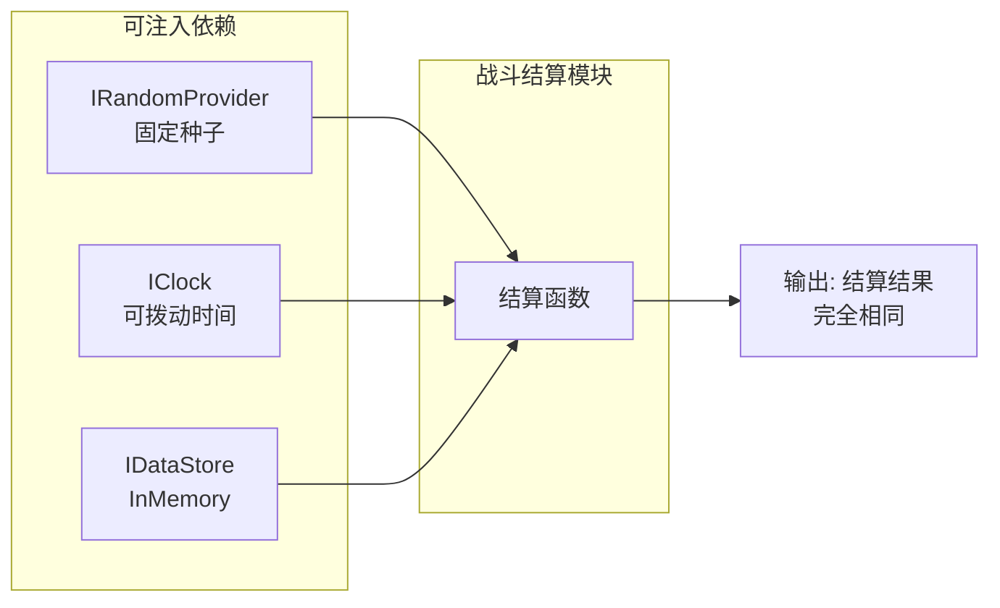
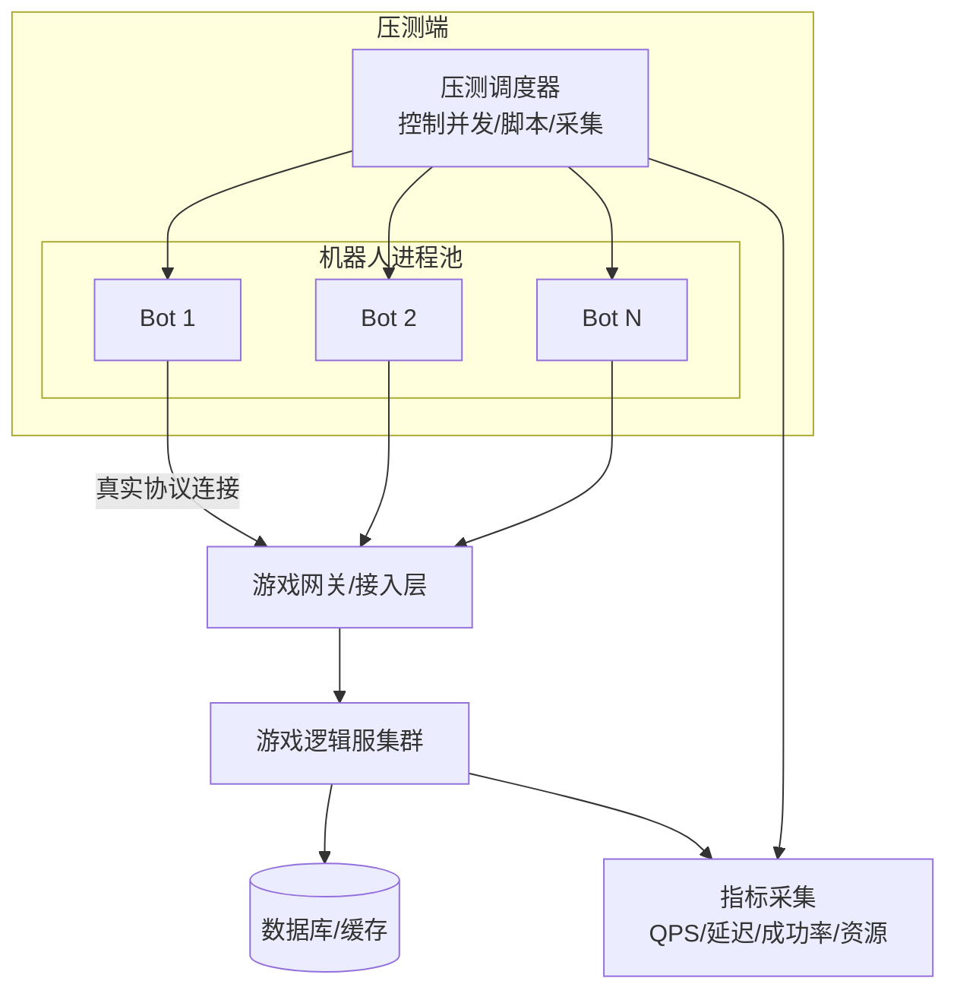

# 03 · 服务端测试与机器人压测

> 本文覆盖服务端测试的三条主线：**接口/协议测试**（功能正确性）、**确定性逻辑单元测试**（业务规则）、**机器人压测**（并发与容量），并给出性能指标口径（QPS / 延迟 / 成功率）与混沌测试简介。前置知识见 [游戏服务端](../游戏服务端/README.md) 的 `01-架构与网络`（协议、消息系统）与 `02-数据与业务`（存储、监控）。

## 概述

游戏服务端的缺陷有三个特征：**影响面大**（一次结算错误可能污染整区数据）、**并发难复现**（只在特定时序下触发）、**上线后代价高**（回滚、补偿、口碑损失）。因此服务端测试的优先级是：

1. **正确性**：接口与协议行为符合契约——用接口测试 + 契约测试锁死；
2. **确定性**：相同输入必得相同输出——用随机种子/时钟注入 + 单元测试保证；
3. **容量与稳定性**：扛得住峰值、崩得起部件——用机器人压测 + 混沌测试验证。

服务端测试相比客户端有一个巨大优势：**环境干净**（无渲染、无真机、进程可无头运行），因此自动化覆盖率可以做到很高，压测也可以无限逼近真实负载。这是 [01-测试金字塔与测试策略](01-测试金字塔与测试策略.md) 中"服务端塔"能做大做深的原因。

核心结论：**协议测试保正确，确定性测试保可复现，压测保容量，混沌测试保韧性**——四条线缺一不可，且都必须在发版流水线（[05-CI质量门禁与缺陷管理](05-CI质量门禁与缺陷管理.md)）中留位。

## 核心概念

| 术语 | 英文 | 一句话定义 |
| --- | --- | --- |
| 接口测试 | API Testing | 直接对服务端接口（HTTP/RPC/网关协议）发起请求并断言响应 |
| 协议测试 | Protocol Testing | 验证自定义二进制/Protobuf/JSON 协议的编解码、字段约束与版本兼容 |
| 契约测试 | Contract Testing | 以"契约文件"（如 OpenAPI、proto、JSON Schema）为唯一事实源，校验客户端与服务端双方实现 |
| 确定性测试 | Deterministic Testing | 固定随机种子、注入时钟与外部依赖，保证测试可精确复现 |
| 机器人压测 | Bot Stress Testing | 用脚本/程序模拟大量虚拟玩家并发执行真实业务行为（登录、移动、战斗、交易） |
| 虚拟玩家 | Virtual Player / Bot | 无 UI 的客户端代理，按协议与真实客户端一致地与服务器交互 |
| QPS | Queries Per Second | 每秒请求数，衡量吞吐的经典指标（游戏行业也常用 RPS/TPS） |
| 延迟 | Latency | 请求发出到响应返回的耗时，关注分布（P50/P95/P99）而非均值 |
| 成功率 | Success Rate | 成功响应数 / 总请求数，区分业务失败与系统错误 |
| 阶梯加压 | Ramp-up | 并发数随时间逐步增加，观察系统拐点（饱和点） |
| 容量规划 | Capacity Planning | 依据压测结果推算峰值负载下的机器/实例数量 |
| 长稳测试 | Soak Test | 以中高负载持续运行数小时~数天，暴露内存泄漏与慢速劣化 |
| 尖峰测试 | Spike Test | 瞬间把负载拉高数倍，验证限流、排队与扩容策略 |
| 混沌测试 | Chaos Testing | 主动注入故障（杀进程、断网、慢磁盘），验证系统自愈与降级能力 |
| 幂等性 | Idempotency | 同一请求重复执行结果一致，是支付/礼包类接口的硬性要求 |
| 熔断与限流 | Circuit Breaker / Rate Limit | 过载保护机制，压测时验证其是否按预期生效 |

## 原理详解

### 1. 接口 / 协议测试

#### 1.1 测试什么

| 层 | 关注点 | 典型断言 |
| --- | --- | --- |
| 传输层 | 连接、超时、重连、粘包拆包 | 断线重连后会话恢复 |
| 编解码层 | 字段顺序、长度、字节序（大小端）、版本号 | protobuf 新旧版本互解 |
| 业务层 | 请求-响应语义、错误码、状态机 | 购买未上架商品返回明确错误码 |
| 数据层 | 落库一致性、幂等 | 重复请求不重复扣款 |
| 安全层 | 鉴权、签名、防重放 | 伪造/重放请求被拒绝 |

#### 1.2 测试形态

- **HTTP 接口**：Postman / k6 / 自研脚本，断言状态码、响应体、耗时；
- **TCP/自定义二进制**：需要"协议回放"工具——抓取线上真实包（WireShark 或网关旁路录制），离线重放或参数化重放；
- **Protobuf/gRPC**：grpcurl / ghz 直接反射调用；
- **契约测试**：以 `.proto` 或 OpenAPI 文件为唯一事实源，CI 里校验"服务端实现 ↔ 契约"与"客户端生成代码 ↔ 契约"是否漂移（Contract Drift）。

### 2. 逻辑单元测试与确定性

游戏服务端业务逻辑（战斗结算、掉落、经济）必须**确定性（Deterministic）**，否则压测与回放都无法复现问题。三个关键实践：

1. **随机数注入**：不直接调 `rand()`/`Random()`，而是注入 `IRandomProvider`，测试时固定种子；
2. **时钟注入**：所有"现在几点"都走 `IClock` 抽象，测试可把时间拨到活动开启/结束边界；
3. **外部依赖注入**：数据库、缓存、消息队列全部走接口，测试用内存实现（Fake/InMemory）。



配合**属性测试（Property-based Testing）**（如 RapidCheck、Catch2 的生成器、Go 的 testing/quick）可成倍提升收益：给定"任意合法的伤害/防御组合，结算结果必须 ∈ [1, 合理上限]"，机器自动枚举边界。

### 3. 机器人压测

#### 3.1 两种负载形态

| 形态 | 模拟对象 | 优点 | 缺点 |
| --- | --- | --- | --- |
| 无状态请求压测 | 登录、查询、排行榜等单发请求 | 工具现成（wrk/k6/ghz）、指标干净 | 测不到"会话内多步操作"与状态耦合 |
| 有状态机器人压测 | 完整玩家会话（进游戏→移动→战斗→交易） | 逼近真实负载，能暴露状态竞争与内存泄漏 | 需要开发机器人客户端，复杂度高 |

#### 3.2 机器人架构



关键设计决策：

- **机器人客户端复用真实协议栈**：与正式客户端共用协议编解码库（C++/Go/C#），保证行为一致；
- **行为脚本化**：机器人按行为树/状态机执行"登录→选服→创建角色→进地图→跑图→打怪→交易→退出"；
- **调度器控制**：并发数、起包速率、场景比例（多少比例在战斗、多少在挂机）都可配置；
- **独立部署**：压测端部署在独立机器，避免压测程序自身与服务器抢资源。

#### 3.3 负载模型

| 模型 | 描述 | 适用 |
| --- | --- | --- |
| 恒定负载（Constant） | 固定并发持续 N 分钟 | 长稳测试、基线对比 |
| 阶梯加压（Ramp-up） | 每 N 分钟加 X 并发，观察拐点 | 找容量上限 |
| 尖峰（Spike） | 短时间内打 5~10 倍流量 | 验证限流/扩容/防雪崩 |
| 场景混合（Mix） | 按线上比例混合多种行为 | 逼近真实世界负载 |

### 4. 性能指标口径

| 指标 | 定义 | 游戏行业经验红线（示例） |
| --- | --- | --- |
| QPS/RPS | 每秒成功处理的请求数 | 取决于架构，先测出"饱和点 QPS" |
| P50 延迟 | 50% 请求耗时 | 登录 < 200ms（不含排队） |
| P95 延迟 | 95% 请求耗时 | 战斗内操作 < 100ms |
| P99 延迟 | 99% 请求耗时（长尾） | 活动接口 < 500ms |
| 成功率 | 成功/总请求 | ≥ 99.9%（业务错误单独统计） |
| 错误率 | 5xx/超时/断连 | < 0.1% |
| 吞吐与连接数 | 每秒字节、在线连接数 | 单服在线容量是核心指标 |
| 资源水位 | CPU/内存/磁盘 IO/网络 | 压测期间 CPU 峰值 < 80%，内存无单调增长 |

**注意**：均值（Average）会掩盖长尾，游戏在线体验由 **P95/P99 决定**；成功率必须区分"业务拒绝（如背包已满）"与"系统错误（超时/5xx）"，否则会误判。

### 5. 压测工具与方法论

| 工具 | 类型 | 适用场景 | 备注 |
| --- | --- | --- | --- |
| wrk | HTTP 单机压测 | 纯 HTTP 接口、快速吞吐测试 | 单机可打高 QPS，脚本能力弱 |
| ghz | gRPC 压测 | Protobuf/gRPC 接口 | 支持并发、元数据、反射 |
| k6 | 脚本化压测 | 复杂业务流、CI 集成 | 自带指标与门槛断言（thresholds） |
| Locust | Python 脚本压测 | 场景复杂的 Web/网关 | 分布式 Worker 扩展 |
| 自研机器人 | 协议级压测 | 游戏专用：登录/战斗/交易全链路 | 必须配套录制与回放工具 |
| Tsung / Gatling | 多协议压测 | 消息类/WebSocket | 适合聊天、房间类场景 |

**方法论五步**：

1. **定目标**：写清楚"什么场景、多少并发、多长持续时间、通过标准"；
2. **搭基线**：先在测试环境跑通小并发（如 100 Bot），校准环境与脚本；
3. **阶梯加压找拐点**：从 500 并发起，每 10 分钟 +500，记录 QPS/延迟曲线，找到饱和点；
4. **长稳与尖峰**：饱和点 80% 负载跑 8~24 小时（长稳）；再打一次 5 倍尖峰验证保护；
5. **出报告**：给出"容量结论 + 瓶颈清单 + 建议扩容方案"，供容量规划决策。

### 6. 混沌测试简述

混沌测试（Chaos Testing，源自 Netflix 的 Chaos Monkey）用于验证"系统在部件故障下仍能自愈/降级"。游戏服务端常见注入：

| 故障注入 | 验证目标 |
| --- | --- |
| 随机杀进程（如某战斗服） | 玩家会话迁移、房间重建、断线重连 |
| 数据库连接断开/延迟 | 缓存降级、读写分离切换、请求超时兜底 |
| 消息队列积压 | 削峰、重试、死信处理 |
| 时钟偏移 | 活动开奖、定时任务的边界处理 |
| 磁盘写满/IO 慢 | 日志与存档的降级策略 |

注意：混沌测试**只在专门的混沌环境/灰度小流量上执行**，且必须有监控与自动回滚兜底（与 [05-CI质量门禁与缺陷管理](05-CI质量门禁与缺陷管理.md) 的灰度发布配套）。

## 示例

### 示例 1：确定性单元测试（C++ 风格）

```cpp
// 被测：战斗结算（依赖注入随机与时钟）
class BattleSettlement
{
public:
    BattleSettlement(IRandomProvider& Rand, IClock& Clock)
        : Rand_(Rand), Clock_(Clock) {}
    // 掉宝：概率由随机源决定，时间由时钟决定
    LootResult RollLoot(int32 MonsterLevel);
private:
    IRandomProvider& Rand_;
    IClock& Clock_;
};

// 测试：固定种子 + 固定时间 → 结果完全可复现
TEST(BattleSettlementTest, RollLoot_Deterministic)
{
    FixedRandomProvider rand(/*seed=*/42);
    FixedClock clock(Timestamp(2026, 8, 4, 12, 0, 0));
    BattleSettlement s(rand, clock);

    const auto r1 = s.RollLoot(/*MonsterLevel=*/10);
    const auto r2 = s.RollLoot(10);            // 相同输入
    EXPECT_EQ(r1.ItemId, r2.ItemId);           // 必得相同输出
    EXPECT_TRUE(r1.IsValid() || r1.IsEmpty()); // 不变量
}
```

### 示例 2：k6 接口测试（登录 + 领奖）

```javascript
// k6 脚本：login.js
import http from 'k6/http';
import { check, sleep } from 'k6';

export const options = {
  stages: [
    { duration: '2m', target: 100 },   // 阶梯加压到 100 并发
    { duration: '5m', target: 100 },   // 保持
    { duration: '1m', target: 0 },     // 收尾
  ],
  thresholds: {
    http_req_duration: ['p(95)<200'],  // 门禁：P95 < 200ms
    http_req_failed: ['rate<0.001'],   // 失败率 < 0.1%
  },
};

export default function () {
  const res = http.post('http://gw.test/game/login', JSON.stringify({
    account: `bot_${__VU}`, token: 'fixed_test_token',
  }), { headers: { 'Content-Type': 'application/json' } });

  check(res, {
    'status is 200': (r) => r.status === 200,
    'has token': (r) => r.json('data.token') !== undefined,
  });
  sleep(1); // 模拟玩家思考间隔
}
```

运行：`k6 run login.js`；CI 中带 `--thresholds` 即失败退出，可接入 [05-CI质量门禁与缺陷管理](05-CI质量门禁与缺陷管理.md) 的门禁。

### 示例 3：wrk 与 ghz 快速吞吐测试

```bash
# HTTP：10 秒、8 线程、200 连接
wrk -t8 -c200 -d10s -s post.lua http://gw.test/api/rank/list

# gRPC：反射方式并发调用 GetUser
ghz --insecure --proto user.proto --call user.UserService.GetUser \
    -d '{"user_id": 1001}' -c 500 -n 50000 127.0.0.1:50051
```

### 示例 4：机器人配置（行为比例 + 并发）

```yaml
# bot_preset.yaml —— 机器人压测编排
scene: open_server_day1            # 模拟开服第一天
total_bots: 5000                   # 总虚拟玩家数
ramp_up: 100_bots_per_minute       # 每分钟进场 100 个
behavior_mix:                      # 行为比例（对应真实玩家分布）
  login_then_idle: 40%             # 登录后挂机
  running_and_pve: 35%             # 跑图 + 打怪
  trading_and_mail: 15%            # 交易/邮件
  pvp_duel: 10%                    # 竞技场
duration: 4h
metrics:
  interval: 5s
  exporters: [prometheus, json]
```

### 示例 5：Go 机器人核心循环（示意）

```go
// bot.go —— 简化版：一个机器人 = 一个 goroutine + 一个连接
func RunBot(ctx context.Context, cfg BotConfig) error {
    conn, err := net.Dial("tcp", cfg.GatewayAddr)
    if err != nil { return err }
    defer conn.Close()
    session := protocol.NewSession(conn, cfg.AccountID)
    if err := session.Login(cfg.Token); err != nil { return err }

    for {
        select {
        case <-ctx.Done():
            session.Logout()
            return nil
        default:
        }
        switch pickBehavior(cfg.BehaviorMix) {
        case "pve":
            session.MoveTo(randomWaypoint())
            session.CastSkill(skillID)
        case "trade":
            session.PostTradeOrder(itemID, price)
        default:
            time.Sleep(2 * time.Second) // 挂机
        }
        time.Sleep(time.Duration(rand.Intn(500)+100) * time.Millisecond)
    }
}
```

## 最佳实践

1. **契约先行**：每个新接口先出 `.proto`/OpenAPI 契约，接口测试与客户端代码都由契约生成，杜绝"文档与实现漂移"；
2. **确定性是底线**：所有业务逻辑强制注入随机/时钟/存储，写死"相同输入必相同输出"的测试；
3. **接口测试进 CI 门禁**：核心接口（登录、支付、交易）的接口测试随每次合入运行，失败即红灯；
4. **压测环境与生产同构**：测试环境至少 CPU 架构、数据库、网络拓扑与生产一致，否则容量结论不可信；
5. **压测数据要脱敏与隔离**：机器人账号走独立分区，禁止污染正式数据；
6. **先小后大、先慢后快**：任何压测先 100 并发验证脚本正确性，再上规模；
7. **监控与压测同步**：压测同时采集服务端 CPU/内存/GC/连接数/慢查询，问题定位才有据可依（配合 [游戏服务端](../游戏服务端/README.md) `02-数据与业务` 的监控体系）；
8. **回归压测常态化**：每次大版本（新系统、新玩法）后重跑核心场景压测，防止容量退化；
9. **混沌测试小流量起步**：从"杀一个非核心进程"开始，逐步扩大爆炸半径；
10. **报告模板化**：固定输出"目标/环境/负载模型/指标曲线/瓶颈/结论/建议"，让容量决策可追溯。

## 常见问题 FAQ

**Q1：压测机负载上不去，是服务器太强还是工具不行？**
A：先排查压测端瓶颈：单机连接数上限（`ulimit -n`）、文件描述符、压测程序自身 CPU、网络带宽；再确认是否用了多核分布式压测（如 k6 多执行器、Locust 集群）。压测端资源占用 > 30% 时结果不可信。

**Q2：QPS 上去了但延迟很高，说明什么？**
A：典型"排队/串行化"信号：数据库连接池打满、单协程瓶颈、锁竞争、GC 停顿。用火焰图 + 慢查询日志定位；对策通常是"加并发粒度（分库分表/分片）、减少共享锁、异步化"。

**Q3：压测时成功率 99.9%，上线还是崩了，为什么？**
A：常见原因：① 压测场景与真实行为差异大（机器人没有真人那样的路径依赖/状态耦合）；② 压测没覆盖尖峰（开服瞬间 10 倍流量）；③ 缓存预热差异（压测时缓存全热，线上冷启动）。对策：场景按线上数据校准、加尖峰测试、压测前清理缓存模拟冷启动。

**Q4：机器人压测要不要真的走客户端协议？**
A：强烈建议走真实协议栈。只测 HTTP 网关层会漏掉：TCP 粘包/拆包、序列化性能、会话状态机、心跳超时等客户端路径问题。复用协议库封装成"无头客户端"是标准做法。

**Q5：混沌测试会不会把线上搞挂？**
A：混沌测试默认只在测试环境或 1% 灰度流量执行，且必须有：自动回滚、监控告警、爆炸半径限制（Blast Radius）。上线前的"故障演练"从测试环境开始，逐步建立团队信心后再考虑生产小流量。

**Q6：长稳测试跑多久、看什么？**
A：一般 8~24 小时（覆盖一个业务周期）。重点看：内存是否单调增长（泄漏）、连接数是否随时间累积、延迟是否有缓慢爬升（劣化）、定时任务（每日重置）是否正常。出现"锯齿上升"曲线即为故障信号。

## 关联阅读

- [01-测试金字塔与测试策略](01-测试金字塔与测试策略.md)：服务端塔的分层与覆盖率 ROI；
- [05-CI质量门禁与缺陷管理](05-CI质量门禁与缺陷管理.md)：接口测试与压测结果如何成为发版门禁、线上监控如何闭环；
- [04-性能兼容与网络异常测试](04-性能兼容与网络异常测试.md)：弱网/丢包模拟与服务端超时策略的配合；
- [游戏服务端](../游戏服务端/README.md) `01-架构与网络`：协议设计、消息系统、帧同步/状态同步，是协议测试与机器人行为编排的基础；
- [游戏服务端](../游戏服务端/README.md) `02-数据与业务`：存储选型、缓存、监控告警，支撑压测环境搭建与指标采集；
- [游戏服务端](../游戏服务端/README.md) `03-业务系统设计`：背包/交易/战斗结算等业务，是确定性单测的主要被测对象。
