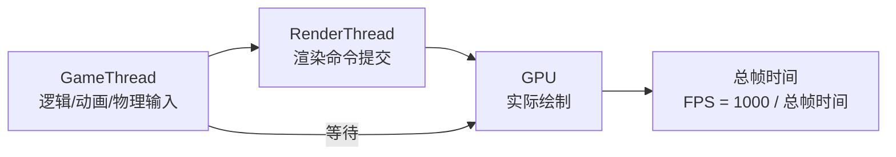
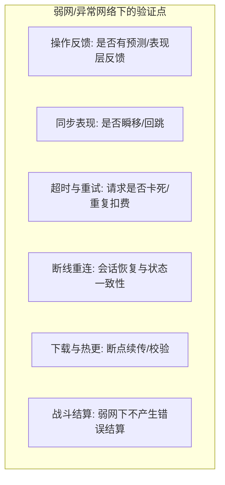
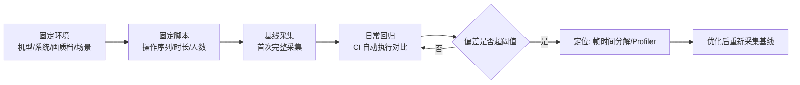

# 04 · 性能兼容与网络异常测试

> 本文覆盖客户端非功能验证的三块硬骨头：**性能**（帧率/卡顿/内存/功耗）、**兼容性**（设备矩阵/分辨率/机型）、**网络异常**（弱网/丢包/延迟模拟），并讲解热更新与版本兼容保障。前置知识见 [游戏知识](../游戏知识/README.md) 的 `07-UI与性能优化`、`06-网络同步`、`08-工具链与打包发布`。

## 概述

功能测试回答"能不能玩"，本章回答"**玩得顺不顺、在哪都能玩、网烂了还玩不玩得动**"。游戏行业的经验数据表明：**性能与兼容问题占据玩家差评与流失原因的前两位**（闪退、卡顿、进不去），且这类问题往往在 QA 的高配开发机上无法复现。

本章给出三条可执行的主线：

1. **性能测试**：用"帧时间（Frame Time）分解 + 真机采集"替代"感觉卡不卡"，用数据定位是 GameThread / RenderThread / GPU 哪条管线的问题；
2. **兼容性测试**：用"设备矩阵（Device Matrix）+ 机型分级（Tiering）"把无限多的真机收敛为有代表性的样本；
3. **网络异常测试**：用"网络损伤模拟（Network Impairment）"在实验室复现弱网、丢包、延迟抖动，验证客户端的预测、插值与超时表现。

最后的热更新与版本兼容，是把"发版"这件事本身纳入测试范围——**每次热更都是一次线上测试**，必须有测试预案。

## 核心概念

| 术语 | 英文 | 一句话定义 |
| --- | --- | --- |
| 帧率 | FPS（Frames Per Second） | 每秒渲染帧数，体验指标的直观代理 |
| 帧时间 | Frame Time | 一帧的总耗时（约 1000/FPS 毫秒），按线程分解定位瓶颈 |
| 卡顿 | Hitch / Stutter | 单帧或数帧耗时远超平均（如 > 100ms），体感为"瞬卡" |
| 帧时间分解 | Frame Breakdown | 把一帧拆为 GameThread / RenderThread / GPU / RHI 各段耗时 |
| 内存泄漏 | Memory Leak | 内存在长时游戏中被持续占用且无法回收，最终导致崩溃 |
| 功耗 | Power Consumption | 单位时间耗电量（mA/h），手游续航与发热的直接来源 |
| 设备矩阵 | Device Matrix | 按 CPU/GPU/内存/系统版本/分辨率组合出的代表性机型清单 |
| 机型分级 | Device Tiering | 把机型划分为低/中/高三档，按档位制定画质档与性能目标 |
| 兼容性测试 | Compatibility Testing | 验证不同设备/系统/分辨率/API 下可安装、可启动、可运行 |
| 弱网模拟 | Weak Network Simulation | 人为引入延迟/丢包/抖动/带宽限制，模拟真实网络环境 |
| 网络损伤 | Network Impairment | 对网络流量施加的延迟、丢包、乱序、带宽截断等扰动 |
| 丢包率 | Packet Loss Rate | 丢失报文占发送报文的比例，游戏通常需 < 1% 才可接受 |
| 抖动 | Jitter | 延迟的波动幅度，影响插值与同步表现 |
| 热更新 | Hot Update / Patching | 不换安装包、仅下载增量资源/代码的更新方式 |
| 协议兼容 | Protocol Compatibility | 新旧客户端/服务端对同一协议版本的互解能力 |
| 存档兼容 | Save Compatibility | 新版本可读取旧版本存档且不丢数据 |
| 灰度发布 | Canary Release | 小比例用户先升级，观察后再全量（详见 [05-CI质量门禁与缺陷管理](05-CI质量门禁与缺陷管理.md)） |

## 原理详解

### 1. 客户端性能测试

#### 1.1 指标与分解

性能问题的第一原则：**不要用"感觉"，要用帧时间分解**。UE 中一帧的生命周期：



| 指标 | 采集方式 | 红线示例（中端机） |
| --- | --- | --- |
| FPS（平均/最低/1% Low） | 帧率统计工具（stat fps / Unreal Insights） | 平均 ≥ 30，最低 ≥ 20 |
| GameThread 耗时 | stat game / Unreal Insights | < 16.6ms（60FPS）或 < 33ms（30FPS） |
| RenderThread 耗时 | stat render | 同上 |
| GPU 耗时 | stat gpu / ProfileGPU | 同上 |
| Hitch 次数 | 帧时间直方图（> 100ms 计一次） | 每 10 分钟 < 3 次 |
| 内存（PSS/常驻） | PerfMon / Instruments / 引擎内存统计 | 峰值 < 设备内存 70%，无单调增长 |
| 功耗/温度 | 专业功耗仪 / 系统 API | 续航不低于基准 80%，温度不触发降频 |

#### 1.2 卡顿（Hitch）分析

Hitch 的来源通常是：**资源加载**（流送、Shader 编译）、**GC/垃圾回收**（Mono/脚本层）、**物理同步**、**网络重连**。分析方法：

1. 用 Unreal Insights / CSV Profiler 记录帧时间序列；
2. 找出 > 100ms 的帧，查看该帧的线程堆栈与加载事件；
3. 针对"加载型卡顿"：预加载、异步加载、分包流送；
4. 针对"GC 型卡顿"：分帧回收、对象池、减少瞬时分配。

#### 1.3 自动化性能测试

在 CI 中跑**性能冒烟**：固定机型、固定场景（如团战 20 人 AI）、固定时长（如 5 分钟），采集帧时间并对比基线，超出阈值（如平均帧时间 +10%）即失败。这需要稳定的测试场景与基线管理（与 [02-客户端自动化测试](02-客户端自动化测试.md) 的截图基线同理）。

### 2. 兼容性测试

#### 2.1 设备矩阵

真机数量无限，但按四个维度收敛即可覆盖 95% 风险：

| 维度 | 取值示例 | 为什么重要 |
| --- | --- | --- |
| 芯片平台 | 骁龙 8 Gen2 / 骁龙 680 / 天玑 8300 / A16 / A13 | 不同 GPU 驱动与指令集差异 |
| 系统版本 | Android 8~15、iOS 12~18 | API 行为、权限、渲染后端差异 |
| 内存 | 3GB / 6GB / 8GB / 12GB | 决定画质档与内存红线 |
| 分辨率 | 720p / 1080p / 1440p / 折叠屏 | UI 布局、视口比例、性能压力 |
| 存储类型 | eMMC / UFS | 加载速度差异（影响首包与热更体验） |
| 渲染 API | OpenGL ES 3.x / Vulkan / Metal | 渲染兼容与性能差异 |

设备矩阵示例（节选）：

| 档位 | 代表机型 | 系统 | 内存 | 分辨率 | 目标帧率 |
| --- | --- | --- | --- | --- | --- |
| 旗舰 | iPhone 15 Pro / 小米 14 Pro | iOS 17 / Android 14 | 8~12GB | 2K | 60 |
| 主流 | iPhone 12 / 红米 K60 | iOS 15 / Android 12 | 6~8GB | 1080P | 45~60 |
| 低端 | iPhone 8 / 红米 Note 9 | iOS 14 / Android 10 | 3~4GB | 720P | 30（可降画质） |
| 特殊 | 折叠屏 / 平板 / 电视盒子 | 各系统 | 各档 | 异形屏 | 兼容为主 |

#### 2.2 测试手段

- **真机实验室**：自建真机墙（Android 为主，iOS 按需）；
- **云真机**：腾讯 Wetest、阿里 MQC、Firebase Test Lab、AWS Device Farm 等（按项目合规选型）；
- **模拟器**：覆盖系统版本差异快，但无法替代真机的 GPU/发热/功耗验证；
- **自动化兼容冒烟**：启动 → 登录 → 进场景 → 打一场 → 退出，全自动执行并采集崩溃/日志。

#### 2.3 机型分级与画质档

按机型分级下发画质档（低/中/高/极致），兼容性测试要覆盖"**每个档位至少一台代表机**"，并验证画质切换、降档不崩溃、显存不足时的自动降级。

### 3. 网络异常测试

#### 3.1 模拟什么

| 参数 | 正常值参考 | 弱网模拟值 | 主要影响 |
| --- | --- | --- | --- |
| 延迟（RTT） | 20~60ms | 100~500ms，甚至 1000ms | 操作反馈、同步表现 |
| 丢包率 | < 0.1% | 1%~10% | 重传、卡顿、回放异常 |
| 抖动（Jitter） | < 20ms | ±100ms | 插值错误、瞬移 |
| 带宽 | 无限 | 64Kbps~1Mbps | 资源下载、语音、帧同步数据量 |
| 断网 | 无 | 持续 5~60 秒 | 重连、断线保护、存档 |
| 切换网络 | 无 | WiFi↔4G 切换 | 会话保持、重连 |

#### 3.2 工具

| 工具 | 平台 | 用法 |
| --- | --- | --- |
| Clumsy | Windows | 全局代理式注入：延迟、丢包、乱序、带宽限制（可指定进程） |
| Network Link Conditioner | macOS | 系统级弱网模拟，适合 iOS 模拟器 |
| 苹果 Developer 弱网 | iOS | Xcode 附加真机后模拟 |
| NetLimiter | Windows | 带宽限制与流量统计 |
| tc（netem） | Linux 服务端 | `tc qdisc add dev eth0 root netem delay 100ms loss 5%` |
| UE Network Emulation 插件 | UE | 引擎内模拟网络延迟/丢包（配合 Network Prediction 调试） |
| Charles / Fiddler | 跨平台 | HTTP 层延迟与断点（弱网 + 抓包） |
| 专业网络损伤仪 | 硬件 | 高保真双向损伤，用于认证级测试 |

#### 3.3 验证点



每个验证点都要与服务端的超时、重试、幂等策略配合验证（见 [03-服务端测试与机器人压测](03-服务端测试与机器人压测.md) 与 [游戏服务端](../游戏服务端/README.md) 的 `01-架构与网络`）。

### 4. 热更新与版本兼容

热更新（Hot Update）是手游常态：**资源热更 + 代码热更（Lua/脚本层）**。测试要点：

| 场景 | 测试内容 |
| --- | --- |
| 全量包 → 热更 | 全新安装后正确拉取并应用补丁 |
| 增量热更 | 小版本只下载差异资源（CDN 校验、断点续传） |
| 版本回退 | 服务端回滚后客户端表现（版本号不匹配提示） |
| 新旧并存 | 灰度期新旧客户端并存，协议与数据兼容 |
| 存档兼容 | 旧存档可读、新存档旧端不可读（向前兼容策略） |
| 强更 | 客户端版本过低时强制跳转商店 |
| 热更失败 | 网络中断/磁盘满/校验失败时的重试与容错 |

协议兼容核心原则：**协议号只增不改，新增字段走 optional，废弃字段保留占位**——这条原则来自 [游戏服务端](../游戏服务端/README.md) `01-架构与网络` 的协议设计章节，测试侧用"旧客户端 × 新服务端、新客户端 × 旧服务端"两组交叉矩阵验证。

## 示例

### 示例 1：UE 帧时间分解命令（编辑器内）

```powershell
# 实时帧率与线程耗时
stat fps
stat game
stat render
stat gpu

# GPU 各 Pass 耗时（打开 ProfileGPU 窗口）
ProfileGPU

# 帧时间直方图（查看 Hitch 分布）
stat unitgraph

# 导出 CSV 帧时间（配合自动化压测）
UnrealInsights.exe -tracefile="C:\traces\perf_20260804.utrace"
```

### 示例 2：Unreal Insights 命令行采集

```powershell
# 启动时开启性能追踪（CI 性能冒烟）
.\Engine\Binaries\Win64\UnrealEditor-Cmd.exe "C:\proj\MyGame.uproject" `
  -game -unattended -NoSound `
  -trace="cpu,gpu,frame,bookmark,file,log" `
  -statnamedevents `
  -ExecCmds="Automation RunTests MyGame.Perf.Smoke;Quit" `
  -TestExit -ReportOutputPath="C:\ci\reports\perf"
```

### 示例 3：Clumsy 弱网配置（Windows）

1. 打开 Clumsy，勾选"Lag（延迟）"填入 `300`（ms）、"Drop（丢包）"填入 `5`（%）；
2. Filter 填进程名或端口，如 `outbound and tcp.DstPort == 8080` 或直接选择游戏进程；
3. 启动游戏执行"登录→战斗→交易"用例，观察客户端表现与日志；
4. 依次切换预设：`弱网A（延迟200/丢包2%）`、`弱网B（延迟500/丢包10%）`、`断网60秒`。

### 示例 4：Linux 服务端网络损伤（netem）

```bash
# 对 eth0 出口模拟 100ms 延迟 + 5% 丢包 + 抖动
sudo tc qdisc add dev eth0 root netem delay 100ms 20ms distribution normal loss 5%

# 恢复
sudo tc qdisc del dev eth0 root

# 查看当前规则
sudo tc qdisc show dev eth0
```

### 示例 5：设备矩阵自动化冒烟（伪代码）

```python
# smoke_on_device.py —— 云真机兼容冒烟
DEVICE_MATRIX = [
    {"model": "Pixel 6",  "os": "android-13", "tier": "mid"},
    {"model": "iPhone 12", "os": "ios-15",    "tier": "mid"},
    {"model": "Redmi Note 9", "os": "android-10", "tier": "low"},
]
for d in DEVICE_MATRIX:
    run_on_device(d, steps=[
        "install_apk", "launch", "login_guest",
        "enter_scene", "play_1v1", "screenshot", "check_crash",
        "collect_fps_and_memory",
    ])
```

### 5. 性能测试环境与标准流程

性能数据的可比性依赖"环境固定"，流程如下：



环境固定项清单：

| 项 | 固定方式 | 原因 |
| --- | --- | --- |
| 机型/系统 | 同一台真机（或同型号） | 不同 GPU/驱动结果不可比 |
| 画质档 | 锁定画质档与分辨率 | 自动降档会污染对比 |
| 场景 | 固定测试场景与操作脚本 | 不同场景负载差异巨大 |
| 时长 | 固定采集窗口（如 5 分钟） | 冷启动/热运行表现不同 |
| 网络 | 固定网络条件（本地/同网段） | 网络抖动干扰帧率数据 |
| 后台负载 | 关闭后台应用、固定亮度和音量 | 后台进程影响 CPU/GPU |

### 6. 分辨率与异形屏适配测试

分辨率适配测试的三个层次：

1. **布局适配**：UI 在 16:9、18:9、20:9、折叠屏（内屏 4:3 左右）、平板（4:3/16:10）下不错位、不裁切——用截图对比自动化覆盖（见 [02-客户端自动化测试](02-客户端自动化测试.md)）；
2. **视口与画质适配**：不同分辨率下发正确的画质档与渲染分辨率（超分/降采样策略正确）；
3. **安全区（Safe Area）适配**：刘海屏、挖孔屏下按钮不落入安全区外，横屏游戏方向锁定时不出现黑边或误触区。

测试矩阵建议：覆盖 **4 种宽高比（16:9 / 18:9 / 20:9 / 折叠与平板）+ 2 档分辨率（1080P / 720P）+ 异形屏开关**，每种组合跑"启动→登录→战斗→结算"冒烟，并采集布局截图供人工抽审。

## 最佳实践

1. **性能基线化**：为每个里程碑固定"机型 × 场景 × 时长"的基准测试，性能回归用数据说话；
2. **先定位再优化**：任何性能问题先做帧时间分解，确定 GameThread / RenderThread / GPU 归属，再谈优化（对应 [游戏知识](../游戏知识/README.md) `07-UI与性能优化` 的方法论）；
3. **低端机是及格线**：性能红线按"最低档机型"制定，旗舰机达标不等于达标；
4. **兼容性按风险分层**：每次发版跑"矩阵冒烟"（全机型启动+登录+进场景），深度兼容测试（多玩法长时）按季度轮换机型；
5. **弱网测试进回归**：核心交易/战斗用例至少跑一次"弱网B"级别（延迟 300ms/丢包 5%），防止超时与重复扣费类缺陷逃逸；
6. **真机、模拟器、云真机三管齐下**：模拟器管版本覆盖、真机管 GPU/发热/功耗、云真机管规模；
7. **热更测试前置到 CI**：每次资源/脚本变更自动做一次"从旧版本增量热更到新版本"的冒烟；
8. **版本兼容矩阵进发布检查**：发布检查单里强制勾选"旧客户端 × 新服务端"冒烟通过；
9. **采集崩溃现场**：真机崩溃必采堆栈与复现步骤，崩溃率（Crash Rate）按机型/版本统计并设红线；
10. **功耗与发热纳入发布红线**：连续游玩 30 分钟不降频、不发烫超标，是手游体验的隐形门槛。

## 常见问题 FAQ

**Q1：开发机 60FPS 满帧，测试机却卡成 PPT，怎么排查？**
A：先确认是否同画质档（低端机可能自动降档失败）；再做帧时间分解对比：低端机常见瓶颈是 GPU 带宽（Overdraw）、Shader 编译 Hitch、内存不足触发的资源卸载抖动。抓 Unreal Insights 对比两端即可定位。

**Q2：内存泄漏怎么在测试期发现？**
A：长稳测试（连续游戏 1~2 小时）观察内存曲线：单调上升即疑似泄漏；配合"进出场景前后快照对比"（`obj list`、Instruments/PerfMon）定位到具体资产类别。建议把"内存峰值红线 + 长稳用例"写进 CI。

**Q3：设备矩阵到底要多少台真机才够？**
A：按"档位 × 平台 × 系统大版本"覆盖关键组合：一般 Android 15~25 台（含 2~3 台低端）+ iOS 5~8 台（覆盖近 4 个系统版本）+ 云真机按需扩容。比数量更重要的是**覆盖每个 GPU 厂商（高通/联发科/苹果/麒麟）**。

**Q4：弱网测试有必要每个版本都做吗？**
A：至少做"核心链路弱网回归"（登录、支付、交易、战斗结算、断线重连），因为这些路径一旦弱网出 bug 就是资损/口碑事故。全量弱网测试按季度或大版本执行。

**Q5：热更测试最常见的坑是什么？**
A：① 增量补丁依赖顺序错误（旧补丁被新补丁覆盖）；② 校验不严导致损坏资源被加载（花屏/崩溃）；③ 灰度期新旧客户端并存时的协议不兼容；④ 回滚后客户端缓存残留。对策：CI 里每天自动跑"旧包 → 全量热更 → 增量热更 → 回滚"四步演练。

**Q6：真机上复现不了，只在特定机型崩溃怎么办？**
A：优先补采集：该机型崩溃堆栈 + 系统日志 + GPU 驱动版本；用云真机租用同机型复现；若与 GPU 相关，用"渲染 API 强制切换"（如关闭 Vulkan 用 GLES）验证是否为驱动/API 差异。兼容性缺陷要有专门的"机型×缺陷"看板跟踪。

**Q7：功耗测试（功耗/发热）具体怎么做？**
A：三件套：① 专业功耗仪（如 Monsoon Power Monitor）接真机电池位，或使用系统级功耗统计（Android Battery Historian、iOS 的 Instruments Energy Log）；② 固定测试脚本（连续 30 分钟同场景同操作）；③ 同时记录温度曲线（红外测温或系统 API）。判定红线：同场景功耗不高于基准机型/版本 +15%，且无持续升温导致降频（降频会表现为"玩 20 分钟后帧率骤降"）。

**Q8：性能基线怎么"写进 CI"而不是只出报告？**
A：把基线变成**阈值配置**：CI 性能冒烟（固定机型+场景+时长）采集平均帧时间、1% Low、内存峰值、Hitch 次数，与"基线库"（如 `perf_baseline.json`）对比，超阈值（如平均帧时间 +10% 或 Hitch 次数翻倍）即构建失败。基线库随性能优化成果定期人工更新，并记录更新原因（对应 [05-CI质量门禁与缺陷管理](05-CI质量门禁与缺陷管理.md) 的门禁思路）。

## 关联阅读

- [01-测试金字塔与测试策略](01-测试金字塔与测试策略.md)：性能/兼容/网络异常在测试类型地图中的定位；
- [02-客户端自动化测试](02-客户端自动化测试.md)：性能冒烟与截图对比的自动化执行方式；
- [03-服务端测试与机器人压测](03-服务端测试与机器人压测.md)：服务端压测与弱网/超时策略的配合；
- [05-CI质量门禁与缺陷管理](05-CI质量门禁与缺陷管理.md)：性能红线、崩溃率、热更冒烟如何成为发布门禁；
- [游戏知识](../游戏知识/README.md) `07-UI与性能优化`：性能分析工具、渲染与加载优化的方法论；
- [游戏知识](../游戏知识/README.md) `06-网络同步`：预测、插值、延迟补偿——弱网测试的评判标准；
- [游戏知识](../游戏知识/README.md) `08-工具链与打包发布`：UAT 打包、热更新机制与 CDN 校验；
- [游戏服务端](../游戏服务端/README.md) `01-架构与网络`：协议版本兼容与超时重试设计。
