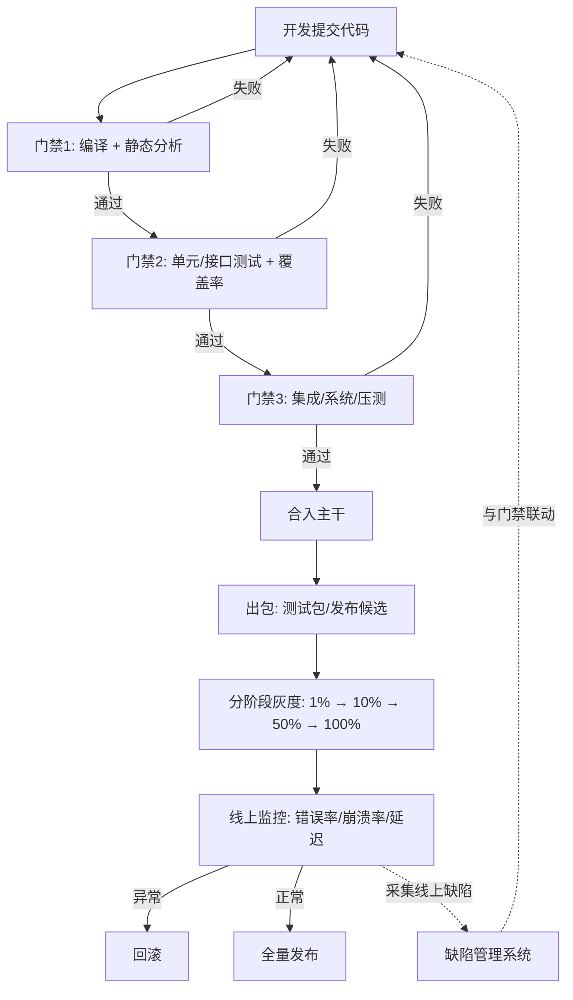
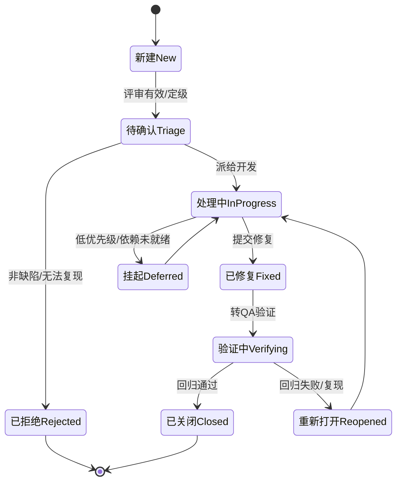
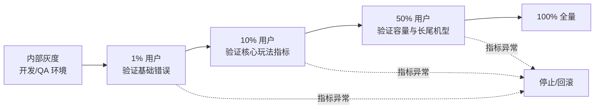

# 05 · CI 质量门禁与缺陷管理

> 本文是质量体系的"工程化收口"：如何把前面四篇的测试资产变成流水线里**不可绕过的门禁（Quality Gate）**，如何让缺陷从提报到回归形成**闭环流转**，如何用**灰度发布与线上监控**守住最后一公里，以及用哪些**质量度量指标**向团队和管理层呈现真实质量水位。前置知识见 [游戏知识](../游戏知识/README.md) `08-工具链与打包发布`（UAT/构建）与 [游戏服务端](../游戏服务端/README.md) `02-数据与业务`（监控告警）。

## 概述

质量保障的终极形态不是"测试报告写得厚"，而是**"不合格的代码根本进不了主干、不合格的版本根本发不出去"**。这依赖两套机制：

1. **CI 质量门禁（Quality Gate）**：在流水线中按阶段设置硬性检查（编译、静态分析、覆盖率、测试通过率），任一不达标即阻断合入/发布；
2. **缺陷管理闭环（Defect Lifecycle）**：缺陷从提报、分级、修复、验证到关闭全程可追踪，且与门禁、回归测试联动。

发布阶段再叠加**灰度发布（Canary Release）与线上监控（Monitoring）**，用真实流量验证最后一层风险；最后用**质量度量指标**（千行缺陷率、逃逸率等）度量整个体系是否在变好。



核心结论：**门禁是"闸门"，缺陷管理是"水流"，监控是"下游水位计"——三者缺一，质量体系就会漏水。**

## 核心概念

| 术语 | 英文 | 一句话定义 |
| --- | --- | --- |
| 持续集成 | CI（Continuous Integration） | 频繁把代码合入主干并自动构建、测试，尽早发现问题 |
| 持续交付/部署 | CD（Continuous Delivery/Deployment） | 通过自动化流水线把验证过的版本交付/部署到环境 |
| 质量门禁 | Quality Gate | 流水线中的硬性检查点，不达标即阻断（失败/暂停） |
| 静态分析 | Static Analysis | 不运行代码，基于语法/数据流检查缺陷与坏味道（如 Clang-Tidy、PVS-Studio） |
| 覆盖率门槛 | Coverage Threshold | 覆盖率低于设定值（如 80%）即构建失败 |
| 测试通过率 | Test Pass Rate | 通过的用例数 / 总用例数，门禁通常要求 100% 或允许白名单豁免 |
| 缺陷 | Defect / Bug | 不符合需求或影响用户体验的问题记录 |
| 缺陷分级 | Severity / Priority | 按影响程度（严重级 P0~P3）与紧急程度（优先级）对缺陷分类 |
| 缺陷生命周期 | Defect Lifecycle | 新建→处理中→已修复→验证→关闭（或拒绝/挂起）的状态流转 |
| 回归测试 | Regression Test | 修复后重新执行相关用例，验证修复有效且无副作用 |
| 灰度发布 | Canary / Gradual Release | 按比例逐步放量新版本，异常即停（对应 [04-性能兼容与网络异常测试](04-性能兼容与网络异常测试.md) 的版本兼容验证） |
| 线上监控 | Online Monitoring | 对错误率、崩溃率、延迟、资源等线上指标进行实时采集与告警 |
| 逃逸率 | Escape Rate | 线上/验收阶段发现的缺陷数 ÷ 该版本总缺陷数，衡量测试有效性 |
| 千行缺陷率 | Defects per KLOC | 每千行代码的缺陷数量，用于模块质量对比（需结合代码规模谨慎使用） |
| MTTD / MTTR | Mean Time To Detect / Repair | 平均发现时长 / 平均修复时长，衡量响应能力 |
| 缺陷密度 | Defect Density | 缺陷数 / 代码规模（KLOC 或功能点），与千行缺陷率同源 |

## 原理详解

### 1. CI/CD 中的质量门禁

#### 1.1 门禁的分层设计

门禁必须**分层、渐进、可跳过但留痕**。推荐顺序：

| 阶段 | 门禁内容 | 阻断对象 | 参考阈值 |
| --- | --- | --- | --- |
| 提交级 | 编译（增量）、代码格式、静态分析新告警 | 单次提交 | 新告警 = 0 |
| 合入级 | 全量编译、单元/接口测试、覆盖率 | 合入主干（Merge Request） | 单测 100% 通过；核心模块覆盖率 ≥ 80% |
| 版本级 | 集成/系统/压测、兼容冒烟、性能基线 | 打版本（Release Candidate） | 关键链路用例全通过；性能 ≤ 基线 +10% |
| 发布级 | 热更冒烟、灰度监控指标、缺陷关闭率 | 全量发布 | 线上错误率/崩溃率低于红线 |

#### 1.2 各门禁的实现要点

- **编译门禁**：任何警告（Warning）按"新警告即失败"处理，存量警告用基线清单逐步清零；
- **静态分析门禁**：UE 项目用 Clang-Tidy、PVS-Studio、Visual Studio Code Analysis；服务端按语言选型（Go 的 vet/staticcheck、C++ 的 clang-tidy、C# 的 Roslyn Analyzer）。只对**增量代码**的新问题设零容忍；
- **覆盖率门禁**：按模块设阈值而非全项目一刀切（核心经济/战斗模块 80%+，外围模块 40%），配合"覆盖率变化 diff"（新增代码必须被覆盖）使用；
- **测试通过率门禁**：单元/接口测试要求 100%；E2E/性能类允许"已知失败白名单 + 时限"；
- **其他门禁**：包体积（增量超限失败）、资源合法性（损坏/超规格资源）、协议契约漂移检查、依赖漏洞扫描（SCA）。

#### 1.3 门禁的"反模式"

- **门禁太多太慢**：全量 E2E 塞进每次合入，CI 排队 2 小时 → 团队开始"绕过门禁"；
- **门禁形同虚设**：管理员频繁手动放行，红灯成为日常；
- **门禁没有归属**：门禁失败无人跟进，缺陷沉淀到发布前集中爆发。

正确的做法是**分级流水线**：合入门禁 10 分钟内跑完（快），版本门禁跑全套（全），发布门禁带监控（准）。

### 2. 缺陷管理流程

#### 2.1 缺陷提报

好的缺陷单是"可复现的最小事实"。模板要点：

| 字段 | 要求 |
| --- | --- |
| 标题 | 「模块-场景-现象」，如"背包-交易-出售后金币未到账" |
| 复现步骤 | 从干净状态开始，编号列出每一步 |
| 期望/实际 | 期望行为 vs 实际行为，附截图/录屏/日志 |
| 环境 | 机型/系统/版本号/网络/账号类型 |
| 严重级 | P0~P3（见分级表） |
| 归属 | 模块负责人（自动路由） |

#### 2.2 缺陷分级

| 级别 | 定义 | 示例 | 响应时限（参考） |
| --- | --- | --- | --- |
| P0 致命 | 阻断核心功能/资损/大面积崩溃/安全漏洞 | 无法登录、支付重复扣款、存档损坏 | 立即处理（< 2h 响应） |
| P1 严重 | 主要功能不可用，有绕行方案 | 组队功能不可用（可单排）、核心活动错乱 | 当日修复 |
| P2 一般 | 功能可用但体验受损 | 界面错位、提示文案错误 | 本版本修复 |
| P3 轻微 | 低影响、可积压 | 文案错别字、极低概率视觉瑕疵 | 排期修复 |

#### 2.3 缺陷生命周期与回归



**回归的黄金法则**：修复必须附带"新增用例"（防再发），并在合入门禁中强制运行该模块回归集。缺陷关闭不是终点——**逃逸分析（为什么测试没拦住）**才是质量改进的起点。

### 3. 灰度发布与线上监控

#### 3.1 分阶段灰度



每个灰度阶段观察期（如 30 分钟~数小时）内盯住：崩溃率、错误率、关键接口延迟、付费成功率、活跃留存等指标，任一超过红线立即**停止放量并回滚**（客户端热更可"停止下发新版本"，服务端可"路由回退"）。

#### 3.2 线上监控体系

| 监控层 | 指标示例 | 告警方式 |
| --- | --- | --- |
| 客户端 | 崩溃率、启动失败率、帧率分布、热更失败率 | 崩溃平台（Bugly/Firebase Crashlytics 等）+ 告警 |
| 服务端 | 错误率、P99 延迟、QPS、连接数、GC/内存 | Prometheus + Alertmanager / 云监控 |
| 业务 | 登录成功率、支付成功率、活动参与率、经济指标 | 业务大盘 + 环比告警 |
| 发布 | 版本分布、灰度进度、回滚触发 | 发布平台 + 自动闸门 |

### 4. 质量度量指标

| 指标 | 公式 | 用途 | 注意 |
| --- | --- | --- | --- |
| 测试通过率 | 通过用例 / 总用例 | 版本健康快照 | 需区分"跳过/禁用"用例 |
| 覆盖率 | 覆盖代码 / 总代码 | 测试充分性趋势 | 防虚高（断言质量） |
| 缺陷密度 | 缺陷数 / KLOC | 模块间质量对比 | 代码规模口径统一 |
| 千行缺陷率 | 缺陷数 × 1000 / 代码行数 | 团队/模块质量横向对比 | 小模块波动大，看趋势 |
| 逃逸率 | 线上/验收缺陷 / 总缺陷 | 测试体系有效性 | 分版本、分模块统计 |
| 缺陷重开率 | 重开缺陷 / 已关闭缺陷 | 修复质量 | 高则需复盘修复流程 |
| MTTD | 缺陷引入到发现时长 | 测试时效 | 越低说明测试越贴近开发 |
| MTTR | 缺陷发现到修复时长 | 响应能力 | 按 P0/P1 单独统计 |
| 线上事故数 | P0/P1 事故次数 | 发布质量 | 与灰度/监控有效性强相关 |

**度量原则**：指标用于"发现问题"，不用于"考核个人"（否则必然被优化掉）；每季度回顾趋势，确定下一步改进项（如"逃逸率高的模块 → 补灰盒用例"）。

## 示例

### 示例 1：GitLab CI 门禁配置（合入级）

```yaml
stages: [build, static, unit, integration, gate]

build:
  stage: build
  script:
    - .\Build.bat -Target=Build -Configuration=Development -Platform=Win64
  rules:
    - if: $CI_PIPELINE_SOURCE == "merge_request_event"

static-analysis:
  stage: static
  script:
    - clang-tidy --checks="bugprone-*,performance-*" -p Build/ Source/ > clang-tidy.log
    - pwsh .\scripts\fail_on_new_warning.ps1 clang-tidy.log   # 新告警即失败
  allow_failure: false

unit-tests:
  stage: unit
  script:
    - .\Engine\Binaries\Win64\UnrealEditor-Cmd.exe "MyGame.uproject" `
        -ExecCmds="Automation RunTests MyGame.Unit;Quit" -unattended -nullrhi -TestExit
    - pwsh .\scripts\check_coverage.ps1 -Module Core -Min 80 -Module Lobby -Min 60

quality-gate:
  stage: gate
  script:
    - pwsh .\scripts\gate_summary.ps1   # 汇总各阶段产物，任一缺失/失败则 exit 1
  needs: [build, static-analysis, unit-tests]
```

### 示例 2：缺陷提报模板（可直接复制）

```markdown
## 缺陷标题
【背包-交易】出售道具后金币未到账

## 复现步骤
1. 新建账号，领取新手礼包（含 10 个"铜矿石"）
2. 进入背包 → 选中铜矿石 → 出售 5 个
3. 查看金币数量

## 期望行为
金币增加 5 × 售价（100 金币）

## 实际行为
金币未变化，道具已扣除（资损类，P0）

## 环境
- 版本：v1.4.2（build 2081）
- 机型：小米 14 / Android 14 / 1080P
- 网络：WiFi
- 账号：test_account_042

## 附件
录屏：link；日志：link；服务端请求 ID：req_8f3a2b
```

### 示例 3：灰度发布检查脚本（伪代码）

```python
# canary_check.py —— 灰度阶段自动判定
def canary_verdict(metrics, phase):
    red_lines = {
        "crash_rate":  0.5,   # 崩溃率 %（对比基线）
        "error_rate":  1.0,   # 接口错误率 %
        "p99_latency": 300,   # 关键接口 P99 ms
        "pay_success": 99.0,  # 支付成功率 %
    }
    failures = [k for k, v in red_lines.items()
                if metrics[k] > v or (k == "pay_success" and metrics[k] < v)]
    if failures:
        stop_canary(phase, failures)      # 停止放量
        trigger_rollback(phase)           # 触发回滚预案
        return "BLOCKED"
    return "PROMOTE"                      # 进入下一灰度阶段
```

### 示例 4：质量度量周报模板

```markdown
# 第 32 周质量周报
| 指标 | 本周 | 上周 | 趋势 |
| --- | --- | --- | --- |
| 单元测试通过率 | 99.8% | 99.6% | ↑ |
| 核心模块覆盖率 | 82% | 81% | ↑ |
| 逃逸率（本版本累计） | 8% | 12% | ↑ 改善 |
| 缺陷重开率 | 4% | 6% | ↑ |
| P0/P1 线上事故 | 0 | 1 | ↑ |
| 平均修复时长 P1 | 1.2 天 | 2.0 天 | ↑ |
改进项：战斗模块逃逸率偏高（15%），下月补灰盒协议用例 20 条。
```

## 最佳实践

1. **门禁分层、快慢分离**：合入门禁 < 15 分钟；版本门禁全量；发布门禁带线上指标；
2. **新告警零容忍，存量告警限期清零**：用基线清单管理存量问题，避免"永远清不完"；
3. **覆盖率门槛按模块设**：核心模块严格，外围模块务实，防"为覆盖率而写废测试"；
4. **缺陷单是资产**：提报必须可复现、可追溯（关联提交/用例/版本），拒绝"一句话 bug"；
5. **修复必须带用例**：无新增用例的修复不合入门禁，从机制上防再发；
6. **灰度阶段宁可慢不可快**：1% 阶段观察关键指标 ≥ 30 分钟，重大版本（数据库变更/协议变更）灰度期 ≥ 24 小时；
7. **回滚预案先于发布写好**：客户端（停更+强更/回退）、服务端（路由回退+数据补偿）两条路径都要演练；
8. **监控指标与门禁联动**：线上指标异常自动触发"暂停发布"，而不是等人发现；
9. **度量看趋势不看单点**：周/月趋势比单周绝对值更有决策价值；
10. **每月质量复盘**：逃逸缺陷逐条归因（漏测原因 → 补测试资产 → 更新门禁），形成质量飞轮。

## 常见问题 FAQ

**Q1：门禁总被"管理员放行"，怎么破？**
A：把"放行"变成**有成本**的动作：① 放行必须填写原因并 @ 质量负责人；② 放行次数计入团队质量周报；③ 连续放行同一类问题自动升级（触发专项复盘）。同时要反思门禁是否过严/过慢——门禁合理，团队自然不愿绕。

**Q2：覆盖率已经 85%，为什么缺陷还是漏到线上？**
A：覆盖率高≠断言有效。检查：① 是否"执行了但没断言"（Mutation Testing 可暴露）；② 是否覆盖了跨模块/跨端契约（补灰盒用例）；③ 环境差异（真机/弱网）是否覆盖（见 [04-性能兼容与网络异常测试](04-性能兼容与网络异常测试.md)）。用**逃逸率按模块分解**定位漏洞在哪。

**Q3：P0 缺陷应该在流程里怎么流转才最快？**
A：P0 走"红色通道"：发现即电话/IM 拉群，跳过常规 Triage 直接指派，修复走热更/紧急分支，QA 同步准备回归用例，发布走特批灰度（但监控红线不豁免）。P0 处理拼的是**响应机制**，不是流程完备度。

**Q4：灰度到 50% 才发现严重问题，回滚来得及吗？**
A：这取决于回滚预案：客户端热更版本可"停止下发+回退到上一版本"（分钟级）；服务端逻辑可"路由回退"（秒级）；数据问题（如活动数值错误）可能需要"补偿脚本"。所以预案必须在发布前写好并演练过——**灰度比例越大，回滚成本越高，越要依赖监控自动闸门**。

**Q5：千行缺陷率这个指标靠谱吗？**
A：只用于**同口径下的横向对比与趋势**（同团队、同语言、同时间段），跨语言/跨团队对比意义不大（C++ 与脚本的缺陷密度天然不同）。更推荐配合逃逸率、重开率、MTTR 一起看，避免单指标误导。

**Q6：小团队（3~5 人）有必要搭完整 CI 门禁吗？**
A：有必要但做减法：至少保留"编译 + 静态分析（增量）+ 单测通过率 + 覆盖率（核心模块）"四个门禁，用现成平台（GitHub Actions/GitLab CI）而不是自建。缺陷管理可用轻量看板（Kanban）起步，但"提报模板 + 分级 + 回归验证"三个环节不能省。

## 关联阅读

- [01-测试金字塔与测试策略](01-测试金字塔与测试策略.md)：覆盖率红线与 ROI 原则是门禁阈值设计的依据；
- [02-客户端自动化测试](02-客户端自动化测试.md)：UE 测试在 CI 中的命令行运行与报告接入；
- [03-服务端测试与机器人压测](03-服务端测试与机器人压测.md)：接口测试、压测结果如何作为版本级门禁；
- [04-性能兼容与网络异常测试](04-性能兼容与网络异常测试.md)：性能基线、崩溃率、热更冒烟作为发布级门禁；
- [游戏知识](../游戏知识/README.md) `08-工具链与打包发布`：UAT 打包、构建流水线与热更新机制；
- [游戏服务端](../游戏服务端/README.md) `02-数据与业务`：部署运维与监控告警，是线上监控体系的落地基础；
- [游戏服务端](../游戏服务端/README.md) `01-架构与网络`：版本兼容与协议演进，支撑灰度期新旧并存验证。
