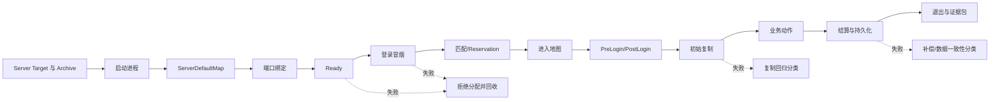

# UE Dedicated Server 联机验收与 Gauntlet

> 以 UE5.8 Dedicated Server 为被测对象，建立从启动冒烟、多人 E2E、网络异常到发布门禁的可追溯验收闭环。

## 元数据

- 版本基线：UE5.8.0 / CL55116800 / ++UE5+Release-5.8
- 最后更新：2026-08-06
- 适用范围：Win64/Linux Dedicated Server 的构建产物验收、Server/Client 联机测试、Gauntlet 自动化、网络异常、长稳、故障注入和发布门禁。
- 适用范围：适合 QA、客户端、服务端、构建工程师、平台工程师和发布负责人共同使用。
- 事实边界：UE/Gauntlet 能力以 Epic 5.8 官方文档为准；项目 Target、脚本、端口、地图、测试节点和报告路径均为占位符或方案示意。
- 事实边界：文中不把项目私有自动化脚本、平台适配器、Agones/GameLift 接口或自定义健康端点冒充 UE5.8 内置能力。
- 事实边界：本文不声称任何项目已经拥有 `<ProjectServer>`、`<SmokeScript>`、`<port>` 或具体 Gauntlet TestNode。
- Epic 5.8 官方文档：https://dev.epicgames.com/documentation/en-us/unreal-engine
- Epic Gauntlet Overview：https://dev.epicgames.com/documentation/unreal-engine/gauntlet-automation-framework-overview-in-unreal-engine?lang=en-US
- Epic Running Gauntlet Tests：https://dev.epicgames.com/documentation/unreal-engine/running-gauntlet-tests-in-unreal-engine?lang=en-US
- Epic Testing Networked Games：https://dev.epicgames.com/documentation/en-us/unreal-engine/testing-and-debugging-networked-games-in-unreal-engine
- Epic Network Emulation：https://dev.epicgames.com/documentation/en-us/unreal-engine/using-network-emulation-in-unreal-engine

## 概述

联机验收（online acceptance）不是“服务器进程能启动”这么简单。
它要证明 Server Target 和打包产物正确，ServerDefaultMap 正确，端口可用，版本可配对，玩家能登录，复制和 RPC 正常，业务能结算，退出能留证。
Gauntlet 是 Epic 提供的会话测试框架，用来配置、启动、监控和验证一个或多个 Unreal session。
Epic 官方把 Unreal session 定义为执行游戏所需的进程集合，多人游戏可以由一个 Server 和多个 Client 构成。
Gauntlet 可以收集日志、Crash 和 Saved 数据，并能运行多角色会话。
Gauntlet 不负责创建 build，测试前必须提供本地或网络可访问的已构建/已烘焙产物。
这条边界决定了流水线应该先 Build/Cook/Stage/Archive，再运行 RunUnreal。
Dedicated Server 的 Ready 也不是端口监听的同义词。
测试必须区分进程启动、地图加载、端口绑定、登录冒烟、依赖健康和游戏可进入状态。
本文把测试策略分成单元、协议/契约、Server/Client 集成、Gauntlet E2E、阶梯并发、Soak 和故障注入。
所有层级都要输出 BuildId、engine baseline、命令行、端口、日志、Trace/Insights、Crash、符号和报告 JSON。

## 1. 核心概念表

| 概念 | 英文 | 验收问题 | 主要证据 |
| --- | --- | --- | --- |
| 专用服务器 | Dedicated Server | 是否是正确的 Server Target 和制品 | Target、Archive、启动日志 |
| 会话 | Session | Server 与多个 Client 是否被同一测试控制 | Gauntlet session 配置 |
| 测试角色 | Test Role | 哪个进程扮演 Server、Client、Observer | `UnrealTestRole`/角色配置 |
| 测试节点 | Test Node | 测试如何启动、等待、断言和收尾 | `UnrealTestNode` 方案/代码 |
| Ready | Ready | 是否满足端口、地图、登录和依赖门禁 | Ready 报告与日志 |
| ServerDefaultMap | Server Default Map | 服务端是否进入预期地图 | 配置、日志、截图/断言 |
| 预留 | Reservation | 匹配结果是否绑定到唯一实例 | requestId、Reservation、expiry |
| 初始加入 | Join In Progress / JIP | 中途加入是否拿到正确快照 | 连接日志、复制断言 |
| ServerTravel | Server Travel | 地图迁移是否保留/重建正确状态 | Travel 事件、玩家状态 |
| Seamless Travel | 无缝切图 | 是否在迁移中保持预期连接 | Travel、重连、复制证据 |
| 复制 | Replication | 服务端状态是否达到客户端 | 属性、Actor、快照、断言 |
| RPC | Remote Procedure Call | 调用方向、权限、重试是否正确 | 请求/响应日志 |
| Iris | Iris Replication | 选择的复制系统是否回归通过 | 版本配置、网络报告 |
| ReplicationGraph | Replication Graph | 兴趣管理/复制范围是否正确 | 连接视角、网络统计 |
| 网络仿真 | Network Emulation | 延迟、丢包、抖动、带宽和断网下是否稳定 | Profile、参数、报告 |
| 长稳 | Soak Test | 长时间运行是否泄漏、堆积或漂移 | 资源曲线、重连、Crash |
| 阶梯并发 | Ramp Test | 并发增加时长尾和资源拐点在哪里 | P95/P99、Tick、CCU |
| 证据包 | Evidence Bundle | 是否能复现并定位一次失败 | Manifest、日志、Trace、JSON |
| 发布门禁 | Release Gate | 是否允许进入灰度或全量 | Gate report、阈值、签名 |

## 2. 验收事实与方案边界

### 2.1 Epic Gauntlet 官方能力

Epic 5.8 Gauntlet Overview 说明 Gauntlet 用来运行 Unreal session、执行测试并验证结果。
官方文档列出跨平台的 build、device、test 抽象，以及可以配置复杂角色组合的高层能力。
官方示例明确可以配置多个 Client 和一个 Server 的多人会话。
官方文档提到 Gauntlet 提供日志、Crash 和 Saved 数据访问工具。
官方文档还明确指出 Gauntlet 不创建 build，需要提供本地或网络可访问的 cooked build。
因此本篇把 Gauntlet 放在“构建产物之后”的测试阶段。

Epic `RunUnreal` 是触发 UE 专用 Gauntlet 测试的主要 UAT 命令。
Epic 的 Running Gauntlet Tests 页面说明 `RunUnreal` 使用 UE 专用命令、测试和类处理已打包游戏等输出。
官方页面还展示了 `UnrealTestNode<UnrealTestConfiguration>`、`UnrealTestContext` 和 `UnrealTestRole` 的使用方式。
Overview 页面使用 `UnrealSession` 和 `UnrealSessionRole` 描述会话/角色层级。
本文以“官方类名/能力 + 项目适配层”表述，不把示例类当作每个项目现成代码。

### 2.2 Gauntlet 不负责什么

Gauntlet 不负责生成 Server Target。
Gauntlet 不负责替代 UBT、UAT BuildCookRun 或项目构建流水线。
Gauntlet 不会自动修复缺失的 ServerDefaultMap。
Gauntlet 不会自动分配生产 Reservation 或替代匹配服务。
Gauntlet 不会自动知道项目的 ticket、登录协议和结算接口。
Gauntlet 不会让不兼容的 Server/Client BuildId 变得兼容。
Gauntlet 不会把未核对的网络控制台参数变成稳定契约。
测试节点需要通过项目控制器、命令行、日志和业务断言定义“成功”。

### 2.3 事实/示意对照表

| 内容 | 事实来源 | 本文写法 |
| --- | --- | --- |
| `RunUAT RunUnreal` | Epic 5.8 Running Gauntlet Tests | 作为官方入口说明 |
| `UnrealSession` | Epic 5.8 Gauntlet Overview | 作为会话抽象说明 |
| `UnrealTestRole` | Epic 5.8 Running Gauntlet Tests/Controller | 作为角色配置能力说明 |
| Server + 多 Client | Epic 5.8 Gauntlet Overview/Networked Games | 作为官方支持场景 |
| `<SmokeScript>` | 项目未知 | 只写方案占位符 |
| `<port>` | 项目未知 | 只写方案占位符 |
| `/health/readiness` | 项目适配未知 | 明确不是 UE 内置 endpoint |
| GameLift/Agones API | 供应商文档 | 只写对照/适配伪代码 |

## 3. 验收对象与输入

一次联机验收至少需要五类输入。

第一类是 Server Target 和构建产物，包括 Server 二进制、依赖、Cooked 数据、Stage、Archive、Manifest 和符号索引。
第二类是客户端产物，包括与服务端兼容的 Client 二进制、资源、配置和启动参数。
第三类是协议和环境，包括 BuildId、engine baseline、protocolVersion、区域、模式、地图、端口池和 ticket 方案。
第四类是测试控制，包括 Gauntlet TestNode、角色配置、超时、端口隔离、日志收集和清理策略。
第五类是判定标准，包括功能断言、网络预算、资源预算、失败分类、重试边界和发布阈值。

```text
InputBundle = {
  serverArtifact,
  clientArtifact,
  buildId,
  engineBaseline,
  protocolVersion,
  map,
  region,
  mode,
  portPlan,
  testConfig,
  gateThresholds
}
```

这是测试输入模型示意，不是 UE 或 Gauntlet 内置结构体。
输入包缺字段时，测试应在启动前失败，而不是启动到一半才报无意义的连接错误。

## 4. DS 启动冒烟

启动冒烟（boot smoke）验证的是“可启动且进入可测状态”，不是完整 E2E。
它应该优先在干净 Stage/Archive 上执行，避免旧文件掩盖构建缺失。

### 4.1 启动门禁

| 顺序 | 门禁 | 通过条件 | 失败分类 |
| --- | --- | --- | --- |
| 1 | Server Target | 目标文件、Target 名和平台匹配 | Build |
| 2 | 制品 | Server 可执行文件和依赖完整 | Artifact |
| 3 | BuildId | 服务端、客户端、配置可关联 | Compatibility |
| 4 | ServerDefaultMap | 地图值明确且在 Cook 产物中 | Configuration |
| 5 | 进程启动 | 进程在超时内创建 | Startup |
| 6 | 日志 | `-log` 或项目日志通道可收集 | Observability |
| 7 | 端口 | `<port>` 唯一、绑定且可探测 | Network |
| 8 | 版本 | Server/Client engine/protocol 兼容 | Compatibility |
| 9 | 登录冒烟 | 最小 ticket/PreLogin/PostLogin 通过 | Gameplay |
| 10 | Ready | 以上证据聚合后发布 Ready | Readiness |

### 4.2 启动命令示意

```powershell
# 方案示意：<ProjectServer>、<StageDir>、<Map>、<port> 都是占位符。
& '<StageDir>\<ProjectServer>Server.exe' '<Map>?port=<port>' -log -port=<port> -unattended -NoSound
```

命令中的 `-log`/`-port` 是测试启动方案写法，不能在未核对项目目标和本地构建帮助前当作所有项目的稳定 API。
端口号必须来自测试运行器的端口租约，而不是硬编码为某个共享默认值。
如果项目使用不同命令行键，测试适配器应将中立字段转换为项目实际参数。

### 4.3 启动超时

启动超时应拆成进程创建超时、地图加载超时、端口绑定超时、登录冒烟超时和 Ready 发布超时。
单一总超时无法区分“进程没起来”和“依赖慢导致未就绪”。
每个超时事件要记录 elapsed、阶段、BuildId、实例标签和最近日志尾部。
超时后先抓取证据，再终止进程和清理端口。
重试只允许用于可分类的 infra/transient 故障，不得把确定性配置错误反复重跑。

### 4.4 端口唯一性

同一机器的并发 Gauntlet 测试必须为 Server 和所有 Client 分配不冲突端口。
端口租约应有 owner、testId、attempt、开始时间、过期时间和释放状态。
测试异常退出时，租约必须由 finally/清理阶段回收。
不能依赖“进程退出后端口立刻可复用”的假设。
多测试并发时，日志路径也必须与端口租约一一对应。

## 5. Ready、登录与 E2E 主线

E2E 的最小主线是：

`启动 → Ready → 登录 → 匹配/Reservation → 进入地图 → GameMode PreLogin/PostLogin → 复制 → 业务动作 → 结算 → 退出`

这条主线是验收的业务时间线，不声称每个节点对应单一 UE 函数。
Ready 之前测试不应向匹配服务声明实例可分配。
登录前要验证 ticket、protocolVersion、BuildId 和区域/模式条件。
进入地图后要确认客户端获得正确的初始世界和玩家状态。
GameMode PreLogin/PostLogin 要有可检索的结果事件。
复制验证要覆盖关键属性、Actor 相关状态、RPC 结果和权限拒绝。
业务动作至少包含一个服务端权威变化和一个客户端可观察结果。
结算必须验证幂等、持久化回执和退出前数据可查询。
退出阶段验证正常退出码、日志收集和进程清理。

### 5.1 Mermaid E2E 流程



### 5.2 Ready 与登录冒烟报告

```json
{
  "testId": "<test-id>",
  "buildId": "<build-id>",
  "engineBaseline": "UE5.8.0/CL55116800/++UE5+Release-5.8",
  "serverTarget": "<project-server-target>",
  "map": "<server-default-map>",
  "port": "<leased-port>",
  "startup": "passed",
  "portBinding": "passed",
  "loginSmoke": "passed",
  "preLogin": "passed",
  "postLogin": "passed",
  "ready": true,
  "artifacts": ["<server-log>", "<crash-dir>", "<saved-dir>"]
}
```

这是报告格式示意，不是项目既有 JSON Schema。

## 6. Gauntlet 会话模型

Epic Gauntlet Overview 将 session 看作运行 Unreal 所需的全部进程集合。
测试节点负责定义一个或多个角色、启动条件、时限、控制器、结果和清理。
`UnrealSession` 可以理解为会话级进程协调抽象。
`UnrealSessionRole` 是会话中角色的高层概念。
Epic Running Gauntlet Tests 页面展示 `UnrealTestRole` 与 `Config.RequireRole(UnrealTargetRole.Client)` 的测试配置方式。
项目可以配置一个 Server、两个 Client、观察者或专门的控制器角色。
角色命令行、环境变量、端口、日志目录和预期退出条件要独立记录。

### 6.1 官方入口示意

```bat
REM Epic 官方 RunUnreal 入口的项目化示意；<...> 均需替换。
RunUAT.bat RunUnreal -project="<Project>.uproject" -platform=Win64 -configuration=Development -build="<PackagedBuild>" -test=<ProjectTestNode>
```

Epic 官方文档的示例采用 `RunUAT RunUnreal`，并把 packaged/local build 作为输入。
本命令不创建 build；`<PackagedBuild>` 应由前置 BuildCookRun 或其他构建流水线生成。

### 6.2 Server + 多 Client 方案

```text
SessionRoles = {
  Server: 1,
  Client: 2..N,
  Observer: optional
}

每个 Role 需要：
  artifact/build source
  command line
  port lease
  log directory
  crash/saved collection
  startup timeout
  expected exit condition
```

这是会话配置方案，不是项目现成配置文件。

### 6.3 多测试并发

并发运行 TestNode 时，每个测试必须拥有独立的 Server 端口、Client 端口和报告目录。
如果使用随机端口，随机分配器仍需提供原子租约和冲突重试。
并发测试不能共享可写的 Saved 目录、临时配置或同一套账号票据。
日志文件名至少包含 testId、attempt、role 和实例序号。
失败清理要按测试作用域执行，不能删除另一个测试正在使用的进程或目录。

### 6.4 日志、Crash、Saved 收集

Gauntlet 官方能力包括解析日志、Crash 和访问 Saved 数据的工具。
项目应在测试结束时将 Server/Client 日志、Crash 目录、Saved 目录、命令行和报告汇总为 Evidence Bundle。
收集阶段要在进程退出后执行，也要在崩溃/超时路径执行。
Crash 目录可能为空，但“为空”也应作为报告字段而不是缺失。
Saved 数据可能包含测试存档、回放、Trace 或项目诊断输出，必须按测试 ID 隔离。

## 7. E2E 场景矩阵

| 场景 | 前置 | 核心动作 | 断言 | 失败分类 |
| --- | --- | --- | --- | --- |
| 正常开局 | 干净 Archive | 启动、Ready、登录、匹配 | 两 Client 进入地图并复制 | Functional |
| JIP | 一名玩家已 InGame | 第二 Client 中途加入 | 初始快照和权限正确 | Replication |
| ServerTravel | 多玩家在线 | 发起服务端换图 | 连接、状态、地图一致 | Travel |
| Seamless Travel | 允许无缝策略 | 换图并保持连接 | 角色/Session 状态符合预期 | Travel |
| 断线重连 | 已建立 Session | Client 断开后重连 | ticket/窗口/状态恢复 | Resilience |
| ticket 过期 | 短 TTL ticket | 过期后连接 | 明确拒绝，不进房间 | Security |
| 拒绝新分配 | DS Draining | 新 Match 请求 | 不返回该实例 | Lifecycle |
| 结算 | InGame 完成 | 结算、写入、退出 | 幂等回执和数据一致 | Persistence |
| 异常退出 | 正常房间 | 终止 Server | 重启/补偿/重连按策略 | Failure |
| 版本不兼容 | 旧 Client/新 Server | 尝试连接 | 早期拒绝和可诊断错误 | Compatibility |

### 7.1 JIP 验收

JIP（Join In Progress，中途加入）不是只验证连接成功。
它要验证客户端能获得当前地图、GameState、玩家列表、关键属性和必要的历史状态。
服务端不能把只适用于开局的初始化事件当成唯一状态来源。
复制初始快照和后续 RPC 的顺序要有明确断言。
JIP Client 不能看到已经结束的房间，也不能绕过权限拿到历史敏感数据。

### 7.2 ServerTravel/Seamless Travel

ServerTravel 和 Seamless Travel 的具体启用方式、地图路径和项目状态保留策略由项目配置与玩法实现决定。
本文只把它们列为 E2E 验收场景，不声称任意项目默认开启 Seamless Travel。
测试需要记录 travel 前后地图名、连接数、玩家状态、房间 ID 和复制版本。
迁移期间要区分正常重载、连接断开、超时和旧地图残留。
如果项目使用不同的旅行机制，应在测试适配器中映射为同一份报告字段。

## 8. 断线重连与票据过期

断线重连测试先保存 sessionId、matchId、instanceId 和重连窗口。
测试主动断开 Client，确认 Server 释放或保留玩家状态符合设计。
在窗口内重连时，ticket 必须是有效且绑定同一个会话代数。
超过窗口重连时，应收到明确过期/重匹配结果。
旧 instanceId 已进入 Draining 或 Terminated 时，不应把客户端误接到新房间。
票据过期测试要验证服务端拒绝路径、客户端文案、指标和审计日志。
重复重连不能造成重复玩家、重复结算或重复奖励。

```text
Disconnect
  -> ReconnectWindow.Open
  -> Ticket.Validate
  -> Session.Validate
  -> State.Restore
  -> Replication.Resync

任何一步失败
  -> RejectWithStableReason
  -> NoDuplicateSideEffect
```

这是测试状态方案，不是 UE 枚举。

## 9. Draining 与拒绝新分配

Draining 测试模拟发布、维护、容量回收或节点故障预案。
测试先把实例 readiness 置为不可分配，再提交新的匹配/Reservation 请求。
断言新请求不会返回正在 Draining 的实例。
已在房间中的玩家应收到维护/迁移/断线提示。
测试等待自然退出、重连窗口和持久化完成。
超出 drain deadline 后，验证强制关闭、补偿、退出码和 Crash/日志证据。
分配服务缓存可能有延迟，因此测试要允许传播窗口，并验证最终一致结果。

## 10. 网络异常测试

Epic Network Emulation 官方页面说明可以模拟网络包延迟和丢包，并支持服务端和客户端的网络仿真设置。
官方页面列出 `PktIncomingLagMax`、`PktIncomingLoss`、`PktJitter` 和 `PktEmulationProfile` 等参数/配置项示例。
使用这些参数前仍应在本机 UE5.8 目标、项目配置和实际命令行帮助中核对可用性。
本文不把未经本机验证的控制台参数写成所有项目都能执行的命令。
带宽限制、断网/恢复、操作系统级 tc/netem、Clumsy 或云网络故障注入属于方案适配层。

官方参考：[Using Network Emulation in Unreal Engine](https://dev.epicgames.com/documentation/en-us/unreal-engine/using-network-emulation-in-unreal-engine)。

### 10.1 异常维度

| 维度 | 目标 | 观测 | 断言 |
| --- | --- | --- | --- |
| 延迟 | 请求/复制延后 | RTT、Tick、输入回执 | 不重复副作用 |
| 丢包 | 包被丢弃 | 重传、RPC、快照 | 最终状态可恢复 |
| 带宽 | 限制吞吐 | 字节率、排队、P99 | 体验降级可解释 |
| 抖动 | 延迟波动 | RTT 分布、帧间隔 | 插值/预测稳定 |
| 断网 | 连接完全中断 | disconnect/reconnect | 窗口和票据正确 |
| 恢复 | 网络重新可用 | 重连耗时 | 状态不重复、不倒退 |
| 峰值 | 多人同时发送 | Tick/复制/队列 | 资源预算不失控 |

### 10.2 参数核对边界

```text
方案示意，执行前必须本机/官方核对：
  lag      = <verified-engine-setting>
  loss     = <verified-engine-setting>
  jitter   = <verified-engine-setting>
  bandwidth= <adapter-or-os-setting>
  offline  = <network-fault-injection>
```

不把 `<verified-engine-setting>` 替换成实际值就不能进入 CI。

## 11. 预测、复制、RPC、Iris 与 ReplicationGraph

网络回归要验证客户端预测、服务器权威、复制和 RPC 的相互关系。
预测测试关注输入提前执行后，服务器拒绝/纠正时客户端能否回滚或重放。
复制测试关注初始状态、增量状态、销毁、重连和 JIP。
RPC 测试关注方向、拥有者、可靠性、顺序、重复和参数拒绝。
Iris 与 ReplicationGraph 的选型必须和项目实际配置一致，不能在测试中偷偷切换。
如果项目使用 Iris，应有 Iris 配置、版本和报告字段。
如果项目使用 ReplicationGraph，应有兴趣管理、节点/连接范围和网络统计字段。
迁移测试至少包含一条旧路径、一条新路径和同一 BuildId 的一致性对比。
同一功能在两种复制路径都存在时，要避免“双写/双断言”造成误判。

Epic 的网络调试文档说明可用 Networking Insights 分析网络流量，也提到 Network Profiler 的传统视角。
NetProfiler（若适用）应作为补充证据，不能因工具缺失而跳过基本日志和状态断言。

官方参考：[Testing and Debugging Networked Games in Unreal](https://dev.epicgames.com/documentation/en-us/unreal-engine/testing-and-debugging-networked-games-in-unreal-engine)。

## 12. 自动化测试层级

### 12.1 单元测试

单元测试验证纯规则、状态转换、ticket 校验、端口租约和报告归一化。
它不启动真实 DS，速度快、定位直接，应该覆盖大多数确定性边界。
随机数、时钟、存储和网络客户端使用注入接口。

### 12.2 协议/契约测试

协议测试验证 Client、Server、Match、Allocator 和报告 Schema 的兼容。
契约测试要覆盖新增字段、未知字段、缺省值、错误码、过期、重复请求和版本协商。
它可以使用假的 DS Adapter，但不能把假的通过当作真实联机证明。

### 12.3 Server/Client 集成测试

集成测试启动真实打包 Server 和 Client，覆盖端口、地图、登录、复制和退出。
它比单元慢，但比完整 Gauntlet 场景更容易定位。
每个测试独享工作目录、端口、账号和 Saved 路径。

### 12.4 Gauntlet E2E

Gauntlet E2E 用 `RunUnreal` 配置 Server + 多 Client 会话。
测试节点负责角色、命令行、等待、断言、日志监控和收尾。
构建由前置流水线完成，Gauntlet 接收 packaged build 或本地/网络 build source。

### 12.5 阶梯并发

阶梯并发从 1 Server/2 Client 逐步增加到目标上限。
每阶至少观察启动、Ready、分配、连接、Tick、复制、CPU、内存和网络。
阶梯间要有冷却时间，避免上一阶的资源泄漏污染下一阶。

### 12.6 Soak

Soak 在固定人口、固定模式或周期性匹配下持续运行。
测试要观察内存增长、句柄、线程、网络队列、Tick 长尾、连接重连和数据堆积。
长稳失败要带时间序列，而不是只给最终一个数。

### 12.7 故障注入

故障注入覆盖杀进程、端口不可用、登录依赖超时、匹配服务失败、持久化失败、网络断开、磁盘不足和节点重启。
每次注入都要定义爆炸半径、恢复条件、数据补偿和停止条件。
故障注入不应在生产环境直接执行，除非有批准窗口和回滚预案。

### 12.8 层级矩阵

| 层级 | 速度 | 真实程度 | 主要产出 | 门禁位置 |
| --- | --- | --- | --- | --- |
| 单元 | 快 | 低 | 规则报告 | 提交级 |
| 协议/契约 | 快中 | 中 | Schema/错误码 | 合入级 |
| Server/Client 集成 | 中 | 高 | 日志/退出码 | 合入/版本级 |
| Gauntlet E2E | 慢 | 高 | Session/Evidence | 版本级 |
| 阶梯并发 | 慢 | 高 | 长尾/容量 | 版本级 |
| Soak | 很慢 | 高 | 时间序列/资源 | 发布级 |
| 故障注入 | 慢 | 高 | 恢复/补偿证据 | 发布/演练级 |

## 13. 指标与阈值

测试报告必须同时给平均、P95 和 P99。
平均值用于总体趋势，P95 用于大多数用户长尾，P99 用于极端体验和容量边界。
单次 P99 不应脱离样本数、测试持续时间、人口、区域和网络条件解读。

| 指标组 | 指标 | 维度 | 建议报告 |
| --- | --- | --- | --- |
| 启动 | startup duration | buildId/map/platform | mean/P95/P99 |
| 就绪 | Ready latency | region/buildId | mean/P95/P99 |
| 分配 | Reservation latency | mode/region | success/P95/P99 |
| 登录 | login success rate | protocol/buildId | rate/reason |
| 连接 | connection count | instance/role | max/P95 |
| Tick | server Tick time | instance/CCU | mean/P95/P99 |
| 网络 | RTT/loss/jitter | client/region | distribution |
| 复制 | bytes/Actor/RPC | connection/mode | P95/P99 |
| 资源 | CPU/memory/disk | instance/node | peak/P95 |
| 稳定性 | Crash/restart | buildId/platform | rate/count |
| 退出 | drain duration | reason/buildId | P95/max |

### 13.1 预算表模板

```json
{
  "buildId": "<build-id>",
  "engineBaseline": "UE5.8.0/CL55116800/++UE5+Release-5.8",
  "population": "<client-count>",
  "networkProfile": "<profile>",
  "budgets": {
    "startupP95Ms": "<threshold>",
    "readyP95Ms": "<threshold>",
    "allocationP99Ms": "<threshold>",
    "tickP99Ms": "<threshold>",
    "memoryPeakMb": "<threshold>",
    "crashRate": "<threshold>"
  }
}
```

这是报告 Schema 示意，不是项目固定门禁值。

## 14. 证据包

一个失败必须能被第三方按证据包复查。
证据包根目录应使用 testId、attempt、BuildId 和时间戳组合命名。

```text
<EvidenceRoot>/
  metadata.json
  command-lines/
    server.txt
    client-01.txt
    client-02.txt
  logs/
    server.log
    client-01.log
    client-02.log
  saved/
  crash/
  symbols/
  trace/
  insights/
  netprofiler/
  reports/
    report.json
  screenshots-or-replays/
```

目录是方案示意，不是项目固定产物布局。
`metadata.json` 必须包含 BuildId、engine baseline、Client/Server 版本、地图、端口、网络 profile、测试节点和退出码。
Trace/Insights 用于分析 CPU、Tick 和网络时序。
NetProfiler 若项目/版本适用则收集，否则在报告中明确“未启用/不适用”。
Crash 必须和符号索引关联，而不是只收集一个 dump 文件。
报告 JSON 应引用所有证据相对路径，并记录缺失项。

### 14.1 报告示意

```json
{
  "schemaVersion": "<schema>",
  "testId": "<test-id>",
  "attempt": 1,
  "buildId": "<build-id>",
  "engineBaseline": "UE5.8.0/CL55116800/++UE5+Release-5.8",
  "serverClient": {
    "serverVersion": "<server-version>",
    "clientVersion": "<client-version>",
    "protocolVersion": "<protocol-version>"
  },
  "ports": ["<server-port>", "<client-port-01>", "<client-port-02>"],
  "scenarios": ["boot", "login", "replication", "settlement", "shutdown"],
  "result": "passed",
  "exitCodes": {"server": 0, "client01": 0, "client02": 0},
  "artifacts": ["logs/server.log", "trace/run.utrace", "reports/report.json"]
}
```

字段和退出码示例是项目方案，不是 Gauntlet 固定 JSON 格式。

## 15. 失败分类与 flaky 边界

失败分类要在报告中区分产品、测试、基础设施和数据问题。

| 分类 | 典型原因 | 自动重试 |
| --- | --- | --- |
| Product | 复制、登录、结算、权限错误 | 不自动隐藏 |
| Build | Target、二进制、符号、Manifest 错误 | 不自动重试 |
| Config | 地图、协议、端口、环境变量错误 | 不自动重试 |
| Test | 断言、等待、清理、角色配置错误 | 修测试后重跑 |
| Infra | 节点、磁盘、网络、调度器瞬时故障 | 受限重试 |
| Dependency | 鉴权、匹配、持久化临时不可用 | 按契约重试 |
| Flaky | 同条件间歇性失败且证据不足 | 标记并隔离，不吞掉 |

### 15.1 Flaky 处理

Flaky（不稳定测试）不是“重跑通过就算绿”。
重试要保存原始失败证据、重试次数、原因分类和最终结果。
同一测试连续失败或在固定条件下重复抖动，应转为阻断或隔离调查。
只有确认是 infra/transient 且产品证据未失败时，才允许有限 retry。
产品失败、协议不兼容、断言失败和数据不一致不应被 infra retry 覆盖。
报告应同时展示 firstAttemptResult 和 finalResult。

## 16. 发布门禁

发布门禁覆盖 Win64/Linux DS Shipping、干净 Stage/Archive、兼容矩阵、平台适配器、灰度和回滚。
Shipping 构建必须使用与生产相符的资源、配置和符号归档策略。
测试不能只在 Development 包通过后就替代 Shipping 验收。
Win64 与 Linux 需要分别验证 Target、Stage、启动、端口、权限和退出。
干净 Stage/Archive 要证明没有旧二进制、旧地图、旧 Pak/IoStore 或旧配置混入。
兼容矩阵要包含客户端版本、服务端 BuildId、协议版本、配置版本和地图版本。
平台适配器要在至少一个真实平台路径上验证 Ready、分配、Drain 和 Terminated。
灰度先小流量、短窗口、强观测，再扩大范围。
回滚前先摘新版本流量，排空或迁移房间，再恢复旧版本路由和配置。
回滚后要执行最小 Server/Client 冒烟，而不是只看部署命令成功。

### 16.1 门禁表

| 门禁 | Win64 | Linux | 阻断条件 |
| --- | --- | --- | --- |
| Server Shipping Build | 必测 | 必测 | 编译或产物失败 |
| Clean Stage | 必测 | 必测 | 旧文件污染 |
| ServerDefaultMap | 必测 | 必测 | 地图缺失/错误回退 |
| 双 Client E2E | 必测 | 按平台 | 登录/复制/结算失败 |
| 弱网 | 必测 | 按部署 | 数据/权限/重连错误 |
| Soak | 必测 | 必测 | 资源泄漏/长尾超标 |
| Crash/Symbol | 必测 | 必测 | 无法定位崩溃 |
| Adapter | 平台实现 | 平台实现 | Ready/Drain 不一致 |
| Canary/Rollback | 必测 | 必测 | 无停止/回滚证据 |

## 17. 命令与配置示例

所有 `<...>` 是占位符，项目脚本名、Target 名、端口和目录必须由项目替换。

### 17.1 前置构建

```bat
REM 方案示意：Gauntlet 不创建 build，先由项目流水线产生 packaged build。
RunUAT.bat BuildCookRun -project="<Project>.uproject" -platform=Win64 -configuration=Shipping -build -cook -stage -archive -archivedirectory="<ArchiveDir>"
```

这是 BuildCookRun 方案示意，不声称项目支持这些开关的唯一组合。

### 17.2 Gauntlet RunUnreal

```bat
REM 方案示意：<ProjectTestNode> 必须是项目实际 TestNode。
RunUAT.bat RunUnreal -project="<Project>.uproject" -platform=Win64 -configuration=Shipping -build="<PackagedBuild>" -test=<ProjectTestNode>
```

官方页面还展示 `UE.TargetAutomation` 和 `UE.Networking` 等已有测试路径，但具体项目能否使用取决于目标地图和控制器配置。

### 17.3 多角色端口策略

```text
testId=<test-id>
attempt=<attempt>
serverPort=<port-lease-0>
clientPort01=<port-lease-1>
clientPort02=<port-lease-2>
reportDir=<isolated-report-dir>
```

端口策略是项目 TestExecutor/适配器方案，不应复制成全局固定端口。

### 17.4 报告收集伪代码

```csharp
// 适配伪代码：不是完整项目代码，不代表项目已有脚本。
var evidence = new EvidenceBundle(testId, attempt, buildId);
evidence.CopyLogs(serverRole, clientRoles);
evidence.CopyCrashAndSavedData(allRoles);
evidence.AttachTraceIfAvailable(tracePath);
evidence.AttachNetProfilerIfApplicable(netProfilerPath);
evidence.WriteJsonReport(reportPath);
```

## 18. 验证建议与可执行命令

### 18.1 真实文件清单

```powershell
Get-ChildItem -LiteralPath '游戏测试与质量' -File -Name
Test-Path -LiteralPath '游戏测试与质量\06-UE Dedicated Server联机验收与Gauntlet.md'
Test-Path -LiteralPath '游戏测试与质量\README.md'
```

### 18.2 文档 BOM/行数

```powershell
$path = '游戏测试与质量\06-UE Dedicated Server联机验收与Gauntlet.md'
$bytes = [System.IO.File]::ReadAllBytes((Resolve-Path $path))
$hasBom = $bytes.Length -ge 3 -and $bytes[0] -eq 0xEF -and $bytes[1] -eq 0xBB -and $bytes[2] -eq 0xBF
$text = [System.IO.File]::ReadAllText((Resolve-Path $path), [System.Text.UTF8Encoding]::new($false, $true))
[pscustomobject]@{ Lines = ($text -split "`r?`n").Count; UTF8Bom = $hasBom }
```

### 18.3 内部链接

```powershell
rg -n --no-heading 'UE Dedicated Server启动与监听源码|UE Dedicated Server构建烘焙与运行|UE Dedicated Server实例生命周期与平台化|06-UE Dedicated Server联机验收与Gauntlet' '游戏测试与质量\README.md' '游戏测试与质量\06-UE Dedicated Server联机验收与Gauntlet.md'
```

### 18.4 Git 与仓库门禁

```powershell
git diff --check -- '游戏测试与质量\06-UE Dedicated Server联机验收与Gauntlet.md' '游戏测试与质量\README.md'
& '.\scripts\check_repo.ps1' -Root 'C:\project\git'
```

这些命令验证文档和仓库门禁，不会生成项目 build，也不会修改引擎安装目录。

## 19. 最佳实践

### 实践 1：先验证产物，再启动 Gauntlet

BuildId、Stage、Archive、Server Target 和符号不完整时，不要把失败归给联机逻辑。

### 实践 2：Ready 必须是复合门禁

进程、地图、端口、登录冒烟、版本、依赖和观测缺一不可。

### 实践 3：Gauntlet 只做会话测试

让构建流水线负责 build，让 Gauntlet 消费可测试的 packaged build。

### 实践 4：每个角色独立证据

Server、Client、Observer 各自保存命令行、日志、Crash、Saved 和退出码。

### 实践 5：端口租约而不是端口常量

并发测试使用原子租约，失败清理必须释放或过期回收。

### 实践 6：报告记录 first failure

重试不能覆盖原始错误；最终通过也要保留第一次失败的证据和分类。

### 实践 7：网络参数先核对

官方文档和本机命令帮助确认后才把 Network Emulation 参数进入 CI。

### 实践 8：Iris/ReplicationGraph 做回归矩阵

按项目实际选型固定配置，在迁移阶段并行验证旧/新路径的关键结果。

### 实践 9：Shipping 也要测

Development 通过只能说明开发包路径可用，发布门禁必须覆盖 Win64/Linux Shipping。

### 实践 10：失败证据可复现

报告中保留 BuildId、engine baseline、命令行、端口、网络 profile、日志和退出码。

## 20. FAQ

### Q1：Gauntlet 会自动编译 Dedicated Server 吗？

不会。Epic 官方说明 Gauntlet 不创建 build，需要提供本地或网络 cooked build。
应先完成 Build/Cook/Stage/Archive，再执行 RunUnreal。

### Q2：为什么 Server 进程存在仍不能标 Ready？

进程存在不代表 ServerDefaultMap、端口、登录冒烟和依赖完成。
Ready 必须由复合门禁定义。

### Q3：能否使用固定 7777 端口跑所有 Gauntlet？

单测试可以作为临时方案，多测试并发必须使用独立端口租约。
Epic Gauntlet Overview 也提醒并发测试要特别注意 Server/Client 的唯一端口。

### Q4：`UnrealSession` 和 `UnrealTestRole` 是什么关系？

前者是会话/进程集合的高层抽象，后者用于测试配置中的具体角色。
实际类名和继承关系以当前 UE5.8 官方文档及项目代码为准。

### Q5：Gauntlet 能自动判断结算正确吗？

不能替代业务断言。
测试节点、控制器、日志标记或协议断言必须定义结算成功、幂等和持久化回执。

### Q6：网络仿真参数可以直接从网上复制吗？

不可以。
先核对 Epic 5.8 官方文档、当前本机构建和项目命令行，再将参数写入测试配置。

### Q7：JIP 为什么要单独做？

中途加入需要验证当前快照、复制顺序、权限和历史状态，和开局初始化不是同一条路径。

### Q8：ServerTravel 测试只看地图名够吗？

不够。
还要检查连接、玩家状态、房间 ID、复制、重连和旧地图残留。

### Q9：失败重试多少次合适？

产品/配置/契约失败不应自动隐藏；infra/transient 失败才可有限重试。
所有重试都要保留 first attempt 证据。

### Q10：NetProfiler 一定要有吗？

不一定。Epic 将 Network Profiler 作为传统网络视角，Networking Insights 提供另一种分析能力。
项目应记录工具是否适用，并保证基础日志、Trace 和报告不依赖某个可选工具。

## 21. 关联阅读

- [UE Dedicated Server启动与监听源码](<../游戏知识/12-引擎源码分析/32-UE Dedicated Server启动与监听源码.md>)
- [UE Dedicated Server构建烘焙与运行](<../游戏知识/08-工具链与打包发布/09-UE Dedicated Server构建烘焙与运行.md>)
- [UE Dedicated Server实例生命周期与平台化](<../游戏服务端/05-UE Dedicated Server平台化/01-UE Dedicated Server实例生命周期与平台化.md>)
- [全栈质量门禁与灰度回滚](<../游戏知识/08-工具链与打包发布/08-全栈质量门禁与灰度回滚.md>)
- [网络同步](../游戏知识/06-网络同步/README.md)
- [服务端测试与机器人压测](03-服务端测试与机器人压测.md)
- [性能兼容与网络异常测试](04-性能兼容与网络异常测试.md)
- [Epic Gauntlet Overview](https://dev.epicgames.com/documentation/unreal-engine/gauntlet-automation-framework-overview-in-unreal-engine?lang=en-US)
- [Epic Running Gauntlet Tests](https://dev.epicgames.com/documentation/unreal-engine/running-gauntlet-tests-in-unreal-engine?lang=en-US)
- [Epic Testing and Debugging Networked Games](https://dev.epicgames.com/documentation/en-us/unreal-engine/testing-and-debugging-networked-games-in-unreal-engine)
- [Epic Using Network Emulation](https://dev.epicgames.com/documentation/en-us/unreal-engine/using-network-emulation-in-unreal-engine)

## 22. 更新日志

| 日期 | 版本 | 更新内容 |
| --- | --- | --- |
| 2026-08-06 | v1.0 | 新建 UE Dedicated Server 启动冒烟、Gauntlet 多角色 E2E、网络异常、长稳、故障注入、证据包与发布门禁专题。 |

本篇首次创建，项目脚本、Target、端口、报告路径和控制器均使用占位符或方案示意。
后续 UE、Gauntlet 或项目协议升级时，应重新核对官方能力、命令参数和兼容矩阵。

## 23. 收束清单

- [ ] Server Target、打包产物、ServerDefaultMap、日志、端口和超时已验证。
- [ ] Server/Client 版本、BuildId、engine baseline 和 protocolVersion 已记录。
- [ ] Gauntlet RunUnreal、UnrealSession、UnrealTestRole 和 Server+多Client 边界已理解。
- [ ] 已明确 Gauntlet 不负责创建 build。
- [ ] E2E 覆盖启动、Ready、登录、Reservation、地图、PreLogin/PostLogin、复制、业务、结算、退出。
- [ ] JIP、Travel、重连、过期 ticket、新分配拒绝和 Draining 已覆盖。
- [ ] 延迟、丢包、带宽、抖动、断网和恢复有独立测试维度。
- [ ] 预测、复制、RPC、Iris/ReplicationGraph 有回归策略。
- [ ] 单元、契约、集成、Gauntlet、阶梯、Soak 和故障注入分层执行。
- [ ] CPU、内存、网络、Tick、连接、复制、Ready、分配、Crash 和 P95/P99 有口径。
- [ ] 证据包包含命令行、端口、日志、Trace/Insights、NetProfiler（若适用）、Crash、符号、退出码和 JSON。
- [ ] 失败分类区分 Product、Build、Config、Test、Infra、Dependency 和 Flaky。
- [ ] Win64/Linux Shipping、干净 Stage/Archive、兼容矩阵、灰度、回滚和平台适配器均有门禁。

当一场联机测试能够从 BuildId 追到 Server Target、端口、角色、日志、复制、结算和退出码时，才算完成可复查的验收。
