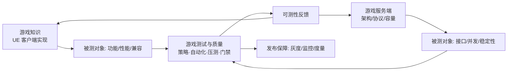
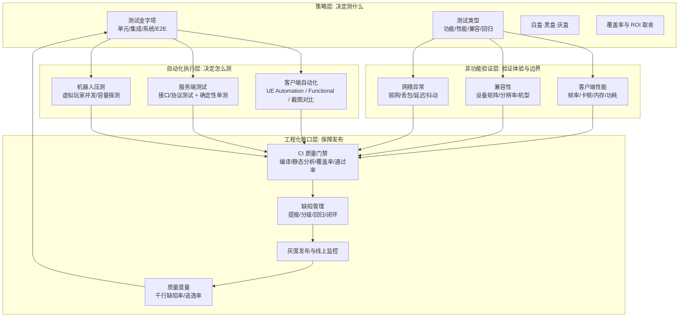

# 游戏测试与质量 · 知识库

> 面向游戏研发全流程（客户端 + 服务端）的**测试与质量保障体系**知识整理：从测试策略、自动化测试、性能/兼容/网络异常验证，到 CI 质量门禁与缺陷管理。
> 同步目录：`C:\project\git\游戏测试与质量` → https://github.com/fantuan812/learning.git
> 定位：本库不是"点状技巧"集合，而是一条完整的**质量链路**——先定策略（01），再落地客户端自动化（02）与服务端压测（03），随后验证非功能质量（04），最后用门禁、缺陷管理与度量把质量收口进工程化流程（05）。

## 知识库定位

本知识库是「游戏全栈知识体系」中的**质量保障（QA · Quality Assurance）板块**，与另外两个核心知识库构成研发链路闭环：

| 知识库 | 定位 | 与本库的协作关系 |
| --- | --- | --- |
| [游戏知识](../游戏知识/README.md) | UE 客户端开发：引擎基础、渲染、玩法、网络同步、UI、工具链与打包 | 提供**被测对象**与**测试支撑设施**：`08-工具链与打包发布`（构建、CI、热更新）、`07-UI与性能优化`（性能基线）、`06-网络同步`（网络行为） |
| [游戏服务端](../游戏服务端/README.md) | 服务端架构、网络通信、数据业务、运维监控 | 提供**被测对象**：协议、业务逻辑、容量模型；本库的接口测试、确定性单测、机器人压测、混沌测试直接作用于其上 |
| [游戏测试与质量](../游戏测试与质量/README.md)（本库） | 测试策略、自动化、非功能验证、CI 门禁与缺陷管理 | 反向对两个知识库提出**可测性（Testability）**与**可观测性（Observability）**要求，形成反馈闭环 |

一句话概括三个库的分工：

- [游戏知识](../游戏知识/README.md) 负责"**造出来**"（客户端功能实现）；
- [游戏服务端](../游戏服务端/README.md) 负责"**跑得稳**"（服务端架构与容量）；
- 本库负责"**验证对、测得准、发得放心**"（质量验证与发布保障）。



## 文件列表

| 文件 | 一句话简介 |
| --- | --- |
| [01-测试金字塔与测试策略](01-测试金字塔与测试策略.md) | 建立测试分层模型（单元/集成/系统/E2E）与测试类型地图（功能/性能/兼容/回归），辨析白盒/黑盒/灰盒，明确客户端与服务端差异化的测试策略、覆盖率目标与 ROI 取舍 |
| [02-客户端自动化测试](02-客户端自动化测试.md) | 深入 UE 自动化测试体系（Automation、Functional Test、截图对比测试），讲解 C++/蓝图测试编写、断言与异步等待，以及测试如何在 CI 中运行，并与 Unity Test Framework 对比 |
| [03-服务端测试与机器人压测](03-服务端测试与机器人压测.md) | 覆盖接口/协议测试、确定性逻辑单元测试、虚拟玩家机器人压测（并发模型、QPS/延迟/成功率指标）、压测工具与方法论、混沌测试简介 |
| [04-性能兼容与网络异常测试](04-性能兼容与网络异常测试.md) | 客户端性能测试（帧率/卡顿/内存/功耗）、兼容性测试（设备矩阵/分辨率/机型分级）、网络异常测试（弱网/丢包/延迟模拟）、热更新与版本兼容保障 |
| [05-CI质量门禁与缺陷管理](05-CI质量门禁与缺陷管理.md) | CI/CD 流水线中的质量门禁（编译/静态分析/覆盖率/测试通过率）、缺陷提报分级与回归流转、灰度发布与线上监控、质量度量指标（千行缺陷率/逃逸率） |
| [06-UE Dedicated Server联机验收与Gauntlet.md](<06-UE Dedicated Server联机验收与Gauntlet.md>) | UE5.8 Dedicated Server 启动冒烟、RunUnreal/Gauntlet Server+多Client E2E、JIP/Travel/重连、网络仿真、Soak/故障注入、证据包与发布门禁 |

## 学习顺序建议

按"先立策略 → 再学手段 → 后收口工程化"的顺序阅读，效果最佳：

**阶段一：建立测试世界观（必读，约 1~2 天）**

1. 先通读本 README，建立"测试体系全景图"的整体认知；
2. 精读 [01-测试金字塔与测试策略](01-测试金字塔与测试策略.md)：理解为什么"单元测试要占 70%"、E2E 为什么"贵且脆"，以及客户端/服务端策略差异。这是后续所有文档的思维底座。

**阶段二：客户端测试手段（需 UE 基础）**

3. 阅读 [02-客户端自动化测试](02-客户端自动化测试.md)。前置知识：[游戏知识](../游戏知识/README.md) 的 `08-工具链与打包发布`（UBT/UAT/CI）与 `03-游戏玩法编程`（Gameplay 框架）。目标是能在本地跑通至少一个 Automation Test 与一个 Functional Test。

**阶段三：服务端测试手段（需服务端基础）**

4. 阅读 [03-服务端测试与机器人压测](03-服务端测试与机器人压测.md)。前置知识：[游戏服务端](../游戏服务端/README.md) 的 `01-架构与网络`（协议与消息系统）。目标是理解"确定性测试"与"虚拟玩家并发压测"两套方法论。

**阶段四：Dedicated Server 联机验收**

6. 阅读 [06-UE Dedicated Server联机验收与Gauntlet](<06-UE Dedicated Server联机验收与Gauntlet.md>)。前置知识：[游戏知识](../游戏知识/README.md) 的 `08-工具链与打包发布`、`06-网络同步`，以及 [游戏服务端](../游戏服务端/README.md) 的 `05-UE Dedicated Server平台化`。目标是能从 Server Target/Archive 走到 Ready、Reservation、多人 E2E、证据包和发布门禁。

**阶段五：非功能验证**

7. 阅读 [04-性能兼容与网络异常测试](04-性能兼容与网络异常测试.md)。前置知识：[游戏知识](../游戏知识/README.md) 的 `07-UI与性能优化`、`06-网络同步`。建议配合一台真机与一台低端机实操。

**阶段六：工程化收口**

8. 阅读 [05-CI质量门禁与缺陷管理](05-CI质量门禁与缺陷管理.md)。前置知识：`02`、`03`、`04`、`06` 的可执行产物（测试命令、报告格式）。目标是能把"质量红线"写进流水线，把"缺陷"管成闭环。

## 测试体系全景图



图中可见本库的核心思想：**策略层决定方向，执行层产出证据，验证层覆盖体验，工程化层把证据变成"门禁"，最终用度量反向校准策略**——形成一个持续改进的闭环。

## 每篇文档的统一结构

本库所有正文统一采用以下结构，便于检索与速读：

1. **概述**：这篇解决什么问题、核心结论是什么；
2. **核心概念（表格）**：术语中英对照 + 一句话定义；
3. **原理详解**：机制、流程、取舍的深入讲解（配 Mermaid 图）；
4. **示例**：可运行的代码 / 配置 / 命令；
5. **最佳实践**：可直接落地的检查清单与团队规范；
6. **常见问题 FAQ**：高频踩坑与解答；
7. **关联阅读**：指向 [游戏知识](../游戏知识/README.md)、[游戏服务端](../游戏服务端/README.md) 及本库其他篇目。

## 与相邻知识库的协作方式

| 你要做的事 | 先读本库哪篇 | 需要的上游知识（相邻知识库） |
| --- | --- | --- |
| 为玩法系统补测试 | 01、02 | 游戏知识 `03-游戏玩法编程`、`06-网络同步` |
| 给战斗逻辑写确定性单测 | 03 | 游戏服务端 `01-架构与网络`（帧同步/状态同步） |
| 做开服前容量评估 | 03 | 游戏服务端 `02-数据与业务`（存储与缓存） |
| 定位卡顿/内存问题 | 04 | 游戏知识 `07-UI与性能优化` |
| 设计弱网表现 | 04 | 游戏知识 `06-网络同步`（预测/延迟补偿） |
| 接入打包与热更新测试 | 04 | 游戏知识 `08-工具链与打包发布` |
| 搭 CI 门禁流水线 | 05 | 游戏知识 `08-工具链与打包发布`（UAT 命令行） |
| 上线监控与告警 | 05 | 游戏服务端 `02-数据与业务`（部署运维与监控） |

## 各篇核心知识点速览

### 01-测试金字塔与测试策略

- 测试金字塔四层（单元/集成/系统/E2E）的数量、成本、速度特征，以及 70/15/10/5 的预算分配原则；
- 测试类型地图：功能 / 性能 / 兼容 / 回归（及安全、体验）各自验证什么属性、用什么手段；
- 白盒 / 黑盒 / 灰盒的适用场景与选择原则（关键契约用灰盒锁死）；
- 客户端 vs 服务端策略差异："双塔模型"与服务端权威原则；
- 覆盖率（行 / 分支 / 路径）的 S 形收益曲线，ROI 决策框架；
- 测试用例设计方法（等价类 / 边界值 / 判定表 / 场景法 / 错误推测 / 探索性测试）；
- 测试环境分级（本地 / CI / 测试服 / 灰度服 / 压测服）与数据工厂实践；
- 常见反模式：冰淇淋筒、奖杯测试、倒金字塔、100% 覆盖崇拜。

### 02-客户端自动化测试

- UE Automation Test：IMPL_SIMPLE / IMPL_COMPLEX_AUTOMATION_TEST 宏、Latent Command 异步推进、Automation Controller 调度；
- Functional Test：AFunctionalTest、测试关卡、蓝图断言节点的编写方式；
- 截图对比测试：基线录制、容差配置、按平台隔离基线；
- C++ 单元测试模块组织（`.Tests` 模块、Build.cs、断言宏）、蓝图测试适用边界；
- CI 运行：`-ExecCmds="Automation RunTests ..."`、`-nullrhi -unattended -TestExit -ReportOutputPath`；
- 与 Unity Test Framework（EditMode / PlayMode）的横向对比与选型建议。

### 03-服务端测试与机器人压测

- 接口 / 协议测试：传输层、编解码层、业务层、数据层、安全层的断言点；契约测试防漂移；
- 确定性测试：随机 / 时钟 / 存储注入，属性测试（Property-based Testing）兜底；
- 机器人压测：无状态请求压测 vs 有状态虚拟玩家；行为比例、并发模型、调度器架构；
- 性能指标口径：QPS、P50/P95/P99 延迟、成功率、资源水位与经验红线；
- 压测工具：wrk / ghz / k6 / Locust / 自研机器人客户端的选型；
- 方法论五步：定目标 → 搭基线 → 阶梯加压找拐点 → 长稳与尖峰 → 出报告；
- 混沌测试：故障注入清单（杀进程、断库、时钟偏移等）与爆炸半径控制。

### 04-性能兼容与网络异常测试

- 客户端性能：帧时间分解（GameThread / RenderThread / GPU）、Hitch 定位、内存与功耗；
- 性能测试环境固定项与"基线→回归→定位→再采集"标准流程；
- 兼容性：设备矩阵四维度收敛、机型分级、云真机与真机墙、分辨率与异形屏适配；
- 网络异常：延迟 / 丢包 / 抖动 / 带宽 / 断网 / 切网模拟（Clumsy、tc netem、UE Network Emulation）；
- 热更新与版本兼容：增量补丁、强更、回滚、新旧并存、协议与存档兼容矩阵。

### 05-CI质量门禁与缺陷管理

- 分层门禁：提交级 / 合入级 / 版本级 / 发布级各自的检查项与阈值；
- 门禁实现要点：新告警零容忍、按模块设覆盖率阈值、测试通过率 100%、包体积与契约漂移检查；
- 缺陷管理：提报模板、P0~P3 分级与响应时限、生命周期状态机、回归黄金法则（修复必带用例）；
- 灰度发布：1% → 10% → 50% → 100% 分阶段放量、监控红线、回滚预案；
- 质量度量：逃逸率、千行缺陷率、缺陷重开率、MTTD / MTTR、线上事故数的口径与用法。

## 常见工作场景速查表

| 你的问题 | 直达篇目 |
| --- | --- |
| 新系统上线前怎么定测试方案？ | 01（策略）+ 05（门禁与度量） |
| 想在 UE 里写第一个自动化测试？ | 02 |
| 开服前想验证服务器扛不扛得住？ | 03 |
| 玩家反馈"卡顿/闪退/进不去"？ | 04 |
| 想给 MR 加质量门禁，从哪几项开始？ | 05（提交级/合入门禁） |
| 覆盖率设多少合适？ | 01（覆盖率与 ROI）+ 05（门禁阈值） |
| 弱网下交易/战斗会出什么错？ | 04（网络异常）+ 03（超时与幂等） |
| 想量化"测试团队到底有没有用"？ | 05（逃逸率、MTTD/MTTR） |
| 灰度发布要盯哪些指标？ | 05（灰度与监控）+ 04（性能红线） |
| 想给策划做的数值系统补测试？ | 01（黑盒设计）+ 02（蓝图测试） |
| 上线后线上事故如何复盘改进？ | 05（缺陷闭环）+ 01（ROI 重分配） |
| Dedicated Server 上线前如何验收？ | 06（Gauntlet E2E）+ 05（发布门禁）+ 游戏服务端 05（实例平台化） |

## 关键术语索引

| 术语 | 所在篇目 | 一句话解释 |
| --- | --- | --- |
| 测试金字塔 Test Pyramid | 01 | 单元/集成/系统/E2E 的分层与预算模型 |
| 白盒 / 黑盒 / 灰盒 | 01 | 按内部可见性划分的三类测试视角 |
| 覆盖率 Coverage | 01、05 | 代码被执行程度，行/分支/路径三档 |
| ROI | 01 | 测试投入与避免损失之比，动态调整依据 |
| Automation Test | 02 | UE 的 C++/蓝图自动化测试框架 |
| Functional Test | 02 | 关卡内玩法行为测试（AFunctionalTest） |
| 截图对比 Screenshot Test | 02 | 渲染像素与基线对比的回归手段 |
| Latent Command | 02 | UE 测试的异步跨帧执行命令 |
| 契约测试 Contract Testing | 03 | 以契约文件锁死前后端实现的校验 |
| 确定性测试 Deterministic Test | 03 | 固定随机/时钟/存储，保证可复现 |
| 机器人压测 Bot Stress | 03 | 虚拟玩家并发模拟真实业务负载 |
| QPS / P99 / 成功率 | 03 | 吞吐、长尾延迟、成功占比三大压测指标 |
| 长稳 / 尖峰测试 | 03 | 长时间中载与瞬间大流量的两类压测 |
| 混沌测试 Chaos Testing | 03 | 主动注入故障验证自愈与降级 |
| 设备矩阵 Device Matrix | 04 | 代表性机型的收敛清单 |
| 弱网模拟 Network Impairment | 04 | 延迟/丢包/抖动/带宽的实验室注入 |
| 热更新 Hot Update | 04 | 增量资源/代码更新及其兼容验证 |
| 质量门禁 Quality Gate | 05 | 流水线中不可绕过的硬性检查 |
| 逃逸率 Escape Rate | 05 | 线上缺陷占比，衡量测试有效性 |
| 千行缺陷率 Defects/KLOC | 05 | 按代码规模归一化的缺陷密度 |
| 灰度发布 Canary Release | 05 | 按比例放量、异常即停的发布方式 |
| MTTD / MTTR | 05 | 平均发现时长 / 平均修复时长 |

## 质量目标参考基线（示例）

> 以下为中小型项目可参考的起步基线，实际值需结合项目阶段与团队规模校准，并写入门禁与发布检查单。

| 指标 | 参考基线 | 备注 |
| --- | --- | --- |
| 单元/接口测试通过率 | 100% | 门禁硬性要求，失败即阻断 |
| 核心模块覆盖率 | 行 ≥ 80%，分支 ≥ 70% | 战斗/经济/背包等高风险模块 |
| 外围模块覆盖率 | 行 ≥ 40% | 工具类、展示类模块 |
| CI 合入门禁耗时 | ≤ 15 分钟 | 超时则拆分流水线 |
| 缺陷逃逸率 | ≤ 10% | 按版本统计，逐月下降 |
| P0/P1 响应时限 | P0 < 2h / P1 < 24h | 与缺陷分级表一致 |
| 线上崩溃率 | ≤ 0.5%（按版本） | 高于即停止放量 |
| 关键接口 P99 延迟 | ≤ 500ms | 按接口类型细分 |
| 低端机平均帧率 | ≥ 30 FPS | 最低档机型为及格线 |
| 回归冒烟时长 | ≤ 10 分钟 | 每次合入执行 |

## 按角色推荐阅读路径

| 角色 | 建议路径 | 关注重点 |
| --- | --- | --- |
| 客户端开发 | README → 01 → 02 → 04 | 单元测试下沉、性能基线、热更验证 |
| 服务端开发 | README → 01 → 03 → 05 | 确定性测试、压测指标、门禁与监控 |
| QA 工程师 | README → 01 → 02 → 04 → 05 | 用例设计、测试环境、缺陷闭环 |
| 策划 | README → 01（黑盒/边界值）→ 02（蓝图测试） | 数值与流程验证 |
| 性能/兼容工程师 | README → 04 → 01 → 03 | 帧时间分解、设备矩阵、压测 |
| 技术负责人 | README → 01 → 05 | 策略取舍、门禁体系、度量看板 |

## 阅读自测清单

读完六篇正文后，你能回答以下问题即为合格：

- [ ] 为什么单元测试要占预算的大头？E2E 为什么必须少而精？
- [ ] 白盒、黑盒、灰盒分别适合谁、测什么？
- [ ] 客户端与服务端测试策略最大的三个差异是什么？
- [ ] 覆盖率达到多少算"够用"？如何防止覆盖率虚高？
- [ ] UE 的 Simple Test 与 Complex Test 有什么区别？Latent Command 解决什么问题？
- [ ] 截图对比测试的三大敌人是什么？如何缓解？
- [ ] 为什么服务端测试必须"确定性"？随机与时钟如何注入？
- [ ] 机器人压测与普通接口压测的本质区别是什么？
- [ ] P50 / P95 / P99 各代表什么？为什么游戏更看重 P99？
- [ ] 弱网测试至少覆盖哪几条核心链路？
- [ ] 合入门禁应包含哪几项检查？各设什么阈值？
- [ ] P0 缺陷的标准响应流程是什么？
- [ ] 逃逸率怎么算？它衡量的是什么能力？
- [ ] 灰度发布每阶段要盯哪些指标？触发回滚的红线是什么？

## 撰写规范

- 每篇文档遵循上文"统一结构"，不少于 300 行正文；
- 框架/流程使用 Mermaid 图辅助说明（flowchart、graph、sequenceDiagram 等）；
- 术语首次出现给出**中英文对照**（如：测试金字塔 Test Pyramid、逃逸率 Escape Rate）；
- 示例优先给出可执行的代码/命令/配置片段，并注明运行环境；
- 涉及 UE 框架处引用 [游戏知识](../游戏知识/README.md) 对应分类，涉及服务端压测处引用 [游戏服务端](../游戏服务端/README.md)；
- 全部文件 UTF-8 无 BOM 编码，Markdown 格式，标题层级清晰（`#` 仅用于文档标题，正文从 `##` 开始）。

## 维护与更新

- 新增知识点：按"策略 / 客户端自动化 / 服务端压测 / Dedicated Server 联机验收 / 非功能验证 / 工程化"六个主题归入对应篇目；
- 重大方法论变化（如新引擎版本测试框架迁移）需同步更新本 README 的全景图与学习顺序；
- 每篇文档底部的"关联阅读"应随相邻知识库的更新同步维护；
- 提交前校验：所有内部链接可解析、Mermaid 语法可在 GitHub 渲染、无遗留 TODO 占位。

## 目录快照

```
游戏测试与质量/
├── README.md                     # 本文件：导航、定位、学习顺序、全景图
├── 01-测试金字塔与测试策略.md      # 测试分层模型与策略（单元/集成/系统/E2E、白盒黑盒灰盒、ROI）
├── 02-客户端自动化测试.md          # UE Automation / Functional / 截图对比 / C++ 与蓝图测试 / CI
├── 03-服务端测试与机器人压测.md    # 接口协议测试 / 确定性单测 / 虚拟玩家压测 / QPS 指标 / 混沌测试
├── 04-性能兼容与网络异常测试.md    # 帧率卡顿内存功耗 / 设备矩阵 / 弱网模拟 / 热更新兼容
├── 05-CI质量门禁与缺陷管理.md      # 质量门禁 / 缺陷流转 / 灰度监控 / 质量度量
└── 06-UE Dedicated Server联机验收与Gauntlet.md # DS 启动冒烟 / Gauntlet 多角色 / 网络异常 / 发布门禁
```

> 建议将本 README 作为团队新成员"测试入门第一课"的阅读起点：先看图、再按阶段顺序读五篇正文，最后回到全景图自查"我所在环节的输入输出是什么"。
