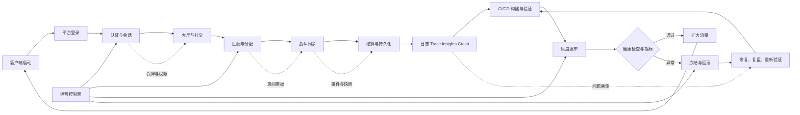
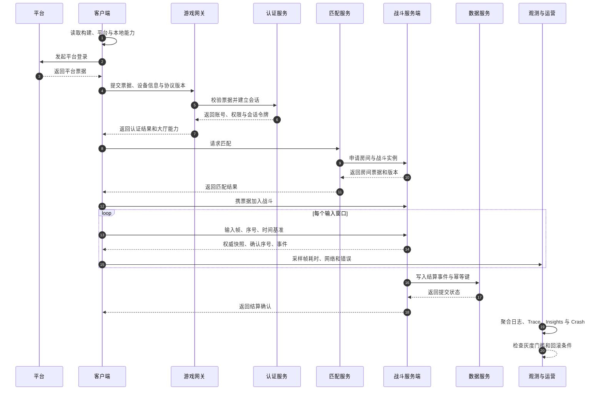

# 游戏全栈运行闭环总览

> 本文是独立知识正文，面向从客户端到服务端、运营与发布的端到端协作。
> 文中没有给出项目源码事实；未确认的接口、目录、参数与容量均明确写成方案或示意。

## UE5.8 元数据

- 版本基准：UE5.8.0。
- 引擎变更基线：CL55116800。
- 分支标识：++UE5+Release-5.8。
- 适用范围：以 UE5.8 为基准的联网游戏客户端、专用服务器、工具链、测试与运营闭环。
- 适用范围：适合新项目架构设计、旧项目迁移评审、运行故障定位和发布门禁设计。
- 兼容性边界：本文只约束概念、责任、数据流和验证方法，不承诺任意项目的插件 API、配置键或源码行为。
- 兼容性边界：具体引擎分支、平台 SDK、渲染后端、网络协议和第三方服务必须由项目锁定版本验证。
- 兼容性边界：示意代码需要按照项目模块名、构建系统、权限模型和数据契约改写后才能编译。
- 官方参考：https://dev.epicgames.com/documentation/en-us/unreal-engine
- 最后更新：2026-08-07（本轮修订：补动画域小节、DS 实例生命周期说明、关联阅读补全）。

## 概述

全栈运行闭环描述一条可观测、可恢复、可回滚的游戏业务路径。
它从进程启动开始，经过登录、认证、大厅、匹配、战斗、持久化，最终落到发布和运营反馈。
客户端负责体验、输入、预测、表现和容错，但不应成为权威业务数据的唯一来源。
服务端负责身份、规则、状态裁决、数据一致性和跨实例协作。
运营负责配置、监控、告警、灰度、回滚、成本、合规和事故响应。
三层通过版本化契约相连，契约包括网络消息、配置、存档、日志字段和指标标签。
每个阶段都需要有成功路径、超时路径、重试边界和人工处置路径。
任何写操作都应具备可追踪的请求标识、幂等键和审计结果。
任何跨服务事件都应能够关联玩家、会话、匹配、战斗和发布版本。
闭环的目标不是让所有故障消失，而是让故障可发现、可解释、可降级、可恢复。

## 1. 运行闭环的核心模型

一次运行可抽象为启动上下文、身份上下文、玩法上下文和运营上下文。
启动上下文记录平台、构建版本、渲染能力、内容版本和本地配置。
身份上下文记录登录方式、令牌状态、账号状态、会话状态和权限范围。
玩法上下文记录房间、队伍、地图、战斗帧、输入序列和权威快照。
运营上下文记录发布环、实验分组、区域、节点、告警和处置动作。
上下文之间用不可变 ID 关联，用时间戳和版本号表达先后与兼容关系。
客户端显示状态不等于服务端权威状态。
服务端确认成功不等于持久化已经完成，除非协议明确采用同步提交语义。
日志到达采集端不等于日志已被长期保存，必须区分接收、处理和归档状态。
灰度通过不等于全量安全，必须保留自动回滚条件和人工冻结开关。
闭环设计应从最坏路径倒推最小可用能力。

## 2. 客户端、服务端、运营三层职责表

| 层级 | 主要职责 | 权威边界 | 关键输入 | 关键输出 | 失败时的动作 |
| --- | --- | --- | --- | --- | --- |
| 客户端 | 启动、登录交互、输入、预测、表现、缓存、诊断采集 | 不拥有账号资产和战斗最终裁决权 | 平台回调、玩家输入、服务器快照、配置 | UI 状态、输入帧、遥测、用户提示 | 重试、降级、断线重连、回到安全界面 |
| 服务端 | 会话、认证、匹配、规则、战斗裁决、存档、限流 | 拥有业务状态与安全策略的最终解释权 | 客户端请求、平台票据、内部事件、配置 | RPC 响应、快照、事件、审计记录 | 拒绝、隔离、迁移、补偿、回滚 |
| 运营 | 发布、配置、告警、灰度、成本、合规、事故指挥 | 拥有变更流程和风险控制的审批边界 | 指标、日志、Trace、Crash、工单 | 环境变更、策略开关、回滚命令、复盘结论 | 冻结、降级、扩容、回滚、通知 |
| 客户端 | 资源加载、分包、着色器预热和本地性能预算 | 只管理本地资源生命周期 | 资产清单、平台能力、远端配置 | 加载进度、资源错误、帧率指标 | 使用占位资源或关闭高成本效果 |
| 服务端 | 版本路由、区域调度、房间生命周期 | 保持协议和状态迁移的一致性 | 构建版本、区域容量、健康检查 | 分配结果、迁移事件、容量指标 | 拒绝新局、迁移房间、切换备用区 |
| 运营 | 事件配置、公告、实验和客服工具 | 不能绕过审计直接修改核心资产 | 审批单、实验规则、事故等级 | 可审计的配置版本和操作记录 | 撤销配置、停止实验、人工接管 |

职责划分的第一原则是权威性清晰，第二原则是操作可审计。
客户端可以预测结果以改善手感，但预测结果必须能够被校正。
服务端可以缓存热点数据，但缓存必须有失效策略和来源标识。
运营可以控制参数，但高风险参数应设范围、审批和自动保护。

## 3. 端到端闭环图

下面的图是方案示意，展示阶段、数据边界和反馈回路，不代表某个项目的实际拓扑。



启动负责发现环境，登录负责获得平台身份，认证负责建立游戏会话。
大厅阶段只应暴露当前账号有权访问的社交和匹配能力。
匹配阶段产生房间票据、区域信息、协议版本和重连所需的最小上下文。
战斗阶段由权威服务端推进状态，客户端负责输入、预测和渲染。
结算阶段将战斗结果转换为可验证的业务事件，再写入持久化系统。
观测阶段把体验问题映射到请求、实例、构建和发布环。
CI/CD 将修复和配置重新放入相同的验证路径，避免只修线上不修流程。
灰度阶段以小流量验证真实负载，指标异常时触发冻结或回滚。

## 4. 端到端时序图

时序图同样是跨组件方案示意，具体服务名和字段名应由项目契约确定。



时序中每个请求都应具备超时、取消和重复到达语义。
网关只做协议边界和路由，不应偷偷改变战斗规则。
认证服务应返回最小权限和过期时间，不应把长期密钥下发到客户端。
匹配服务只确认分配，不替代战斗服务端进行帧级裁决。
战斗服务端写结算事件时应使用稳定幂等键。
数据服务返回已接收、已提交、已冲正等明确状态，避免客户端猜测。
观测数据不应阻塞关键战斗路径，采集失败应有采样和丢弃策略。

## 5. 客户端启动、登录与会话

启动阶段先完成进程级崩溃保护、日志通道和版本自检。
随后读取平台能力、图形设备、输入设备、区域和本地化设置。
启动清单应包含构建版本、内容版本、协议版本和配置版本。
启动清单校验失败时，客户端应进入可解释的修复或更新界面。
资源加载器要区分必需资源、可选资源、可延迟资源和失败占位资源。
登录 UI 只展示用户可以理解的状态，不展示内部令牌或服务地址。
登录流程应支持取消，并确保取消后不会残留后台回调修改已销毁对象。
平台登录成功后，客户端只提交短期票据或平台要求的证明材料。
客户端本地保存的会话材料应按平台安全存储能力处理。
会话过期时，先暂停需要权限的操作，再尝试有限次数的续期。
续期失败要区分网络暂时不可用、账号失效和版本不兼容。
重连需要新的连接上下文，不应复用已失效的传输对象。
退出账号时清理缓存的账号范围数据，保留经过脱敏的诊断信息。

## 6. CommonUI、UMG 与 MVVM

CommonUI+UMG MVVM 是一种客户端 UI 分层方案，具体组合方式属于项目架构选择。
UMG 负责控件和布局，CommonUI 负责跨平台输入层级、路由和通用交互能力。
ViewModel 负责把业务状态转换成可绑定的展示状态。
View 只消费展示状态并发出用户意图，不直接修改服务端资产。
Model 或领域服务负责请求、缓存、权限和错误映射。
导航栈应为登录、主菜单、匹配、战斗、结算和错误态定义清晰的进入退出契约。
同一时刻只有一个层级拥有确认、取消和返回等高优先级输入的处理权。
UI 状态要区分加载中、可操作、提交中、成功、失败和过期。
异步回调回到 UI 时，先验证页面实例、账号上下文和请求序号。
列表组件只绑定可见窗口需要的数据，避免用整个资产集合驱动重建。
高频数值用节流或批量刷新，避免战斗帧级数据直接触发全树重绘。
ViewModel 应提供可测试的纯转换函数，减少对 Widget 生命周期的耦合。
服务端错误要映射为稳定错误码和本地化文案键，不要把原始异常直接展示。
输入焦点、手柄导航、键鼠操作和触屏操作要在同一状态机内验证。
无障碍、字体缩放和安全区域应纳入 UI 预算，而不是发布后补救。

### UI 状态示意

```cpp
// 方案示意：类型名、绑定宏和异步接口需按项目 MVVM 实现替换。
enum class ELoginState { Idle, Loading, Authenticated, Failed, Expired };

struct FLoginViewModel {
    ELoginState State = ELoginState::Idle;
    FString ErrorKey;
    bool CanSubmit() const { return State == ELoginState::Idle || State == ELoginState::Failed; }
};
```

## 7. Enhanced Input 与 GAS

Enhanced Input+GAS 适合将输入意图、能力激活、预测和效果应用拆开管理。
Input Action 表达玩家意图，例如移动、瞄准、交互和释放技能。
Input Mapping Context 表达当前上下文，例如大厅、战斗、载具和菜单。
上下文切换需要可追踪的优先级、占用关系和恢复规则。
GAS 的能力应定义激活条件、消耗、冷却、标签、预测策略和拒绝原因。
输入层不应直接操纵生命值、库存或结算结果。
客户端可以发起能力请求并预测表现，但服务端要验证权限和成本。
预测失败时，表现层必须有回滚、补偿或无害化处理。
Gameplay Tags 应形成受控词汇表，避免同义标签导致规则分叉。
属性修改要注明来源、时间窗和叠加规则，便于重放和审计。
能力释放的请求序号用于去重、排序和关联日志。
客户端按确认序号清理已确认输入，保留少量未确认输入用于重放。
输入采样频率、网络发送频率和模拟帧率不必相同，但换算关系必须明确。
技能表现可以提前播放，伤害、掉落和死亡状态必须由权威逻辑确认。

### 能力请求示意

```cpp
// 方案示意：展示边界，不代表 UE5.8 或项目源码中的真实 API。
struct FAbilityIntent {
    uint32 Sequence = 0;
    FGameplayTag AbilityTag;
    FVector_NetQuantize AimPoint;
};

bool UClientAbilityFacade::RequestIntent(const FAbilityIntent& Intent) {
    if (!LocalInputPolicy::Allows(Intent.AbilityTag)) return false;
    SendIntentToAuthority(Intent);
    PlayPredictedCue(Intent.AbilityTag);
    return true;
}
```

## 8. GameplayTasks、StateTree 与 AI

GameplayTasks+StateTree+AI 可以构成任务调度、决策状态和行为执行的分层组合。
StateTree 负责根据条件选择状态和转移，不应承载所有副作用。
GameplayTasks 负责可抢占、可并行或需要资源锁的行动。
AI 感知负责输入事实，决策层负责解释事实，执行层负责改变世界。
每个 AI 行为要定义开始、运行、成功、失败、取消和超时路径。
任务之间应明确占用的移动、动画、武器、导航或网络资源。
高代价感知要按距离、可见性、状态和时间预算分级更新。
StateTree 状态切换日志至少包括实体 ID、旧状态、新状态和原因。
行为树、StateTree 或自定义决策器不应绕过服务端权限边界。
服务器 AI 的确定性重点是规则一致，不是强求所有浮点计算完全相同。
AI 的目标选择、伤害判定和掉落归属需能通过战斗事件复盘。
导航失败时应使用备用点、等待、重新规划或安全撤退策略。
任务取消必须释放资源锁，避免一个失效任务永久阻塞其他行为。
AI 峰值预算应按活跃实体数、感知频率和路径查询量做压测。

### AI 状态示意

```text
感知事件 -> StateTree 条件求值 -> 选择任务 -> GameplayTask 执行
       -> 产生动画/移动/攻击意图 -> 权威规则校验 -> 状态事件与遥测
```

## 9. 网络同步：Iris、RPC 与 ReplicationGraph

Iris/RPC/ReplicationGraph 是网络层的三个互补关注点，不能简单互相替代。
Iris 负责可复制对象和属性的传输组织，具体配置应以目标分支能力为准。
RPC 适合表达有方向、有语义的命令或事件，不适合无限堆积高频状态。
ReplicationGraph 适合按连接、空间、兴趣点和对象类型组织复制范围。
服务端应区分可靠命令、非可靠提示、可重建状态和不可重放事件。
可靠通道不是无限队列，必须限制消息大小、频率和生命周期。
复制字段应按权威性、变化频率、可压缩性和重连需求分类。
客户端拥有的瞬时表现可以本地计算，但会影响业务的字段必须由服务器确认。
空间相关对象优先使用兴趣管理减少无关复制，跨区域对象要定义特殊策略。
ReplicationGraph 节点拆分应与地图分区、队伍、观战和管理员视野一致。
RPC 处理器先做会话、权限、版本、序号、范围和状态检查。
收到旧快照时，客户端按版本或确认序号丢弃，不能盲目覆盖新状态。
快照压缩应在可观测的误差和 CPU 预算内进行，避免压缩本身造成卡顿。
网络时间同步需要定义服务器时间、客户端本地时间和显示时间的关系。
重连时优先恢复最小权威快照，再补发可重建事件，避免重放全部历史流量。

### RPC 边界示意

```cpp
// 方案示意：服务端处理顺序应先验证，再改变状态，最后回执。
void ACombatPawn::ServerUseItem_Implementation(uint32 RequestId, FItemId ItemId) {
    if (!Session.IsValid() || !AuthorityRules::CanUseItem(*this, ItemId)) {
        SendReject(RequestId, TEXT("use_item_denied"));
        return;
    }
    if (Idempotency.HasSeen(RequestId)) return;
    Idempotency.Remember(RequestId);
    ApplyItemEffect(ItemId);
    SendAccepted(RequestId);
}
```

## 10. 世界构建与内容流送

World Partition+PCG+Procedural Vegetation+HLOD 组成开放世界内容的一组方案工具。
World Partition 负责大世界单元的组织与按需加载，单元边界应服务于玩法和性能。
PCG 负责以规则生成内容，规则输入、随机种子和版本应可复现。
Procedural Vegetation 适合大量植被分布，但要单独核算碰撞、阴影、风动和流送成本。
HLOD 负责远距离层级代理，代理资产必须有构建、校验、替换和回退流程。
世界单元的加载状态应能映射到玩家位置、服务器兴趣范围和客户端流送状态。
生成结果应记录生成器版本、种子、输入数据版本和人工覆盖列表。
动态玩法对象不能假定远距离 HLOD 具备完整交互能力。
编辑器预览、烘焙产物和运行时生成之间要定义唯一真相来源。
流送失败时，优先保留导航安全、出生点、关键交互和 UI 所需资源。
内容依赖图要阻止循环引用，并在 CI 中检查缺失、重复和超大资源。
服务器可以使用简化碰撞和逻辑世界，客户端使用高质量表现世界，但坐标契约一致。
开放世界压测应覆盖快速移动、传送、多人聚集、昼夜切换和内存回收。

## 11. 渲染与画面预算

Nanite/Lumen/MegaLights/TSR 是高质量画面方案中的不同成本维度。
Nanite 解决几何细节与可见性组织的一部分问题，不能消除材质、动画和带宽成本。
Lumen 的反射与全局光照质量要结合平台、场景尺度和动态对象数量评估。
MegaLights 的灯光数量、阴影、体积和可见性成本需要用目标设备实测。
TSR 以时间信息换取输出分辨率效果，运动、透明、细线和快速镜头要重点验收。
画面预算应同时记录 GPU 帧、CPU 帧、内存、显存、流送、Shader 和温度。
配置不应只按高、中、低三档描述，还应给出可独立关闭的高成本特性。
动态分辨率、阴影距离、粒子数量和后处理强度应设上下限。
灯光、材质和特效资产要标记目标平台与预期使用场景。
性能采样要区分平均值、P95、P99 和最差窗口，避免平均数掩盖尖峰。
场景验收应包含静态镜头、战斗高峰、多人同屏、快速移动和后台恢复。
画质降级要保持玩法可读性，优先关闭非关键装饰而不是关键信息反馈。
任何新渲染特性进入默认配置前，都要经过基准场景和真实关卡双重验证。

## 12. 动画与表现

动画域覆盖从资产到表现的求值闭环，属于客户端表现层，但必须与服务端权威和网络预算协同。
动画蓝图与状态机负责常规状态驱动，蒙太奇负责精确控制的过场动作；网络只同步语义状态与触发事件，姿态、混合和播放进度由客户端本地求值。
AnimNext/UAF 是 UE5.5+ 演进的新一代动画求值框架（实验性），以 Trait 与求值 VM 组织动画逻辑（概念：[04-动画系统/05-AnimNext动画框架](04-动画系统/05-AnimNext动画框架.md)，源码：[12-引擎源码分析/36-AnimNext与UAF源码](12-引擎源码分析/36-AnimNext与UAF源码.md)）；引入前应核对本机版本的插件形态并评估团队能力。
动画预算应纳入性能门禁：骨骼数量、动画采样、IK/Control Rig、物理混合与 URO 降级策略都应有上限和可验证的降级路径。
过场动画（Sequencer）只同步触发与关键帧语义，相机、光照与后处理等画面细节由客户端本地执行，避免把表现细节变成网络负载。

## 13. 音频与 Niagara

音频系统负责空间化、混音、优先级、资源流送、暂停恢复和错误降级。
音频事件应携带语义而不是把具体文件名散落在玩法代码中。
混音总线要区分语音、音乐、环境、UI、战斗反馈和系统提示。
同类声音需要并发上限、距离衰减、优先级和抢占策略。
断线、切后台、设备切换和资源缺失都应有可听见且不刺耳的降级表现。
Niagara 负责粒子和视觉反馈，发射器应有生命周期、数量上限和距离裁剪。
粒子事件不能成为未受控的网络广播；网络只同步必要的语义事件或种子。
战斗特效要区分预测特效、确认特效、纠错特效和纯本地特效。
高峰时可以降低粒子精度、发射频率、灯光绑定和碰撞采样。
音频和特效预算应关联到战斗人数、武器类型和场景密度。
失效资源应记录资产标识和加载上下文，便于内容团队快速定位。

## 14. EOS、OSS 与平台服务

EOS/OSS 在这里表示平台服务接入和抽象边界的方案，不代表某个项目已经启用特定产品。
平台登录、好友、成就、统计、语音、会话和邀请应通过稳定的领域接口隔离。
领域接口返回项目统一错误模型，避免上层依赖某个供应商的错误字符串。
平台回调可能异步、重复或乱序，必须以状态机和请求 ID 处理。
跨平台身份关联需要确认账号所有权、合并策略、解绑限制和客服处置流程。
平台服务不可用时，核心离线能力和已在战斗中的安全路径应按设计降级。
服务端验证平台证明材料，客户端不应自行声明拥有某项权益。
接入层记录供应商、区域、接口、耗时、结果码和重试次数，但不记录敏感凭据。
第三方服务的配额和限流需要映射到本地熔断与排队策略。
平台版本升级前要做沙箱、回归、灰度和回滚准备。
所有供应商密钥进入受控密钥管理，不进入客户端包、不进日志、不进提交历史。

## 15. 鉴权、限流、幂等与灾备

鉴权回答“是谁”和“凭什么”，授权回答“能做什么”，审计回答“做过什么”。
网关验证传输层、令牌签发方、过期时间、受众、协议版本和会话状态。
授权策略按账号、角色、队伍、房间、区域和操作危险等级组合。
敏感操作采用短时令牌、二次确认或服务端重新校验。
限流至少按 IP、账号、设备、会话、接口、房间和全局资源池分层。
限流响应应包含稳定错误码、重试建议和剩余等待语义，但不泄露内部容量。
幂等键由业务语义生成，不能只依赖客户端时间戳。
幂等记录应设置生命周期，并说明成功、失败、处理中和已过期的差异。
转账、发奖、购买、结算和补偿等操作必须具备可审计的幂等状态机。
服务端重试只对可安全重试的错误执行，避免把超时当成未知成功而重复发奖。
灾备方案应定义 RPO、RTO、备份频率、恢复步骤和演练负责人。
跨区域故障时先保护数据一致性，再恢复可用性，必要时只开放只读能力。
备份必须加密、校验、分层保存，并定期验证可恢复而不只是“备份成功”。
灾备演练记录实际恢复耗时、缺失依赖、人工步骤和后续修复项。

## 16. 观测：日志、Trace、Insights 与 Crash

日志用于离散事件，Trace 用于跨服务时序，Insights 用于引擎运行画像，Crash 用于异常上下文。
四类数据应共享 trace ID、account hash、session ID、match ID、build ID 和 region 标签。
日志字段要结构化，消息文本用于阅读，字段用于查询和聚合。
敏感数据采用哈希、掩码或删除，不能为了排障复制密码、令牌或完整支付信息。
关键事件至少包含开始、结束、结果、耗时、重试、错误码和版本。
客户端崩溃上报要带最小设备、平台、构建和场景上下文。
符号化需要构建产物和符号服务器保持版本对应，上传权限应受控。
Crash 聚合应按签名、版本、设备、地图、操作和最近变更分组。
Trace 采样应支持错误提升采样和高价值路径保留。
Insights 分析要标记采样窗口、场景、线程、硬件和配置，避免跨条件误比较。
日志采集异常时，游戏主路径不能因同步写盘或阻塞网络而停顿。
采集系统要有保留期限、采样率、成本上限和删除流程。
事故期间先保护证据，再执行清理；清理动作要有审批和审计。

## 17. CI/CD、灰度与回滚

CI/CD 闭环将代码、资产、配置、测试、打包、部署和验证串成可追溯流水线。
提交门禁至少包含格式检查、编译、单元测试、资产依赖检查和基础自动化测试。
构建产物需带源版本、引擎基线、内容版本、配置版本和可复现信息。
客户端包、专用服务器包和运营配置应区分发布单元，又保留兼容矩阵。
部署前验证协议兼容、存档迁移、数据库变更、观测字段和回滚脚本。
灰度按区域、平台、版本、账号组或流量比例切分，并可随时冻结。
灰度期间观察成功率、延迟、崩溃、断线、战斗异常、资源错误和成本。
回滚不应只恢复二进制，还要恢复兼容配置、路由、特性开关和数据库读写策略。
不可逆数据迁移必须先提供向后兼容读取或补偿路径。
发布状态机要区分待发布、验证中、灰度中、全量、冻结、回滚和已归档。
专用服务器实例生命周期（分配、初始化、就绪、在服、排空、回收）应纳入发布与运行状态机，排空先于回收，避免中断存量玩家。
每次发布都有负责人、审批记录、变更摘要、风险项和停止条件。
回滚完成后要验证真实流量已切换，并保留异常样本用于复盘。
热修复也应进入最小化审计流程，不能用“紧急”绕过所有验证。

## 18. Gauntlet、自动化测试、符号服务器与性能预算

Gauntlet 可作为跨进程、跨配置和端到端运行验证的方案入口，实际脚本需按项目实现。
自动化测试应覆盖协议、玩法规则、存档、UI 状态、加载、重连、断线和发布脚本。
单元测试验证纯规则和数据转换，集成测试验证服务边界，端到端测试验证用户路径。
回归用例要固定种子、地图、人口、网络条件和构建标识，才能比较结果。
网络测试加入延迟、抖动、丢包、乱序、断连和重连场景。
客户端测试加入低内存、后台恢复、设备切换、分辨率变化和资源损坏场景。
服务器测试加入实例重启、服务依赖超时、数据库只读、队列积压和区域切换场景。
符号服务器保存与发布版本一一对应的符号，并限制访问和下载审计。
崩溃验证包括上传、聚合、符号化、通知和去重链路。
性能预算至少有启动时长、首帧、加载、CPU、GPU、内存、显存、网络和服务器 Tick。
预算要有目标值、警戒值、阻断值和测量环境。
性能门禁比较同一基准场景的变化，也比较真实关卡的长尾尖峰。
测试结果应进入构建报告，并关联变更、责任模块和是否允许灰度。

### 性能预算示意表

| 指标 | 目标值示意 | 警戒动作 | 阻断动作 |
| --- | --- | --- | --- |
| 客户端平均帧时间 | 目标设备内稳定 | 标记性能回归 | 禁止默认开启新高成本特性 |
| 客户端 P99 帧时间 | 不超过项目门槛 | 抓取 Insights | 退回变更并要求定位 |
| 首次可交互时间 | 版本内可比较 | 优化启动并行度 | 灰度前阻断 |
| 战斗输入往返延迟 | 低于玩法容忍度 | 增加区域观测 | 切换备用路由或限制匹配 |
| 服务端 Tick 超时 | 不出现连续尖峰 | 降低房间容量 | 拒绝新局并扩容 |
| 崩溃率 | 低于发布阈值 | 扩大采样与定位 | 自动冻结或回滚 |

## 19. 安全设计

安全设计应覆盖客户端、网关、服务端、运营后台、构建系统和供应链。
客户端二进制不可视为可信边界，关键校验必须在服务端重复执行。
输入参数做类型、长度、范围、枚举、频率和上下文校验。
对象引用验证归属、距离、状态和生命周期，不能只验证 ID 格式。
反作弊策略要记录证据、置信度、处置等级和申诉路径。
封禁或限制策略应支持误判复核，不能让单一异常样本直接造成永久处罚。
运营后台采用最小权限、强认证、审批、双人复核和操作审计。
CI 保护构建密钥、签名证书、符号和发布凭据。
依赖和插件要有来源、版本、许可证、漏洞和升级责任记录。
服务端防止重放、越权、批量枚举、资源耗尽、日志注入和错误信息泄露。
配置中心防止未授权覆盖，并为高风险配置提供范围保护。
安全事件的处理目标包括止血、留证、恢复、通知、修复和复盘。

## 20. 失败路径与降级矩阵

失败路径不是异常分支的附录，而是闭环设计的核心部分。

| 故障 | 可见症状 | 客户端降级 | 服务端动作 | 运营观测 |
| --- | --- | --- | --- | --- |
| 平台登录超时 | 登录按钮持续等待 | 允许取消并重试 | 限制重试并保留结果码 | 记录供应商与区域耗时 |
| 认证服务不可用 | 无法进入大厅 | 展示维护态 | 熔断、排队或切备用 | 告警依赖错误率 |
| 匹配队列积压 | 匹配时间增长 | 显示预计等待 | 调整分区或容量 | 观测队列长度和 P95 |
| 战斗连接抖动 | 角色回弹或延迟 | 插值、预测、重连 | 保存最小快照 | 观测丢包和重连率 |
| 结算写入超时 | 结算未确认 | 明确处理中 | 幂等重试与补偿队列 | 对账未完成告警 |
| 资源加载失败 | 缺材质或缺特效 | 使用占位或关闭效果 | 不影响权威规则 | 聚合资产与版本 |
| 客户端崩溃 | 进程退出 | 自动恢复入口 | 保护未提交请求语义 | Crash 聚合与通知 |
| 发布指标恶化 | 版本异常升高 | 特性开关降级 | 冻结流量或回滚 | 记录发布事件 |

每个失败态都要有用户可理解的文案、开发可查询的错误码和运营可执行的动作。
重试必须有次数、退避、抖动和总时限，不能制造雪崩。
降级要定义恢复触发条件，避免长期停留在隐性低质量状态。
无法安全恢复的数据写入应进入人工可审核的补偿流程。

## 21. 指标体系

指标分为业务、体验、网络、服务、数据、发布和安全七类。
业务指标包括登录成功率、匹配成功率、战斗完成率和结算完成率。
体验指标包括首帧、首次可交互、加载时长、帧时间、卡顿、音频错误和资源错误。
网络指标包括连接成功率、往返延迟、抖动、丢包、重传、重连和快照大小。
服务指标包括请求速率、错误率、P50、P95、P99、Tick 超时、队列积压和实例水位。
数据指标包括写入成功、幂等命中、补偿数量、对账差异、备份成功和恢复演练结果。
发布指标包括灰度覆盖、版本占比、回滚耗时、变更失败率和冻结次数。
安全指标包括越权拒绝、异常请求、作弊置信度、封禁复核和密钥使用异常。
每个指标都应明确口径、来源、聚合窗口、标签上限和负责人。
告警不应只看绝对阈值，还应看同比、环比、分位数和不同版本差异。
高基数标签需要哈希、采样或分桶，避免观测系统自身被打爆。
核心 SLO 要与用户路径绑定，不要把单一机器健康当成全链路健康。

## 22. 数据契约与版本演进

网络消息、持久化事件、配置和观测字段都应有版本号或兼容规则。
新增字段优先采用可选语义，删除字段先经历停止写入、观察和清理阶段。
枚举新增时，旧客户端要有未知值处理，服务端不能假设所有枚举都已升级。
时间字段统一时区和精度，金额、数量和计数避免使用无法精确表达的类型。
事件名称表达业务事实，命令名称表达请求意图，二者不要混用。
事件应尽量不可变，纠正通过补偿事件或冲正事件表达。
存档迁移应有备份、预演、校验、失败回滚和抽样核对。
配置版本与二进制兼容矩阵要能在发布前自动检查。
协议不兼容时，网关返回明确升级指引或路由到兼容集群。
契约测试由生产者和消费者共同维护，失败时阻止错误组合进入灰度。

## 23. 运行手册的最小内容

运行手册要从用户症状开始，而不是从服务名称开始。
每个故障条目包含影响范围、判定条件、首要动作、止血动作和恢复验证。
还应包括查询入口、相关指标、日志字段、Trace 入口和最近变更。
高风险操作写明前置检查、审批人、执行窗口、回滚动作和完成证据。
手册中的命令只是项目内部方案示意，必须由具备权限的人员按环境替换。
事故等级定义响应时间、通知范围、升级路径和复盘要求。
复盘关注系统性原因、检测缺口、恢复摩擦和防复发措施。
复盘结论进入测试、指标、自动化或文档，而不是只停留在会议纪要。
运行手册定期演练，演练结果应更新人员轮值和联系方式。

## 24. 最佳实践

先定义权威边界，再选择插件、协议和基础设施。
先建立可观测字段，再设计复杂的异步重试。
把成功、拒绝、超时、重复、取消、恢复和回滚都写进状态机。
让请求、事件、快照、日志和发布版本共享稳定关联 ID。
用可复现种子和固定基准场景降低性能与内容回归的比较成本。
高频路径优先保护 CPU、网络、内存和日志写入，不追求无界细节。
客户端预测服务于手感，服务端裁决服务于一致性，运营开关服务于风险控制。
把第三方平台包在领域接口后面，防止供应商错误模型渗透整个代码库。
所有有副作用的写操作都要问：重复到达会怎样，超时后会怎样，恢复后会怎样。
所有发布都要问：怎样知道异常，怎样停止扩大，怎样回到上一版本。
用自动化检查阻止重复出现的事故，而不是只增加人工提醒。
把高风险配置设成受范围约束的参数，并为异常值提供自动保护。
在目标硬件、真实地图、真实网络和真实人口下验证关键预算。
将临时方案标注到期时间、负责人和退出条件，避免临时结构永久化。

## 25. 常见反模式

把客户端 UI 的“成功”当成服务端资产已经提交。
把可靠 RPC 当成事件总线或无限缓存。
把所有战斗对象复制给所有连接，而没有兴趣管理。
把每个粒子、音效和装饰事件都设计成网络事件。
把平均帧率当成唯一性能指标，忽略 P99 和卡顿窗口。
把数据库备份成功当成灾备恢复能力已经验证。
把灰度比例当成安全证明，忽略平台、区域和玩家群体差异。
把日志文本当成稳定契约，导致查询依赖易变字符串。
把插件默认行为当成 UE5.8 的永久保证，未锁定分支和测试条件。
把紧急发布当成绕过测试、审批和审计的理由。
把未知错误统一自动重试，制造队列堆积和重复副作用。
把所有问题归因于网络，未检查线程、资源流送、服务依赖和发布变更。

## 26. 示意：端到端请求状态

```text
Created
  -> Validating
  -> Accepted
  -> Processing
  -> Committed
  -> Acknowledged

Validating -> Rejected
Processing -> TimedOut -> Retryable 或 ManualReview
Processing -> Duplicate -> ReturnExistingResult
Committed  -> Compensating -> Compensated
```

上述状态机是跨业务的抽象示意，不代表具体服务必须使用这些英文状态。
状态转移要记录前态、后态、原因、操作者、请求 ID、幂等键和版本。
客户端只根据明确的回执更新展示状态，不能根据网络连接关闭推断提交失败。
服务端超时后应查询幂等记录或提交结果，再决定重试还是补偿。
运营后台展示处理中状态时，应让人工知道是否可以安全再次触发。

## 27. FAQ

### Q1：客户端预测后被服务器纠正，应该回滚什么？

只回滚可重建的本地预测状态，并用权威快照和未确认输入重新模拟。
不可逆的业务副作用应等待确认，或者使用可抵消的表现层方案。

### Q2：RPC、事件和复制属性如何选择？

命令用 RPC，事实传播用事件，可持续重建的状态用复制属性。
高频状态不要用大量可靠 RPC 传送，需结合快照和兴趣管理设计。

### Q3：日志和 Trace 是否应该全量采集？

核心错误、关键交易和发布事件应高可靠保留；普通路径采用采样和分层保存。
要按排障价值、隐私、成本和系统容量共同决定采集策略。

### Q4：为什么要保留符号服务器？

没有与构建严格匹配的符号，Crash 地址难以还原为可行动的调用栈。
符号服务器本身也是敏感资产，需要权限、保留期限和访问审计。

### Q5：灰度回滚只切换服务端版本够吗？

通常不够，还要核对客户端兼容、配置、路由、数据库读写和特性开关。
不可逆迁移必须提前设计向后兼容和补偿路径。

### Q6：World Partition 和服务器地图逻辑必须完全相同吗？

不必完全相同，但坐标、关键碰撞、出生点、导航和权威玩法语义必须有一致契约。
表现世界可以更精细，逻辑世界可以更简化，差异要被测试覆盖。

### Q7：AI 任务卡住时先改状态还是先重启实体？

先记录状态、任务和资源锁，再按取消、释放、重试和安全重置顺序处理。
直接重启可能掩盖资源泄漏和不可复现的规则错误。

### Q8：性能预算应该由谁维护？

客户端、服务端、技术美术、音频、网络和运营共同维护，各自拥有可测量的子预算。
发布负责人负责把预算门禁纳入版本决策。

## 28. 关联阅读

- [引擎基础](01-引擎基础/README.md)
- [渲染](02-渲染与图形/README.md)
- [玩法](03-游戏玩法编程/README.md)
- [动画](04-动画系统/README.md)
- [AI](05-AI系统/README.md)
- [网络](06-网络同步/README.md)
- [UI](07-UI与性能优化/README.md)
- [工具链](08-工具链与打包发布/README.md)
- [物理](09-物理系统/README.md)
- [音频](10-音频系统/README.md)
- [VFX](11-VFX与Niagara/README.md)
- [源码](12-引擎源码分析/README.md)
- [世界构建](13-世界构建与过场/README.md)
- [服务端](../游戏服务端/README.md)
- [DS 平台化](<../游戏服务端/05-UE Dedicated Server平台化/README.md>)：专用服务器实例生命周期、健康检查与容器观测
- [质量](../游戏测试与质量/README.md)

## 29. 收束检查清单

- 是否能从一次登录请求追到认证、匹配、战斗和结算？
- 是否能区分客户端展示成功、服务端确认和数据持久化完成？
- 是否给每个副作用写了幂等键、超时语义和补偿路径？
- 是否给 UI、输入、能力、复制和 AI 规定了权威边界？
- 是否按目标平台验证 Nanite、Lumen、MegaLights、TSR、音频和 Niagara 预算？
- 是否能通过 World Partition、PCG、植被和 HLOD 的版本信息复现内容？
- 是否能用日志、Trace、Insights 和 Crash 将用户症状关联到版本？
- 是否有 Gauntlet、自动化测试、符号服务器和性能门禁？
- 是否有鉴权、授权、限流、重放防护、审计和密钥隔离？
- 是否定义 RPO、RTO、备份校验和恢复演练？
- 是否有灰度停止条件、自动冻结、配置降级和完整回滚？
- 是否把事故经验沉淀为代码、测试、指标或运行手册？

当这些问题都有可验证答案时，系统才接近真正的全栈运行闭环。
若答案依赖某个人的记忆，应把它转化为契约、自动化检查或可检索的运行文档。
本文的方案示意可以作为评审骨架，实施前仍需结合项目源码、平台约束和容量实测校准。
