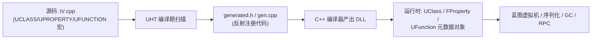
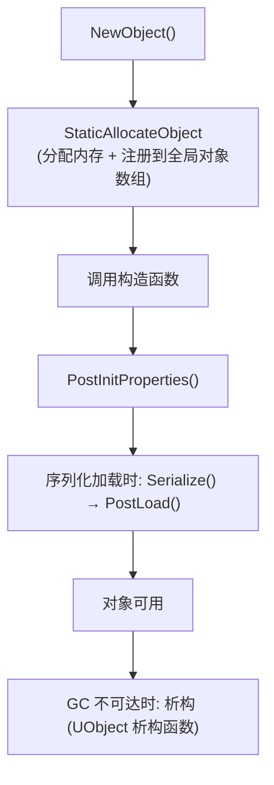
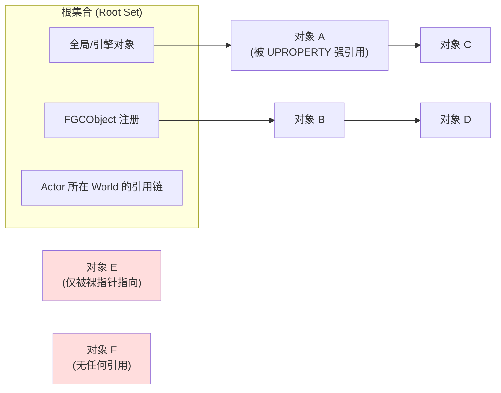

# 01 UObject 与反射系统

## 一、概述

UObject 是虚幻引擎对象体系的基石。引擎中几乎所有可被蓝图引用、可被序列化、可参与垃圾回收（GC）、可被网络复制的对象，都直接或间接继承自 `UObject`。围绕 UObject 建立的**反射（Reflection）系统**允许引擎在运行时查询类型信息、枚举属性、动态调用函数，这也是蓝图可视化脚本、编辑器属性面板、序列化存档、网络 RPC、垃圾回收等上层能力共同的实现基础。

理解本章内容后，你将能够回答以下问题：

- 为什么 UE 对象不能用 `new` 创建，而必须使用 `NewObject` / `SpawnActor`？
- `UPROPERTY`、`UFUNCTION`、`UCLASS` 这些宏到底做了什么？
- 垃圾回收如何知道哪些对象还"活着"？为什么漏写 `UPROPERTY` 会导致对象被回收？
- C++ 与蓝图是如何通过反射"打通"的？
- UE5 中的 `TObjectPtr`、`TWeakObjectPtr`、`TSoftObjectPtr` 有什么区别？

> 适用版本：本文以 UE 5.0+ 为准（如 `FProperty`、`TObjectPtr`、`MarkAsGarbage`），UE 4.27 及更早版本的差异会在行文中标注。

## 二、核心概念

| 概念 | 说明 | 关键点 |
| --- | --- | --- |
| `UObject` | 引擎对象模型基类，提供反射、GC、序列化、网络复制等基础能力 | 必须通过 `NewObject` 创建，生命周期由 GC 管理 |
| `UClass` | 类的运行时元数据对象，描述一个 UObject 类的所有反射信息 | 每个 UCLASS 对应一个 UClass 实例（含 CDO） |
| `USTRUCT` | 值类型结构体，可被反射，但**不**参与 GC 引用追踪的强引用（本身无 GC 管理） | 常用于数据容器，可被 UPROPERTY 引用 |
| `UENUM` | 可被反射的枚举，支持蓝图可见与命名空间 | `enum class` + `UENUM(BlueprintType)` |
| `UCLASS` | 标记一个类参与反射系统，生成 `UClass` 元数据 | 宏参数控制蓝图可见性、复制等 |
| `UPROPERTY` | 标记成员变量参与反射：序列化、GC 追踪、蓝图/编辑器可见、复制 | 漏标 = 不追踪引用 + 不序列化 |
| `UFUNCTION` | 标记成员函数参与反射：蓝图可调用、RPC、可覆写事件 | 参数/返回值须为反射支持类型 |
| CDO | Class Default Object，类默认对象，`GetDefaultObject()` 获取 | 蓝图"默认值"的存储位置，构造时生成 |
| GC | 垃圾回收：以根集合为起点做可达性分析，标记-清扫 | `UPROPERTY` 引用是强引用，非 UPROPERTY 指针不追踪 |
| UHT | Unreal Header Tool，编译期扫描头文件生成反射代码 | 生成 `.generated.h` 与 `.gen.cpp` |
| `FProperty` | UE5 中属性反射的运行时表示（UE4 为 `UProperty`） | 每个 UPROPERTY 对应一个 FProperty 实例 |
| `UFunction` | 函数反射的运行时表示，含参数属性与函数标志 | RPC、蓝图事件均基于 UFunction |
| `TWeakObjectPtr` | 弱引用：不阻止 GC，可安全判空 | 用于"引用但不想持有"的场景 |
| `TObjectPtr` | UE5 默认的对象指针类型（替代裸指针） | 便于延迟加载与内存追踪 |
| `TSoftObjectPtr` | 软对象指针：不加载资产，仅存路径 | 用于资产引用但不希望启动即加载 |
| `FGCObject` | 让普通 C++ 类注册进 GC 根集合/引用追踪的接口 | 原生类持有 UObject 时使用 |
| `IsValid()` | 安全判空：`Obj && IsValid(Obj)` | UE5 中已移除 `IsPendingKill` |

## 三、原理详解

### 3.1 反射系统与 UHT 代码生成

UE 的反射不是运行时扫描，而是**编译期生成 + 运行时元数据**的组合：

1. 编写头文件时使用 `UCLASS` / `USTRUCT` / `UENUM` / `UPROPERTY` / `UFUNCTION` 宏标记；
2. UHT（Unreal Header Tool）在编译前解析这些头文件，生成 `MyClass.generated.h` 与 `MyClass.gen.cpp`；
3. 生成的代码中包含：`GENERATED_BODY()` 展开的接口实现、`StaticClass()`、`__declspec` 元数据注册表、属性/函数反射表；
4. 运行时通过 `UClass`、`FProperty`、`UFunction` 实例描述所有反射信息，蓝图虚拟机（Blueprint VM）、序列化、GC、RPC 均基于这些元数据工作。



因此：**修改了头文件中的反射标记后，必须重新运行 UHT（通常随编译自动进行）**；`GENERATED_BODY()` 必须放在类体内，且 generated 头文件必须 `#include` 在类的最后一个 `#include` 之后（一般写在文件末尾）。

### 3.2 UObject 的创建与初始化

`UObject` 的分配、构造、注册由引擎统一管理，禁止直接 `new`：

```cpp
UMyItem* Item = NewObject<UMyItem>(this);              // Outer 为 this
UMyItem* Item2 = NewObject<UMyItem>(GetTransientPackage()); // 无 Outer 时用临时包
```

创建流程（简化）：



要点：

- **Outer（外部对象）**：UObject 的归属关系，用于生命周期与路径管理（如 `/Game/Maps/MapName`）。被 GC 的对象会连带清理其 Outer 子树；
- **构造函数**：只做纯数据初始化，不要在这里访问世界、网络等运行时上下文；子对象创建请用 `CreateDefaultSubobject`（仅限 Actor/Component 场景）；
- **PostInitProperties**：构造完成后最先回调的虚函数，适合做"属性已就位"后的初始化；
- **PostLoad**：从磁盘加载（反序列化）完成后回调，用于修正数据或初始化派生状态；
- **对象在蓝图/编辑器中的默认值**来自 CDO：`MyClass::StaticClass()->GetDefaultObject<UMyClass>()`，构造完成后引擎会自动创建 CDO。

### 3.3 垃圾回收（GC）

UE 采用**可达性分析（Mark & Sweep）**的增量式垃圾回收：

1. **根集合（Root Set）**：全局对象、`GUObjectArray` 中标记为根的对象、`FGCObject` 注册的对象、`UObject` 全局单例、命令引用等；
2. **标记（Mark）**：从根集合出发，沿**被反射追踪的引用**（即 `UPROPERTY` 标记的 UObject 指针、容器如 `TArray<TObjectPtr<UObject>>`、`TMap`/`TSet` 中的对象值、委托绑定的对象等）遍历，可达对象打标记；
3. **清扫（Sweep）**：本轮不可达的对象被销毁并移出对象数组；
4. **增量执行**：UE 将 GC 拆分为多个小步（Incremental GC，默认开启），分摊到多帧，避免长时间卡顿；可用 `ForceGarbageCollection(true)` 强制执行完整 GC（仅调试/特殊场景）。



**上图对象 E、F 不可达，将被回收。** 核心结论：**只有被 `UPROPERTY` 或其他受追踪机制引用的对象才不会被 GC**。裸指针 `UMyItem* Item;` 不参与追踪，指向的对象随时可能被回收，产生悬垂指针。

#### 常用引用类型

| 类型 | 是否阻止 GC | 说明 |
| --- | --- | --- |
| `TObjectPtr<UObject>`（UE5） / 裸指针 | 是（仅当标记 UPROPERTY） | 强引用，最常用；UE5 中 UPROPERTY 对象指针默认生成 `TObjectPtr` |
| `TWeakObjectPtr<T>` | 否 | 弱引用，可 `Get()` 后 `IsValid()` 判空 |
| `TStrongObjectPtr<T>` | 是 | 可在非 UPROPERTY 成员/局部变量中持有强引用（需包含 `UObject/StrongObjectPtr.h`） |
| `TSoftObjectPtr<T>` | 否（不加载资产） | 软引用，仅保存路径字符串，需 `LoadSynchronous()` 或异步加载 |
| `TLazyObjectPtr<T>` | 否 | 懒加载引用，多用于关卡内对象引用（如流送关卡） |
| `FGCObject` | 是 | 让原生 C++ 类参与引用报告的接口 |

#### FGCObject 示例

普通 C++ 类（非 UObject）持有 UObject 指针时，若不想让对象被 GC，应继承 `FGCObject` 并上报引用：

```cpp
#include "UObject/GCObjectScopeGuard.h" // 或
#include "UObject/StrongObjectPtr.h"

class FItemHolder : public FGCObject
{
public:
    UMyItem* HeldItem = nullptr;

    virtual void AddReferencedObjects(FReferenceCollector& Collector) override
    {
        Collector.AddReferencedObject(HeldItem);
    }

    virtual FString GetReferencerName() const override
    {
        return TEXT("FItemHolder");
    }
};
```

注意：`FGCObject` 适用于"长期持有"的场景；短生命周期临时使用可用 `TStrongObjectPtr` 或 `TWeakObjectPtr`。

### 3.4 UPROPERTY 与 UFUNCTION 宏系统

#### UPROPERTY 常用说明符

| 类别 | 说明符 | 作用 |
| --- | --- | --- |
| 蓝图可见性 | `BlueprintReadWrite` / `BlueprintReadOnly` | 蓝图可读写 / 只读 |
| 编辑器可见性 | `EditAnywhere` / `EditDefaultsOnly` / `EditInstanceOnly` / `VisibleAnywhere` 等 | 控制属性面板编辑/显示范围 |
| 分类与元数据 | `Category = "XXX"`、`Meta = (ToolTip="...", ClampMin="0", ...)` | 面板分组、提示、数值范围 |
| 序列化 | `Config`、`GlobalConfig` | 读写 ini 配置文件 |
| 生命周期 | `Transient` | 不序列化（临时数据） |
| 存档 | `SaveGame` | 被 SaveGame 系统序列化 |
| 网络 | `Replicated` / `ReplicatedUsing = OnRep_X` | 服务器→客户端复制 |
| 只读运行时 | `VisibleInstanceOnly` 等 | 运行时可见不可编辑 |

#### UFUNCTION 常用说明符

| 类别 | 说明符 | 作用 |
| --- | --- | --- |
| 蓝图调用 | `BlueprintCallable` / `BlueprintPure` | 可被蓝图调用（纯函数无副作用） |
| 蓝图事件 | `BlueprintImplementableEvent` | 蓝图实现，C++ 只声明 |
| 混合事件 | `BlueprintNativeEvent` | 蓝图可覆写，C++ 提供 `_Implementation` |
| 编辑器 | `CallInEditor` | 编辑器中按钮触发 |
| 控制台 | `Exec` | 可被控制台命令调用 |
| 网络权限 | `BlueprintAuthorityOnly` / `BlueprintCosmetic` | 仅服务器 / 仅客户端（表现层） |
| RPC | `Server` / `Client` / `NetMulticast` + `Reliable`/`Unreliable` + `WithValidation` | 远程过程调用 |

#### RPC 调用规则（重要）

- `Server` RPC：**由拥有该 Actor 的客户端**调用，在服务器上执行；
- `Client` RPC：**由服务器**调用，在**拥有该 Actor 的客户端**上执行；
- `NetMulticast`：服务器调用，在所有客户端（及服务器自身）执行；
- `Reliable` 保证送达与顺序（TCP 语义），`Unreliable` 可能丢失（UDP 语义，适合高频位置同步）；
- RPC **只能在 Actor 上声明**，且该 Actor 必须启用复制（`bReplicates = true`）并已复制到目标端；静态函数、非 Actor 类（如 GameInstance）不可直接使用 RPC（可通过 `AActor::GetLifecycleProperty` 等间接手段，但标准做法是经 Actor 转发）。

### 3.5 运行时反射操作

```cpp
// 1. 类型判断与转换
UMyItem* Item = Cast<UMyItem>(SomeObject);          // 失败返回 nullptr
check(SomeObject->IsA<UMyItem>());                   // 类型断言
UClass* Class = SomeObject->GetClass();              // 获取 UClass

// 2. 枚举属性
for (TFieldIterator<FProperty> It(Class); It; ++It)
{
    FProperty* Prop = *It;
    const FString PropName = Prop->GetName();
    // 读取属性值（导出为文本）
    FString OutValue;
    const void* ValuePtr = Prop->ContainerPtrToValuePtr<void>(SomeObject);
    Prop->ExportText_Direct(OutValue, ValuePtr, nullptr, SomeObject, 0);
    UE_LOG(LogTemp, Log, TEXT("%s = %s"), *PropName, *OutValue);
}

// 3. 查找并调用函数（含蓝图实现）
UFunction* Func = SomeObject->FindFunction(FName("OnPickedUp"));
if (Func)
{
    struct FParams { AActor* Instigator; };
    FParams Params{ nullptr };
    SomeObject->ProcessEvent(Func, &Params);   // 会调用蓝图覆写
}
```

### 3.6 序列化与 CDO

- **属性序列化**：默认对"非 Transient 且非 EditorOnly"的 UPROPERTY 进行序列化；存档系统（SaveGame）额外要求 `SaveGame` 标记；
- **CDO 的作用**：蓝图继承 C++ 类时，蓝图"默认值"即 CDO 的拷贝；修改 C++ 默认属性需修改构造函数中初始化值（CDO 在构造时生成）；
- **PostLoad** 与 **PreSave** 是数据修正的常用回调。

## 四、代码示例

### 4.1 定义一个可被蓝图使用的 UCLASS（物品示例）

```cpp
// MyItem.h
#pragma once

#include "CoreMinimal.h"
#include "UObject/NoExportTypes.h"
#include "MyItem.generated.h"

class APawn;

UENUM(BlueprintType)
enum class EItemRarity : uint8
{
    Common     UMETA(DisplayName = "普通"),
    Rare       UMETA(DisplayName = "稀有"),
    Epic       UMETA(DisplayName = "史诗"),
    Legendary  UMETA(DisplayName = "传说")
};

UCLASS(Blueprintable, BlueprintType, Config = Game)
class MYGAME_API UMyItem : public UObject
{
    GENERATED_BODY()

public:
    UMyItem();

    UPROPERTY(EditAnywhere, BlueprintReadWrite, Category = "Item")
    FName ItemName;

    UPROPERTY(EditAnywhere, BlueprintReadWrite, Category = "Item")
    EItemRarity Rarity;

    UPROPERTY(EditAnywhere, BlueprintReadWrite, Category = "Item", Meta = (ClampMin = "0.0"))
    float Weight = 1.0f;

    // 软引用：不强制加载资产
    UPROPERTY(EditAnywhere, BlueprintReadWrite, Category = "Item")
    TSoftObjectPtr<UStaticMesh> PreviewMesh;

    // 临时数据：不序列化、不存档
    UPROPERTY(Transient)
    float CachedScore = 0.0f;

    UFUNCTION(BlueprintPure, Category = "Item")
    float GetWeight() const { return Weight; }

    // 蓝图可实现事件（C++ 提供默认实现）
    UFUNCTION(BlueprintNativeEvent, Category = "Item")
    void OnEquipped(APawn* Equipper);
    virtual void OnEquipped_Implementation(APawn* Equipper);

    // 蓝图实现事件（C++ 不提供实现）
    UFUNCTION(BlueprintImplementableEvent, Category = "Item")
    void OnItemPickedUp();
};
```

```cpp
// MyItem.cpp
#include "MyItem.h"

UMyItem::UMyItem()
{
    ItemName = TEXT("未命名物品");
    Rarity = EItemRarity::Common;
}

void UMyItem::OnEquipped_Implementation(APawn* Equipper)
{
    UE_LOG(LogTemp, Log, TEXT("%s 被 %s 装备"), *ItemName.ToString(),
           Equipper ? *Equipper->GetName() : TEXT("无"));
}
```

### 4.2 蓝图侧说明

- 在蓝图中右键 → "Create Advanced Asset" 或直接 `NewObject`（蓝图节点 "Construct Object from Class"）创建该对象；
- 继承 `UMyItem` 的蓝图类中，`OnItemPickedUp` 显示为可覆写事件（黄色节点），`OnEquipped` 可覆写也可调用 C++ 默认实现；
- 属性面板中可见 `EditAnywhere` 属性，且受 `Category` 分组。

### 4.3 RPC 示例

```cpp
// AMyCharacter.h（片段）
UCLASS()
class MYGAME_API AMyCharacter : public ACharacter
{
    GENERATED_BODY()
public:
    // 客户端→服务器：带校验
    UFUNCTION(Server, Reliable, WithValidation)
    void ServerRequestFire(FVector_NetQuantize Target);
    bool ServerRequestFire_Validate(FVector_NetQuantize Target);

    // 服务器→拥有客户端
    UFUNCTION(Client, Reliable)
    void ClientNotifyHit(AActor* HitActor);

    // 服务器→所有人
    UFUNCTION(NetMulticast, Unreliable)
    void MulticastPlayMuzzleEffect();
};

// AMyCharacter.cpp（片段）
void AMyCharacter::ServerRequestFire_Implementation(FVector_NetQuantize Target)
{
    // 服务器权威逻辑
    MulticastPlayMuzzleEffect();
}

bool AMyCharacter::ServerRequestFire_Validate(FVector_NetQuantize Target)
{
    return Target.SizeSquared() < 100000000.0f; // 简单合法性校验
}
```

注意：`_Validate` 只在 `WithValidation` 时生成；校验失败时 RPC 会被丢弃并触发 `RPC_ValidateFailed`。

### 4.4 遍历引用与诊断

```cpp
// 检查某对象的所有强引用（调试 GC 问题）
TArray<UObject*> Referencers;
GetReferencers(SomeObject, Referencers);
for (UObject* Ref : Referencers)
{
    UE_LOG(LogTemp, Warning, TEXT("被 %s 引用"), *Ref->GetName());
}
```

## 五、最佳实践

1. **所有 UObject 成员一律标记 `UPROPERTY`**（或使用 `TStrongObjectPtr`），杜绝裸指针长期持有；
2. **判空统一使用 `IsValid(Obj)`**（内部包含 `nullptr` 检查）；UE5 中不要再用 `IsPendingKill`（已移除），`IsValid` 已覆盖该语义；
3. **构造函数只做基础初始化**：不访问 World、不调用依赖运行时状态的逻辑，需要时放 `PostInitProperties` / `BeginPlay`；
4. **优先使用 `TObjectPtr`（UE5）**：编辑器会自动管理，且为未来延迟加载留出空间；
5. **资产引用默认用 `TSoftObjectPtr`**，仅在确定需要同步加载时 `LoadSynchronous`，或用异步加载（`FStreamableManager` / `UAssetManager`）；
6. **高频临时逻辑避免直接 `NewObject`**：考虑对象池；GC 虽增量，但大量瞬时对象仍会造成压力；
7. **RPC 遵循权限模型**：服务器权威数据只在服务器修改，客户端通过 Server RPC 请求；
8. **重载 `GetReferencerName()`**：为 FGCObject 提供可读名称，便于 `obj list` 等调试命令定位；
9. **善用控制台/调试命令**：`obj list`、`obj refs`、`gc`、`stat memory`（`memreport`）排查泄漏与回收问题；
10. **序列化注意**：编辑器专用数据加 `EditOnly` / 用 `WITH_EDITORONLY_DATA` 包裹，避免打包后冗余。

## 六、常见问题 FAQ

### Q1：为什么不能用 `new` 创建 UObject？

`new` 不会走 `StaticAllocateObject` 的对象注册流程，引擎无法感知该对象：不参与 GC、不进入对象数组、无法被反射/序列化/复制，且可能因缺少正确 Outer 而产生崩溃。一律使用 `NewObject<T>()`（非 Actor）或 `SpawnActor<T>()`（Actor）。

### Q2：漏写 `UPROPERTY` 会发生什么？

三种典型后果：① 该指针不被 GC 追踪，指向对象可能被回收形成悬垂指针；② 属性不被序列化，存档/加载后丢失；③ 蓝图与编辑器面板不可见。这是 UE 开发最常见的 bug 来源之一。

### Q3：`IsValid()` 与直接判 `nullptr` 的区别？

UE5 中 `IsValid` 等价于"指针非空且对象未被标记销毁"，同时 `UObject::IsValid()` 实例方法仅检查对象自身状态。推荐统一使用 `IsValid(Obj)` 全局函数；访问成员前先判空，避免对已回收对象调用。

### Q4：UE5 移除 `IsPendingKill` 后如何判断对象已销毁？

UE 5.0 起逐步弃用 `IsPendingKill`，5.1 正式移除。统一用 `IsValid()` / `Get()` 判空；配合 `TWeakObjectPtr` 可在对象回收后安全感知。

### Q5：`TWeakObjectPtr`、`TSoftObjectPtr`、`TStrongObjectPtr` 如何选择？

- 只想安全引用、不阻止回收：`TWeakObjectPtr`；
- 引用资产但不加载：`TSoftObjectPtr`；
- 非 UPROPERTY 成员/局部变量需要强持有：`TStrongObjectPtr`（注意它不序列化）；
- 普通 UPROPERTY 成员：默认 `TObjectPtr` 即可。

### Q6：为什么构造函数里不能 `NewObject`？

构造阶段对象尚未完成注册与初始化，且构造函数可能被 CDO 创建、序列化恢复、编辑器预览等多次调用；在构造函数中创建子对象请使用 `CreateDefaultSubobject`（仅限 Actor/Component 的构造函数），普通对象在 `PostInitProperties` 之后创建。

### Q7：蓝图里看不到我的属性/函数？

检查：① 是否标记了 `BlueprintReadWrite`/`BlueprintCallable` 等蓝图说明符；② 类是否 `UCLASS(Blueprintable)`；③ 类型是否为反射支持类型（如 `uint8` 枚举需 `UENUM(BlueprintType)`）；④ 是否已重新编译并保存。

### Q8：GC 导致游戏卡顿怎么办？

确认增量 GC 开启（默认开启）；减少瞬时对象创建（对象池）；用 `memreport` 定位大量冗余对象；必要时按需 `ForceGarbageCollection` 错峰执行；大世界可考虑分区加载减少常驻对象。

### Q9：`ExportText_Direct` / `ImportText_Direct` 有什么用？

属性值在文本与内存之间的转换接口，是 Copy&Paste、序列化、`SetByString` 的基础；自定义 `FProperty` 或自定义结构体需要支持文本转换时重载 `ExportTextItem`/`ImportTextItem`。

### Q10：USTRUCT 与 UCLASS 如何选择？

数据容器（无行为、值语义、需要复制/序列化）用 `USTRUCT`；有身份、需要 GC 管理、需要蓝图事件的对象用 `UCLASS`。结构体成员中的 UObject 指针同样需要 `UPROPERTY` 才会被追踪。

## 七、关联阅读

- [02-Actor与Component生命周期.md](./02-Actor与Component生命周期.md)：UObject 在 Actor/Component 场景中的具体生命周期；
- [03-Gameplay框架与游戏模式.md](./03-Gameplay框架与游戏模式.md)：框架类如何基于 UObject 组织游戏逻辑；
- [04-引擎启动流程与模块架构.md](./04-引擎启动流程与模块架构.md)：CoreUObject 模块在引擎启动中的加载时机；
- 官方文档：Unreal Engine 5 Documentation → Programming and Scripting → Unreal Architecture（Object Handling、Reflection、Garbage Collection）；
- 引擎源码：`Engine/Source/Runtime/CoreUObject/`（UObject 实现）、`Engine/Source/Programs/UnrealHeaderTool/`（UHT）；
- 后续分类：网络同步与 RPC 深入、存档系统、资产加载与引用（Asset Manager / Streaming）。
