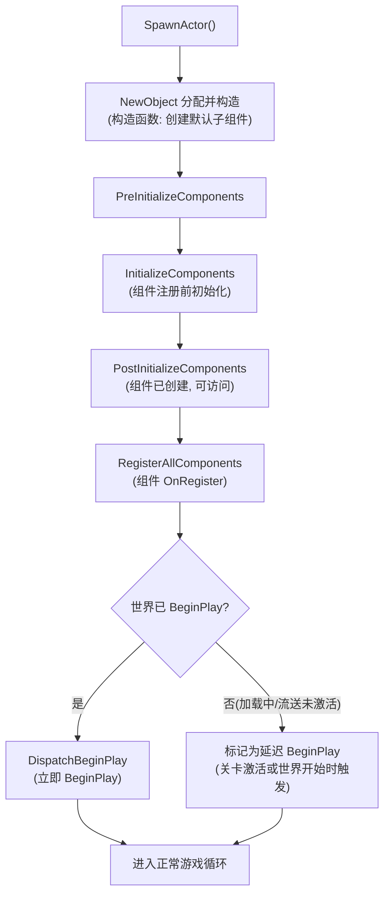
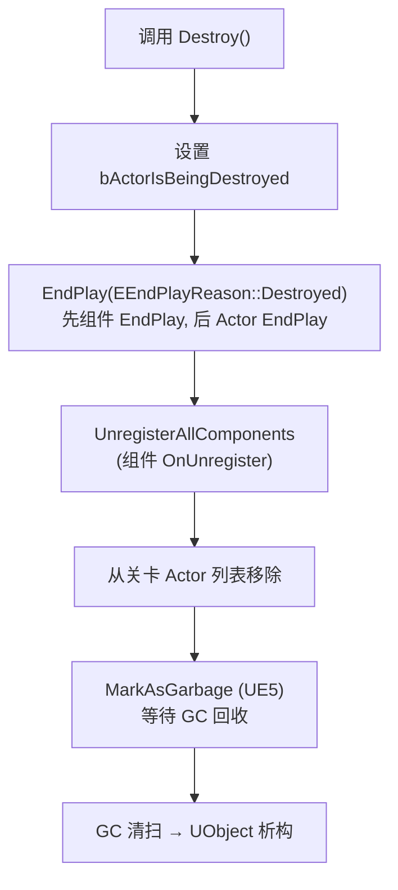
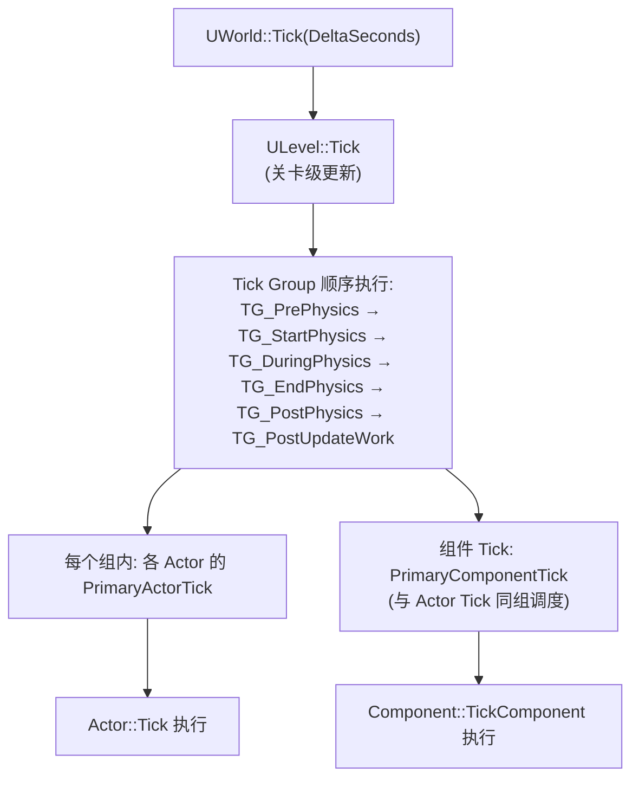
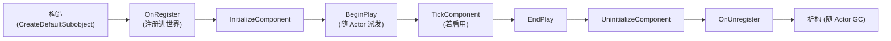

# 02 Actor 与 Component 生命周期

## 一、概述

`AActor` 是放进关卡中的一切物体的基类（角色、道具、触发器、摄像机等），而 `UActorComponent` 是附着在 Actor 上的可复用功能单元（移动、碰撞、渲染、音效、逻辑等）。一个 Actor 可以理解为"容器"，Component 则是其"零件"。

理解 Actor/Component 的生命周期至关重要，因为：

- 错误的初始化时机（如在构造函数中访问 World）会导致空指针崩溃或数据未就绪；
- `BeginPlay` / `EndPlay` / `Tick` 的触发顺序决定了你应该在哪个阶段做什么；
- 销毁与 GC 的时机决定了 `Destroy()` 之后对象还能不能用；
- 关卡流送（Level Streaming）与 UE5 的 World Partition 让"什么时候 BeginPlay"变得复杂。

本文覆盖：Actor 的生成流程、注册与初始化、BeginPlay/EndPlay、Tick 调度体系（含 Tick Group 与依赖）、Component 的完整生命周期、销毁与关卡卸载，以及 UE5 中的相关变化。

> 版本基准：UE 5.8.0（本机 `Engine/Build/Build.version`：CL 55116800，分支 `++UE5+Release-5.8`）。
> 源码依据：`C:\Program Files\Epic Games\UE_5.8\Engine\Source\Runtime\Engine`；以本机 5.8 源码为准。
> 兼容性边界：UE4.27 仅作为生命周期迁移对照，当前 API 与调用链以 UE5.8 为准。
> 最后更新：2026-08-05（统一 UE5.8 版本基线）。
> 官方参考：[Unreal Engine UE5.8 官方文档总页](https://dev.epicgames.com/documentation/en-us/unreal-engine)。

## 二、核心概念

| 概念 | 说明 | 关键点 |
| --- | --- | --- |
| `AActor` | 关卡中的对象基类，可被放置、生成、销毁 | 不能直接 `new`，用 `SpawnActor` |
| `UActorComponent` | Actor 的功能组件基类 | 生命周期由所属 Actor 驱动 |
| `USceneComponent` | 带 Transform 的组件，可挂接层级 | 派生：UStaticMeshComponent、UCapsuleComponent 等 |
| `UActorComponent::RegisterComponent` | 将组件注册进世界（OnRegister） | 注册后才参与 Tick 与渲染 |
| `CreateDefaultSubobject` | 构造函数中创建默认子组件 | 只能在构造函数调用 |
| `BeginPlay` | 游戏正式开始回调（Actor 与 Component 都有） | 流送关卡时可能延迟触发 |
| `EndPlay` | 游戏结束/销毁/卸载回调 | 带 `EEndPlayReason` 原因 |
| `Tick` | 每帧更新回调（Actor 与 Component 都有） | 由 Tick 管理器统一调度 |
| `PrimaryActorTick` | Actor 的主 Tick 结构 | 控制 `bCanEverTick`、间隔、组、依赖 |
| `PrimaryComponentTick` | Component 的主 Tick 结构 | 同上 |
| `Tick Group` | 帧内执行分组（PrePhysics → PostUpdateWork） | 控制物理/动画/UI 的先后 |
| `Destroy()` | 请求销毁 Actor | 触发 EndPlay → 标记 GC |
| `EEndPlayReason` | EndPlay 的原因枚举 | Destroyed / LevelTransition / Quit 等 |
| `MarkAsGarbage` | UE5 中把对象标记为可回收 | 替代旧 `MarkPendingKill` |
| `IsActorBeingDestroyed` | 查询销毁中状态 | 避免在销毁过程中再次使用 |

## 三、原理详解

### 3.1 Actor 的生成流程（SpawnActor）

使用 `UWorld::SpawnActor<T>()` 或 `GetWorld()->SpawnActor<AMyActor>(Class, SpawnTransform)` 生成 Actor。完整流程如下：



关键点：

- **构造函数**：仅创建默认子对象（`CreateDefaultSubobject`）与初始化纯数据；此时**不能**访问 `GetWorld()` 的运行时上下文（UE5 中构造函数里 `GetWorld()` 可能返回非空但处于非初始化状态，依赖其状态的逻辑仍应放到 `BeginPlay`）；
- **PreInitializeComponents / PostInitializeComponents**：组件已创建但尚未全部注册，适合做组件相关的前置/后置初始化；
- **BeginPlay 的延迟**：如果 Actor 生成时世界尚未进入游戏（编辑器 PIE 开始前放置、流送关卡未激活），`BeginPlay` 会推迟到世界真正开始/关卡激活时；UE5 中 `DispatchBeginPlay` 支持对每个 Actor 独立判断是否已就绪；
- **Level Streaming**：流送激活的关卡中，Actor 的 `BeginPlay` 在关卡完成流送并激活后触发，`EndPlay` 在关卡卸载时触发（原因 `RemovedFromWorld`）。

### 3.2 Actor 的销毁流程



要点：

- `Destroy()` 是**请求**销毁：立即执行 EndPlay 与反注册，但**内存回收交给 GC**，对象在下一轮 GC 前仍然存在（`IsValid` 在 UE5 中会因 `IsBeingDestroyed` 返回 false，需注意）；
- **EndPlay 顺序**：先组件的 `EndPlay`，后 Actor 的 `EndPlay`（与 BeginPlay 相反）；
- **卸载关卡/退出游戏**：分别以 `EEndPlayReason::LevelTransition`、`RemovedFromWorld`、`Quit` 等触发 EndPlay，可用原因区分处理逻辑（如存档时机）；
- UE5 中 `IsPendingKill` 已移除，判断"是否已进入销毁流程"用 `IsActorBeingDestroyed()` / `IsValid()`。

### 3.3 Tick 调度体系

引擎每帧调用 `UWorld::Tick()`，其内部按层级派发 Tick：



要点：

- **Actor Tick**：`AActor::Tick(float DeltaSeconds)`（C++）或 `Event Tick`（蓝图）。默认不启用，需在构造函数设 `PrimaryActorTick.bCanEverTick = true;`；
- **Component Tick**：`UActorComponent::TickComponent(...)`，同样默认关闭，需 `PrimaryComponentTick.bCanEverTick = true;`；
- **Tick Group**：通过 `PrimaryActorTick.TickGroup = TG_PostUpdateWork;` 调整执行时机，例如 UI 相关逻辑放 `TG_PostUpdateWork`；
- **Tick 间隔**：`PrimaryActorTick.TickInterval = 0.1f` 可降频（如 10Hz），节省性能；`SetActorTickInterval` 运行时修改；
- **Tick 依赖**：`AddTickPrerequisiteActor` / `AddTickPrerequisiteComponent` 保证 A 先于 B Tick；
- **暂停与时间膨胀**：`UWorld::bIsPaused`（Pause）时世界以 `LEVELTICK_TimeOnly` 方式推进时间，普通 Actor/Component Tick 停止，仅 `bTickEvenWhenPaused = true` 的对象继续；`UWorld::GetWorldSettings()->TimeDilation` 缩放 DeltaSeconds。

### 3.4 Component 生命周期

Component 是 Actor 的"零件"，其生命周期与 Actor 紧密绑定：



要点：

- `OnRegister`：组件注册进世界，此时可安全访问 World、进行物理/渲染资源创建（如 `UStaticMeshComponent` 的网格设置）；
- `InitializeComponent`：属性就位后的初始化（构造与 `OnRegister` 之间调用）；
- `BeginPlay` / `EndPlay`：与 Actor 同名事件同步派发（顺序见 3.2）；
- **运行时动态添加组件**：`NewObject<UMyComponent>(this)` → 设置属性 → `RegisterComponent()`；动态移除：`DestroyComponent()`（会触发 EndPlay/OnUnregister）；
- **注意**：构造函数中创建的组件由 Actor 统一管理；运行时 `RegisterComponent` 的组件同样纳入 Actor 生命周期。

### 3.5 UE5 特性与变化

- **World Partition**：大世界将关卡划分为网格单元，Actor 随玩家进入/离开单元而动态加载/卸载，其 BeginPlay/EndPlay 会随单元激活频繁触发——**不要**在 BeginPlay 中做一次性全局注册，应结合 `UWorldSubsystem` 或 GameInstance 管理跨单元数据；
- **Level Instance**：关卡作为 Actor 嵌套进其他关卡，生命周期与普通 Actor 一致；
- **Actor 的延迟 BeginPlay**：`AActor::DispatchBeginPlay` 中支持按需延迟，流送加载时表现更平滑；
- **`MarkAsGarbage`** 替代旧 `MarkPendingKill`，语义更明确（对象立即不可用，等待 GC 清扫）；
- **Data Layers**（数据层）：允许在同一区域按玩法开关 Actor 组，同样是"卸载即 EndPlay"模型。

## 四、代码示例

### 4.1 自定义 Actor 与生命周期日志

```cpp
// MySpawnableActor.h
#pragma once

#include "CoreMinimal.h"
#include "GameFramework/Actor.h"
#include "MySpawnableActor.generated.h"

class UMyActorComponent;

UCLASS()
class MYGAME_API AMySpawnableActor : public AActor
{
    GENERATED_BODY()

public:
    AMySpawnableActor();

    virtual void PreInitializeComponents() override;
    virtual void PostInitializeComponents() override;
    virtual void BeginPlay() override;
    virtual void EndPlay(const EEndPlayReason::Type EndPlayReason) override;
    virtual void Tick(float DeltaSeconds) override;

    UPROPERTY(VisibleAnywhere, BlueprintReadOnly, Category = "Components")
    class USceneComponent* SceneRoot;

    UPROPERTY(VisibleAnywhere, BlueprintReadOnly, Category = "Components")
    class UStaticMeshComponent* MeshComp;

    UPROPERTY(VisibleAnywhere, BlueprintReadOnly, Category = "Components")
    UMyActorComponent* LogicComp;
};
```

```cpp
// MySpawnableActor.cpp
#include "MySpawnableActor.h"
#include "Components/SceneComponent.h"
#include "Components/StaticMeshComponent.h"
#include "MyActorComponent.h"

DEFINE_LOG_CATEGORY_STATIC(LogActorLife, Log, All);

AMySpawnableActor::AMySpawnableActor()
{
    PrimaryActorTick.bCanEverTick = true;          // 启用 Actor Tick
    PrimaryActorTick.TickGroup = TG_PrePhysics;    // 默认组

    SceneRoot = CreateDefaultSubobject<USceneComponent>(TEXT("SceneRoot"));
    SetRootComponent(SceneRoot);

    MeshComp = CreateDefaultSubobject<UStaticMeshComponent>(TEXT("MeshComp"));
    MeshComp->SetupAttachment(SceneRoot);

    LogicComp = CreateDefaultSubobject<UMyActorComponent>(TEXT("LogicComp"));
}

void AMySpawnableActor::PreInitializeComponents()
{
    Super::PreInitializeComponents();
    UE_LOG(LogActorLife, Log, TEXT("%s: PreInitializeComponents"), *GetName());
}

void AMySpawnableActor::PostInitializeComponents()
{
    Super::PostInitializeComponents();
    UE_LOG(LogActorLife, Log, TEXT("%s: PostInitializeComponents"), *GetName());
}

void AMySpawnableActor::BeginPlay()
{
    Super::BeginPlay();
    UE_LOG(LogActorLife, Log, TEXT("%s: BeginPlay (World=%s)"),
           *GetName(), *GetWorld()->GetName());
}

void AMySpawnableActor::EndPlay(const EEndPlayReason::Type EndPlayReason)
{
    UE_LOG(LogActorLife, Log, TEXT("%s: EndPlay, Reason=%d"), *GetName(), (int32)EndPlayReason);
    Super::EndPlay(EndPlayReason);
}

void AMySpawnableActor::Tick(float DeltaSeconds)
{
    Super::Tick(DeltaSeconds);
    // 每帧逻辑
}
```

### 4.2 自定义 ActorComponent

```cpp
// MyActorComponent.h
#pragma once

#include "CoreMinimal.h"
#include "Components/ActorComponent.h"
#include "TimerManager.h"
#include "MyActorComponent.generated.h"

UCLASS(ClassGroup = (Custom), meta = (BlueprintSpawnableComponent))
class MYGAME_API UMyActorComponent : public UActorComponent
{
    GENERATED_BODY()

public:
    UMyActorComponent();

    virtual void OnRegister() override;
    virtual void InitializeComponent() override;
    virtual void BeginPlay() override;
    virtual void TickComponent(float DeltaTime, ELevelTick TickType,
                               FActorComponentTickFunction* ThisTickFunction) override;
    virtual void EndPlay(const EEndPlayReason::Type EndPlayReason) override;
    virtual void UninitializeComponent() override;
    virtual void OnUnregister() override;

    UPROPERTY(EditAnywhere, BlueprintReadWrite, Category = "Logic")
    float Interval = 1.0f;

    UFUNCTION(BlueprintCallable, Category = "Logic")
    void RestartTimer();

    FTimerHandle TimerHandle;
    void OnIntervalElapsed();
};
```

```cpp
// MyActorComponent.cpp
#include "MyActorComponent.h"
#include "TimerManager.h"

DEFINE_LOG_CATEGORY_STATIC(LogCompLife, Log, All);

UMyActorComponent::UMyActorComponent()
{
    PrimaryComponentTick.bCanEverTick = false;   // 默认关闭组件 Tick
}

void UMyActorComponent::OnRegister()
{
    Super::OnRegister();
    UE_LOG(LogCompLife, Log, TEXT("%s: OnRegister"), *GetName());
}

void UMyActorComponent::InitializeComponent()
{
    Super::InitializeComponent();
    UE_LOG(LogCompLife, Log, TEXT("%s: InitializeComponent"), *GetName());
}

void UMyActorComponent::BeginPlay()
{
    Super::BeginPlay();
    RestartTimer();
}

void UMyActorComponent::TickComponent(float DeltaTime, ELevelTick TickType,
                                      FActorComponentTickFunction* ThisTickFunction)
{
    Super::TickComponent(DeltaTime, TickType, ThisTickFunction);
    // 启用条件: PrimaryComponentTick.bCanEverTick = true;
}

void UMyActorComponent::EndPlay(const EEndPlayReason::Type EndPlayReason)
{
    GetWorld()->GetTimerManager().ClearTimer(TimerHandle);
    Super::EndPlay(EndPlayReason);
}

void UMyActorComponent::UninitializeComponent()
{
    Super::UninitializeComponent();
    UE_LOG(LogCompLife, Log, TEXT("%s: UninitializeComponent"), *GetName());
}

void UMyActorComponent::OnUnregister()
{
    Super::OnUnregister();
    UE_LOG(LogCompLife, Log, TEXT("%s: OnUnregister"), *GetName());
}

void UMyActorComponent::RestartTimer()
{
    if (UWorld* World = GetWorld())
    {
        World->GetTimerManager().SetTimer(
            TimerHandle, this, &UMyActorComponent::OnIntervalElapsed, Interval, true);
    }
}
```

### 4.3 动态生成与销毁

```cpp
// 生成
UWorld* World = GetWorld();
FActorSpawnParameters Params;
Params.SpawnCollisionHandlingOverride = ESpawnActorCollisionHandlingMethod::AdjustIfPossibleButAlwaysSpawn;
AMySpawnableActor* NewActor = World->SpawnActor<AMySpawnableActor>(
    AMySpawnableActor::StaticClass(), FVector(0, 0, 100), FRotator::ZeroRotator, Params);

// 延迟销毁（安全：先停止 Tick 再 Destroy）
if (NewActor)
{
    NewActor->SetActorTickEnabled(false);
    NewActor->Destroy();
}
```

### 4.4 蓝图说明

- 蓝图中分别有 `Event BeginPlay`、`Event Tick (Delta Seconds)`、`Event EndPlay`；
- 组件蓝图中同样有 `Event BeginPlay` 与 `Event Tick`（默认关闭，可在 Details 面板勾选 "Can Ever Tick"）；
- `SpawnActor from Class` 节点对应 `SpawnActor`，生成后可用 `Get World Delta Seconds` 等节点；
- 动态添加组件：`Add Component` 节点（对应 `NewObject + RegisterComponent`）。

## 五、最佳实践

1. **初始化分层**：纯数据 → 构造函数；依赖组件/世界 → `PostInitializeComponents`；依赖运行时状态 → `BeginPlay`；不要在构造函数访问 `GetWorld()` 的游戏状态；
2. **默认关闭 Tick**，按需开启（`bCanEverTick`），用 `TickInterval` 降频，能不用 Tick 就不用（改用 Timer、Event、Callback）；
3. **Tick 组与依赖**：跨系统先后关系用 `AddTickPrerequisite*` 显式声明，不要依赖隐式顺序；
4. **EndPlay 中清理一切**：Timer、动态加载的资产引用、网络监听、注册的委托——避免悬垂与泄漏；
5. **区分销毁原因**：`EEndPlayReason` 决定"存盘/恢复"逻辑（LevelTransition 应保存，Quit 可能无需保存）；
6. **销毁前先 `SetActorTickEnabled(false)`**：避免销毁过程中 Tick 访问已释放资源；
7. **大世界/World Partition**：把"一次性的全局状态"放 Subsystem/GameInstance，Actor BeginPlay 只做局部初始化；
8. **调试**：用 `LogActor` 日志类别、`ShowDebug`、`stat` 命令定位生命周期与 Tick 问题（5.8 无 `t.ActorLifecycle` CVar）；给生命周期函数打印 `GetName()` 便于对照顺序；
9. **组件设计**：一个组件一个职责；跨组件通信优先通过 Actor 接口/委托，避免组件互引成环；
10. **`IsActorBeingDestroyed()`**：在异步回调（Timer、网络）中先判该标志再使用 Actor。

## 六、常见问题 FAQ

### Q1：`SpawnActor` 后为什么 `BeginPlay` 没有被调用？

最常见原因：世界尚未开始（如在编辑器中手动 `SpawnActor` 于非运行时、或在 `UGameInstance::Init` 阶段生成）。生成时若世界未 BeginPlay，Actor 会延迟到世界开始时派发；检查 `World->HasBegunPlay()`。流送关卡同理，需等关卡激活。

### Q2：`Destroy()` 之后对象还能用吗？

`Destroy` 只是标记销毁并触发 EndPlay/反注册，内存由 GC 回收。UE5 中 `IsValid()` 对已标记销毁的对象返回 false，任何继续使用都应先判空；不要依赖"销毁后立刻不存在"的假设。

### Q3：为什么我的 `Tick` 不执行？

排查顺序：① 构造函数中 `PrimaryActorTick.bCanEverTick = true;`（蓝图 Actor 需在 Details 勾选）；② `SetActorTickEnabled(false)` 是否被调用；③ 世界是否暂停（`UWorld::bIsPaused`）且 Tick Group 在暂停范围内；④ 组件 Tick 需组件已注册；⑤ 是否被 `AActor::SetActorTickInterval` 拉长间隔。

### Q4：`BeginPlay` 里能拿到所有组件吗？

能。`PostInitializeComponents` 之后组件已创建并注册，`BeginPlay` 时组件均已注册完毕；但**运行时动态添加**的组件在添加前不存在，需通过事件/轮询感知。

### Q5：Actor 与 Component 的 BeginPlay/EndPlay 顺序？

`BeginPlay`：先 Actor，后其组件；`EndPlay`：先组件，后 Actor。初始化（构造→OnRegister→InitializeComponent）与销毁（EndPlay→UninitializeComponent→OnUnregister）顺序见 3.4 图示。

### Q6：为什么在构造函数里 `GetWorld()` 为空/不可靠？

构造函数执行时 Actor 尚未被放入任何 World 上下文（`SpawnActor` 的分配阶段），CDO 构造时更是如此。需要 World 的逻辑放到 `BeginPlay` 或 `PostInitializeComponents`（后者也可能尚无有效 World）。

### Q7：关卡流送/World Partition 下生命周期会怎样？

关卡卸载或单元卸载会以 `RemovedFromWorld` 触发 EndPlay；重新激活会再次 BeginPlay。因此 BeginPlay 中注册的全局数据必须能"重入"，否则用 GameInstance/Subsystem 保存跨生命周期数据。

### Q8：动态创建的组件如何销毁？

`Component->DestroyComponent()` 会执行 EndPlay/OnUnregister 并从 Actor 移除；析构仍由 GC 管理。注意销毁后清空引用，避免悬垂。

### Q9：`TickInterval` 与 `Tick Group` 能同时用吗？

能。`TickInterval` 控制调用频率，`TickGroup` 控制帧内位置；降频后仍按组顺序执行。注意 `TickInterval` 对网络角色（模拟端）的插值也有影响，数值同步类组件慎用大幅降频。

### Q10：PIE（Play In Editor）与独立运行的生命周期差异？

PIE 中 `EndPlay` 还会以 `EndPlayInEditor` 触发；编辑器关闭关卡、`Simulate` 切换等都会走对应原因。测试生命周期逻辑时建议在独立游戏（`-game`）中验证最终行为。

## 七、关联阅读

- [01-UObject与反射系统.md](./01-UObject与反射系统.md)：UObject 创建、GC 与引用类型（Actor/Component 也是 UObject）；
- [03-Gameplay框架与游戏模式.md](./03-Gameplay框架与游戏模式.md)：GameMode 如何 `RestartPlayer` 生成 Pawn（本质是 SpawnActor 流程）;
- [04-引擎启动流程与模块架构.md](./04-引擎启动流程与模块架构.md)：引擎 LoadMap 后世界才开始 BeginPlay 的宏观时序；
- 官方文档：Unreal Engine 5 Documentation → Actors & Components（Actor Lifecycle、Ticking）；
- 引擎源码：`Engine/Source/Runtime/Engine/Private/Actor.cpp`、`Components/ActorComponent.cpp`、`Engine/World.cpp`；
- 后续分类：网络同步与 RPC（`bReplicates` 对生命周期的影响）、动画系统（Tick 与动画更新）、物理系统。
