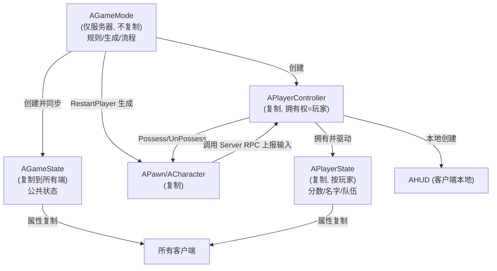
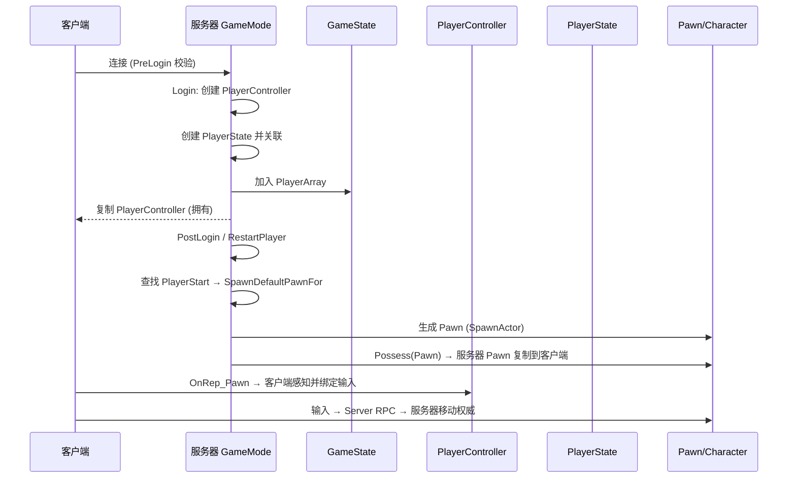
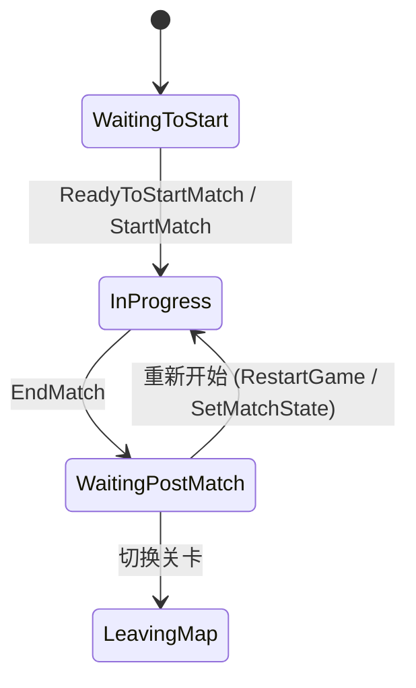

# 03 Gameplay 框架与游戏模式

## 一、概述

UE 提供了一套完整的 Gameplay 框架类，用来组织"一局游戏"的规则与玩家交互：谁制定规则（GameMode）、谁同步公共状态（GameState）、谁代表每个玩家（PlayerController / PlayerState）、玩家在场景中的化身是什么（Pawn / Character）。这套框架天然支持多人网络：**服务器权威（Server Authority）** 是它的设计核心。

理解本框架后，你将能够：

- 分清 GameMode 与 GameState 的职责边界（"规则"与"状态"）；
- 理解玩家从连接、登录、出生（Spawn）、Possess 到断线的完整流程；
- 知道在多人游戏中"数据应该放在哪个类里"才不会出现同步混乱；
- 正确配置 `DefaultPawnClass`、`PlayerControllerClass` 等类的指定方式；
- 使用 Match State 状态机管理"等待开始 → 进行中 → 结束"的回合流程。

> 适用版本：UE 5.0+（`AGameModeBase`/`AGameStateBase` 为 UE4.24+ 引入的简化基类，UE5 沿用）。

## 二、核心概念

| 类 | 是否复制 | 数量 | 职责 |
| --- | --- | --- | --- |
| `AGameModeBase` / `AGameMode` | 否（仅在服务器存在） | 每局 1 个（服务器） | 规则制定者：出生点、胜利条件、允许的玩家数、Match State |
| `AGameStateBase` / `AGameState` | 是 | 每局 1 个（所有端） | 可复制的公共状态：玩家列表、比赛阶段、计分 |
| `APlayerController` | 是 | 每个玩家 1 个 | 玩家"大脑"：输入、HUD 控制、相机管理、Possess Pawn |
| `APawn` | 是 | 玩家化身 | 可被控制（Possess）的实体；AI 也可控制 |
| `ACharacter` | 是 | 玩家化身 | Pawn 的子类：含 Capsule、Mesh、CharacterMovementComponent |
| `APlayerState` | 是 | 每个玩家 1 个 | 玩家私有复制数据：名字、分数、队伍、击杀数 |
| `AHUD` | 否（客户端本地） | 每客户端 1 个 | 绘制 HUD（旧式 Canvas 绘制；现代 UI 多用 UMG） |
| `AGameSession` | 否 | 每局 1 个（服务器） | 会话管理：登录校验、踢人、会话创建（在线子系统） |
| `AWorldSettings` | 是 | 每个关卡 1 个 | 关卡级规则：TimeDilation、bEnableWorldBounds 等 |
| `APlayerStart` | - | 多个 | 玩家出生点（标签 `PlayerStart`） |
| `APlayerCameraManager` | 否（客户端本地） | 每玩家 1 个 | 相机管理与震屏、视角切换 |
| `ASpectatorPawn` | 是 | 观战者 | 死亡后观战用的 Pawn |

## 三、原理详解

### 3.1 框架职责与协作关系



**分工原则**：

- **GameMode 不复制**：它只存在于服务器，是"裁判"。客户端没有 GameMode 实例（客户端 `GetWorld()->GetAuthGameMode()` 返回空）；
- **GameState 复制**：所有端都能读到的"比赛公共数据"放这里（当前回合、倒计时、队伍比分）；
- **PlayerState 复制**：每个玩家一份、所有端可见（排行榜、队伍归属）；
- **PlayerController 拥有权**：服务器权威创建，复制到"拥有它的"那个客户端；`GetLocalPlayerController` 只在本地端返回自己的；
- **Pawn 是棋子**：谁 Possess 谁控制；玩家断开后 Pawn 默认被销毁（可配置）；
- **HUD/相机是表现层**：只在客户端本地存在，不做权威判定。

### 3.2 玩家登录与出生流程（多人）



关键回调：

- `AGameModeBase::PreLogin`：连接前校验（如服务器满员），返回错误字符串可拒绝连接；
- `AGameModeBase::Login`：创建 PlayerController；`PostLogin`：登录完成（创建 PlayerState、加入 GameState）；
- `AGameModeBase::RestartPlayer`：为玩家选择出生点并生成默认 Pawn（内部调用 `FindPlayerStart` + `SpawnDefaultPawnFor` + `Possess`）；
- `APlayerController::Possess`（服务器）→ `APawn::PossessedBy`；客户端通过 `APlayerController::OnRep_Pawn` 感知新 Pawn；
- 断线：服务器调用 `Logout`，销毁该玩家的 PlayerController 与 Pawn（默认行为），PlayerState 是否保留取决于配置（如 `bMustSpectate` 等配置）。

### 3.3 Match State（比赛状态机）

`AGameMode`（注意：是 `AGameMode` 而非 `AGameModeBase`）内置 Match State：



- `SetMatchState(EMatchState)` 是唯一合法的状态修改入口，状态变化会触发对应 `HandleMatchHasStarted()` / `HandleMatchHasEnded()` 等回调；
- GameState 上通过 `OnRep_MatchState` 把状态复制给所有客户端；
- `bDelayedStart`：设为 true 时不会自动开始，适合等待所有玩家就绪的倒计时场景；
- 常用函数：`ReadyToStartMatch()`、`StartMatch()`、`EndMatch()`、`RestartGame()`、`ResetLevel()`。

### 3.4 类的指定与默认配置

GameMode 子类在构造函数中指定各类默认类：

```cpp
AMyGameMode::AMyGameMode()
{
    DefaultPawnClass = AMyCharacter::StaticClass();
    PlayerControllerClass = AMyPlayerController::StaticClass();
    PlayerStateClass = AMyPlayerState::StaticClass();
    GameStateClass = AMyGameState::StaticClass();
    HUDClass = AMyHUD::StaticClass();
    SpectatorClass = AMySpectatorPawn::StaticClass();
}
```

指定生效方式（优先级从低到高）：

1. 项目设置 → Maps & Modes → **Default GameMode**（全局默认）；
2. 每个关卡的 World Settings → **GameMode Override**（仅当前关卡）；
3. 代码运行时 `UWorld::SetGameMode`（服务器端，特殊场景）。

### 3.5 网络相关要点

- `AGameModeBase::GetDefaultPawnClassForController`：可按控制器/玩家定制出生 Pawn 类（如按队伍）；
- PlayerState 的复制通过 `AActor::GetLifetimeReplicatedProps` 声明（`DOREPLIFETIME` 等宏）；
- Pawn 复制：`bReplicates = true` 后，服务器上的位置/旋转通过 `AActor::ReplicateMovement` 同步，客户端作为模拟端（`RemoteRole`）插值；
- RPC 权限模型（详见 01 文档）：输入从客户端经 Server RPC 到服务器，由服务器权威移动后再复制回客户端；
- `APlayerController` 的 `Client` RPC 可用于"服务器通知某个玩家"；`NetMulticast` 用于广播（如全服公告）；
- 观战系统：死亡后 `APlayerController::UnPossess` → 服务器生成 `SpectatorClass`（默认 `ASpectatorPawn`）并 Possess。

## 四、代码示例

### 4.1 自定义 GameMode（服务器规则）

```cpp
// MyGameMode.h
#pragma once

#include "CoreMinimal.h"
#include "GameFramework/GameMode.h"
#include "MyGameMode.generated.h"

UCLASS()
class MYGAME_API AMyGameMode : public AGameMode
{
    GENERATED_BODY()

public:
    AMyGameMode();

    virtual void PostLogin(APlayerController* NewPlayer) override;
    virtual void StartPlay() override;
    virtual void HandleMatchHasStarted() override;
    virtual void HandleMatchHasEnded() override;

    UFUNCTION(BlueprintCallable, Category = "Match")
    void EndMatchWithWinner(APlayerState* Winner);
};
```

```cpp
// MyGameMode.cpp
#include "MyGameMode.h"
#include "MyCharacter.h"
#include "MyPlayerController.h"
#include "MyGameState.h"
#include "MyPlayerState.h"
#include "GameFramework/PlayerStart.h"
#include "EngineUtils.h"

AMyGameMode::AMyGameMode()
{
    DefaultPawnClass = AMyCharacter::StaticClass();
    PlayerControllerClass = AMyPlayerController::StaticClass();
    PlayerStateClass = AMyPlayerState::StaticClass();
    GameStateClass = AMyGameState::StaticClass();
    bDelayedStart = true; // 等待 ReadyToStartMatch()
}

void AMyGameMode::PostLogin(APlayerController* NewPlayer)
{
    Super::PostLogin(NewPlayer);
    UE_LOG(LogTemp, Log, TEXT("玩家登录: %s"), *NewPlayer->GetName());
    // 满 2 人即开始
    if (GetNumPlayers() >= 2 && MatchState == MatchState::WaitingToStart)
    {
        StartMatch();
    }
}

void AMyGameMode::StartPlay()
{
    Super::StartPlay();
}

void AMyGameMode::HandleMatchHasStarted()
{
    Super::HandleMatchHasStarted();
    // 通知所有客户端比赛开始（经 GameState 复制）
}

void AMyGameMode::EndMatchWithWinner(APlayerState* Winner)
{
    if (AMyGameState* GS = GetGameState<AMyGameState>())
    {
        GS->SetWinner(Winner);   // 复制给所有端
    }
    EndMatch();
}

void AMyGameMode::HandleMatchHasEnded()
{
    Super::HandleMatchHasEnded();
    // 广播结果、播放结算
}
```

### 4.2 自定义 GameState（复制公共状态）

```cpp
// MyGameState.h
#pragma once

#include "CoreMinimal.h"
#include "GameFramework/GameStateBase.h"
#include "MyGameState.generated.h"

UCLASS()
class MYGAME_API AMyGameState : public AGameStateBase
{
    GENERATED_BODY()

public:
    virtual void GetLifetimeReplicatedProps(TArray<FLifetimeProperty>& OutLifetimeProps) const override;

    UPROPERTY(ReplicatedUsing = OnRep_TeamScore, BlueprintReadOnly, Category = "Score")
    int32 TeamAScore = 0;

    UPROPERTY(ReplicatedUsing = OnRep_TeamScore, BlueprintReadOnly, Category = "Score")
    int32 TeamBScore = 0;

    UFUNCTION(BlueprintCallable, Server, Reliable, Category = "Score")
    void ServerAddScore(int32 TeamId, int32 Delta);

    UFUNCTION()
    void OnRep_TeamScore();

    UFUNCTION(BlueprintCallable, Category = "Score")
    void SetWinner(APlayerState* Winner);

    UPROPERTY(ReplicatedUsing = OnRep_Winner, BlueprintReadOnly, Category = "Match")
    APlayerState* WinnerPlayerState = nullptr;

    UFUNCTION()
    void OnRep_Winner();
};
```

```cpp
// MyGameState.cpp
#include "MyGameState.h"
#include "Net/UnrealNetwork.h"

void AMyGameState::GetLifetimeReplicatedProps(TArray<FLifetimeProperty>& OutLifetimeProps) const
{
    Super::GetLifetimeReplicatedProps(OutLifetimeProps);

    DOREPLIFETIME(AMyGameState, TeamAScore);
    DOREPLIFETIME(AMyGameState, TeamBScore);
    DOREPLIFETIME(AMyGameState, WinnerPlayerState);
}

void AMyGameState::ServerAddScore_Implementation(int32 TeamId, int32 Delta)
{
    if (TeamId == 0) TeamAScore += Delta;
    else TeamBScore += Delta;
}

void AMyGameState::OnRep_TeamScore()
{
    // 客户端收到新比分：刷新 UI
}

void AMyGameState::SetWinner(APlayerState* Winner)
{
    // 仅服务器调用
    WinnerPlayerState = Winner;
    OnRep_Winner(); // 服务器本地也立即刷新
}

void AMyGameState::OnRep_Winner()
{
    // 所有端显示胜者
}
```

### 4.3 自定义 PlayerController 与输入

```cpp
// MyPlayerController.h
UCLASS()
class MYGAME_API AMyPlayerController : public APlayerController
{
    GENERATED_BODY()

public:
    virtual void BeginPlay() override;
    virtual void SetupInputComponent() override;
    virtual void OnPossess(APawn* InPawn) override;
    virtual void OnUnPossess() override;

    UFUNCTION(Server, Reliable, WithValidation)
    void ServerRequestJump();

    UFUNCTION(Client, Reliable)
    void ClientShowMatchResult(const FString& WinnerName);

    void TryJump();
};
```

```cpp
// MyPlayerController.cpp
#include "MyPlayerController.h"

void AMyPlayerController::BeginPlay()
{
    Super::BeginPlay();
    // 设置输入模式（仅本地端生效，用 HasAuthority 区分）
    if (!HasAuthority())
    {
        FInputModeGameOnly Mode;
        SetInputMode(Mode);
    }
}

void AMyPlayerController::SetupInputComponent()
{
    Super::SetupInputComponent();
    if (InputComponent)
    {
        InputComponent->BindAction("Jump", IE_Pressed, this, &AMyPlayerController::TryJump);
    }
}

void AMyPlayerController::TryJump()
{
    // 客户端→服务器请求
    ServerRequestJump();
}

void AMyPlayerController::ServerRequestJump_Implementation()
{
    if (APawn* P = GetPawn())
    {
        P->Jump(); // 服务器权威
    }
}

bool AMyPlayerController::ServerRequestJump_Validate()
{
    return true;
}

void AMyPlayerController::OnPossess(APawn* InPawn)
{
    Super::OnPossess(InPawn);
    UE_LOG(LogTemp, Log, TEXT("服务器: 控制 %s"), *InPawn->GetName());
}

void AMyPlayerController::OnUnPossess()
{
    Super::OnUnPossess();
}
```

### 4.4 自定义 Character

```cpp
// MyCharacter.h
UCLASS()
class MYGAME_API AMyCharacter : public ACharacter
{
    GENERATED_BODY()

public:
    AMyCharacter();

    virtual void GetLifetimeReplicatedProps(TArray<FLifetimeProperty>& OutLifetimeProps) const override;

    UPROPERTY(ReplicatedUsing = OnRep_Health, BlueprintReadOnly, Category = "Combat")
    float Health = 100.0f;

    UFUNCTION()
    void OnRep_Health();

    UFUNCTION(BlueprintCallable, Server, Reliable, Category = "Combat")
    void ServerTakeDamage(float Amount);
};

// MyCharacter.cpp（片段）
AMyCharacter::AMyCharacter()
{
    bReplicates = true;  // 参与网络复制
    PrimaryActorTick.bCanEverTick = false;
}

void AMyCharacter::GetLifetimeReplicatedProps(TArray<FLifetimeProperty>& OutLifetimeProps) const
{
    Super::GetLifetimeReplicatedProps(OutLifetimeProps);
    DOREPLIFETIME(AMyCharacter, Health);
}

void AMyCharacter::ServerTakeDamage_Implementation(float Amount)
{
    Health = FMath::Max(0.0f, Health - Amount);  // 服务器权威扣血
}

void AMyCharacter::OnRep_Health()
{
    // 客户端表现：飘血、死亡动画
    if (Health <= 0.0f)
    {
        // 播放死亡表现（表现层逻辑）
    }
}
```

### 4.5 蓝图说明

- 在蓝图中创建 `GameMode Base`/`GameMode` 蓝图子类，在 Class Defaults 中指定 `Default Pawn Class`、`Player Controller Class` 等（对应 C++ 构造函数赋值）；
- 关卡蓝图中 `Get Game Mode` 节点在客户端返回空，需通过 `Get Game State` 读取公共状态；
- 事件 `OnPossess`/`OnUnPossess`（蓝图中的 Pawn 事件）与 C++ `PossessedBy` 对应；
- 自定义 GameState 蓝图子类中，`Replicated Using` 属性对应的 `OnRep` 事件是 `Event OnRep_X`。

## 五、最佳实践

1. **数据放置原则**：一局公共数据 → GameState；单个玩家私有数据 → PlayerState；玩家输入/相机/本地 UI → PlayerController；场景实体 → Pawn/Character；规则/流程 → GameMode；
2. **服务器权威**：所有判定（伤害、得分、胜负）只在服务器执行，客户端只发"请求"（Server RPC）与"表现"；
3. **GameMode 不存需要同步的状态**：客户端拿不到它，需要同步的放 GameState；
4. **区分 `AGameModeBase` 与 `AGameMode`**：无回合概念的单机/简单玩法用 Base；需要 Match State 的多人对战用 `AGameMode`；
5. **Pawn 与 Controller 解耦**：玩家逻辑放 Controller（可换 Pawn），身体/移动放 Pawn；换角色时 Controller 不变；
6. **出生点管理**：用 `PlayerStart` 标签区分队伍出生点，重载 `ChoosePlayerStart`/`FindPlayerStart` 定制选择逻辑；
7. **断线处理**：明确 `Logout` 后的清理（Pawn 销毁策略、PlayerState 保留策略），观战/重连场景提前设计；
8. **Match State 驱动 UI**：客户端 UI 监听 GameState 的 `MatchState` 变化（`OnRep_MatchState`），避免各端自行计时导致不同步；
9. **Replication 最小化**：只复制必要属性，用 `ReplicatedUsing` 做增量通知，避免高频复制拖垮带宽；
10. **测试**：用 Listen Server + 多个 `-game` 客户端（`-numplayers`）验证框架逻辑，结合 `net connection`、`stat net` 等命令观察复制。

## 六、常见问题 FAQ

### Q1：GameMode 与 GameState 到底有什么区别？

GameMode 是"规则"，只在服务器，不复制，负责生成、流程、胜负判定；GameState 是"状态"，复制给所有端，客户端通过它读取比赛进度与公共数据。一句话：**GameMode 管"怎么做"，GameState 管"现在是什么"**。

### Q2：为什么客户端 `GetGameMode()` 返回空？

客户端没有 GameMode 实例（设计如此）。需要比赛数据时用 `GetGameState()`；需要执行服务器逻辑时用 Server RPC 或通过拥有权通道（Controller/Pawn 上的 RPC）。

### Q3：设置了 `DefaultPawnClass` 但玩家没有出生？

排查：① GameMode 是否真的被关卡使用（World Settings Override 覆盖了默认值？）；② 关卡中是否有 `PlayerStart`；③ 是否 `bDelayedStart = true` 且从未 `StartMatch`；④ `PostLogin` 中是否提前 `RestartPlayer` 失败；⑤ 出生点是否被占用/碰撞（`SpawnCollisionHandlingOverride`）。

### Q4：PlayerController 与 Pawn 都在复制，为什么客户端看不到 Pawn？

检查 Pawn 是否 `bReplicates = true`、是否在 `GetLifetimeReplicatedProps` 中声明了需要复制的属性；`Possess` 必须在服务器调用；客户端通过 `OnRep_Pawn` 感知，若 `SetPawn` 在客户端被覆盖也会异常。

### Q5：分数显示不一致（客户端与服务器不同步）？

典型错误：客户端本地直接改分。正确做法：客户端 → Server RPC → 服务器修改 GameState 复制属性 → `OnRep` 刷新所有端 UI。检查所有端是否都监听了 `OnRep` 且服务器本地也手动触发了刷新。

### Q6：`AGameModeBase` 与 `AGameMode` 如何选？

需要回合/比赛状态机（Match State）、`ReadyToStartMatch`、自动流程控制时用 `AGameMode`；简单玩法、自己管理流程时用 `AGameModeBase` 更轻量。

### Q7：RPC 在框架类上的限制？

RPC 只能定义在 Actor 上。GameState/PlayerState/PlayerController/Pawn/Character 都是 Actor，可直接用；GameMode 虽是 Actor 但**不复制到客户端**，不能作为"客户端→服务器"的 RPC 载体，也不能被客户端调用其 RPC。

### Q8：玩家断开后 Pawn 去哪了？

默认 `APlayerController` 销毁时其 Possess 的 Pawn 也会被销毁（可通过 `AGameModeBase::Logout`、`bShouldSpawnAtStartSpot` 等定制）；若希望保留尸体/角色，需在 `Logout` 中 UnPossess 并保留 Pawn。

### Q9：如何实现"等待所有玩家就绪再开始"？

`bDelayedStart = true`，在 `PostLogin`/就绪事件中统计玩家，全部就绪后调用 `StartMatch()`（或 `ReadyToStartMatch()` 自动判断）。状态变化经 GameState 复制给客户端驱动倒计时 UI。

### Q10：单机模式下这套框架还有意义吗？

有。单机也走"GameMode + PlayerController + Pawn"（Local Player 的 Controller 没有网络但流程一致），便于将来加联机；单机中 `HasAuthority()` 恒为 true，RPC 会立即本地执行。

## 七、关联阅读

- [01-UObject与反射系统.md](./01-UObject与反射系统.md)：`Replicated` 属性的 GC 引用、RPC 反射机制；
- [02-Actor与Component生命周期.md](./02-Actor与Component生命周期.md)：Pawn/Controller 的 BeginPlay/EndPlay 时序（`RestartPlayer` 本质是 SpawnActor）；
- [04-引擎启动流程与模块架构.md](./04-引擎启动流程与模块架构.md)：LoadMap 时 GameMode 的创建时机；
- 官方文档：Unreal Engine 5 Documentation → Programming and Scripting → Gameplay Framework；
- 引擎源码：`Engine/Source/Runtime/Engine/Classes/GameFramework/`（GameMode、GameState、PlayerController、Pawn、Character、PlayerState）；
- 后续分类：网络同步与 RPC 深入（属性复制通道、RPC 通道）、UMG 与 HUD、AI 控制（`AIController` 与 `Possess` 的对应）。
