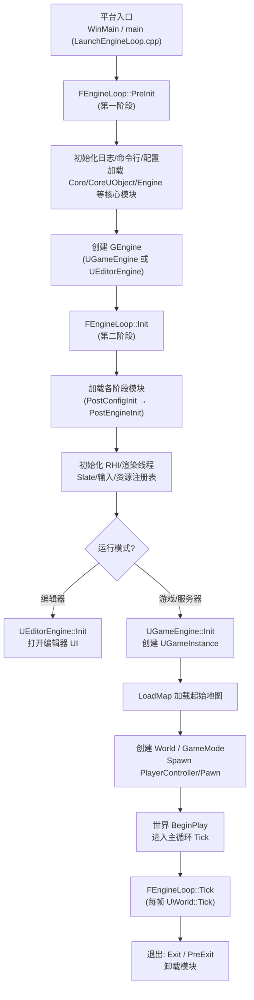
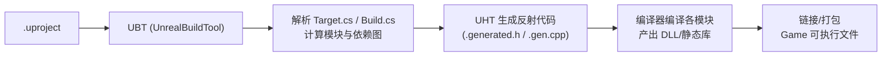

# 04 引擎启动流程与模块架构
> 版本基准：UE 5.8.0（本机 `Engine/Build/Build.version`：CL 55116800，分支 `++UE5+Release-5.8`）。
> 兼容性边界：适用于 UE5.8 编辑器/运行时，UE4.27 与早期 UE5 仅作迁移背景，具体模块以正文为准。
> 官方参考：[Unreal Engine UE5.8 官方文档总页](https://dev.epicgames.com/documentation/en-us/unreal-engine)。
> 最后更新：2026-08-06（本轮元数据维护）。

## 一、概述

虚幻引擎是一个由数十个"模块（Module）"组成的庞大程序，每个模块是一个动态库（DLL，Windows）或静态库。理解模块系统与启动流程，是排查启动崩溃、模块不加载、初始化顺序错误等问题的前提，也是规划大型项目代码组织（Runtime / Editor 模块划分）的基础。

本文回答以下问题：

- 引擎从 `main()` 到进入游戏世界，中间经历了哪些阶段？
- `IMPLEMENT_PRIMARY_GAME_MODULE`、`StartupModule`、`LoadingPhase` 各起什么作用？
- `Build.cs` / `Target.cs` / `.uproject` / `.uplugin` 之间是什么关系？
- 为什么有的模块"必须"在引擎初始化之前加载，有的必须之后？
- `UGameInstance` 在启动流程中处于什么位置，适合放什么数据？

> 适用版本：UE 5.0+（源码基于 `Engine/Source/Runtime/Launch/Private/LaunchEngineLoop.cpp`），UE4 大体相同。

## 二、核心概念

| 概念 | 说明 |
| --- | --- |
| 模块（Module） | 引擎代码的最小构建与加载单元，对应一个 DLL 与一个 `IModuleInterface` |
| `IModuleInterface` | 模块接口：`StartupModule()` / `ShutdownModule()` 等生命周期回调 |
| `IMPLEMENT_MODULE` | 模块实现宏，注册模块类与名称 |
| `IMPLEMENT_PRIMARY_GAME_MODULE` | 标记游戏主模块（项目模块之一），并注册默认游戏模块名 |
| `FModuleManager` | 模块管理器：加载、卸载、查询模块单例 |
| `LoadingPhase` | 模块在启动序列中的加载时机（`Default`、`PostConfigInit`、`PostEngineInit` 等） |
| `.uproject` | 项目描述文件：模块列表、插件列表、目标平台 |
| `Build.cs` | 模块构建描述：依赖模块、include 路径、宏定义 |
| `Target.cs` | 目标描述（Game/Editor/Client/Server/Program）：模块集合与构建设置 |
| `.uplugin` | 插件描述文件：插件模块列表与 LoadingPhase |
| UBT | Unreal Build Tool：解析 .uproject/Build.cs/Target.cs 并驱动编译 |
| UHT | Unreal Header Tool：生成反射代码（见 01 文档） |
| `UEngine` | 引擎核心对象（`UGameEngine`/`UEditorEngine`），全局 `GEngine` |
| `UGameInstance` | 游戏进程级对象：跨关卡数据、平台会话、子系统容器 |
| `FEngineLoop` | 启动循环控制类：PreInit → Init → 主循环 → Exit |
| `GIsEditor` / `GIsGame` | 全局运行模式标志（编辑器/游戏） |
| PreInit / Init / PostInit | 启动的三个大阶段（详见 3.2） |

## 三、原理详解

### 3.1 模块系统

#### 模块的声明与实现

```cpp
// MyFeatureModule.h
#pragma once

#include "Modules/ModuleInterface.h"

class FMyFeatureModule : public IModuleInterface
{
public:
    virtual void StartupModule() override;
    virtual void ShutdownModule() override;
    virtual bool SupportsDynamicReloading() override { return true; }
};
```

```cpp
// MyFeatureModule.cpp
#include "MyFeatureModule.h"

#define LOCTEXT_NAMESPACE "FMyFeatureModule"

void FMyFeatureModule::StartupModule()
{
    // 注册控制台命令、全局委托、静态资源、子模块
    UE_LOG(LogTemp, Log, TEXT("MyFeature 模块已启动"));
}

void FMyFeatureModule::ShutdownModule()
{
    // 反注册、释放全局资源；卸载时会被调用
}

#undef LOCTEXT_NAMESPACE

IMPLEMENT_MODULE(FMyFeatureModule, MyFeature)
```

#### Build.cs（模块构建描述）

```csharp
// MyFeature.Build.cs
using UnrealBuildTool;

public class MyFeature : ModuleRules
{
    public MyFeature(ReadOnlyTargetRules Target) : base(Target)
    {
        PCHUsage = PCHUsageMode.UseExplicitOrSharedPCHs;

        PublicDependencyModuleNames.AddRange(new string[]
        {
            "Core",
            "CoreUObject",
            "Engine",
            "InputCore"
        });

        PrivateDependencyModuleNames.AddRange(new string[]
        {
            "Slate",
            "SlateCore"
        });

        if (Target.bBuildEditor)
        {
            PrivateDependencyModuleNames.Add("UnrealEd"); // 仅编辑器目标编译
        }
    }
}
```

#### Target.cs（目标描述）

```csharp
// MyGame.Target.cs
using UnrealBuildTool;
using System.Collections.Generic;

public class MyGameTarget : TargetRules
{
    public MyGameTarget(TargetInfo Target) : base(Target)
    {
        Type = TargetType.Game;
        DefaultBuildSettings = BuildSettingsVersion.V5;
        IncludeOrderVersion = EngineIncludeOrderVersion.Unreal5_4;
        ExtraModuleNames.Add("MyGame");   // 主模块
        ExtraModuleNames.Add("MyFeature"); // 附加模块
    }
}
```

#### 模块加载机制

- `FModuleManager::LoadModule("MyFeature")`：若未加载，则查找模块清单（`*.modules` 文件/二进制清单），动态加载 DLL 并调用 `StartupModule`，返回模块单例；
- `FModuleManager::Get().GetModule("MyFeature")`：仅查询，不触发加载；
- 模块加载顺序 = **依赖顺序（Build.cs 的依赖） + LoadingPhase 阶段顺序**：被依赖模块先加载；
- 动态重载（热重载）：编辑器中对代码模块支持重新编译加载，`SupportsDynamicReloading()` 控制是否允许。

### 3.2 引擎启动流程（FEngineLoop）

以游戏客户端启动为例，整体时序如下：



#### 主要阶段详解

| 阶段 | 关键动作 | 你能做什么 |
| --- | --- | --- |
| `PreInit` | 初始化平台、日志、命令行解析、加载 Core 模块；创建 `GEngine` | 命令行参数处理；平台层设置 |
| `Init` | 加载全部业务模块（按 LoadingPhase）、初始化渲染/音频/输入、注册资产 | 模块 `StartupModule`；`UGameInstance::Init` |
| `PostEngineInit` | 引擎核心就绪后加载的模块（如编辑器模块） | 依赖引擎完整能力的模块初始化 |
| `LoadMap` | 加载起始地图，创建 `UWorld`、生成 `AGameMode` 与初始 Actor | `GameMode::StartPlay`、Actor `BeginPlay` |
| 主循环 | `FEngineLoop::Tick`：帧循环（输入→Tick→渲染） | 每帧逻辑 |
| `Exit` | 反初始化、卸载模块、释放资源 | `ShutdownModule`、`UGameInstance::Shutdown` |

#### 模块 LoadingPhase 一览（按加载先后）

| LoadingPhase | 时机 | 典型用途 |
| --- | --- | --- |
| `EarliestPossible` | 最早，平台刚就绪 | 平台级模块 |
| `PostConfigInit` | 配置系统就绪后、引擎初始化前 | 需要读取 ini 配置的模块 |
| `BeforePostEngineInit` | 引擎初始化过程中 | 需要介入引擎初始化的模块 |
| `PostEngineInit` | 引擎初始化完成后 | 大多数游戏 Runtime 模块的默认选择 |
| `Default` | 引擎初始化完成后（与 PostEngineInit 同一阶段，实际为默认阶段） | 普通游戏模块 |
| `PostSplashScreen` | 启动画面之后 | 编辑器 UI 类模块 |
| `PreLoadingScreen` / `None` | 特殊/手动加载 | 不随启动自动加载的模块 |

> 注意：`LoadingPhase = None` 的模块不会自动加载，需要代码显式 `LoadModule` 或依赖引用。

### 3.3 UGameInstance 与子系统

`UGameInstance` 是**进程级（整局游戏进程）**对象，跨关卡存活：

```cpp
// MyGameInstance.h
UCLASS()
class MYGAME_API UMyGameInstance : public UGameInstance
{
    GENERATED_BODY()

public:
    virtual void Init() override;
    virtual void Shutdown() override;

    UPROPERTY(BlueprintReadWrite, Category = "Save")
    int32 TotalKills = 0; // 跨关卡累计数据
};
```

```cpp
// MyGameInstance.cpp
void UMyGameInstance::Init()
{
    Super::Init();
    UE_LOG(LogTemp, Log, TEXT("GameInstance::Init - 进程级初始化"));
}

void UMyGameInstance::Shutdown()
{
    Super::Shutdown();
}
```

- 在项目设置 → Maps & Modes → **Game Instance Class** 指定自定义 GameInstance；
- 关卡切换（`OpenLevel` / 无缝旅行）时 **GameInstance 不销毁**，适合存放玩家跨关卡数据（昵称、全局设置、累计统计）；
- UE5 的 **Subsystem** 体系（`UWorldSubsystem` / `UGameInstanceSubsystem` / `UEditorSubsystem` / `ULocalPlayerSubsystem`）把"全局单例逻辑"从 GameInstance 中解耦，推荐优先使用 Subsystem。

### 3.4 插件（Plugin）与项目结构

```json
// MyPlugin.uplugin（片段）
{
    "FileVersion": 3,
    "FriendlyName": "MyPlugin",
    "Version": 1,
    "Modules": [
        {
            "Name": "MyPluginRuntime",
            "Type": "Runtime",
            "LoadingPhase": "Default"
        },
        {
            "Name": "MyPluginEditor",
            "Type": "Editor",
            "LoadingPhase": "PostEngineInit"
        }
    ]
}
```

- **Runtime 模块**：随游戏发布，进入最终包体；
- **Editor 模块**：仅编辑器使用（`UncookedOnly`/`Editor` 类型），打包时剔除（除非被依赖）；
- **Developer 模块**：开发期工具（自动化测试等）；
- 插件通过 `.uplugin` 注册进 `.uproject` 的 Plugins 列表；引擎内置插件在 `Engine/Plugins`，项目插件在 `项目/Plugins`；
- 模块 Type 与 Build.cs 的 `if (Target.bBuildEditor)` 配合实现"编辑器专用代码"。

### 3.5 构建管线（UBT + UHT）



关键点：

- UBT 是 C# 程序（`Engine/Build/BatchFiles` 下的脚本调用），每次构建自动运行 UHT；
- **头文件反射标记变更后必须重新编译**（UHT 会自动重跑）；热重载对新增反射类型支持有限，建议重启编辑器；
- 客户端/服务器/编辑器是不同的 Target，`TargetType` 决定编译内容（Server 目标不含渲染模块）。

## 四、代码示例

### 4.1 游戏主模块（项目默认模块）

```cpp
// MyGame.h（项目主模块）
#pragma once

#include "CoreMinimal.h"

// MyGame.cpp
#include "MyGame.h"
#include "Modules/ModuleManager.h"

IMPLEMENT_PRIMARY_GAME_MODULE(FDefaultGameModuleImpl, MyGame, "MyGame");
```

`IMPLEMENT_PRIMARY_GAME_MODULE` 指定：模块实现类（可换成自定义 `IModuleInterface` 子类）、模块名、项目名。主模块用于承载项目标识；业务代码建议拆分到独立模块（见 4.2）。

### 4.2 拆分业务模块（推荐结构）

```text
Source/
├── MyGame/            # 主模块（仅入口与全局注册）
│   ├── MyGame.Build.cs
│   └── ...
├── MyGameCore/        # 纯逻辑：数据、规则（不依赖 UI/渲染）
│   ├── MyGameCore.Build.cs
│   └── ...
├── MyGameUI/          # UMG/Slate 界面（依赖 Slate/UMG）
│   ├── MyGameUI.Build.cs
│   └── ...
└── MyGameEditor/      # 编辑器工具（Editor 类型，仅编辑器）
    ├── MyGameEditor.Build.cs
    └── ...
```

### 4.3 在 StartupModule 中注册控制台命令

```cpp
void FMyFeatureModule::StartupModule()
{
    // 注册自定义控制台命令（可用 Exec 函数或 IConsoleManager）
    IConsoleManager::Get().RegisterConsoleCommand(
        TEXT("MyFeature.Dump"),
        TEXT("输出 MyFeature 模块状态"),
        FConsoleCommandDelegate::CreateLambda([this]()
        {
            UE_LOG(LogTemp, Log, TEXT("MyFeature 状态: OK"));
        }),
        ECVF_Default);
}

void FMyFeatureModule::ShutdownModule()
{
    // 反注册（控制台命令建议在模块卸载时清理）
}
```

### 4.4 查询与加载模块

```cpp
// 获取已加载模块（未加载返回 nullptr）
if (IModuleInterface* Mod = FModuleManager::Get().GetModule("MyFeature"))
{
    // ...
}

// 显式加载模块（会触发 StartupModule）
FModuleManager::Get().LoadModule("MyFeature");

// 判断模块是否已加载
const bool bLoaded = FModuleManager::Get().ModuleExists(TEXT("MyFeature"));
```

### 4.5 蓝图说明

- 项目设置 → Maps & Modes：设置 **Default GameMode** 与 **Game Instance Class**（对应本文 3.3）；
- 蓝图里 `Get Game Instance` 节点可访问自定义 GameInstance 的变量（跨关卡）；
- 插件的启用/禁用：Edit → Plugins 面板（对应 `.uplugin` 注册）；
- 蓝图类不能直接感知模块加载时序，但可通过 GameInstance 的 `Init` 事件做"进程级初始化"。

## 五、最佳实践

1. **按依赖分层组织模块**：Core 层（无 UI/无渲染）→ 功能层（依赖 Engine）→ UI 层 → 编辑器层；上层依赖下层，避免循环依赖；
2. **默认使用 `LoadingPhase = Default`**：只有确实需要更早（读取配置、介入引擎初始化）才提前，过早加载会增加启动时间与耦合；
3. **`StartupModule` 保持轻量**：不要在模块启动时加载大量资产或做重型 IO；延迟到首次使用时初始化；
4. **编辑器逻辑独立成 Editor 模块**：用 `if (Target.bBuildEditor)` 或 `UncookedOnly` 类型隔离，避免打进最终包体；
5. **跨关卡数据放 GameInstance/Subsystem**，不要放 GameMode（关卡销毁即丢失）或全局静态变量（热重载/多世界场景会出问题）；
6. **优先使用 Subsystem** 替代手写全局单例：生命周期由引擎管理、支持编辑器 PIE 隔离、可网络感知；
7. **控制台命令注册/反注册成对**：`StartupModule` 注册、`ShutdownModule` 反注册，避免热重载后命令残留；
8. **构建相关**：新增模块记得加入 Target.cs 的 `ExtraModuleNames`（或作为依赖被引用），否则 UBT 不会编译它；
9. **调试启动问题**：查看 `Saved/Logs/` 日志中 `LogModuleManager`、`LogInit` 的输出，确认模块加载顺序与失败原因；
10. **谨慎使用 `PreInit` 阶段**：该阶段 UObject/资产系统尚未完全就绪，绝大多数业务初始化应放到 `PostEngineInit` 之后。

## 六、常见问题 FAQ

### Q1：为什么我的模块没有被编译/加载？

排查：① 是否在 Target.cs `ExtraModuleNames` 或某模块依赖中引用；② 是否 `LoadingPhase = None` 且没有显式 `LoadModule`；③ `.uproject` 中模块名与文件夹/Build.cs 类名是否一致；④ 是否重新生成项目文件（右键 .uproject → Generate Project Files）。

### Q2：`LoadingPhase` 选错会怎样？

过早：依赖的子系统尚未初始化，`StartupModule` 中访问会崩溃或拿到无效单例；过晚：错过需要提前注册的时机（如自定义 ini 配置解析、渲染器扩展）。报错时优先检查日志中该模块的加载阶段与失败原因。

### Q3：`StartupModule` 里能 `NewObject` 吗？

可以创建 UObject，但注意：`PostEngineInit` 之前 CoreUObject 已就绪，而资产注册表/内容浏览器等尚未就绪；编辑器相关 API 只能在 `PostEngineInit` 之后使用。原则：启动阶段只做"注册"，不做"加载"。

### Q4：游戏模块（Runtime）与编辑器模块（Editor）如何区分？

Runtime 模块编译进最终游戏包；Editor 模块仅在编辑器中加载（`UncookedOnly`/`Editor` 类型或 `if (Target.bBuildEditor)`），用于工具、菜单、细节面板等。Editor 模块可以依赖 Runtime 模块，反向不行。

### Q5：`UGameInstance` 和 `UGameMode` 都能存数据，有什么区别？

GameInstance 是**进程级**（跨关卡、跨地图存活）；GameMode 是**关卡级**（每关新建、不复制）。跨关卡数据（玩家昵称、全局设置）放 GameInstance；单局数据放 GameMode/GameState。

### Q6：启动顺序对 `BeginPlay` 有什么影响？

`LoadMap` 之后世界才创建并 `BeginPlay`（详见 02 文档）。因此 `GameInstance::Init` 早于任何 Actor 的 BeginPlay；在 `Init` 中不能假设关卡已加载。

### Q7：热重载（Live Coding）对模块有什么要求？

模块应实现 `SupportsDynamicReloading()` 并做好 `ShutdownModule` 清理；新增 UCLASS/UPROPERTY 后建议重启编辑器；热重载失败时查看日志并重试或重启。

### Q8：客户端、服务器、编辑器是同一个程序吗？

是同一个代码库，但构建成不同 Target（Game / Client / Server / Editor）。Server 目标默认不含渲染与音频模块，启动参数 `-server` 可独立运行 Dedicated Server。

### Q9：如何观察启动过程？

开启日志（默认 `Saved/Logs/MyGame.log`），搜索 `LogInit`、`LogModuleManager`、`LogLoad`；命令行加 `-log` 实时输出；`-d3ddebug`、`-unattended` 等参数辅助定位。

### Q10：插件与模块是什么关系？

插件（Plugin）是**模块的容器**：一个插件可以包含多个模块（Runtime/Editor/Developer），并通过 `.uplugin` 的 `LoadingPhase` 控制各模块加载时机。项目本身也可视为一个特殊"插件"（主模块）。

## 七、关联阅读

- [01-UObject与反射系统.md](./01-UObject与反射系统.md)：UHT 反射代码生成（模块编译管线的一部分）；
- [02-Actor与Component生命周期.md](./02-Actor与Component生命周期.md)：LoadMap 后世界 BeginPlay 的具体流程；
- [03-Gameplay框架与游戏模式.md](./03-Gameplay框架与游戏模式.md)：GameMode 在 LoadMap 阶段的创建与配置；
- 官方文档：Unreal Engine 5 Documentation → Programming and Scripting → Modules、Plugins、Unreal Build Tool；
- 引擎源码：`Engine/Source/Runtime/Launch/Private/LaunchEngineLoop.cpp`、`Runtime/Core/Modules/ModuleManager.cpp`、`Runtime/Engine/Classes/Engine/GameInstance.h`；
- 后续分类：网络同步（Dedicated Server 启动差异）、资产管理与流送、编辑器扩展（Editor 模块）。
