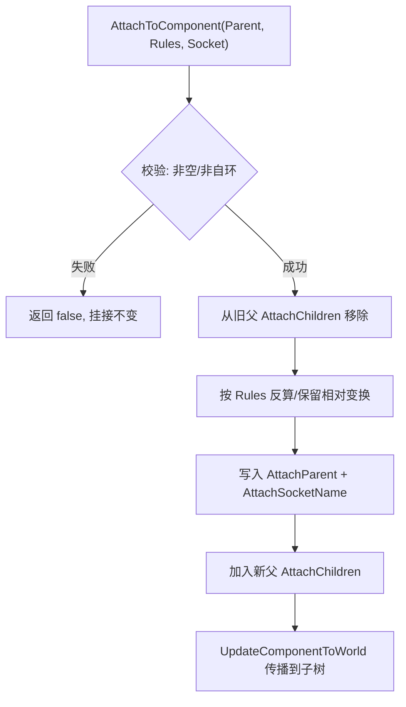

# 05 场景组件与变换体系

## 一、概述

`USceneComponent` 是虚幻引擎中一切"带空间位置"的组件的基类：网格（`UStaticMeshComponent`）、碰撞（`UCapsuleComponent` 等 `UShapeComponent` 派生）、灯光、音效、摄像机、粒子等全部挂载在以它为基础的**组件树（Component Hierarchy）**之下。它与普通 `UActorComponent` 的核心区别只有一条：**拥有 Transform（位置/旋转/缩放），并且可以挂接到其他场景组件之下**，从而让子组件自动跟随父组件的移动、旋转与缩放。

本文回答四个问题：

1. `UActorComponent` → `USceneComponent` → `UPrimitiveComponent` 这条继承链上，每一层各自负责什么；
2. 组件树是如何建立的——`SetupAttachment`（构造期）与 `AttachToComponent`（运行期）的区别、规则与内部流程；
3. 相对变换（Relative）与世界变换（World）如何换算，`bAbsolute*`、Mobility、Socket 挂点在其中扮演什么角色；
4. 如何高效地查询组件（`GetComponentByClass` / `GetComponents`），以及组件注册与变换更新的内部机制。

阅读本文前建议先读 [02-Actor与Component生命周期.md](./02-Actor与Component生命周期.md)，本文是它在"空间与层级"维度上的延伸。

> 适用版本：UE 5.x（关键 API 以本机 UE 5.8 源码为准），兼容 4.27；差异点会标注。

## 二、核心概念

| 概念 | 说明 | 关键点 |
| --- | --- | --- |
| `UActorComponent` | Actor 功能组件基类，无 Transform | 生命周期由所属 Actor 驱动（见 02 篇） |
| `USceneComponent` | 带 Transform 的场景组件基类 | `class USceneComponent : public UActorComponent`（SceneComponent.h） |
| `UPrimitiveComponent` | 可渲染、可参与物理的组件基类 | `class UPrimitiveComponent : public USceneComponent, ...`（PrimitiveComponent.h） |
| `AttachParent` / `AttachChildren` | 组件树中的父子关系 | 一个组件最多一个父，可有多个子 |
| `SetupAttachment` | 构造期"预挂接" | 只能在构造函数调用；注册后必须用 `AttachToComponent` |
| `AttachToComponent` | 运行期挂接 | 携带 `FAttachmentTransformRules` 与 Socket 参数 |
| `FAttachmentTransformRules` | 挂接时的变换处理规则 | `KeepRelativeTransform` / `KeepWorldTransform` / `SnapToTarget*`（EngineTypes.h） |
| `EAttachmentRule` | 单轴规则枚举 | `KeepRelative` / `KeepWorld` / `SnapToTarget` |
| `RelativeLocation/Rotation/Scale3D` | 相对父级的变换分量 | 世界变换 = 相对变换 × 父级世界变换 |
| `GetComponentTransform` | 世界变换缓存（`FTransform`） | 随组件树自顶向下传播更新 |
| `Socket` | 组件上的命名挂点 | 骨骼/网格 Socket；`GetSocketLocation` 等 API |
| `Mobility` | 移动性：`Static/Stationary/Movable` | `Static` 组件运行期 SetWorld* 会触发警告 |
| `bAbsoluteLocation/Rotation/Scale` | 对应轴忽略父级 | 置真后该轴直接使用世界值 |
| `RegisterComponent` | 将组件注册进世界 | 触发 `OnRegister`；注册后才能参与 Tick/渲染 |
| `GetComponentByClass` | 按类查询第一个组件 | 原生 C++；蓝图对应 `Get Components By Class` |
| `GetComponents` | 取所有指定类组件 | 模板版本，可包含子 Actor 的组件 |
| `bReplicatesAttachment` | 挂接关系是否随网络复制 | 多人下保持两端挂接一致 |

## 三、原理详解

### 3.1 类层级：每一层负责什么

```text
UObject
└── UActorComponent            // 通用组件：拥有者、注册、生命周期、Tick（无 Transform）
    └── USceneComponent        // 场景组件：Transform、挂接树、Socket、变换传播
        └── UPrimitiveComponent // 图元组件：渲染（材质/网格）、物理（碰撞/质量/模拟）
            └── UMeshComponent / UShapeComponent / ULightComponent / ...（更具体的子类）
```

| 层级 | 核心职责 | 典型成员/方法 |
| --- | --- | --- |
| `UActorComponent` | 组件通用生命周期与注册 | `RegisterComponent`、`OnRegister`、`InitializeComponent`、`BeginPlay`、`PrimaryComponentTick` |
| `USceneComponent` | 空间变换与层级挂接 | `RelativeLocation`、`SetWorldLocation`、`AttachToComponent`、`GetSocketLocation`、`SetMobility` |
| `UPrimitiveComponent` | 渲染与物理表现 | `SetMaterial`、`SetCollisionEnabled`、`SetSimulatePhysics`、`OnComponentHit` |

理解分层的关键：**上层（UActorComponent）管"何时存在"，中层（USceneComponent）管"在哪"，下层（UPrimitiveComponent）管"长什么样、撞不撞"**。因此判断一个自定义组件该继承谁，只需问：它需要位置吗？需要被渲染/碰撞吗？

### 3.2 组件树：挂接与分离

#### SetupAttachment（构造期）

在构造函数中通过 `CreateDefaultSubobject` 创建组件后，用 `SetupAttachment` 指定"将来要挂到谁下面"：

```cpp
Muzzle = CreateDefaultSubobject<USceneComponent>(TEXT("Muzzle"));
Muzzle->SetupAttachment(RootComponent);            // 挂到根组件
Sight = CreateDefaultSubobject<UStaticMeshComponent>(TEXT("Sight"));
Sight->SetupAttachment(Mesh, TEXT("SightSocket")); // 挂到网格的 Socket 上
```

它只做一件事：设置 `AttachParent` 与 `AttachSocketName` 两个"意向"字段（SceneComponent.cpp 中 `SetupAttachment` 的实现），真正的挂接发生在注册阶段。源码里对它有两个硬性约束（`ensureMsgf`）：

- 组件**已经注册**时调用会报错——注册后必须用 `AttachToComponent`；
- 组件**已经被 AttachTo 连接过**时调用会报错——`SetupAttachment` 只能用于初始化。

#### AttachToComponent（运行期）

```cpp
bool AttachToComponent(USceneComponent* InParent,
                       const FAttachmentTransformRules& AttachmentRules,
                       FName InSocketName = NAME_None);
```

`FAttachmentTransformRules` 决定挂接瞬间"你的世界位置怎么处理"（定义在 `Engine/Classes/Engine/EngineTypes.h`，注意 5.8 中它已不在 SceneComponent.h 里）：

| 预设规则 | Location/Rotation/Scale 效果 | 典型用途 |
| --- | --- | --- |
| `KeepRelativeTransform` | 保留当前相对变换，**世界位置可能跳变** | 逻辑挂接、UI 跟随 |
| `KeepWorldTransform` | 反算相对变换，**世界位置保持不变** | 拿枪/放物到手上、拾取 |
| `SnapToTargetNotIncludingScale` | 相对值清零、贴合目标，但保留自己的缩放 | 精确对位 |
| `SnapToTargetIncludingScale` | 相对值清零，连缩放也贴合目标 | 完全吸附 |

底层规则是三个独立轴枚举 `EAttachmentRule`：`KeepRelative`（保留相对值）、`KeepWorld`（反算相对值以维持世界值）、`SnapToTarget`（相对值归零）。因此可以混搭，例如只让位置贴合、旋转保留：

```cpp
FAttachmentTransformRules Rules(EAttachmentRule::SnapToTarget,   // 位置
                                EAttachmentRule::KeepWorld,      // 旋转
                                EAttachmentRule::KeepRelative,   // 缩放
                                /*bWeldSimulatedBodies=*/false);
Comp->AttachToComponent(Parent, Rules);
```

#### DetachFromComponent

分离使用 `FDetachmentTransformRules`（`KeepRelativeTransform` 保留相对值分离、`KeepWorldTransform` 保持世界值分离），并有 `bCallModify` 控制是否记录编辑器修改。蓝图侧对应 `Detach From Component` 节点（`K2_DetachFromComponent`）。

#### 内部流程

`AttachToComponent` 的核心动作（SceneComponent.cpp）：

1. 校验父组件非空、非自身、不构成环；
2. 若旧父存在，先从旧父的 `AttachChildren` 中移除自己；
3. 按规则计算新的 `RelativeLocation/Rotation/Scale3D`（`KeepWorld` 时用"世界变换除以父世界变换"反算）；
4. 写入 `AttachParent`、`AttachSocketName`，加入新父的 `AttachChildren`；
5. 调用 `UpdateComponentToWorld` 把新变换传播给整棵子树。



### 3.3 相对变换与世界变换

`USceneComponent` 把变换拆成两组：

- **相对变换**：`RelativeLocation`、`RelativeRotation`、`RelativeScale3D` 三个 `UPROPERTY` 成员（SceneComponent.h），描述"相对于父级（或世界，若没有父）"的值；
- **世界变换**：`ComponentToWorld`（`FTransform` 缓存），描述"在世界坐标系"下的最终值，由 `GetComponentTransform()` 返回。

换算公式（SceneComponent.h 中 `UpdateComponentToWorldWithParent` 附近）：

```text
WorldTransform = RelativeTransform × ParentWorldTransform
// 有 Socket 时: WorldTransform = RelativeTransform × Parent->GetSocketTransform(SocketName)
```

（注意是"相对 × 父"，而不是反过来——UE 采用先缩放、再旋转、后平移的左手系 `FTransform` 组合顺序。）

#### Set/Get 家族

| API | 作用 | 签名要点（5.8） |
| --- | --- | --- |
| `SetRelativeLocation(FVector, bSweep, OutSweepHitResult, Teleport)` | 设相对位置 | `bSweep` 扫掠碰撞、`ETeleportType` 控制物理传送 |
| `SetWorldLocation(...)` | 设世界位置 | 内部换算成相对值后走同一链路 |
| `SetRelativeRotation(FRotator/FQuat, ...)` | 设相对旋转 | 有 `FRotator` 与 `FQuat` 两个重载 |
| `SetWorldRotation(FRotator/FQuat, ...)` | 设世界旋转 | 同上 |
| `SetRelativeScale3D(FVector)` | 设相对缩放 | 缩放没有 sweep/teleport 参数 |
| `SetWorldScale3D(FVector)` | 设世界缩放 | 反算相对缩放 |
| `AddLocalOffset` / `AddWorldOffset` | 增量位移 | 蓝图节点名 `Add Local Offset` / `Add World Offset` |
| `GetRelativeLocation/Rotation/Scale3D` | 读相对值 | 另有 `_Direct`/`_DirectMutable` 变体绕开缓存 |
| `GetComponentLocation/Rotation/Scale` | 读世界值 | 从 `GetComponentTransform()` 解包，`K2_*` 为蓝图版本 |
| `GetRelativeTransform` | 读相对 `FTransform` | |

关键细节：

- **设置世界值 = 反算相对值**。`SetWorldLocation(NewLoc)` 等价于 `SetRelativeLocation(NewLoc - Parent->GetComponentLocation())`（无旋转父时）；父有旋转/缩放时用变换矩阵求逆反算，因此父级非等比缩放会导致结果"看起来不对"——这是引擎的正常数学行为；
- **`bAbsoluteLocation/Rotation/Scale`**：三个独立布尔，置 `true` 后对应轴跳过父级换算，直接用世界值。蓝图面板的 "Absolute Location/Rotation/Scale" 复选框就是它；
- **读写都有缓存**：读侧 `GetComponentTransform()` 缓存世界变换，写侧通过 `UpdateComponentToWorld` 让缓存失效并自顶向下重建。`SetRelativeLocation` 等走 `ConditionalUpdateComponentToWorld` 保证下次读取前缓存最新（`bComponentToWorldUpdated` 脏标记）；
- **`SetRelativeLocation_Direct` / `SetRelativeRotation_Direct` / `SetRelativeScale3D_Direct`**：只写成员不更新缓存，用于批量修改后一次性 `UpdateComponentToWorld`，是性能敏感路径的优化手段。

### 3.4 Socket 挂点机制

Socket 是组件上的**命名空间点**。`USceneComponent` 定义了通用接口，具体实现交给子类：

| 方法（SceneComponent.h） | 作用 |
| --- | --- |
| `HasAnySockets()` | 该组件是否定义了 Socket |
| `DoesSocketExist(FName)` | 指定 Socket 是否存在 |
| `GetSocketLocation(FName)` | Socket 的世界位置 |
| `GetSocketRotation(FName)` | Socket 的世界旋转 |
| `GetSocketQuaternion(FName)` | Socket 的世界四元数 |
| `GetSocketTransform(FName, ERelativeTransformSpace)` | Socket 的完整 `FTransform`，可指定 `RTS_World`/`RTS_Actor`/`RTS_Component` |

常见实现：

- `USkeletalMeshComponent`：骨骼即 Socket，可在动画工具里添加虚拟 Socket（挂在某根骨上，跟随骨骼动画）；
- `UStaticMeshComponent`：静态网格资源中的 Socket 列表；
- 其他组件：默认没有 Socket，`NAME_None` 表示"组件根变换"。

用途：枪口火焰、握持点、视线起点、拖拽点等"会随父级动"的锚点。挂接时把 `InSocketName` 传给 `AttachToComponent`/`SetupAttachment`，即可让子组件自动定位到 Socket 上；若 Socket 不存在，引擎回退到父组件根变换。

### 3.5 注册与变换更新

组件必须**注册**才能进入世界的 Tick/渲染/物理流程（详见 02 篇）。`UActorComponent::RegisterComponent()` 触发 `OnRegister()`；对 `USceneComponent` 而言，注册还有一个额外动作：**执行延迟的挂接**。若之前只调用了 `SetupAttachment`，注册时会真正完成 `AttachToComponent`，并把初始相对变换换算成正确位置。

与变换强相关的两个概念：

**Mobility（移动性）**：`EComponentMobility` 三档——`Static`（完全不动，烘焙最优）、`Stationary`（可被光源影响但自身不动）、`Movable`（可运行时移动）。SceneComponent.h 中 `Mobility` 的默认规则：`Static`/`Stationary` 组件在注册后调用移动类接口会触发 `ensure` 警告（"Movable components cannot be moved..." 一类提示），因为静态组件的位置被用于渲染加速结构（如光照贴图、场景层级），运行期移动需要先 `SetMobility(EComponentMobility::Movable)`。

**变换传播（Transform Propagation）**：父组件变换变化时，引擎调用 `UpdateComponentToWorld(UpdateTransformFlags, Teleport)`，沿 `AttachChildren` 递归刷新整棵子树的 `ComponentToWorld` 缓存。`ETeleportType` 两个取值：

- `None`：物理模拟体按"速度插值"处理位移（默认，物理上更平滑）；
- `TeleportPhysics`：直接传送，物理模拟体不产生惯性速度——传送玩家/车辆时必须用这个，否则会出现"瞬移后仍按旧速度飞出去"的物理残留。

### 3.6 组件查询与遍历

常用查询 API 全部定义在 `AActor` 上（5.8 位于 `Classes/GameFramework/Actor.h`）：

| API | 返回 | 说明 |
| --- | --- | --- |
| `GetComponentByClass<T>()` | `T*`（第一个匹配） | 模板版本，内部走 `FindComponentByClass(T::StaticClass())` |
| `GetComponentByClass(TSubclassOf<UActorComponent>)` | `UActorComponent*` | 原生非模板版本 |
| `FindComponentByClass` | `UActorComponent*` | 同 `GetComponentByClass`，语义上用于"查找" |
| `GetComponents<T>(TArray&, bIncludeFromChildActors)` | 填充数组 | 可指定是否包含子 Actor（`UChildActorComponent`）的组件 |
| `GetComponentsByTag(ComponentClass, FName Tag)` | `TArray<UActorComponent*>` | 按组件 Tag 过滤 |
| `K2_GetComponentsByClass(TSubclassOf)` | `TArray<UActorComponent*>` | 蓝图节点 `Get Components By Class` |

注意区分：

- `GetComponentByClass` 返回**第一个**匹配组件（按组件创建顺序），同类型多组件时应改用 `GetComponents` 遍历并校验；
- 蓝图侧 `Get Component By Class` 只能拿单个，取全部用 `Get Components By Class`；
- 查询是线性遍历组件的 `OwnedComponents` 数组（Actor 内部为 `TSet` 与数组双维护），每帧查询会有开销——**高频路径请缓存指针**，并监听组件增删（`OnComponentAdded`/`OnComponentRemoved`）刷新缓存；
- 子 Actor 组件的组件默认**不算**本 Actor 的组件，除非显式传 `bIncludeFromChildActors = true`。

### 3.7 网络复制要点（简述）

`USceneComponent` 上有 `bReplicatesAttachment`（挂接关系复制）与 `ReplicateAttachedComponents`（子组件位置复制）等开关，变换复制由 Actor 移动复制与组件复制配置共同控制。多人游戏中：

- 只有 **Actor 的 `bReplicates` 为 true** 时，组件变换复制才有意义；变换复制走 `FRepMovement` 的压缩/插值管线；
- 服务器修改挂接（`AttachToComponent`）后，客户端通过 `OnRep_AttachmentReplication` 同步挂接关系，因此**两端都要允许相同挂接条件**，否则出现"客户端物体挂在半空"的经典问题；
- Socket 挂接天然解决"手部持枪"类同步：只要骨骼动画两端一致，子组件位置由本地插值骨骼决定，无需逐帧复制。

## 四、代码示例

### 4.1 C++：默认挂接 + 运行期挂到 Socket

```cpp
// AWeapon.h
UCLASS()
class AMyWeapon : public AActor
{
    GENERATED_BODY()
public:
    AMyWeapon();
    UPROPERTY(VisibleAnywhere)
    USceneComponent* Root;
    UPROPERTY(VisibleAnywhere)
    UStaticMeshComponent* Mesh;
    UPROPERTY(VisibleAnywhere)
    USceneComponent* Muzzle;   // 枪口
};

// AWeapon.cpp 构造函数：建立默认组件树
AMyWeapon::AMyWeapon()
{
    Root = CreateDefaultSubobject<USceneComponent>(TEXT("Root"));
    SetRootComponent(Root);                    // 根组件

    Mesh = CreateDefaultSubobject<UStaticMeshComponent>(TEXT("Mesh"));
    Mesh->SetupAttachment(Root);               // 构造期用 SetupAttachment

    Muzzle = CreateDefaultSubobject<USceneComponent>(TEXT("Muzzle"));
    Muzzle->SetupAttachment(Mesh, TEXT("MuzzleSocket")); // 挂到 Socket（不存在则退回 Mesh 根）
}
```

```cpp
// 角色运行时把武器挂到手上，保持武器当前世界位置不变
void AMyCharacter::EquipWeapon(AMyWeapon* Weapon)
{
    if (!Weapon || !GetMesh()) return;
    // KeepWorldTransform：挂接瞬间世界位置不跳变
    Weapon->AttachToComponent(GetMesh(),
        FAttachmentTransformRules::KeepWorldTransform,
        TEXT("WeaponSocket"));
}

// 读取枪口世界位置（发射子弹起点）
FVector AMyWeapon::GetMuzzleWorldLocation() const
{
    return Muzzle ? Muzzle->GetSocketLocation(NAME_None) : GetActorLocation();
}
```

### 4.2 C++：相对/世界变换切换与组件查询

```cpp
// 相对父级偏移（武器后坐：沿本地后轴退 10cm）
Muzzle->AddLocalOffset(FVector(-10.f, 0.f, 0.f));

// 直接设世界位置（传送，跳过物理惯性）
Mesh->SetWorldLocation(TargetLocation, /*bSweep=*/false, nullptr, ETeleportType::TeleportPhysics);

// 查询：拿第一个碰撞盒
UCapsuleComponent* Capsule = GetComponentByClass<UCapsuleComponent>();

// 查询：拿所有静态网格组件（含子 Actor）
TArray<UStaticMeshComponent*> Meshes;
GetComponents<UStaticMeshComponent>(Meshes, /*bIncludeFromChildActors=*/true);

// 蓝图版等价的 C++ 调用
TArray<UActorComponent*> All =
    K2_GetComponentsByClass(UStaticMeshComponent::StaticClass());
```

### 4.3 蓝图节点速查

| 节点 | 对应 C++ | 用途 |
| --- | --- | --- |
| `Attach To Component` | `K2_AttachToComponent` | 运行期挂接（可选手/保持世界/贴合） |
| `Detach From Component` | `K2_DetachFromComponent` | 分离 |
| `Setup Attachment` | `SetupAttachment` | 蓝图组件默认挂接（Event Graph 中慎用，主要在组件面板） |
| `Set Relative Location` / `Set World Location` | `K2_SetRelativeLocation` / `K2_SetWorldLocation` | 设置位置（可开 Sweep/Teleport） |
| `Add Local Offset` / `Add World Offset` | `K2_AddLocalOffset` / `K2_AddWorldOffset` | 增量位移 |
| `Get Socket Location` / `Get Socket Transform` | `GetSocketLocation` / `GetSocketTransform` | 读挂点 |
| `Get Components By Class` | `K2_GetComponentsByClass` | 取全部指定类组件 |
| `Get Component By Class` | `GetComponentByClass` | 取第一个指定类组件 |

## 五、最佳实践

1. **构造期一律用 `SetupAttachment`**，运行期才用 `AttachToComponent`——前者在源码层面禁止注册后调用，混用会踩 `ensure`；
2. **挂接瞬间的位置语义想清楚**：捡起/放下物体用 `KeepWorldTransform`，逻辑父子关系（如枪口特效）用 `KeepRelativeTransform` 或 `SnapToTarget*`；
3. **传送（Teleport）**：玩家/载具瞬移用 `ETeleportType::TeleportPhysics`，否则物理残留速度会让物体"飘"出去；
4. **Socket 优先于手工坐标**：凡是"跟着某个部件动"的锚点都定义 Socket，不要在 Tick 里手动把子组件位置对齐到父级（多一次反算，还容易抖动）；
5. **高频查询组件先缓存**：`GetComponentByClass` 是线性查找，Tick 里每帧调用不可取；缓存后监听 `OnComponentAdded/Removed` 失效；
6. **注意 Mobility**：运行期要移动的组件一开始就设 `Movable`；`Static` 组件运行期移动不仅警告，还会破坏渲染/光照优化结果；
7. **非等比缩放父级下慎用世界旋转**：反算是矩阵求逆，非等比缩放下"世界旋转"数学上会变形，UI 或物理表现异常时先检查父级缩放；
8. **销毁顺序**：先 `DetachFromComponent` 或直接 `DestroyComponent`（会自动处理挂接关系），不要在父组件已销毁后仍持有子组件引用；
9. **网络下两端挂接条件保持一致**，并把持握点定义在 Socket 上，减少变换复制量；
10. **根组件（RootComponent）**：Actor 的根就是一棵组件树的树顶，`SetRootComponent` 后不要再挂到别处；`GetActorLocation()` 本质是 `GetRootComponent()->GetComponentLocation()`。

## 六、常见问题 FAQ

### Q1：`SetupAttachment` 和 `AttachToComponent` 有什么区别？

前者只在构造函数里"预约"挂接（写 `AttachParent`/`AttachSocketName` 意向），注册时真正生效；后者在运行期立即挂接并应用变换规则。注册后调用 `SetupAttachment` 会触发 `ensureMsgf` 报错。

### Q2：`AttachToComponent` 之后物体位置跳了？

检查变换规则：`KeepRelativeTransform` 保留相对值，挂到新父后世界位置必然变化；想要"原地挂上"用 `KeepWorldTransform`。此外父级有非等比缩放时，`KeepWorld` 反算也会产生视觉偏移。

### Q3：`GetSocketLocation` 返回的是组件位置，Socket 没生效？

`DoesSocketExist` 先确认 Socket 存在；网格组件需要资源内定义 Socket（或骨骼里添加），运行时新增 Socket 需在资源里保存。`NAME_None` 恒存在，表示组件根。

### Q4：运行期 `SetWorldLocation` 报"Static component"警告？

`Mobility` 是 `Static`/`Stationary`。先 `SetMobility(EComponentMobility::Movable)` 再移动；或者该组件本就不该动，检查是否误调用了移动接口。

### Q5：改了父组件位置，子组件没跟着动？

正常链路是 `UpdateComponentToWorld` 递归传播。常见原因：子组件用了 `bAbsoluteLocation=true`（该轴脱离父级）；或手动 `_Direct` 系列写了成员但没调用 `UpdateComponentToWorld`；或子组件未注册。

### Q6：`GetComponentByClass` 拿到的是哪个组件？

按组件创建顺序的第一个匹配组件。同类型多个组件时必须用 `GetComponents` 遍历，或给组件打 Tag 后用 `GetComponentsByTag` 精确取。

### Q7：子 Actor（`UChildActorComponent`）的组件算我的组件吗？

默认不算。`GetComponents` 传 `bIncludeFromChildActors=true` 才包含；`GetComponentByClass` 永远不包含子 Actor 的组件。

### Q8：为什么"传送"后物理体还是飞出去？

`SetWorldLocation` 默认 `ETeleportType::None`，物理体按速度外推。传送类位移必须显式传 `ETeleportType::TeleportPhysics`（蓝图勾选 `Teleport`）。

### Q9：蓝图里 `Set Relative Location` 勾了 Sweep 但没碰撞结果？

Sweep 需要碰撞查询结果输出引脚（`Sweep Hit Result`），且组件要有碰撞体并启用碰撞；同时注意 `bSweep` 只对可扫掠的移动有意义，`Teleport` 与 `Sweep` 同时开时以 Teleport 语义为主。

### Q10：组件变换在客户端和服务器对不上？

检查：Actor `bReplicates`；组件 `bReplicatesAttachment` / 变换复制与两端挂接是否在相同时机执行（RPC 顺序）；是否依赖了仅本地存在的 Socket。骨骼驱动的持握点建议只复制"挂接关系"，位置交给动画插值。

## 七、关联阅读

- [02-Actor与Component生命周期.md](./02-Actor与Component生命周期.md)：注册/OnRegister/销毁与本文的挂接、变换传播同属组件生命周期主线；
- [03-Gameplay框架与游戏模式.md](./03-Gameplay框架与游戏模式.md)：Pawn/Character 的 `GetMesh()` 挂接实践（武器/装备系统）；
- [06-定时器与引擎Ticker.md](./06-定时器与引擎Ticker.md)：Tick 与定时器是"组件树建好后"驱动它动起来的两种方式；
- [07-World关卡与Subsystem体系.md](./07-World关卡与Subsystem体系.md)：组件所属的 World 上下文、流送关卡与 Subsystem 的配合；
- 引擎源码：`Engine/Source/Runtime/Engine/Classes/Components/SceneComponent.h`、`Private/Components/SceneComponent.cpp`、`Classes/Engine/EngineTypes.h`（`FAttachmentTransformRules`）、`Classes/GameFramework/Actor.h`（组件查询）；
- 后续分类：物理系统（碰撞/扫掠与 `bSweep`）、动画系统（Socket 与骨骼）、网络同步（变换复制）、渲染与图形（Mobility 与光照）。
