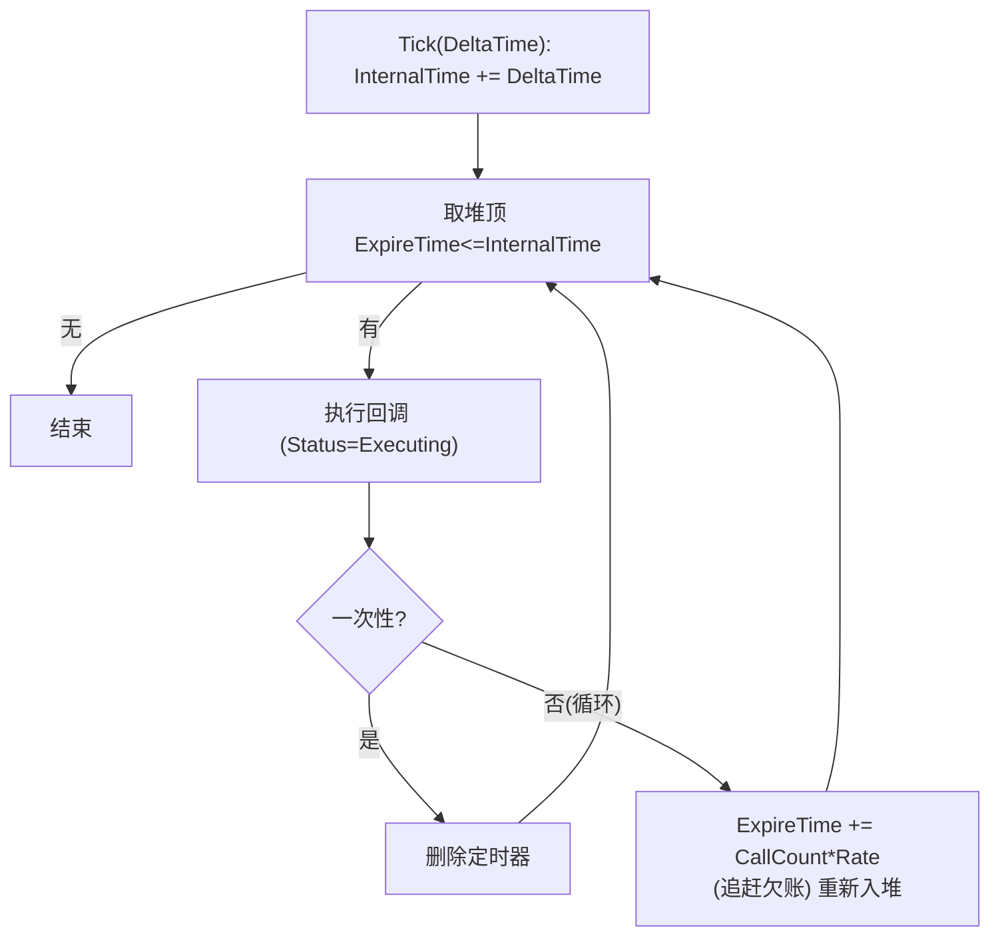

# 06 定时器与引擎 Ticker
> 版本基准：UE 5.8.0（本机 `Engine/Build/Build.version`：CL 55116800，分支 `++UE5+Release-5.8`）。
> 兼容性边界：适用于 UE5.8 编辑器/运行时，UE4.27 与早期 UE5 仅作迁移背景，具体模块以正文为准。
> 官方参考：[Unreal Engine UE5.8 官方文档总页](https://dev.epicgames.com/documentation/en-us/unreal-engine)。
> 最后更新：2026-08-06（本轮元数据维护）。

## 一、概述

游戏逻辑中大量需求是"延迟一段时间做某事"或"每隔一段时间做某事"：技能冷却、重生倒计时、掉落物消失、属性恢复……虚幻提供了两套引擎级机制：

- **`FTimerManager`（定时器管理器）**：以"时间点"为单位调度的 Gameplay 定时器，挂在世界/GameInstance 上，**受暂停与时间膨胀影响**，是绝大多数玩法逻辑的首选；
- **`FTSTicker`（引擎 Ticker）**：Core 模块提供的引擎级逐帧回调（Tick），**不受游戏暂停/时间膨胀影响**，适合引擎系统、编辑器工具、每帧都需要的驱动逻辑（如动画插值器的外部驱动、后台统计）。

理解两者的边界，是本文的核心目标。你会学到：`FTimerHandle` 的正确用法、循环/暂停/清除语义、时间膨胀如何流入定时器、5.8 中定时器管理器的归属变化、服务器定时器的正确姿势，以及 `FTSTicker` 的增删与生命周期。

> 适用版本：UE 5.x（关键 API 以本机 UE 5.8 源码为准：`Runtime/Engine/Public/TimerManager.h`、`Runtime/Core/Public/Containers/Ticker.h`）。

## 二、核心概念

| 概念 | 说明 | 关键点 |
| --- | --- | --- |
| `FTimerManager` | 定时器管理器（非 UObject） | 每个 GameInstance/World 一份；`GetWorld()->GetTimerManager()` 获取 |
| `FTimerHandle` | 定时器句柄（8 字节） | 增删改查都靠它；按值传递 |
| `FTimerDelegate` | 定时器回调委托 | `CreateUObject`/`CreateLambda`/蓝图动态委托 |
| `SetTimer` | 设置定时器 | 重载极多：句柄 + 回调 + 周期 + 循环 + 首延时 |
| `FTimerManagerTimerParameters` | 5.8 的参数结构体 | `bLoop`、`bMaxOncePerFrame`、`FirstDelay` |
| `SetTimerForNextTick` | 下一帧最早时机执行一次 | 本质是 `FirstDelay = 0` 的一次性定时器 |
| `PauseTimer` / `UnPauseTimer` | 暂停/恢复 | 暂停保留剩余时间，恢复后继续 |
| `ClearTimer` | 清除定时器 | 清除后句柄失效 |
| `IsTimerActive` / `IsTimerPending` / `TimerExists` | 状态查询 | Pending = 已设置未到触发时机 |
| `GetTimerRate` / `GetTimerElapsed` / `GetTimerRemaining` | 查询周期/已过/剩余 | 均受时间膨胀影响 |
| 时间膨胀（TimeDilation） | 世界时间流速 | `WorldSettings.TimeDilation` 作用于定时器与 Tick |
| `FTSTicker` | 引擎级 Ticker（Core 模块） | 逐帧回调，按 FireTime 排序 |
| `FTickerDelegate` | Ticker 回调 | `bool Tick(float DeltaTime)`，返回 false 自动移除 |
| `FDelegateHandle` | Ticker 注册句柄 | `AddTicker` 返回，`RemoveTicker` 需要它 |
| `FTSTicker::GetCoreTicker()` | 全局核心 Ticker | 引擎主循环驱动 |
| `FTickerObjectBase` | Ticker 便捷基类 | 析构自动移除 |

## 三、原理详解

### 3.1 FTimerManager 内部机制

`FTimerManager`（TimerManager.h，`class FTimerManager : public FNoncopyable`）不是 UObject，内部用 `TSparseArray<FTimerData>` 存储全部定时器，并按**到期时间（`ExpireTime`）**组织成最小堆（源码比较器：`LhsData.ExpireTime < RhsData.ExpireTime`）。

`FTimerData` 的关键字段：

| 字段 | 含义 |
| --- | --- |
| `ExpireTime` | 下一次触发的引擎时间（秒）；暂停时存"剩余时间" |
| `Rate` | 周期（秒） |
| `Status` | `Pending` / `Active` / `Paused` / `Executing` 等 |
| `bLoop` | 是否循环 |
| `bMaxOncePerFrame` | 5.8 新增：一帧最多触发一次（防大帧追赶） |
| `Delegate`（`FTimerUnifiedDelegate`） | 回调（成员函数/动态委托/lambda 三态） |

每帧流程（`FTimerManager::Tick(DeltaTime)`，TimerManager.cpp）：

1. `InternalTime += DeltaTime`（推进管理器内部时钟）；
2. 取出堆顶 `ExpireTime <= InternalTime` 的定时器，标记 `Executing` 并执行回调；
3. 一次性定时器：执行后删除；循环定时器：`ExpireTime += CallCount * Rate` 重新入堆，其中
   `CallCount = TruncToInt((InternalTime - ExpireTime) / Rate) + 1`——即**大 DeltaTime 下循环定时器会"追赶"多次**，把欠下的次数一次补齐（除非设了 `bMaxOncePerFrame`）；
4. 暂停的定时器不参与触发，`ExpireTime` 保存剩余时间。



`SetTimer` 的语义细节（源码注释明确）：

- `InRate <= 0.f`：**视为清除**已有定时器（不是"立即执行"）；
- `InFirstDelay < 0.f`：首延时取 `InRate`；`>= 0` 则首延时用该值；
- 同一个 `FTimerHandle` 重复 `SetTimer`：旧定时器被替换（先清除再设置）；
- 管理器在 `bIsPaused` 的世界中不 Tick（见 3.2），因此暂停 = 定时器冻结。

### 3.2 时间膨胀与暂停

时间膨胀不是定时器自己实现的，而是**世界 Tick 喂给它的 DeltaTime 已经被缩放**。看 5.8 源码链路（`Engine/Private/LevelTick.cpp` 的 `UWorld::Tick`）：

```cpp
// LevelTick.cpp:1596 附近——先做时间膨胀
DeltaSeconds *= Info->GetEffectiveTimeDilation();
// ...
// LevelTick.cpp:1816 附近——再把"膨胀后"的 Delta 喂给定时器
if (TickType != LEVELTICK_TimeOnly && !bIsPaused)
{
    GetTimerManager().Tick(DeltaSeconds);
}
```

结论：

- **定时器完全受 `WorldSettings.TimeDilation` 影响**：膨胀 0.5 时，2 秒定时器实际要 4 秒现实时间才触发；
- **世界暂停（`SetPause`）时定时器不触发**（`!bIsPaused` 分支直接跳过）；
- `GetTimerRate/Elapsed/Remaining` 返回的都是"游戏时间"口径（已膨胀），与现实时间不同；
- 反例：UI 倒计时、超时踢人等**必须按现实时间**的逻辑，不要用世界定时器，应使用 `FTSTicker` 或 `FPlatformTime`/`FApp::GetDeltaTime()` 自算。

### 3.3 5.8 的归属：UWorld::GetTimerManager 与 GameInstance

5.8 中定时器管理器的归属有一个值得注意的变化（`Engine/Private/World.cpp:8056`）：

```cpp
FTimerManager& UWorld::GetTimerManager() const
{
    return (OwningGameInstance ? OwningGameInstance->GetTimerManager() : *TimerManager);
}
```

即：**游戏运行期（World 有 OwningGameInstance）`GetWorld()->GetTimerManager()` 返回的是 GameInstance 自己的 `FTimerManager`**（`UGameInstance` 构造时创建，GameInstance.cpp:55），World 自带的 `FTimerManager` 仅在无 GameInstance 的上下文（如编辑器世界）使用。后果：

- 常规游戏里 `GetWorld()->GetTimerManager()` 与 `GetGameInstance()->GetTimerManager()` 是**同一个管理器**；
- 定时器生命周期跟着 **GameInstance** 走：普通关卡切换（不销毁 GameInstance）时定时器**不会**因 World 销毁而自动清除——旧世界的定时器可能继续触发，必须显式清理；
- 定时器回调里缓存了 World 指针时，跨地图触发会拿到已清理的 World，务必用 `CreateWeakLambda`/`CreateUObject`（弱引用）并做空判。

### 3.4 服务器定时器

`FTimerManager` 是**进程内对象**，服务器与每个客户端各有各的管理器，**定时器本身不复制**。多人玩法正确姿势：

1. **权威侧（服务器）** 设置定时器驱动游戏状态（伤害结算、刷怪、状态到期）；
2. 状态变化通过复制属性或 RPC 同步到客户端；
3. 客户端如需"倒计时 UI"，由复制的状态反推或同步剩余时间，而不是各自设一个定时器（两端时钟偏差会漂移）。

历史注记：UE 5.1~5.3 左右曾提供实验性的 `bReplicateToOwningClient` 定时器参数；**5.8 的 `FTimerManagerTimerParameters` 已精简为 `{ bLoop, bMaxOncePerFrame, FirstDelay }`**（TimerManager.h 源码核实），不再有复制参数。需要"只通知某客户端"的定时效果，请走 RPC。

### 3.5 FTSTicker：引擎级 Ticker

`FTSTicker`（`Runtime/Core/Public/Containers/Ticker.h`）是 Core 模块的逐帧调度器：

```cpp
class FTSTicker
{
    FDelegateHandle AddTicker(const FTickerDelegate& InDelegate, float InDelay = 0.0f);
    void RemoveTicker(FDelegateHandle Handle);
    void Tick(float DeltaTime);
    static FTSTicker& GetCoreTicker();
};
DECLARE_DELEGATE_RetVal_OneParam(bool, FTickerDelegate, float); // bool Tick(float DeltaTime)
```

要点：

- **按 FireTime 排序**：`FireTime = CurrentTime + DelayTime`（Ticker.cpp），每帧 Tick 时把到期的回调按序执行；`InDelay` 支持错峰，把开销分散到不同帧；
- 回调返回 **`false` 表示"本次执行后移除自己"**，返回 `true` 继续保留（若返回 `false` 且循环保留需要重新 AddTicker）；
- `AddTicker` 返回 `FDelegateHandle`，`RemoveTicker(Handle)` 移除；句柄是 `TWeakPtr<FElement>`，失效安全；
- `FTSTicker::GetCoreTicker()` 是全局实例，由引擎主循环（`FEngineLoop::Tick`）每帧驱动，DeltaTime 为 `FApp::GetDeltaTime()`（**现实时间**，不受 TimeDilation/Pause 影响）；
- `FTickerObjectBase` 便捷基类：构造传入延迟与 Ticker，重写 `virtual bool Tick(float DeltaTime) = 0`，**析构自动移除**，适合"类成员式"注册；
- 新增元素在当帧 Tick 中通过队列（`AddedElements.Enqueue`）合并，当前帧即可被处理（Ticker.cpp 注释："take in all new elements... tick them this frame as well"）。

### 3.6 三种机制对比

| 维度 | Actor/Component `Tick` | `FTimerManager` | `FTSTicker` |
| --- | --- | --- | --- |
| 挂靠 | Actor/Component 的 PrimaryTick | GameInstance/World | Core 全局 |
| 调度方式 | 每帧（可设 `TickInterval`） | 到期触发（可能一帧多次追赶） | 每帧 |
| 受暂停影响 | 是（暂停组） | 是（不 Tick） | **否** |
| 受时间膨胀影响 | 是 | 是 | **否** |
| 回调签名 | `Tick(float DeltaSeconds)` | 无参委托（方法/lambda） | `bool Tick(float DeltaTime)` |
| 典型用途 | 角色移动、插值 | 冷却、倒计时、延迟调用 | 引擎服务、编辑器、UI 层计时 |

## 四、代码示例

### 4.1 C++：基本 SetTimer（成员函数）

```cpp
// AMyActor.h
UFUNCTION()
void OnCooldownFinished();
FTimerHandle CooldownHandle;

// AMyActor.cpp
void AMyActor::StartCooldown(float Duration)
{
    GetWorldTimerManager().SetTimer(
        CooldownHandle,                       // 句柄（引用，可被替换/清除）
        this, &AMyActor::OnCooldownFinished,  // 成员函数回调
        Duration,                             // 周期
        /*bLoop=*/false);                     // 一次性
}
```

### 4.2 C++：循环 + lambda + 参数结构体（5.8）

```cpp
// 每 2 秒恢复一次生命，首延时 1 秒；用参数结构体
FTimerManagerTimerParameters Params;
Params.bLoop = true;
Params.FirstDelay = 1.f;
Params.bMaxOncePerFrame = true;   // 大帧时最多触发一次（5.8）
GetWorldTimerManager().SetTimer(RegenHandle,
    FTimerDelegate::CreateWeakLambda(this, [this]()
    {
        Health = FMath::Min(Health + 10.f, MaxHealth);
    }),
    2.f, Params);

// 下一帧最早时机执行一次（推迟一帧）
GetWorldTimerManager().SetTimerForNextTick(this, &AMyActor::OnNextTick);

// 暂停 / 恢复 / 清除 / 查询
GetWorldTimerManager().PauseTimer(CooldownHandle);
GetWorldTimerManager().UnPauseTimer(CooldownHandle);
GetWorldTimerManager().ClearTimer(CooldownHandle);
if (GetWorldTimerManager().IsTimerActive(CooldownHandle)) { /* ... */ }
float Remaining = GetWorldTimerManager().GetTimerRemaining(CooldownHandle);
```

### 4.3 C++：FTSTicker 注册与移除

```cpp
// 头文件
FTSTicker::FDelegateHandle TickHandle;
bool TickEveryFrame(float DeltaTime);   // 返回 false 自动移除

// 实现
TickHandle = FTSTicker::GetCoreTicker().AddTicker(
    FTickerDelegate::CreateUObject(this, &AMyClass::TickEveryFrame));

// 不再需要时（如 EndPlay）
FTSTicker::GetCoreTicker().RemoveTicker(TickHandle);

// 便捷基类版本：继承 FTickerObjectBase，重写 Tick 即可，析构自动移除
class FMyFrameDriver : public FTickerObjectBase
{
public:
    FMyFrameDriver() : FTickerObjectBase(/*Delay=*/0.0f) {}
    virtual bool Tick(float DeltaTime) override { /* ... */ return true; }
};
```

### 4.4 蓝图节点速查

| 节点 | 说明 |
| --- | --- |
| `Set Timer by Event` | 用自定义事件作回调（推荐，可视化） |
| `Set Timer by Function Name` | 用函数名作回调（字符串查找，慢一点） |
| `Clear Timer by Handle` | 按句柄清除 |
| `Clear All Timers for Object` | 清除某对象上的全部定时器（EndPlay 时常用） |
| `Is Timer Active by Handle` | 查询 |
| `Pause Timer by Handle` / `Unpause Timer by Handle` | 暂停/恢复 |
| `Get Timer Remaining / Elapsed / Rate by Handle` | 查询剩余/已过/周期 |
| `Set Timer for Next Tick by Event` | 下一帧执行一次 |

## 五、最佳实践

1. **玩法延迟逻辑优先用 `FTimerManager`**，不要自己维护 `FPlatformTime` 累加器；需要每帧驱动才考虑 Tick/Ticker；
2. **句柄生命周期管理**：`FTimerHandle` 存成员；对象销毁前 `ClearTimer`（或依赖 `ClearAllTimersForObject` 兜底——管理器内部会清理引用该对象的弱委托）；重复 `SetTimer` 同一句柄自动替换旧定时器，不必先 Clear；
3. **回调里必须安全**：用 `CreateWeakLambda(this, ...)`/`CreateUObject`（内部弱引用），避免对象已销毁仍触发；回调内做空判再访问 World/Actor；
4. **5.8 注意跨地图存活**：常规游戏里定时器挂在 GameInstance 的管理器上，关卡切换不会自动清；`EndPlay`/`BeginDestroy` 中显式 `ClearTimer` 是唯一可靠姿势；
5. **倒计时 UI/超时检测用现实时间**：用 `FTSTicker` 或 `GetWorld()->GetRealTimeSeconds()`（注意别和 `TimeSeconds` 混淆），否则 TimeDilation 会让 UI 失准；
6. **服务器权威 + RPC 同步**：玩法定时器放服务器，客户端只显示复制来的状态；
7. **大帧追赶**：循环定时器在一帧内可能连触发多次（追赶逻辑）；需要严格"每帧最多一次"时用 5.8 的 `bMaxOncePerFrame`，或改用 Tick 内累计；
8. **FTSTicker 用于引擎级/非玩法代码**：它不受暂停影响，游戏暂停时仍在跑；编辑器工具、后台驱动、渲染相关驱动用它，Gameplay 不要用；
9. **FTSTicker 记得移除**：`AddTicker` 返回的句柄要在 Shutdown/EndPlay 时 `RemoveTicker`；`FTickerObjectBase` 析构自动处理，优先用它；
10. **不要用定时器做高频插值**：每帧插值用 Tick；定时器最小精度受帧率限制（DeltaTime 驱动），且追赶语义会让"动画式"逻辑跳变。

## 六、常见问题 FAQ

### Q1：定时器设了但没触发？

排查：① 句柄被 `ClearTimer` 或重复 `SetTimer`（`Rate<=0` 也算清除）覆盖；② 世界暂停（`SetPause`）——定时器整体冻结；③ 回调对象已销毁（弱引用失效）；④ 管理器随 GameInstance/World 重建（如 PIE 重启）；⑤ `InFirstDelay` 传了负值之外的非预期值。

### Q2：`Rate` 和 `FirstDelay` 什么关系？

`Rate` 是循环周期，`FirstDelay` 是第一次触发前的延时。`FirstDelay < 0` 时首延时 = `Rate`；`FirstDelay = 0` 时下一帧最早时机触发（`SetTimerForNextTick` 就是它的特例）。

### Q3：暂停的定时器，`GetTimerRemaining` 还准吗？

准。暂停时 `ExpireTime` 保存的是剩余时间（TimerManager.cpp 注释明确），暂停期间剩余时间不减少；恢复后续走。

### Q4：为什么循环定时器偶尔一帧触发好几次？

追赶逻辑：帧间隔过大（卡顿、断点调试）时，`CallCount = TruncToInt((InternalTime - ExpireTime) / Rate) + 1` 会把欠的周期一次补齐。不想这样就用 `bMaxOncePerFrame`（5.8）或改 Tick。

### Q5：`GetTimerManager()` 拿到的管理器是 World 的还是 GameInstance 的？

5.8 中 `UWorld::GetTimerManager()` 有 OwningGameInstance 时返回 GameInstance 的管理器（World.cpp:8056）；两者在常规游戏里是同一个。因此"World 销毁定时器自动清"的旧认知在 5.8 不再成立，跨地图请显式清理。

### Q6：服务器和客户端的定时器能同步吗？

不能直接同步——两端各有独立管理器。服务器设定时器改状态，通过复制属性/RPC 通知客户端；客户端如需倒计时显示，由复制状态计算。

### Q7：FTSTicker 回调返回 false 会怎样？

该回调在本次执行后自动移除（不用手动 `RemoveTicker`）。需要长期保留就返回 `true`。

### Q8：蓝图 `Set Timer by Function Name` 和 `by Event` 哪个好？

`by Event` 更安全高效：函数名版本运行时按字符串反射查找（慢且拼错静默失败），Event 版本直接绑定委托。C++ 侧统一用成员函数/委托。

### Q9：暂停游戏（Pause）后定时器还走吗？

不走。`UWorld::Tick` 在 `bIsPaused` 时跳过 `GetTimerManager().Tick`（LevelTick.cpp:1816 条件）。菜单/UI 需要继续走的计时用 FTSTicker 或现实时间。

### Q10：定时器里还能再 SetTimer/ClearTimer 吗？

能。执行回调时定时器处于 `Executing` 状态，回调内修改（含清除自己、重设自己）是安全的；引擎对此有专门处理（`TimerToActivate`/`TimerToPause` 暂存机制，TimerManager.cpp）。

## 七、关联阅读

- [02-Actor与Component生命周期.md](./02-Actor与Component生命周期.md)：Actor/Component Tick 调度与本文定时器同属"时间驱动"主线，理解两者分工；
- [04-引擎启动流程与模块架构.md](./04-引擎启动流程与模块架构.md)：`FEngineLoop::Tick` 驱动 CoreTicker 与 World Tick 的宏观时序；
- [05-场景组件与变换体系.md](./05-场景组件与变换体系.md)：定时器常与组件变换配合（延迟移动、插值），句柄生命周期与组件生命周期对齐；
- [07-World关卡与Subsystem体系.md](./07-World关卡与Subsystem体系.md)：World/GameInstance 是 TimerManager 的宿主，Subsystem 中取定时器的方式（`GetWorld()->GetTimerManager()`）；
- 引擎源码：`Runtime/Engine/Public/TimerManager.h`、`Private/TimerManager.cpp`、`Runtime/Core/Public/Containers/Ticker.h`、`Private/Containers/Ticker.cpp`、`Engine/Private/LevelTick.cpp`（时间膨胀与 Tick 链路）、`Engine/Private/World.cpp`（`UWorld::GetTimerManager`）；
- 后续分类：网络同步（服务器定时器与 RPC 配合）、UI 与性能优化（UI 计时与 Ticker 错峰）、GameplayAbility（Ability 的冷却/延迟实现）。
