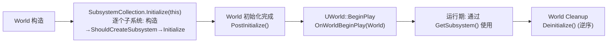

# 07 World 关卡与 Subsystem 体系
> 版本基准：UE 5.8.0（本机 `Engine/Build/Build.version`：CL 55116800，分支 `++UE5+Release-5.8`）。
> 兼容性边界：适用于 UE5.8 编辑器/运行时，UE4.27 与早期 UE5 仅作迁移背景，具体模块以正文为准。
> 官方参考：[Unreal Engine UE5.8 官方文档总页](https://dev.epicgames.com/documentation/en-us/unreal-engine)。
> 最后更新：2026-08-06（本轮元数据维护）。

## 一、概述

`UWorld` 是虚幻引擎的"世界"：它管理一组关卡（`ULevel`）、驱动游戏模拟（Tick/物理/渲染/网络），是所有 Actor 的运行时容器。`ULevel` 是"一张地图的内容"：静态网格、Actor、光照、BSP、关卡蓝图，它们共同构成世界的空间与玩法内容。关卡流送（Level Streaming）则让"世界"可以只加载一部分关卡，实现无缝大世界。

`USubsystem`（子系统）是引擎提供的一族**服务单例**：把"不属于任何单个 Actor、但要跟着某个生命周期走"的全局逻辑（存档、匹配服务、UI 管理、跨地图数据）放进有明确创建/销毁时机的类里。四种子系统分别绑定四个生命周期：引擎（`UEngineSubsystem`）、GameInstance（`UGameInstanceSubsystem`）、World（`UWorldSubsystem`）、LocalPlayer（`ULocalPlayerSubsystem`）。

本文覆盖：UWorld/ULevel 的组成与职责、关卡流送的核心概念、四种子系统的生命周期（`Initialize` / `PostInitialize` / `OnWorldBeginPlay` / `Deinitialize` / `ShouldCreateSubsystem`）与选型指南。

> 适用版本：UE 5.x（关键 API 以本机 UE 5.8 源码为准：`Classes/Engine/World.h`、`Classes/Engine/Level.h`、`Public/Subsystems/*.h`）。

## 二、核心概念

| 概念 | 说明 | 关键点 |
| --- | --- | --- |
| `UWorld` | 世界：关卡集合 + 模拟上下文 | `class UWorld final : public UObject, public FNetworkNotify`（World.h） |
| `ULevel` | 单个关卡的内容容器 | 持有 `Actors` 数组、`LevelScriptActor`、BSP `UModel`（Level.h） |
| `PersistentLevel` | 常驻关卡 | 世界至少有一个；其余关卡靠流送 |
| `Levels` | 世界当前持有的关卡数组 | `TArray<TObjectPtr<ULevel>>`（World.h） |
| `ULevelStreaming` | 流送关卡描述对象 | 控制加载/卸载/可见性 |
| 关卡流送 | 运行时加载/卸载关卡 | 大世界、无缝切换的基石 |
| `World Partition` | UE5 的单元化流送方案 | 取代传统关卡流送的新体系 |
| `USubsystem` | 子系统基类（UObject） | `ShouldCreateSubsystem` / `Initialize` / `Deinitialize`（Subsystem.h） |
| `UEngineSubsystem` | 引擎级子系统 | 继承 `UDynamicSubsystem`；引擎启动即创建，随引擎退出销毁 |
| `UGameInstanceSubsystem` | 游戏实例级子系统 | 跨地图存活，游戏会话期间唯一 |
| `UWorldSubsystem` | 世界级子系统 | 随 World 创建/销毁；另有 `PostInitialize`、`OnWorldBeginPlay` |
| `ULocalPlayerSubsystem` | 本地玩家级子系统 | 随 LocalPlayer 创建/销毁，适合每玩家 UI/输入状态 |
| `Initialize` / `Deinitialize` | 初始化/反初始化虚函数 | 子系统生命周期核心回调 |
| `ShouldCreateSubsystem` | 创建前询问 | 返回 false 则该子系统不创建 |
| `PostInitialize` | World 子系统：世界初始化完成后 | 5.8 中与 `OnWorldBeginPlay` 分开 |
| `OnWorldBeginPlay` | World 子系统：世界 BeginPlay 时 | World.cpp 中 `WorldSubsystem->OnWorldBeginPlay(*this)` |
| `FSubsystemCollectionBase` | 子系统集合管理 | 负责创建、GC 引用、初始化顺序 |

## 三、原理详解

### 3.1 UWorld：世界是什么

`UWorld` 的职责可以概括为"**一个可玩的关卡集合 + 一套模拟上下文**"：

- **关卡集合**：`PersistentLevel`（常驻关卡）+ `Levels` 数组（`TArray<TObjectPtr<ULevel>>`）+ `StreamingLevels`（`TArray<TObjectPtr<ULevelStreaming>>`，World.h）；
- **模拟上下文**：`WorldSettings`（世界规则：重力、时间膨胀）、`GameMode`/`GameState`、`NetDriver`（网络）、`AudioDevice`、`PhysicsScene`（物理）、`TimerManager`（定时器，见 06 篇）、`CurrentLevel`（当前上下文关卡，`GetCurrentLevel()`）；
- **主循环**：`UWorld::Tick`（LevelTick.cpp）按顺序执行：时间推进（含时间膨胀）→ 定时器 → 物理 → Actor/Component Tick → 渲染同步，并负责 `BeginPlay`/`EndPlay` 的派发（`bBegunPlay` 状态，World.h 的 `GetBegunPlay()`）。

关键认知：

- **一个 World 可以有多个 Level**（常驻 + 若干流送），但一次只有一个 `GameMode`/`GameState`；
- **关卡切换（旅行）**：引擎销毁旧 World（或 Seamless Travel 保留部分对象），创建新 World 加载新地图；
- `UWorld::GetTimerManager()` 5.8 中优先返回 OwningGameInstance 的管理器（World.cpp:8056），细节见 06 篇 3.3；
- `UWorld` 是 `FNetworkNotify`（网络事件入口），服务器与客户端各有一个 World，靠 `NetDriver` 同步。

### 3.2 ULevel：关卡内部结构

`ULevel`（`class ULevel : public UObject, ...`，Level.h）的关键成员：

| 成员 | 作用 |
| --- | --- |
| `TArray<TObjectPtr<AActor>> Actors` | 关卡内全部 Actor |
| `TObjectPtr<UWorld> OwningWorld` | 所属世界（流送关卡的正确归属由引擎维护） |
| `TObjectPtr<class ALevelScriptActor> LevelScriptActor` | 关卡蓝图实例 |
| `TObjectPtr<UModel> Model` | BSP 几何 |
| `bUseExternalActors` | UE5 外部 Actor（World Partition 的 OFPA 方案） |

Level 的"状态机"（传统流送视角）：

```text
未加载 → 已加载(Loaded) → 可见(Visible) → 激活(Active, 参与 Tick/物理) → 卸载
             ↑                                                  ↓
             └────────────── 流送关卡由 ULevelStreaming 驱动 ──────┘
```

- **Loaded**：资源已加载，Actor 存在但不可见、不 Tick；
- **Visible**：进入渲染，仍不 Tick（`bIsVisible`）；
- **Active**：完全激活，Actor `BeginPlay`、参与 Tick；`Level->Actors` 中所有 Actor 的世界状态生效；
- 卸载时逆序：Actor `EndPlay`（原因 `RemovedFromWorld`）→ 移除渲染/物理 → 释放资源。

`World->GetCurrentLevel()` 返回当前上下文关卡（游戏运行时通常是 PersistentLevel）；流送关卡的 Actor 通过 `Actor->GetLevel()` 知道自己属于哪个关卡。

### 3.3 关卡流送概念

**传统 Level Streaming（ULevelStreaming）**：

- 每个流送关卡对应一个 `ULevelStreaming` 子类对象（`ULevelStreamingAlwaysLoaded` 常驻加载、`ULevelStreamingLevelVolume` 按体积触发等），记录关卡包路径、位置、是否可见；
- 常用操作：`LoadStreamLevel`/`UnloadStreamLevel`（蓝图节点）、`SetShouldBeVisible`、`SetShouldBeLoaded`；`UWorld::StreamingLevels` 是全部流送关卡描述，`GetStreamingLevels()` 读取；
- 事件：`OnLevelLoaded`/`OnLevelUnloaded`、`OnLevelShown`/`OnLevelHidden`（`FOnLevelLoaded` 等委托）用于流送完成回调；
- 同一 World 内的所有关卡共享 World 的 TimerManager、物理场景与 Subsystem——**流送关卡与常驻关卡在"世界"层面是同一个世界**。

**UE5 World Partition**：

- 大型关卡按网格单元（Cells）自动切分，运行时按"流送源"（玩家位置等）动态加载/卸载单元，取代手工摆放 Volume 的传统流送；
- 关卡文件被拆成外部 Actor（`bUseExternalActors`），每个 Actor 独立文件，利于多人在线编辑与增量加载；
- 对开发者透明：`GetWorld()` 拿到的还是同一个 World，但"关卡"的粒度从 Level 变为 Cell；WorldSubsystem 依旧每个 World 一份。

### 3.4 四种 Subsystem 与生命周期

基类 `USubsystem : public UObject`（`Public/Subsystems/Subsystem.h`）只定义三个虚函数：

```cpp
virtual bool ShouldCreateSubsystem(UObject* Outer) const { return true; }
virtual void Initialize(FSubsystemCollectionBase& Collection) {}
virtual void Deinitialize() {}
```

四个派生层级：

| 子系统 | 基类 | 生命周期 | 获取方式 |
| --- | --- | --- | --- |
| `UEngineSubsystem` | `UDynamicSubsystem` | 引擎启动创建 → 引擎退出销毁 | `GEngine->GetEngineSubsystem<T>()` |
| `UGameInstanceSubsystem` | `USubsystem` | GameInstance 创建 → 销毁（跨地图） | `GetGameInstance()->GetSubsystem<T>()` |
| `UWorldSubsystem` | `USubsystem` | World 初始化 → Cleanup | `GetWorld()->GetSubsystem<T>()` |
| `ULocalPlayerSubsystem` | `USubsystem` | LocalPlayer 创建 → 销毁 | `GetLocalPlayer()->GetSubsystem<T>()` |

**UWorldSubsystem 额外有两个时机**（WorldSubsystem.h，5.8）：

- `PostInitialize()`：世界初始化完成后调用（`FWorldSubsystemCollection` 负责对"已初始化世界"补调，源码注释："FWorldSubsystemCollection handles calling PostInitialize and OnWorldBeginPlay for already initialized worlds"）；
- `OnWorldBeginPlay(UWorld& InWorld)`：世界 `BeginPlay` 时调用（World.cpp：`WorldSubsystem->OnWorldBeginPlay(*this);`），此时关卡 Actor 已 BeginPlay，适合依赖玩法启动状态的初始化。

完整时序（以 WorldSubsystem 为例）：



细节：

- **懒创建**：`GetSubsystem<T>()` 首次访问时才创建（`ShouldCreateSubsystem` 返回 false 则永远返回 nullptr）；
- **GC 安全**：子系统被 `FSubsystemCollectionBase::AddReferencedObjects` 引用（World.cpp 中 `SubsystemCollection.AddReferencedObjects`），不会被回收；子系统内部引用 UObject 请用 `UPROPERTY`/弱引用，避免反向持有生命周期更短的对象；
- **初始化顺序**：`UEngineSubsystem` 最早（引擎 PreInit 后），随后 GameInstance（`UGameInstance::Init` 期间），World 子系统随各 World，LocalPlayer 随玩家加入/登出；
- **PIE**：每个 PIE 会话有独立 GameInstance/World，子系统互不干扰；编辑器世界的 World 子系统与 PIE 世界分离。

### 3.5 选型指南

| 需求 | 推荐 |
| --- | --- |
| 跨地图存档、会话数据、服务连接 | `UGameInstanceSubsystem` |
| 某张地图/某个世界内的服务（刷怪管理、天气、流送协调） | `UWorldSubsystem` |
| 全局工具（平台服务、日志、遥测、通用资产表） | `UEngineSubsystem` |
| 每玩家输入映射、每玩家 UI 状态、每玩家设置 | `ULocalPlayerSubsystem` |
| 单地图内的临时逻辑 | 直接 Actor/Component 或 WorldSubsystem |
| 纯静态工具函数（无状态） | 静态类/命名空间即可，不必上 Subsystem |

## 四、代码示例

### 4.1 C++：UWorldSubsystem（含全部生命周期回调）

```cpp
// MyWeatherSubsystem.h
UCLASS()
class UMyWeatherSubsystem : public UWorldSubsystem
{
    GENERATED_BODY()
public:
    virtual bool ShouldCreateSubsystem(UObject* Outer) const override;
    virtual void Initialize(FSubsystemCollectionBase& Collection) override;
    virtual void PostInitialize() override;
    virtual void OnWorldBeginPlay(UWorld& InWorld) override;
    virtual void Deinitialize() override;

    void SetWeather(EMyWeather NewWeather);
private:
    EMyWeather CurrentWeather = EMyWeather::Clear;
};

// MyWeatherSubsystem.cpp
bool UMyWeatherSubsystem::ShouldCreateSubsystem(UObject* Outer) const
{
    // 只在非编辑器烘焙环境创建（示例：关卡编辑器不需要天气逻辑）
    return !GetWorld()->IsPlayInEditor() || IsRunningGame();
}

void UMyWeatherSubsystem::Initialize(FSubsystemCollectionBase& Collection)
{
    Super::Initialize(Collection);
    UE_LOG(LogTemp, Log, TEXT("WeatherSubsystem Initialize"));
}

void UMyWeatherSubsystem::OnWorldBeginPlay(UWorld& InWorld)
{
    Super::OnWorldBeginPlay(InWorld);
    // 此时关卡 Actor 已 BeginPlay，可以安全广播给全局监听者
    CurrentWeather = EMyWeather::Clear;
}

void UMyWeatherSubsystem::Deinitialize()
{
    // 释放资源、断开连接
    Super::Deinitialize();
}
```

使用：

```cpp
// 任意 Actor/组件内
if (UMyWeatherSubsystem* Weather = GetWorld()->GetSubsystem<UMyWeatherSubsystem>())
{
    Weather->SetWeather(EMyWeather::Rain);
}
```

### 4.2 C++：UGameInstanceSubsystem 跨地图数据

```cpp
// 存档子系统：关卡切换不销毁
UCLASS()
class UMySaveSubsystem : public UGameInstanceSubsystem
{
    GENERATED_BODY()
public:
    virtual void Initialize(FSubsystemCollectionBase& Collection) override
    {
        Super::Initialize(Collection);
        LoadFromDisk();
    }
    virtual void Deinitialize() override
    {
        SaveToDisk();
        Super::Deinitialize();
    }
    void SetPlayerName(const FString& Name) { PlayerName = Name; }
private:
    UPROPERTY()
    FString PlayerName;
};

// 获取（GameInstance 属于当前游戏会话）
if (UMySaveSubsystem* Save = GetGameInstance()->GetSubsystem<UMySaveSubsystem>())
{
    Save->SetPlayerName(TEXT("Alice"));
}
```

### 4.3 蓝图访问

- **Get Game Instance Subsystem** 节点（按类选择，`Class` 引脚指定子类）→ 返回 `UGameInstanceSubsystem` 派生实例；
- **Get World Subsystem** 节点（同类型节点）→ `UWorldSubsystem` 派生实例；
- **Get Local Player Subsystem** 节点 → `ULocalPlayerSubsystem` 派生实例；
- `UEngineSubsystem` 默认**不暴露**蓝图节点（引擎级，通常 C++/Slate 使用）；如需蓝图访问请包装到 GameInstance/World 子系统。

## 五、最佳实践

1. **先问"数据跟谁活"再选类型**：跨地图 → GameInstance；跟地图 → World；跟玩家 → LocalPlayer；跟引擎 → Engine；
2. **不要在子系统构造函数里做初始化**：构造函数运行时集合尚未就绪，访问其他子系统/World 会拿不到；一切放 `Initialize`（World 子系统更晚的依赖放 `PostInitialize`/`OnWorldBeginPlay`）；
3. **`OnWorldBeginPlay` 是最稳的"玩法就绪"信号**：需要遍历关卡 Actor、访问 GameMode 的初始化放这里，而不是 `Initialize`；
4. **`ShouldCreateSubsystem` 做开关**：按平台/模式（编辑器、服务器、单机）返回 false，避免无用子系统创建与空判代码泛滥；注意它返回 false 后 `GetSubsystem<T>()` 恒为 nullptr，调用侧要判空；
5. **不要长期持有 Actor 裸指针**：子系统比大多数 Actor 活得久，存 `TWeakObjectPtr`/`FName`（路径）或订阅委托，避免悬垂；
6. **跨地图状态显式清理**：GameInstance 子系统跨地图存活，地图相关缓存要在"离开地图"事件（`FWorldDelegates::OnWorldCleanup` 或 World 子系统 `Deinitialize`）中清掉；
7. **网络注意**：World 子系统服务器与客户端各自独立，需要同步的状态走复制属性/GameState，不要指望子系统自动复制；
8. **懒创建语义**：不要依赖"World 一创建子系统就存在"——没人访问过就可能没创建；首次访问才初始化；
9. **需要 Tick 的子系统**：World 子系统默认没有 Tick，需要时内部持有 `FTSTicker` 句柄（见 06 篇）或注册到 `FTickableGameObject`；
10. **EngineSubsystem 用在刀刃上**：它随引擎存活，适合真正的全局服务；游戏玩法逻辑滥用它会失去"按地图/按会话重置"的能力，反而更难维护。

## 六、常见问题 FAQ

### Q1：Subsystem 和 GameInstance 有什么区别？

GameInstance 是引擎框架类（负责会话/网络/旅行），Subsystem 是挂靠它的服务单例。数据放 GameInstance 成员也行，但 Subsystem 提供：按类查找、`ShouldCreateSubsystem` 开关、明确的 Initialize/Deinitialize 钩子、蓝图访问节点，职责更清晰、可组合。

### Q2：WorldSubsystem 在流送关卡加载时会被重建吗？

不会。流送关卡与常驻关卡属于**同一个 World**，WorldSubsystem 每个 World 一份；流送只影响 Level 与 Actor，不重建 World 子系统。地图切换（新 World）才会重建。

### Q3：`ShouldCreateSubsystem` 返回 false 之后还能创建吗？

不能。该查询发生在创建时（懒创建首次访问），返回 false 则 `GetSubsystem<T>()` 恒返回 nullptr；运行时不能"复活"。想动态开关请在子系统内部做状态控制。

### Q4：`Initialize` 里能访问其他子系统吗？

能访问"已初始化"的子系统（集合按依赖顺序初始化），但不能保证目标子系统已初始化；需要跨子系统依赖时，在 `Initialize` 里用 `Collection.GetSubsystem<T>()` 并容忍空值，或在 `PostInitialize`/`OnWorldBeginPlay`（World 子系统）再取。

### Q5：子系统会不会被 GC？

不会。`FSubsystemCollectionBase` 通过 `AddReferencedObjects` 引用它们（World.cpp 源码核实），存活期等于宿主（引擎/GameInstance/World/LocalPlayer）。反过来，子系统持有普通对象要用 `UPROPERTY` 或弱引用，避免引用链断掉。

### Q6：蓝图里怎么访问 EngineSubsystem？

没有现成蓝图节点。方案：封装到 GameInstance/World 子系统后供蓝图调用；或 C++ 里提供 `BlueprintPure` 静态函数包装 `GetEngineSubsystem<T>()`。

### Q7：PIE 下为什么有多个 WorldSubsystem 实例？

每个 World（编辑器世界、每个 PIE 会话世界）各有一份。调试时注意 `GetWorld()` 的上下文，跨 World 拿到的子系统实例不同，状态不共享。

### Q8：`OnWorldBeginPlay` 和 `Initialize` 谁先执行？

`Initialize`（World 初始化，`SubsystemCollection.Initialize(this)`）先，随后 `PostInitialize`，最后 `UWorld::BeginPlay` 时 `OnWorldBeginPlay`。World.cpp 中两处调用点源码可查证。

### Q9：服务器与客户端的 WorldSubsystem 状态一致吗？

不一致——各自进程独立实例。需要同步的状态放 GameState 复制属性，子系统只做本地服务与缓存。

### Q10：World 销毁时子系统 `Deinitialize` 的顺序？

逆初始化（与创建顺序相反），`SubsystemCollection.Deinitialize()` 在 World Cleanup 时统一调用；GameInstance/Engine 子系统类似。不要在 `Deinitialize` 里依赖其他子系统的存活。

## 七、关联阅读

- [01-UObject与反射系统.md](./01-UObject与反射系统.md)：Subsystem 本质是 UObject，`UPROPERTY`/GC 规则适用；
- [02-Actor与Component生命周期.md](./02-Actor与Component生命周期.md)：World 派发 BeginPlay/EndPlay 的机制，与 `OnWorldBeginPlay` 的时机对照；
- [03-Gameplay框架与游戏模式.md](./03-Gameplay框架与游戏模式.md)：GameMode/GameState 与 World 的关系，WorldSubsystem 与 GameState 的分工；
- [04-引擎启动流程与模块架构.md](./04-引擎启动流程与模块架构.md)：EngineSubsystem 在引擎启动时序中的位置（PreInit/Init 阶段）；
- [05-场景组件与变换体系.md](./05-场景组件与变换体系.md)：组件属于 Level/World 的上下文，`GetWorld()` 链路的起点；
- [06-定时器与引擎Ticker.md](./06-定时器与引擎Ticker.md)：World/GameInstance 的 TimerManager 宿主关系，Subsystem 内取定时器的方法；
- 引擎源码：`Runtime/Engine/Classes/Engine/World.h`、`Classes/Engine/Level.h`、`Public/Subsystems/Subsystem.h`、`WorldSubsystem.h`、`GameInstanceSubsystem.h`、`EngineSubsystem.h`、`LocalPlayerSubsystem.h`、`Private/World.cpp`、`Private/LevelTick.cpp`；
- 后续分类：13-世界构建与过场（关卡流送/World Partition 深入）、网络同步（NetDriver 与 World）、物理系统（PhysicsScene 与 World）。
