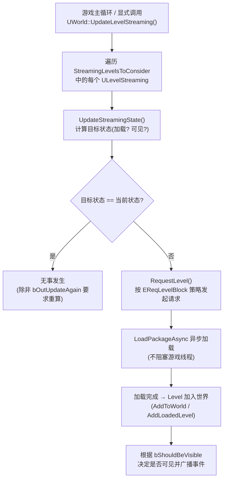
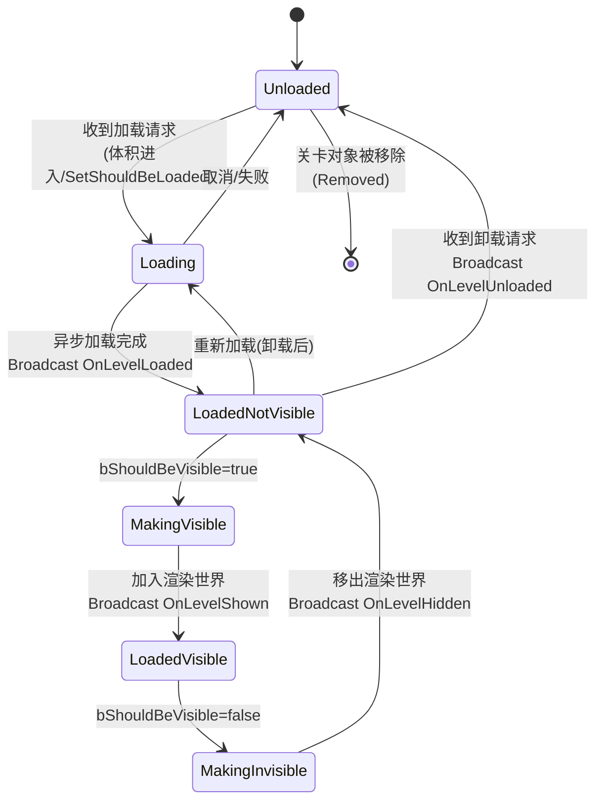
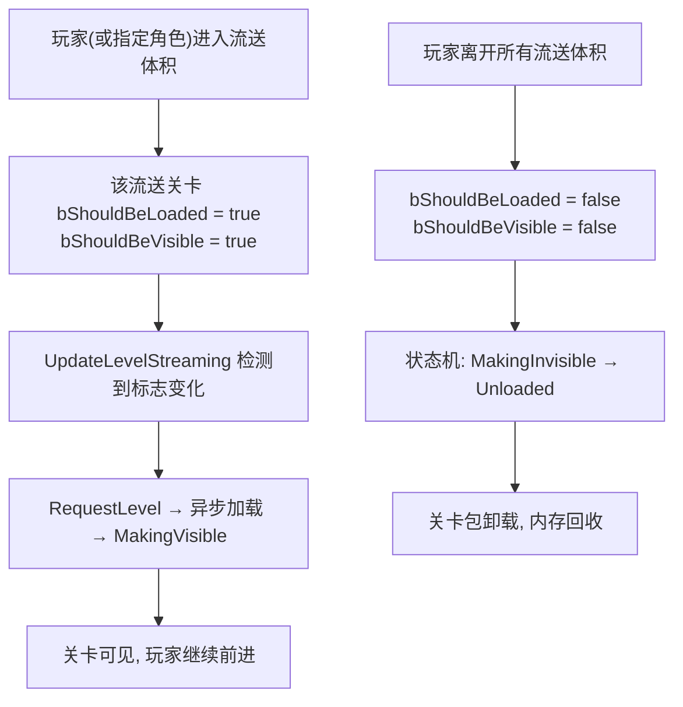
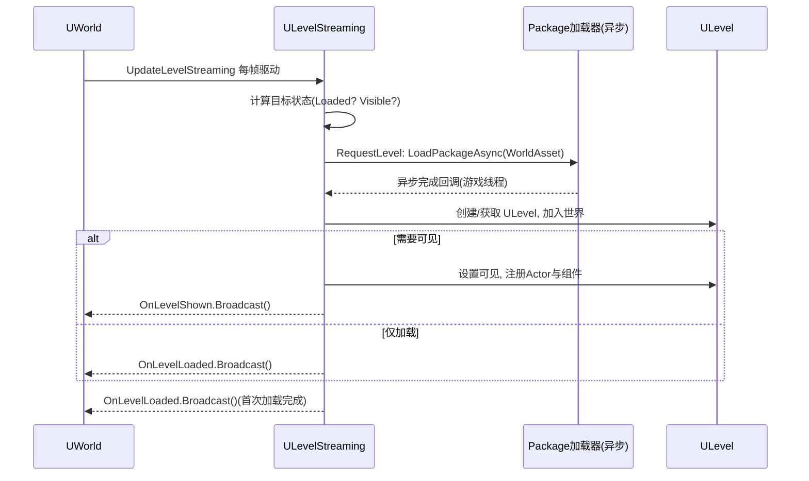
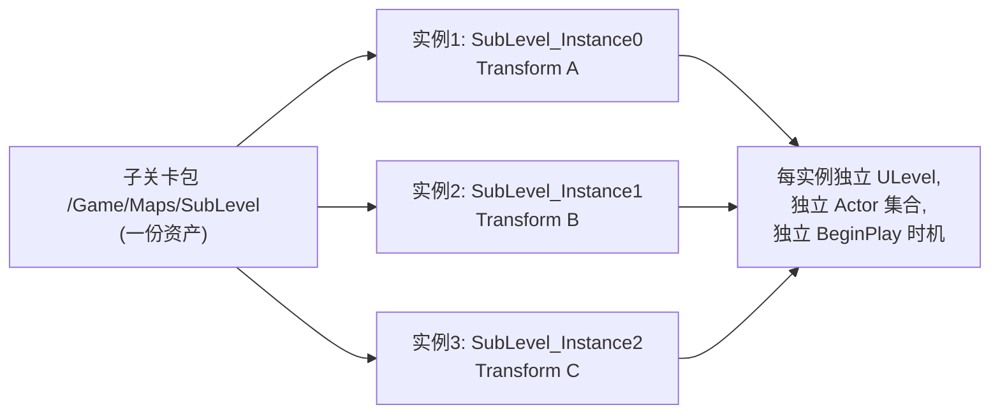

# 08 关卡流送（Level Streaming）

## 一、概述

关卡流送（Level Streaming）是虚幻引擎最经典的"大世界"解决方案：把一张巨大的关卡拆分为一个**持久关卡（Persistent Level）**和若干**流送关卡（Streaming Level）**，运行时只把玩家附近（或当前需要的）子关卡加载进内存，离开后再卸载，从而同时解决三个问题：

- **内存**：不需要把整张地图的所有 Actor、贴图、网格体一次性放进内存；
- **加载时间**：分块异步加载，避免进入游戏前一次性阻塞加载几十秒；
- **协作**：不同美术/策划可以同时编辑不同的子关卡文件（.umap），互不冲突。

流送关卡的加载/卸载判定有三种经典模式：**Always Loaded（始终加载）**、**By Distance（按距离）**、**Streaming Volume（流送体积）**；此外也可以用蓝图/C++ 在任意时机手动触发 Load/Unload。

UE5 引入了 World Partition（世界分区）作为面向超大型开放世界的演进方案，但传统 Level Streaming 并没有过时：中小型项目、模块化子关卡（室内副本、活动地图）、以及"主城 + 副本"这类结构，仍然大量使用传统流送。理解传统流送也是理解 World Partition 的前提——后者在运行时底层仍然借助 `ULevelStreaming` 机制（World Partition 的运行时单元会生成对应的流送关卡对象）。

> 版本基准：UE 5.8.0（本机 `Engine/Build/Build.version`：CL 55116800，分支 `++UE5+Release-5.8`）。
> 源码依据：`C:\Program Files\Epic Games\UE_5.8\Engine\Source\Runtime\Engine\Private\LevelStreaming.cpp` 与 `Classes\Engine\LevelStreaming.h`。
> 兼容性边界：UE4.27 仅作为传统流送迁移对照，当前 World Partition/Level Streaming 行为以 UE5.8 为准。
> 最后更新：2026-08-05（统一 UE5.8 版本基线）。
> 官方参考：[Unreal Engine UE5.8 官方文档总页](https://dev.epicgames.com/documentation/en-us/unreal-engine)。

## 二、核心概念

| 概念 | 说明 | 关键点 |
| --- | --- | --- |
| Persistent Level（持久关卡） | 常驻内存的主关卡，包含世界设置的永久 Actor | 流送关卡都挂接在它下面，不能卸载 |
| Streaming Level（流送关卡） | 独立 `.umap` 子关卡，运行时按需加载/卸载 | 编辑器里可从主关卡添加子关卡 |
| `ULevelStreaming` | 驱动单个流送关卡的核心类（抽象基类） | 每个流送关卡对应一个实例，持有 `WorldAsset` 软引用 |
| `ULevelStreamingAlwaysLoaded` | "始终加载"类型的流送关卡 | 关卡一进游戏就加载并显示，不参与距离/体积判定 |
| `ALevelStreamingVolume` | 流送体积（盒子/球体等），玩家进入/离开触发加载与卸载 | 编辑器里挂在流送关卡上，可多个组合 |
| `ULevelStreamingDynamic` | 运行时动态创建的流送关卡（关卡实例化） | 同一个关卡可创建多个实例，各自带 Transform |
| `bShouldBeLoaded` | "应当加载"标志：是否把关卡包加载进内存 | `SetShouldBeLoaded()`，蓝图 Setter |
| `bShouldBeVisible` | "应当可见"标志：关卡加载完成后是否显示 | `SetShouldBeVisible()`，蓝图 Setter |
| `ELevelStreamingState` | 流送状态机状态（Unloaded→Loading→LoadedVisible…） | `ULevelStreaming` 内部维护，事件在各状态转换时广播 |
| Load Stream Level / Unload Stream Level | 蓝图/`UGameplayStatics` 提供的加载/卸载节点 | 潜伏动作（Latent Action），用 `FLatentActionInfo` 控制 |
| `OnLevelLoaded` / `OnLevelShown` 等 | 流送事件委托（加载完成、显示、卸载、隐藏） | 蓝图可绑定，C++ 可 `AddDynamic` |
| Load Level Instance（关卡实例化） | 运行时以实例方式加载关卡，支持多个实例 | `ULevelStreamingDynamic::LoadLevelInstanceBySoftObjectPtr` |
| Level Transform | 流送关卡在世界中的变换（位置/旋转/缩放） | 静态关卡通常保持原点，实例化关卡常用 |
| `StreamingPriority` | 流送优先级，决定多个关卡竞争加载时的先后 | `SetPriority()` / `SetPriorityOverride()` |
| Level LOD | 流送关卡的低配版本（不同 LOD 显示不同关卡） | `SetLevelLODIndex()`，适合主机平台 |
| Level Streaming GC | 关卡卸载后的内存回收机制 | `ULevelStreamingGCHelper` 触发完整 GC 时机 |
| `bShouldBlockOnLoad` | 加载时是否阻塞游戏线程等待 | 非必要不要开，会卡帧 |
| `RequestLevel` | `ULevelStreaming` 内部驱动加载的核心函数 | 带 `EReqLevelBlock` 阻塞策略参数 |
| World Partition | UE5 面向大世界的"按 Actor 装箱"方案 | 与传统流送对比见 3.7 与《09-WorldPartition大世界》 |

## 三、原理详解

### 3.1 运行时架构：UWorld 与 ULevelStreaming

一个支持流送的世界，内存中同时存在多个 `ULevel`：持久关卡的 Level 常驻，流送关卡的 Level 按需加载。每个流送关卡在 `UWorld::StreamingLevels` 数组中对应一个 `ULevelStreaming` 派生对象，它本身**不是**关卡内容，而是"如何加载/卸载某个关卡"的控制器：

- `WorldAsset`（`TSoftObjectPtr<UWorld>`）：指向要加载的子关卡包；
- 加载/可见标志、优先级、流送体积列表：决定"何时加载"；
- 状态机与委托：记录"加载到哪一步"并对外广播事件。

驱动这一切的主循环在 `UWorld::UpdateLevelStreaming()`（`UWorld` 每帧或按需调用），它遍历 `StreamingLevelsToConsider` 中所有流送关卡，逐个执行 `ULevelStreaming::UpdateStreamingState()`；当状态发生变化时调用 `ULevelStreaming::RequestLevel(PersistentWorld, bAllowLevelLoadRequests, BlockPolicy)` 真正发起异步加载请求。简化流程：



要点：

- **加载与显示是两回事**：`bShouldBeLoaded` 只决定关卡包是否进入内存；关卡**加载完成**后，只有 `bShouldBeVisible` 为真才会显示（`LoadedNotVisible` vs `LoadedVisible`）。蓝图节点 `Load Stream Level` 的 `Make Visible After Load` 参数就是控制这个行为；
- **每帧判断是"惰性"的**：`UpdateStreamingState` 只有在标志、体积或外部条件变化时才真正发起加载/卸载请求；`bOutUpdateAgain` 用于某些需要持续重试的状态（如等待异步加载完成）；
- **异步为主**：除 `bShouldBlockOnLoad`/`EReqLevelBlock::BlockAlways` 外，加载走 `LoadPackageAsync`，游戏线程不等待，加载完成后在游戏线程回调里继续推进状态机。

### 3.2 状态机：一个流送关卡的一生

`ULevelStreaming::ELevelStreamingState` 定义了流送关卡的生命周期（源码 `LevelStreaming.h` 中与 `FStreamLevelAction` 并列的枚举）：`Removed → Unloaded → Loading → LoadedNotVisible → MakingVisible → LoadedVisible → MakingInvisible → LoadedNotVisible …`。图示：



各状态含义：

| 状态 | 含义 | 对应事件 |
| --- | --- | --- |
| `Unloaded` | 关卡包不在内存中 | — |
| `Loading` | 异步加载进行中 | — |
| `LoadedNotVisible` | 已加载进内存，但未显示（Actor 已存在、未注册渲染/物理） | `OnLevelLoaded` |
| `MakingVisible` | 正在加入可渲染世界（注册组件、触发 BeginPlay） | — |
| `LoadedVisible` | 完全可见、可交互 | `OnLevelShown` |
| `MakingInvisible` | 正在移出渲染世界（EndPlay `RemovedFromWorld`） | — |
| `Removed` | 流送关卡对象已从世界移除 | `OnLevelUnloaded`（卸载后） |

注意：**Actor 的 BeginPlay 不是在 `LoadedNotVisible` 触发，而是在 `MakingVisible`（关卡真正激活显示）时**。这也是为什么流送关卡里的 Actor `BeginPlay` 时机比持久关卡晚；卸载时先 `EndPlay(EEndPlayReason::RemovedFromWorld)` 再移出世界。

### 3.3 流送体积（Streaming Volume）如何工作

流送体积是最常用的自动判定方式。在编辑器中，选中流送关卡后可在关卡细节面板把多个 `ALevelStreamingVolume` 指定为它的流送体积（源码 `EditorStreamingVolumes` 数组）。运行时判定逻辑：



关键细节：

- **多个体积取并集**：一个流送关卡可以挂多个体积，玩家在**任意一个**体积内即保持加载；
- **离开体积 = 卸载**：玩家离开全部体积后，关卡先隐藏再卸载；如果只想"隐藏"不想卸载，需要关闭 `Level Streaming` 设置中的自动卸载，或改用手动控制；
- **体积形状**：支持 Box/Sphere/Cylinder 等基础形状，也可以用多个体积拼出复杂区域；
- **判断角色**：默认用玩家控制器所在 Pawn 的位置做包含测试（可在 World Settings 或流送设置中调整）；
- **性能**：包含测试每帧进行，纯空间计算开销极低。

### 3.4 加载与卸载的内部流程（RequestLevel）

`ULevelStreaming::RequestLevel()` 是状态机推进的核心（源码 `LevelStreaming.cpp` 1588 行起）。它做的事大致如下：



要点：

- `RequestLevel` 的第三个参数 `EReqLevelBlock` 控制阻塞策略：`BlockAlways`（无论什么情况都等它加载完，通常用于必须同步的场景如无缝旅行）、`BlockOnLoad`（仅等待加载、不等待可见）、`DoNotBlock`（完全异步，默认推荐）；
- **加载完成 ≠ 立即可见**：完成回调只把关卡加入世界；可见性由下一轮状态机根据 `bShouldBeVisible` 决定，因此蓝图里"Load 完成事件"（`OnLevelLoaded`）与"显示事件"（`OnLevelShown`）是两个不同的回调；
- **卸载**：卸载请求同样由状态机驱动，`LoadedVisible → MakingInvisible → LoadedNotVisible → Unloaded`，之后关卡包会在合适的 GC 时机（`ULevelStreamingGCHelper` 配合完整 GC）被回收，卸载事件 `OnLevelUnloaded` 在包释放前广播；
- **加载错误处理**：如果包不存在或加载失败，状态机会回退到 `Unloaded` 并输出警告日志，`OnLevelLoaded` 不会被触发——所以业务逻辑不应假设"调用加载后一定成功"。

### 3.5 关卡实例化（Level Instancing）

同一张子关卡地图被多次引用时，传统 `ULevelStreaming` 只能加载一份；关卡实例化允许**同一个包被加载为多个实例**，各自拥有独立的 `LevelTransform`、Actor 集合与实例名：



- 编辑器里通过 **Level Instance（关卡实例）** 工具放置；运行时动态创建用 `ULevelStreamingDynamic`（见 4.6）；
- 各实例的 Actor 通过"实例名前缀"区分，避免重名冲突（GUID 引用不受影响）；
- 适合"重复的房间/建筑/副本"场景，能显著减少关卡资产数量与编辑重复劳动。

### 3.6 网络复制下的流送

多人游戏中，流送有两个层面的问题：**关卡加载状态是否一致**与**Actor 复制时机**。

- **关卡可见性由服务器权威管理**：服务器决定每个客户端应该加载/显示哪些流送关卡，并通过复制把"可见关卡列表"同步给客户端（`Level Visibility` 复制）。客户端本地手动加载的关卡不会自动参与复制；
- **客户端必须等待关卡加载**：如果服务器把某个关卡标记为可见，客户端会收到复制请求并异步加载；加载完成前该关卡的 Actor 复制数据到达时会被缓存/延迟处理；
- **`ULevelStreaming::bLocked`**：锁定后编辑器不可更改加载设置，用于保证运行时与服务器配置一致；
- **网络可见性请求**：UE5 中 `ULevelStreaming` 提供 `BeginClientNetVisibilityRequest` / `UpdateNetVisibilityTransactionState`（源码 `LevelStreaming.h` 421/427 行），配合 `FNetLevelVisibilityTransactionId` 管理客户端可见性变更事务，避免频繁切换；
- **RPC 与复制 Actor 的陷阱**：不要假设目标 Actor 所在关卡已加载；跨关卡引用尽量用软引用，并在 `OnLevelLoaded` 之后建立。

### 3.7 与传统流送 vs World Partition

| 维度 | Level Streaming（本文） | World Partition（见 09 篇） |
| --- | --- | --- |
| 划分粒度 | 整个关卡文件（.umap） | 单个 Actor（运行时自动装箱成 Cell） |
| 谁划分 | 开发者手动拆关卡、配置体积 | 引擎按空间哈希自动划分 |
| 编辑体验 | 一次只能编辑一个关卡（子关卡模式） | 整个大世界在同一关卡中编辑、多人协同 |
| 加载单元 | 关卡（可能很大） | Cell（由 Actor 数量决定，可很小） |
| 判定方式 | 体积/距离/手动/始终加载 | 流送源（位置+形状）驱动距离查询 |
| 运行时底层 | `ULevelStreaming` 状态机 | 运行时把 Cell 转成流送关卡，复用 LevelStreaming 机制 |
| 适合场景 | 中小型关卡、模块化子关卡、副本 | 超大型开放世界、无缝大地图 |
| 动态加载 | `LoadLevelInstance` 支持多实例 | Cell 自动管理，另配 Level Instance 做子区域 |
| 数据分层 | 无原生概念（需自行管理） | DataLayer 数据层 |
| 远景优化 | 手动做 LOD/代理 | HLOD 自动生成（合并 ISM） |

## 四、蓝图与 C++ 示例

### 4.1 蓝图：Load Stream Level / Unload Stream Level

最常见的蓝图用法是"走到门口 → 加载室内关卡"。节点位于 `Gameplay Statics` 分类下：

```text
[Event BeginPlay] → [Load Stream Level]
    Level Name               = /Game/Maps/SubLevel_Interior
    Make Visible After Load  = true
    Should Block On Load     = false
    Latent Info              = (默认)
```

参数说明（对应 `UGameplayStatics::LoadStreamLevel`，源码 `GameplayStatics.h` 306 行）：

- **Level Name**：子关卡包的完整路径名或短名（`/Game/Maps/SubLevel_Interior` 最可靠）；
- **Make Visible After Load**：加载完成后是否立即显示（对应 `bShouldBeVisible`）；
- **Should Block On Load**：是否阻塞游戏线程直到加载完成（正常应保持 false）；
- **Latent Info**：潜伏动作标识，保证节点作为"等待加载完成"的流程节点工作。

卸载对应 `Unload Stream Level`（`UGameplayStatics::UnloadStreamLevel`，314 行）：

```text
[Event 离开房间] → [Unload Stream Level]
    Level Name            = /Game/Maps/SubLevel_Interior
    Latent Info           = (默认)
    Should Block On Unload = false
```

### 4.2 蓝图：流送事件绑定

在"加载完成后再干活"的场景（例如加载后立刻把玩家传送到关卡内的某个点），不要依赖 `Delay`，而是绑定事件：

```text
[BeginPlay] → [Get Streaming Level] (Level Name = SubLevel_Interior)
           → [Assign On Level Shown] → [自定义事件: 传送玩家到目标点]
```

`Get Streaming Level` 返回 `ULevelStreaming` 对象，其上有四个可绑定事件（源码 `LevelStreaming.h` 635-648 行，均为 `BlueprintAssignable`）：

- `On Level Loaded`：包加载完成（Actor 存在但可能不可见）；
- `On Level Shown`：关卡已显示（推荐在此做"进入关卡"逻辑）；
- `On Level Hidden`：关卡已隐藏；
- `On Level Unloaded`：关卡已卸载（注意：此时关卡内对象可能已不可用）。

### 4.3 C++：用 UGameplayStatics 加载/卸载

```cpp
#include "Kismet/GameplayStatics.h"

// 加载流送关卡（异步、加载后可见）
UGameplayStatics::LoadStreamLevel(
    this,                                    // WorldContextObject
    TEXT("/Game/Maps/SubLevel_Interior"),    // LevelName
    true,                                    // bMakeVisibleAfterLoad
    false,                                   // bShouldBlockOnLoad
    FLatentActionInfo(0, 0, TEXT("LoadInterior"), this));

// 卸载流送关卡
UGameplayStatics::UnloadStreamLevel(
    this,
    TEXT("/Game/Maps/SubLevel_Interior"),
    FLatentActionInfo(0, 0, TEXT("UnloadInterior"), this),
    false);                                  // bShouldBlockOnUnload
```

### 4.4 C++：直接操作 ULevelStreaming（细粒度控制）

```cpp
#include "Engine/LevelStreaming.h"

// 1. 按包名找到流送关卡控制器
ULevelStreaming* StreamingLevel = GetWorld()->GetLevelStreamingForPackageName(
    TEXT("/Game/Maps/SubLevel_Interior"));
if (!StreamingLevel)
{
    UE_LOG(LogTemp, Warning, TEXT("流送关卡不存在或未配置"));
    return;
}

// 2. 设置加载与可见标志（下一帧 UpdateLevelStreaming 生效）
StreamingLevel->SetShouldBeLoaded(true);
StreamingLevel->SetShouldBeVisible(true);

// 3. 绑定事件（注意：绑定时机在加载发起之前）
StreamingLevel->OnLevelShown.AddDynamic(this, &AMyPlayerController::OnSubLevelShown);

// 4. 查询状态
bool bLoaded  = StreamingLevel->IsLevelLoaded();   // LoadedLevel != nullptr
bool bVisible = StreamingLevel->IsLevelVisible();
```

如果不需要精细控制，也可以直接用 `UWorld::GetStreamingLevels()` 遍历全部流送关卡，按 `GetWorldAssetPackageFName()` 匹配。

### 4.5 C++：强制立即加载（阻塞）

```cpp
ULevelStreaming* Level = GetWorld()->GetLevelStreamingForPackageName(TEXT("/Game/Maps/Critical"));
if (Level)
{
    Level->SetShouldBeLoaded(true);
    // 阻塞直到加载完成（谨慎使用，仅限关键路径）
    Level->RequestLevel(GetWorld(), /*bAllowLevelLoadRequests*/ true,
        ULevelStreaming::EReqLevelBlock::BlockAlways);
}
```

### 4.6 C++：动态关卡实例化（Load Level Instance）

运行时把同一个子关卡加载成多个带变换的实例，使用 `ULevelStreamingDynamic`（源码 `LevelStreaming.cpp` 2660 行）：

```cpp
#include "Engine/LevelStreamingDynamic.h"

bool bSuccess = false;
ULevelStreamingDynamic* Instance = ULevelStreamingDynamic::LoadLevelInstanceBySoftObjectPtr(
    this,                                        // WorldContextObject
    TSoftObjectPtr<UWorld>(FSoftObjectPath(TEXT("/Game/Maps/SubLevel_Room"))),
    FTransform(FRotator(0, 90, 0), FVector(1000, 2000, 0)),  // 实例变换
    bSuccess,
    TEXT("Room_Instance_A"),                     // OptionalLevelNameOverride
    nullptr,                                     // OptionalLevelStreamingClass
    /*bLoadAsTempPackage*/ false);

if (bSuccess && Instance)
{
    Instance->OnLevelShown.AddDynamic(this, &AMyActor::OnRoomShown);
}
```

注意：`LoadLevelInstanceBySoftObjectPtr` 的重载之一是 `(WorldContextObject, Level, Location, Rotation, bOutSuccess, OptionalLevelNameOverride, OptionalLevelStreamingClass, bLoadAsTempPackage)`，二者等价，后者内部转成 Transform 版本。

## 五、最佳实践

### 5.1 关卡划分原则

- **按区域切分**：把"玩家不可能同时需要"的区域拆开（如不同楼层、不同房间组），而不是按物件类型切；
- **控制单关卡大小**：目标单关卡加载时间在 0.5 秒以内（PC 可放宽），用 `stat streaming` / `stat levels` 观察；
- **固定内容放 Always Loaded**：HUD、全局逻辑、地形基础面等放持久关卡或 Always Loaded 子关卡，避免"东西突然消失"；
- **动静分离**：频繁交互的动态内容所在关卡保持常驻，纯装饰区域可大胆卸载；
- **避免关卡间硬引用**：跨关卡引用一律用**软引用**（`TSoftObjectPtr` / 蓝图 Soft Reference），硬引用会把被引用关卡一起带进内存，破坏流送的意义。

### 5.2 加载策略与预加载

- **提前量**：流送体积（或手动加载点）要放在玩家"看到目标区域"之前，配合加载进度提示；
- **预加载下一区域**：在玩家进入区域 A 时预加载区域 B（只 `SetShouldBeLoaded(true)`，不设可见），真正进入时只做"显示"，体验最好；
- **加载预算**：同时加载的关卡数不要太多；`s.LevelStreamingComponentsRegistrationGranularity`、`s.LevelStreamingActorsUpdateTimeLimit` 等控制台变量可调节加载/初始化节奏（5.8；`s.LevelStreaming.MaxPendingLevels` 不存在）；
- **禁止滥用阻塞加载**：`Should Block On Load = true` 只在进度屏/切换场景等明确场景使用，否则直接表现为卡顿；
- **卸载时机**：离开区域后不要立刻卸载——留出"回头"的余量（如 1-2 个区域距离），避免频繁加载/卸载抖动。

### 5.3 内存与 GC

- 卸载只移除引用，**内存释放依赖 GC**：`ULevelStreamingGCHelper` 会在适当时机触发完整 GC，观察内存请用 `stat memory` / `Level Streaming GC` 面板；
- 关卡内 Actor 若被外部强引用（如全局单例缓存了它的指针），关卡卸载后内存无法释放——养成"加载时绑定、卸载时解绑"的习惯；
- 大量小关卡频繁往返会产生加载/卸载抖动，优先考虑合并成更大的关卡或改用 World Partition。

### 5.4 网络多人注意事项

- **服务器权威**：由服务器决定何时 Load/Unload，客户端通过复制获得可见关卡列表，避免客户端各自为政导致不同步；
- **先加载后交互**：交互逻辑放在 `OnLevelShown`（而不是 `OnLevelLoaded`）之后，此时 Actor 才完整注册；
- **复制 Actor 与关卡加载竞态**：若客户端收到某 Actor 的复制数据但所在关卡尚未加载，引擎会延迟处理；不要在客户端手动加载同一关卡造成重复；
- **Level Visibility 复制开销**：大量流送关卡时可见列表复制有带宽成本，尽量用"整块区域开关"而不是频繁逐关卡切换。

### 5.5 编辑与打包

- 使用 **Levels 窗口**管理子关卡：每个子关卡有独立的 Level Blueprint 与 World Settings，注意各自设置（如光照、GameMode 覆盖）；
- 打包时确认子关卡都在 **Always Loaded / By Distance / By Volume** 分类下，且没有被打进其他关卡导致重复；
- 关卡实例化场景注意实例名唯一性，动态创建的实例要管理好生命周期（卸载时同时移除实例对象）；
- 换关（Level Transition）时流送关卡会被全部卸载，若有存档需求在 `EndPlay(EEndPlayReason::LevelTransition)` 中处理。

## 六、FAQ

**Q1：调用 Load Stream Level 后关卡里的东西没出现？**

最常见原因：① Level Name 写错（建议用完整包路径 `/Game/Maps/xxx`）；② 关卡已经加载过（`IsLevelLoaded()` 为 true，事件不重复触发）；③ 加载完成但 `Make Visible After Load` 为 false 且没有后续设可见；④ 关卡里没有任何 Actor 或全被裁剪。先用 `stat streaming` 或控制台 `Level` 命令检查状态。

**Q2：流送关卡卸载时，里面的 Actor 会被销毁吗？**

会走完整的"离场"流程：`EndPlay(EEndPlayReason::RemovedFromWorld)` → 组件反注册 → 从世界移除 → 关卡包 GC 后对象析构。所以不要在持久关卡里长期缓存流送关卡内 Actor 的裸指针；如果只是"暂时不用"，可以考虑只隐藏（不卸载）。

**Q3：蓝图节点为什么没有按预期"等加载完再执行下一步"？**

`Load Stream Level` 是潜伏动作（Latent Action），它依赖 `FLatentActionInfo` 的 UUID/CallbackTarget；如果两个节点共用同一个 `Latent Info` 或回调对象被销毁，流程会提前中断。另外节点必须放在能持续执行 Tick 的流程里（如 Event 图，而不是一次性构造脚本）。

**Q4：同一个关卡反复加载/卸载会不会有性能问题？**

会。每次加载都要重新解析包、重建 Actor、注册组件；频繁往返会造成帧率抖动与 GC 压力。缓解：① 加大卸载延迟（延迟卸载）；② 减少往返（预加载/保留相邻关卡）；③ 关卡内容过大时拆分。控制台 `s.LevelStreaming` 系列变量可调。

**Q5：服务器加载了关卡，客户端却没显示？**

确认该流送关卡的可见性由服务器复制（默认自动），检查客户端日志是否有 `LevelVisibility` 复制错误；不要同时在客户端手动调用加载节点加载同一关卡，会导致关卡重复或 GUID 冲突。

**Q6：关卡加载完成事件里访问关卡内 Actor 报空指针？**

`OnLevelLoaded` 时关卡已加入世界但**尚未显示**，部分组件/初始化可能未完成；请改用 `OnLevelShown`，或用 `ULevelStreaming::IsLevelVisible()` 判断后再访问。

**Q7：流送关卡里的 Level Blueprint 变量能跨关卡访问吗？**

不能直接访问（每个 Level Blueprint 作用域独立）。需要跨关卡通信时，走 GameInstance / GameState / 全局子系统，或用软引用 + 事件转发。

**Q8：World Partition 项目里还能用 Load Stream Level 吗？**

World Partition 运行时内部就依赖流送关卡机制（每个 Cell 生成对应的流送对象），但开发者不需要（也不应该）手动对 Cell 调用 Load/Unload；若需要在 WP 大世界里嵌套"手工子关卡"，使用 **Level Instance**（关卡实例），它通过 `InjectExternalStreamingObject` / `RemoveExternalStreamingObject` 与大世界协作。

## 七、关联阅读

- 《02-Actor与Component生命周期》：流送关卡中 Actor 的延迟 BeginPlay、卸载时的 EndPlay 原因与组件反注册顺序；
- 《09-WorldPartition大世界》：Actor 装箱、DataLayer 与运行时流送策略，理解大世界方案如何"复用"并超越传统流送；
- 《06-网络同步》：Level Visibility 复制、复制 Actor 与加载竞态；
- 《07-UI与性能优化》：加载时间优化、内存预算、`stat streaming` 使用；
- 官方文档：Level Streaming（Docs）与 World Partition（Docs）。
