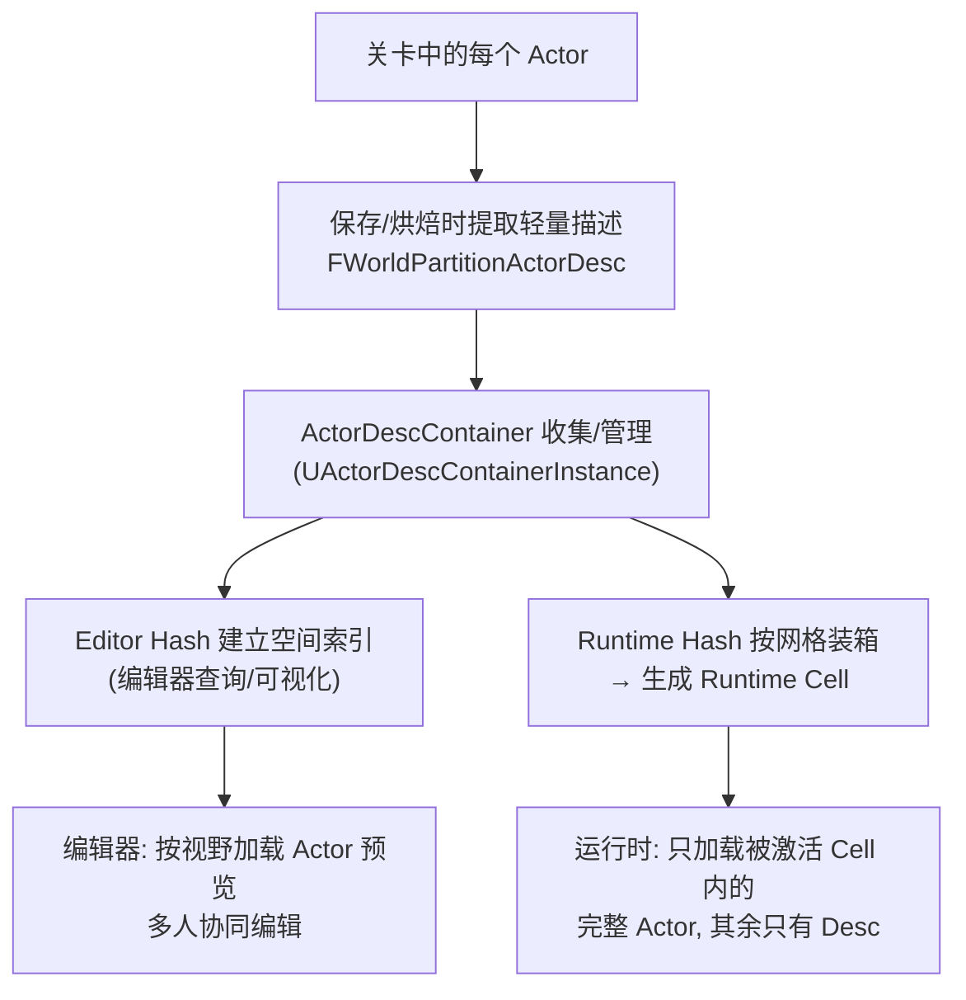
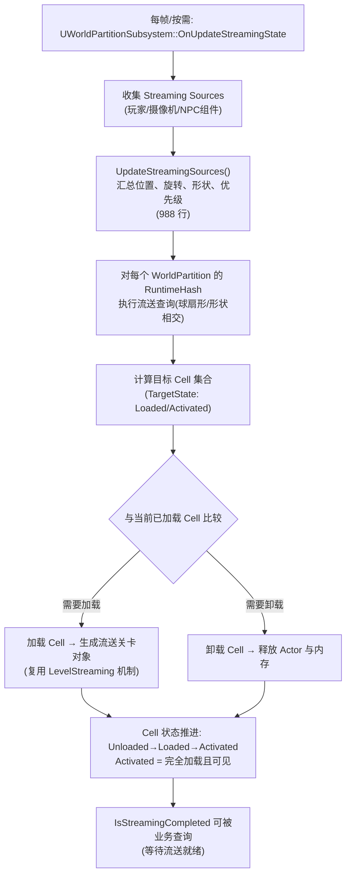
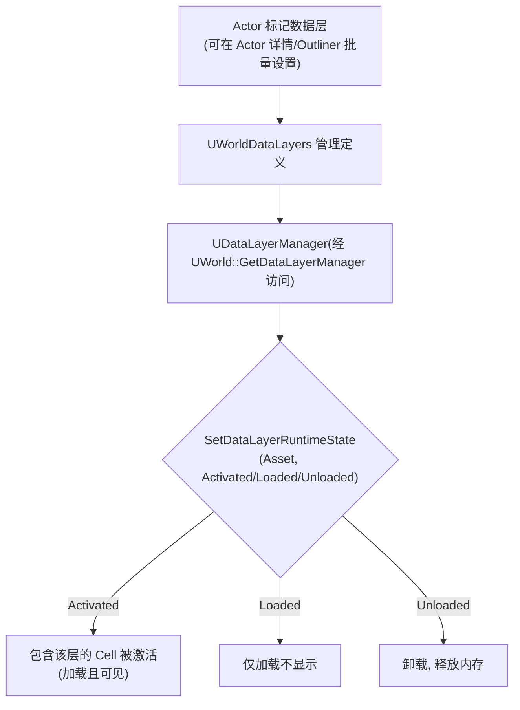
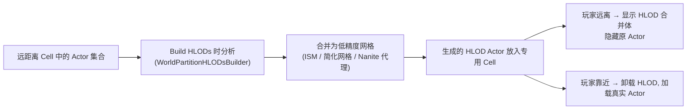
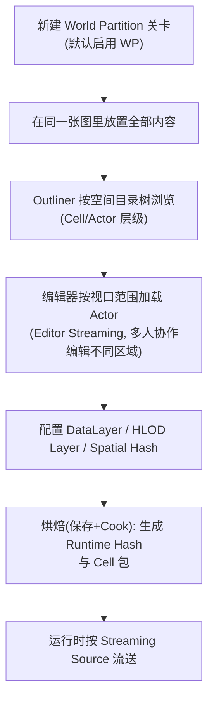

# 09 World Partition 大世界
> 版本基准：UE 5.8.0（本机 `Engine/Build/Build.version`：CL 55116800，分支 `++UE5+Release-5.8`）。
> 兼容性边界：适用于 UE5.8 编辑器/运行时，UE4.27 与早期 UE5 仅作迁移背景，具体模块以正文为准。
> 官方参考：[Unreal Engine UE5.8 官方文档总页](https://dev.epicgames.com/documentation/en-us/unreal-engine)。
> 最后更新：2026-08-06（本轮元数据维护）。

## 一、概述

World Partition（世界分区）是 UE5 为**超大型无缝开放世界**设计的新一代世界构建与流送方案。它的核心思想是：**不再按"关卡文件"切分世界，而是按"单个 Actor"切分**——所有内容都放在同一个大关卡里编辑，引擎在保存/烘焙时把 Actor 按空间位置自动装箱（Binning）成一个个流送单元（Runtime Cell），运行时根据玩家位置（Streaming Source）动态加载/卸载这些单元。

传统 Level Streaming 需要美术手动把世界拆成几十上百个 `.umap` 子关卡、手动摆放流送体积，协作与维护成本随世界规模急剧上升；World Partition 把这些工作全部自动化：

- **编辑自由**：整个开放世界是"一张图"，多人协同编辑同一个关卡（World Partition 支持多人同时编辑不同区域的 Actor）；
- **加载粒度细**：流送单元是 Cell 而不是整个关卡，加载量随内容密度自适应；
- **数据层**：DataLayer 把 Actor 按逻辑分组（如"白天/夜晚""赛季内容"），运行时按需开关；
- **远景优化**：HLOD 自动把远处 Cell 的 Actor 合并成低精度网格，显著降低 Draw Call。

需要注意的是：World Partition **并没有抛弃** Level Streaming——运行时它把每个 Cell 转换成底层的流送关卡对象（`ULevelStreaming` 派生机制）来加载。因此理解 08 篇的传统流送是理解本篇的前提。

> 适用版本：UE 5.x（本文 API 对照本机 UE 5.8 源码 `Engine\Source\Runtime\Engine\Public\WorldPartition\WorldPartition.h`、`WorldPartitionSubsystem.h` 与 `Private\WorldPartition\WorldPartitionSubsystem.cpp` 验证）。World Partition 在 UE5.0 引入，DataLayer 在 5.1 引入，5.2+ 逐步完善编辑协作与 HLOD，5.3+ 优化运行时性能，本文以 5.8 现状为准。

## 二、核心概念

| 概念 | 说明 | 关键点 |
| --- | --- | --- |
| `UWorldPartition` | 世界分区主对象，挂在 World Settings 上 | 管理 Editor Hash 与 Runtime Hash，驱动整个分区系统 |
| Actor Desc（`FWorldPartitionActorDesc`） | 每个 Actor 的轻量"描述"（元数据） | 不加载 Actor 就能知道它的位置、类别、包围盒，用于装箱与查询 |
| Actor 装箱（Binning） | 按空间把 Actor 分组打包 | 装箱结果决定 Actor 属于哪个流送单元 |
| Runtime Cell（`UWorldPartitionRuntimeCell`） | 运行时流送单元（相当于"自动生成的流送关卡"） | 状态：Unloaded → Loaded → Activated |
| Editor Hash（`UWorldPartitionEditorHash`） | 编辑器中的空间索引 | 负责编辑器内快速查询/流送预览 |
| Runtime Hash（`UWorldPartitionRuntimeHash`） | 运行时空间哈希（Spatial Hash 网格） | 把世界划分成多层 2D/3D 网格，决定 Cell 划分 |
| Streaming Source（流送源） | 触发流送的"关注点"（玩家、摄像机、NPC 等） | `UWorldPartitionStreamingSourceComponent` 组件提供 |
| `UWorldPartitionSubsystem` | 运行时流送调度子系统（World Subsystem） | 每帧更新流送状态、提供 `IsStreamingCompleted` 查询 |
| DataLayer（数据层） | 按逻辑分组的 Actor 集合 | `UDataLayerManager` 管理，状态 Unloaded/Loaded/Activated |
| HLOD | 远景层级细节：把远距离 Cell 的 Actor 合并 | 自动生成合并网格（ISM），替代手动 LOD |
| Level Instance（关卡实例） | WP 世界内嵌的"手工子关卡" | 通过 `InjectExternalStreamingObject` 与大世界流送协作 |
| `FWorldPartitionStreamingQuerySource` | 一次流送查询的输入（位置+形状+范围） | `IsStreamingCompleted` 的查询参数 |
| ActorDescContainer（`UActorDescContainerInstance`） | 管理一批 ActorDesc 的容器 | 外部流送对象（Level Instance）也用它注册 |
| Streaming Descriptor | 流送描述符：定义 Actor 的加载/卸载规则 | 非空间加载规则（Always Loaded 等）也在此表达 |

## 三、原理详解

### 3.1 ActorDesc：不加载 Actor 也能"看见"世界

World Partition 运行时的第一层魔法是 **Actor Desc**。在保存/烘焙时，引擎为关卡里的每个 Actor 提取一份轻量描述（`FWorldPartitionActorDesc`，源码 `Public\WorldPartition\WorldPartitionActorDesc.h`），包含：

- `GetActorNativeClass()`：Actor 的类；
- `GetActorBounds()`：包围盒（用于空间查询）；
- `GetActorLabel()` / `GetActorLabelOrName()`：显示名；
- `GetActorPackage()`：Actor 序列化所在的包；
- `GetActorIsEditorOnly()` / `GetActorIsRuntimeOnly()`：是否仅编辑器/仅运行时；
- 以及 GUID、数据层归属、空间加载标志等。

这些描述以极小的内存代价（相对加载完整 Actor）常驻内存，构成一张"世界地图"。所有流送决策（哪些 Cell 该加载）都在这张地图上做，**不需要真正加载 Actor 资产**：



要点：

- **Desc 与 Actor 分离**：几十万 Actor 的大世界，Desc 全部常驻内存也只有几十 MB 量级，而完整加载这些 Actor 需要数 GB；
- **查询即决策**：`UWorldPartitionSubsystem` 的流送查询遍历 Desc 空间索引，计算"哪些 Cell 与流送源相交"，再决定加载哪些 Cell——整个过程不触碰 Actor 资产；
- **编辑器与运行时共用**：编辑器里"按视口加载 Actor"也是同一套 Desc 索引（Editor Hash），这保证了多人编辑时各自只加载自己视野附近的 Actor。

### 3.2 运行时流送策略：Subsystem + Streaming Source

运行时流送由 `UWorldPartitionSubsystem`（World Subsystem，随 World 创建）驱动。它实现了 `UWorldSubsystem::OnUpdateStreamingState()`（源码 `WorldPartitionSubsystem.cpp` 1168 行），在引擎更新流送状态的时机被调用；同时每个 World Partition 的 `RuntimeHash` 负责具体的网格查询。整体流程：



关键实现细节（对照源码）：

- **流送源**：`UWorldPartitionStreamingSourceComponent`（源码 `Classes\Components\WorldPartitionStreamingSourceComponent.h`）挂在任意 Actor（通常是 Pawn/Character/Camera）上，把组件位置、朝向与配置的"形状"（球扇形 `FSphericalSector`，含半径/角度）转换为 `FWorldPartitionStreamingSource`；每个源有 `EStreamingSourcePriority Priority`（优先级）与 `EStreamingSourceTargetState TargetState`（目标状态：`Loaded` 或 `Activated`，源码 `WorldPartitionStreamingSource.h` 218-221 行）；
- **增量更新**：Subsystem 维护 `IncrementalUpdateWorldPartitions` 集合，把流送状态更新**分摊到多帧**（`IncrementalUpdateStreamingState()`），避免一帧内处理所有 Cell 造成卡顿；
- **速度预测**：`UpdateStreamingSourcesVelocity()`（1141 行）用源的速度外推加载范围，提前加载玩家正前方的 Cell；
- **完成查询**：`IsStreamingCompleted()` 两个重载（858/896 行）：无参版本用默认源查询"全部流送是否完成"；带参版本接受 `EWorldPartitionRuntimeCellState QueryState` 与 `TArray<FWorldPartitionStreamingQuerySource>`，可查询任意状态（`Unloaded/Loaded/Activated`，三者严格递增，源码 `WorldPartitionRuntimeCell.h` 202-206 行）；
- **Cell 状态**：`UWorldPartitionRuntimeCell::GetCurrentState()` 返回 Unloaded/Loaded/Activated；`IsAlwaysLoaded()` 表示常驻 Cell（非空间加载），`IsSpatiallyLoaded()` 表示空间加载 Cell。

### 3.3 网格划分：Spatial Hash

运行时默认使用 **Spatial Hash**（`UWorldPartitionRuntimeSpatialHash`）把世界划分成**多层 2D 网格**（也可配置 3D 网格用于多层建筑）。核心参数：

| 参数 | 说明 | 典型值 |
| --- | --- | --- |
| Grid Cell Size（网格单元尺寸） | 每层网格的单元边长 | 12800（可调） |
| Grid Loading Range（加载范围） | 流送源周围多大范围加载 Cell | 根据视野与内容密度 |
| 网格层级数 | 由流送源 Loading Range 与 Cell Size 共同决定层数 | 自动 |
| 流送源形状 | 圆形（默认）/ 扇形（视野方向优先） | 扇形适合第三人称 |

```mermaid
flowchart LR
    subgraph 多层网格(按需)
        G1["粗网格层: Cell 大<br/>(远处, 主要提供 HLOD 占位)"]
        G2["中网格层: Cell 中"]
        G3["细网格层: Cell 小<br/>(玩家附近, 完整加载)"]
    end
    P["玩家(Streaming Source)"] --> G1
    P --> G2
    P --> G3
    G3 --> L["附近 Cell: Loaded + Activated<br/>完整 Actor"]
    G2 --> H["中远 Cell: 按需 Loaded"]
    G1 --> HL["远处 Cell: 仅 HLOD 合并体"]
```

要点：

- **Cell 不是固定大小**：Spatial Hash 按 Actor 密度拆分——一个大 Cell 里 Actor 过多时会再细分（网格层级自动加深），保证每个 Cell 的加载时间/内存可控；
- **加载预算**：Cell 大小与加载范围直接决定同时加载的 Actor 数量；调参时用 `stat worldpartition` 观察加载中的 Cell 数与内存；
- **非空间加载**：有些 Actor 不需要空间判定（全局逻辑、管理器），标记为 **Always Loaded**（非空间加载）后进入常驻 Cell，不参与距离流送。

### 3.4 DataLayer 数据层

DataLayer（数据层）是 World Partition 的"逻辑维度"：给 Actor 打上数据层标签，运行时按数据层状态整体加载/卸载，与空间位置正交。典型用途：昼夜切换、赛季内容、副本入口、不同玩法模式的场景变体。



源码对照（`Public\WorldPartition\DataLayer\DataLayerManager.h`）：

- 状态枚举 `EDataLayerRuntimeState { Unloaded, Loaded, Activated }`（`DataLayerInstance.h` 23-32 行），`Activated` 表示"加载且可见"，`Loaded` 表示"加载但不可见"；
- `SetDataLayerRuntimeState(const UDataLayerAsset*, EDataLayerRuntimeState, bool bInIsRecursive=false)`：设置状态（可递归应用到子层）；
- `GetDataLayerInstanceFromName` / `GetDataLayerInstanceFromAsset` / `GetDataLayerInstanceFromAssetName`：按名称/资产查找数据层实例；
- `GetDataLayerInstanceEffectiveRuntimeState`：考虑父层继承后的**有效**状态（父层 Unloaded 时子层即使 Activated 也不会加载）；
- `UDataLayerManager` 通过 `UWorld::GetDataLayerManager()` 获取（`World.h` 2963 行）。

注意：数据层状态变化同样走异步流送（Cell 的加载/卸载），因此切换数据层后需要等待 `IsStreamingCompleted` 才能安全访问其中的 Actor。

### 3.5 HLOD：远距离 Cell 的自动降级

开放世界最怕"远处什么都有"——Draw Call 爆炸。World Partition 的答案是 **HLOD（Hierarchical Level of Detail）**：



要点：

- **构建**：编辑器里通过 HLOD 面板/Build HLODs 生成（源码 `Editor\UnrealEd\Private\WorldPartition\WorldPartitionHLODsBuilder.cpp`），按 HLOD Layer 配置（如"建筑层用简化网格、植被层用 ISM"）；
- **运行时**：`WorldPartitionRuntimeCellTransformerISM`（`Public\WorldPartition\WorldPartitionRuntimeCellTransformerISM.h`）等转换器在烘焙时把 Cell 内容合并成 ISM/代理网格，运行时作为独立 Cell 流送；
- **Nanite 支持**：UE5 中 Nanite 网格可直接用作 HLOD 代理，配合自动 LOD 生成，远处细节保留好且开销低；
- **预算**：HLOD 的意义是把"远处几千个 Actor"变成"几十个合并体"，从而把 Draw Call 与渲染三角形数控制住；HLOD 构建质量直接影响远景观感，需要反复迭代。

### 3.6 编辑工作流

World Partition 的编辑模式与传统关卡差异很大：



编辑器关键能力：

- **Actor 目录树（Outliner）**：按空间 Hash 组织 Actor，可快速过滤"当前视口/当前 Cell"的 Actor；
- **编辑时流送**：编辑器视口移动时按需加载 Actor（可关闭），多人同时编辑不同区域互不干扰；
- **转换工具**：旧关卡（传统子关卡/大关卡）可通过 Convert World Partition 命令（`ConvertWorldPartitionCommandlet`，`IsRunningConvertWorldPartitionCommandlet()` 可见）迁移；
- **调试可视化**：`DrawRuntimeHashPreview()` / `DrawRuntimeHash3D()` 等显示 Cell 边界与加载状态，配合 `World Partition` 工具栏的流送调试视图使用。

### 3.7 与 Level Streaming 对比

| 维度 | Level Streaming（08 篇） | World Partition（本篇） |
| --- | --- | --- |
| 切分粒度 | 关卡文件（手工） | Actor（自动装箱成 Cell） |
| 编辑方式 | 多关卡模式、一次编辑一个 | 单一大关卡、多人分区协同 |
| 加载单元 | 整个子关卡 | Cell（按密度自适应大小） |
| 触发方式 | 体积/距离/手动/始终加载 | 流送源形状查询（位置+方向） |
| 逻辑分组 | 无原生机制 | DataLayer 数据层 |
| 远景优化 | 手动 LOD/合并 | HLOD 自动生成 |
| 动态子区域 | Level Instance | Level Instance（经外部流送对象注入） |
| 底层实现 | `ULevelStreaming` 直接驱动 | Cell → 流送关卡，复用 LevelStreaming 机制 |
| 适合规模 | 中小型/模块化 | 超大型无缝世界 |
| 学习成本 | 低 | 高（参数与工作流完全不同） |

## 四、蓝图与 C++ 示例

### 4.1 蓝图：DataLayer 运行时开关

蓝图侧通过 `Data Layer` 相关节点操作（对应 `UDataLayerManager` 的封装）：

```text
[Event 切换到夜晚] → [Set Data Layer Runtime State]
    Data Layer  = 数据层资产(如 DL_Night)
    State       = Activated
    Is Recursive = true
[Event 切回白天] → [Set Data Layer Runtime State]
    Data Layer  = DL_Night
    State       = Unloaded
```

切换后如果需要立即使用数据层里的 Actor（如找到夜晚路灯并点亮），用 `Is Streaming Completed` 节点等待：

```text
[Set Data Layer Runtime State] → [Is Streaming Completed] → [是] → [Get All Actors Of Class / 访问目标 Actor]
```

### 4.2 C++：获取 World Partition 与流送完成查询

```cpp
#include "WorldPartition/WorldPartitionSubsystem.h"
#include "WorldPartition/WorldPartition.h"

// 1. 获取子系统（World Subsystem，随 World 存在）
if (UWorldPartitionSubsystem* WPS = GetWorld()->GetSubsystem<UWorldPartitionSubsystem>())
{
    // 2. 获取当前世界的 World Partition 对象
    if (UWorldPartition* WP = WPS->GetWorldPartition())
    {
        // 3. 是否启用了运行时流送
        bool bStreamingEnabled = WP->IsStreamingEnabled();
        UE_LOG(LogTemp, Log, TEXT("WorldPartition streaming enabled: %d"), bStreamingEnabled);
    }

    // 4. 等待默认流送源完成全部流送（例如传送后使用）
    if (!WPS->IsStreamingCompleted())
    {
        // 注册完成回调：OnStreamingStateUpdated
        WPS->OnStreamingStateUpdated().AddUObject(this, &AMyPlayerController::OnStreamingStateUpdated);
    }
}
```

带参查询（等待某个区域的 Cell 达到 Activated）：

```cpp
FWorldPartitionStreamingQuerySource QuerySource;
QuerySource.Location = TargetLocation;
QuerySource.Rotation = FRotator::ZeroRotator;
QuerySource.Radius    = 5000.f;   // 查询半径
QuerySource.bUseGridLoadingRange = true;  // 使用网格加载范围而非固定半径

TArray<FWorldPartitionStreamingQuerySource> QuerySources;
QuerySources.Add(QuerySource);

bool bReady = WPS->IsStreamingCompleted(
    EWorldPartitionRuntimeCellState::Activated,  // 目标状态
    QuerySources,
    /*bExactState*/ false);
```

### 4.3 C++：DataLayer 操作

```cpp
#include "WorldPartition/DataLayer/DataLayerManager.h"
#include "WorldPartition/DataLayer/DataLayerAsset.h"

UDataLayerManager* DLM = GetWorld()->GetDataLayerManager();
if (!DLM) { return; }

// 按资产名(路径)查找数据层实例
const UDataLayerInstance* NightLayer = DLM->GetDataLayerInstanceFromAssetName(TEXT("/Game/DataLayers/DL_Night.DL_Night"));

// 按资产引用设置运行时状态（Activated = 加载且可见）
if (UDataLayerAsset* NightAsset = LoadObject<UDataLayerAsset>(nullptr, TEXT("/Game/DataLayers/DL_Night.DL_Night")))
{
    DLM->SetDataLayerRuntimeState(NightAsset, EDataLayerRuntimeState::Activated, /*bInIsRecursive*/ true);
}

// 查询有效状态（考虑父层继承）
EDataLayerRuntimeState Effective = DLM->GetDataLayerInstanceEffectiveRuntimeState(NightLayer);
```

### 4.4 C++：流送源组件

给玩家角色挂 `UWorldPartitionStreamingSourceComponent`（也可在蓝图里直接添加并配置）：

```cpp
#include "Components/WorldPartitionStreamingSourceComponent.h"

// 构造函数中创建（或从蓝图获取已有组件）
StreamingSource = CreateDefaultSubobject<UWorldPartitionStreamingSourceComponent>(TEXT("StreamingSource"));
StreamingSource->Priority = EStreamingSourcePriority::High;
StreamingSource->TargetState = EStreamingSourceTargetState::Activated;

// 运行时启用/停用（组件默认开启，也可用蓝图节点 Enable/Disable Streaming Source）
StreamingSource->EnableStreamingSource();
// StreamingSource->DisableStreamingSource();
bool bEnabled = StreamingSource->IsStreamingSourceEnabled();
```

组件位置/旋转默认跟随挂载的 Actor，其形状（半径/角度）在组件详情中配置；`GetStreamingSource(FWorldPartitionStreamingSource&)` 会生成供子系统查询的源数据。

### 4.5 C++：遍历 World Partition 与 ActorDesc 查询

```cpp
#include "WorldPartition/WorldPartitionSubsystem.h"
#include "WorldPartition/WorldPartitionActorDesc.h"

UWorldPartitionSubsystem* WPS = GetWorld()->GetSubsystem<UWorldPartitionSubsystem>();
if (!WPS) { return; }

WPS->ForEachWorldPartition([this](UWorldPartition* WP)
{
    // 每个 WP 有一个 ActorDescContainerInstance，可遍历其 ActorDesc
    // UActorDescContainerInstance* Container = WP->GetActorDescContainerInstance();
    // 遍历 FWorldPartitionActorDesc：GetActorNativeClass() / GetActorBounds() /
    // GetActorIsRuntimeOnly() / GetActorLabel() 等（见 WorldPartitionActorDesc.h）
    return true; // 继续遍历
});
```

## 五、最佳实践

### 5.1 决策：项目该不该用 World Partition

- **适合**：无缝开放世界、地形超 2km×2km、需要多人协同编辑同一张图、内容按逻辑分组的赛季/昼夜玩法；
- **不适合**：房间制/关卡制游戏（每关小地图）、强依赖关卡切换流程、团队未准备好新的内容组织方式——这类项目用传统 Level Streaming 更简单可控；
- **混合**：WP 世界 + Level Instance 做副本/室内，两者可以共存（见 5.6）。

### 5.2 网格与加载参数调优

- **Cell Size 起步**：从 12800 起步，观察 `stat worldpartition` 中"同时加载 Actor 数"与加载耗时；Cell 太小 → 流送请求频繁；太大 → 单次加载卡顿；
- **Loading Range 匹配视野**：第三人称游戏可以缩小 Loading Range 并靠速度外推补偿；第一人称射击要保证视野边缘无"突现"；
- **形状**：默认圆形源简单可靠；想省内存可配扇形源（前方优先），但转身时可能出现加载延迟；
- **帧预算**：把 Cell 加载/卸载分散到多帧（增量更新是默认行为），观察 `stat streaming` 的加载线程占用；
- **常驻内容**：全局逻辑、UI 管理器等标记 Always Loaded，但**不要滥用**——常驻 Cell 里的内容等价于持久关卡，多了就失去流送意义。

### 5.3 Actor 设计规范

- **空间优先**：尽量让每个 Actor 有合理的包围盒与位置；无空间意义的数据逻辑不要放关卡里，放 GameInstance/Subsystem；
- **非 Actor 内容**：World Partition 只流送 **Actor**。大型静态网格、地形等也必须以 Actor 形式存在（Landscape 有专门支持）；无法装箱的内容（如 World Settings、关卡脚本）留在持久层；
- **Runtime Only 标记**：纯逻辑/纯数据 Actor 标 `bActorIsRuntimeOnly`，编辑器里不加载、减少编辑开销；
- **避免巨型单 Actor**：单个 Actor 包围盒横跨大量 Cell 会被"重复计入"，导致多个 Cell 同时加载它——超大网格拆分成多个 Actor（或使用 ISM/HLOD）；
- **引用纪律**：跨 Cell 引用用软引用（`TSoftObjectPtr`）；运行时依赖关系要在加载完成后建立（监听 Cell Activated / 数据层事件）。

### 5.4 DataLayer 使用建议

- **按"开关"设计**，不要按"区域"设计：区域用空间网格解决，数据层只表达逻辑状态；
- 数据层**层级**别太深（有效状态计算与递归开销），2-3 层以内；
- 切换数据层后**等待流送完成**再访问 Actor（`IsStreamingCompleted` 或事件）；
- 编辑器里用数据层过滤 Outliner，方便按玩法整理内容。

### 5.5 流送预算与性能

- **观察指标**：`stat worldpartition`（Cell 数/加载中/内存）、`stat streaming`（5.8 无 `stat HLOD` 组）；
- **控制并发**：同时加载的 Cell 数有上限（相关控制台变量/项目设置），超限时按优先级排队；
- **HLOD 是渲染预算的关键**：远景 Draw Call 来自 HLOD 合并体而不是原始 Actor；HLOD 构建质量与分层直接影响远景帧率；
- **IO 预算**：PC 用 SSD 时加载压力小，主机要严格控制单帧 IO 请求数（Cell 大小、加载范围、流送源数量三者联动）；
- **多流送源谨慎**：每个流送源都会扩大加载范围（玩家+摄像机+NPC），源越多同时加载内容越多。

### 5.6 与 Level Instance / 传统流送共存

- WP 世界内嵌副本/室内：使用 **Level Instance**（关卡实例），它作为外部流送对象通过 `UWorldPartition::InjectExternalStreamingObject` / `RemoveExternalStreamingObject`（`WorldPartition.h` 488-489 行）注册进大世界流送；
- 不要在大世界关卡里手动摆 `ULevelStreaming` 子关卡（与 Cell 流送冲突）；需要"手工流送区域"一律走 Level Instance；
- 纯持久内容（主菜单/大厅）仍然可以是独立传统关卡，进大世界时用 Open Level 切换。

### 5.7 多人游戏

- Cell 加载决策默认按**本地**流送源执行；服务器需要把"哪些 Cell 加载了"同步给客户端（World Partition 在复制层面提供支持，客户端会等待服务器确认的 Cell 加载完成再激活 Actor）；
- 复制 Actor 的"所在 Cell 未加载"竞态由引擎缓存处理，但业务上仍建议在 Cell 激活后再交互；
- 流送预算在服务器（无渲染）与客户端（有渲染）应分开配置；服务器可以缩小加载范围以省内存。

## 六、FAQ

**Q1：为什么我放进 WP 关卡的 Actor 在 PIE 里不见了？**

最常见原因：① Actor 被分到的 Cell 不在流送源加载范围内（检查 Actor 位置与网格设置）；② Actor 属于某个数据层且该层未 Activated；③ 编辑器"编辑时流送"设置导致视口外 Actor 未加载。用 World Partition 工具栏的调试视图（显示 Cell 边界）与 `stat worldpartition` 排查。

**Q2：WP 和 Level Streaming 能混用吗？**

不能在同一张 WP 关卡里手动配置传统流送子关卡；但可以通过 **Level Instance** 嵌套手工子关卡（运行时注入外部流送对象），或在关卡层面用传统流送切换不同 WP 大世界/非 WP 关卡。

**Q3：动态生成的 Actor（SpawnActor）会参与 Cell 流送吗？**

运行时 Spawn 的 Actor 默认**不参与** WP 装箱（装箱是离线烘焙时做的）；动态 Actor 随生成它的世界/关卡生命周期存在，需要"大世界级"的动态管理请自行实现（对象池、数据层等）。

**Q4：切换数据层后立刻访问 Actor 报空？**

数据层状态变化是**异步流送**：`Activated` 后 Cell 需要时间加载。务必用 `IsStreamingCompleted`（带数据层对应查询源）或监听 Cell/流送状态事件后再访问。

**Q5：Cell 里的 Actor 加载了但没显示（Loaded 不是 Activated）？**

`Loaded` 与 `Activated` 是两个状态：Loaded 只是进内存，Activated 才加入可渲染世界（对应传统流送的"加载 vs 可见"）。流送源 `TargetState` 设为 `Loaded` 时会出现这种情况；确认目标状态与查询条件一致。

**Q6：远景建筑"突然消失/弹出"？**

检查：① HLOD 是否已构建且覆盖该区域；② HLOD Layer 的切换距离与网格 Loading Range 是否匹配；③ 流送源形状是否覆盖视野方向（扇形源转身时有延迟）；④ 网格层级设置是否导致远处 Cell 被卸载过早。

**Q7：编辑器里非常卡，怎么办？**

缩小编辑器流送范围、关闭"编辑时流送"或降低视口流送半径；Outliner 里按 Cell 过滤；超大场景建议团队分区域编辑，配合版本控制锁定互不干扰。

**Q8：打包后体积很大/加载慢？**

World Partition 的 Cell 是按 Actor 打包的，Actor 数量与资产引用决定包体积；用烘焙报告（Cook Report）检查重复引用与未裁剪资产；同时把"仅运行时数据"标 Runtime Only 减小编辑器开销；加载慢优先查 IO 与 Cell 大小配置。

## 七、关联阅读

- 《08-关卡流送LevelStreaming》：传统流送原理与 `ULevelStreaming` 状态机——World Partition 运行时 Cell 正是复用了这套机制；
- 《02-Actor与Component生命周期》：Cell 激活/卸载时 Actor 的 BeginPlay/EndPlay 时机（`RemovedFromWorld`）；
- 《06-网络同步》：WP 下的 Cell 加载同步与复制竞态；
- 《07-UI与性能优化》：加载预算、内存分析、`stat worldpartition` 使用；
- 《13-世界构建与过场》：Level Instance、关卡流送与过场衔接；
- 官方文档：World Partition（Docs）与 World Partition 多人协作指南。

