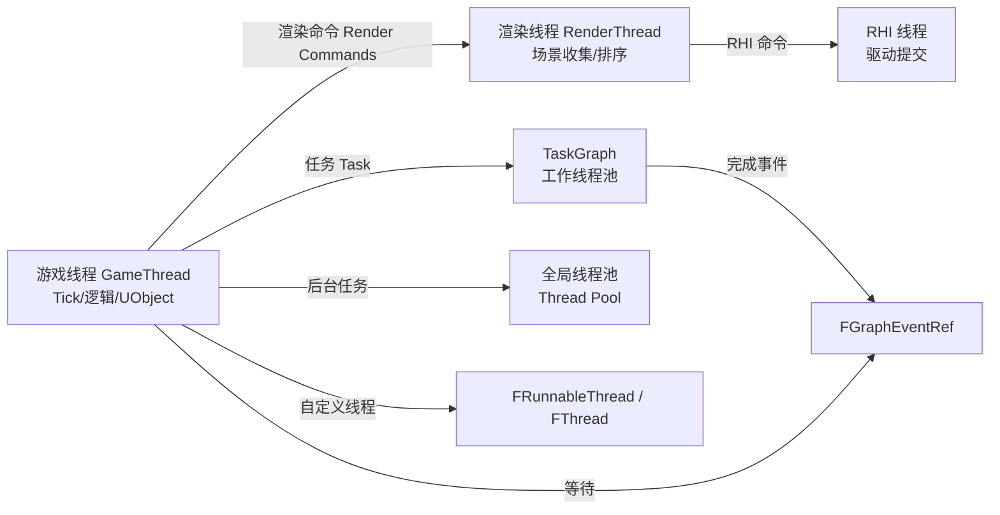

# 11 多线程与任务系统（Multithreading & Task Systems）

> 版本基线：UE5.8.0 / CL55116800 / ++UE5+Release-5.8（本机 `C:\Program Files\Epic Games\UE_5.8\Engine`）。
> 适用范围：客户端 / 服务端 C++ 开发中的多线程编程与任务调度（使用层，非源码深读）。
> 事实边界：本文"本机核对"项来自只读检索本机 5.8 源码（`Source\Runtime\Core\Public\HAL\Runnable.h`、`RunnableThread.h`、`Thread.h`、`Async\AsyncWork.h`、`Async\Async.h`、`Async\ParallelFor.h`、`Async\TaskGraphInterfaces.h`、`HAL\CriticalSection.h`、`HAL\Event.h`、`Misc\ScopeLock.h`、`Templates\Atomic.h` 等）；无法在本机核对的版本敏感项一律写"待核对"，不虚构类名 / 函数名 / CVar。
> 官方参考：[Unreal Engine 文档首页](https://dev.epicgames.com/documentation/en-us/unreal-engine)。
> 最后更新：2026-08-07（初稿）。

## 概述

UE 是一个**多线程引擎**：游戏逻辑、渲染、RHI 提交、音频、物理、AI 等模块分布在多个线程上协同工作。对使用层开发者来说，理解"哪些代码跑在哪个线程"与"如何安全地把任务交给其他线程"，是写出无崩溃、无死锁、可扩展代码的前提。

UE 提供了一整套自底向上的任务设施：

- 底层线程封装：`FRunnable` / `FRunnableThread`（以及 5.8 新提供的 `FThread` 便捷封装）；
- 任务封装：`FAsyncTask` / `FAutoDeleteAsyncTask`（线程池执行）；
- 函数式异步：`Async()` / `AsyncTask()` 与 `EAsyncExecution` 执行策略；
- 数据并行：`ParallelFor` 系列；
- 任务图：TaskGraph（`ENamedThreads`、`FGraphEventRef`、`TGraphTask`）；
- 同步原语：`FCriticalSection` / `FScopeLock`、`FEvent` / `FEventRef`、`FThreadSafeCounter` / `FThreadSafeBool`、`TAtomic` / `std::atomic`。

理解本章后你将能够回答：

- 游戏线程、渲染线程、RHI 线程各自负责什么？我的代码默认跑在哪条线程？
- `FRunnable`、`FAsyncTask`、`Async()`、`ParallelFor`、TaskGraph 之间怎么选？
- 为什么工作线程里不能随便碰 `UObject`？结果如何安全送回游戏线程？
- 5.8 中 `FCriticalSection`、`TAtomic`、`FEvent` 的形态有什么变化？
- 死锁 / 竞态的常见模式与定位方法。

## 核心概念表

| 概念 | 英文 | 说明（本机 5.8 依据） | 关键点 |
| --- | --- | --- | --- |
| 游戏线程 | Game Thread | 逻辑主线程：Tick、游戏玩法、UObject 操作 | `ENamedThreads::GameThread`（`TaskGraphInterfaces.h` L61，已核对） |
| 渲染线程 | Render Thread | 收集渲染命令并提交给 RHI | `ENamedThreads::RenderThread`（L114 静态，已核对）；`ActualRenderingThread`（L63，已核对） |
| RHI 线程 | RHI Thread | 平台驱动提交线程 | `ENamedThreads::RHIThread`（L60，已核对） |
| 工作线程池 | Worker Thread Pool | TaskGraph 后台执行线程集合 | 线程数由引擎按 CPU 核与配置决定 |
| `FRunnable` | 可运行接口 | 自定义线程的入口抽象 | `HAL\Runnable.h` L19（已核对） |
| `FRunnableThread` | 线程对象 | 工厂 `Create()` 创建并启动线程 | `RunnableThread.h` L19 / `Create` L44（已核对，含 `EThreadCreateFlags`） |
| `FThread` | 5.8 线程便捷封装 | 构造即启动、`Join()` 等待、move-only | `HAL\Thread.h` L23（已核对） |
| `FAsyncTask<T>` | 线程池任务 | 在后台线程池执行，可复用/手动管理 | `Async\AsyncWork.h`（已核对） |
| `FAutoDeleteAsyncTask<T>` | 自删除任务 | 完成后自行销毁 | `AsyncWork.h` L60（已核对） |
| `FNonAbandonableTask` | 任务基类 | 实现 `DoWork()` / `GetStatId()` | `AsyncWork.h`（已核对） |
| `Async()` / `AsyncTask()` | 函数式异步 | 传 lambda，按策略执行并返回 `TFuture` | `Async\Async.h`（`EAsyncExecution` L27、`AsyncTask` L463，已核对） |
| `ParallelFor` | 数据并行 | 对 `[0, Num)` 并行执行 Body | `Async\ParallelFor.h` L526（已核对） |
| TaskGraph | 任务图 | 有依赖关系的任务调度系统 | `TaskGraphInterfaces.h`（`FGraphEventImpl` L717，已核对） |
| `FGraphEventRef` | 任务完成事件 | 等待/串联任务 | `TaskGraphInterfaces.h` L258（已核对） |
| `FCriticalSection` | 临界区 | 5.8 中为 `UE::FPlatformRecursiveMutex` 别名（递归互斥） | `HAL\CriticalSection.h` L53（已核对） |
| `FScopeLock` | RAII 锁 | 作用域内自动加解锁 | `Misc\ScopeLock.h` L140（已核对） |
| `FEvent` / `FEventRef` | 事件/信号 | 线程间等待-通知；5.8 位于 `HAL\Event.h` | L21 / L136（已核对） |
| `FThreadSafeCounter` | 原子计数器 | `Add/Subtract/Increment/Decrement` | `HAL\ThreadSafeCounter.h` L13（已核对） |
| `TAtomic` | 原子类型 | 5.8 头文件注明"计划弃用，请用 `std::atomic`" | `Templates\Atomic.h` L13/L186（已核对） |

## 原理详解

### 1.1 UE 线程模型总览

UE 进程启动后，除游戏线程外还会创建渲染线程、RHI 线程（可合并）、TaskGraph 工作线程池、全局线程池、音频线程等。渲染线程与游戏线程通过**命令缓冲**解耦：游戏线程只"排命令"，渲染线程消费命令并调用 RHI。



图释：游戏线程是唯一能安全操作绝大多数 `UObject` 的线程；渲染线程/RHI 线程处理渲染资源与驱动；TaskGraph 与线程池承担计算密集型或可并行工作；自定义线程用于长生命周期、需精细控制的场景。

> 说明：音频线程在 5.8 的 `ENamedThreads` 中是否存在独立枚举项未在本机检索命中，使用前请以源码为准（**待核对**）。

### 1.2 FRunnable 与 FRunnableThread::Create

`FRunnable`（`HAL\Runnable.h` L19，已核对）是自定义线程的接口抽象：

- `virtual bool Init()`：线程启动时调用，返回 false 则线程不执行；
- `virtual uint32 Run()`：线程主循环，返回后线程结束；
- `virtual void Stop()`：请求停止（异步标志，需自行检查）；
- `virtual void Exit()`：线程退出前清理。

`FRunnableThread::Create()`（`RunnableThread.h` L44，已核对）是工厂函数，签名含线程名、栈大小、优先级（`EThreadPriority`）、亲和掩码与 5.8 新增的 `EThreadCreateFlags`（L50，已核对）。5.8 同时提供 `FThread`（`HAL\Thread.h` L23，已核对）：构造即启动，`Join()` 同步等待（L97，已核对），move-only，适合"一次性后台线程 + 生命周期随对象"的轻量场景。

> 注意：`FRunnableThread::Create` 返回的线程对象通常需要手动 `Kill()` / 持有指针管理；`FThread` 则在析构 / `Join()` 时统一处理，更不容易泄漏。

### 1.3 线程池任务：FAsyncTask / FAutoDeleteAsyncTask

`Async\AsyncWork.h`（已核对）提供基于**全局线程池**的任务封装：

- `FAsyncTask<Task>`：任务对象手动持有，可复用；调用 `StartBackgroundTask()` 进入后台线程池，`StartSynchronousTask()` 则在当前线程同步执行（`AsyncWork.h` L52-55 示例，已核对）；`IsDone()` / `GetTask()` 查询结果；
- `FAutoDeleteAsyncTask<Task>`（L60，已核对）：`new` 出来后调用 `StartBackgroundTask()`，完成即自删，适合"发射后不管"的一次性任务；
- 任务类型需继承 `FNonAbandonableTask` 并实现 `DoWork()` 与 `GetStatId()`（供统计）。

线程池任务适合**短到中等时长、无需与主线程强交互**的负载（资源处理、网格计算、IO 预处理等）。

### 1.4 Async() / AsyncTask() 与 EAsyncExecution

`Async\Async.h`（已核对）提供函数式异步 API：

- `Async(EAsyncExecution::XXX, Lambda)`：返回 `TFuture<T>`，可在主线程 `Get()` 取结果；`EAsyncExecution` 取值（L27 起，已核对）：
  - `TaskGraph`：短任务，进任务图；
  - `TaskGraphMainThread` / `TaskGraphMainTick`：在游戏线程执行（注意注释警告：MainThread 可能在 GC 或 PostLoad 内运行，需安全代码才用）；
  - `Thread`：独立线程（长任务）；
  - `ThreadIfForkSafe`：fork 安全才创建独立线程；
  - `ThreadPool`：全局线程池。
- `AsyncTask(ENamedThreads::Type, TUniqueFunction<void()>)`（L463，已核对）：无返回值版本，用于"把一件事丢到某线程执行"（如回游戏线程）。

典型场景：IO 后处理、压缩/解压、网络包预处理、把结果送回游戏线程更新状态。

### 1.5 ParallelFor 数据并行

`Async\ParallelFor.h`（已核对）提供数据并行：

- `ParallelFor(int32 Num, TFunctionRef<void(int32)> Body, EParallelForFlags Flags = EParallelForFlags::None)`（L526，已核对）；
- 带 `bForceSingleThread` 与 `bPumpRenderingThread` 的重载（L481，已核对）：`bPumpRenderingThread` 用于在渲染线程相关等待场景泵动渲染命令；
- 带 `DebugName` / `MinBatchSize` 的重载（L543，已核对）与 `ParallelForWithPreWork`（L556/571，已核对）：控制任务切分粒度、在帮助执行前先执行主线程预工作；
- 全局开关 `GParallelForDisableOversubscription`（L43，已核对）：关闭过度订阅，用于并行度观测。

Body 内**必须只读或按索引独立访问数据**；不能调用 UObject 方法、不能写共享容器。迭代次数小时单线程反而更快（任务切分有开销）。

### 1.6 TaskGraph 与 ENamedThreads

TaskGraph（`Async\TaskGraphInterfaces.h`，已核对）是 UE 的核心任务调度器：

- `FGraphEventRef`（L258，已核对）：任务完成事件句柄，可 `WaitUntilTaskCompletes(Event, ENamedThreads::GameThread)`（L414，已核对）等待，或在任务间传递形成依赖链；
- `TGraphTask<T>::CreateTask().ConstructAndDispatchWhenReady()`：派发自定义任务（任务类实现 `DoTask` / `GetDesiredThread`）；
- `ENamedThreads`（L54，已核对）命名线程：`GameThread`（L61）、`RHIThread`（L60）、`ActualRenderingThread`（L63）、`GameThread_Local`（L97）、`RenderThread` 静态（L114-115）等；把任务投递到指定线程执行是"跨线程回调"的标准姿势。

任务图适合**有依赖关系**的任务链（A 完成 → B 与 C 并行 → D 汇总），比手写线程 + 事件更不易出错。

### 1.7 线程安全原语（5.8 形态）

| 原语 | 5.8 本机核对 | 说明 |
| --- | --- | --- |
| `FCriticalSection` | `HAL\CriticalSection.h` L53：`using FCriticalSection = UE::FPlatformRecursiveMutex;` | 递归互斥，同一线程可重入加锁；跨线程保护共享状态 |
| `FScopeLock` | `Misc\ScopeLock.h` L140（私有继承 `UE::TScopeLock<FCriticalSection>`） | RAII：作用域内自动加锁/解锁，异常安全 |
| `FEvent` / `FEventRef` | `HAL\Event.h` L21 / L136 | 等待-通知；`FEventRef` 为 5.8 的引用计数封装。注意：5.8 中位于 `HAL\Event.h`，不再有 `Misc\Event.h` |
| `FThreadSafeCounter` | `HAL\ThreadSafeCounter.h` L13 | 原子计数，`Increment/Decrement/Add/Subtract/Set/GetValue` |
| `FThreadSafeBool` | `HAL\ThreadSafeBool.h` L15 | 基于计数器封装的原子布尔 |
| `TAtomic` | `Templates\Atomic.h` L186；L13 注释：计划弃用，请用 `std::atomic` | 原子类型；新代码建议直接 `std::atomic` |
| `FRWLock` | 本机 `Core\Public` 全量检索未命中 `class FRWLock` | 读写锁在 5.8 Core 公开头未找到（**待核对**）；需要读多写少可考虑 `std::shared_mutex` 或锁粒度拆分 |
| 线程池事件池 API | `FPlatformProcess::GetSynchEventFromPool` 未检索命中 | **待核对**；5.8 优先用 `FEventRef` |

共享数据的最小化原则：能用"每线程私有数据 + 最终合并"就不要共享；必须共享时用锁或原子，且**锁内不要调用不可控代码**（UObject 方法、分配器、日志重入等）。

### 1.8 UObject 与线程限制

- `UObject` 的绝大多数操作（构造、属性读写、`GetWorld()`、RPC、`Destroy`）只在**游戏线程**安全；工作线程直接调用是未定义行为（崩溃/数据竞争）；
- 工作线程需要访问对象时：持有 `TWeakObjectPtr`，回到游戏线程后再解析；或用 `FGCObject` 挂到 GC 根集合（关联 [01-UObject与反射系统.md](01-UObject与反射系统.md)）；
- 渲染线程持有的是渲染资源（`FRenderResource` 等），由渲染线程创建/销毁；游戏线程侧同步等待渲染线程用 `FlushRenderingCommands()`（会阻塞，谨慎用于低频路径）；
- 跨线程回调游戏线程的标准姿势：`AsyncTask(ENamedThreads::GameThread, [WeakObj, ...] { ... })`，回调内先判空再操作。

### 1.9 典型多线程实例：加载 / 物理 / AI / 网络

| 领域 | 线程模型 | 使用层要点 |
| --- | --- | --- |
| 资源加载 | 异步 IO + 加载线程，回调回游戏线程 | 用 `FStreamableManager` / `LoadObjectAsync` 等异步接口，回调内更新对象（关联 [08-关卡流送LevelStreaming.md](08-关卡流送LevelStreaming.md)） |
| 物理 | Chaos/PhysX 求解可在工作线程执行，结果在 Tick 同步 | 主线程通过物理命令队列提交改动，不要在工作线程直接改物理体变换 |
| AI | 感知等部分计算可后台化，行为树主体在游戏线程 | 感知数据（刺激、衰减）的生产与消费分离，回调回主线程（关联 [../05-AI系统/01-行为树详解.md](../05-AI系统/01-行为树详解.md)） |
| 网络 | NetDriver 收发在游戏线程驱动，序列化部分路径可跨线程 | 具体线程模型（是否在工作线程做序列化）**待核对**；回调/通知回到游戏线程处理 |
| 渲染 | 渲染资源命令在渲染线程执行 | 游戏线程用 `ENQUEUE_RENDER_COMMAND`（`RenderCore\Public\RenderingThread.h` L1087/1091，已核对）排队 lambda 到渲染线程，只排队不直接操作渲染资源 |

### 1.10 常见错误模式与排查

1. **工作线程访问 UObject**：表现为随机崩溃/断言；用 `TWeakObjectPtr` + 回主线程，或 `FGCObject` 挂根（关联 [01-UObject与反射系统.md](01-UObject与反射系统.md)）。
2. **共享容器无锁写入**（TArray/TMap/TSet 不是线程安全容器）：改为分片 + 合并，或用锁/原子保护。
3. **锁内等待其他线程**：死锁最常见成因；锁内不等待、不调用不可控代码。
4. **主线程同步等待长任务**：`Future.Get()`/`WaitUntilTaskCompletes` 阻塞整帧；改回调或分帧消费。
5. **线程泄漏**：`FRunnableThread` 指针未持有/未 `Kill()`；优先 `FThread`（move-only、析构/`Join()` 统一管理）或 `FAutoDeleteAsyncTask`。
6. **Lambda 捕获悬垂**：捕获 `this` 或裸指针后对象已销毁；捕获 `TWeakObjectPtr` / `TSharedPtr`（弱引用）并在回调内判空。
7. **调试手段**：崩溃转储线程栈（谁等谁）、Unreal Insights 线程时间线、`stat` 相关命令；先复现再定位。

## 代码/示例

> 以下代码为**节选/示意**，用途是演示 API 形态；完整工程请结合官方示例与项目规范。

### 2.1 FRunnable 自定义线程（节选）

```cpp
// MyWorker.h
class FMyWorker : public FRunnable
{
public:
    FMyWorker() : bStop(false) {}
    virtual bool Init() override { return true; }
    virtual uint32 Run() override
    {
        while (!bStop.Load())
        {
            // 每帧处理一批数据（示意）
            FPlatformProcess::Sleep(0.01f);
        }
        return 0;
    }
    virtual void Stop() override { bStop.Store(true); }
private:
    std::atomic<bool> bStop;
};

// 启动（节选）
TUniquePtr<FRunnableThread> Thread(
    FRunnableThread::Create(MakeUnique<FMyWorker>().Release(),
        TEXT("MyWorker"), 0, TPri_Normal));
```

### 2.2 FAsyncTask 用法（节选，`Async\AsyncWork.h` 示例风格）

```cpp
class FProcessMeshTask : public FNonAbandonableTask
{
public:
    FProcessMeshTask(const TArray<FVector>& InVerts) : Verts(InVerts) {}
    void DoWork() { /* 离线处理 Verts（示意） */ }
    FORCEINLINE TStatId GetStatId() const
    {
        RETURN_QUICK_DECLARE_CYCLE_STAT(FProcessMeshTask, STATGROUP_ThreadPoolAsyncTasks);
    }
private:
    TArray<FVector> Verts;
};

// 发射后不管（自删除）
(new FAutoDeleteAsyncTask<FProcessMeshTask>(Verts))->StartBackgroundTask();
```

### 2.3 Async() / ParallelFor（节选）

```cpp
// 后台计算 + 主线程取结果
TFuture<float> Future = Async(EAsyncExecution::ThreadPool,
    []() { return ComputeHeavyValue(); });   // 示意：耗时计算
// …… 主线程稍后
float Value = Future.Get();

// 数据并行（只读访问）
ParallelFor(NumItems, [&](int32 Index)
{
    ProcessItem(Items[Index]);  // 必须按 Index 独立处理（示意）
});
```

### 2.4 TaskGraph 与回主线程（节选）

```cpp
// 派发到任务图并在游戏线程等待完成
FGraphEventRef Event = FFunctionGraphTask::CreateAndDispatchWhenReady(
    []() { /* 后台工作（示意） */ }, TStatId(), nullptr, ENamedThreads::AnyThread);
FTaskGraphInterface::Get().WaitUntilTaskCompletes(Event, ENamedThreads::GameThread);

// 结果安全送回游戏线程（示意，WeakPtr 防 GC 后悬垂）
AsyncTask(ENamedThreads::GameThread, [WeakObj = TWeakObjectPtr<AActor>(Actor)]()
{
    if (AActor* A = WeakObj.Get()) { A->ApplyResult(); }
});
```

> 注：`FFunctionGraphTask` 为 TaskGraph 提供的函数式任务封装（本机头文件内可见同类模板，精确签名以源码为准）。

## 最佳实践

1. **按任务性质选设施**：一次性短任务用 `Async(EAsyncExecution::TaskGraph)`；中长任务用 `ThreadPool`/`AsyncWork`；长生命周期可控线程用 `FRunnable`/`FThread`；数据并行用 `ParallelFor`；有依赖链用 TaskGraph。
2. **小任务别开线程**：任务切分与线程切换有开销；`ParallelFor` 迭代数 < 几十时单线程更快，可用 `bForceSingleThread` 或 `MinBatchSize` 控制粒度。
3. **共享数据最小化**：优先"分片处理 + 主线程合并"；跨线程只传不可变数据（值拷贝、`TArray` 移动语义）。
4. **锁内做最少的事**：不持锁调用 UObject 方法、不持锁分配大量内存、不持锁等待其他线程（死锁高发点）。
5. **锁顺序一致**：多处同时获取多个锁时保持全局一致顺序，否则可能死锁。
6. **工作线程不碰 UObject**：需要对象引用时用 `TWeakObjectPtr` + 回游戏线程解析；UObject 指针永远不要跨线程长期裸持有。
7. **避免主线程死等**：游戏线程 `WaitUntilTaskCompletes`/`Future.Get()` 会阻塞整帧；能异步回调就不同步等待；渲染线程相关等待用 `bPumpRenderingThread` 重载避免饿死。
8. **给线程命名**：`FRunnableThread::Create` 的 ThreadName 会出现在崩溃日志与 Insights 中，便于定位。
9. **用工具观测**：`stat` 组（如 `stat taskgraph`、`stat threads`，具体命令名**待核对**）与 Unreal Insights 的线程时间线（关联 [../07-UI与性能优化/03-性能分析工具与Profiling.md](../07-UI与性能优化/03-性能分析工具与Profiling.md)）。
10. **移动端与单线程环境**：`RunnableThread.h` L96 注释指出单线程环境使用 "fake thread" 由主 Tick 驱动（已核对）；`ParallelFor` 可强制单线程，发布前在目标平台验证线程行为。

## FAQ

**Q1：FRunnable、FAsyncTask、Async()、TaskGraph 怎么选？**
按生命周期与交互需求：需要精细控制（优先级/亲和/生命周期跟随对象）用 `FRunnable`；一次性后台计算用 `Async()`；可复用的批处理任务用 `FAsyncTask`；有依赖链或需要等待事件串联用 TaskGraph。

**Q2：为什么工作线程里不能调用 UObject 函数？**
UObject 的成员与 GC 系统默认只在游戏线程安全；跨线程调用会造成数据竞争、GC 期间悬垂或断言崩溃。必须通过 `AsyncTask(ENamedThreads::GameThread, ...)` 回主线程执行。

**Q3：TFuture 怎么取结果？会阻塞吗？**
`Future.Get()` 会阻塞当前线程直到任务完成；在主线程调用要注意帧卡顿。可用 `IsReady()` 轮询或改回调模式避免阻塞。

**Q4：ParallelFor 的 Body 里能写共享 TArray 吗？**
不能直接写；需要按索引写入独立槽位（预分配）或用原子/锁保护。写共享容器会数据竞争，最好"每线程分片、最后合并"。

**Q5：死锁怎么定位？**
崩溃转储看线程栈（谁在等谁）、Unreal Insights 线程时间线、`stat` 相关命令；常见模式：锁内等待其他线程的任务、两个线程以相反顺序获取同一对锁、主线程同步等待工作线程而工作线程又在等主线程。

**Q6：TAtomic 和 std::atomic 用哪个？**
5.8 头文件已注明 `TAtomic` 计划弃用（`Templates\Atomic.h` L13，已核对），新代码建议直接用 `std::atomic`。

**Q7：FCriticalSection 可重入吗？**
可以。5.8 中 `FCriticalSection` 是 `UE::FPlatformRecursiveMutex` 的别名（`CriticalSection.h` L53，已核对），同一线程重复加锁不会死锁，但要注意语义（重入不互斥）。

**Q8：怎么把结果安全送回游戏线程？**
捕获 `TWeakObjectPtr` 与结果值，`AsyncTask(ENamedThreads::GameThread, [Weak, Result]{ if (auto* O = Weak.Get()) { O->Use(Result); } })`；不要在 lambda 里裸捕获 UObject 指针。

**Q9：线程池大小能调吗？**
TaskGraph/线程池规模一般由引擎按逻辑核心数初始化；部分平台/配置可通过 ini 或 CVar 调整（具体名**待核对**）；可用 `GParallelForDisableOversubscription` 观测并行度（`ParallelFor.h` L43，已核对）。

**Q10：为什么有时加线程反而变慢？**
任务切分、缓存行争用、锁竞争、上下文切换开销可能超过并行收益；先测量（Insights）再决定并行度，小负载用单线程或 `bForceSingleThread`。

**Q11：ENQUEUE_RENDER_COMMAND 是什么？什么时候用？**
在游戏线程把 lambda 排队到渲染线程执行的宏（`RenderCore\Public\RenderingThread.h` L1087/1091，已核对）；用于创建/销毁渲染资源、读取渲染数据。注意捕获变量生命周期：按值捕获或 `TSharedPtr`，不要在 lambda 里依赖栈上临时对象。

## 关联阅读

- [01-UObject与反射系统.md](01-UObject与反射系统.md)：UObject 反射、GC 与对象生命周期（线程安全的边界所在）
- [02-Actor与Component生命周期.md](02-Actor与Component生命周期.md)：Actor/Component 的 Tick 与线程归属
- [04-引擎启动流程与模块架构.md](04-引擎启动流程与模块架构.md)：引擎启动与模块初始化（线程何时被创建）
- [../07-UI与性能优化/03-性能分析工具与Profiling.md](../07-UI与性能优化/03-性能分析工具与Profiling.md)：stat / Insights 线程时间线分析
- [08-关卡流送LevelStreaming.md](08-关卡流送LevelStreaming.md)：异步加载与流送（内部多线程，使用层配合）

## 更新日志

- 2026-08-07：初稿（按章节完善方案 P1-01 章新增，全部版本敏感事实经本机 UE5.8 只读核对）。
