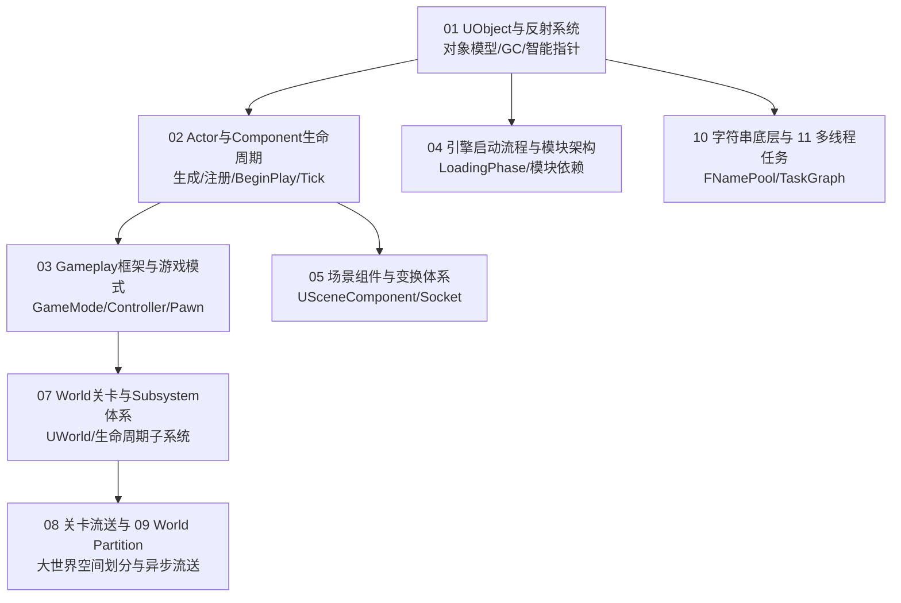

# 01 引擎基础

> 知识成熟度：L2（子域工程手册，已按 11 篇核心专题与 UE5.8 源码基线全面标准化）。
>
> 领域权威导航：[游戏知识 Domain MOC](../../00_Index/domains/游戏知识.md) ｜ [游戏知识总目录](../README.md)。

---

## 1. 核心定位与设计思想

「01-引擎基础」是虚幻引擎（UE5）知识体系的第一基石。它不涉及具体游戏玩法，而是聚焦于引擎运转的最核心底层机制。虚幻引擎之所以能承载 AAA 级大型游戏项目，核心在于其构建了一套完备的对象运行时系统：
- **元数据与反射系统**：通过 UnrealHeaderTool（UHT）在编译期解析宏标记，生成运行时类型信息（UClass/UProperty/UFunction），支撑序列化、网络复制、垃圾回收与蓝图可视化脚本；
- **确定性生命周期与层次模型**：以 `UObject` 为原子，扩展出可挂接组件的 `AActor`、可放置的 `UActorComponent`，并通过 `UWorld`、`ULevel` 与流送子系统实现大世界动态管理；
- **分层解耦的 Gameplay 框架**：严格区分规则管理者（AGameModeBase）、世界全局状态（AGameStateBase）、玩家输入持有者（APlayerController）与具象化身（APawn/ACharacter）；
- **模块化与多线程任务流**：通过 UBT 模块加载阶段（LoadingPhase）管理依赖生命周期，以 TaskGraph 和并发原语压榨现代多核 CPU 算力。

理解这套基础地基，是解释后续网络同步丢包预测、动画姿态混合、GAS 技能属性计算及渲染管线调度的共同前提。

---

## 2. 专题矩阵与知识状态

| 专题文件（Canonical 路径） | 知识类型 | 成熟度 | 核心工程关注点与落地场景 |
| :--- | :---: | :---: | :--- |
| [01-UObject与反射系统.md](01-UObject与反射系统.md) | Concept | L2 | UObject 内存对象头、UHT 代码生成原理、Mark-Sweep 垃圾回收机制、CDO 类默认对象与智能指针选型 |
| [02-Actor与Component生命周期.md](02-Actor与Component生命周期.md) | Concept | L2 | Actor 生成注册、BeginPlay 延迟触发条件、Component 挂接与变换更新、Tick 组依赖与优雅销毁流程 |
| [03-Gameplay框架与游戏模式.md](03-Gameplay框架与游戏模式.md) | Concept | L2 | GameMode/GameState/PlayerController/PlayerState 职责边界、玩家登录握手、Possess 流程与状态机 |
| [04-引擎启动流程与模块架构.md](04-引擎启动流程与模块架构.md) | Concept | L2 | 引擎 PreInit→Init→LoadMap 完整启动时序、LoadingPhase 加载阶段、模块接口与自定义插件工程实践 |
| [05-场景组件与变换体系.md](05-场景组件与变换体系.md) | Concept | L2 | USceneComponent 层次变换树、AttachToComponent 规则、Socket 骨骼挂点、脏变换更新与批量计算 |
| [06-定时器与引擎Ticker.md](06-定时器与引擎Ticker.md) | Concept | L2 | FTimerManager 最小堆管理、循环与单次定时器、时间膨胀（TimeDilation）影响与 FTSTicker 跨帧调度 |
| [07-World关卡与Subsystem体系.md](07-World关卡与Subsystem体系.md) | Concept | L2 | UWorld 运行时组成、Engine/Editor/GameInstance/World/LocalPlayer 五大生命周期 Subsystem 架构设计 |
| [08-关卡流送LevelStreaming.md](08-关卡流送LevelStreaming.md) | Concept | L2 | 传统 LevelStreaming 方案、Persistent 关卡与子关卡、流送体积（StreamingVolume）、异步加载与卸载 |
| [09-WorldPartition大世界.md](09-WorldPartition大世界.md) | Concept | L2 | UE5 World Partition 空间网格划分、ActorDesc 分离存储、DataLayer 数据分层、HLOD 与运行时流送源 |
| [10-FName与FString底层.md](10-FName与FString底层.md) | Concept | L2 | FName 全局名表哈希池（FNamePool）、FString 动态堆内存连续分配、FText 本地化管道与高效选型 |
| [11-多线程与任务系统.md](11-多线程与任务系统.md) | Mechanism | L2 | FRunnable/FThread 线程生命周期、TaskGraph 任务依赖图调度、ParallelFor 并行遍历与 UObject 线程安全边界 |

---

## 3. 逻辑学习顺序建议

1. **第一阶段（对象与生命周期地基）**：精读 `01-UObject与反射系统` 与 `02-Actor与Component生命周期`，彻底搞清为什么属性必须加 `UPROPERTY`、垃圾回收的根集合（Root Set）如何追踪，以及 Actor 产生和销毁的确定性时序。
2. **第二阶段（游戏玩法框架与组件）**：学习 `03-Gameplay框架与游戏模式` 与 `05-场景组件与变换体系`，建立网络联机下的角色职责边界意识（谁在权威端、谁复制到客户端）。
3. **第三阶段（世界管理与大世界流送）**：研读 `07-World关卡与Subsystem体系`、`08-关卡流送` 与 `09-WorldPartition大世界`，掌握开放世界地图分块、DataLayer 动态加载与模块化子系统设计。
4. **第四阶段（性能底层与并发架构）**：深入 `10-FName与FString底层` 与 `11-多线程与任务系统`，掌握高频字符串比较优化与 TaskGraph 异步多核并行任务派发。

---

## 4. 游戏与引擎工程落地场景

- **内存泄漏与野指针排查**：理解 `TWeakObjectPtr` 相比裸指针的安全性、`AddToRoot` 与 GC 标记阶段的开销，避免因未加 `UPROPERTY` 导致的偶发性非法地址崩溃；
- **开放世界海量资产流送**：基于 World Partition 网格大小（Grid Size）与加载范围（Loading Range）精细划分，配合 DataLayer 控制不同玩法阶段的资源动态呈现，将大世界显存与内存维持在预算内；
- **主线程卡顿平滑**：利用 `FTSTicker` 与 `TaskGraph` 将重度计算（如复杂视线检测、矩阵变换、数据解包）移入后台工作线程（AnyBackgroundThreadNormalTask），确保 GameThread 稳定在 16.6ms（60FPS）以内。

---

## 5. 跨域技术依赖与前后置导航

- **向下扎根（计算机底座）**：
  - C++ 对象布局与虚函数：[00-02 C++对象模型与内存](../../00-计算机与工程基础/02-C++对象模型与内存/README.md)
  - 线程同步与无锁队列：[00-04 C++并发与内存模型](../../00-计算机与工程基础/04-C++并发与内存模型/README.md)
- **向上驱动（引擎源码剖析）**：
  - 反射与 GC 源码：[12-01 UPROPERTY反射源码](../12-引擎源码分析/01-UPROPERTY与反射系统源码.md) ｜ [12-02 UObject与GC源码](../12-引擎源码分析/02-UObject与垃圾回收源码.md)
  - 大世界流送源码：[12-22 WorldPartition源码](../12-引擎源码分析/22-WorldPartition与WorldStreaming源码.md)
- **横向协同（玩法与网络）**：
  - 玩法能力扩展：[03-游戏玩法编程](../03-游戏玩法编程/README.md)
  - 多人复制机制：[06-网络同步](../06-网络同步/README.md)
