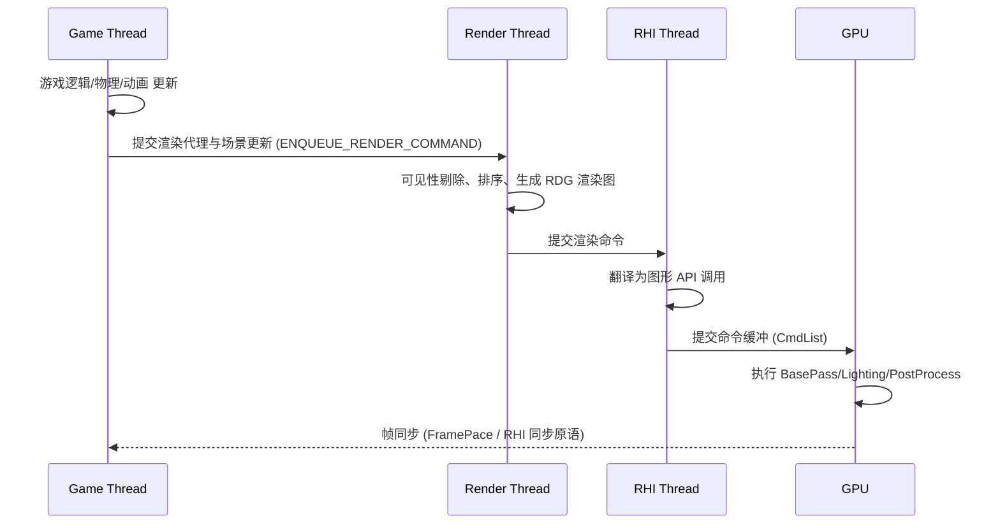
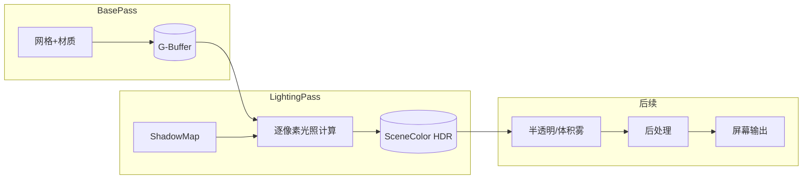
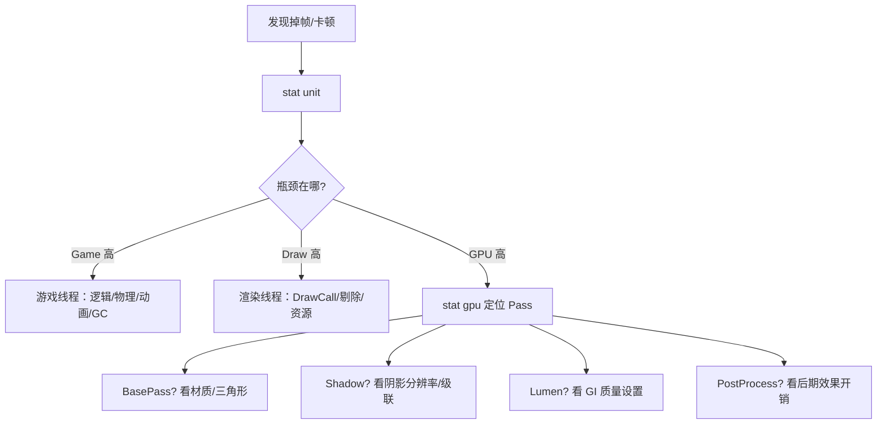

# 01 UE5 渲染管线概览

## 1. 概述

渲染管线（Rendering Pipeline）描述的是"一帧画面从游戏逻辑到屏幕像素"的完整处理流程。UE5 的渲染管线由**游戏线程（Game Thread）**发起，经**渲染线程（Render Thread）**组织，再经 **RHI 线程**提交给 **GPU** 执行，最终输出到屏幕。

UE5 默认采用**延迟着色（Deferred Shading）**为主路径，同时保留**前向着色（Forward Shading）**与**移动端前向/延迟**路径，以适应不同平台与项目需求。UE5 还在经典管线之上叠加了 Nanite（虚拟化几何体）、Lumen（动态全局光照）、Virtual Shadow Map（虚拟阴影贴图）等新一代技术，但它们本质上仍然工作在"BasePass → Lighting → 后处理"这个大的框架内。

阅读本文后，你应该能够：

- 说清楚一帧画面经过哪些主要 Pass，以及各自的作用；
- 区分延迟着色与前向着色的原理与适用场景；
- 理解 Game / Render / RHI 三线程与 GPU 之间的协作与时序；
- 熟练使用 `stat gpu`、`stat unit`、`profilegpu`、`FreezeRendering` 等工具定位渲染瓶颈；
- 知道常用 `r.` 控制台变量分别控制管线的哪一环。

## 2. 核心概念

### 2.1 三种渲染路径对比

| 对比项 | 延迟着色 Deferred | 前向着色 Forward | Forward+（聚类前向） |
| --- | --- | --- | --- |
| 核心思路 | 先写入 G-Buffer，再统一做光照 | 每个物体逐像素直接计算光照 | 前向基础上按屏幕分块聚类光源，减少重复光照 |
| 光源数量 | 几乎不受限（开销与光源数弱相关） | 每物体受限，多光源需多 Pass | 支持大量光源，开销近似延迟 |
| 抗锯齿 | TAA / FXAA（MSAA 困难） | 原生支持 MSAA | 支持 MSAA |
| 半透明物体 | 不在 G-Buffer 中，需单独处理 | 天然支持（逐像素光照） | 支持 |
| 带宽与内存 | 高（读写多张 GBuffer） | 低 | 中 |
| UE 中的开关 | 默认路径 | `r.ForwardShading 1` | 前向路径内部自动启用聚类剔除 |
| 典型用途 | 主机 / PC 高画质 | 要求 MSAA 或低带宽场景 | 移动端 Forward 的增强形态 |

### 2.2 渲染管线主要阶段

| 阶段 | 职责 | 主要输入 → 输出 | 相关命令 / 调试 |
| --- | --- | --- | --- |
| 场景更新（PrePass） | 同步场景变化、剔除 | 场景数据 → 可见图元列表 | `stat initviews` |
| 遮挡 / 视锥剔除 | 过滤不可见图元 | 包围体 → 可见集合 | `r.AllowOcclusionQueries` |
| 深度预通道（Early-Z） | 提前写深度，减少无效像素着色 | 深度缓冲 | `r.EarlyZPass` |
| BasePass | 输出 G-Buffer（几何 + 材质属性） | 网格 → GBufferA/B/C/D/E | `vis GBufferA` |
| 光照 Pass | 计算直接光照与阴影 | G-Buffer + 光源 + ShadowMap → 光照结果 | `show Lighting` |
| 间接光照 | Lumen / 烘焙光照贡献 | Lumen Scene / Lightmap → 间接光 | `r.DynamicGlobalIlluminationMethod` |
| 半透明 Pass | 渲染半透明物体 | 排序后的半透明图元 → SceneColor | `show Translucency` |
| 后处理 Pass | 曝光、Bloom、色调映射、AA 等 | SceneColor(HDR) → 输出(LDR) | `show PostProcessing` |

### 2.3 线程模型

| 线程 | 角色 | 关键产物 |
| --- | --- | --- |
| Game Thread（游戏线程） | 运行游戏逻辑、物理、动画；把要渲染的东西"申报"给渲染线程 | 渲染代理（Proxy）、场景更新命令 |
| Render Thread（渲染线程） | 组织渲染命令：剔除、排序、生成 Draw Call 与 Pass 顺序 | 渲染命令列表（RDG 图） |
| RHI Thread（RHI 线程） | 把渲染线程的命令翻译成具体图形 API 调用（D3D12/Vulkan/OpenGL） | RHI 命令缓冲 |
| GPU | 真正执行绘制、着色、光栅化 | 帧缓冲 / 屏幕输出 |

## 3. 原理详解

### 3.1 一帧的旅程：从 Game Thread 到 GPU

UE5 中"渲染一帧"并不是单线程顺序完成的，而是**流水线化**的：游戏线程推进到第 N+1 帧时，渲染线程可能正在处理第 N 帧，GPU 正在执行第 N-1 帧。三者通过命令缓冲与帧同步机制解耦，最大程度利用多核 CPU 与 GPU。



关键点：

- 游戏线程通过 `FPrimitiveSceneProxy`（图元场景代理）把"要画什么"交给渲染线程，之后游戏线程不再直接接触渲染数据；
- 渲染线程基于场景代理构建渲染命令；UE5 的 RDG（Render Dependency Graph）把这些命令组织成一张有依赖关系的图，自动做资源生命周期管理与 Pass 合并；
- `r.OneFrameThreadLag 1`（默认开启）允许渲染线程领先游戏线程一帧，换取更高吞吐；调试时若发现"输入延迟感异常"，可临时关闭对比。

### 3.2 可见性与剔除

一帧画面中往往有数万乃至数百万个图元，但屏幕上可见的只是少数。UE 在渲染线程执行多级剔除：

1. **视锥剔除（Frustum Culling）**：用包围盒/包围球与相机视锥体求交，剔除完全在视锥外的物体；
2. **距离剔除**：按 `MinDrawDistance` / `MaxDrawDistance` 与 `Cull Distance Volume` 剔除过远/过近物体；
3. **遮挡剔除（Occlusion Culling）**：用上一帧的 GPU 深度做硬件遮挡查询（Hardware Occlusion Query），剔除被完全遮挡的物体；`r.AllowOcclusionQueries 0/1` 控制开关；
4. **预计算可见性（Precomputed Visibility）**：关卡构建时预计算的可见性单元格，适合静态场景；
5. **Nanite 场景剔除**：Nanite 在 GPU 端用场景 BVH（包围体层级结构）做细粒度剔除与 LOD 选择（详见 04 篇）。

### 3.3 几何处理与 Draw Call

剔除之后，渲染线程把可见图元组织为 **FMeshDrawCommand**（网格绘制命令），并做排序：

- 不透明物体按材质 / 状态排序，减少渲染状态切换（State Change）；
- 半透明物体按**从远到近**排序（背面到正面），保证混合正确；
- 每个 MeshDrawCommand 最终对应 GPU 上的一次 DrawCall。

UE5 中 Draw Call 数量不是唯一瓶颈：`stat sceneRendering` 会同时报告 Draw Call、三角形数量与可见图元数量；配合 Nanite 后，三角形数量上限被大幅放宽，瓶颈更多转移到光栅化与着色开销上。

### 3.4 BasePass 与 G-Buffer（延迟着色核心）

延迟着色的核心思想是"**先存起来，再统一算光**"：

1. **BasePass**：把所有不透明物体的几何与材质属性写入多张 RenderTarget，统称 **G-Buffer**；
2. **Lighting Pass**：对屏幕上的每个像素，从 G-Buffer 读出法线、颜色、粗糙度等信息，再逐个光源计算光照；
3. 光照结果累加进 SceneColor（HDR 场景颜色缓冲），供半透明与后处理使用。



UE5 的 G-Buffer 大致布局如下（具体格式随平台与设置变化）：

| 缓冲 | 内容 |
| --- | --- |
| GBufferA | 世界法线（World Normal）+ 每物体数据 |
| GBufferB | 金属度（Metallic）、高光（Specular）、粗糙度（Roughness）、着色模型 ID |
| GBufferC | 基色（BaseColor）+ 环境光遮蔽（AO/间接辐照度） |
| GBufferD | 着色模型自定义数据（如次表面颜色、清漆强度等） |
| GBufferE | 预计算阴影因子（Precomputed Shadow Factors） |
| Velocity Buffer | 屏幕空间运动矢量（用于 TAA、运动模糊、TSR） |

延迟着色的优缺点：

- 优点：光照复杂度与场景图元数量解耦，支持大量动态光源；便于实现 SSAO、SSR 等屏幕空间效果；材质属性与光照计算分离，迭代灵活；
- 缺点：G-Buffer 读写带宽大（对移动端不友好）；难以原生支持 MSAA；半透明物体无法写入 G-Buffer，需要单独的前向式光照处理；对带宽敏感平台需压缩 G-Buffer（如移动端低精度格式）。

### 3.5 光照与阴影 Pass

光照计算在延迟路径中分为多个 Pass：

- **直接光照**：平行光、点光、聚光、矩形光分别生成光源网格/全屏 Pass，逐像素叠加；
- **阴影**：光源先渲染 ShadowMap（深度图），光照 Pass 中做深度比较；UE5 默认使用 Virtual Shadow Map（详见 03 篇）；
- **间接光照**：UE5 默认由 Lumen 提供动态 GI（Screen Probes + Radiance Cache + Surface Cache，详见 04 篇）；烘焙方案则由 Lightmap / Volumetric Lightmap 提供；
- **环境光**：SkyLight（天空光）提供来自天空/环境的低频光照。

### 3.6 前向渲染路径与 Forward+

前向着色在**同一个 Pass 内**完成几何与光照计算：渲染每个物体时，直接对影响它的光源做光照。其优势在于：

- 支持 MSAA（硬件抗锯齿），适合锯齿敏感的描边类渲染；
- 支持逐物体/逐像素的定制光照（如某些卡通渲染）；
- 带宽需求低，移动端友好。

代价是光源数量受限：每多一个光源，物体就可能需要多一个 Pass（多 Pass 前向），或在一个 Pass 内循环计算（开销随光源数线性增长）。UE 的前向路径（`r.ForwardShading 1`）内部会启用**聚类/分块剔除（Forward+）**：把屏幕分成小块（Tile），为每个 Tile 维护影响它的光源列表，从而在保留前向优势的同时支持大量光源。

### 3.7 移动端渲染路径

UE5 移动端（Feature Level ES3.1）默认走 **Mobile Forward** 路径：

- `r.Mobile.ShadingPath 0`：Mobile Forward（默认），带宽友好，支持 MSAA；
- `r.Mobile.ShadingPath 1`：Mobile Deferred（实验性），提供延迟着色的光照能力，但 G-Buffer 使用低精度格式。

移动端路径的主要限制：

- 不支持 Nanite、Lumen、Virtual Shadow Map（UE5 移动端默认关闭这些特性）；
- 动态光源数量与阴影质量受硬件限制（建议少量动态光 + 静态烘焙）；
- 材质使用简化着色（半精度、简化高光），部分节点不可用（详见 02 篇 Mobile 材质章节）。

### 3.8 半透明、天空、雾与后处理

- **半透明（Translucency）**：在延迟光照之后、后处理之前渲染；需要从远到近排序；不写入 G-Buffer，光照用简化方式（逐像素或体积光照）；
- **天空与大气**：SkyAtmosphere（大气散射）、VolumetricCloud（体积云）在场景 Pass 中渲染，参与 Lumen 的天空贡献；
- **雾**：指数高度雾（ExponentialHeightFog）+ 体积雾（Volumetric Fog）在光照后、后处理前合成；
- **后处理**：对最终 HDR 场景颜色做一系列全屏效果（AA、Bloom、色调映射、DOF 等），详见 05 篇。

### 3.9 渲染管线性能分析

定位渲染瓶颈的标准姿势：

1. 控制台执行 `stat unit`：看 Game / Draw / GPU 三行耗时，先判断瓶颈在 CPU 还是 GPU；
2. `stat gpu`（必要时先 `r.GPUStatsEnabled 1`）：列出 GPU 各 Pass 的毫秒耗时（BasePass、ShadowDepths、Lumen、PostProcess 等），直接定位最贵的 Pass；
3. `profilegpu`：录制一段 GPU 时间线（配合 Unreal Insights 的 GPU 通道查看）；
4. `stat sceneRendering`：观察 DrawCall / 三角形 / 光源数量等 CPU 侧指标；
5. `FreezeRendering`：冻结渲染场景，用于"画面卡在某状态"时的静态排查。



## 4. 代码 / 蓝图示例：控制台命令与配置

### 4.1 常用控制台命令速查

以下命令可在编辑器控制台（`~` 键）或打包游戏的控制台中执行：

```ini
; ---- 渲染路径 ----
r.ForwardShading 0        ; 0=延迟着色（默认），1=前向着色
r.Mobile.ShadingPath 0    ; 移动端：0=Forward，1=Deferred（实验性）
r.AntiAliasingMethod 2    ; 0=None 1=FXAA 2=TAA 3=MSAA 4=TSR
r.ScreenPercentage 100    ; 渲染分辨率百分比（配合 TAA/TSR 上采样）
r.DynamicRes.OperationMode 0 ; 0=关闭 1=基于 GPU 时间自适应 2=基于帧率

; ---- 线程与调试 ----
r.OneFrameThreadLag 1     ; 渲染线程领先游戏线程一帧（默认 1）
r.RHIThread.Enable 1      ; 启用 RHI 线程
r.AllowOcclusionQueries 1 ; 硬件遮挡查询开关
FreezeRendering           ; 冻结渲染（再次输入解除）

; ---- 统计 ----
stat unit                 ; 三线程帧耗时
stat gpu                  ; GPU 各 Pass 耗时
stat sceneRendering       ; DrawCall/三角形/可见性统计
stat rhi                  ; RHI 资源与状态统计
stat streaming            ; 纹理/网格流送状态
profilegpu                ; 录制 GPU 时间线

; ---- 可视化调试 ----
show PostProcessing       ; 开关后处理
show Lighting             ; 开关光照
show Fog                  ; 开关雾
show Translucency         ; 开关半透明
vis SceneColor            ; 查看最终场景颜色缓冲
vis GBufferA              ; 查看 G-BufferA（世界法线）
```

### 4.2 项目配置示例（DefaultEngine.ini）

```ini
[/Script/Engine.RendererSettings]
r.ForwardShading=False
DefaultFeatureAutoExposure=True
DefaultFeatureMotionBlur=True

[/Script/Engine.Engine]
; 打包时剔除不需要的着色器变体可显著减少包体与编译时间
; （此处仅为示意，实际通过项目设置中的 Shader 相关选项配置）
```

### 4.3 蓝图中的实践

蓝图本身不直接操作渲染管线，但常用做法包括：

- 用 **Post Process Volume** 的组件属性（在关卡中放置）调节最终画面（详见 05 篇）；
- 用 `Get World` → `Exec Console Command` 节点在蓝图中动态执行渲染控制台命令（如低画质模式切换）：

```
执行顺序：玩家设置界面 → 调用 Exec Console Command
命令示例："r.ScreenPercentage 50"（性能模式降分辨率）
命令示例："r.Lumen.DiffuseIndirect.Allow 0"（关闭 Lumen 间接光）
```

## 5. 最佳实践

1. **先定位再优化**：任何渲染优化都从 `stat unit` + `stat gpu` 开始，不要在没数据的情况下凭感觉调参。
2. **保持默认链路，按需降级**：UE5 默认（Nanite + Lumen + VSM）在主机/PC 上是经过优化的组合；盲目关掉再叠加烘焙方案可能得不偿失。
3. **关注带宽**：延迟着色的 G-Buffer 带宽是硬成本，移动端务必走 Mobile Forward 或低精度 G-Buffer。
4. **管理 Draw Call 预算**：桌面端目标通常在 2000~5000 DrawCall（视平台），移动端 200~500 左右；用 `stat sceneRendering` 持续监控。
5. **尽早建立性能基准**：使用 Unreal Insights 与自动化性能测试（如 Pixel Streaming 对比或专用测试关卡），把"渲染耗时回归"纳入日常 CI。
6. **调试视图是好朋友**：`vis GBuffer*`、`show` 系列、Nanite 可视化、Lumen 可视化（编辑器视口）能快速确认"哪个阶段出了问题"。
7. **版本差异留档**：命令名与默认值随引擎版本变化，团队内维护一份"本版本验证过的命令清单"。

## 6. 常见问题 FAQ

### Q1：`stat gpu` 没有输出或全为 0？

可能是 GPU 统计未开启。先执行 `r.GPUStatsEnabled 1` 再执行 `stat gpu`；部分平台（如某些移动设备）不支持 GPU 计时，此时依赖 `stat unit` 的 GPU 行与平台 Profile 工具。

### Q2：`r.ForwardShading 1` 后画面变暗或某些效果消失？

前向路径下，延迟专用效果（如部分 G-Buffer 调试、某些反射方案）不可用；同时光源数量受限。检查是否误开了移动端设置，或项目设置中 ForwardShading 与材质/光照特性冲突。

### Q3：为什么渲染线程（Draw）高，但 GPU 不高？

典型原因是 Draw Call 过多、状态切换频繁、或者 CPU 侧剔除/资源加载阻塞。用 `stat sceneRendering` 看 DrawCall 数量，用 Unreal Insights 看渲染线程命令耗时分布。

### Q4：GPU 高但 `stat gpu` 里看不出哪个 Pass 贵？

把 `stat gpu` 输出与 `profilegpu`（Unreal Insights GPU 时间线）结合看；也可以逐步用 `show PostProcessing` 关闭后期、用 `r.Shadow.Virtual.Enable 0` 关闭虚拟阴影等，用"二分法"缩小范围。

### Q5：半透明物体排序错乱？

半透明按深度排序天然不稳定（互相穿插时无正确顺序）。常见缓解：把半透明物体拆小、使用 `Translucency Sort Priority`、限制半透明物体重叠数量、或改用带深度的半透明方案（如 Separate Translucency + DOF 需求）。

### Q6：延迟着色下 MSAA 不可用？

对，G-Buffer 使 MSAA 成本极高且实现复杂。需要 MSAA 时改用前向路径；否则用 TAA/TSR 达到类似甚至更好的抗锯齿效果（配合 `r.ScreenPercentage` 超采样）。

## 7. 关联阅读

- 本分类 [02-材质系统详解.md](./02-材质系统详解.md)：BasePass 写入的 G-Buffer 内容由材质决定；
- 本分类 [03-光照与阴影系统.md](./03-光照与阴影系统.md)：Lighting Pass 与阴影产物的细节；
- 本分类 [04-Nanite与Lumen.md](./04-Nanite与Lumen.md)：Nanite 如何改变 BasePass 几何流程、Lumen 如何改变间接光照 Pass；
- 本分类 [05-后处理与画面特效.md](./05-后处理与画面特效.md)：管线末端的完整后处理链；
- 分类外："01-引擎基础"（线程模型、模块结构）与"03-性能优化"（性能分析方法论）可作前后置阅读；
- 官方文档：Unreal Engine 5 "Rendering Overview"、"Rendering Thread" 与 "Render Dependency Graph" 章节。

## 8. 附录：渲染调试工作流

### 8.1 常用渲染调试视图

| 视图/命令 | 查看内容 | 典型用途 |
| --- | --- | --- |
| `vis SceneColor` | 最终场景颜色（后处理前 HDR） | 确认光照/材质是否正常 |
| `vis GBufferA` | 世界法线 | 检查法线方向与质量 |
| `vis GBufferB` | 金属度/粗糙度/着色模型 | 检查 PBR 参数 |
| `vis GBufferC` | BaseColor + AO | 检查基色与遮蔽 |
| `vis SceneDepth` | 深度缓冲 | 检查深度/DOF 对焦 |
| `vis Velocity` | 运动矢量 | 排查 TAA/运动模糊异常 |
| `show PostProcessing` | 后处理开关 | 区分后处理与场景问题 |
| `show Lighting` | 直接光照开关 | 区分光照与材质问题 |
| `show Fog` | 雾开关 | 排查雾相关观感 |
| `show Translucency` | 半透明开关 | 排查半透明渲染 |
| 编辑器视口 "Lit" 系列 | 光照/无光照/线框等 | 美术与渲染联查 |
| 编辑器视口 "Nanite" 系列 | Nanite 三角形/过绘制 | 排查 Nanite 几何问题 |

### 8.2 stat unit 输出解读

控制台执行 `stat unit` 后，顶部会显示类似：

```text
Frame: 16.67 ms   Game: 8.2 ms   Draw: 6.4 ms   GPU: 12.5 ms
```

解读规则：

| 指标 | 含义 | 若异常 |
| --- | --- | --- |
| Frame | 整帧耗时（目标 60fps≈16.7ms，120fps≈8.3ms） | 帧率不达标 |
| Game | 游戏线程耗时（逻辑/物理/动画/GC） | 优化游戏逻辑 |
| Draw | 渲染线程耗时（剔除/排序/命令生成） | 优化 DrawCall/资源 |
| GPU | GPU 总耗时（所有 Pass） | 用 stat gpu 下钻 |

判断口诀：**哪个线程最接近 Frame 时间，瓶颈就在哪**；若 Game 与 Draw 都低而 GPU 高，则为 GPU 瓶颈；反之 CPU 瓶颈。

### 8.3 r. 命令分类速查（本分类各篇通用）

| 分类 | 代表命令 | 详见 |
| --- | --- | --- |
| 渲染路径 | r.ForwardShading、r.Mobile.ShadingPath | 本篇 4.1 |
| 抗锯齿/分辨率 | r.AntiAliasingMethod、r.ScreenPercentage、r.DynamicRes.* | 05 篇 3.8 |
| 阴影 | r.Shadow.*、r.ContactShadows、r.Shadow.Virtual.* | 03 篇 3.4 |
| GI/反射 | r.DynamicGlobalIlluminationMethod、r.ReflectionMethod、r.Lumen.* | 04 篇 3.7 |
| Nanite | r.Nanite.*、stat nanite | 04 篇 3.4 |
| 后处理 | r.BloomQuality、r.DepthOfField.Method、r.MotionBlur.* | 05 篇 4.1 |
| 统计 | stat unit / stat gpu / stat sceneRendering / stat rhi | 本篇 3.9 |

### 8.4 着色器编译与加载

- 材质/渲染特性对应的着色器由 **ShaderCompileWorker（SCW）** 进程池并行编译；首次加载/打包时编译，之后走缓存；
- 运行时遇到未编译的着色器会触发**编译阻塞（Shader Compilation Hitch）**，表现为卡顿；用预缓存（PGO/ShaderPipelineCache）缓解；
- `r.ShaderCompiler.NumWorkers` 可调整编译进程数（编辑器内加速）；
- 打包时通过"Shader 变体裁剪"（剔除未使用材质/特性组合）显著减少包体与加载时间；
- 排查"粉红材质"时，优先看 Output Log 中该材质的着色器编译错误信息。

### 8.5 渲染问题排查清单

- [ ] `stat unit` 确认瓶颈线程；
- [ ] `stat gpu` 定位最贵 Pass；
- [ ] `show PostProcessing` 排除后处理；
- [ ] `show Lighting` / `show Fog` 排除光照与雾；
- [ ] `vis` 系列检查 G-Buffer 各层；
- [ ] 关闭 Nanite/Lumen/VSM 对比默认链路（r.Nanite 0、r.Lumen.DiffuseIndirect.Allow 0、r.Shadow.Virtual.Enable 0）；
- [ ] 检查缩放质量（Scalability）档位与项目设置中的渲染选项；
- [ ] 查看 Output Log 中渲染相关警告（着色器编译失败、资源流送异常）。

### 8.6 渲染管线关键术语表

| 术语 | 含义 |
| --- | --- |
| Pass | 一帧渲染中的子步骤（BasePass、ShadowPass、PostProcess 等） |
| Draw Call | 一次 GPU 绘制调用（一个网格 + 一种材质状态） |
| MeshDrawCommand | UE 渲染线程生成的绘制命令单元 |
| RDG（Render Dependency Graph） | UE5 渲染命令依赖图，管理资源生命周期与 Pass 合并 |
| Scene Proxy | 游戏线程对象在渲染线程的镜像代理 |
| G-Buffer | 延迟着色的几何/材质属性缓冲集合 |
| RenderTarget | GPU 离屏渲染目标（纹理） |
| HDR / LDR | 高动态范围 / 低动态范围 |
| Shader | 着色器（顶点/像素/计算等阶段程序） |
| Feature Level | 特性等级（如 ES3.1 移动端、SM5/SM6 桌面） |
| Scalability | 可伸缩性配置（画质档位，影响渲染选项与 r. 命令） |
| Temporal 效果 | 依赖历史帧的效果（TAA、TSR、Lumen 去噪） |
| 带宽 | GPU 显存读写吞吐，延迟着色主要成本之一 |
| Overdraw | 同一像素被多次着色（半透明/多层植被） |

### 8.7 常见瓶颈速查

| 现象 | 常见瓶颈 | 第一步 |
| --- | --- | --- |
| 帧率低但画面简单 | GPU 带宽/分辨率 | 降 ScreenPercentage 验证 |
| 物体多时卡 | Draw Call / 渲染线程 | stat sceneRendering 看 DrawCall |
| 植被/半透明多时卡 | Overdraw | 关 Translucency/植被对比 |
| 阴影区域卡 | ShadowDepths | r.Shadow.Virtual.Enable 0 对比 |
| 大场景卡 | 剔除/流送 | stat streaming / stat initviews |
| 光照复杂时卡 | Lighting / Lumen | r.Lumen.DiffuseIndirect.Allow 0 对比 |
| 镜头转动卡 | 后处理/全屏效果 | show PostProcessing 对比 |

### 8.8 术语速记口诀

```text
一帧三步走：几何（BasePass）→ 光照（Lighting）→ 后期（Post）
三线程接力：Game 申报 → Render 排单 → RHI/GPU 执行
延迟看缓冲（G-Buffer），前向看光源（逐像素）
性能定位：unit 分线程，gpu 看 Pass，sceneRendering 看数量
```
