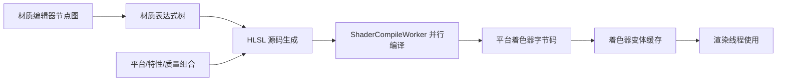
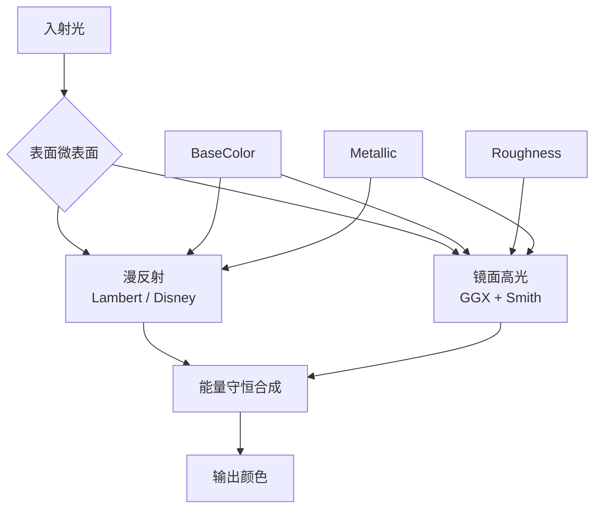
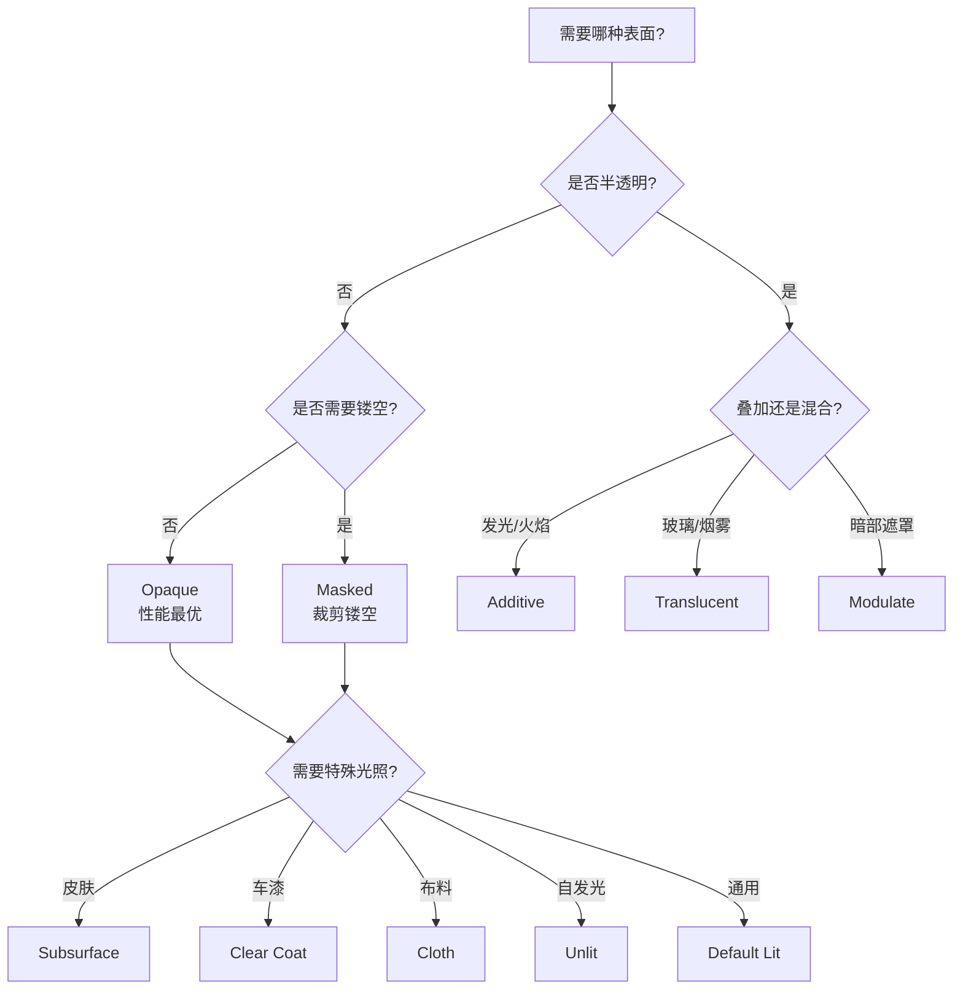

# 02 UE5 材质系统详解

## 1. 概述

材质（Material）定义了物体表面"看起来是什么样"：颜色、粗糙度、金属度、发光、半透明、法线细节等。UE 的材质系统是**节点图（Node Graph）驱动的**——美术在材质编辑器里连线，引擎把节点图编译成 GPU 上执行的着色器（Shader）代码。

UE5 的材质系统建立在 **PBR（Physically Based Rendering，基于物理的渲染）** 之上：用少量物理参数（BaseColor、Roughness、Metallic、Normal）即可描述绝大多数真实表面，且在不同光照环境下表现一致。理解材质系统，是理解"画面质量"与"渲染性能"之间权衡的关键——因为每个材质节点最终都变成 GPU 指令，材质越复杂，BasePass 越贵。

阅读本文后，你应该能够：

- 理解材质编辑器节点图与最终着色器之间的关系；
- 掌握 PBR 的核心概念（能量守恒、金属/粗糙度工作流）；
- 区分 6 种材质域（Material Domain）与常见着色模型（Shading Model）；
- 知道 Mobile（移动端）材质有哪些限制与优化手段；
- 学会用材质指令数统计评估材质性能；
- 能按"连线思路"搭建常见材质（地面、草地摆动、溶解等）。

## 2. 核心概念

### 2.1 材质域（Material Domain）

| 材质域 | 用途 | 说明 |
| --- | --- | --- |
| Surface（表面） | 常规物体表面 | 最常用，输出到 G-Buffer 或前向光照 |
| Deferred Decal（延迟贴花） | 贴花投影到表面 | 不参与光照，直接修改 G-Buffer 属性 |
| Light Function（光照函数） | 修改光源的光照结果 | 常用于灯光动画、遮蔽图案 |
| Volume（体积） | 体积效果（如 Fog Volume） | 与体积雾/体积材质配合 |
| Post Process（后处理） | 全屏后期效果 | 读取 SceneColor/深度等做自定义后期（详见 05 篇） |
| User Interface（UI） | UI 材质 | 用于 UMG 控件渲染 |

### 2.2 混合模式（Blend Mode）

| 混合模式 | 用途 | 说明 |
| --- | --- | --- |
| Opaque（不透明） | 大多数实体表面 | 不混合，写入深度，性能最好 |
| Masked（遮罩） | 有镂空的表面（铁丝网、植被叶片） | 按 Opacity Mask 裁剪像素，仍算不透明（写入深度） |
| Translucent（半透明） | 玻璃、烟雾、水 | 按 Opacity 混合，需要排序，无深度写入（可配置） |
| Additive（相加） | 火焰、光晕、粒子 | 颜色相加，适合发光效果 |
| Modulate（调制） | 暗色遮罩效果 | 用材质颜色调制背景 |
| AlphaComposite | 带 alpha 通道的合成 | 支持 pre-multiplied alpha |
| AlphaHoldout | 抠像合成 | 用于影视合成流程 |

### 2.3 着色模型（Shading Model）

| 着色模型 | 适用表面 | 关键输入 |
| --- | --- | --- |
| Default Lit | 绝大多数物体 | BaseColor / Roughness / Metallic / Normal |
| Unlit（无光照） | 自发光、UI、特效 | 只输出 Emissive，不受光照 |
| Subsurface（次表面散射） | 皮肤、蜡烛、树叶 | SubsurfaceColor |
| Preintegrated Skin | 预积分皮肤（移动端友好） | SubsurfaceColor + 曲线 |
| Clear Coat（清漆） | 车漆、漆面 | ClearCoat / ClearCoatRoughness |
| Cloth（布料） | 织物 | FuzzColor / Cloth |
| Eye（眼睛） | 眼球 | Iris 相关参数 |
| Hair（毛发） | 头发 | 各向异性高光 |
| Thin Translucent | 薄片半透明 | 颜色随视角变化 |
| SingleLayerWater | 水面 | 水的折射/吸收参数 |
| Strand | 基于线段的毛发（UE5.1+） | 配合 Strand 几何 |

### 2.4 常用节点速查

| 节点 | 作用 |
| --- | --- |
| Texture Sample | 采样纹理（最常用） |
| Multiply / Add / Lerp | 基础数学运算 |
| Component Mask | 提取纹理通道（R/G/B/A） |
| Append | 组合向量 |
| Normal | 法线贴图采样（切线空间） |
| NormalFromHeightMap | 由高度图生成法线 |
| World Position Offset | 修改顶点位置（物体形变、摆动） |
| Pixel Depth Offset | 修改像素深度（伪位移） |
| Vertex Color | 读取顶点色（地形/植被混合） |
| Fresnel | 边缘光计算（视角相关） |
| Noise / Voronoi | 程序化噪声 |
| Distance Field Gradient | 距离场梯度（描边/溶解） |
| Quality Switch | 按质量级别切换连线 |
| Feature Level Switch | 按特性等级切换连线（高低端） |

## 3. 原理详解

### 3.1 从节点图到着色器

材质编辑器中的每个节点对应一段 HLSL 代码片段。当材质被保存或引用时，引擎会：

1. 把节点图展开为**材质表达式树**；
2. 生成对应着色器模型（SM5/SM6/ES3.1 等）的 HLSL 源码；
3. 通过 Shader Compiler（默认使用 ShaderCompileWorker 多进程并行编译）编译成平台着色器字节码；
4. 编译结果按**变体（Variant）**缓存：同一材质在不同质量级别、不同特性组合下可能编译出多个变体；
5. 运行时按需加载，供渲染线程的 MeshDrawCommand 使用。



关键含义：

- **节点越少、指令越少**：每个节点都是真实 GPU 指令，材质"好看"是有性能价格的；
- **变体爆炸**：大量材质 + 大量质量开关会显著增加编译时间与包体，需用 Shared Material Code 等机制控制；
- **材质实例不重新编译**：材质实例（Material Instance）只改参数值，复用父材质的着色器，这是"美术改参数不卡编译"的原因。

### 3.2 PBR 基础：基于物理的着色

PBR 的目标是让材质在不同光照/视角下表现一致。UE 的光照计算基于 **BRDF（双向反射分布函数）**，把表面反射拆成两部分：

- **漫反射（Diffuse）**：光线进入表面后被散射，各方向近似均匀，与视角无关；UE 默认用 Lambert / Disney 漫反射模型；
- **镜面高光（Specular）**：光线在表面直接反射，与视角强相关；UE 默认使用 **GGX（Trowbridge-Reitz）** 微表面法线分布 + Smith 遮蔽项。



UE 的 **金属/粗糙度工作流**（Metallic/Roughness Workflow）：

- **BaseColor（基色）**：非金属 = 漫反射颜色；金属 = 反射率颜色（金属没有漫反射，基色即高光颜色）；
- **Metallic（金属度）**：0 = 非金属（电介质），1 = 金属（导体）；金属表面几乎没有漫反射，高光带颜色；
- **Roughness（粗糙度）**：0 = 镜面（高光尖锐、反射清晰），1 = 粗糙（高光弥散、反射模糊）；
- **Specular（高光强度）**：非金属默认 0.5 附近（约 4% 反射率），一般保持默认；
- **Normal（法线）**：通过法线贴图在切线空间扰动表面法线，模拟微观细节而不增加三角形。

能量守恒的意义：反射出去的能量 + 吸收的能量 = 入射能量，表面不会"凭空发光"。这也是 PBR 材质在不同光照下不"过曝/发灰"的理论基础。

### 3.3 材质域详解

#### Surface（表面）材质

最常用。输出连接口包括：Base Color、Metallic、Specular、Roughness、Emissive Color、Normal、Opacity、World Position Offset、Pixel Depth Offset、Ambient Occlusion 等。不透明表面在 BasePass 写入 G-Buffer；半透明表面在 Translucent Pass 处理。

#### Deferred Decal（贴花）

贴花不参与光照计算，而是直接**改写 G-Buffer 属性**（如把弹孔、血迹覆盖到墙上）。UE5 中贴花投影到 Nanite 网格时注意：Nanite 网格默认支持贴花，但需要开启相应渲染特性（以版本为准）。

#### Light Function（光照函数）

把材质作为"光照的遮罩/调制器"：例如用动画材质让灯光产生转动的树影。它不产生独立光照，只修改光源结果。

#### Volume（体积）材质

用于体积效果，通常与体积雾、体积材质系统配合（如云、烟）。

#### Post Process（后期）材质

全屏后处理材质：可以读取 SceneColor、SceneDepth、WorldNormal 等场景纹理，实现风格化后期（描边、马赛克、色调分离等）。详见 05 篇"后期材质"章节。

### 3.4 着色模型与光照模式

着色模型决定**光照计算公式**。例如：

- **Default Lit**：标准 PBR；
- **Subsurface**：在标准光照上叠加次表面散射（光穿过半透明薄层），皮肤质感的关键；
- **Clear Coat**：在底层清漆之上再算一层高光（两层 BRDF），车漆效果；
- **Cloth**：用 Fuzz（绒毛）近似布料纤维散射；
- **Hair / Strand**：各向异性高光模拟发丝反光；
- **Unlit**：完全不受光，只输出 Emissive——自发光招牌、全息 UI 常用。

材质还有一个"双面（Two Sided）"开关：开启后背面也渲染（如单面植被叶片），代价是深度/光照处理变复杂，默认关闭。

### 3.5 Mobile（移动端）材质专题

移动端（Feature Level ES3.1）材质与桌面差异显著：

#### 移动端渲染路径对材质的影响

| 项目 | 桌面 | 移动端 |
| --- | --- | --- |
| 默认渲染路径 | 延迟着色 | Mobile Forward（可切 Deferred 实验） |
| 光照 | 多光源逐像素 | 每像素光源数受限，其余降级为逐顶点/烘焙 |
| 高光计算 | GGX 全精度 | 简化高光（移动端 Specular 模型） |
| Nanite / Lumen | 支持 | 不支持 |
| G-Buffer | 全精度多缓冲 | 低精度或无需 G-Buffer |
| MSAA | 延迟下不可用 | 前向下可用 |

#### 移动端材质限制清单

- **指令数限制**：移动 GPU（尤其 Adreno/Mali 中低端）ALU 有限，建议单材质控制在 128 条 ALU 指令以内（经验值，随平台浮动）；材质编辑器 Stats 面板可直接查看；
- **纹理采样限制**：采样器数量与纹理带宽受限，尽量少采样、用压缩格式（ASTC/ETC2）；
- **半精度**：移动端大量使用 half 精度计算，部分高精度需求（如大范围 World Position）可能精度不足；
- **不支持的节点/特性**：Tessellation（细分曲面）不支持；部分顶点动画节点开销大；Distance Field 相关节点在移动端不可用；
- **法线贴图**：移动端法线建议用 BC5/ASTC 压缩格式，避免高质量格式浪费带宽；
- **后期**：全屏后处理（Bloom、DOF）在移动端要谨慎，最好提供低画质档位关闭。

#### 移动端材质优化建议

- 用 **Quality Switch / Feature Level Switch** 节点为高低端设备提供不同连线；
- 半透明材质尽量少用，且避免大量重叠；
- 用材质实例复用着色器，减少变体；
- 树叶、草地等 Masked 材质注意 Overdraw（重复光栅化）；
- 用 `r.Mobile.ShadingPath` 与移动端 Profile 实测，不要只看桌面表现。

### 3.6 材质性能：指令数、采样与变体

材质性能 = 指令数（ALU）× 运行像素数 + 纹理采样带宽 + 变体管理成本。

- **指令数**：材质编辑器工具栏 Stats（或材质详情面板）显示编译后的指令数（Instructions）、纹理采样数等；过高的材质会在日志中警告；
- **Overdraw（过度绘制）**：半透明、Masked、多层植被叠加会让同一像素被计算多次，是移动端头号杀手；
- **变体（Variant）**：`r.MaterialQualityLevel`、Feature Level、静态开关（Static Switch）组合会生成变体；变体过多 → 编译慢、内存大、加载卡顿；
- **纹理流送（Texture Streaming）**：`stat streaming` 查看纹理内存；合理设置纹理组（Texture Group）的 LOD 与池大小（`r.Streaming.PoolSize`）。

## 4. 代码 / 蓝图示例：材质节点连线思路

以下给出常用材质的"连线思路"，可在材质编辑器中按步骤复现（均为思路描述，具体节点名以编辑器为准）。

### 4.1 示例一：PBR 地面材质（BaseColor 混合 + 法线混合 + 粗糙度）

```
1. 拖入 3 张纹理：BaseColor 图、Normal 图、Roughness 图（各配对应纹理采样节点）
2. BaseColor 通道：
   TextureSample(BaseColor) → RGB 输出 → 接 Base Color 引脚
   若需要颜色变化：Multiply(采样结果, 颜色常量)
3. 法线通道：
   TextureSample(Normal) → RGB → Normal 节点（默认切线空间）→ 接 Normal 引脚
   需要混合两套法线时：用 BlendAngleCorrectedNormals 节点（角度修正法线混合）
4. 粗糙度通道：
   TextureSample(Roughness) → R 通道（ComponentMask R）→ 接 Roughness
   若要"粗糙中带湿滑"：Lerp(0.2, 0.8, 遮罩贴图)
5. 金属度：常量 0（地面一般非金属），或由 Mask 贴图控制
6. 细节增强：
   Multiply(细节法线, 0.5) → Add(主法线, 细节) 增加近看细节
```

### 4.2 示例二：草地 / 旗帜摆动（World Position Offset）

```
1. 材质混合模式：Masked（叶片镂空）+ Two Sided
2. 采样噪声或程序化噪声（Noise 节点）作为摆动相位
3. 用 World Position Offset 引脚：
   WPO = Noise * 摆动幅度 * (1 - 高度权重)
   高度权重 = 用 Local Position 的 Y 分量归一化（根部不动、顶部摆动大）
4. 可选：用 Time 节点（如 frac(Time)）驱动相位，形成风吹动画
5. 注意：开启 WPO 后该材质无法使用烘焙光照的部分优化（WPO 物体在光照贴图中按动态处理）
```

### 4.3 示例三：溶解（Dissolve）效果

```
1. 材质混合模式：Masked
2. 采样噪声/纹理作为溶解图案，接 Opacity Mask：
   OpacityMask = Step(溶解进度, Noise)
   即：噪声值大于进度才显示，产生不规则溶解边缘
3. 边缘发光：
   Edge = SmoothStep(进度, 进度+0.1, Noise) - SmoothStep(进度+0.1, 进度+0.2, Noise)
   Emissive += Edge * 发光颜色
4. 进度由蓝图中设置的材质参数（Scalar Parameter）驱动
```

### 4.4 蓝图侧：动态修改材质参数

```cpp
// C++：动态材质实例
UMaterialInstanceDynamic* MID = MeshComp->CreateAndSetMaterialInstanceDynamic(0);
MID->SetScalarParameterValue(TEXT("DissolveProgress"), Progress);
MID->SetVectorParameterValue(TEXT("GlowColor"), FLinearColor::Red);
```

```text
// 蓝图：Set Scalar Parameter Value 节点
// 目标 = 动态材质实例（Create Dynamic Material Instance 获得）
// 参数名与材质中的 Scalar Parameter 名称一致
```

## 5. 最佳实践

1. **参数化优先**：把常用材质做成材质实例（Material Instance），参数暴露给美术，避免复制材质导致变体爆炸；
2. **PBR 参数规范化**：BaseColor 在 0~1 线性空间；金属度非 0 即 1（极少中间值）；粗糙度贴图比纯常量更真实；
3. **法线贴图统一格式与强度**：团队统一法线强度规范（如 1.0 基准），避免同一场景不同材质法线强度不一致；
4. **半透明谨慎使用**：半透明 = 排序 + 无深度写入 + 高开销；能用 Opaque/Masked 就不用 Translucent；
5. **移动端从一开始就按移动端标准写**：用 Feature Level Switch 分离高低端连线，定期在真机 Profile；
6. **监控指令数与变体**：在 CI 或日常检查中关注材质指令数告警与着色器编译时长；
7. **纹理规范**：使用纹理组（Texture Group）统一 Mip 与压缩设置，LODBias 统一管理；开启纹理流送并设置合理池大小；
8. **避免全屏 Overdraw 场景**：大片半透明水面 + 大量粒子 + 多层植被叠加是移动端性能灾难。

## 6. 常见问题 FAQ

### Q1：材质在编辑器里正常，打包后变黑 / 变粉？

粉红色通常是**着色器编译失败或缺失**（如平台不支持某节点）。检查 Output Log 的着色器编译错误、确认材质没有使用目标平台不支持的节点，并检查材质实例引用的资源是否被剥离（可先禁用"Strip Unused"类打包选项排查）。

### Q2：材质指令数超限怎么办？

优先用 Quality Switch / Feature Level Switch 降级；其次合并纹理通道（把 AO/粗糙度/金属度打包进一张纹理的 R/G/B）；再考虑拆材质或用更简单的着色模型（如从 Subsurface 降为 Default Lit）。

### Q3：半透明材质不受光照 / 排序错乱？

半透明默认使用简化光照（Translucent Lighting Mode 可选 Volumetric/Per-Vertex/Per-Pixel 等）；排序错乱见 01 篇 FAQ。若需要复杂光照，可考虑 Separate Translucency 或改用不透明方案（如用 Masked + 后期做伪半透明）。

### Q4：金属材质看起来太黑或发灰？

金属没有漫反射，光照完全来自高光；若 BaseColor 太暗或环境光不足，金属会显黑。检查 Metallic 是否误设为中间值（0~1 之间会产生不物理的混合）、环境/反射是否足够强（Lumen 反射或 Reflection Capture）。

### Q5：法线贴图方向反了 / 接缝明显？

法线贴图需要与 UV 和坐标约定匹配（UE 使用左手坐标系、法线 Z 向上）；接缝通常来自 UV 接缝或压缩格式差异。检查纹理压缩格式（移动端 ASTC 某些平台接缝更明显）与法线强度。

### Q6：同一个材质在不同质量档位下表现差异大？

这是 Feature Level / Quality Switch 正常行为。若某档位表现异常，检查该档位的连线分支是否遗漏（如 Switch 的默认输入为空导致黑色输出）。

### Q7：为什么移动端材质在桌面上看不出问题，真机上卡？

桌面 GPU 远强于移动 GPU：指令数、带宽、Overdraw 在真机上被放大。务必用 `r.Mobile.ShadingPath` 与移动端预览（Mobile Preview）检查，并在真机用平台 Profile 工具测量。

## 7. 关联阅读

- 本分类 [01-渲染管线概览.md](./01-渲染管线概览.md)：材质如何写入 G-Buffer、各 Pass 中材质的作用位置；
- 本分类 [03-光照与阴影系统.md](./03-光照与阴影系统.md)：材质与光源交互（光照模型、阴影接收）；
- 本分类 [05-后处理与画面特效.md](./05-后处理与画面特效.md)：Post Process 材质域的应用；
- 分类外："02-资源与资产规范"（若有）：纹理压缩、纹理组、资产命名规范；
- 官方文档：Unreal Engine 5 "Materials"、"Physically Based Rendering"、"Material Instancing" 章节。

## 8. 附录：材质开发工作流

### 8.1 材质节点分类参考表

| 分类 | 代表节点 | 使用要点 |
| --- | --- | --- |
| 纹理 | Texture Sample、Texture Object、Texture Coordinate | 注意 UV 通道与压缩格式 |
| 数学 | Add、Subtract、Multiply、Divide、Power、Lerp | 组合的基础，注意数值范围 |
| 向量 | Component Mask、Append、Dot、Cross、Normalize | 处理方向与通道 |
| 工具 | Constant、Constant2Vector/3Vector、Scalar/Vector Parameter | 参数化入口 |
| 函数 | Fresnel、Clamp、Saturate、SmoothStep、Step | 制作边缘光/过渡 |
| 材质属性 | World Position、Object Position、Local Position、Vertex Color | 空间信息与顶点数据 |
| 扰动 | Noise、Voronoi、NormalFromHeightMap | 程序化细节 |
| 分支 | Quality Switch、Feature Level Switch、Static Switch Parameter | 平台/质量分流 |
| 特殊 | SceneTexture、Distance Field Gradient、Custom | 场景数据与自定义代码 |

### 8.2 着色模型输入引脚速查

| 着色模型 | 额外输入 | 典型场景 |
| --- | --- | --- |
| Default Lit | （无） | 通用 |
| Unlit | 仅 Emissive | 特效、UI、发光体 |
| Subsurface | Subsurface Color、Opacity | 皮肤、蜡烛、树叶透光 |
| Preintegrated Skin | Subsurface Color、Curve | 移动端皮肤 |
| Clear Coat | Clear Coat、Clear Coat Roughness | 车漆、清漆 |
| Cloth | Fuzz Color、Cloth | 布料 |
| Eye | Iris Mask、Iris Distance | 眼球 |
| Hair | 各向异性参数 | 头发 |
| Thin Translucent | 透射颜色 | 薄片玻璃 |

### 8.3 材质性能检查清单

- [ ] 材质编辑器 Stats：指令数是否在目标平台预算内（移动端 <128 为佳）；
- [ ] 纹理采样数量：尽量合并通道（AO/Roughness/Metallic 打包一张）；
- [ ] 半透明材质数量与重叠情况（Overdraw）；
- [ ] Masked 材质的 Opacity Mask 是否有抗锯齿（可加 dither 抖动）；
- [ ] 材质实例（MIC）是否复用了父材质着色器；
- [ ] 纹理组（Texture Group）与 Mip 设置是否符合平台规范；
- [ ] 是否有未使用的节点/贴图（会被优化掉但影响可读性）；
- [ ] Feature Level Switch 是否覆盖了移动端分支；
- [ ] 打包后检查材质变体数量与着色器编译时长。

### 8.4 材质调试工具

| 工具 | 用途 |
| --- | --- |
| 材质编辑器 Stats 面板 | 指令数、纹理采样数、着色器阶段耗时预估 |
| 材质预览（Material Preview） | 独立光照环境预览 |
| 视口 "Lit / Unlit / Normal" 模式 | 快速检查各通道 |
| Material Quality Level（编辑器工具栏） | 切换质量档预览 |
| Asset Audit（资产审计） | 批量检查材质引用与大小 |
| Output Log 着色器错误 | 编译失败定位 |
| `stat streaming` | 纹理流送内存监控 |

### 8.5 常见材质规范（团队可裁剪采用）

1. 命名：`M_` 前缀（材质）、`MI_`（材质实例）、`T_`（纹理）、`F_`（材质函数）；
2. 每个材质必须有清晰的参数注释（Group 分组）；
3. 移动端材质单独维护分支（Feature Level Switch），桌面分支不允许被移动端引用；
4. 半透明材质在提交前必须真机验证排序与 Overdraw；
5. 新材质接入"材质审查清单"：指令数、采样数、变体数、格式规范四项必查。

### 8.6 材质相关术语表

| 术语 | 含义 |
| --- | --- |
| BRDF | 双向反射分布函数，描述表面反射特性 |
| PBR | 基于物理的渲染 |
| BaseColor | 基色（漫反射颜色/金属反射色） |
| Roughness | 粗糙度（0 镜面 ~ 1 粗糙） |
| Metallic | 金属度（0 非金属 ~ 1 金属） |
| Normal Map | 法线贴图（切线空间扰动法线） |
| Emissive | 自发光（不受光照影响） |
| Opacity | 不透明度（半透明混合） |
| Opacity Mask | 遮罩阈值裁剪（Masked） |
| WPO | World Position Offset 顶点位移 |
| PDO | Pixel Depth Offset 像素深度偏移 |
| MIC | Material Instance Constant 材质实例 |
| MID | Material Instance Dynamic 动态材质实例 |
| 变体（Variant） | 材质按平台/质量/特性组合编译出的着色器版本 |
| 指令数（Instructions） | 编译后 GPU 指令数量，性能核心指标 |
| 纹理组（Texture Group） | 纹理 Mip/压缩/LOD 的设置分组 |

### 8.7 材质类型选择决策



### 8.8 材质迭代建议节奏

- 原型期：全部用 Default Lit + 简单参数，快速验证造型与光照；
- 定稿期：按规范补齐法线/粗糙度/通道打包，进入材质审查；
- 优化期：针对最贵的材质做指令数与采样优化，用 Feature Level Switch 分流；
- 每次大版本：全量材质审计 + 打包变体统计，防止"变体膨胀"悄悄发生。
