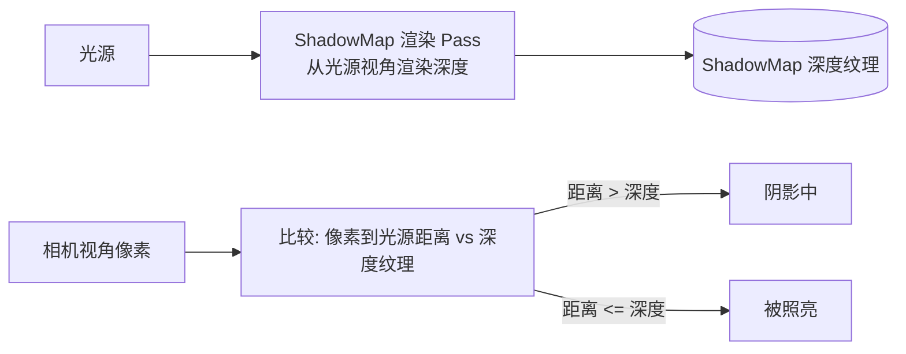
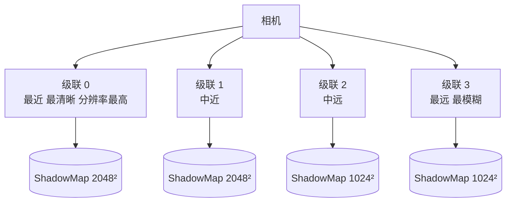
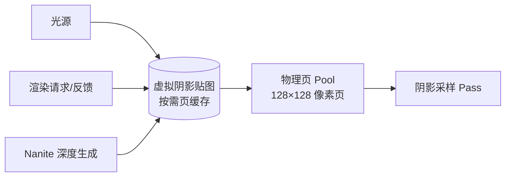
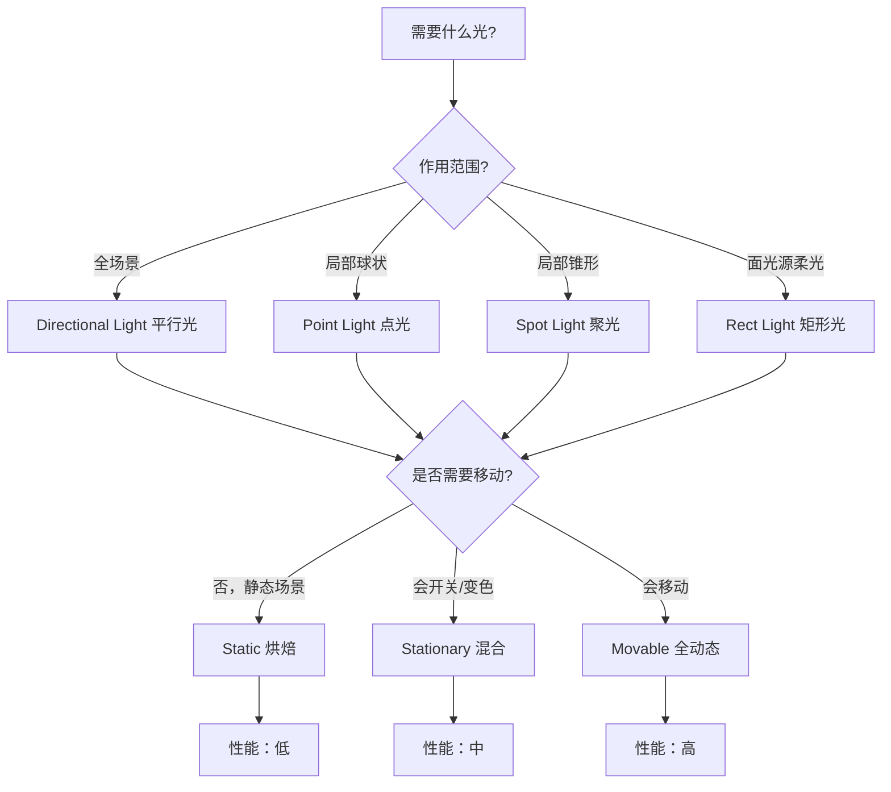

# 03 UE5 光照与阴影系统

## 1. 概述

光照与阴影决定了场景的明暗层次、空间感与氛围，也是渲染系统中**性能成本最高**的部分之一。UE5 的光照体系由两部分构成：

- **直接光照（Direct Lighting）**：平行光、点光、聚光、矩形光直接照射表面，配合阴影贴图产生投影；
- **间接光照（Indirect Lighting）**：光在表面之间反弹后的结果（GI），UE5 默认由 Lumen 动态计算，也可用 Lightmass 烘焙成 Lightmap。

阴影方面，UE5 在经典 **Shadow Map** 与 **CSM（Cascaded Shadow Maps，级联阴影贴图）** 之上，引入了 **Virtual Shadow Map（VSM，虚拟阴影贴图）** 作为默认方案，并与 Nanite、Lumen 深度联动。

阅读本文后，你应该能够：

- 区分四种光源及其参数含义（强度单位、衰减、色温、IES）；
- 理解 Static / Stationary / Movable 三态光源与烘焙的关系；
- 理解 Shadow Map 原理与 Bias 系列参数的用途（阴影粉刺、Peter Panning）；
- 掌握 CSM 级联的原理与常用 `r.Shadow.*` 命令；
- 知道距离场阴影、接触阴影、虚拟阴影贴图各自解决什么问题；
- 理解间接光照的两条路线（Lightmass 烘焙 vs Lumen 动态）。

## 2. 核心概念

### 2.1 光源类型

| 光源 | 光照形态 | 强度单位 | 典型用途 |
| --- | --- | --- | --- |
| Directional Light（平行光） | 全场景平行光（太阳/月亮） | lux（勒克斯） | 主光、室外日光 |
| Point Light（点光） | 球状全向光 | cd（坎德拉） | 灯泡、篝火、区域补光 |
| Spot Light（聚光） | 圆锥形光 | cd（坎德拉） | 手电、射灯、车灯 |
| Rect Light（矩形光） | 矩形面光源 | lux | 影视级软光、室内灯带 |
| Sky Light（天空光） | 环境光（来自天空/环境） | 无（由 Cubemap/大气贡献） | 天光、环境底色 |

### 2.2 光源移动性三态（与烘焙的关系）

| 属性 | Static（静态） | Stationary（固定） | Movable（可移动） |
| --- | --- | --- | --- |
| 直接光照 | 烘焙进 Lightmap | 实时（但阴影可烘焙） | 全实时 |
| 间接光照 | 烘焙 | 烘焙 | 实时（Lumen 或 ILC） |
| 阴影 | 烘焙 | 静态物体烘焙阴影 + 动态物体实时阴影（可叠加接触阴影） | 全实时动态阴影 |
| 性能 | 最便宜 | 折中 | 最贵 |
| 适用 | 大量静态场景光 | 场景中"不移动但会开关/变色"的光 | 玩家灯光、移动光源 |

### 2.3 阴影技术对比

| 技术 | 原理 | 优势 | 局限 |
| --- | --- | --- | --- |
| Shadow Map（阴影贴图） | 从光源视角渲染深度图，比较深度 | 通用、简单 | 分辨率固定、有 Bias 伪影 |
| CSM（级联阴影） | 视锥按距离切多段，各段一张 ShadowMap | 近处清晰远处覆盖大 | 级联间接缝、远处锯齿 |
| 距离场阴影（DF Shadow） | 用网格距离场做追踪 | 大范围柔和阴影 | 需要 Distance Field 数据、开销高 |
| 接触阴影（Contact Shadow） | 屏幕空间深度追踪 | 补细节小阴影 | 只适合近距离细节 |
| 虚拟阴影贴图 VSM（UE5 默认） | 阴影贴图虚拟化，按需分配物理页 | 支持 Nanite 高精度、动态更新高效 | 有固定显存成本、移动端不支持 |

### 2.4 间接光照方案对比

| 方案 | 类型 | 更新方式 | 适用 |
| --- | --- | --- | --- |
| Lightmass（烘焙） | 静态 Lightmap + Volumetric Lightmap | 编辑时构建 | 静态场景、移动端、低端 PC |
| Lumen | 动态全局光照 | 每帧实时 | PC/主机高画质（详见 04 篇） |
| 硬件光追 GI | 动态全局光照 | 每帧实时（RTX 等） | 顶级画质需求（UE5 中融入 Lumen 硬件模式） |

## 3. 原理详解

### 3.1 光源参数与衰减

#### 强度与单位

- **平行光**：强度以 lux 计（如晴天日光约 100000 lux 量级，引擎默认 3.14 为相对值，实际按项目光照单位规范）；
- **点光 / 聚光**：强度以 cd（坎德拉）计，配合 **Inverse Squared Falloff（平方反比衰减）**：光照强度随距离平方衰减，这是物理正确的衰减方式；
- **矩形光**：以 lux 计，模拟面光源的柔和光照。

#### 关键参数

- **Attenuation Radius（衰减半径）**：光的有效影响范围，超出即不计算；调小半径能显著省性能；
- **Source Radius / Source Length**：光源体积参数，越大阴影越柔和（软阴影）；
- **IES Profile**：真实灯具的配光曲线文件，让灯光呈现真实灯具的亮暗分布；
- **Light Temperature（色温）**：以开尔文（K）表示的灯光颜色，配合"White Balance"做白平衡校正；
- **Use Inverse Squared Falloff**：是否使用物理平方反比衰减（默认开启）。

### 3.2 Shadow Map 原理

Shadow Map 的核心思想：**从光源视角看场景，记录"谁离光源最近"，渲染时把像素深度与该深度比较，更深的就是阴影中。**



由于深度纹理是离散采样，直接比较会产生两类经典伪影：

- **Shadow Acne（阴影粉刺/自阴影伪影）**：表面自身因深度量化误差产生斑点闪烁；解决：加 **Shadow Bias（深度偏移）** 与 **Normal Bias（法线偏移）**，让比较时留出余量；
- **Peter Panning（彼得潘现象/物体与阴影分离）**：Bias 加过头，阴影"飘"离物体；解决：用 Slope Scale Depth Bias（坡度缩放偏移）——按表面与光线夹角自适应偏移，而不是统一加大。

UE5 光源面板中的阴影参数（以 Directional Light 为例）：

| 参数 | 作用 |
| --- | --- |
| Shadow Bias | 基础深度偏移，对抗粉刺 |
| Normal Bias | 沿法线方向偏移，减少自阴影 |
| Slope Scale Depth Bias | 按坡度缩放偏移（UE5 新增，效果更稳） |
| Contact Shadow Length | 接触阴影长度（屏幕空间补充细节阴影） |

### 3.3 CSM（级联阴影贴图）

平行光的阴影范围很大（整个场景），一张 ShadowMap 无法兼顾"近处清晰"与"远处覆盖"。CSM 的解决办法是：**把视锥沿深度切成多段（级联），每段分配一张分辨率独立的 ShadowMap**，近处级联分辨率高、远处级联分辨率低。



关键概念与命令：

- **级联数量**：`r.Shadow.CSM.MaxCascades`（0~4，默认 2；主机/PC 常用 3~4，移动端 1~2）；
- **动态阴影距离**：光源组件上的 `Dynamic Shadow Distance Movable Light`（动态阴影距离），决定阴影渲染到多远，超出部分无实时阴影；
- **级联过渡**：`r.Shadow.CSM.TransitionScale`（级联间过渡带宽度），过渡带处理不好会出现"阴影分层线"；
- **距离缩放**：`r.Shadow.DistanceScale`（整体缩放动态阴影距离）；
- **阴影淡出（Fade）**：阴影在最大距离处渐隐，避免突然消失。

CSM 的经典问题：

- 级联边界接缝（过渡带设置不当）；
- 远处阴影锯齿/闪烁（分辨率不足，可开 16 倍各向异性过滤或软阴影）；
- 每个级联需要重新渲染场景深度，DrawCall 与三角形数随级联数翻倍——这是阴影 Pass 开销的主要来源（`stat gpu` 中 ShadowDepths 项）。

### 3.4 阴影质量与距离控制

```ini
; ---- 阴影常用控制台变量 ----
r.Shadow.CSM.MaxCascades 3        ; 级联数量（0-4）
r.Shadow.DistanceScale 1.0        ; 阴影距离整体缩放
r.Shadow.MaxResolution 2048       ; 阴影贴图最大分辨率
r.Shadow.RadiusThreshold 0.03     ; 小于该屏幕半径的光源不渲染阴影
r.Shadow.CSM.TransitionScale 1.0  ; 级联过渡带宽度
r.Shadow.CSM.MaxFarCascades 1     ; 是否启用更远的额外级联
r.Shadow.CacheWholeSceneShadows 1 ; 缓存全场景阴影（Stationary 光源）
r.ContactShadows 0                ; 全局接触阴影开关（光源上单独配置长度）
r.Shadow.Virtual.Enable 1         ; UE5 虚拟阴影贴图开关
```

优化思路：**阴影 Pass 是"额外的场景渲染"**——每个投射阴影的光源都要多渲染一遍深度。减少阴影光源数量、缩小衰减半径/阴影距离、降低级联数与分辨率，是立竿见影的手段。

### 3.5 距离场阴影（Distance Field Shadow）

网格距离场（Mesh Distance Field）把每个静态网格体预计算成 3D 距离场（存储到网格体内任意点的最近表面距离）。基于距离场可以做：

- **距离场阴影**：大范围、柔和、支持任意光源（尤其适合平行光的大面积柔和投影，替代 CSM 的远距离部分）；
- **距离场 AO**：环境光遮蔽的补充；
- **Lumen 的追踪基础**：Lumen 的软件光线追踪主要依赖距离场（详见 04 篇）。

相关设置：项目设置开启 `Generate Mesh Distance Fields`（`r.GenerateMeshDistanceFields 1`）；`r.DistanceFieldShadowing 0/1` 开关距离场阴影。注意距离场有内存与构建时间成本，且动态网格（骨骼网格）不参与。

### 3.6 虚拟阴影贴图 VSM（UE5 默认）

UE5 的默认阴影方案是 **Virtual Shadow Map（虚拟阴影贴图）**，它把阴影贴图当作"虚拟纹理"管理：

- 整张阴影贴图是**虚拟的**，只有被需要的部分（页 Page）才会分配物理显存并按需更新；
- **平行光**使用 **Clipmap** 结构（多级 clipmap 覆盖大范围，近处精细）；
- **点光/聚光**使用 **One-Pass Projection**（一次投影，按需页更新）；
- 与 **Nanite** 深度配合：Nanite 网格可以高效地为 VSM 生成深度（用 Nanite 的软件光栅化路径）；
- 与 **Lumen** 配合：动态场景阴影与 GI 一致更新，实现"全动态"光照闭环。



相关命令：

```ini
r.Shadow.Virtual.Enable 1        ; 总开关（项目设置 Shadow Map Method = Virtual Shadow Maps）
r.Shadow.Virtual.MaxPhysicalPages 2048 ; 物理页池上限（显存预算）
stat gpu                         ; 观察 ShadowDepths / VirtualShadowMap 耗时
```

VSM 的注意点：

- 显存成本：物理页池是固定预算，场景太大、光源太多时可能"页不够用"导致阴影降级；
- 不支持移动端（UE5 移动端使用传统 ShadowMap/CSM 路径）；
- 对半透明物体、部分特殊材质（如 WPO 大幅形变）有兼容性要求，以引擎版本为准。

### 3.7 间接光照：Lightmass 烘焙 vs Lumen

#### Lightmass（烘焙路线）

Lightmass 是 UE 的静态光照烘焙器：

- 把静态物体（Static）与固定光源（Stationary）的直接光/间接光烘焙进 **Lightmap（光照贴图）**，运行时零成本采样；
- 动态物体用 **Volumetric Lightmap（体积光照贴图）** 采样场景间接光（球谐存储）；
- 关键工具：**Lightmass Importance Volume**（限定烘焙范围）、**Lightmass Portal**（窗口处的光入口）、**Lightmap Resolution**（分辨率越高越清晰，内存越大）；
- 优点：运行开销极低，移动端/低端平台主力方案；缺点：静态光照无法响应动态变化，迭代需要重新烘焙。

#### Lumen（动态路线）

Lumen 每帧计算动态全局光照，支持光源/物体任意移动（详见 04 篇）。UE5 默认开启 Lumen；项目设置 `Dynamic Global Illumination Method` 可选 None / Lumen / Screen Space（SSGI）。

```ini
r.DynamicGlobalIlluminationMethod 1 ; 0=None 1=Lumen 2=SSGI（屏幕空间 GI）
r.ReflectionMethod 1                ; 0=None 1=Lumen 2=屏幕空间反射
```

### 3.8 体积光、体积雾与光轴

- **Light Shafts（光轴）**：平行光组件上的 Light Shaft Occlusion / Bloom，模拟透过云层/窗户的光柱（老方案，效果简单）；
- **Volumetric Fog（体积雾）**：Exponential Height Fog 组件开启 Volumetric Fog（`r.VolumetricFog 1`），在 3D 网格中累积光照，产生逼真的体积光与雾中阴影，是 UE5 推荐的现代方案；开销与雾浓度、分辨率相关。

```ini
r.VolumetricFog 1          ; 体积雾开关
r.VolumetricFog.GridPixelSize 8 ; 体积雾网格像素大小（越大越省）
r.VolumetricCloud 1        ; 体积云开关（配合天空大气）
show Fog                   ; 调试开关：显示/隐藏雾
```

## 4. 代码 / 蓝图示例：光照设置与动态控制

### 4.1 典型光照搭建步骤（关卡）

```
1. 放置 Directional Light（太阳）：
   - 旋转对准太阳角度；强度按项目光照单位规范（如 lux 量级）
   - 开启 Cast Shadows；动态阴影距离按场景大小设置
   - 可选：Light Shaft / 体积雾配合（开启 Volumetric Fog）
2. 放置 Sky Light（天空光）：
   - 使用 SkyAtmosphere 自动获取天空颜色（Real Time Capture 或 Cubemap）
3. 室内补光：
   - Spot Light 做主照明，Point Light 做点缀
   - 全部开启 Inverse Squared Falloff，Attenuation Radius 收紧
4. 移动端/低端备用方案：关键光烘焙（Lightmass）+ 少量动态光
```

### 4.2 蓝图动态控制灯光

```text
蓝图示例：灯光闪烁 / 开关
- 引用 DirectionalLight Actor
- Set Intensity（修改强度）
- Set Light Color（修改颜色）
- Set Visibility / Toggle（开关）
- 注意：Movable 光源才能实时改变阴影与光照；
  Stationary 光源改变亮度/颜色会同时影响烘焙结果（建议构建后不再改）
```

### 4.3 运行时性能档位切换（Exec Console Command）

```cpp
// C++ 或蓝图中执行控制台命令切换阴影质量
GetWorld()->Exec(GetWorld(), TEXT("r.Shadow.CSM.MaxCascades 2"));
GetWorld()->Exec(GetWorld(), TEXT("r.Shadow.DistanceScale 0.5"));
GetWorld()->Exec(GetWorld(), TEXT("r.Shadow.Virtual.Enable 0"));
```

## 5. 最佳实践

1. **先定光照方案再摆灯**：静态场景优先 Lightmass 烘焙（省电省性能）；需要大量动态元素的场景用 Lumen + VSM；两者混用要注意"烘焙 + 动态"的过渡（如 Stationary 光源 + 接触阴影）。
2. **限制实时阴影光源数量**：通常 1~2 个带阴影的移动光源即可，其余用无阴影或烘焙；`r.Shadow.RadiusThreshold` 让远处小光源自动跳过阴影。
3. **CSM 从 3 级联起步**：桌面 3~4 级联 + 合理动态阴影距离；移动端 1~2 级联 + 缩小阴影距离，配合 Contact Shadow 补近景细节。
4. **Bias 参数精调**：出现闪烁加 Bias，出现 Peter Panning 减 Bias；优先调 Slope Scale Depth Bias 而非粗暴加 Shadow Bias。
5. **阴影分辨率匹配场景**：近战型游戏近景阴影 2048 足够，开放世界远景靠级联距离与淡出控制，而不是无限加分辨率。
6. **用 `stat gpu` 盯 ShadowDepths**：阴影 Pass 常常是 GPU 第一大项；优化收益顺序：减光源 > 减级联/距离 > 减分辨率。
7. **烘焙要设好 Importance Volume**：范围过大烘焙慢、过小漏光；Lightmap 分辨率按物体重要性分级，避免整关 1024 起步。
8. **统一光照单位规范**：团队约定 lux 标定（如"晴天太阳 100000 lux，室内 300~500 lux"），否则每个关卡光照强度风格不一致。

## 6. 常见问题 FAQ

### Q1：阴影闪烁 / 抖动（Shadow Flicker）？

优先排查：Bias 不足（加 Shadow Bias / Normal Bias）；级联过渡带（调 `r.Shadow.CSM.TransitionScale`）；阴影贴图分辨率不足导致的走样（提高分辨率或开启软阴影）；距离场数据过期（重新 Build Distance Fields）。

### Q2：物体与阴影分离（Peter Panning）？

Bias 过大。减小 Shadow Bias，用 Slope Scale Depth Bias 替代统一偏移；检查光源的 Dynamic Shadow Distance 与物体距离是否处于级联边缘。

### Q3：远处阴影突然消失？

动态阴影距离（Dynamic Shadow Distance）或 CSM 级联数不足；阴影 Fade 距离设置过近。适当增大距离或减少级联换取更远覆盖（视性能预算）。

### Q4：烘焙（Lightmass）后动态物体没有间接光照/发黑？

检查 Volumetric Lightmap 是否覆盖该区域（Lightmass Importance Volume 范围）；动态物体需在光照构建后重新采样（ILC/Volumetric Lightmap）；确认物体 Mobility 为 Movable 且开启了 Indirect Lighting Cache 参与。

### Q5：Stationary 光源下动态物体没有阴影或阴影生硬？

Stationary 光源的烘焙阴影只作用于静态物体；动态物体需要额外实时阴影（Per-Object Shadow）或接触阴影（Contact Shadow Length）补充。

### Q6：VSM 下阴影模糊/缺失？

物理页池不足（`r.Shadow.Virtual.MaxPhysicalPages` 调大）；光源阴影距离过大导致页被稀释；检查是否误关了 `r.Shadow.Virtual.Enable`；VSM 与某些半透明/特殊材质兼容性问题以引擎版本为准。

### Q7：体积雾很贵 / 雾中灯光闪烁？

降低体积雾分辨率（`r.VolumetricFog.GridPixelSize`）与 Temporal Reprojection 设置；减少雾中带阴影的光源数量；雾浓度动画尽量平滑。

### Q8：移动端阴影太糊？

移动端预算有限：缩小动态阴影距离 + 减少级联 + 降低阴影分辨率，近景用 Contact Shadow 或烘焙阴影弥补；必要时阴影只保留主角周围一小圈。

## 7. 关联阅读

- 本分类 [01-渲染管线概览.md](./01-渲染管线概览.md)：Lighting/Shadow Pass 在整体管线中的位置；
- 本分类 [02-材质系统详解.md](./02-材质系统详解.md)：材质如何响应光照（着色模型、Emissive）；
- 本分类 [04-Nanite与Lumen.md](./04-Nanite与Lumen.md)：Lumen 全局光照与反射的完整原理、VSM 与 Nanite 的配合；
- 本分类 [05-后处理与画面特效.md](./05-后处理与画面特效.md)：曝光与色调映射对光照表现的最终影响；
- 官方文档：Unreal Engine 5 "Lighting"、"Shadowing"、"Virtual Shadow Maps"、"Lightmass" 章节。

## 8. 附录：光照工作流与排查清单

### 8.1 光照构建（Lightmass）标准流程

```text
1. 关卡布光：放置光源、调整强度/色温/IES，标注光源移动性
2. 放置 Lightmass Importance Volume（覆盖主要游戏区域）
3. 门窗处放置 Lightmass Portal（改善室内外过渡）
4. 设置 Lightmap Resolution（按物体重要性分级）
5. 构建光照（Build Lighting），检查漏光/接缝/过暗区域
6. 动态物体验证：Volumetric Lightmap 范围内间接光照正常
7. 存档光照构建结果（光照贴图随关卡保存）
```

### 8.2 光源参数速查表

| 参数 | 位置 | 说明 |
| --- | --- | --- |
| Intensity | 光源常规 | 强度（单位见 2.1） |
| Light Color | 光源常规 | 灯色（或色温模式） |
| Temperature | 光源常规 | 色温（K），需配合白平衡 |
| Attenuation Radius | 光源常规 | 衰减半径（性能关键） |
| Source Radius / Length | 光源常规 | 软阴影/柔光 |
| IES Profile | 光源常规 | 配光曲线 |
| Cast Shadows | 光源阴影 | 阴影总开关 |
| Shadow Bias / Normal Bias | 光源阴影 | 阴影伪影控制 |
| Slope Scale Depth Bias | 光源阴影 | 坡度自适应偏移 |
| Contact Shadow Length | 光源阴影 | 接触阴影 |
| Dynamic Shadow Distance | 平行光阴影 | 动态阴影距离 |
| Light Shaft 相关 | 平行光 | 光轴效果 |

### 8.3 光照问题排查矩阵

| 现象 | 可能原因 | 排查顺序 |
| --- | --- | --- |
| 阴影闪烁 | Bias 不足 / 级联过渡 / 分辨率 | 加 Bias → 调 TransitionScale → 提分辨率 |
| 阴影分离 | Bias 过大 | 减 Bias、用 Slope Scale Bias |
| 阴影突然消失 | 阴影距离 / 级联数不足 | 查 Dynamic Shadow Distance |
| 动态物体发黑 | Volumetric Lightmap 未覆盖 | 查 Importance Volume 范围 |
| 漏光 | Lightmap 分辨率低 / 接缝 | 提分辨率、修 UV 接缝 |
| 烘焙慢 | Importance Volume 过大 | 收紧体积、分级分辨率 |
| 室内过亮/过暗 | Portal / 天光设置 | 检查 Portal 与 Sky Light 强度 |
| 阴影过黑 | 环境光不足 | 提 Sky Light / GI 强度 |
| 远处阴影糊 | 级联分辨率/距离分配 | 调级联数与距离缩放 |
| 移动光源无阴影 | 光源未开 Cast Shadows / 距离 | 检查组件与距离 |

### 8.4 光照性能预算示例（供参考）

```text
PC 中高配（60fps，GPU 预算 16ms）：
  ShadowDepths:       2.0~3.5 ms   （1 个主平行光 + 2 个局部光）
  Lumen（间接光）:     2.0~4.0 ms
  直接光照 Pass:      0.5~1.0 ms
  VolumetricFog:      0.5~1.5 ms   （开启时）

移动端（30fps，GPU 预算 33ms）：
  阴影（CSM 1~2 级联）: 1.0~2.0 ms
  光照（烘焙为主）:     0.2~0.5 ms
  体积雾:              0（关闭）
```

> 以上为经验参考值，实际以目标设备 `stat gpu` 实测为准。

### 8.5 光照工作流规范建议

- [ ] 每关明确"主光 + 补光 + 氛围光"三层结构；
- [ ] 光源移动性标注（Static/Stationary/Movable）写入关卡规范；
- [ ] 实时阴影光源数量预算写入性能红线（如"同时最多 2 个"）；
- [ ] 烘焙与动态方案切换有完整回归清单（观感 + 性能）；
- [ ] 光照迭代走版本管理，构建结果可追溯；
- [ ] 真机（移动端）必须实测：烘焙为主 + 少量动态光的组合。

### 8.6 光照与阴影术语表

| 术语 | 含义 |
| --- | --- |
| 直接光照 | 光源直接照射表面的光 |
| 间接光照 | 光在表面间反弹的光（GI） |
| Shadow Map | 从光源视角渲染的深度贴图 |
| CSM | 级联阴影贴图（视锥分段） |
| Bias | 阴影深度偏移（对抗伪影） |
| Shadow Acne | 阴影粉刺（自阴影斑点） |
| Peter Panning | 物体与阴影分离的伪影 |
| VSM | 虚拟阴影贴图（UE5 默认） |
| 距离场阴影 | 基于网格距离场的柔和阴影 |
| 接触阴影 | 屏幕空间补充的近距离细节阴影 |
| Lightmap | 光照贴图（烘焙结果） |
| Volumetric Lightmap | 体积光照贴图（动态物体间接光） |
| Lightmass | UE 静态光照烘焙器 |
| Stationary | 固定光源（实时光照 + 烘焙阴影/间接光） |
| lux / cd | 光照强度单位（勒克斯 / 坎德拉） |
| IES | 灯具配光曲线文件 |

### 8.7 光源选型决策



### 8.8 光照观感检查清单（美术向）

- [ ] 主光方向明确，场景有统一的光影方向；
- [ ] 暗部有细节（环境光/间接光足够，不死黑）；
- [ ] 高光不过曝（曝光与色调映射正确）；
- [ ] 阴影柔和度与光源大小匹配（大面积光源阴影柔和）；
- [ ] 室内外过渡自然（Portal + 曝光衔接）；
- [ ] 色温统一（暖光/冷光符合关卡氛围设定）；
- [ ] 动态元素（角色/载具）的光照与阴影与场景一致。
