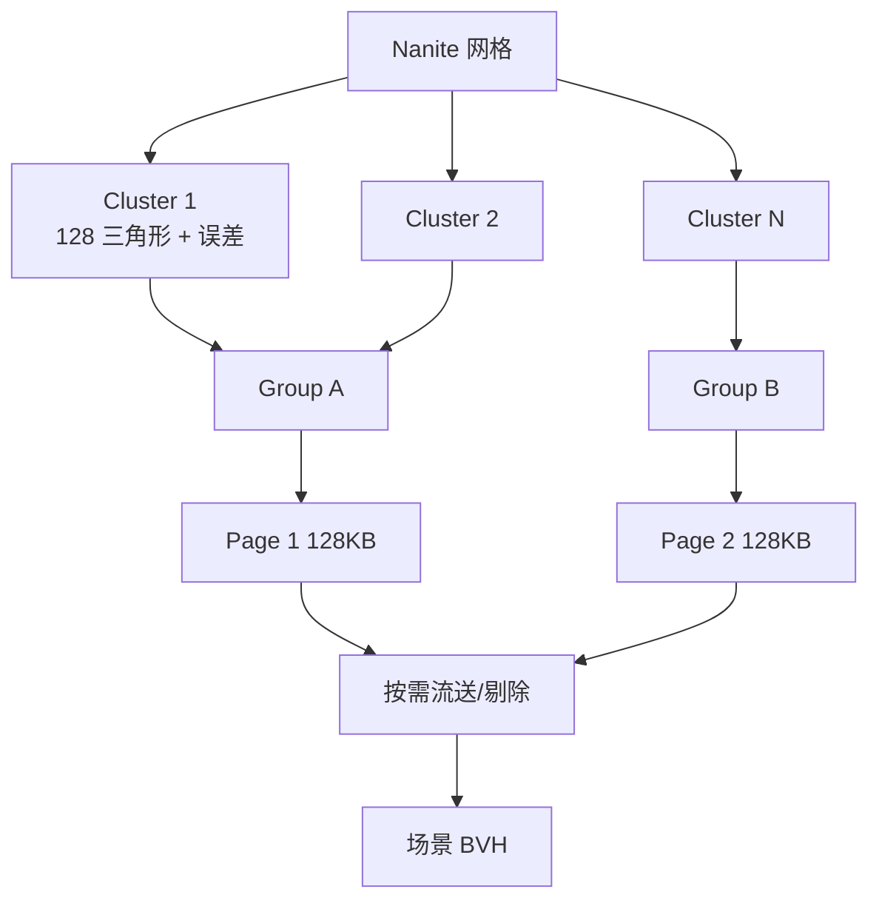
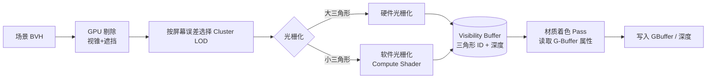
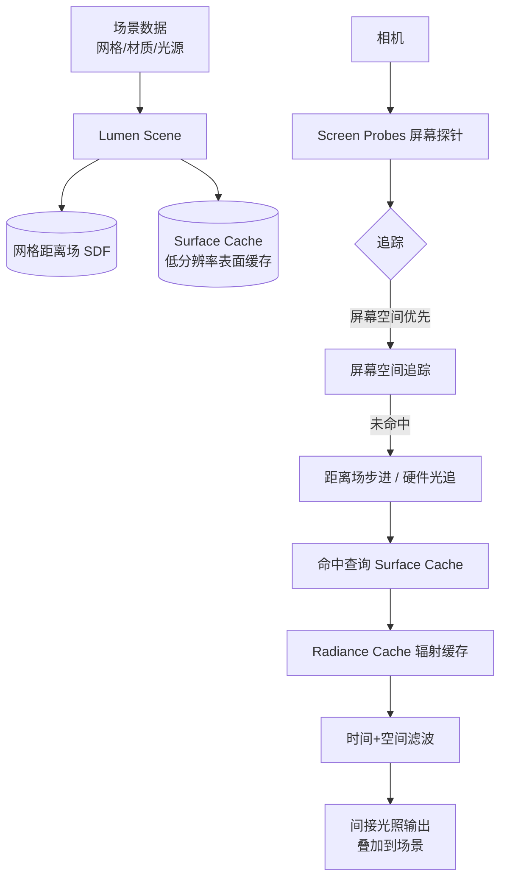
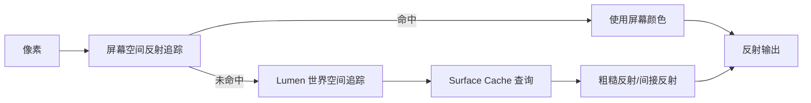

# 04 Nanite 与 Lumen
> 版本基准：UE 5.8.0（本机 `Engine/Build/Build.version`：CL 55116800，分支 `++UE5+Release-5.8`）。
> 兼容性边界：适用于 UE5.8 编辑器/运行时，UE4.27 与早期 UE5 仅作迁移背景，具体模块以正文为准。
> 官方参考：[Unreal Engine UE5.8 官方文档总页](https://dev.epicgames.com/documentation/en-us/unreal-engine)。
> 最后更新：2026-08-06（本轮元数据维护）。

## 1. 概述

**Nanite** 与 **Lumen** 是 UE5 最具标志性的两项渲染技术，共同构成了 UE5 默认的"高画质技术栈"：

- **Nanite（虚拟化几何体）**：让引擎可以渲染**电影级精度的几何体**（动辄上亿三角形），通过集群化层级 LOD、按需流送与软件光栅化，把"几何复杂度"从传统 Draw Call / 三角形预算中解放出来；
- **Lumen（全局光照与反射）**：提供**全动态的全局光照与反射**，光源、物体、材质任意变化，光照结果实时更新，不再依赖漫长的离线烘焙。

两者常配合 Virtual Shadow Map（VSM，见 03 篇）一起使用：Nanite 提供几何，Lumen 提供光照，VSM 提供阴影，形成"全动态、高精度、免烘焙"的 UE5 默认画面链路。

阅读本文后，你应该能够：

- 理解 Nanite 的集群（Cluster）/ 组（Group）/ 页（Page）数据组织与流送机制；
- 理解 Nanite 的"两遍光栅化 + Visibility Buffer"渲染流程；
- 知道 Nanite 对材质、网格类型、平台的支持范围与限制；
- 理解 Lumen 的核心组件（Screen Probes、Radiance Cache、Surface Cache、距离场追踪）；
- 会使用 `r.Nanite.*`、`r.Lumen.*` 系列命令做质量与性能调优；
- 能根据目标平台决定"Nanite + Lumen"还是"烘焙降级方案"。

## 2. 核心概念

### 2.1 Nanite 关键概念

| 概念 | 含义 |
| --- | --- |
| 虚拟化几何体 | 网格数据不再一次性全部进入显存，而是按需流送，类似虚拟纹理的思想 |
| Cluster（集群） | Nanite 数据的最小单位，约 128 个三角形为一簇 |
| Group（组） | 多个 Cluster 的组合，构成 LOD 层级与页面分配的中间层级 |
| Page（页） | 流送单元（约 128KB），多个 Group 打包成一页 |
| 层级 LOD | 每个 Cluster 自带多个 LOD 层级，按屏幕空间误差自动选择 |
| BVH（包围体层级结构） | 场景级加速结构，用于 GPU 端剔除与 LOD 选择 |
| 软件光栅化 | 小三角形在 Compute Shader 中逐块光栅化，避免固定管线开销 |
| Visibility Buffer | 先只记录"哪个三角形可见"，再做材质着色（两遍方案） |

### 2.2 Lumen 关键概念

| 概念 | 含义 |
| --- | --- |
| Lumen Scene | Lumen 维护的场景表示（网格距离场 + 表面缓存 + 光源数据） |
| Screen Probes（屏幕探针） | 屏幕空间按块放置的辐照度探针，用于间接光采集 |
| Radiance Cache（辐射缓存） | 世界空间缓存的光照辐射度，供多次反弹复用 |
| Surface Cache（表面缓存） | 低分辨率烘焙的材质属性缓存，供光线命中后查询着色 |
| SDF（Signed Distance Field，距离场） | 网格体的 3D 距离场，软件光追的加速结构 |
| 时间/空间滤波 | 对追踪结果做时序累积与空间去噪，消除噪点 |
| 硬件光追模式 | 用 RTX 等硬件 RT 核替换软件追踪，质量更高、更贵 |

## 3. 原理详解

### 3.1 Nanite 的数据组织：Cluster / Group / Page

Nanite 网格在导入时（或编辑器构建时）被离线处理成层级结构：

1. 网格体被切成 **Cluster**（约 128 个三角形一组，附带误差度量）；
2. 多个 Cluster 组成 **Group**；
3. 多个 Group 打包成 **Page**（约 128KB），Page 是**流送（Streaming）**的基本单元；
4. 每个 Cluster 内还有**多个 LOD 层级**：每一级都是上一级的简化子集，误差逐级放大；
5. 整个场景的所有 Nanite 网格再组织进一个 **场景级 BVH**，供 GPU 端做视锥剔除、遮挡剔除与 LOD 选择。



流送与内存：

- 只有**屏幕空间误差超过阈值**的 Cluster 才需要被加载与渲染，远处物体可以只保留极低 LOD；
- `r.Nanite.Streaming.StreamingPoolSize`（5.8 名称，默认 512MB）控制 Nanite 流送池大小，`stat nanite` 可查看流送状态与内存占用；
- 正因为"按需加载"，Nanite 场景可以远超显存的几何总量——这是"虚拟化"的核心含义。

### 3.2 Nanite 渲染流程：两遍光栅化与 Visibility Buffer

Nanite 每帧的渲染分为两大阶段：

1. **Binning/光栅化阶段**：GPU 用 Compute Shader 处理场景 BVH，做视锥/遮挡剔除，并按屏幕空间误差为每个 Cluster 选择 LOD；
2. **Shading 阶段**：基于 Visibility Buffer（记录每个像素命中的三角形 ID 与重心坐标），再执行材质着色。



为什么要"软件光栅化"？

- 传统 GPU 光栅化每个三角形都有固定开销，三角形小到亚像素时，光栅化器变成瓶颈；
- Nanite 把"小三角形"（投影后小于一定像素）交给 Compute Shader 批量处理，用更高效的方式产生像素，从而突破传统几何吞吐上限；
- 大三角形仍走硬件光栅化（效率更高），两种路径自动分流。

Visibility Buffer 的意义：

- 传统管线每个像素在光栅化时就执行像素着色器；Nanite 先记录"这个像素属于哪个三角形"，再统一做材质着色；
- 好处：几何处理与材质着色解耦，三角形数量不再直接决定着色次数；为后续渲染特性（如 VSM 深度生成、Lumen 场景更新）提供统一入口。

### 3.3 Nanite 的支持范围与限制

#### 支持的网格与平台

- **静态网格体（Static Mesh）**：完全支持（默认在 UE5 中开启 Nanite）；
- **植被实例（Foliage）**：支持，Nanite 网格可作为植被大规模实例化；
- **Landscape**：UE5.4 起提供 Nanite Landscape（实验性，以版本为准）；
- **骨骼网格（Skeletal Mesh）**：UE5.4 起提供实验性支持；早期版本不支持，常规角色仍用传统渲染；
- **平台要求**：需要 DX12 / Vulkan 且 Shader Model 6 支持（PC、PS5、XSX）；**DX11 与移动端不支持 Nanite**；
- **World Partition**：与 Nanite 良好配合，支持大世界流送。

#### 材质限制

| 版本 | 支持情况 |
| --- | --- |
| UE5.0 | 仅 Opaque 不透明、Default Lit / Unlit；不支持 Masked、位移、WPO |
| UE5.1 | 增加 World Position Offset（实验性） |
| UE5.2+ | 增加 Masked 与 Pixel Depth Offset（实验性，后续版本逐步稳定） |
| 始终限制 | 不支持 Tessellation（细分曲面）、Displacement（位移贴图）；半透明材质不支持；材质数量/复杂度有编译约束 |

注意：Nanite 材质虽然只能使用有限特性，但基础 PBR 效果（BaseColor/Normal/Roughness/Metallic/Emissive）全部支持，绝大多数场景足够。

#### 其他限制

- **Morph Target**：早期不支持，部分版本支持有限（以引擎版本为准）；
- **顶点动画**：通过 WPO 实现，但大幅形变的网格注意性能；
- **Custom 深度 / 描边类效果**：Nanite 网格在部分自定义渲染特性上需要特殊处理（如描边可用材质或后处理方案替代）；
- **物理/碰撞**：Nanite 只影响渲染，物理仍需传统碰撞体。

### 3.4 Nanite 性能与调试

```ini
; ---- Nanite 常用命令 ----
r.Nanite 1                     ; Nanite 总开关（0 关闭退回传统渲染）
r.Nanite.MaxPixelsPerEdge 1    ; 每边最大像素误差（越大 LOD 越粗、越省）
r.Nanite.Streaming.StreamingPoolSize 512 ; 流送池大小（MB）（5.8 名称）
stat nanite                    ; Nanite 统计（绘制数、Cluster、三角形、光栅化方式占比）
```

调试建议：

- `stat nanite` 查看 RasterBins、Cluster、三角形数量与软件/硬件光栅化比例；
- 编辑器视口的 **Nanite 可视化模式**（Lit / BaseColor / Normals / Overdraw / Triangles 等）快速定位问题；
- 性能主要受**光栅化负载**与**流送**影响：过度超远视距 + 全屏高密度几何会拉高 GPU 时间；
- 大量**动态变化的 Nanite 网格**（每帧 WPO 形变）会削弱 Nanite 的静态优化，谨慎使用。

### 3.5 Lumen 架构：动态全局光照

Lumen 的目标：**免烘焙、全动态的全局光照与反射**。它的工作流程大致如下：

1. **维护 Lumen Scene**：把场景网格转成 SDF（距离场）+ 表面缓存（低分辨率材质属性），光源信息汇总；
2. **屏幕探针采集**：屏幕空间按块放置 Screen Probes，每个探针向多个方向发射追踪光线（先尝试屏幕空间追踪，未命中再走世界空间）；
3. **世界空间追踪**：对屏幕空间未命中的光线，用距离场步进（SDF Ray Marching）或硬件光追继续追踪；
4. **命中查询**：命中表面后，从 Surface Cache 读取该处的材质属性与辐射度；
5. **缓存与复用**：Radiance Cache 缓存世界空间各区域的辐射度，多次反弹与相邻帧复用，避免每帧重复计算；
6. **滤波与累积**：时间累积（Temporal）+ 空间滤波（Spatial）去除噪点，输出间接漫反射光。



关键设计点：

- **分级追踪**：屏幕空间追踪又快又准但信息有限；距离场追踪覆盖全场景但略粗糙；硬件光追最准但最贵——Lumen 按需组合；
- **Surface Cache** 是性能核心：光线命中后不跑完整材质，而是查低分辨率缓存，代价是"缓存分辨率"限制（远处细节会糊）；
- **Lumen 是近似 GI**：它追求"看起来正确"，而非物理精确；与路径追踪（如离线渲染）有差距，但实时游戏中观感优秀。

### 3.6 Lumen 反射

Lumen 反射（Lumen Reflections）是 Lumen 的反射组件：

- 优先使用**屏幕空间追踪**（复用屏幕颜色），未命中部分用 Lumen 世界空间追踪补全；
- 支持**粗糙反射**（粗糙度越高反射越模糊），这是传统 SSR 难以做到的；
- 与反射捕获（Reflection Capture）方案相比，Lumen 反射是动态的、连续的，不需要布点；
- 相关命令：`r.Lumen.Reflections.Allow 0/1`、`r.Lumen.Reflections.HardwareRayTracing 0/1`（5.8；旧 `r.Lumen.Reflections.Method` 已移除）。



### 3.7 Lumen 质量与性能调优

```ini
; ---- Lumen 常用命令 ----
r.Lumen.DiffuseIndirect.Allow 1       ; 间接漫反射总开关
r.Lumen.Reflections.Allow 1           ; Lumen 反射开关
r.DynamicGlobalIlluminationMethod 1   ; 0=None 1=Lumen 2=SSGI
r.ReflectionMethod 1                  ; 0=None 1=Lumen 2=屏幕空间反射
r.Lumen.HardwareRayTracing 1          ; 5.8 硬件光追总开关（旧 r.Lumen.DiffuseIndirect.Method 已移除）
r.Lumen.Reflections.HardwareRayTracing 1 ; 5.8 Lumen 反射硬件光追开关（旧 r.Lumen.Reflections.Method 已移除）
; 5.8 无 stat lumen（Lumen 各阶段耗时并入 stat gpu 的 Lumen 段）
```

性能特征：

- Lumen 有**固定开销**（每帧维护 Lumen Scene、探针更新），低端硬件上可能占 2~5ms 甚至更多；
- 硬件光追模式需要支持 DXR 的显卡（RTX 等），质量更高但更贵；
- 调优手段：降低 Screen Probe 追踪数量与分辨率（`r.Lumen.ScreenProbeGather.*` 系列）、Radiance Cache 分辨率（`r.Lumen.RadianceCache.*` 系列）、Surface Cache 分辨率（`r.Lumen.SurfaceCache.*` 系列）——具体命令名随引擎版本有差异，用 `help` 查询；
- **移动端不支持 Lumen**：移动端需回到烘焙光照或简化方案；
- 与烘焙（Lightmass）相比，Lumen 免去了烘焙流程，但 GPU 开销更高——**静态为主的关卡在低端平台上仍可用烘焙**。

### 3.8 Lumen 与半透明、与 Nanite/VSM 的协作

- **半透明（Translucency）**：默认不参与 Lumen 间接光与反射（或支持有限），半透明物体通常自行发光或依赖环境；
- **与 Nanite**：Nanite 网格自动参与 Lumen Scene（距离场生成），两者天生配套；
- **与 VSM**：Lumen 的间接光 + VSM 的阴影 + Nanite 的几何，三者构成 UE5 默认"动态三件套"；任意关闭其一都会改变画面表现（如关闭 VSM 后阴影回到 CSM 风格）。

### 3.9 项目落地策略

| 目标平台 | 建议方案 |
| --- | --- |
| PC 高配 / PS5 / XSX | Nanite + Lumen（软件）全开；硬件光追可选 |
| PC 中低配 | Nanite 保留，Lumen 降质量或改用烘焙 + 屏幕空间反射 |
| 移动端 | 无 Nanite/Lumen：烘焙光照 + 传统几何 + CSM/烘焙阴影 |
| 大世界 | Nanite + World Partition + Lumen，注意流送预算 |

## 4. 代码 / 蓝图示例：设置与切换

### 4.1 项目设置（Project Settings → Rendering）

```
- Dynamic Global Illumination Method: Lumen（或 None）
- Reflections Method: Lumen（或 Screen Space）
- Shadow Map Method: Virtual Shadow Maps（或 Shadow Maps）
- Generate Mesh Distance Fields: 开启（Lumen 软件追踪与距离场阴影需要）
- Nanite: 默认开启（网格资产上单独设置）
```

### 4.2 运行时画质档位切换

```cpp
// 高画质档
GetWorld()->Exec(GetWorld(), TEXT("r.Lumen.DiffuseIndirect.Allow 1"));
GetWorld()->Exec(GetWorld(), TEXT("r.Lumen.Reflections.Allow 1"));
GetWorld()->Exec(GetWorld(), TEXT("r.Nanite 1"));
GetWorld()->Exec(GetWorld(), TEXT("r.Shadow.Virtual.Enable 1"));

// 低画质档
GetWorld()->Exec(GetWorld(), TEXT("r.Lumen.DiffuseIndirect.Allow 0"));
GetWorld()->Exec(GetWorld(), TEXT("r.Lumen.Reflections.Allow 0"));
GetWorld()->Exec(GetWorld(), TEXT("r.Shadow.Virtual.Enable 0"));
```

### 4.3 蓝图示例：根据设备性能切换 Lumen 质量

```text
蓝图流程：
1. 启动时读取设备性能等级（如平台标记 / 设置界面选项）
2. 性能较好 → 执行命令 "r.Lumen.DiffuseIndirect.Allow 1"
3. 性能一般 → 执行命令 "r.Lumen.DiffuseIndirect.Allow 0" + "r.ScreenPercentage 75"
4. 切换后调用 Rebuild 或等待引擎自动收敛（Lumen 有收敛动画）
```

## 5. 最佳实践

1. **默认三件套优先，按平台降级**：PC/主机默认 Nanite + Lumen + VSM；移动端与低端 PC 直接规划烘焙方案，不要试图"半开 Lumen"。
2. **Nanite 网格规范**：导入时确认 Nanite 构建成功（资产详情页有 Nanite 状态）；保留原始网格数据仅在需要编辑器编辑时开启。
3. **材质克制**：Nanite 材质走默认 PBR 能力即可；需要 Masked/WPO 时确认引擎版本支持并评估性能。
4. **Lumen 调优用分级**：先保证 `stat gpu` 中 Lumen 总耗时在预算内，再逐项调 ScreenProbe/RadianceCache/SurfaceCache 分辨率。
5. **半透明物体规划**：Lumen 对半透明支持有限，场景中的玻璃/水用"材质自发光 + 环境反射"思路，避免依赖 GI。
6. **监控流送**：`stat nanite` + `stat streaming` 定期检查 Nanite 流送池与纹理流送，大世界尤其重要。
7. **保留烘焙回退**：即使默认 Lumen，也建议保留一套烘焙光照配置（如低画质档），便于中低端设备与调试对比。
8. **版本升级后回归**：Nanite/Lumen 每个 UE5 小版本都有功能与性能变化，升级引擎后务必回归画面与性能基线。

## 6. 常见问题 FAQ

### Q1：Nanite 网格显示不出来 / 变成普通网格？

检查资产是否成功构建 Nanite（资产详情页 Nanite 状态）；确认平台支持（DX12/Vulkan、SM6）；确认材质满足 Nanite 限制（如 Masked 在旧版本不支持）；确认 `r.Nanite 1` 未被关闭。

### Q2：Nanite 网格上的材质没有效果 / 某些节点不生效？

Nanite 材质有特性限制（无细分、位移，Masked/WPO 分版本支持）。查看材质编辑器对 Nanite 的提示，把不支持的连线移到"非 Nanite 版本"（如使用 Quality Switch 按平台分流）。

### Q3：Lumen 画面有噪点 / 闪烁？

时间累积未收敛（刚移动相机或光源后短暂噪点是正常收敛过程）；可提高 Screen Probe 追踪数量或开启硬件光追；检查 Surface Cache 分辨率是否过低；关闭 TAA 会导致 Lumen 去噪失效（不要关闭 TAA/TSR）。

### Q4：Lumen 太贵，怎么降？

降级顺序建议：关闭 Lumen 反射（`r.Lumen.Reflections.Allow 0`）→ 降低 ScreenProbe 追踪量 → 降低 Radiance Cache / Surface Cache 分辨率 → 关闭间接光（`r.Lumen.DiffuseIndirect.Allow 0`）→ 整体切回烘焙 + SSR。

### Q5：Lumen 下暗部发灰 / 对比度不足？

Lumen 的近似 GI 会提亮暗部；可通过后期（曝光、对比度、LUT）修正观感，或调低间接光强度（`r.Lumen.DiffuseIndirect.*` 相关强度项，以版本为准）。

### Q6：移动端能开 Nanite/Lumen 吗？

不能。UE5 移动端（ES3.1）不支持 Nanite 与 Lumen，必须使用传统几何与烘焙光照方案；真机验证时注意移动端渲染路径与桌面差异（见 02 篇 Mobile 章节）。

### Q7：Lumen 与烘焙光照能混用吗？

可以但不推荐直接混用同一区域（会出现间接光"双重叠加"）。常见做法：全局 Lumen + 个别区域烘焙（或反之），用体积控制范围；切换时注意衔接处的观感。

### Q8：Nanite 场景中自定义描边 / 风格化渲染怎么做？

由于 Nanite 不支持传统顶点级自定义，常用方案：后期描边（深度/法线边缘检测）、材质 Emissive 方案、或对非 Nanite 副本做描边。引擎版本更新后支持面会扩大，关注官方更新说明。

## 7. 关联阅读

- 本分类 [01-渲染管线概览.md](./01-渲染管线概览.md)：Nanite/Lumen 在 BasePass 与光照 Pass 中的位置；
- 本分类 [03-光照与阴影系统.md](./03-光照与阴影系统.md)：VSM 虚拟阴影贴图与 Lumen 的配合、距离场阴影；
- 本分类 [02-材质系统详解.md](./02-材质系统详解.md)：Nanite 材质限制与 PBR 基础；
- 本分类 [05-后处理与画面特效.md](./05-后处理与画面特效.md)：Lumen 输出的 HDR 场景颜色如何经后处理呈现；
- 官方文档：Unreal Engine 5 "Nanite Virtualized Geometry"、"Lumen Global Illumination and Reflections"、"Virtual Shadow Maps" 章节。

## 8. 附录：Nanite / Lumen 排查与版本差异

### 8.1 stat nanite 输出字段解读

| 字段 | 含义 | 关注点 |
| --- | --- | --- |
| Draw | Nanite 绘制调用 | 与场景复杂度的关系 |
| Clusters | 实际渲染的 Cluster 数 | 过高说明细节预算大 |
| Triangles | 光栅化三角形数 | 软件/硬件光栅化分流后总量 |
| RasterBins | 光栅化分箱数 | GPU 负载参考 |
| Software / Hardware Rasterization | 软件/硬件光栅化占比 | 小三角形多则软件占比高 |
| Streaming | 流送状态（加载/卸载） | 池大小是否够用 |
| Memory | Nanite 显存占用 | 与 Streaming.PoolSize 对比 |

### 8.2 Lumen 质量档位参考

| 档位 | 配置思路 | 适用 |
| --- | --- | --- |
| 极高 | 硬件光追（r.Lumen.HardwareRayTracing 1）+ 高追踪量 | 顶级 PC、过场 |
| 高 | 软件 ScreenProbes 全开 + Lumen 反射 | 主机/高配 PC 默认 |
| 中 | 关闭 Lumen 反射、降低追踪量 | 中配 PC |
| 低 | 间接光降分辨率 + Surface Cache 降级 | 低配 PC |
| 关闭 | r.Lumen.DiffuseIndirect.Allow 0，回退烘焙 + SSR | 移动端/最低档 |

### 8.3 常见日志关键词与处理

| 日志/现象 | 含义 | 处理 |
| --- | --- | --- |
| "Nanite not supported" | 平台/管线不支持 | 检查 DX12/Vulkan、SM6、r.Nanite |
| 材质警告 "not supported by Nanite" | 材质特性超限 | 拆分支或换支持的特性 |
| "Lumen scene … rebuild" 类提示 | Lumen 场景数据重建 | 等待收敛或重新构建距离场 |
| 距离场构建失败 | Mesh Distance Field 生成失败 | 检查网格有效性、重新构建 |
| 显存不足警告 | Streaming 池/物理页池吃紧 | 调 PoolSize / MaxPhysicalPages |
| 半透明无 GI | Lumen 对半透明支持有限 | 材质自发光或环境反射补偿 |

### 8.4 Nanite / Lumen 版本演进简表

| 引擎版本 | Nanite 里程碑 | Lumen 里程碑 |
| --- | --- | --- |
| UE5.0 | 发布（静态网格、Opaque 材质） | 发布（软件 GI/反射） |
| UE5.1 | WPO 实验支持 | 反射质量提升、性能优化 |
| UE5.2 | Masked / Pixel Depth Offset 实验支持 | 半透明反射改进 |
| UE5.3 | 稳定性与性能提升 | 移动端友好性评估（仍不支持） |
| UE5.4 | Skeletal Mesh / Landscape 实验支持 | 性能与质量再优化 |
| UE5.5+ | 持续扩展支持面 | 持续优化 |

> 具体支持面以当前引擎版本的官方 Release Notes 为准。

### 8.5 落地检查清单

- [ ] 目标平台确认：PC/主机（支持）/ 移动端（不支持）；
- [ ] 项目设置：GI = Lumen、Reflections = Lumen、Shadow = VSM、Generate Mesh Distance Fields 开启；
- [ ] 资产审计：确认关键网格 Nanite 构建成功；
- [ ] 材质审计：无超限材质节点（Masked/WPO 版本匹配）；
- [ ] 性能基线：stat gpu 中 Nanite / Lumen / Shadow 三段耗时入档；
- [ ] 低端回退方案就绪：烘焙光照配置 + SSR + CSM 配置；
- [ ] 大世界流送实测：stat nanite / stat streaming 无异常堆积；
- [ ] 引擎升级后回归画面与性能基线。

### 8.6 Nanite / Lumen 术语表

| 术语 | 含义 |
| --- | --- |
| 虚拟化几何体 | 按需流送的网格数据管理（类虚拟纹理思想） |
| Cluster | Nanite 数据簇（约 128 三角形） |
| Group / Page | 簇的组合 / 流送页（约 128KB） |
| BVH | 包围体层级结构（剔除与 LOD 选择） |
| Visibility Buffer | 记录可见三角形 ID 的缓冲（两遍渲染） |
| 软件光栅化 | Compute Shader 中光栅化小三角形 |
| 屏幕空间误差 | 决定 LOD 选择的投影误差度量 |
| Screen Probes | 屏幕空间辐照度探针（Lumen 间接光采集） |
| Radiance Cache | 世界空间辐射缓存（Lumen） |
| Surface Cache | 低分辨率表面属性缓存（Lumen） |
| SDF | 有向距离场（Lumen 追踪加速结构） |
| 时间/空间滤波 | Lumen 去噪手段（依赖 TAA/TSR 历史） |
| 硬件光追 | 使用 RT 核的 Lumen 模式（DXR） |

### 8.7 一句话总结

```text
Nanite = 几何虚拟化：集群 LOD + 按需流送 + 两遍光栅化，让三角形预算失效；
Lumen = 光照虚拟化：探针 + 缓存 + 分级追踪，让烘焙流程失效；
VSM   = 阴影虚拟化：虚拟页按需分配，让阴影分辨率预算失效。
三者组合 = UE5 默认的"全动态高精度"画面链路。
```
