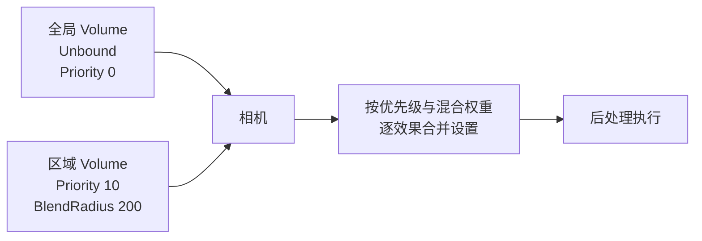
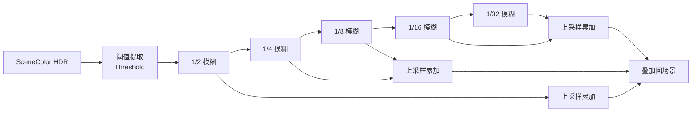
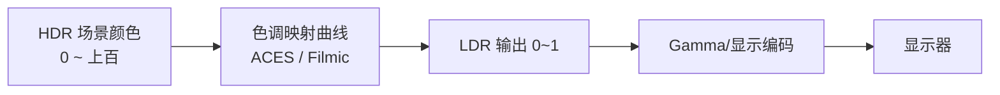

# 05 UE5 后处理与画面特效
> 版本基准：UE 5.8.0（本机 `Engine/Build/Build.version`：CL 55116800，分支 `++UE5+Release-5.8`）。
> 兼容性边界：适用于 UE5.8 编辑器/运行时，UE4.27 与早期 UE5 仅作迁移背景，具体模块以正文为准。
> 官方参考：[Unreal Engine UE5.8 官方文档总页](https://dev.epicgames.com/documentation/en-us/unreal-engine)。
> 最后更新：2026-08-06（本轮元数据维护）。

## 1. 概述

后处理（Post Processing）是渲染管线的**最后一道工序**：场景已经渲染成一张 HDR 图像后，引擎在**全屏像素**上依次应用一系列效果，最终输出到屏幕。UE 中常见的后处理效果包括：

- **Bloom（泛光）**：亮部向外扩散的辉光；
- **Tonemapping（色调映射）**：把 HDR 亮度压缩到显示器可显示的 LDR 范围；
- **Auto Exposure（自动曝光）**：模拟人眼/相机根据场景亮度自适应；
- **Depth of Field（景深）**：焦点外的模糊；
- **Motion Blur（运动模糊）**：快速运动时的拖影；
- **Color Grading（颜色分级）**：白平衡、对比度、色调风格化；
- **AA（抗锯齿）与 TSR（时序超分辨率）**：消除锯齿并提升分辨率观感；
- **SSAO/GTAO、SSR**：屏幕空间环境光遮蔽与反射；
- **Vignette、Film Grain**：暗角与胶片颗粒等风格化效果。

后处理由 **Post Process Volume（后处理体积）** 统一管理，既可以全场景生效，也可以在特定区域局部生效。后处理往往是"画面质感"的最后一公里，也是性能上容易被忽略的固定开销。

阅读本文后，你应该能够：

- 理解 Post Process Volume 的优先级与混合机制；
- 掌握 Bloom、Tonemapping、自动曝光、DOF、运动模糊的原理与关键参数；
- 理解 TAA/TSR 与分辨率的关系，会使用 `r.ScreenPercentage` 做分辨率缩放；
- 会用 `r.*` 系列命令调试后处理各效果；
- 能写一个简单的 Post Process 材质（后期材质）；
- 知道后处理的性能预算与优化顺序。

## 2. 核心概念

### 2.1 Post Process Volume 属性

| 属性 | 作用 |
| --- | --- |
| Priority（优先级） | 数值高的 Volume 覆盖数值低的 |
| Blend Radius（混合半径） | 体积边界处的过渡范围，>0 时边缘平滑混合 |
| Blend Weight（混合权重） | 该体积设置生效的强度（0~1） |
| Unbound（无边界） | 勾选后作用于整个场景（全局后期） |
| Enabled | 开关 |
| 世界设置中的全局 Volume | 关卡默认的"全局后期"，通常勾选 Unbound |

### 2.2 后处理效果族

| 效果族 | 包含内容 | 关键参数 |
| --- | --- | --- |
| 曝光 | Auto Exposure（Eye Adaptation） | Min/Max EV100、测光模式、速度 |
| Bloom | 泛光 | Intensity、Threshold、Size 1~6 |
| 色调映射 | Tonemapping、Gamma | ACES/Filmic 曲线、Slope/Toe/Shoulder |
| 颜色分级 | White Balance、Shadow/Midtone/Highlight、LUT | 色温、色调、分级曲线 |
| 景深 | Cinematic / Gaussian DOF | Focal Distance、Aperture、Sensor Width |
| 运动模糊 | Camera / Per-Object Motion Blur | Intensity、Max |
| 抗锯齿 | FXAA、TAA、MSAA、TSR | r.AntiAliasingMethod |
| 屏幕空间效果 | SSAO/GTAO、SSR | Intensity、Radius、Quality |
| 风格化 | Vignette、Film Grain、Scene Color Tint | 强度、响应曲线 |
| 渲染特性 | TSR、动态分辨率 | r.ScreenPercentage、r.DynamicRes.* |

## 3. 原理详解

### 3.1 Post Process Volume 与混合机制

Post Process Volume 是一个**长方体区域**，放置在关卡中：

- 相机在体积内时，该体积的设置生效；多个体积重叠时按 **Priority** 从高到低覆盖；
- **Blend Radius** 让体积边界处产生渐变（从外部设置过渡到内部设置）；
- **Blend Weight** 控制该体积整体效果的强度；
- **Unbound** 体积作用于全场景，适合放"全局后期"（曝光、色调映射、Bloom 默认值）；
- 每个效果可以独立设置"是否被体积覆盖"（如只让某个体积改 Bloom，其余继承全局）。



常见坑：

- 相机在两个体积交界处时，效果可能"跳变"——用 Blend Radius 消除；
- 忘记勾选 Unbound 的全局体积被误删后，画面会"裸奔"（无色调映射、过曝）；
- 后期效果过多叠加会让画面发灰/发糊，注意"减法思维"。

### 3.2 Bloom（泛光）

Bloom 模拟相机/人眼的"亮部溢出"：超过一定亮度的区域向四周扩散光晕。实现上采用**多级降采样模糊金字塔**：

1. 从 HDR 场景颜色中提取超过 **Threshold（阈值）** 的亮部；
2. 对亮部图像连续降采样（1/2、1/4、1/8、1/16、1/32、1/64…）；
3. 每级做高斯模糊（半径逐级不同，对应 Bloom Size 1~6）；
4. 从最小一级开始逐级上采样并累加；
5. 叠加回场景颜色。



关键参数：

| 参数 | 含义 |
| --- | --- |
| Intensity | 整体强度 |
| Threshold | 亮部提取阈值，越高泛光越少 |
| Size 1~6 | 各级模糊半径（对应金字塔各级） |
| Tint | 各级泛光染色（暖色泛光等） |

命令：`r.BloomQuality 0~5`（0 关闭，数值越高越精细）。Bloom 对性能的影响主要在带宽与模糊开销，关掉或降级对低端设备收益明显。

### 3.3 Tonemapping（色调映射）与色彩管理

场景渲染结果是 **HDR（高动态范围）** 的（亮度可以远超 1.0），而显示器只能显示 **LDR（低动态范围，0~1）**。色调映射负责把 HDR 压缩映射到 LDR，同时保留高光细节与对比度。



UE5 的色调映射：

- **ACES**：UE5 默认色调曲线（电影工业标准，暗部与高光都有良好滚降，观感偏"电影感"）；
- **Filmic**：UE4 时代默认曲线，风格与 ACES 略有差异（旧项目兼容用）；
- **自定义 LUT**：项目可烘焙自己的 3D LUT（查找表）做统一调色，保证多平台观感一致；
- **Slope / Toe / Shoulder**：曲线三段的斜率控制（中间调对比度、暗部压缩、高光压缩），美术调"电影感"常用。

注意：色调映射在**曝光之后**执行；画面"过曝发白"或"整体发灰"通常要先检查曝光，再检查色调映射设置。

### 3.4 Auto Exposure（自动曝光 / Eye Adaptation）

自动曝光模拟人眼/相机对场景亮度的适应：

- **测光模式**：
  - **Histogram（直方图）**：统计画面亮度分布，按比例确定目标曝光（默认，最稳）；
  - **Average（平均）**：简单平均亮度；
  - **Manual（手动）**：固定曝光，不自动调整；
- **EV100**：曝光值单位（类似相机的 EV），**Min EV100 / Max EV100** 限定自动曝光范围；
- **Speed Up / Speed Down**：变亮/变暗的适应速度；
- **Exposure Compensation（曝光补偿）**：在自动曝光基础上整体加减亮度。

```ini
r.EyeAdaptationQuality 2       ; 曝光质量（0 关闭/最简，2 最高）
r.EyeAdaptation.MethodOverride -1 ; 5.8：-1=不覆盖（按后处理体积），1=直方图，2=Auto Basic，3=Manual
show EyeAdaptation             ; 调试显示曝光信息
```

常见问题：

- 进出洞穴/房间时画面"闪一下"——适应速度过快或过慢，调 Speed Up/Down；
- 自动曝光被大面积纯黑/纯白画面带偏——用直方图模式 + 设置合理范围；
- 需要固定观感的过场动画——切 Manual 模式固定曝光。

### 3.5 Color Grading（颜色分级）

颜色分级是对最终画面做风格化调色：

| 参数组 | 作用 |
| --- | --- |
| White Balance（白平衡） | 色温（Temperature）与色调（Tint）校正，配合光源色温使用 |
| Global | 全局饱和度与对比度 |
| Shadow / Midtone / Highlight | 对暗部/中间调/高光分别调色（可带色调） |
| Misc | 色偏、染色等附加控制 |
| LUT | 自定义 3D LUT，全画面统一映射（风格化最彻底） |


实践建议：颜色分级尽量**统一在全局 Volume 与 LUT 中做**，不要每级后期各自乱调，否则画面风格失控且难以排查。

### 3.6 Depth of Field（景深）

景深模拟相机对焦：焦点附近的物体清晰，远离焦点的物体模糊。

- **Cinematic DOF（电影级景深）**：基于物理相机模型（光圈、焦距、传感器），效果最真实；
- **Gaussian DOF（高斯景深）**：简单高斯模糊，开销低，适合移动端；
- 关键参数：**Focal Distance（对焦距离）**、**Aperture（光圈）**、**Sensor Width（传感器宽度）**、Near/Far 过渡范围。

```ini
r.DepthOfFieldQuality 2    ; 5.8：0=关，2=默认高质量（旧 r.DepthOfField.Method 已移除，方法由后处理体积控制）
```

注意：

- 半透明物体默认不参与 DOF（Separate Translucency 可配置）；
- 过场动画常用"手动对焦 + 焦点拉移"制造电影感；
- 游戏性场景（尤其竞技类）建议关闭或极弱景深，避免干扰操作。

### 3.7 Motion Blur（运动模糊）

运动模糊让快速运动的物体产生拖影，提升流畅感：

- **Per-Object（物体运动模糊）**：基于物体的 Velocity（运动矢量）缓冲；
- **Camera（相机运动模糊）**：相机快速转动时的全屏拖影；
- 参数：**Intensity（强度）**、**Max（最大模糊像素）**。

```ini
r.MotionBlur.Amount 0.5   ; 强度 0~1
r.MotionBlur.Max 16       ; 最大模糊像素数
show MotionBlur           ; 调试开关
```

运动模糊依赖 **Velocity Buffer**（见 01 篇 G-Buffer 表）：任何导致"像素与几何运动不一致"的情况（如 WPO 形变、粒子、动态阴影）都可能让模糊表现异常。竞技游戏通常关闭或降到最低。

### 3.8 抗锯齿与 TSR（时序超分辨率）

UE5 的抗锯齿选项（`r.AntiAliasingMethod`）：

| 值 | 方案 | 说明 |
| --- | --- | --- |
| 0 | None | 无抗锯齿（不推荐） |
| 1 | FXAA | 后处理式快速抗锯齿，便宜但会糊细节 |
| 2 | TAA | 时序抗锯齿，UE 默认，效果好但有拖影风险 |
| 3 | MSAA | 硬件抗锯齿，仅前向路径可用 |
| 4 | TSR | 时序超分辨率（UE5.1+），渲染低分辨率 + 重建高分辨率 |

**TSR（Temporal Super Resolution）** 是 UE5 的招牌技术：

- 以低于输出分辨率（如 50%~75%）的 `r.ScreenPercentage` 渲染，再用时序累积与运动矢量重建出高分辨率画面；
- 效果接近原生分辨率甚至更好（抗锯齿 + 细节重建），性能收益显著；
- 与 DLSS（NVIDIA）/ FSR（AMD）类似，但 UE 内置、跨平台；
- 需要运动矢量与 TAA 同源的历史缓冲，**不要与 TAA 同时混用**。

```ini
r.ScreenPercentage 75     ; 渲染分辨率百分比（TSR 建议 50~100）
r.AntiAliasingMethod 4    ; 4 = TSR
r.TemporalAACurrentFrameWeight 0.04 ; TAA 当前帧权重（调拖影）
```

### 3.9 SSAO / GTAO 与 SSR

- **SSAO（屏幕空间环境光遮蔽）**：利用深度缓冲计算像素周围被遮挡的程度，给暗部增加接触阴影般的立体感；
- **GTAO（Ground Truth AO）**：更精确的 AO 算法（UE5 中可选），质量更好、开销略高；
- **SSR（屏幕空间反射）**：用屏幕颜色做反射，近景反射效果好，屏幕外信息缺失时会有"反射消失"。

```ini
r.AmbientOcclusion.Method 1  ; 0=SSAO 1=GTAO
r.AmbientOcclusionLevels 2   ; AO 强度等级
r.SSR.Quality 2              ; 屏幕空间反射质量 0~4
```

注意：开启 Lumen 时，Lumen 自带部分间接光遮蔽效果，SSAO/GTAO 的设置与 Lumen 叠加时注意观感（可能过暗）。

### 3.10 其他风格化效果

- **Vignette（暗角）**：画面四周变暗，聚焦中心；
- **Film Grain（胶片颗粒）**：模拟胶片噪点，增加质感（有 Intensity 与 Response 参数）；
- **Scene Color Tint**：整体染色；
- **Lens Flare（镜头光晕）**：通常由 Bloom + 光源实现（UE 内置较简，重度的用插件/材质）。

### 3.11 后期材质（Post Process Material）

把材质的 **Material Domain 设为 Post Process**，即可写全屏自定义后期：

- 输入：PostProcessInput0（场景颜色）、SceneTexture 节点（SceneColor、SceneDepth、WorldNormal、CustomDepth 等）；
- 输出：Emissive 即最终画面颜色；
- 应用方式：在 Post Process Volume 的 Post Process Materials 数组中添加该材质。

```text
后期材质示例：扫描线 / 色调分离
1. 材质域：Post Process
2. 采样 SceneTexture: SceneColor 作为基础
3. 用 Screen Position（屏幕坐标）做条纹遮罩
4. 叠加：Lerp(原图, 原图*条纹强度, 条纹遮罩)
5. 输出到 Emissive
```

注意：后期材质是全屏执行的，**每个像素每帧都要跑一遍**，复杂节点会直接增加 GPU 时间（`stat gpu` 中 PostProcess 项可见）。

## 4. 代码 / 蓝图示例：后处理控制

### 4.1 常用控制台命令速查

```ini
; ---- 整体 ----
show PostProcessing           ; 一键开关全部后处理
r.AntiAliasingMethod 2        ; 0=None 1=FXAA 2=TAA 3=MSAA 4=TSR
r.ScreenPercentage 100        ; 渲染分辨率（配合 TSR 降分辨率）

; ---- 曝光 ----
r.EyeAdaptationQuality 2
r.EyeAdaptation.MethodOverride -1

; ---- Bloom ----
r.BloomQuality 5              ; 0~5

; ---- 景深 / 运动模糊 ----
r.DepthOfFieldQuality 2       ; 5.8（旧 r.DepthOfField.Method 已移除）
r.MotionBlur.Amount 0.5
r.MotionBlur.Max 16

; ---- AO / SSR ----
r.AmbientOcclusion.Method 1
r.AmbientOcclusionLevels 2
r.SSR.Quality 2

; ---- 分辨率与动态分辨率 ----
r.DynamicRes.OperationMode 1  ; 1=按 GPU 时间自适应
```

### 4.2 蓝图动态切换画质档

```text
蓝图流程（设置界面"画质"选项）：
1. 低画质：
   Exec Console Command: "r.BloomQuality 0"
   Exec Console Command: "r.MotionBlur.Amount 0"
   Exec Console Command: "r.ScreenPercentage 75"
2. 高画质：
   Exec Console Command: "r.BloomQuality 5"
   Exec Console Command: "r.ScreenPercentage 100"
   Exec Console Command: "r.AntiAliasingMethod 4"（TSR）
3. 同时在蓝图里切换 Post Process Volume 的 Blend Weight 实现风格差异
```

### 4.3 C++ 运行时修改后期设置

```cpp
// 获取全局后期设置并修改曝光
if (APostProcessVolume* Vol = GetWorld()->GetWorldSettings()->DefaultPostProcessVolume())
{
    Vol->Settings.bOverride_AutoExposureMinEV100 = true;
    Vol->Settings.AutoExposureMinEV100 = -2.0f;
    Vol->Settings.bOverride_BloomIntensity = true;
    Vol->Settings.BloomIntensity = 0.8f;
}
```

## 5. 最佳实践

1. **全局后期统一管理**：一个 Unbound 全局 Volume 管曝光/Bloom/色调映射，区域 Volume 只做局部效果；避免多个 Volume 互相打架。
2. **曝光优先于调色**：画面不好看先查曝光（EV 范围、测光模式），再动颜色分级——顺序颠倒会越调越乱。
3. **TSR 是 PC/主机默认上采样方案**：`r.ScreenPercentage 75` + TSR 通常比 100% 原生渲染更省且观感接近；竞技模式可关 TSR 换更高原生分辨率。
4. **后处理性能预算**：`stat gpu` 中 PostProcess 段常占 1~3ms；超预算时按"运动模糊 > 景深 > SSR > Bloom 级数 > AO"顺序降级。
5. **后期材质克制**：全屏后期材质优先用低开销节点；能用内置效果就不用自写后期材质。
6. **移动端后期从简**：移动端建议 Bloom 关或 1~2 级、无 DOF、无 SSR；动态分辨率与 TSR（若支持）是移动端提帧利器。
7. **风格一致化**：用 LUT 统一多平台观感；定期用"参考画面对比"校准色调，避免各关卡风格漂移。
8. **调试手段**：`show PostProcessing` 关闭全部后处理对比"素颜画面"，快速判断问题出在后处理还是场景本身。

## 6. 常见问题 FAQ

### Q1：画面整体过曝 / 发白？

先查自动曝光：Min/Max EV100 范围是否合理、测光模式是否被大面积亮部带偏；再查 Bloom Intensity 与 Threshold；最后查色调映射（ACES vs Filmic）与 Exposure Compensation。

### Q2：画面发灰、对比度不足？

常见原因：色调映射曲线斜率（Slope）偏低、Global 对比度被改低、或"后期材质叠加了灰色"。用 `show PostProcessing` 排除法定位是哪一层。

### Q3：DOF 不生效？

检查 DOF Method（0 为关闭）；确认相机在 Post Process Volume 影响范围内（或全局 Volume 开启）；半透明物体默认不参与；Cinematic DOF 需要正确的 Sensor Width 与 Focal Distance。

### Q4：TSR 下画面有拖影/鬼影？

降低 `r.TemporalAACurrentFrameWeight` 类权重参数或调整 TSR 历史缓冲设置；运动矢量异常（WPO/粒子）也会导致鬼影；竞技类可改用 TAA 或提高 ScreenPercentage。

### Q5：运动模糊"糊成一片"或方向不对？

检查 Velocity Buffer 是否有效（关闭了 Velocity 输出、或物体用了不支持的运动方式）；降低 `r.MotionBlur.Amount` 与 Max；全屏相机旋转时模糊过大是正常现象，控制相机角速度或调低强度。

### Q6：后期材质画面发黑/报错？

后期材质必须正确连接输出（Emissive）；SceneTexture 节点选择受支持的场景纹理（部分纹理需开启相应渲染特性，如 CustomDepth）；全屏材质错误会直接导致黑屏，先在材质编辑器预览中确认。

### Q7：不同平台画面观感不一致？

平台差异主要来自：分辨率/AA/TSR 设置、色调映射版本（打包平台设置）、后处理质量档位（Scalability）。统一使用 LUT 与 Scalability 配置，并在各平台截图对比校准。

### Q8：动态分辨率开启后画面忽清晰忽模糊？

这是正常行为（GPU 压力大时降分辨率保帧率）。若波动明显，收紧 `r.DynamicRes.*` 的帧率目标区间与最小 ScreenPercentage；或改为固定档位切换。

## 7. 关联阅读

- 本分类 [01-渲染管线概览.md](./01-渲染管线概览.md)：后处理在管线末端的位置、Velocity Buffer、stat gpu 观测；
- 本分类 [02-材质系统详解.md](./02-材质系统详解.md)：Post Process 材质域详解；
- 本分类 [03-光照与阴影系统.md](./03-光照与阴影系统.md)：光源色温与白平衡联动、体积雾；
- 本分类 [04-Nanite与Lumen.md](./04-Nanite与Lumen.md)：Lumen 输出与后期曝光的衔接；
- 分类外："07-UI与性能优化"（若有）：Scalability 分级、动态分辨率落地经验；
- 官方文档：Unreal Engine 5 "Post Process Effects"、"Temporal Super Resolution"、"Color Grading" 章节。

## 8. 附录：后处理工作流速查

### 8.1 后处理效果性能参考（按开销从低到高）

| 效果 | 相对开销 | 降级/关闭方式 | 备注 |
| --- | --- | --- | --- |
| Vignette / Film Grain | 极低 | 参数调 0 | 风格化，可常开 |
| Color Grading / LUT | 极低 | 保持全局统一 | 一般无性能负担 |
| Auto Exposure | 低 | r.EyeAdaptationQuality 0 | 直方图模式有少量开销 |
| Tonemapping | 低 | 不可关闭（可切曲线） | 必选环节 |
| FXAA | 低 | r.AntiAliasingMethod 1 | 画面偏糊 |
| TAA | 中 | r.AntiAliasingMethod 2 | 有拖影风险 |
| TSR | 中 | r.AntiAliasingMethod 4 | 上采样重建，省带宽 |
| Bloom | 中 | r.BloomQuality 0 | 级数越高越贵 |
| Motion Blur | 中 | r.MotionBlur.Amount 0 | 竞技向常关 |
| GTAO | 中高 | r.AmbientOcclusion.Method/Levels | 半分辨率计算 |
| SSR | 高 | r.SSR.Quality 0 | 全屏追踪昂贵 |
| Cinematic DOF | 高 | r.DepthOfFieldQuality 0/2（5.8） | 全屏模糊链 |
| 后期材质 | 视节点而定 | 移除材质引用 | 全屏每像素执行 |

### 8.2 画面问题 → 参数调整对照表

| 现象 | 优先检查项 | 调整方向 |
| --- | --- | --- |
| 过曝发白 | 曝光范围 / Bloom | 调小 Max EV100、Bloom Intensity |
| 整体发灰 | 对比度 / 色调映射 | 提高 Global Contrast、调 Slope |
| 暗部死黑 | Min EV100 / 暗部曲线 | 提高 Min EV100、调 Toe |
| 高光刺眼 | Threshold / 高光曲线 | 提高 Bloom Threshold、调 Shoulder |
| 偏色（黄/蓝） | 白平衡 | 按色温反方向补偿 |
| 锯齿明显 | AA 设置 | 开 TAA/TSR，或提高 ScreenPercentage |
| 动态模糊拖影 | 运动矢量 / TSR 权重 | 检查 Velocity、调历史权重 |
| 近景细节糊 | DOF 对焦距离 | 调整 Focal Distance 或关闭 DOF |
| 画面闪烁 | 曝光适应速度 / TAA | 调 Speed Up/Down、检查 AA |
| 屏幕四周暗 | Vignette | 调低或关闭 Vignette Intensity |

### 8.3 后处理排查流程（五分钟定位法）

```text
1. show PostProcessing 0/1 —— 判断问题是否出自后处理
2. 逐个关闭效果族：Bloom → DOF → Motion Blur → AO → SSR
   （控制台命令见 4.1，逐个对比画面）
3. 确认全局 Volume 与区域 Volume 的优先级/权重是否正常
4. 用 stat gpu 观察 PostProcess 段耗时是否异常
5. 最后检查后期材质列表（逐个移除验证）
```

### 8.4 移动端后处理推荐配置

```ini
; 移动端推荐（低画质档）
r.BloomQuality 1            ; 1 级泛光或关闭
r.DepthOfFieldQuality 0     ; 关闭景深（5.8；旧 r.DepthOfField.Method 已移除）
r.MotionBlur.Amount 0       ; 关闭运动模糊
r.AmbientOcclusionLevels 0  ; 关闭 AO
r.SSR.Quality 0             ; 关闭屏幕空间反射
r.ScreenPercentage 75       ; 降分辨率
r.AntiAliasingMethod 3      ; 前向路径可用 MSAA（或 TAA）
```

### 8.5 后期效果制作清单（美术向）

- [ ] 全局 Volume：曝光范围、ACES 曲线、Bloom 基础值、LUT 挂载；
- [ ] 过场专属 Volume：Cinematic DOF、固定曝光（Manual）、胶片颗粒；
- [ ] 战斗/竞技场景：关闭或降低 DOF、Motion Blur、Bloom；
- [ ] 载具/速度感场景：增强 Motion Blur、加 Vignette；
- [ ] 风格化关卡：后期材质（描边、色调分离）+ LUT 定制；
- [ ] 每关提交前：三档画质（低/中/高）截图对比 + stat gpu 记录。
